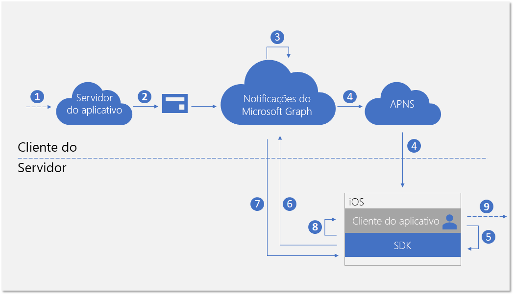
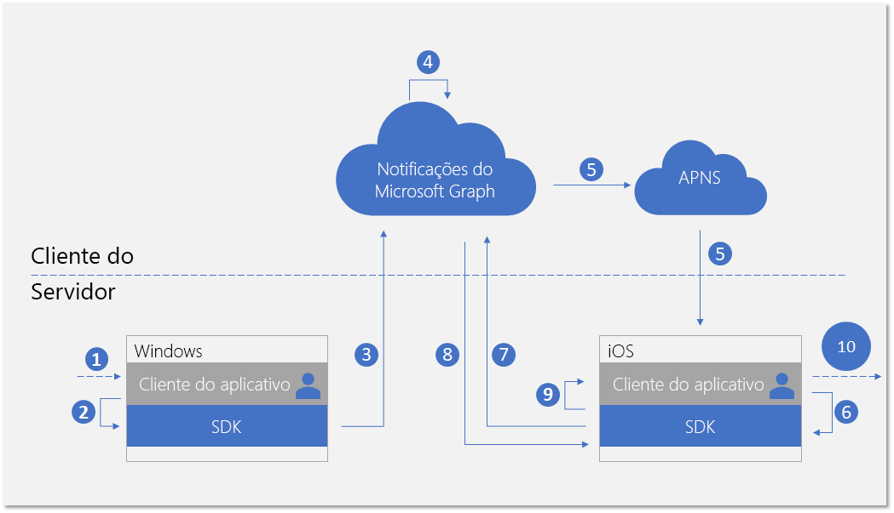

# <a name="integrate-your-ios-app-with-the-client-side-sdk-for-user-notifications"></a><span data-ttu-id="f8f14-103">Integração do aplicativo iOS no SDK do lado do cliente para notificações ao usuário</span><span class="sxs-lookup"><span data-stu-id="f8f14-103">Integrate your iOS app with the client-side SDK for user notifications</span></span>

<span data-ttu-id="f8f14-104">Após [registrar seu aplicativo](notifications-integration-app-registration.md) no Portal do Azure e integrar suas [experiências entre dispositivos](notifications-integration-cross-device-experiences-onboarding.md) no Partner Center de Desenvolvimento, a próxima etapa é integrar seu aplicativo de cliente com o SDK do lado do cliente para aplicativos iOS.</span><span class="sxs-lookup"><span data-stu-id="f8f14-104">After you [register your app](notifications-integration-app-registration.md) in the Azure Portal and onboard your [cross-device experiences](notifications-integration-cross-device-experiences-onboarding.md) in the Partner Dev Center, the next step is to integrate your client app with the client-side SDK for iOS apps.</span></span>  

<span data-ttu-id="f8f14-105">Com o SDK do cliente, o aplicativo pode executar as etapas necessárias de registro para receber notificações publicadas do servidor do aplicativo direcionadas ao usuário conectado atualmente.</span><span class="sxs-lookup"><span data-stu-id="f8f14-105">With the client-side SDK, your app can perform the necessary registration steps to start receiving notifications published from your app server targeted at the user who is currently signed in.</span></span> <span data-ttu-id="f8f14-106">O SDK então gerencia as notificações no lado do cliente, incluindo receber novas notificações, gerenciar o estado de notificações para alcançar cenários como descartar de forma universal e recuperar o histórico completo de notificações.</span><span class="sxs-lookup"><span data-stu-id="f8f14-106">The SDK then manages the notifications on the client side, including receiving new incoming notifications, managing the state of notifications to achieve scenarios like universal dismiss, and retrieving full notification history.</span></span> 

## <a name="new-incoming-notification-flow"></a><span data-ttu-id="f8f14-107">Fluxo de notificação de entrada</span><span class="sxs-lookup"><span data-stu-id="f8f14-107">New incoming notification flow</span></span>

<span data-ttu-id="f8f14-108">Para receber novas notificações, o fluxo de dados é mostrado no diagrama a seguir.</span><span class="sxs-lookup"><span data-stu-id="f8f14-108">For receiving new incoming notifications, the data flow is shown in the following diagram.</span></span>



<span data-ttu-id="f8f14-110">O processo envolve alguns componentes:</span><span class="sxs-lookup"><span data-stu-id="f8f14-110">The process involves a few components:</span></span>

* <span data-ttu-id="f8f14-111">Servidor de aplicativo – back-end do aplicativo</span><span class="sxs-lookup"><span data-stu-id="f8f14-111">App server - The back end of your application</span></span>
* <span data-ttu-id="f8f14-112">Cliente do aplicativo – front-end do aplicativo (um aplicativo UWP, Android ou iOS)</span><span class="sxs-lookup"><span data-stu-id="f8f14-112">App client - The front end of your application (a UWP app, an Android app, or an iOS app)</span></span>
* <span data-ttu-id="f8f14-113">Notificações do Microsoft Graph – o componente do serviço que permite que notificações ao usuário sejam publicadas, armazenadas e sincronizadas em instâncias diferentes dos clientes do aplicativo em vários dispositivos e plataformas</span><span class="sxs-lookup"><span data-stu-id="f8f14-113">Microsoft Graph notifications - The service component that enables user notifications to be published, stored, and synced across different instances of app clients across devices and platforms</span></span>
* <span data-ttu-id="f8f14-114">APNs – o Apple Push Notification Service fornecido pela Apple para aplicativos do iOS.</span><span class="sxs-lookup"><span data-stu-id="f8f14-114">APNs - The Apple Push Notification Service provided by Apple for iOS apps.</span></span> <span data-ttu-id="f8f14-115">As notificações do Microsoft Graph usam esse serviço para sinalizar clientes do aplicativo do iOS sobre as alterações de dados de notificação do usuário.</span><span class="sxs-lookup"><span data-stu-id="f8f14-115">Microsoft Graph notifications use this service to signal the iOS app clients about user notification data changes.</span></span>  

<span data-ttu-id="f8f14-116">O diagrama mostra as próximas etapas:</span><span class="sxs-lookup"><span data-stu-id="f8f14-116">The diagram shows the following steps:</span></span> 

1. <span data-ttu-id="f8f14-117">Lógica do aplicativo.</span><span class="sxs-lookup"><span data-stu-id="f8f14-117">Application logic.</span></span> <span data-ttu-id="f8f14-118">Essa etapa captura o que aciona a notificação para ser publicada para o usuário.</span><span class="sxs-lookup"><span data-stu-id="f8f14-118">This step captures what triggers the notification to be published to the user.</span></span> <span data-ttu-id="f8f14-119">Isso é lógica específica do aplicativo e pode ser uma atualização de dados ou evento sobre algo diferente do Microsoft Graph, como um novo evento do calendário ou atribuição de tarefas, ou o que o serviço de aplicativo quer notificar o usuário.</span><span class="sxs-lookup"><span data-stu-id="f8f14-119">This is app-specific logic, and can be an event or data update about something else in Microsoft Graph, such as a new calendar event or task assignment, or else your app service wants to notify the user about.</span></span>
2. <span data-ttu-id="f8f14-120">O servidor do aplicativo publica uma notificação para o usuário alvo pela API de notificações do Microsoft Graph.</span><span class="sxs-lookup"><span data-stu-id="f8f14-120">The app server publishes a notification to the targeted user via the Microsoft Graph notifications API.</span></span> <span data-ttu-id="f8f14-121">Para saber mais, consulte [integração com o lado do servidor](notifications-integrating-app-server.md).</span><span class="sxs-lookup"><span data-stu-id="f8f14-121">For more details, see [server side integration](notifications-integrating-app-server.md).</span></span>
3. <span data-ttu-id="f8f14-122">Ao receber a solicitação Web com nova notificação, as notificações do Microsoft Graph mantêm o conteúdo da notificação em segurança na nuvem para esse aplicativo e esse usuário.</span><span class="sxs-lookup"><span data-stu-id="f8f14-122">On receiving the web request containing the new notification, Microsoft Graph notifications persists the content of the notification securely in the cloud for this app and this user.</span></span>
4. <span data-ttu-id="f8f14-123">Para cada instância do cliente do aplicativo inscrita para receber notificações para esse usuário, as notificações do Microsoft Graph envia um sinal para notificar cliente do aplicativo, por meio do serviço de envio por push nativo fornecido pelo sistema operacional.</span><span class="sxs-lookup"><span data-stu-id="f8f14-123">For each app client instance subscribing to receive notifications for this user, Microsoft Graph notifications sends a signal to notify the app client, via the native push service provided by the operating system.</span></span> <span data-ttu-id="f8f14-124">Nesse caso, o aplicativo é um aplicativo iOS, e ele usa [notificação de atualização APNs em segundo plano] para enviar o sinal.</span><span class="sxs-lookup"><span data-stu-id="f8f14-124">In this case, the application is an iOS app, and it uses [APNs background update notification] to send the signal.</span></span> 
5. <span data-ttu-id="f8f14-125">Depois que o aplicativo for sinalizado pelas notificações por push de entrada, ele pede ao SDK para buscar as alterações no repositório de notificações do usuário.</span><span class="sxs-lookup"><span data-stu-id="f8f14-125">After the application is signaled by the incoming push notification, it asks the SDK to fetch for the changes in the user notification store.</span></span> 
6. <span data-ttu-id="f8f14-126">O SDK estabelece uma conexão segura e compatível com o repositório de notificações do usuário no Microsoft Graph.</span><span class="sxs-lookup"><span data-stu-id="f8f14-126">The SDK establishes a secure and compliant connection with the user notifications store in Microsoft Graph.</span></span>
7. <span data-ttu-id="f8f14-127">O SDK recebe as alterações de dados – nesse caso, o novo conteúdo de notificação.</span><span class="sxs-lookup"><span data-stu-id="f8f14-127">The SDK gets the data changes - in this case, the new notification contents.</span></span> 
8. <span data-ttu-id="f8f14-128">O SDK dispara retornos de evento para notificá-o aplicativo após as alterações são recuperadas com êxito.</span><span class="sxs-lookup"><span data-stu-id="f8f14-128">The SDK fires event callbacks to notify the app after the changes are successfully retrieved.</span></span> 
9. <span data-ttu-id="f8f14-129">Lógica do aplicativo.</span><span class="sxs-lookup"><span data-stu-id="f8f14-129">Application logic.</span></span> <span data-ttu-id="f8f14-130">Essa etapa captura o que o aplicativo escolhe fazer dentro retorno de chamada do evento.</span><span class="sxs-lookup"><span data-stu-id="f8f14-130">This step captures what your app chooses to do inside the event callback.</span></span> <span data-ttu-id="f8f14-131">Normalmente, isso resulta em alterações locais de dados do aplicativo e atualizações de interface do usuário locais.</span><span class="sxs-lookup"><span data-stu-id="f8f14-131">Usually, this results in local app data changes and local UI updates.</span></span> <span data-ttu-id="f8f14-132">Nesse caso, o aplicativo geralmente cria um alerta iOS para notificar o usuário sobre o conteúdo da notificação.</span><span class="sxs-lookup"><span data-stu-id="f8f14-132">In this case,  the app usually constructs an iOS alert to notify the user about the notification contents.</span></span>

## <a name="notification-update-flow"></a><span data-ttu-id="f8f14-133">Fluxo de atualização de notificação</span><span class="sxs-lookup"><span data-stu-id="f8f14-133">Notification update flow</span></span>

<span data-ttu-id="f8f14-134">Uma das principais vantagens de usar as notificações do Microsoft Graph é que ele mantêm as notificações na nuvem com segurança e as transforma em um tipo de recurso com estado.</span><span class="sxs-lookup"><span data-stu-id="f8f14-134">One of the main benefits for using Microsoft Graph notifications is that it persists notifications in the cloud securely and turns them into a stateful resource type.</span></span> <span data-ttu-id="f8f14-135">Portanto, ele pode ajudar o aplicativo a gerenciar e a sincronizar o estado correto das notificações em diferentes dispositivos para o usuário conectado em um cenário entre dispositivos.</span><span class="sxs-lookup"><span data-stu-id="f8f14-135">Therefore, it can help your application to manage and sync the correct state of the notifications across different devices for the same signed in user in a cross-device scenario.</span></span> <span data-ttu-id="f8f14-136">Quando uma notificação estiver marcada como descartada ou como lida em um dispositivo, os outros dispositivos podem ser notificados em tempo real.</span><span class="sxs-lookup"><span data-stu-id="f8f14-136">When a notification is marked as dismissed, or marked as read on one device, the other devices can be notified in real-time.</span></span> <span data-ttu-id="f8f14-137">"Manipulada uma vez, descartada em qualquer lugar" pode se tornar a promessa real como parte da experiência de notificação para seus usuários.</span><span class="sxs-lookup"><span data-stu-id="f8f14-137">"Handled once, dismissed everywhere" can become a true promise as part of the notification experience for your users.</span></span> 

<span data-ttu-id="f8f14-138">O diagrama a seguir mostra o fluxo de dados para alterar o estado de uma notificação ou excluir a notificação em um dispositivo e receber/manipular a alteração de estado ou a exclusão em outro dispositivo.</span><span class="sxs-lookup"><span data-stu-id="f8f14-138">The following diagram shows the data flow for changing the state of a notification or deleting the notification on one device, and receiving/handling the state change or the deletion on another device.</span></span>



<span data-ttu-id="f8f14-140">Observe que a segunda parte do fluxo é semelhante ao fluxo de tratamento de novas notificações de entrada.</span><span class="sxs-lookup"><span data-stu-id="f8f14-140">Notice that the second part of the flow is similar to the flow for handling new incoming notifications.</span></span> <span data-ttu-id="f8f14-141">Isso é esperado – o padrão de programação no SDK  foi projetado para que o cliente do aplicativo possa lidar com todos os tipos de alterações de dados de notificações do usuário (novas notificações de entrada, alterações de estado de notificação, notificação excluída) de maneira semelhante.</span><span class="sxs-lookup"><span data-stu-id="f8f14-141">This is by design - the  programming pattern of the SDK is designed so that the application client can handle all types of user notification data changes (new incoming notifications, notification state changes, notification deleted) in a similar way.</span></span>  

<span data-ttu-id="f8f14-142">O diagrama mostra as próximas etapas:</span><span class="sxs-lookup"><span data-stu-id="f8f14-142">The diagram shows the following steps:</span></span>

1. <span data-ttu-id="f8f14-143">Lógica do aplicativo.</span><span class="sxs-lookup"><span data-stu-id="f8f14-143">Application logic.</span></span> <span data-ttu-id="f8f14-144">Algo aciona a notificação para ser alterada ou excluída.</span><span class="sxs-lookup"><span data-stu-id="f8f14-144">Something triggers the notification to be changed or deleted.</span></span> <span data-ttu-id="f8f14-145">Em geral, qualquer evento possível pode acionar a alteração de uma notificação.</span><span class="sxs-lookup"><span data-stu-id="f8f14-145">In general, any event can trigger a notification to change.</span></span> 
2. <span data-ttu-id="f8f14-146">Chamada do aplicativo para o SDK do cliente para atualizar ou excluir uma notificação.</span><span class="sxs-lookup"><span data-stu-id="f8f14-146">App calling into the client SDK to update or delete a notification.</span></span> <span data-ttu-id="f8f14-147">Atualmente, expomos duas propriedades sobre alterações de estado – **userActionState** e **readState** – mas o aplicativo pode definir esses estados e quando eles precisam ser atualizados.</span><span class="sxs-lookup"><span data-stu-id="f8f14-147">Currently, we expose two properties regarding state changes - **userActionState** and **readState** - but your application can define these states and when they need to be updated.</span></span> <span data-ttu-id="f8f14-148">Por exemplo, quando um usuário descartar a notificação pop-up, você pode atualizar o **userActionState** para Descartado.</span><span class="sxs-lookup"><span data-stu-id="f8f14-148">For example, when a user dismisses the notification popup, you can update the **userActionState** to be Dismissed.</span></span> <span data-ttu-id="f8f14-149">Quando um usuário clica na notificação pop-up e inicia o aplicativo para consumir o conteúdo correspondente do aplicativo, você pode atualizar o **userActionState** para ativado e atualizar o **readState** para Lido.</span><span class="sxs-lookup"><span data-stu-id="f8f14-149">When a user clicks the notification popup and launches the app to consume corresponding app content, you can update the **userActionState** to be Activated and update the **readState** to be Read.</span></span> 
3. <span data-ttu-id="f8f14-150">Depois que a API correspondente é chamada para atualizar ou excluir uma notificação, o SDK irá chamar o repositório na nuvem de notificação de usuário para dispersar essa alteração para as outras instâncias de cliente do aplicativo com o mesmo usuário conectado.</span><span class="sxs-lookup"><span data-stu-id="f8f14-150">After the corresponding API is called to update or delete a notification, the SDK will call into the user notification store in the cloud in order to fan-out this change to the other app client instances with the same signed in user.</span></span> 
4. <span data-ttu-id="f8f14-151">Ao receber a solicitação de atualização/exclusão de um cliente, as notificações do Microsoft Graph irão atualizar o repositório de notificação e identificar as outras instâncias de cliente do aplicativo inscritas para essa alteração.</span><span class="sxs-lookup"><span data-stu-id="f8f14-151">On receiving the update/delete request from a client, Microsoft Graph notifications will update the notification store, and identify the other app client instances that subscribed to this change.</span></span>
5. <span data-ttu-id="f8f14-152">Para cada inscrição do cliente do aplicativo, as notificações do Microsoft Graph envia um sinal para notificar o cliente do aplicativo, por meio do serviço de envio por push nativo fornecido pelo sistema operacional.</span><span class="sxs-lookup"><span data-stu-id="f8f14-152">For each app client subscription, Microsoft Graph notifications sends a signal to notify the app client, via the native push service provided by the operating system.</span></span> <span data-ttu-id="f8f14-153">Nesse caso, esse é um aplicativo iOS, e ele usa [notificação de atualização APNs em segundo plano](https://developer.apple.com/library/archive/documentation/NetworkingInternet/Conceptual/RemoteNotificationsPG/CreatingtheNotificationPayload.html#//apple_ref/doc/uid/TP40008194-CH10-SW8) para enviar o sinal.</span><span class="sxs-lookup"><span data-stu-id="f8f14-153">In this case, this is an iOS, and it uses [APNs background update notification](https://developer.apple.com/library/archive/documentation/NetworkingInternet/Conceptual/RemoteNotificationsPG/CreatingtheNotificationPayload.html#//apple_ref/doc/uid/TP40008194-CH10-SW8) to send the signal.</span></span> 
6. <span data-ttu-id="f8f14-154">Depois que o aplicativo for sinalizado pelas notificações por push de entrada, ele pede ao SDK para buscar as alterações no repositório de notificações do usuário.</span><span class="sxs-lookup"><span data-stu-id="f8f14-154">After the application is signaled by the incoming push notification, it asks the SDK to fetch for the changes in the user notification store.</span></span> 
7. <span data-ttu-id="f8f14-155">O SDK estabelece uma conexão segura e compatível com o repositório de notificações do usuário no Microsoft Graph.</span><span class="sxs-lookup"><span data-stu-id="f8f14-155">The SDK establishes a secure and compliant connection with the user notifications store in Microsoft Graph.</span></span>
8. <span data-ttu-id="f8f14-156">O SDK recebe as alterações de dados – nesse caso, as alterações são atualizações de notificação de estado ou exclusões de notificação.</span><span class="sxs-lookup"><span data-stu-id="f8f14-156">The SDK gets the data changes - in this case, the changes are notification state updates or notification deletions.</span></span> 
9. <span data-ttu-id="f8f14-157">O SDK dispara retornos de evento para notificá-o aplicativo após as alterações são recuperadas com êxito.</span><span class="sxs-lookup"><span data-stu-id="f8f14-157">The SDK fires event callbacks to notify the app after the changes are successfully retrieved.</span></span> 
10. <span data-ttu-id="f8f14-158">Lógica do aplicativo.</span><span class="sxs-lookup"><span data-stu-id="f8f14-158">Application logic.</span></span> <span data-ttu-id="f8f14-159">Essa etapa captura o que o aplicativo escolhe fazer dentro retorno de chamada do evento.</span><span class="sxs-lookup"><span data-stu-id="f8f14-159">This step captures what your app chooses to do inside the event callback.</span></span> <span data-ttu-id="f8f14-160">Normalmente, isso resulta em alterações locais de dados do aplicativo e atualizações de interface do usuário locais.</span><span class="sxs-lookup"><span data-stu-id="f8f14-160">Usually, this results in local app data changes and local UI updates.</span></span> <span data-ttu-id="f8f14-161">Nesse caso, como há atualizações de notificação, o aplicativo deve atualizar a interface do usuário no local para refletir a alteração de estado.</span><span class="sxs-lookup"><span data-stu-id="f8f14-161">In this case, because there are notification updates, the app should update the UI locally to reflect the state change.</span></span> <span data-ttu-id="f8f14-162">Por exemplo, se uma notificação estiver marcada como ativada, você pode remover a IU de alerta correspondente dentro da central de notificações do iOS para obter "manipulada uma vez, descartada em todo lugar".</span><span class="sxs-lookup"><span data-stu-id="f8f14-162">For example, if a notification is marked as activated, you can remove the corresponding alert UI inside the iOS notification center to achieve "handled once, dismissed everywhere".</span></span> 

<span data-ttu-id="f8f14-163">Para obter mais informações sobre as notificações do Microsoft Graph, consulte a [visão geral das notificações do Microsoft Graph](notifications-concept-overview.md).</span><span class="sxs-lookup"><span data-stu-id="f8f14-163">For more information about Microsoft Graph notifications, see [Microsoft Graph Notifications overview](notifications-concept-overview.md).</span></span> <span data-ttu-id="f8f14-164">Para saber mais sobre as etapas necessárias para integrar com as notificações do Microsoft Graph de ponta a ponta, confira a [visão geral da integração](notifications-integration-e2e-overview.md) das notificações do Microsoft Graph.</span><span class="sxs-lookup"><span data-stu-id="f8f14-164">For more information about the steps required to integrate with Microsoft Graph notifications from end to end, see Microsoft Graph notifications [integration overview](notifications-integration-e2e-overview.md).</span></span>

## <a name="adding-the-sdk-to-your-project"></a><span data-ttu-id="f8f14-165">Adicionar o SDK ao seu projeto</span><span class="sxs-lookup"><span data-stu-id="f8f14-165">Adding the SDK to your project</span></span>

<span data-ttu-id="f8f14-166">A maneira mais simples de adicionar a plataforma de dispositivos conectados ao seu aplicativo iOS é usar o Gerenciador de dependência [CocoaPods](https://cocoapods.org/).</span><span class="sxs-lookup"><span data-stu-id="f8f14-166">The simplest way to add the Connected Devices Platform to your iOS app is by using the [CocoaPods](https://cocoapods.org/) dependency manager.</span></span> <span data-ttu-id="f8f14-167">Abra o *Podfile* do seu projeto do IOS e insira a seguinte entrada:</span><span class="sxs-lookup"><span data-stu-id="f8f14-167">Go to your iOS project's *Podfile* and insert the following entry:</span></span>

```ObjectiveC
platform :ios, "10.0"
workspace 'iOSSample'

target 'iOSSample' do
  # Uncomment the next line if you're using Swift or would like to use dynamic frameworks
  # use_frameworks!

    pod 'ProjectRomeSdk'

  # Pods for iOSSample
```

> [!NOTE]
> <span data-ttu-id="f8f14-168">Para consumir o CocoaPod, você deve usar o arquivo _.xcworkspace_ em seu projeto.</span><span class="sxs-lookup"><span data-stu-id="f8f14-168">In order to consume CocoaPod, you must use the _.xcworkspace_ file in your project.</span></span>

## <a name="initializing-the-connected-device-platforms"></a><span data-ttu-id="f8f14-169">Inicializando as Plataformas de Dispositivo Conectado</span><span class="sxs-lookup"><span data-stu-id="f8f14-169">Initializing the Connected Device Platforms</span></span>

<span data-ttu-id="f8f14-170">No SDK do lado do cliente é desenvolvido com base em uma infraestrutura chamada Plataforma de Dispositivo Conectado.</span><span class="sxs-lookup"><span data-stu-id="f8f14-170">The client-side SDK is built on top of an infrastructure called Connected Device Platform.</span></span> <span data-ttu-id="f8f14-171">Antes de poder usar qualquer recurso, a plataforma deve ser inicializada em seu aplicativo.</span><span class="sxs-lookup"><span data-stu-id="f8f14-171">Before any feature can be used, the platform must be initialized within your app.</span></span> <span data-ttu-id="f8f14-172">As etapas de inicialização que devem ocorrer no método **AppDelegate**, porque eles são necessários antes de ocorrer os cenários de notificação.</span><span class="sxs-lookup"><span data-stu-id="f8f14-172">The initialization steps should occur in your **AppDelegate** method, because they are required before the notification scenarios can take place.</span></span>

<span data-ttu-id="f8f14-173">Você deve criar e inicializar a plataforma ao instanciar a classe [**MCDConnectedDevicesPlatform**](https://docs.microsoft.com/windows/project-rome/objectivec-api/connecteddevices/mcdconnecteddevicesplatform).</span><span class="sxs-lookup"><span data-stu-id="f8f14-173">You must construct and initialize the platform by instantiating the [**MCDConnectedDevicesPlatform**](https://docs.microsoft.com/windows/project-rome/objectivec-api/connecteddevices/mcdconnecteddevicesplatform) class.</span></span> <span data-ttu-id="f8f14-174">Antes de fazer isso, certifique-se de conectar manipuladores de eventos, como mostrado, pois depois que a plataforma é iniciada, os eventos podem começar a acionar.</span><span class="sxs-lookup"><span data-stu-id="f8f14-174">efore doing that, make sure to hook up event handlers, as shown, because after platform is started, the events might begin to fire.</span></span>  

```ObjectiveC
MCDConnectedDevicesPlatform* platform = [MCDConnectedDevicesPlatform new];
        
[platform.accountManager.accessTokenRequested subscribe:^(MCDConnectedDevicesAccountManager* _Nonnull manager, MCDConnectedDevicesAccessTokenRequestedEventArgs* _Nonnull args) {
    // implement the callback;
}];
        
[self.platform.accountManager.accessTokenInvalidated
    subscribe:^(MCDConnectedDevicesAccountManager* _Nonnull manager __unused,
        MCDConnectedDevicesAccessTokenInvalidatedEventArgs* _Nonnull request) {
    // implement the callback;
}];
        
[self.platform.notificationRegistrationManager.notificationRegistrationStateChanged subscribe:^(MCDConnectedDevicesNotificationRegistrationManager* _Nonnull manager __unused, MCDConnectedDevicesNotificationRegistrationStateChangedEventArgs* _Nonnull args) {
    // implement the callback
}];
        
[platform start];
```

### <a name="handling-account-access-token"></a><span data-ttu-id="f8f14-175">Gerenciar tokens de acesso à conta</span><span class="sxs-lookup"><span data-stu-id="f8f14-175">Handling account access token</span></span>

<span data-ttu-id="f8f14-176">Todas as chamadas de Web que o SDK realiza, incluindo a recuperação do conteúdo de uma nova notificação de entrada, atualização de notificação de estado e muito mais, são leituras de ou escrevendo para os dados do usuário e, portanto, sempre exigem um token de acesso válido.</span><span class="sxs-lookup"><span data-stu-id="f8f14-176">All the web calls the SDK makes, including retrieving the content of a new incoming notification, updating notification states, and more, are reading from or writing to the user's data, and therefore always require a valid access token.</span></span> <span data-ttu-id="f8f14-177">O SDK requer que você trate os seguintes eventos – chamados quando um token de acesso for solicitado ou invalidado – para garantir que, depois da plataforma inicializar, o token de acesso do usuário seja tratado corretamente.</span><span class="sxs-lookup"><span data-stu-id="f8f14-177">The SDK requires you to handle the following events - invoked when an access token is requested or invalidated - to make sure that after the platform is initialized, your access token for the user is handled correctly.</span></span> 

#### <a name="accesstokenrequested"></a><span data-ttu-id="f8f14-178">accessTokenRequested</span><span class="sxs-lookup"><span data-stu-id="f8f14-178">accessTokenRequested</span></span>

<span data-ttu-id="f8f14-179">Para uma implementação completa, confira o [exemplo de aplicativo iOS](https://github.com/Microsoft/project-rome/blob/master/iOS/samples/GraphNotifications/GraphNotificationsSample/ConnectedDevicesPlatformManager.m).</span><span class="sxs-lookup"><span data-stu-id="f8f14-179">For a full implementation, see the [iOS sample app](https://github.com/Microsoft/project-rome/blob/master/iOS/samples/GraphNotifications/GraphNotificationsSample/ConnectedDevicesPlatformManager.m).</span></span> 

#### <a name="accesstokeninvalidated"></a><span data-ttu-id="f8f14-180">accessTokenInvalidated</span><span class="sxs-lookup"><span data-stu-id="f8f14-180">accessTokenInvalidated</span></span>

<span data-ttu-id="f8f14-181">Para uma implementação completa, confira o [exemplo de aplicativo iOS](https://github.com/Microsoft/project-rome/blob/master/iOS/samples/GraphNotifications/GraphNotificationsSample/ConnectedDevicesPlatformManager.m).</span><span class="sxs-lookup"><span data-stu-id="f8f14-181">For a full implementation, see the [iOS sample app](https://github.com/Microsoft/project-rome/blob/master/iOS/samples/GraphNotifications/GraphNotificationsSample/ConnectedDevicesPlatformManager.m).</span></span> 

```ObjectiveC
[platform.accountManager.accessTokenInvalidated
    subscribe:^(MCDConnectedDevicesAccountManager* _Nonnull manager __unused,
        MCDConnectedDevicesAccessTokenInvalidatedEventArgs* _Nonnull request) {
}];
```

### <a name="handling-push-registration-expiration"></a><span data-ttu-id="f8f14-182">Gerenciar validade de registro de push</span><span class="sxs-lookup"><span data-stu-id="f8f14-182">Handling push registration expiration</span></span> 

<span data-ttu-id="f8f14-183">As notificações do Microsoft Graph usa APNs, a plataforma de push nativa no iOS, para sinalizar o aplicativo de cliente sobre alterações de dados de notificações do usuário.</span><span class="sxs-lookup"><span data-stu-id="f8f14-183">Microsoft Graph notifications use APNs, the native push platform on iOS, to signal the client application on user notifications data changes.</span></span> <span data-ttu-id="f8f14-184">Isso acontece quando novas notificações recebidas forem publicadas do servidor de aplicativos, ou quando o estado de qualquer notificação é atualizado em outro dispositivo com o mesmo usuário conectado em um cenário entre dispositivos.</span><span class="sxs-lookup"><span data-stu-id="f8f14-184">This happens when new incoming notifications are published from your app server, or when any notification's state is updated on a different device with the same signed in user in a cross-device scenario.</span></span> 

<span data-ttu-id="f8f14-185">Por esse motivo, é necessário um token APNs válido que permite a notificação de atualização APNs em segundo plano para ter êxito.</span><span class="sxs-lookup"><span data-stu-id="f8f14-185">For this reason, a valid APNs token that allows background update notifications to come through successfully is required.</span></span> <span data-ttu-id="f8f14-186">O seguinte retorno de chamada de evento trata da validade de tokens APNs por push.</span><span class="sxs-lookup"><span data-stu-id="f8f14-186">The following event callback handles APNs push token expirations.</span></span> 

#### <a name="notificationregistrationstatechanged"></a><span data-ttu-id="f8f14-187">notificationRegistrationStateChanged</span><span class="sxs-lookup"><span data-stu-id="f8f14-187">notificationRegistrationStateChanged</span></span>

<span data-ttu-id="f8f14-188">Para uma implementação completa, confira o [exemplo de aplicativo iOS](https://github.com/Microsoft/project-rome/blob/master/iOS/samples/GraphNotifications/GraphNotificationsSample/ConnectedDevicesPlatformManager.m).</span><span class="sxs-lookup"><span data-stu-id="f8f14-188">For a full implementation, see the [iOS sample app](https://github.com/Microsoft/project-rome/blob/master/iOS/samples/GraphNotifications/GraphNotificationsSample/ConnectedDevicesPlatformManager.m).</span></span> 

## <a name="signing-in-your-user"></a><span data-ttu-id="f8f14-189">Entrar com seu usuário</span><span class="sxs-lookup"><span data-stu-id="f8f14-189">Signing in your user</span></span>

<span data-ttu-id="f8f14-190">As notificações do Microsoft Graph, como vários outros tipos de recursos no Microsoft Graph, são centralizadas em torno dos usuários.</span><span class="sxs-lookup"><span data-stu-id="f8f14-190">Microsoft Graph notifications, like many other resource types inside Microsoft Graph, are centralized around users.</span></span> <span data-ttu-id="f8f14-191">Para que o aplicativo assine e comece a receber notificações para o usuário conectado, primeiro é necessário obter um token OAuth válido a ser usado no processo de registro.</span><span class="sxs-lookup"><span data-stu-id="f8f14-191">In order for your app to subscribe to and start receiving notifications for the signed in user, you first need to obtain a valid OAuth token to be used in the registration process.</span></span> <span data-ttu-id="f8f14-192">Você pode usar o método que preferir para gerar e gerenciamento os tokens OAuth.</span><span class="sxs-lookup"><span data-stu-id="f8f14-192">You can use your preferred method of generating and managing the OAuth tokens.</span></span> <span data-ttu-id="f8f14-193">Exemplo de aplicativo que usa ADAL.</span><span class="sxs-lookup"><span data-stu-id="f8f14-193">The sample app uses ADAL.</span></span> 

<span data-ttu-id="f8f14-194">Se você estiver usando uma conta da Microsoft, será necessário incluir as seguintes permissões em uma solicitação de entrada: `wl.offline_access"`, `ccs.ReadWrite`, `wns.connect`, `asimovrome.telemetry`, e `https://activity.windows.com/UserActivity.ReadWrite.CreatedByApp`.</span><span class="sxs-lookup"><span data-stu-id="f8f14-194">If you're using a Microsoft account, you will need to include the following permissions in your sign-in request: `wl.offline_access"`, `ccs.ReadWrite`, `wns.connect`, `asimovrome.telemetry`, and `https://activity.windows.com/UserActivity.ReadWrite.CreatedByApp`.</span></span> 

<span data-ttu-id="f8f14-195">Se você estiver usando uma conta do Azure AD, você precisará solicitar o seguinte público: `https://cdpcs.access.microsoft.com`.</span><span class="sxs-lookup"><span data-stu-id="f8f14-195">If you're using an Azure AD account, you'll need to request the following audience: `https://cdpcs.access.microsoft.com`.</span></span>

## <a name="adding-the-user-account-to-the-platform"></a><span data-ttu-id="f8f14-196">Adicionar a conta de usuário à plataforma</span><span class="sxs-lookup"><span data-stu-id="f8f14-196">Adding the user account to the platform</span></span> 

<span data-ttu-id="f8f14-197">Será preciso registrar a conta do usuário conectado com o SDK.</span><span class="sxs-lookup"><span data-stu-id="f8f14-197">You need to register the signed in user account with the SDK.</span></span> <span data-ttu-id="f8f14-198">Isso envolve a adição de conta e registro de um canal de push para receber as notificações por push iniciais através de APNs.</span><span class="sxs-lookup"><span data-stu-id="f8f14-198">This involves adding the account and registering a push channel to receive the initial push notifications through APNs.</span></span> <span data-ttu-id="f8f14-199">Para saber mais, confira o método [prepareAccountAsync](https://github.com/Microsoft/project-rome/blob/master/iOS/samples/GraphNotifications/GraphNotificationsSample/ConnectedDevicesPlatformManager.m) no exemplo.</span><span class="sxs-lookup"><span data-stu-id="f8f14-199">For details, see the [prepareAccountAsync](https://github.com/Microsoft/project-rome/blob/master/iOS/samples/GraphNotifications/GraphNotificationsSample/ConnectedDevicesPlatformManager.m) method in the sample.</span></span>

```ObjectiveC
MCDConnectedDevicesPlatform* platform = [MCDConnectedDevicesPlatform new];
MCDConnectedDevicesAccount* mcdAccount = [MCDConnectedDevicesAccount new];

[platform.accountManager addAccountAsync:mcdAccount callback:adapter]; 
```

## <a name="subscribing-to-receive-users-notifications"></a><span data-ttu-id="f8f14-200">Inscrever-se para receber notificações do usuário</span><span class="sxs-lookup"><span data-stu-id="f8f14-200">Subscribing to receive user's notifications</span></span> 

<span data-ttu-id="f8f14-201">Você precisa instanciar um objeto **UserDataFeed** para o aplicativo para este usuário conectado.</span><span class="sxs-lookup"><span data-stu-id="f8f14-201">You need to instantiate a **UserDataFeed** object for your application for this signed in user.</span></span> <span data-ttu-id="f8f14-202">O aplicativo é identificado pela ID de aplicativo multiplataforma fornecidas durante o processo de [integração de experiências entre dispositivos](notifications-integration-cross-device-experiences-onboarding.md).</span><span class="sxs-lookup"><span data-stu-id="f8f14-202">Your application is identified by the cross-platform app ID you provided during the [Cross-Device Experiences onboarding](notifications-integration-cross-device-experiences-onboarding.md) process.</span></span>

```ObjectiveC
// Initialize the feed and subscribe for notifications
MCDUserDataFeed* feed = [MCDUserDataFeed getForAccount:account
                        platform:platform
                        activitySourceHost:APP_HOST_NAME];

NSArray<MCDUserDataFeedSyncScope*>* syncScopes = @[ [MCDUserNotificationChannel syncScope] ];
[feed subscribeToSyncScopesAsync:syncScopes
        callback:^(BOOL success __unused, NSError* _Nullable error __unused) {
    // Start syncing down notifications
    [feed startSync];
}];
```

## <a name="receiving-and-managing-user-notifications"></a><span data-ttu-id="f8f14-203">Receber e gerenciar as notificações do usuário</span><span class="sxs-lookup"><span data-stu-id="f8f14-203">Receiving and managing user notifications</span></span>

<span data-ttu-id="f8f14-204">O diagrama de fluxo já apresentado nesse tópico mostra que os padrões de programação para lidar com novas notificações de entrada de um servidor do aplicativo e uma atualização de notificação ou exclusão iniciado de outra instância do aplicativo do cliente são semelhantes.</span><span class="sxs-lookup"><span data-stu-id="f8f14-204">The flow diagram earlier in this topic shows that the programming patterns to handle a new incoming notifications from an app server and a notification update or deletion initiated from another app client instance are similar.</span></span> <span data-ttu-id="f8f14-205">A seguir estão as etapas para lidar com essas alterações de dados.</span><span class="sxs-lookup"><span data-stu-id="f8f14-205">The following are the steps for handling these data changes.</span></span> 

### <a name="handling-incoming-push-notification-signal"></a><span data-ttu-id="f8f14-206">Gerenciar sinal de notificações por push de entrada</span><span class="sxs-lookup"><span data-stu-id="f8f14-206">Handling incoming push notification signal</span></span>

<span data-ttu-id="f8f14-207">Todos os tipos de alterações de dados de notificações do usuário geram um sinal que é entregue para os clientes do aplicativo como uma notificação por push.</span><span class="sxs-lookup"><span data-stu-id="f8f14-207">All types of user notification data changes generate a signal that gets delivered to the app clients as a push notification.</span></span> <span data-ttu-id="f8f14-208">No caso de um aplicativo iOS, o sinal é enviado como uma notificação de atualização APNs em segundo plano.</span><span class="sxs-lookup"><span data-stu-id="f8f14-208">In the case of an iOS app, the signal is delivered as an APNs background update notification.</span></span> <span data-ttu-id="f8f14-209">Ao receber sinal de mensagem de dados, o aplicativo deve chamar **TryParse** para acionar o SDK para buscar no serviço de notificações do Microsoft Graph para as alterações de dados reais.</span><span class="sxs-lookup"><span data-stu-id="f8f14-209">On receiving the data message signal, the app should call **TryParse** to trigger the SDK to fetch from the Microsoft Graph notifications service for the actual data changes.</span></span>

```ObjectiveC
// App running in background and received a push notification, launched by user tapping the alert view
MCDConnectedDevicesNotification* notification = [MCDConnectedDevicesNotification tryParse:notificationInfo];
if (notification != nil) {
    [_platformManager.platform processNotificationAsync:notification
            completion:^(NSError* error __unused) {
        // NOTE: it may be useful to attach completion to this async in order to know when the
        // notification is done being processed.
        // This would be a good time to stop a background service or otherwise cleanup.
    }];
} else {
    NSLog(@"Remote notification is not for ConnectedDevicesPlatform, skip processing");
}
```

### <a name="handling-user-notification-data-changes"></a><span data-ttu-id="f8f14-210">Gerenciar alterações de dados de notificação do usuário</span><span class="sxs-lookup"><span data-stu-id="f8f14-210">Handling user notification data changes</span></span>

<span data-ttu-id="f8f14-211">Após o SDK buscar com êxito as alterações de dados, um retorno de chamada do evento é invocado e o cliente de aplicativo deve lidar com a criação, atualização ou exclusão da notificação.</span><span class="sxs-lookup"><span data-stu-id="f8f14-211">After the SDK successfully fetches the data changes, an event callback is invoked and the app client is expected to handle notification creation, update, or deletion.</span></span>

```ObjectiveC
[reader readBatchAsyncWithMaxSize:100 completion:^(NSArray<MCDUserNotification *> * _Nullable notifications,
                                                    NSError * _Nullable error) {
    if (error) {
    } else {
        for (MCDUserNotification* notification in self.notifications) {
        // Handle notification change based on change type;
        }
        }
    }
}];
```

### <a name="update-state-of-a-notification"></a><span data-ttu-id="f8f14-212">Atualização do estado de uma notificação</span><span class="sxs-lookup"><span data-stu-id="f8f14-212">Update state of a notification</span></span>

<span data-ttu-id="f8f14-213">Se a alteração do estado de notificação é iniciada da instância do cliente do aplicativo (por exemplo, se a notificação pop-up do sistema nesse dispositivo é ativada pelo usuário), o aplicativo deve chamar o SDK para atualizar o estado de notificação para que essa alteração de estado seja sincronizada em todos os dispositivos usados pelo mesmo usuário.</span><span class="sxs-lookup"><span data-stu-id="f8f14-213">If a notification state change is initiated from this app client instance (for example, if the toast notification popup on this device is activated by the user), the app needs to call the SDK to update the notification's state in order to have this state change synced across all devices used by the same user.</span></span> 

```ObjectiveC
- (void)dismissNotification:(MCDUserNotification*)notification {
    if (notification.userActionState == MCDUserNotificationUserActionStateNoInteraction) {
        [self dismissNotificationFromTrayWithId:notification.notificationId];
        notification.userActionState = MCDUserNotificationUserActionStateDismissed;
        [notification saveAsync:^(__unused MCDUserNotificationUpdateResult * _Nullable result, __unused NSError * _Nullable error) {
        // handle result;
         }];
    }
}
```

### <a name="delete-a-notifications"></a><span data-ttu-id="f8f14-214">Excluir notificações</span><span class="sxs-lookup"><span data-stu-id="f8f14-214">Delete a notifications</span></span>

<span data-ttu-id="f8f14-215">Se a exclusão de uma notificação é iniciada da instância do cliente de aplicativo (por exemplo, se a tarefa correspondente a essa notificação for marcada como concluída e removida do banco de dados do aplicativo), o aplicativo deve chamar o SDK para excluir a notificação para que essa operação de exclusão seja sincronizada em todos os dispositivos usados pelo mesmo usuário.</span><span class="sxs-lookup"><span data-stu-id="f8f14-215">If a notification deletion is initiated from this app client instance (for example, if the task corresponding to this notification is marked as complete and is removed from your app's database), the app needs to call the SDK to delete the notification in order to have this delete operation synced across all devices used by the same user.</span></span> 

<span data-ttu-id="f8f14-216">Uma notificação é removida do repositório de notificação do usuário apenas se expirada ou explicitamente excluída.</span><span class="sxs-lookup"><span data-stu-id="f8f14-216">A notification is removed from the user notification store only if it is expired or explicitly deleted.</span></span> <span data-ttu-id="f8f14-217">Uma notificação do usuário não é excluída quando você atualiza o **UserActionState** para Descartado, porque a definição semântica do **UserActionState** é definida pelo próprio aplicativo.</span><span class="sxs-lookup"><span data-stu-id="f8f14-217">A user notification is not deleted when you update the **UserActionState** to be Dismissed, because the semantic definition of **UserActionState** is defined by the application itself.</span></span>

```Obj-C
- (void)deleteNotification:(MCDUserNotification*)notification {
    [_channel deleteUserNotificationAsync:notification.notificationId
     completion:^(__unused MCDUserNotificationUpdateResult* _Nullable result, NSError* _Nullable error) {
        // handle result;
     }];
}
```

## <a name="see-also"></a><span data-ttu-id="f8f14-218">Confira também</span><span class="sxs-lookup"><span data-stu-id="f8f14-218">See also</span></span>

- <span data-ttu-id="f8f14-219">[Referência da API](https://docs.microsoft.com/windows/project-rome/notifications/api-reference-for-ios/) para o conjunto completo de APIs relacionadas aos recursos de notificação no SDK.</span><span class="sxs-lookup"><span data-stu-id="f8f14-219">[API reference](https://docs.microsoft.com/windows/project-rome/notifications/api-reference-for-ios/) for the full set of APIs related to notification features in the SDK.</span></span> 
- <span data-ttu-id="f8f14-220">[Exemplo do lado do cliente](https://github.com/Microsoft/project-rome/tree/master/iOS/samples/GraphNotifications) para aplicativos Android.</span><span class="sxs-lookup"><span data-stu-id="f8f14-220">[Client-side sample](https://github.com/Microsoft/project-rome/tree/master/iOS/samples/GraphNotifications) for Android apps.</span></span>
- <span data-ttu-id="f8f14-221">[Exemplo do servidor do aplicativo](notifications-integrating-app-server.md) para publicar as notificações.</span><span class="sxs-lookup"><span data-stu-id="f8f14-221">[App server sample](notifications-integrating-app-server.md) for publishing notifications.</span></span> 
