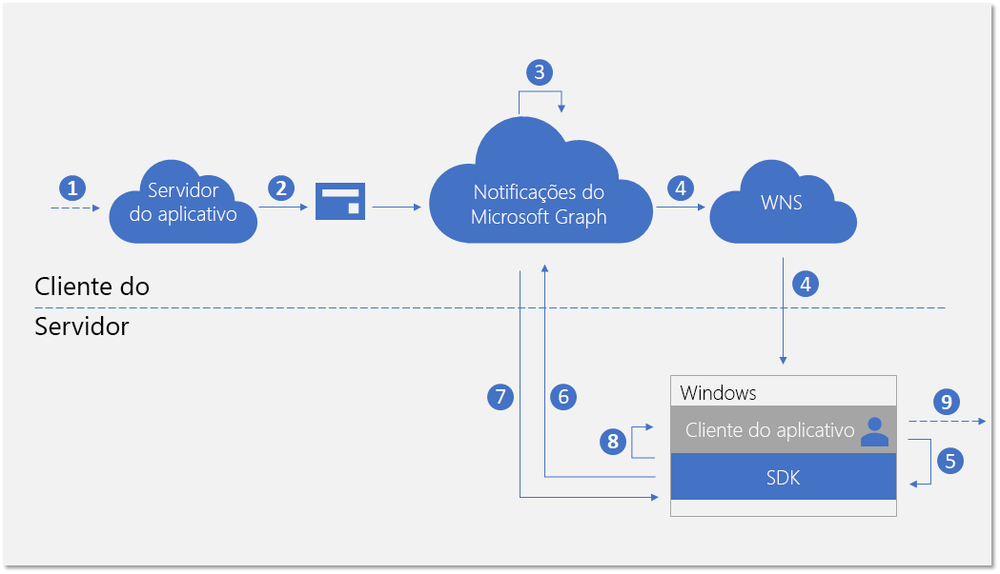
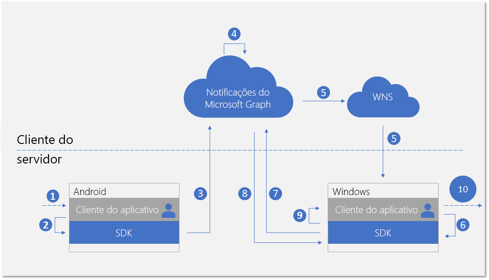
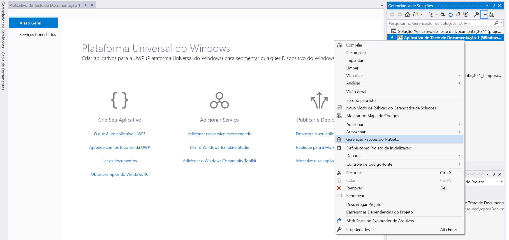
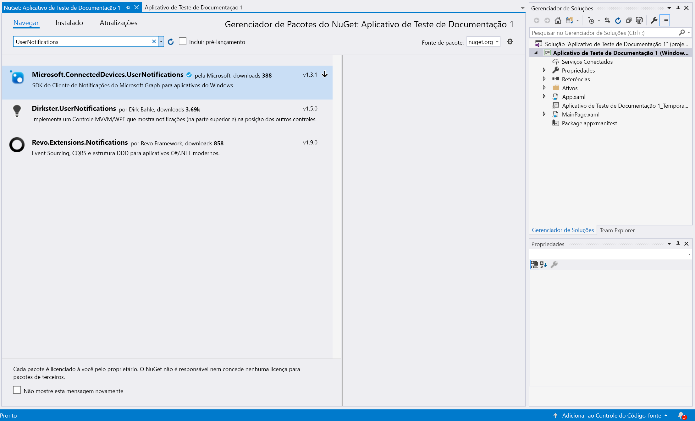
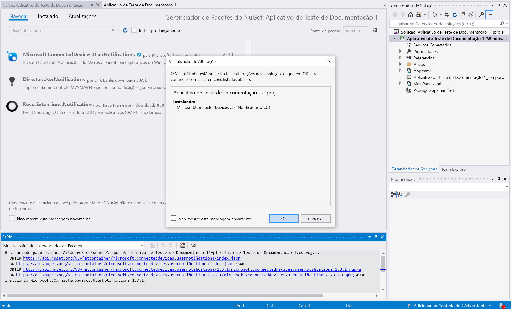

# <a name="integrate-your-windows-uwp-app-with-the-client-side-sdk-for-user-notifications-deprecated"></a>Integrar seu aplicativo UWP do Windows ao SDK do lado do cliente para notificações do usuário (preterido)

> [!IMPORTANT]
> A API de notificações do Microsoft Graph foi preterida e parou de retornar dados em janeiro de 2022. Para uma experiência de notificação alternativa, confira os [Hubs de Notificações do Microsoft Azure](/azure/notification-hubs). Para obter mais informações, consulte a postagem no blog [Desativando a API de notificações do Microsoft Graph (beta)](https://devblogs.microsoft.com/microsoft365dev/retiring-microsoft-graph-notifications/).

Após [registrar seu aplicativo](notifications-integration-app-registration.md) no Portal do Azure e integrar suas [experiências entre dispositivos](notifications-integration-cross-device-experiences-onboarding.md) no Partner Center de desenvolvimento, a próxima etapa é integrar seu aplicativo de cliente com o SDK do lado do cliente para o aplicativo UWP do Windows.  

Com o SDK do cliente, o aplicativo pode executar as etapas necessárias de registro para receber notificações publicadas do servidor do aplicativo direcionadas ao usuário conectado atualmente. O SDK então gerencia as notificações no lado do cliente, incluindo receber novas notificações, gerenciar o estado de notificações para alcançar cenários como descartar de forma universal e recuperar o histórico completo de notificações. 

## <a name="new-incoming-notification-flow"></a>Fluxo de notificação de entrada

Para receber novas notificações, o fluxo de dados é mostrado no diagrama a seguir.



O processo envolve alguns componentes:

* Servidor de aplicativo – back-end do aplicativo
* Cliente do aplicativo – front-end do aplicativo (um aplicativo UWP, Android ou iOS)
* Notificações do Microsoft Graph – o componente do serviço que permite que notificações ao usuário sejam publicadas, armazenadas e sincronizadas em instâncias diferentes dos clientes do aplicativo em vários dispositivos e plataformas
* WNS – o serviço de notificação por push do Windows que as notificações do Microsoft Graph usa para sinalizar clientes

O diagrama mostra as próximas etapas: 

1. Lógica do aplicativo. Esta etapa captura o que aciona a notificação a ser publicada para o usuário. Esta é uma lógica específica do aplicativo e pode ser um evento ou atualização de dados sobre alguma outra coisa no Microsoft Graph, como um novo evento de calendário ou atribuição de tarefa, ou o que seu serviço de aplicativo desejar notificar ao usuário.
2. O servidor do aplicativo publica uma notificação para o usuário alvo pela API de notificações do Microsoft Graph. Para saber mais, consulte [integração com o lado do servidor](notifications-integrating-app-server.md).
3. Ao receber a solicitação Web com nova notificação, as notificações do Microsoft Graph mantêm o conteúdo da notificação em segurança na nuvem para esse aplicativo e esse usuário.
4. Para cada instância do cliente do aplicativo inscrita para receber notificações para esse usuário, as notificações do Microsoft Graph envia um sinal para notificar cliente do aplicativo, por meio do serviço de envio por push nativo fornecido pelo sistema operacional. Nesse caso, o aplicativo é um aplicativo UWP no Windows, e ele usa [notificação bruta WNS](/windows/uwp/design/shell/tiles-and-notifications/raw-notification-overview) enviar o sinal. 
5. Depois que o aplicativo for sinalizado pelas notificações por push de entrada, ele pede ao SDK para buscar as alterações no repositório de notificações do usuário. 
6. O SDK estabelece uma conexão segura e compatível com o repositório de notificações do usuário no Microsoft Graph.
7. O SDK recebe as alterações de dados – nesse caso, o novo conteúdo de notificação. 
8. O SDK dispara retornos de evento para notificá-o aplicativo após as alterações são recuperadas com êxito. 
9. Lógica do aplicativo. Essa etapa captura o que o aplicativo escolhe fazer dentro retorno de chamada do evento. Normalmente, isso resulta em alterações locais de dados do aplicativo e atualizações de interface do usuário locais. Nesse caso, o aplicativo geralmente cria uma pop-up de notificação do sistema para notificar o usuário sobre o conteúdo de notificação.

## <a name="notification-update-flow"></a>Fluxo de atualização de notificação

Uma das principais vantagens de usar as notificações do Microsoft Graph é que ele mantêm as notificações na nuvem com segurança e as transforma em um tipo de recurso com estado. Portanto, ele pode ajudar o aplicativo a gerenciar e a sincronizar o estado correto das notificações em diferentes dispositivos para o usuário conectado em um cenário entre dispositivos. Quando uma notificação estiver marcada como descartada ou como lida em um dispositivo, os outros dispositivos podem ser notificados em tempo real. "Manipulada uma vez, descartada em qualquer lugar" pode se tornar a promessa real como parte da experiência de notificação para seus usuários. 

O diagrama a seguir mostra o fluxo de dados para alterar o estado de uma notificação ou excluir a notificação em um dispositivo e receber/manipular a alteração de estado ou a exclusão em outro dispositivo.



Observe que a segunda parte do fluxo é semelhante ao fluxo para lidar com as novas notificações recebidas. Isso ocorre por design - o padrão de programação do SDK é projetado para que o aplicativo cliente possa lidar com todos os tipos de alterações de dados de notificação do usuário (novas notificações recebidas, alterações de estado de notificação, notificação excluída) de maneira semelhante.  

O diagrama mostra as próximas etapas:

1. Lógica do aplicativo. Algo aciona a notificação para ser alterada ou excluída. Em geral, qualquer evento possível pode acionar a alteração de uma notificação. 
2. Chamada do aplicativo para o SDK do cliente para atualizar ou excluir uma notificação. Atualmente, expomos duas propriedades sobre alterações de estado – **userActionState** e **readState** – mas o aplicativo pode definir esses estados e quando eles precisam ser atualizados. Por exemplo, quando um usuário descartar a notificação pop-up, você pode atualizar o **userActionState** para Descartado. Quando um usuário clica na notificação pop-up e inicia o aplicativo para consumir o conteúdo correspondente do aplicativo, você pode atualizar o **userActionState** para ativado e atualizar o **readState** para Lido. 
3. Depois que a API correspondente é chamada para atualizar ou excluir uma notificação, o SDK irá chamar o repositório na nuvem de notificação de usuário para dispersar essa alteração para as outras instâncias de cliente do aplicativo com o mesmo usuário conectado. 
4. Ao receber a solicitação de atualização/exclusão de um cliente, as notificações do Microsoft Graph irão atualizar o repositório de notificação e identificar as outras instâncias de cliente do aplicativo inscritas para essa alteração.
5. Para cada inscrição do cliente do aplicativo, as notificações do Microsoft Graph envia um sinal para notificar cliente do aplicativo, por meio do serviço de envio por push nativo fornecido pelo sistema operacional. Nesse caso, esse é um aplicativo UWP no Windows, e ele usa [notificação bruta WNS](/windows/uwp/design/shell/tiles-and-notifications/raw-notification-overview) para enviar o sinal. 
6. Depois que o aplicativo for sinalizado pelas notificações por push de entrada, ele pede ao SDK para buscar as alterações no repositório de notificações do usuário. 
7. O SDK estabelece uma conexão segura e compatível com o repositório de notificações do usuário no Microsoft Graph.
8. O SDK recebe as alterações de dados – nesse caso, as alterações são atualizações de notificação de estado ou exclusões de notificação. 
9. O SDK dispara retornos de evento para notificá-o aplicativo após as alterações são recuperadas com êxito. 
10. Lógica do aplicativo. Essa etapa captura o que o aplicativo escolhe fazer dentro retorno de chamada do evento. Normalmente, isso resulta em alterações locais de dados do aplicativo e atualizações de interface do usuário locais. Nesse caso, como há atualizações de notificação, o aplicativo deve atualizar a interface do usuário no local para refletir a alteração de estado. Por exemplo, se uma notificação estiver marcada como ativada, você pode remover a notificação pop-up do sistema correspondente dentro da central de ações do Windows para obter "manipulada uma vez, descartada em todo lugar". 

Para obter mais informações sobre as notificações do Microsoft Graph, consulte a [visão geral das notificações do Microsoft Graph](notifications-concept-overview.md). Para saber mais sobre as etapas necessárias para integrar com as notificações do Microsoft Graph de ponta a ponta, confira a [visão geral da integração](notifications-integration-e2e-overview.md) das notificações do Microsoft Graph.

## <a name="adding-the-sdk-to-your-project"></a>Adicionar o SDK ao seu projeto

No Windows, o SDK do lado do cliente é um pacote do NuGet que envia fora do sistema operacional Windows. Essa API está disponível no C#, C++, e WinJS. 

Baixe o pacote do NuGet para as notificações SDK do Microsoft Graph para aplicativos do Windows no [nuget](https://www.nuget.org/packages/Microsoft.ConnectedDevices.UserNotifications), ou use as etapas a seguir para baixá-lo da solução do aplicativo no Visual Studio: 

No Visual Studio, clique com o botão direito do mouse no projeto para abrir o menu de contexto, e depois clique em **Gerenciar pacotes do NuGet...**.



Acesse a guia **Procurar** e pesquise por Microsoft.ConnectedDevices.UserNotifications.



Você verá as notificações do Microsoft Graph no SDK do lado do cliente nos resultados da pesquisa. Clique no botão **Instalar** para instalar o pacote.. 



Após a conclusão da instalação, o pacote é exibido abaixo de **Referências** no Gerenciador de Soluções. 

Para saber mais sobre a incluisão e o consumo de pacotes do NuGet de seu aplicativo UWP, confira:

* [Usar os pacotes do nuget.org](/azure/devops/artifacts/nuget/upstream-sources?tabs=new-nav&view=vsts&preserve-view=true)
* [Início rápido: Instalar e usar um pacote no Visual Studio](/nuget/quickstart/install-and-use-a-package-in-visual-studio)


## <a name="initializing-the-connected-device-platforms"></a>Inicializando as Plataformas de Dispositivo Conectado

No SDK do lado do cliente é desenvolvido com base em uma infraestrutura chamada Plataforma de Dispositivo Conectado. Antes de poder usar qualquer recurso, a plataforma deve ser inicializada em seu aplicativo. As etapas de inicialização que devem ocorrer em sua classe principal no método **OnLaunched** ou **onActivated**, porque eles são necessários para ocorrer os cenários de notificação.

Você deve criar e inicializar a plataforma ao instanciar a classe **ConnectedDevicesPlatform**. Antes de fazer isso, certifique-se de conectar manipuladores de eventos, como mostrado, pois depois que a plataforma é iniciada, os eventos podem começar a acionar. 


```C#
var platform = new ConnectedDevicesPlatform();
platform.AccountManager.AccessTokenRequested += AccountManager_AccessTokenRequestedAsync;
platform.AccountManager.AccessTokenInvalidated += AccountManager_AccessTokenInvalidated;
platform.NotificationRegistrationManager.NotificationRegistrationStateChanged += NotificationRegistrationManager_NotificationRegistrationStateChanged;
platform.Start();
```

### <a name="handling-account-access-token"></a>Gerenciar tokens de acesso à conta

Todas as chamadas de Web que o SDK realiza, incluindo a recuperação do conteúdo de uma nova notificação de entrada, atualização de notificação de estado e muito mais, são leituras de ou escrevendo para os dados do usuário e, portanto, sempre exigem um token de acesso válido. O SDK requer que você trate os seguintes eventos – chamados quando um token de acesso for solicitado ou invalidado – para garantir que, depois da plataforma inicializar, o token de acesso do usuário seja tratado corretamente. 

#### <a name="accountmanager_accesstokenrequestedasync"></a>AccountManager_AccessTokenRequestedAsync

Para uma implementação completa, confira o [exemplo de aplicativo Windows](https://github.com/Microsoft/project-rome/blob/master/Windows/samples/GraphNotificationsSample/ConnectedDevicesManager.cs). 

```C#
private async void AccountManager_AccessTokenRequestedAsync(ConnectedDevicesAccountManager sender, ConnectedDevicesAccessTokenRequestedEventArgs args)
{
    private List<Account> accounts = new List<Account>();
    var account = accounts.Find((x) => x.EqualsTo(args.Request.Account));
    if (account != null)
    {
        try
        {
            var accessToken = await account.GetAccessTokenAsync(args.Request.Scopes);
            args.Request.CompleteWithAccessToken(accessToken);
        }
        catch (Exception ex)
        {
            args.Request.CompleteWithErrorMessage(ex.Message);
        }
    }
}
```

#### <a name="accountmanager_accesstokeninvalidated"></a>AccountManager_AccessTokenInvalidated

Para uma implementação completa, confira o [exemplo de aplicativo Windows](https://github.com/Microsoft/project-rome/blob/master/Windows/samples/GraphNotificationsSample/ConnectedDevicesManager.cs). 

```C#
private void AccountManager_AccessTokenInvalidated(ConnectedDevicesAccountManager sender, ConnectedDevicesAccessTokenInvalidatedEventArgs args)
{
    Logger.Instance.LogMessage($"Token Invalidated. AccountId: {args.Account.Id}, AccountType: {args.Account.Id}, scopes: {string.Join(" ", args.Scopes)}");
}
```

### <a name="handling-push-registration-expiration"></a>Gerenciar validade de registro de push 

As notificações do Microsoft Graph usa o WNS, a plataforma de push nativa no Windows, para sinalizar o aplicativo de cliente sobre alterações de dados de notificações do usuário. Isso acontece quando novas notificações recebidas forem publicadas do servidor de aplicativos, ou quando o estado de qualquer notificação é atualizado em outro dispositivo com o mesmo usuário conectado em um cenário entre dispositivos. 

Por esse motivo, é necessário um canal WNS válido que permite que as notificações brutas por push para ter êxito. O seguinte retorno de chamada de evento trata da validade do canal WNS por push. 

#### <a name="notificationregistrationmanager_notificationregistrationstatechanged"></a>NotificationRegistrationManager_NotificationRegistrationStateChanged

Para uma implementação completa, confira o [exemplo de aplicativo Windows](https://github.com/Microsoft/project-rome/blob/master/Windows/samples/GraphNotificationsSample/ConnectedDevicesManager.cs). 

```C#
private async void NotificationRegistrationManager_NotificationRegistrationStateChanged(ConnectedDevicesNotificationRegistrationManager sender, ConnectedDevicesNotificationRegistrationStateChangedEventArgs args)
{
    if ((args.State == ConnectedDevicesNotificationRegistrationState.Expired) || (args.State == ConnectedDevicesNotificationRegistrationState.Expiring))
    {
        var account = m_accounts.Find((x) => x.EqualsTo(args.Account));
        if (account != null)
        {
            await account.RegisterAccountWithSdkAsync();
        }
    }
}
```

## <a name="signing-in-your-user"></a>Entrar com seu usuário

As notificações do Microsoft Graph, como vários outros tipos de recursos no Microsoft Graph, são centralizadas em torno dos usuários. Para que o aplicativo assine e comece a receber notificações para o usuário conectado, primeiro é necessário obter um token OAuth válido a ser usado no processo de registro. Você pode usar o método que preferir para gerar e gerenciamento os tokens OAuth. Exemplo de aplicativo que usa ADAL. 

Se você estiver usando uma conta da Microsoft, será necessário incluir as seguintes permissões em uma solicitação de entrada: `wl.offline_access"`, `ccs.ReadWrite`, `wns.connect`, `asimovrome.telemetry`, e `https://activity.windows.com/UserActivity.ReadWrite.CreatedByApp`. 

Se você estiver usando uma conta do Azure AD, você precisará solicitar o seguinte público: `https://cdpcs.access.microsoft.com`.


## <a name="adding-the-user-account-to-the-platform"></a>Adicionar a conta de usuário à plataforma 

Será preciso registrar a conta do usuário conectado com um SDK.Isso envolve a adição de contas e o registro de um canal de push para receber as notificações por push iniciais através de WNS. 

```C#
var account = new ConnectedDevicesAccount(accountId, accountType);           
var addResult = await platform.AccountManager.AddAccountAsync(account);
if (addResult.Status != ConnectedDevicesAccountAddedStatus.Success)
{
    throw new Exception("Add account failed with " + addResult.Status + "!");
}            

var pushChannel = await PushNotificationChannelManager.CreatePushNotificationChannelForApplicationAsync();
ConnectedDevicesNotificationRegistration registration = new ConnectedDevicesNotificationRegistration();
registration.Type = ConnectedDevicesNotificationType.WNS;
registration.Token = pushChannel.Uri;
var registerResult = await platform.NotificationRegistrationManager.RegisterAsync(account, registration);
if (registerResult.Status != ConnectedDevicesNotificationRegistrationStatus.Success)
{
    throw new Exception("Register push channel failed with " + registerResult.Status + "!");
}
```

## <a name="subscribing-to-receive-users-notifications"></a>Inscrever-se para receber notificações do usuário 

Você precisa instanciar um objeto **UserDataFeed** para o aplicativo para este usuário conectado. O aplicativo é identificado pela ID de aplicativo multiplataforma fornecidas durante o processo de [integração de experiências entre dispositivos](notifications-integration-cross-device-experiences-onboarding.md).

```C#
UserDataFeed feed = UserDataFeed.GetForAccount(account, platform, "YOUR_HOST_HERE");

var scopes = new List<UserDataFeedSyncScope> { UserNotificationChannel.SyncScope };
var subscribeResult = await feed.SubscribeToSyncScopesAsync(scopes);
if (!subscribeResult)
{
    throw new Exception("Subsribe failed!");
}
var channel = new UserNotificationChannel(feed);
var reader = channel.CreateReader();
reader.DataChanged += Reader_DataChanged;
```

## <a name="receiving-and-managing-user-notifications"></a>Receber e gerenciar as notificações do usuário

O diagrama de fluxo anterior neste tópico mostra que os padrões de programação para lidar com novas notificações de entrada de um servidor de aplicativo e uma atualização ou exclusão de notificação iniciada a partir de outra instância do aplicativo cliente são semelhantes. A seguir estão as etapas para lidar com essas alterações de dados. 

### <a name="handling-incoming-push-notification-signal"></a>Gerenciar sinal de notificações por push de entrada

Todos os tipos de alterações de dados de notificações do usuário geram um sinal que é entregue para os clientes do aplicativo como uma notificação por push. Para aplicativos UWP do Windows, o sinal será enviado como uma notificação bruta WNS por push. Ao receber sinal de notificação bruta por push, o aplicativo deve chamar **TryParse** para acionar o SDK para buscar no serviço de notificações do Microsoft Graph para as alterações de dados reais.

```C#
public async Task ReceiveNotificationAsync(string content)
{
    ConnectedDevicesNotification notification = ConnectedDevicesNotification.TryParse(content);
    if (notification != null)
    {
        await platform.ProcessNotificationAsync(notification);
    }
}
```

### <a name="handling-user-notification-data-changes"></a>Gerenciar alterações de dados de notificação do usuário

Após o SDK buscar com êxito as alterações de dados, um retorno de chamada do evento é invocado e o cliente de aplicativo deve lidar com a criação, atualização ou exclusão da notificação.

```C#
private async void Reader_DataChanged(UserNotificationReader reader, object args)
{
    var notifications = await reader.ReadBatchAsync(UInt32.MaxValue);

    foreach (var notification in notifications)
    {
        // Handle notification changes based on change type;
    }
}
```


### <a name="update-state-of-a-notification"></a>Atualização do estado de uma notificação

Se a alteração do estado de notificação é iniciada da instância do cliente do aplicativo (por exemplo, se a notificação pop-up do sistema nesse dispositivo é ativada pelo usuário), o aplicativo deve chamar o SDK para atualizar o estado de notificação para que essa alteração de estado seja sincronizada em todos os dispositivos usados pelo mesmo usuário. 

```C#
notification.UserActionState = UserNotificationUserActionState.Activated;
await notification.SaveAsync();
```

### <a name="delete-a-notification"></a>Excluir uma notificação

Se a exclusão de uma notificação é iniciada da instância do cliente de aplicativo (por exemplo, se a tarefa correspondente a essa notificação for marcada como concluída e removida do banco de dados do aplicativo), o aplicativo deve chamar o SDK para excluir a notificação para que essa operação de exclusão seja sincronizada em todos os dispositivos usados pelo mesmo usuário. 

Uma notificação é removida do repositório de notificação do usuário apenas se expirada ou explicitamente excluída. Uma notificação do usuário não é excluída quando você atualiza o **UserActionState** para Descartado, porque a definição semântica do **UserActionState** é definida pelo próprio aplicativo.

```C#
await channel.DeleteUserNotificationAsync(notification.Id);
```

## <a name="see-also"></a>Confira também

- [Referência da API](/windows/project-rome/notifications/api-reference-for-windows/) para o conjunto completo de APIs relacionadas aos recursos de notificação no SDK. 
- [Exemplo do lado do cliente](https://github.com/Microsoft/project-rome/tree/master/Windows/samples/GraphNotificationsSample) para aplicativos UWP do Windows.
- [Exemplo do servidor do aplicativo](notifications-integrating-app-server.md) para publicar as notificações.
