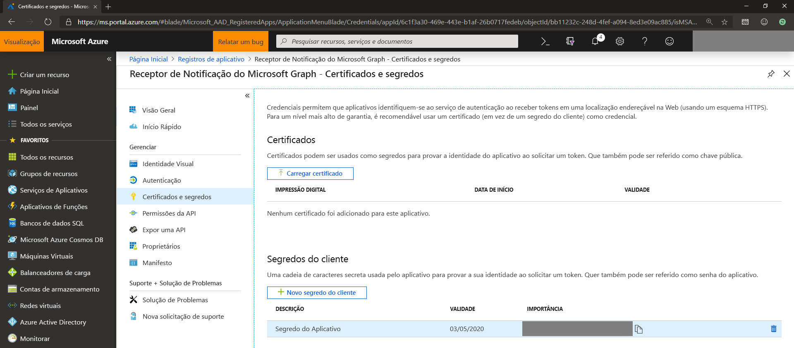
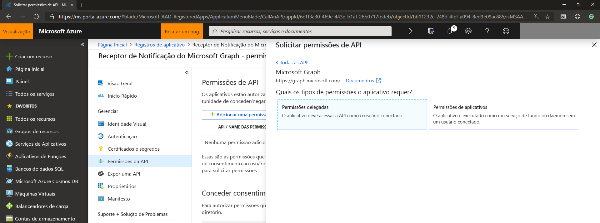
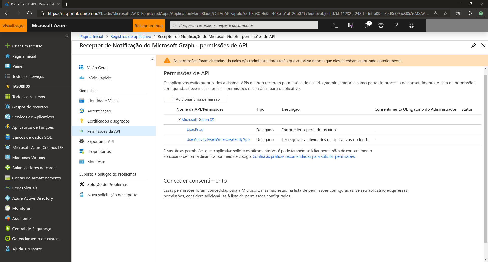

# Gerenciar registro do aplicativo e permissão de API para notificações do Microsoft Graph

Para que o serviço do aplicativo se integre às notificações do Microsoft Graph, é necessário registrar seu aplicativo na Microsoft Identity Platform para suporte às contas corporativas ou de estudante da Microsoft e declarar as permissões de API obrigatórias.

## Registre seu aplicativo para suporte às contas corporativas ou de estudante da Microsoft

Registre seu aplicativo no portal do [Microsoft Azure](https://portal.azure.com/#home) para suporte às contas corporativas ou de estudante da Microsoft. Se já tiver registrado o aplicativo anteriormente no [Portal do aplicativo da Microsoft](https://apps.dev.microsoft.com/), os aplicativos existentes serão exibidos na nova e melhorada experiência do portal do Azure.

Para saber como registrar aplicativos, confira [Registrar um aplicativo na Microsoft Identity Platform](auth-register-app-v2.md). Ao registrar seu aplicativo, certifique-se de manter sempre à mão a ID do aplicativo/ID do cliente. Essa ID será usada posteriormente ao registrar seu aplicativo para experiências entre dispositivos no [Microsoft Partner Center](https://partner.microsoft.com/) para clientes Windows, Android ou iOS.

> [!NOTE]
> Se você ainda não tem uma conta Microsoft e deseja utilizar uma, vá para a página [Conta da Microsoft](https://account.microsoft.com/account). Se você estiver escrevendo um aplicativo que precisa usar o Azure AD v1.0 como uma estrutura de autenticação e identidade para contas corporativas ou escolares, consulte [Bibliotecas de autenticação do Azure Active Directory](/azure/active-directory/develop/active-directory-authentication-libraries). Para saber mais sobre ou se estiver usando a nova Microsoft Identity Platform convergida (versão 2.0), confira [comparação do ponto de extremidade da Microsoft Identity Platform e o ponto de extremidade do Azure AD versão 1.0](/azure/active-directory/develop/azure-ad-endpoint-comparison).

## Certificados e segredos do aplicativo 

Para que o aplicativo se identifique e se autentique ao obter tokens de autenticação, você pode carregar seu próprio certificado ou criar um nova segredo do cliente acessando **certificados e segredos** no portal do Azure.
    

    
> [!NOTE]
> Se optar por gerar um novo segredo do cliente, certifique-se de copiá-lo a e guardá-lo em um local seguro. Você não poderá acessá-lo novamente após sair do portal.

## Permissões de API

É preciso incluir permissões adicionais para usar as notificações do Microsoft Graph. Escolha **Adicionar uma permissão** e, em APIs Microsoft, selecione **Microsoft Graph** e depois **Permissões delegadas**.
    

    
Adicione as seguintes permissões:

- User.Read – permite que o aplicativo conecte seu usuário

- UserActivity.ReadWrite.CreatedByApp – permite a assinatura do aplicativo para recuperação de notificação

## Próximas etapas

Saiba mais sobre [permissões e consentimento](/azure/active-directory/develop/v2-permissions-and-consent) ou consulte a [referência de permissões](./permissions-reference.md) do Microsoft Graph.

Após registrar seu aplicativo, visite o [Partner Center](https://partner.microsoft.com/) para configurar o aplicativo para direcionar suas plataformas de aplicativo correspondentes (Windows, iOS ou Android) para notificações enviadas pelo Microsoft Graph. Para saber mais, confira a [Integração à experiência entre dispositivos](notifications-integration-cross-device-experiences-onboarding.md). 

>[!NOTE]
>Se você estiver apenas direcionando pontos de extremidade da Web, poderá ignorar o registro do Partner Center e aprender a configurar seu [serviço de aplicativo](notifications-integrating-app-server.md) para enviar notificações.
