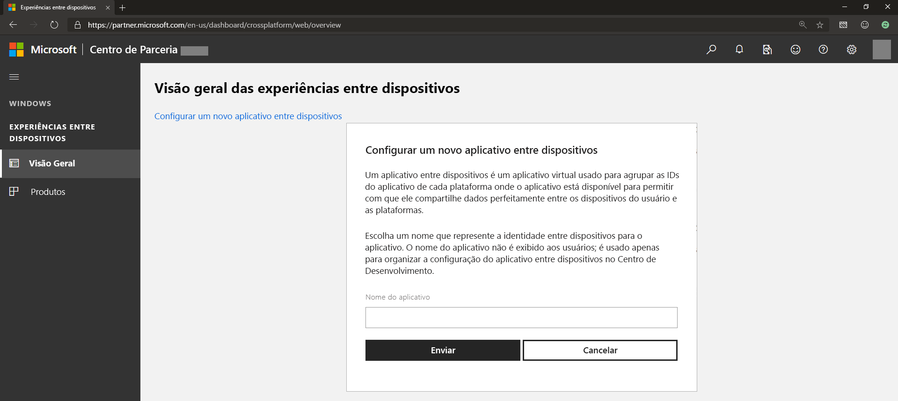
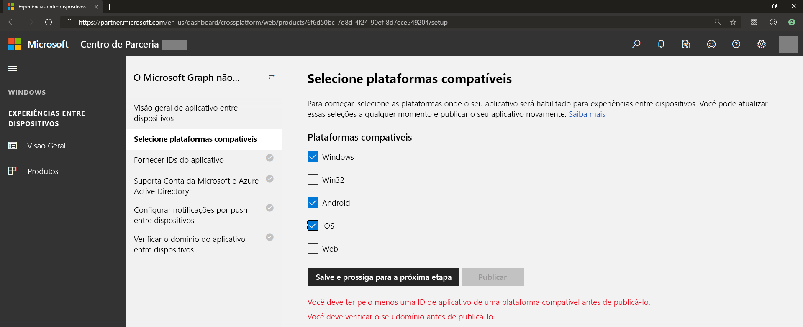
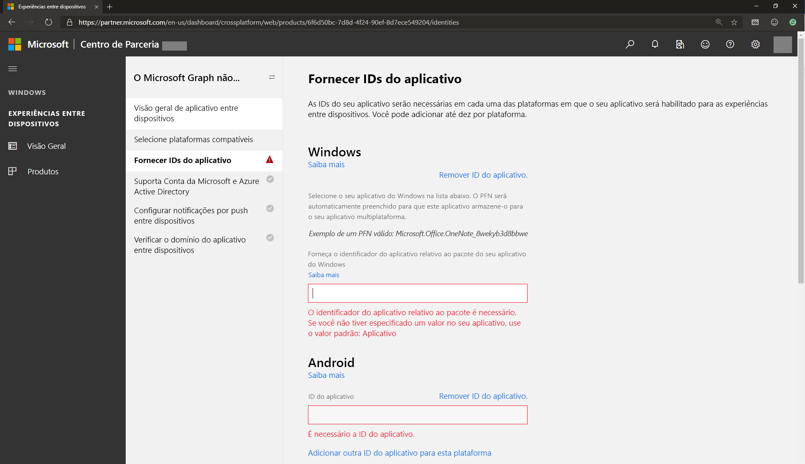
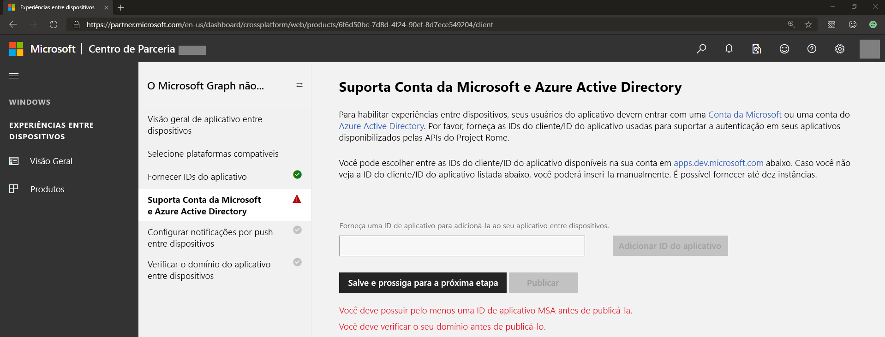
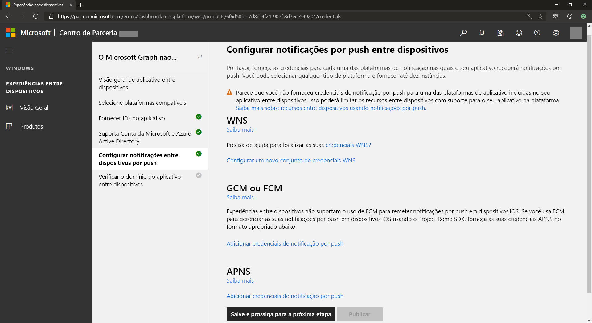
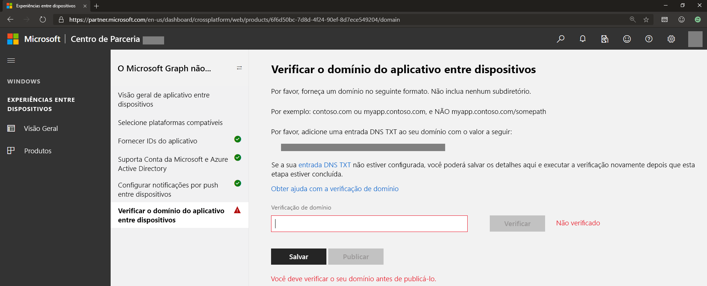

# Integração de experiências entre dispositivos para as notificações do Microsoft Graph

>[!NOTE]
>Se estiver apenas direcionando pontos de extremidade da Web, você poderá ir direto para a configuração do [serviço de aplicativo](notifications-integrating-app-server.md) para enviar notificações.

Além do [registro do aplicativo no Portal do Azure](notifications-integration-app-registration.md), seu aplicativo deve registrar as informações entre dispositivos, por exemplo, a ID do aplicativo entre dispositivos e as credenciais de push multiplataforma para autorizar o Microsoft Graph a enviar notificações por serviços nativos de notificações por push, que correspondem a cada sistema operacional: Windows, iOS e Android. Isso é feito por meio do [painel do Partner Center (antigo painel do Centro de Desenvolvimento do Windows)](https://partner.microsoft.com/dashboard/). 

> [!NOTE]
> Você precisa de uma conta de desenvolvedor do Windows para concluir as etapas deste artigo, mesmo que não planeje criar um aplicativo Windows UWP. Se ainda não tiver uma conta de desenvolvedor do Windows, confira [Abrir uma conta de desenvolvedor](/windows/uwp/publish/opening-a-developer-account). Como alternativa, caso prefira não se inscrever como desenvolvedor do Windows, você pode entrar em contato pelo email [gnsengage@microsoft.com](sendto: gnsengage@microsoft.com). Se você criar uma conta de desenvolvedor do Windows e estiver desenvolvendo um aplicativo corporativo ou de estudante como parte de uma empresa, você poderá associar sua conta de desenvolvedor com uma conta apropriada do Azure AD usada para gerenciar envios de sua empresa. Para saber mais, confira [Associar o Azure Active Directory à sua conta do Partner Center](/windows/uwp/publish/associate-azure-ad-with-partner-center).

Para começar, entre no [painel do Partner Center](https://partner.microsoft.com/dashboard) com sua conta de desenvolvedor do Windows:

1.  No menu à esquerda, acesse **Experiências entre Dispositivos**, selecione **Configurar um novo aplicativo entre dispositivos**, e forneça o nome do aplicativo, conforme mostrado na captura de tela a seguir.

2.  Selecione todas as plataformas compatíveis em que seu aplicativo estará disponível e habilitado para receber notificações. Você pode selecionar plataformas compatíveis que incluem o Windows, Android e iOS, conforme mostrado. 

3.  Forneça IDs de aplicativo para cada uma das plataformas em seu aplicativo estará disponível, conforme mostrado.

 

> [!NOTE] 
> Você pode adicionar outras IDs (até dez) por plataforma – isso ocorre se você tiver várias versões do mesmo aplicativo, ou até mesmo diferentes aplicativos, e deseja receber a mesma notificação enviada pelo servidor do aplicativo e direcionadas ao mesmo usuário.

4.  Forneça ou selecione a ID de aplicativo na conta da Microsoft e/ou registro do aplicativo do Azure AD. Essa ID do cliente corresponde à conta da Microsoft ou registro do aplicativo do Azure AD obtido ao registrar no Portal do Azure.

5.  As notificações do Microsoft Graph usam cada plataforma nativa de notificação em todas as plataformas principais para enviar notificações aos pontos de extremidade do aplicativo do cliente, ou seja, WNS (para Windows UWP), FCM (para Android) e APNS (para iOS). Forneça as credenciais dessas plataformas de notificação para habilitar as notificações do Microsoft Graph para enviar notificações para o servidor do aplicativo ao publicar notificações direcionadas pelo usuário, conforme mostrado.

 

> [!NOTE]
> Para aplicativos UWP do Windows, habilitar as notificações por push WNS é um pré-requisito para usar as notificações do Microsoft Graph. Para saber mais, confira a [Visão geral do WNS](/windows/uwp/design/shell/tiles-and-notifications/windows-push-notification-services--wns--overview). Após fazer a integração, você pode fornecer credenciais de push pelo Partner Center para a plataforma do dispositivo conectado.

6.  Verifique o domínio do aplicativo entre dispositivos, que serve como um processo de verificação para provar que o aplicativo tem a propriedade desse domínio. Isso funciona como uma identidade do aplicativo entre dispositivos para o aplicativo ou os aplicativos que você registrou, conforme mostrado.
    
    

Isso é tudo! Você já registrou os aplicativos para receber notificações. Em seguida, aprenda como configurar o [serviço do aplicativo](notifications-integrating-app-server.md) e a começar a enviar notificações.
