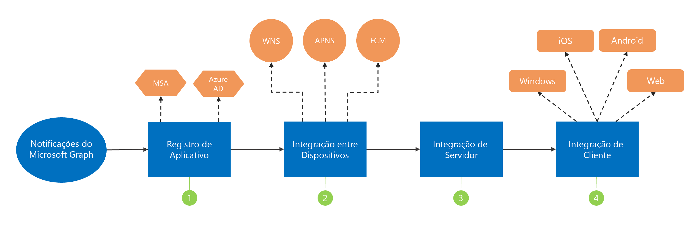

# Integração com as notificações do Microsoft Graph (preterido)

> [!IMPORTANT]
> A API de notificações do Microsoft Graph foi preterida e parou de retornar dados em janeiro de 2022. Para uma experiência de notificação alternativa, confira os [Hubs de Notificações do Microsoft Azure](/azure/notification-hubs). Para obter mais informações, consulte a postagem no blog [Desativando a API de notificações do Microsoft Graph (beta)](https://devblogs.microsoft.com/microsoft365dev/retiring-microsoft-graph-notifications/).

Os aplicativos podem ser integrados às notificações do Microsoft Graph em algumas etapas simples, como mostrado no seguinte diagrama.

1.  [Registre](notifications-integration-app-registration.md) seu aplicativo no portal do Microsoft Azure.

2. [Integre](notifications-integration-cross-device-experiences-onboarding.md) ao Partner Center/Centro de Desenvolvimento do Windows para identidade e credenciais de notificação por push multiplataforma para Windows, iOS e Android.

3.  [Configure o servidor do aplicativo](notifications-integrating-app-server.md) para enviar notificações por meio do Microsoft Graph.

4.  [Integre](notifications-integrating-with-windows.md) as novas [notificações SDK do cliente](https://aka.ms/GNSDK) para que seus clientes web, Windows, Android ou iOS recebam e gerenciem as notificações.

> [!NOTE]
> Recomendamos usar o novo [SDK de notificação](https://aka.ms/GNSDK), mais simples e avançado, em vez de usar o [SDK do Project Rome](https://github.com/microsoft/project-rome).
