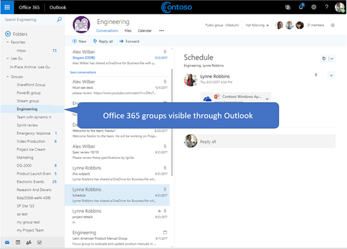

# Visão geral dos grupos do Office 365 no Microsoft Graph

Os grupos do Office 365 fornecem o serviço de associação fundamental para os usuários compartilharem conversas, arquivos, anotações, calendários, planos e muitos outros ativos. 

## Por que se integrar aos grupos do Office 365?   

Os grupos formam a base que permite a colaboração e a integração de usuários em diversos serviços para oferecer suporte a cenários avançados no planejamento de tarefas, trabalho em equipe, treinamentos, etc. Após você se integrar aos grupos do Office 365, o aplicativo se tornará compatível com milhões de usuários conforme eles passarem por várias experiências no pacote do Office 365 e além.  
 
### Criar grupos para facilitar o trabalho em equipe em todos os serviços 
 
Você pode usar a API do Microsoft Graph para criar, gerenciar ou excluir grupos em todo o ciclo de vida de colaboração. Por exemplo, é possível fazer o seguinte:  
 
- Usar a API [Criar grupo](../api-reference/v1.0/api/group_post_groups.md) para provisionar um novo grupo. Em seguida, o grupo é disponibilizado em diversos aplicativos, como Outlook, SharePoint, Microsoft Teams, Planner e até mesmo no Microsoft Stream. O Microsoft Graph é sincronizado nesses serviços conectados para fornecer acesso perfeito a todos os membros do grupo.  
 
    **Cada grupo do Office 365 integra-se a um conjunto padrão de serviços do Office 365**

      

- Permite que os membros indiquem que um grupo é um dos seus [favoritos](../api-reference/v1.0/api/group_addfavorite.md) ou que [o removam dos favoritos](../api-reference/v1.0/api/group_removefavorite.md), caso queiram. 
- [Criar](../api-reference/v1.0/api/group_post_conversations.md), [obter](../api-reference/v1.0/api/group_get_conversation.md) ou [excluir](../api-reference/v1.0/api/group_delete_conversation.md) conversas em grupo do seu aplicativo personalizado. 
- Programe [eventos](../api-reference/v1.0/resources/event.md) de calendário no calendário do grupo. 
- Obtenha informações sobre [o site do SharePoint](../api-reference/v1.0/resources/site.md) que está associado a um grupo, como as [listas](../api-reference/v1.0/api/list_list.md) ou [subsites](../api-reference/v1.0/api/site_list_subsites.md) da biblioteca de documentos. 
- [Criar um plano](../api-reference/v1.0/api/planner_post_buckets.md) no Planner pertencente a um grupo. O plano oferece uma maneira visual de acompanhar o trabalho em equipe, permitindo que você [crie tarefas](../api-reference/v1.0/api/planner_post_tasks.md) que possam ser [organizadas em buckets](../api-reference/v1.0/api/planner_post_buckets.md). 
- Acesse o bloco de anotações do [OneNote](../api-reference/v1.0/resources/onenote.md) associado a um grupo, que pode ser usado para a coleta de anotações da reunião e para a organização das ideias. 
  
    **Grupos e conversas do Office 365 no Outlook na Web**

     

- [Habilite um grupo do Microsoft Teams](../api-reference/beta/api/team_put_teams.md) (visualização) para permitir que os membros do grupo se envolvam em chat persistente.  
- [Excluir grupos](../api-reference/v1.0/api/group_delete.md). Quando um grupo é excluído, todo o conteúdo associado também o é, evitando sites, conversas ou planos órfãos. 
 
### Gerenciar facilmente a associação a um grupo 
 
Os grupos do Office 365 são conjuntos de usuários que compartilham o acesso aos recursos nos serviços da Microsoft ou em seu aplicativo. Como os membros do grupo são gerenciados centralmente, qualquer alteração feita na associação afetará todos os serviços associados ao grupo. Você pode usar o Microsoft Graph para executar as seguintes tarefas de associação a grupos:
 
- [Adicione](../api-reference/v1.0/api/group_post_members.md) e [remova](../api-reference/v1.0/api/group_delete_members.md) membros de um grupo existente. 
- Obtenha uma [lista de proprietários](../api-reference/v1.0/api/group_list_owners.md) ou uma [lista de membros](../api-reference/v1.0/api/group_list_members.md) para um grupo. Isso ajuda a comunicar quem tem acesso ao conteúdo do grupo ou quem pode precisar realizar tarefas administrativas, como a renovação do grupo ou a aprovação de uma solicitação de ingresso. 
- Designe os grupos como **Públicos**, tornando o conteúdo do grupo visível para qualquer pessoa na mesma organização ou **Particular**, tornando o conteúdo do grupo visível somente para os membros, por meio da operação [grupo de atualização](../api-reference/v1.0/api/group_update.md). 
- [Remova os proprietários](../api-reference/v1.0/api/group_delete_owners.md) que não tiverem mais responsabilidades em um grupo específico a partir da lista de proprietários do grupo. 
 
### Definir e manter as configurações de política de grupo 
 
À medida que o número de grupos criados em uma organização começa a crescer, o Microsoft Graph oferece suporte ao controle do uso e do ciclo de vida do grupo. Você pode aplicar políticas de grupo a todos os grupos de uma organização. Você pode usar a API do Microsoft Graph para:

- Definir uma ampla variedade de [configurações de política de grupo](../api-reference/v1.0/resources/groupsetting.md) que ajudam a determinar comportamentos, como a exclusão automática dos grupos, a menos que eles sejam renovados por um proprietário, e a aplicação de políticas de nome em grupos do Office 365. 
- [Renovar](../api-reference/v1.0/api/group_renew.md) os grupos que estão prestes a expirar para permitir que os membros da equipe continuem com a colaboração e o acesso ao conteúdo. Se o grupo não for renovado de acordo com a política de validade estabelecida, o grupo é excluído automaticamente. 
- [Restaurar](../api-reference/v1.0/api/directory_deleteditems_restore.md) os grupos excluídos.
 
## Próximas etapas

- Experimente alguns exemplos de solicitações de API no [Explorador do Graph](https://developer.microsoft.com/pt-BR/graph/graph-explorer). 
- Saiba mais sobre como [usar a API de grupos](../api-reference/v1.0/resources/groups-overview.md) no Microsoft Graph.
