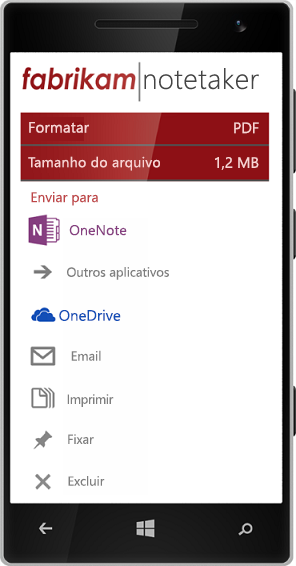
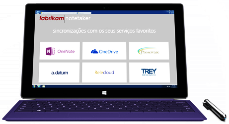
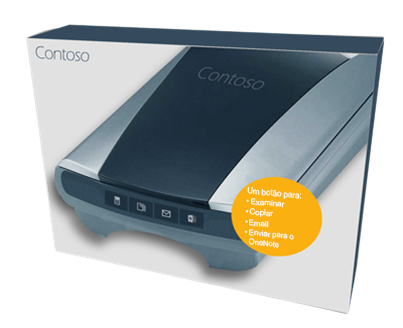
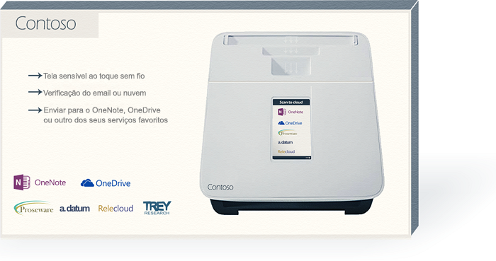

# Diretrizes de marca para desenvolvedores da API do OneNoteBranding guidelines for OneNote API developers 
 
*__Aplica-se a:__ Bloco de anotações dos consumidores no OneDrive | Bloco de anotações empresariais no Office 365**__Applies to:__ Consumer notebooks on OneDrive | Enterprise notebooks on Office 365*

Siga as orientações contidas neste artigo para melhor integrar a marca do OneNote ao seu produto e satisfazer os requisitos de marca do OneNote.Follow the guidance in this article to best integrate the OneNote brand within your product and satisfy OneNote branding requirements.

## Logotipos baixáveisDownloadable logos
Você pode fazer o download dos logotipos mostrados neste artigo e uma cópia em PDF dessas diretrizes em nossa página de download de [Diretrizes de marca para desenvolvedores da API do OneNote](https://www.microsoft.com/download/details.aspx?id=42977).You can download the logos shown in this article and a PDF copy of these guidelines from our [Branding guidelines for OneNote API developers](https://www.microsoft.com/download/details.aspx?id=42977) download page.

## Variações do logotipoLogo variations

**Nome e ícone atrelados** (preferencial)**Icon and name lockup** (Preferred)  
O símbolo do ícone é atrelado ao nome.The icon symbol is locked with the name. Esta é a representação gráfica preferencial do logotipo do OneNote.This is the preferred graphic representation of the OneNote logo.

  

**Símbolo do ícone****Icon symbol**  
Determinados ambientes, como dispositivos pequenos, não oferecem espaço suficiente para bloqueio de logotipo completo.Certain environments, such as on small devices, don't provide enough room for the entire logo lockup. Nesses casos, o símbolo do ícone sozinho pode ser usado em um aplicativo ou em marketing digital.In those cases, the icon symbol alone may be used in an app or in digital marketing. Quando usado em um aplicativo, use o símbolo do ícone sozinho somente quando precisar de um ícone ou favicon para representar o OneNote.When used in an app, use the icon symbol alone only when you need an icon or favicon to represent OneNote.

  

## Desmarcar espaçoClear space 
Trate o logotipo com respeito e dê a ele espaço para se destacar.Treat the logo with respect and give it room to breathe. Um espaço livre mínimo equivalente à altura do símbolo deve circundar o logotipo.A minimum clear space equivalent to the height of the symbol must surround the logo.

  

## Tamanho mínimoMinimum size 
A altura do logotipo deve ser de pelo menos 16 pixels quando aparecer na tela e pelo menos 5 mm (0,2 polegadas) quando aparecer na impressão.The logo should be at least 16 pixels high when it appears on-screen and at least 5 mm (0.2 inches) high when it appears in print.

**Tela:**&nbsp;&nbsp;16 pixels**Screen:**&nbsp;&nbsp;16 pixels  
**Impressão:**&nbsp;&nbsp;5 mm (0,2 polegadas)**Print:**&nbsp;&nbsp;5 mm (0.2 inches) 

  

## CorColor
Quando o logotipo do OneNote é usado em fundos brancos ou claros, a cor do logotipo preferencial é roxa - sua cor de marca.When the OneNote logo is used on white or light backgrounds, the preferred logo color is purple--its brand color. Quando aparece em um fundo roxo, o logotipo deve ficar em branco.When it appears on a purple background, the logo should be knocked out to white.

**Tela:**&nbsp;&nbsp;R128 G57 B123 ou Hex #80397B**Screen:**&nbsp;&nbsp;R128 G57 B123 or Hex #80397B  
**Impressão:**&nbsp;&nbsp;C75 M100 Y0 K0**Print:**&nbsp;&nbsp;C75 M100 Y0 K0 

  
 
Em ambientes com cores limitadas e designs de uma única cor, o logotipo pode aparecer em preto.In color-limited environments and one-color designs, the logo can appear in black. No entanto, o logotipo nunca deve aparecer em cinza.However, the logo should never appear in gray.
<!--or white?-->

##O que não é permitido<!--or white?-->

## Logo don’ts

**Não coloque o ícone ou logotipo em uma cor de fundo****Don’t place the logo or icon on a color background**  

**Não altere a escala ou as proporções**  **Don’t change the scale or the proportions**    

**Não use uma sombra****Do not use a drop shadow**  

**Não altere a cor, exceto para preto ou branco** (consulte [Cor](#color))Do not change the color, except to black or white  
 

**Não gire o logotipo ou o ícone** Do not rotate the logo or icon  

**Não reorganize os elementos do logotipo****Do not rearrange the logo elements**  

**Não use um efeito como extrusão e bisel****Do not use an effect, such as extrude or bevel**  

**Não crie um novo logotipo ou ícone****Do not create a new logo or icon**  

 

## Referenciando o nome do OneNoteReferencing the OneNote name

**Nome completo:**&nbsp;&nbsp;Microsoft OneNote**Full name:**&nbsp;&nbsp;Microsoft OneNote  
**Nome abreviado:**&nbsp;&nbsp;OneNote**Short name:**&nbsp;&nbsp;OneNote
 
Consulte a tabela abaixo para obter detalhes sobre como se referir ao OneNote em vários contextos.Refer to the table below for details about how to refer to OneNote in various contexts.

| ContextoContext | UsoUsage |
|------|------|
| Nomes de aplicativoApp names | Para evitar confundir os consumidores nas lojas de aplicativos, preferimos que o *OneNote* não seja incluído no nome do seu aplicativo.To avoid confusing consumers within the app stores, we prefer that *OneNote* not be included in the name of your app. Se for determinado que o OneNote deve ser usado no nome do aplicativo, o *OneNote* deve ser modificado por uma preposição (por exemplo, *para o OneNote* ou *com o OneNote*).If it’s determined that OneNote must be used in the app name, *OneNote* must be modified by a preposition (for example, *for OneNote* or *with OneNote*).  Exemplo:&nbsp;&nbsp;*Proseware para o OneNote*Example:&nbsp;&nbsp;*Proseware for OneNote*  Sob nenhuma circunstância o nome do seu aplicativo pode começar com OneNote.Under no circumstances can the name of your app begin with OneNote.
| Nomes dos distribuidoresPublisher names | O nome do distribuidor não pode incluir uma referência ao OneNote.The publisher’s name may not include a reference to OneNote. O nome do distribuidor não pode infringir quaisquer marcas registradas da Microsoft.The publisher’s name may not infringe upon any Microsoft trademarks. |
| Indicando interoperabilidade com o OneNoteIndicating interoperability with OneNote | **Recomendado:**&nbsp;&nbsp;enviar para o OneNote**Recommended:**&nbsp;&nbsp;Send to OneNote  **Aceitável:**&nbsp;&nbsp;compartilhar com o OneNote**Acceptable:**&nbsp;&nbsp;Share with OneNote &nbsp;&nbsp;Aceitável quando usado em referência ao "compartilhamento" com outros aplicativos - por exemplo, *Compartilhar com o OneNote, Facebook ou Twitter.*)&nbsp;&nbsp;Acceptable when used in reference to "sharing" with other applications—for example, *Share with OneNote, Facebook, or Twitter.*)  **Nunca:**&nbsp;&nbsp;Salvar no OneNote**Never:**&nbsp;&nbsp;Save to OneNote &nbsp;&nbsp;Isso é tecnicamente incorreto.&nbsp;&nbsp;This is technically incorrect. |
| Marketing geral (incluindo descrições de aplicativos)General marketing (including app descriptions) | A primeira menção em uma comunicação deve usar o nome completo: *Microsoft OneNote*.The first mention in a communication should use the full name: *Microsoft OneNote*.  Referências subsequentes na comunicação podem usar o nome abreviado: *OneNote*.Subsequent references in the communication can use the short name: *OneNote*.
 

## ExemplosExamples

**Aplicativos****Applications**

**Publicidade****Advertising**

**Site****Website**

**Empacotamento****Packaging**

## Confira tambémSee also
Se você tiver alguma dúvida sobre essas diretrizes ou estiver criando novas comunicações usando os recursos da marca aqui mostrados, entre em contato conosco pelo [@onenotedev](http://twitter.com/onenotedev).If you have any questions about these guidelines or are creating new communications using the brand assets shown here, please contact us at [@onenotedev](http://twitter.com/onenotedev).

- [Diretrizes de identidade visual para desenvolvedores da API do OneNote](https://www.microsoft.com/download/details.aspx?id=42977) (página de download)[Branding guidelines for OneNote API developers](https://www.microsoft.com/download/details.aspx?id=42977) (download page)
- [Integrar com o OneNoteIntegrate with OneNote](integrate_with_onenote.md)
- [Blog de desenvolvedor do OneNoteOneNote Developer Blog](http://go.microsoft.com/fwlink/?LinkID=390183)
- [Perguntas de desenvolvimento do OneNote no Stack OverflowOneNote development questions on Stack Overflow](http://go.microsoft.com/fwlink/?LinkID=390182)
- [Repositórios do OneNote GitHubOneNote GitHub repos](http://go.microsoft.com/fwlink/?LinkID=390178)  

