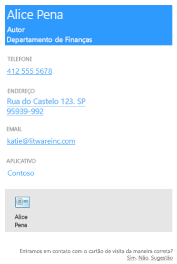
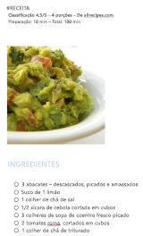
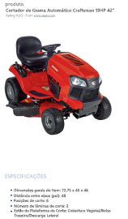

# <a name="use-onenote-api-div-tags-to-extract-data-from-captures"></a>Usar marcas DIV da API do OneNote para extrair dados de capturas 

**Aplica-se a** notebooks do consumidor no OneDrive | Notebooks empresariais no Microsoft 365

Use a API do OneNote para extrair dados do cartão de visitas de uma imagem ou dados de receita e produto de uma URL.

<a name="attributes"></a>

## <a name="extraction-attributes"></a>Atributos de extração

Para extrair e transformar dados, basta incluir um div que especifique o conteúdo de origem, o método de extração e o comportamento de fallback na sua solicitação [create-page](onenote-create-page.md) ou [update-page](onenote-update-page.md). A API processa dados extraídos da página em um formato que é fácil de ler. 

```html
<div
  data-render-src="image-or-url"
  data-render-method="extraction-method"
  data-render-fallback="fallback-action">
</div>
```

### <a name="data-render-src"></a>data-render-src

A fonte de conteúdo. Pode ser uma imagem de um cartão de visitas ou uma URL absoluta de muitos sites populares de receitas ou produtos. Obrigatório.

Para obter melhores resultados ao especificar uma URL, use a URL canônica definida no HTML da página da Web de origem, caso houver uma URL definida. Por exemplo, uma URL canônica pode estar definida na página da Web de origem da seguinte forma:

`<link rel="canonical" href="www.domainname.com/page/123/size12/type987" />` 


### <a name="data-render-method"></a>data-render-method

O método de extração a ser executado. Obrigatório.

| Valor | Descrição |
|:------|:------|
| extract.businesscard | A extração de um cartão de visita. |
| extract.recipe | Uma extração de receita. |
| extract.product | A extração de uma lista de produtos. |
| extract | Um tipo de extração desconhecida. |

Para obter melhores resultados, especifique o tipo de conteúdo (`extract.businesscard`, `extract.recipe` ou `extract.product`) se você conhecê-lo. Se o tipo for desconhecido, use o método `extract` e a API do OneNote tentará detectar o tipo automaticamente.

### <a name="data-render-fallback"></a>data-render-fallback

O comportamento de fallback se a extração falhar. Usa o padrão **renderizar** caso seja omitido. 

| Valor | Descrição |
|:------|:------|
| render | Renderiza a imagem de origem ou um instantâneo da página do produto ou receita. |
| nenhum | Não faz nada.<br /><br />Essa opção é útil se você quiser sempre incluir um instantâneo do cartão de visitas ou da página da Web na página, além de outro conteúdo extraído. Certifique-se enviar um elemento `img` separado na solicitação, conforme mostrado nos exemplos. |

<a name="biz-card"></a>

## <a name="business-card-extractions"></a>Extrações de cartões de visita

A API do OneNote tenta localizar e renderizar as seguintes informações de contato com base em uma imagem do cartão de visitas de uma pessoa ou empresa.

- Nome
- Título
- Organização
- Números de telefone e fax
- Endereços para correspondência e físicos
- Emails
- Sites




Um vCard (arquivo .VCF) com as informações de contato extraídas também é incorporado na página. O vCard é uma maneira conveniente de obter as informações de contato ao recuperar o conteúdo HTML da página.

### <a name="common-scenarios-for-business-card-extractions"></a>Cenários comuns para extrações de cartões de visita

#### <a name="extract-business-card-information-and-also-render-the-business-card-image"></a>Extrair informações do cartão de visitas e também renderizar a imagem do cartão de visitas

Especifique o método `extract.businesscard` e o fallback `none`. Envie também um elemento `img` com o atributo `src` que também faz referência à imagem. Se a API não conseguir extrair conteúdo, ela renderizará apenas a imagem do cartão de visita.

```html 
<div
    data-render-src="name:scanned-card-image"
    data-render-method="extract.businesscard"
    data-render-fallback="none">
</div>

```


#### <a name="extract-business-card-information-and-render-the-business-card-image-only-if-the-extraction-fails"></a>Extrair informações do cartão de visitas e renderizar a imagem do cartão de visitas apenas se a extração falhar

Especifique o método `extract.businesscard` e use o fallback `render` padrão. Se a API não conseguir extrair conteúdo, ela renderizará a imagem do cartão de visita.

```html
<div
    data-render-src="name:scanned-card-image"
    data-render-method="extract.businesscard">
</div>
```
 
Para extrações de cartão de visita, a imagem é enviada como uma parte nomeada em uma solicitação múltiplas. Confira [Adicionar imagens e arquivos](onenote-images-files.md) para ver exemplos que mostram como enviar uma imagem em uma solicitação.


<a name="recipe"></a>

## <a name="recipe-extractions"></a>Extrações receitas

A API do OneNote tenta localizar e renderizar as seguintes informações com base na URL de uma receita.

- Imagem Hero
- Classificação
- Ingredientes
- Instruções
- Preparação, instruções sobre como cozinhar e tempos totais
- Porções




A API é otimizada para receitas de muitos sites populares, como *Allrecipes.com*, *FoodNetwork.com* e *SeriousEats.com*.

### <a name="common-scenarios-for-recipe-extractions"></a>Cenários comuns para extrações de receitas

#### <a name="extract-recipe-information-and-also-render-a-snapshot-of-the-recipe-webpage"></a>Extrair informações da receita e também renderizar um instantâneo da página da receita

Especifique o método `extract.recipe` e o fallback `none`. Envie também um elemento `img` com o atributo `data-render-src` definido como URL da receita. Se a API não conseguir extrair conteúdo, ela renderizará apenas um instantâneo da página da Web da receita.

Este cenário potencialmente fornece mais informações porque a página da Web pode incluir informações adicionais, como comentários e sugestões de clientes.

```html 
<div
    data-render-src="https://allrecipes.com/recipe/guacamole/"
    data-render-method="extract.recipe"
    data-render-fallback="none">
</div>

```
 

#### <a name="extract-recipe-information-and-render-a-snapshot-of-the-recipe-webpage-only-if-the-extraction-fails"></a>Extrair informações da receita e renderizar um instantâneo da página da receita apenas se a extração falhar

Especifique o método `extract.recipe` e use o fallback de renderização padrão. Se a API não conseguir extrair conteúdo, ela renderizará um instantâneo da página da Web da receita.

```html  
<div
    data-render-src="https://www.foodnetwork.com/recipes/alton-brown/creme-brulee-recipe.html"
    data-render-method="extract.recipe">
</div>
```


#### <a name="extract-recipe-information-and-also-render-a-link-to-the-recipe"></a>Extrair informações da receita e também renderizar um link para a receita

Especifique o método `extract.recipe` e o fallback `none`. Envie também um elemento `a` com o atributo `src` definido com a URL da receita (ou você pode enviar qualquer outra informação que queira adicionar à página). Se a API não conseguir extrair conteúdo, apenas o link da receita será renderizado.

```html  
<div
    data-render-src="https://www.seriouseats.com/recipes/2014/09/diy-spicy-kimchi-beef-instant-noodles-recipe.html"
    data-render-method="extract.recipe"
    data-render-fallback="none">
</div>
<a href="https://www.seriouseats.com/recipes/2014/09/diy-spicy-kimchi-beef-instant-noodles-recipe.html">Recipe URL</a>
``` 


<a name="product"></a>

## <a name="product-listing-extractions"></a>Extrações da lista de produtos

- Título
- Classificação
- Imagem principal
- Descrição
- Recursos
- Especificações




A API é otimizada para produtos de muitos sites populares, como *Amazon.com* e *HomeDepot.com*.

### <a name="common-scenarios-for-recipe-extractions"></a>Cenários comuns para extrações de receitas

#### <a name="extract-product-information-and-also-render-a-snapshot-of-the-product-webpage"></a>Extrair informações do produto e também renderizar um instantâneo da página da Web do produto

Especifique o método `extract.product` e o fallback `none`. Envie também um elemento `img` com o atributo `data-render-src` definido como URL do produto. Se a API não conseguir extrair conteúdo, ela renderizará apenas um instantâneo da página da Web do produto.

Este cenário potencialmente fornece mais informações porque a página da Web pode incluir informações adicionais, como comentários e sugestões de clientes.

```html 
<div
    data-render-src="https://www.amazon.com/Microsoft-Band-Small/dp/B00P2T2WVO"
    data-render-method="extract.product"
    data-render-fallback="none">
</div>

```


#### <a name="extract-product-information-and-render-a-snapshot-of-the-product-webpage-only-if-the-extraction-fails"></a>Extrair informações do produto e renderizar um instantâneo da página do produto apenas se a extração falhar

Especifique o método `extract.product` e use o fallback de renderização padrão. Se a API não conseguir extrair conteúdo, ela renderizará um instantâneo da página da Web do produto.

```html 
<div
    data-render-src="https://www.sears.com/craftsman-19hp-42-8221-turn-tight-174-hydrostatic-yard-tractor/p-07120381000P"
    data-render-method="extract.product">
</div>
```
 

#### <a name="extract-product-information-and-also-render-a-link-to-the-product"></a>Extrair informações do produto e também renderizar um link para o produto

Especifique o método `extract.product` e o fallback `none`. Envie também um elemento `a` com o atributo `src` definido com a URL do produto (ou você pode enviar qualquer outra informação que queira adicionar à página). Se a API não conseguir extrair conteúdo, apenas o link da página será renderizado.

```html 
<div
    data-render-src="https://www.homedepot.com/p/Active-Ventilation-5-Watt-Solar-Powered-Exhaust-Attic-Fan-RBSF-8-WT/204203001"
    data-render-method="extract.product"
    data-render-fallback="none">
</div>
<a href="https://www.homedepot.com/p/Active-Ventilation-5-Watt-Solar-Powered-Exhaust-Attic-Fan-RBSF-8-WT/204203001">Product URL</a>
```


<a name="unknown"></a> 

## <a name="unknown-content-type-extractions"></a>Extrações de tipos de conteúdo desconhecidos

Se você não souber o tipo de conteúdo (cartão de visita, receita ou produto) que está enviando, poderá usar o método não qualificado `extract` e permitir que a API do OneNote detecte automaticamente o tipo. É provável que você queira fazer isso se seu aplicativo enviar diferentes tipos de captura.

> **Observação:** se você souber o tipo de conteúdo que está enviando, use o método `extract.businesscard`, `extract.recipe` ou `extract.product`. Em alguns casos, isso pode ajudar a otimizar os resultados da extração.
 
### <a name="common-scenarios-for-unknown-extractions"></a>Cenários comuns para extrações desconhecidas

#### <a name="send-an-image-or-a-url-and-render-the-supplied-image-or-a-snapshot-of-the-webpage-if-the-extraction-fails"></a>Enviar uma imagem ou uma URL e renderizar a imagem fornecida ou um instantâneo da página da Web se a extração falhar

Especifique o método `extract` para que a API detecte automaticamente o tipo de conteúdo e use o fallback de renderização padrão. Se a API não conseguir extrair conteúdo, ela renderizará a imagem fornecida ou o instantâneo da página da Web.

```html 
<div
    data-render-src="some image or url"
    data-render-method="extract">
</div>
```


<a name="request-response-info"></a>

## <a name="response-information"></a>Informações de resposta

| Dados de resposta | Descrição |  
|------|------|  
| Código de êxito | Um código de status HTTP 201 para uma solicitação POST bem-sucedida e um código de status HTTP 204 para uma solicitação PATCH bem-sucedida. |  
| Erros| Leia [Códigos de erro para APIs do OneNote no Microsoft Graph](onenote-error-codes.md) para saber mais sobre erros do OneNote que poderão ser retornados pelo Microsoft Graph. |  


<a name="permissions"></a>

## <a name="permissions"></a>Permissões

Para criar ou atualizar páginas do OneNote, solicite permissões apropriadas. Escolha o nível mais baixo de permissões que seu aplicativo precisa para realizar o trabalho.

#### <a name="permissions-for-post-pages"></a>Permissões para páginas POST

- Notes.Create
- Notes.ReadWrite
- Notes.ReadWrite.All  

#### <a name="permissions-for-patch-pages"></a>Permissões para páginas PATCH

- Notes.ReadWrite
- Notes.ReadWrite.All

Para saber mais sobre escopos de permissão e como eles funcionam, confira [Referência de permissões do Microsoft Graph](permissions-reference.md).


<a name="see-also"></a>

## <a name="see-also"></a>Confira também

- [Criar páginas do OneNote](onenote-create-page.md)
- [Atualizar o conteúdo da página do OneNote](onenote-update-page.md)
- [Adicionar imagens e arquivos](onenote-images-files.md)
- [Integrar com o OneNote](integrate-with-onenote.md)
- [Blog de desenvolvedor do OneNote](https://go.microsoft.com/fwlink/?LinkID=390183)
- [Perguntas de desenvolvimento do OneNote no Microsoft Q&A](/answers/topics/microsoft-graph-notes.html)
- [Repositórios do OneNote no GitHub](https://go.microsoft.com/fwlink/?LinkID=390178)