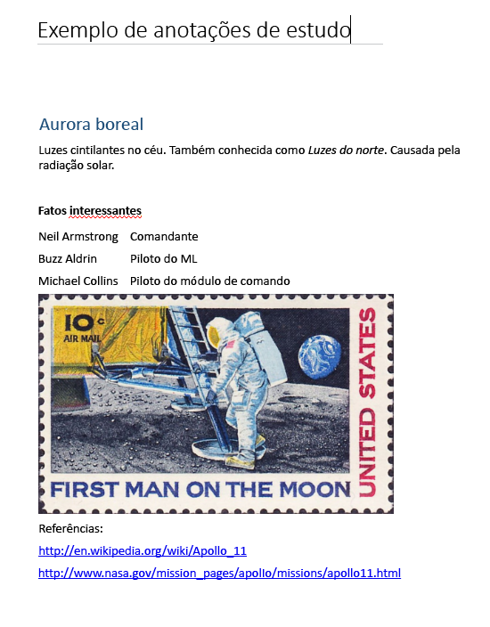

# <a name="input-and-output-html-in-onenote-pages"></a>HTML de entrada e saída nas páginas do OneNote

O HTML que define o conteúdo e a estrutura da página quando você [cria](onenote-create-page.md) ou [atualiza](onenote-update-page.md) uma página do OneNote é chamado de *HTML de entrada*. 

O HTML que é retornado quando você [obtém o conteúdo da página](onenote-get-content.md) é chamado de *HTML de saída*. O HTML de saída não será igual ao HTML de entrada.

As APIs do OneNote no Microsoft Graph preservam o conteúdo semântico e a estrutura básica do HTML de entrada, mas os convertem em um conjunto de [elementos HTML e propriedades CSS com suporte](onenote-create-page.md#supported-html-and-css-for-onenote-pages). As APIs também adicionam atributos personalizados que dão suporte a recursos do OneNote.
 
Este artigo descreve os principais elementos e atributos do HTML de entrada e saída. Pode ser útil entender o HTML de entrada quando você estiver criando ou atualizando o conteúdo da página e o HTML de saída quando estiver analisando o conteúdo da página retornado. 

## <a name="body-element"></a>Elemento body

O conteúdo HTML no corpo da página representa o conteúdo e a estrutura da página, inclusive os recursos de imagem e arquivo. O elemento **body** pode conter os atributos a seguir no HTML de entrada e saída.

#### <a name="input-attributes"></a>Atributos de entrada

|Atributo de entrada|Descrição|
|:------|:------|
| data-absolute-enabled | Indica se o corpo da entrada dá suporte a elementos [posicionados absolutos](onenote-abs-pos.md). |
| style | <p>As propriedades [style](#styles) do CSS do corpo. No HTML de saída, as configurações de entrada podem ser retornadas embutidas em elementos filho apropriados.</p><p>Atualmente, a cor da tela de fundo não tem suporte para o elemento **body**.</p> |
 

#### <a name="output-attributes"></a>Atributos de saída

|Atributo de saída|Descrição|
|:------|:------|
| data-absolute-enabled | Indica se o corpo dá suporte a elementos [posicionados absolutos](onenote-abs-pos.md). Sempre **true** no HTML de saída. |
| style | As propriedades **font-family** e **font-size** do corpo. |


## <a name="div-elements"></a>Elementos Div

Os elementos **Div** contêm texto, imagens e outros tipos de conteúdo. Um elemento **div** pode conter os atributos a seguir no HTML de entrada e saída.

#### <a name="input-attributes"></a>Atributos de entrada

|Atributo de entrada|Descrição|
|:------|:------|
| data-id | Uma referência para o elemento.<br/><br/>Usado para [atualizar conteúdo da página](onenote-update-page.md). |
| data-render-fallback | A ação de fallback se [extraction](onenote-extract-data.md) falhar: **render** (padrão) ou **none** |
| data-render-method | O método [extraction](onenote-extract-data.md) a ser executado, por exemplo:<br/>`extract.businesscard` ou `extract.recipe` |
| data-render-src | A fonte de conteúdo para [extraction](onenote-extract-data.md). |
| style | As propriedades de posição, tamanho, fonte e cor para o div: <ul><li>**posição** (**absoluto** somente), **esquerdo**, **superior** e **largura** (a altura é automaticamente configurada para divs)<br/><br/>Usado para criar um div [posicionado absoluto](onenote-abs-pos.md), somente se o div for um filho direto do corpo quando o corpo define `data-absolute-enabled="true"`.<br/><br/>Exemplo: `<div style="position:absolute;width:360px;top:350px;left:300px" ... />`</li><li>As propriedades [style](#styles) do CSS do elemento. No HTML de saída, esses valores são retornados embutidos em elementos filho apropriados.</li></ul> |
 

As APIs do OneNote no Microsoft Graph encapsulam todo o conteúdo do corpo em pelo menos um div. A API cria um div padrão (atribuído com `data-id="_default"`) para incluir o conteúdo do corpo se:

- O atributo **data-absolute-enabled** do elemento body de entrada for omitido ou definido como **false**. Nesse caso, todo o conteúdo do corpo é colocado no div padrão.

- O atributo **data-absolute-enabled** do elemento body de entrada for **true**, mas o HTML de entrada contiver filhos diretos que não são [elementos](onenote-abs-pos.md)&nbsp;**div**, **img** ou **object** posicionados de forma absoluta. Nesse caso, os filhos diretos que não forem [elementos](onenote-abs-pos.md)&nbsp;**div**, **img** ou **object** posicionados de forma absoluta serão colocados no div padrão.


#### <a name="output-attributes"></a>Atributos de saída

|Atributo de saída|Descrição|
|:------|:------|
| data-id | Uma referência para o elemento.<br/><br/>Usado para [atualizar conteúdo da página](onenote-update-page.md). |
| id | Uma ID exclusiva, gerada para o elemento. Retornado por [solicitações GET a um ponto de extremidade de *conteúdo* da página](/graph/api/page-get?view=graph-rest-1.0) quando a opção de consulta `includeIDs=true` é usada.<br/><br/>Usado para [atualizar conteúdo da página](onenote-update-page.md). |
| style | As propriedades de tamanho e posição do div. |
 
### <a name="non-contributing-divs"></a>Divs não contribuintes

Quando um elemento **div** no HTML de entrada não contribui com a estrutura da página nem carrega informações usadas pelo OneNote, a API move o conteúdo do div para o div pai ou padrão. Isso é ilustrado nos exemplos a seguir.

#### <a name="input-html"></a>HTML de entrada

Contém um div aninhado não contribuinte.

```html
<html>
    <head>
        <title>Page Title</title>
    </head>
    <body>
        <div>
            <p>Some text</p>
            <div>
                <p>More text inside a div that doesn't define page structure</p>
            </div>
        </div>
    </body>
</html>
```

#### <a name="output-html"></a>HTML de saída

> **Observação**: o conteúdo do div foi movido para o div pai e as marcas `<div>` aninhadas foram removidas. O div seria preservado se definisse qualquer informação semântica, como **data-id** (exemplo: `<div data-id="keep-me">`).

```html
<html htmlns="https://www.w3.org/1999/xhtml" lang="en-US">
    <head>
        <title>Page Title</title>
    </head>
    <body data-absolute-enabled="true" style="font-family:Calibri;font-size:11px">
        <div data-id="_default" style="position:absolute;left:48px;top:120px;width:624px">
            <p>Some text</p>
            <p>More text inside a nested div</p>
        </div>
    </body>
</html>
```


## <a name="img-elements"></a>Elementos img

Imagens em páginas do OneNote são representadas pelos elementos **img**. Um elemento **img** pode conter os atributos a seguir no HTML de entrada e saída.

#### <a name="input-attributes"></a>Atributos de entrada

|Atributo de entrada|Descrição|
|:------|:------|
| alt | O texto Alt fornecido para a imagem. |
| data-id | Uma referência para o elemento.<br/><br/>Usado para [atualizar conteúdo da página](onenote-update-page.md). |
| data-render-src |Ou **data-render-src** ou **src** é obrigatório.<br/><br/>A página da Web a ser renderizada como uma imagem mapeada por bit na página do OneNote:<br/><br/> - `data-render-src="https://..."` para uma URL pública.<br/><br/> - `data-render-src="name:BlockName"` para parte de uma imagem no bloco "Apresentação" de uma [solicitação de partes múltiplas](/graph/api/section-post-pages?view=graph-rest-1.0#example).<br/><br/>Esse método é útil quando a página da Web é mais complexa que a página que o OneNote pode renderizar fielmente ou quando a página exige credenciais de logon.|
| data-tag | Uma [marca de anotação](onenote-note-tags.md) no elemento. |
| style |As propriedades de posição e tamanho para a imagem: **position** (somente **absolute**), **left**, **top**, **width** e **height**.<br/><br/>O tamanho pode ser definido em qualquer imagem.<br/><br/>As propriedades de posição serão usadas para criar uma imagem [posicionada absoluta](onenote-abs-pos.md), somente se a imagem for um filho direto do corpo quando o corpo define `data-absolute-enabled="true"`.<br/><br/>Exemplo: ``<br/><br/>No HTML de saída, o tamanho da imagem é retornado separadamente nos atributos **width** e **height**. |
| src |Ou **src** ou **data-render-src** é obrigatório.<br/><br/>A imagem a ser renderizada na página do OneNote:<br/><br/>- `src="https://..."` para uma URL para uma imagem publicamente disponível na Internet.<br/><br/> - `src="name:BlockName"` para uma parte nomeada em uma solicitação de partes múltiplas que representa a imagem.|
| width, height | A largura ou altura da imagem, em pixels, mas sem o px. Exemplo: `width="400"` |
 
> **Observação:** as APIs do OneNote detectam automaticamente o tipo de imagem de entrada e o retornam como o **data-fullres-src-type** no HTML de saída. A API também retorna o tipo de imagem da imagem otimizada em **data-src-type**.
 

#### <a name="output-attributes"></a>Atributos de saída

|Atributo de saída|Descrição|
|:------|:------|
| alt | O texto Alt fornecido para a imagem. |
| data-id | Uma referência para o elemento.<br/><br/>Usado para [atualizar conteúdo da página](onenote-update-page.md). |
| data-index | A posição da imagem. Para suporte à [divisão de imagem](#split-images). |
| data-fullres-src | O ponto de extremidade para a versão do recurso de imagem que foi originalmente inserido na página. |
| data-fullres-src-type | O tipo de mídia do recurso **data-fullres-src**, por exemplo: `image/png` ou `image/jpeg`. |
| data-options | O tipo de fonte: **printout** para arquivos PDF ou **splitimage** para todos os outros. Aplica-se somente à [divisão de imagens](#split-images) criada com o atributo **data-render-src**. |
| data-render-original-src | A URL de origem original da imagem, se a imagem da origem for da Internet pública e tiver sido criada com o atributo **data-render-src**. |
| data-src-type | O tipo de mídia do recurso **src**, por exemplo: `image/png` ou `image/jpeg`. |
| data-tag | Uma [marca de anotação](onenote-note-tags.md) no elemento. |
| id | Uma ID exclusiva, gerada para o elemento. Retornado por [solicitações GET a um ponto de extremidade de *conteúdo* da página](/graph/api/page-get?view=graph-rest-1.0) quando a opção de consulta `includeIDs=true` é usada.<br/><br/>Usado para [atualizar conteúdo da página](onenote-update-page.md). |
| src | O ponto de extremidade para a versão do recurso de imagem que foi otimizada para navegadores da Web, bem como para fatores forma de dispositivos móveis e tablet. |
| style | As propriedades de posição da imagem. |
| width, height | A largura ou altura da imagem, em pixels. |
 

### <a name="output-html-examples-for-images"></a>Exemplos de HTML de saída para imagens

Os elementos **img** de saída contêm pontos de extremidade para recursos de arquivo de imagem e o tipo de imagem, como mostrado abaixo. Você pode fazer [solicitações GET separadas a pontos de extremidade de recurso de imagem](/graph/api/resource-get?view=graph-rest-1.0) para recuperar os respectivos conteúdos binários.

```html

```

Os exemplos a seguir mostram as informações que um elemento **img** pode conter no HTML de saída.

#### <a name="image-with-web-ready-and-high-resolution-resources"></a>Imagem com recursos de resolução alta e prontos para Web

```html

```

#### <a name="image-created-by-using-the-data-render-src-attribute"></a>Imagem criada usando o atributo *data-render-src*

```html

```

### <a name="split-images"></a>Dividir imagens

As imagens que são criadas usando o atributo **data-render-src** (de uma URL de página da Web ou de uma parte nomeada) podem ser divididas em várias imagens de componente por motivos de desempenho e renderização. Todas as imagens de componente recebem o mesmo valor de **data-id**. Cada imagem de componente tem um atributo de índice por dados com base zero que define o layout vertical original.

#### <a name="split-image-with-three-component-images"></a>Dividir imagem com três imagens de componente

```html
<div data-id="multi-component-image" style="position:absolute;left:48px;top:120px;width:624px">
    
    
    
</div>
```

Como os usuários podem mover as imagens na página, os índices retornados podem estar fora de ordem. A ordenação deve estar na ordem y, de cima para baixo, e na ordem x, da esquerda para a direita, se houver conflitos na ordem y.

## <a name="iframe-elements"></a>Elementos iframe

As páginas do OneNote podem conter vídeos inseridos representados pelos elementos **iframe**. 

> **Observação:** você também pode [anexar um arquivo de vídeo usando um elemento **object**](onenote-images-files.md#adding-files).

#### <a name="input-attributes"></a>Atributos de entrada

|Atributo de entrada|Descrição|
|:------|:------|
| data-original-src | Obrigatório. A URL da fonte do vídeo. Veja a [lista de fontes de vídeo com suporte](onenote-images-files.md#adding-videos). <br/><br/>Exemplo: `data-original-src="https://www.youtube.com/watch?v=3Ztr44aKmQ8"` |
| width, height | A largura ou altura do iframe, em pixels. Exemplo: `width=300` |

#### <a name="output-attributes"></a>Atributos de saída

|Atributo de saída|Descrição|
|:------|:------|
| data-original-src | A URL da fonte do vídeo. |
| src | O link para o vídeo que é inserido na página do OneNote. |
| width, height | A largura ou altura do iframe, em pixels.<br/><br/>Exemplo: `width=300` |
 
### <a name="output-html-example-for-videos"></a>Exemplo de HTML de saída para vídeos

Os elementos **iframe** de saída contêm pontos de extremidade que se vinculam à página e ao vídeo da fonte, como mostrado. 

```html
<iframe 
    width="340" height="280" 
    data-original-src="https://www.youtube.com/watch?v=3Ztr44aKmQ8" 
    src="https://www.youtube.com/embed/3Ztr44aKmQ8?feature=oembed&autoplay=true" />
``` 

## <a name="object-elements"></a>Elementos object

As páginas do OneNote contêm anexos de arquivo representados pelos elementos **object**. Um elemento **object** pode conter os atributos a seguir no HTML de entrada e saída.

> **Observação:** As APIs do OneNote também podem renderizar conteúdo de arquivo como imagens em uma página quando o arquivo é enviado como uma imagem e usa o atributo **data-render-src**.
> Exemplo: ``
 

#### <a name="input-attributes"></a>Atributos de entrada

|Atributo de entrada|Descrição|
|:------|:------|
| data | Obrigatório. O nome da parte que representa o arquivo na [solicitação de partes múltiplas](/graph/api/section-post-pages?view=graph-rest-1.0#example). |
| data-attachment | Necessário. O nome do arquivo. |
| data-id | Uma referência para o elemento.<br/><br/>Usado para [atualizar conteúdo da página](onenote-update-page.md). |
| style | As propriedades de posição e tamanho para o objeto: **position** (somente **absolute**), **left**, **top** e **width**.<br/><br/>Usado para criar um objeto [posicionado absoluto](onenote-abs-pos.md), somente se o objeto for um filho direto do corpo quando o corpo define `data-absolute-enabled="true"`.<br/><br/>Exemplo: `<object style="position:absolute;top:350px;left:300px" ... />` |
| type | Obrigatório.<br/><br/>O tipo de arquivo de mídia padrão. Os tipos de arquivo conhecidos exibem o ícone associado ao tipo de arquivo na página do OneNote. Os tipos de arquivo desconhecidos exibem um ícone de arquivo genérico. |
<!--todo: add link to known file types--> 

#### <a name="output-attributes"></a>Atributos de saída

|Atributo de saída|Descrição|
|:------|:------|
| data | O ponto de extremidade para o recurso de arquivo. |
| data-attachment | O nome do arquivo. |
| data-id | Uma referência para o elemento.<br/><br/>Usado para [atualizar conteúdo da página](onenote-update-page.md). |
| id | Uma ID exclusiva, gerada para o elemento. Retornado por [solicitações GET a um ponto de extremidade de *conteúdo* da página](/graph/api/page-get?view=graph-rest-1.0) quando a opção de consulta `includeIDs=true` é usada.<br/><br/>Usado para [atualizar conteúdo da página](onenote-update-page.md). |
| style | As propriedades de posição do objeto. |
| type | O tipo de arquivo de mídia padrão. |
 

#### <a name="output-html-example-for-objects"></a>Exemplo de HTML de saída para objetos

Os elementos **object** de saída contêm pontos de extremidade que se vinculam aos recursos de arquivo na página, como mostrado. Você pode fazer [solicitações GET separadas a pontos de extremidade de recurso de arquivo](/graph/api/resource-get?view=graph-rest-1.0) para recuperar os respectivos conteúdos binários.

```html
<object
    data="https://graph.microsoft.com/v1.0/me/onenote/resources/{file-id}/$value"
    data-attachment="fileName.pdf" 
    type="application/pdf" 
    [style="..."] />
``` 

## <a name="paragraphs-and-headings"></a>Parágrafos e cabeçalhos

Os parágrafos, cabeçalhos e outros contêineres de texto podem incluir os atributos a seguir no HTML de entrada e saída.

#### <a name="input-attributes"></a>Atributos de entrada

|Atributo de entrada|Descrição|
|:------|:------|
| data-id | Uma referência para o elemento.<br/><br/>Usado para [atualizar conteúdo da página](onenote-update-page.md). |
| data-tag | Uma [marca de anotação](onenote-note-tags.md) em um elemento **p** ou **h1** - **h6**. |
| style | As propriedades [style](#styles) do CSS do elemento. |
 

#### <a name="output-attributes"></a>Atributos de saída

|Atributo de saída|Descrição|
|:------|:------|
| data-id | Uma referência para o elemento.<br/><br/>Usado para [atualizar conteúdo da página](onenote-update-page.md). |
| data-tag | Uma [marca de anotação](onenote-note-tags.md) em um elemento **p** ou **h1** - **h6**. |
| id | Uma ID exclusiva, gerada para o elemento. Retornado por [solicitações GET a um ponto de extremidade de *conteúdo* da página](/graph/api/page-get?view=graph-rest-1.0) quando a opção de consulta `includeIDs=true` é usada.<br/><br/>Usado para [atualizar conteúdo da página](onenote-update-page.md). |
| style | As propriedades [style](#styles) do CSS do elemento. No HTML de saída, esses valores podem ser retornados embutidos em elementos filho apropriados ou em elementos **span**. |
 

Os exemplos a seguir mostram HTML de entrada que usa maneiras diferentes de definir estilos em contêineres de texto e o HTML de saída que é retornado.

#### <a name="input-html-with-styles-defined-using-inline-character-styles-in-the-start-tag-and-within-a-span-element"></a>HTML de entrada com estilos definidos usando estilos de caractere embutidos, na marca de início, e dentro de um elemento span.

```html
<h1>Heading <i>One</i> text</h1>
<p style="font-size:8pt;color:green;font-family:Courier;text-align:center">Some text</p>
<p>Some <span  style="font-size:16px;color:#ff0000;font-family:Segoe UI Black">more</span> text</p>
``` 

#### <a name="output-html-with-the-i-character-style-and-the-font-settings-in-the-p-start-tag-returned-as-inline-css-styles-on-span-elements"></a>Saída HTML com o estilo de caractere `<i>` e as configurações de fonte na marca de início `<p>` retornadas como estilos CSS embutidos em elementos span.

```html
<h1 style="font-size:16pt;color:#1e4e79;margin-top:11pt;margin-bottom:11pt">Heading <span style="font-style:italic">One</span> text</h1>
<p style="text-align:center"><span style="font-family:Courier;font-size:8pt;color:green">Some text</span></p>
<p>Some <span style="font-family:Segoe UI Black;font-size:12pt;color:red">more</span> text</p>
``` 


## <a name="lists"></a>Listas

As listas são representadas como elementos **ol** ou **ul** que contêm itens de lista representados como elementos **li**.

Listas e itens de lista podem conter os atributos a seguir no HTML de entrada e saída.

#### <a name="input-attributes"></a>Atributos de entrada

|Atributo de entrada|Descrição|
|:------|:------|
| data-id | Uma referência para o elemento.<br/><br/>Usado para [atualizar conteúdo da página](onenote-update-page.md). |
| data-tag | Uma [marca de anotação](onenote-note-tags.md) em um elemento **ul**, **ol** ou **li**. |
| style | O **list-style-type** e as propriedades [style](#styles) do CSS para a lista ou o item de lista. |
 

#### <a name="output-attributes"></a>Atributos de saída

|Atributo de saída|Descrição|
|:------|:------|
| data-id | Uma referência para o elemento.<br/><br/>Usado para [atualizar conteúdo da página](onenote-update-page.md). |
| data-tag |  Uma [marca de anotação](onenote-note-tags.md) em um período em um elemento **li**. |
| id | Uma ID exclusiva, gerada para o elemento. Retornado por [solicitações GET a um ponto de extremidade de *conteúdo* da página](/graph/api/page-get?view=graph-rest-1.0) quando a opção de consulta `includeIDs=true` é usada.<br/><br/>Usado para [atualizar conteúdo da página](onenote-update-page.md). |
| style | O **list-style-type** e as propriedades [style](#styles) do CSS do elemento. No HTML de saída, as configurações no nível de lista são retornadas em itens de lista. As propriedades padrão não são retornadas. |
 
### <a name="list-styles"></a>Estilos de lista

As APIs do OneNote no Microsoft Graph dão suporte aos seguintes estilos de lista:

|Lista ordenada|Lista não ordenada|
|:------|:------|
| none | none |
| decimal (default) | disc (default) |
| lower-alpha | circle |
| lower-roman | square |
| upper-alpha | &nbsp; |
| upper-roman | &nbsp; |
 
Você pode aplicar estilos globais para uma lista no elemento **ol** ou **ul** no HTML de entrada, mas estilos são retornados nos elementos **li**.

#### <a name="homogenous-list-style"></a>Estilo de lista homogêneo

Este exemplo mostra o HTML de entrada que define o tipo de estilo de lista no elemento **ol** e estilos CSS em itens de lista individuais.

```html
<ol style="list-style-type:upper-roman;color:blue">
    <li style="font-weight:bold">Jacksonville</li>
    <li style="text-decoration:line-through">Orlando</li>
    <li style="font-family:Courier">Naples</li>
</ol>
``` 

Este é o HTML de saída. Observe que os estilos são retornados embutidos nos elementos **li** ou **span** individuais.

```html
<ol>
    <li style="list-style-type:upper-roman"><span style="color:blue;font-weight:bold">Jacksonville</span></li>
    <li style="list-style-type:upper-roman"><span style="color:blue;text-decoration:line-through">Orlando</span></li>
    <li style="list-style-type:upper-roman"><span style="font-family:Courier;color:blue">Naples</span></li>
</ol>
``` 

#### <a name="variable-list-styles"></a>Estilos de lista variáveis

Este exemplo mostra o HTML de entrada que define diferentes tipos de estilo de lista nos elementos **li**.

```html
<ul style="font-style:italic">
    <li style="list-style-type:square">square style</li>
    <li style="list-style-type:circle">circle style</li>
    <li style="list-style-type:disc">disc style (default)</li>
</ul>
``` 

Este é o HTML de saída. Observe que os estilos são retornados embutidos nos elementos **li** ou **span** individuais.

```html
<ul>
    <li style="list-style-type:square"><span style="font-style:italic">square style</span></li>
    <li style="list-style-type:circle"><span style="font-style:italic">circle style</span></li>
    <li><span style="font-style:italic">disc style (default)</span></li>
</ul>
``` 


## <a name="tables"></a>Tabelas

As tabelas são representadas como elementos **table** que podem conter elementos **tr** e **td**. Há suporte para tabelas aninhadas.

As tabelas podem conter os atributos a seguir no HTML de entrada e saída. As APIs do OneNote não dão suporte aos atributos **rowspan** ou **colspan**. 

#### <a name="input-attributes"></a>Atributos de entrada

|Atributo de entrada|Descrição|
|:------|:------|
| data-id | Uma referência para o elemento.<br/><br/>Usado para [atualizar conteúdo da página](onenote-update-page.md). |
| style | As propriedades [style](#styles) do CSS do elemento e também:<br/> - **width**. Com suporte de **table** e **td** como pixels ou porcentagem de largura da página.<br/><br/>Exemplo: `width="100px"` ou `width="60%"` |
| borda | Adiciona borda à tabela com largura especificada |
| largura | Largura da tabela |
| bgcolor | A cor do plano de fundo da tabela |

**Observação:** não há suporte para o uso da propriedade **border** no atributo do estilo de uma tabela de html de entrada. 
 

#### <a name="output-attributes"></a>Atributos de saída

|Atributo de saída|Descrição|
|:------|:------|
| data-id | Uma referência para o elemento.<br/><br/>Usado para [atualizar conteúdo da página](onenote-update-page.md). |
| id | Uma ID exclusiva, gerada para o elemento. Retornado por [solicitações GET a um ponto de extremidade de *conteúdo* da página](/graph/api/page-get?view=graph-rest-1.0) quando a opção de consulta `includeIDs=true` é usada.<br/><br/>Usado para [atualizar conteúdo da página](onenote-update-page.md). |
| style | As propriedades [style](#styles) do CSS do elemento. |
 

Os exemplos a seguir mostram HTML de entrada que usa maneiras diferentes de definir estilos em tabelas e o HTML de saída que é retornado.

#### <a name="input-html-with-optional-settings-at-different-levels"></a>HTML de entrada com configurações opcionais em níveis diferentes.

```html
<table border="1"; Width="500"; bgcolor = "green">
    <tr> 
        <td>Cell 1</td> 
        <td>Cell 2</td> 
        <td>Cell 3</td> 
    </tr> 
    <tr style="background-color:blue"> 
        <td style="text-align:right;background-color:red">Left</td> 
        <td style="text-align:center">Middle</td> 
        <td>Right</td> 
    </tr> 
</table>
```
 
#### <a name="output-html-with-css-styles-returned-inline-on-the-td-elements"></a>HTML de saída com estilos CSS retornados embutidos nos elementos td.

```html
<table style="border:0px">
    <tr>
        <td style="background-color:green;width:166;border:0px">Cell 1</td>
        <td style="background-color:green;width:166;border:0px">Cell 2</td>
        <td style="background-color:green;width:166;border:0px">Cell 3</td>
    </tr>
    <tr>
        <td style="background-color:red;width:166;border:0px;text-align:right">Left</td>
        <td style="background-color:blue;width:166;border:0px;text-align:center">Middle</td>
        <td style="background-color:blue;width:166;border:0px">Right</td>
    </tr>
</table>
``` 


## <a name="styles"></a>Estilos

As APIs do OneNote no Microsoft Graph dão suporte as propriedades **style** do CSS embutidas a seguir para elementos no corpo da página, como **body**, **div**, **p**, **li** e **span**.

|Propriedade|Exemplo|
|:------|:------|
| background-color | `style="background-color:#66cc66"` (o padrão é branco)<br/><br/>Há suporte para cores nomeadas e formato hexadecimal. |
| color | `style="color:#ffffff"` (o padrão é preto) |
| font-family | `style="font-family:Courier"` (o padrão é Calibri) |
| font-size | `style="font-size:10pt"` (o padrão é 11pt)<br/><br/>As APIs aceitam o tamanho da fonte em *pt* ou *px*, mas converte *px* em *pt*. Valores decimais são arredondados para o n,0pt ou n,5pt mais próximo. |
| font-style | `style="font-style:italic"` (somente normal ou itálico) |
| font-weight | `style="font-weight:bold"` (somente normal ou negrito) |
| strike-through | `style="text-decoration:line-through"` |
| text-align | `style="text-align:center"` (somente para elementos de bloco) |
| text-decoration | `style="text-decoration:underline"` (somente nenhum ou sublinhado) |
 

Os seguintes estilos de caractere embutidos também têm suporte:

<table id="simpletable">
<tr>
<td id="simplecell">&lt;b&gt;</td>
<td id="simplecell">&lt;i&gt;</td>
<td id="simplecell">&lt;u&gt;</td>
</tr>
<tr>
<td id="simplecell">&lt;em&gt;</td>
<td id="simplecell">&lt;strong&gt;</td>
<td id="simplecell">&lt;strike&gt;</td>
</tr>
<tr>
<td id="simplecell">&lt;sup&gt;</td>
<td id="simplecell">&lt;sub&gt;</td>
<td id="simplecell">&lt;del&gt;</td>
</tr>
<tr>
<td id="simplecell">&lt;cite&gt;</td>
<td id="simplecell">&nbsp;</td>
<td id="simplecell">&nbsp;</td>
</tr>
</table>

 
## <a name="input-and-output-html-example"></a>Exemplo de HTML de entrada e saída

A imagem a seguir mostra uma página simples que foi criada com o Microsoft Graph.



Este é o HTML de entrada enviado no corpo da mensagem para criar a página.

```html
<html lang="en-US">
    <head>
        <title>Sample Study Notes</title>
        <meta name="created" content="2015-01-01T01:01"/>
    </head>
    <body>
        <h1>Aurora Borealis</h1>
        <p>Dancing lights in the sky. Also called <i>Northern Lights</i>. Caused by solar radiation.</p>
        <br />
        <p><b>Intersting facts</b></p>
        <table>
            <tr>
                <td>Neil Armstrong</td>
                <td>Commander</td>
            </tr>
            <tr>
                <td>Buzz Aldrin</td>
                <td>LM Pilot</td>
            </tr>
            <tr>
                <td>Michael Collins</td>
                <td>Command Module Pilot</td>
            </tr>
        </table>
        
        <p>References:</p>
        <p><a href="https://en.wikipedia.org/wiki/Apollo_11">https://en.wikipedia.org/wiki/Apollo_11</a></p>
        <p><a href="https://www.nasa.gov/mission_pages/apollo/missions/apollo11.html">https://www.nasa.gov/mission_pages/apollo/missions/apollo11.html</a></p>
    </body>
</html>
``` 

<br/>

Este é o HTML de saída que o Microsoft Graph retorna quando você [obtém o conteúdo da página](onenote-get-content.md).

> **Observação:** quando você [cria uma página](onenote-create-page.md) ou [obtém metadados de página](/graph/api/page-get?view=graph-rest-1.0), a API retorna a URL de ponto de extremidade do *conteúdo* da página na propriedade **contentUrl**.

```html
<html htmlns="https://www.w3.org/1999/xhtml" lang="en-US">
    <head>
        <title>Sample Study Notes</title>
    </head>
    <body data-absolute-enabled="true" style="font-family:Calibri;font-size:11pt">
        <div data-id="_default" style="position:absolute;left:48px;top:120px;width:624px">
            <h1 style="font-size:16pt;color:#1e4e79;margin-top:11pt;margin-bottom:11pt">American History 101: Moon Landing</h1>
            <p>First moon landing - July 20, 1969 with Apollo 11 (Eagle)</p>
            <br />
            <p><span style="font-weight:bold">Apollo 11 Astronauts</span></p>
            <table style="border:0px">
                <tr>
                    <td style="border:0px">Neil Armstrong</td>
                    <td style="border:0px">Commander</td>
                </tr>
                <tr>
                    <td style="border:0px">Buzz Aldrin</td>
                    <td style="border:0px">LM Pilot</td>
                </tr>
                <tr>
                    <td style="border:0px">Michael Collins</td>
                    <td style="border:0px">Command Module Pilot</td>
                </tr>
            </table>
            <br />
            
            <p>References:</p>
            <p><a href="https://en.wikipedia.org/wiki/Apollo_11">https://en.wikipedia.org/wiki/Apollo_11</a></p>
            <p><a href="https://www.nasa.gov/mission_pages/apollo/missions/apollo11.html">https://www.nasa.gov/mission_pages/apollo/missions/apollo11.html</a></p>
        </div>
    </body>
</html>
``` 

## <a name="see-also"></a>Confira também

- [Obter a estrutura e o conteúdo do OneNote](onenote-get-content.md)
- [Criar páginas do OneNote](onenote-create-page.md)
- [Atualizar o conteúdo da página do OneNote](onenote-update-page.md)
- [Adicionar imagens, vídeos e arquivos](onenote-images-files.md)
