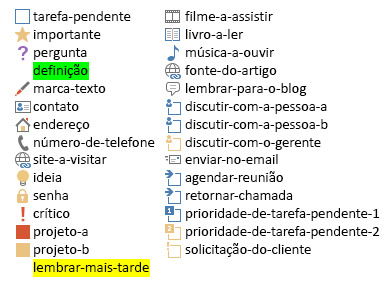

# <a name="use-note-tags-in-onenote-pages"></a><span data-ttu-id="9964c-103">Usar marcas de notas nas páginas do OneNote</span><span class="sxs-lookup"><span data-stu-id="9964c-103">Use note tags in OneNote pages</span></span>

<span data-ttu-id="9964c-104">**Aplica-se a** notebooks do consumidor no OneDrive | Notebooks empresariais no Microsoft 365</span><span class="sxs-lookup"><span data-stu-id="9964c-104">**Applies to** Consumer notebooks on OneDrive | Enterprise notebooks on Microsoft 365</span></span>

<span data-ttu-id="9964c-105">Use o atributo `data-tag` para adicionar e atualizar caixas de seleção, estrelas e outras marcas de anotação incorporadas em uma página do OneNote, conforme mostrado na imagem a seguir.</span><span class="sxs-lookup"><span data-stu-id="9964c-105">Use the `data-tag` attribute to add and update check boxes, stars, and other built-in note tags on a OneNote page, as shown in the following image.</span></span>


<a name="attributes"></a>

## <a name="note-tag-attributes"></a><span data-ttu-id="9964c-107">Atributos de marcas de anotação</span><span class="sxs-lookup"><span data-stu-id="9964c-107">Note tag attributes</span></span>

<span data-ttu-id="9964c-108">No código HTML de uma página do OneNote, uma marca de anotação é representada pelo atributo `data-tag`.</span><span class="sxs-lookup"><span data-stu-id="9964c-108">In the HTML of a OneNote page, a note tag is represented by the `data-tag` attribute.</span></span> <span data-ttu-id="9964c-109">Por exemplo:</span><span class="sxs-lookup"><span data-stu-id="9964c-109">For example:</span></span>

- <span data-ttu-id="9964c-110">Uma caixa de tarefas pendentes desmarcada: `<p data-tag="to-do">`</span><span class="sxs-lookup"><span data-stu-id="9964c-110">An unchecked to-do box:  `<p data-tag="to-do">`</span></span>

- <span data-ttu-id="9964c-111">Uma caixa de tarefas pendentes marcada: `<p data-tag="to-do:completed">`</span><span class="sxs-lookup"><span data-stu-id="9964c-111">A checked to-do box:  `<p data-tag="to-do:completed">`</span></span>

- <span data-ttu-id="9964c-112">Uma estrela:  `<h2 data-tag="important">`</span><span class="sxs-lookup"><span data-stu-id="9964c-112">A star:  `<h2 data-tag="important">`</span></span>

<span data-ttu-id="9964c-113">O valor `data-tag` é composto por uma forma e, às vezes, um status (confira todos os [valores compatíveis](#built-in-note-tags-for-onenote)).</span><span class="sxs-lookup"><span data-stu-id="9964c-113">A `data-tag` value is composed of a shape, and sometimes a status (see all [supported values](#built-in-note-tags-for-onenote)).</span></span>

| <span data-ttu-id="9964c-114">Propriedade</span><span class="sxs-lookup"><span data-stu-id="9964c-114">Property</span></span> | <span data-ttu-id="9964c-115">Descrição</span><span class="sxs-lookup"><span data-stu-id="9964c-115">Description</span></span> |
|:------|:------|
| <span data-ttu-id="9964c-116">forma</span><span class="sxs-lookup"><span data-stu-id="9964c-116">shape</span></span> | <span data-ttu-id="9964c-117">O identificador da marca de anotação (exemplo: `to-do` ou `important`).</span><span class="sxs-lookup"><span data-stu-id="9964c-117">The identifier of the note tag (example: `to-do` or `important`).</span></span> |
| <span data-ttu-id="9964c-118">status</span><span class="sxs-lookup"><span data-stu-id="9964c-118">status</span></span> | <span data-ttu-id="9964c-119">O status das marcas de anotação da caixa de seleção.</span><span class="sxs-lookup"><span data-stu-id="9964c-119">The status of check box note tags.</span></span> <span data-ttu-id="9964c-120">Isso só é usado para configurar caixas de seleção como concluídas.</span><span class="sxs-lookup"><span data-stu-id="9964c-120">This is used only to set check boxes as completed.</span></span> |


<a name="note-tags"></a>

## <a name="add-or-update-note-tags"></a><span data-ttu-id="9964c-121">Adicionar ou atualizar marcas de anotação</span><span class="sxs-lookup"><span data-stu-id="9964c-121">Add or update note tags</span></span>

<span data-ttu-id="9964c-122">Para adicionar ou atualizar uma marca de anotação incorporada, basta usar o atributo `data-tag` em um elemento com suporte.</span><span class="sxs-lookup"><span data-stu-id="9964c-122">To add or update a built-in note tag, just use the `data-tag` attribute on a supported element.</span></span> <span data-ttu-id="9964c-123">Por exemplo, observe um parágrafo marcado como importante:</span><span class="sxs-lookup"><span data-stu-id="9964c-123">For example, here's a paragraph marked as important:</span></span>

```html
<p data-tag="important">...</p>
```

<span data-ttu-id="9964c-124">Separe várias marca de anotação por vírgulas:</span><span class="sxs-lookup"><span data-stu-id="9964c-124">Separate multiple note tags with commas:</span></span>

```html
<p data-tag="important, critical">...</p>
```

<span data-ttu-id="9964c-125">Você pode definir uma `data-tag` nos seguintes elementos:</span><span class="sxs-lookup"><span data-stu-id="9964c-125">You can define a `data-tag` on the following elements:</span></span>

- <span data-ttu-id="9964c-126">p</span><span class="sxs-lookup"><span data-stu-id="9964c-126">p</span></span>
- <span data-ttu-id="9964c-127">ul, ol, li (saiba mais sobre [marcas de anotação em listas](#note-tags-on-lists))</span><span class="sxs-lookup"><span data-stu-id="9964c-127">ul, ol, li (see more about [note tags on lists](#note-tags-on-lists))</span></span>
- <span data-ttu-id="9964c-128">img</span><span class="sxs-lookup"><span data-stu-id="9964c-128">img</span></span>
- <span data-ttu-id="9964c-129">h1 – h6</span><span class="sxs-lookup"><span data-stu-id="9964c-129">h1 - h6</span></span>
- <span data-ttu-id="9964c-130">título</span><span class="sxs-lookup"><span data-stu-id="9964c-130">title</span></span>

<span data-ttu-id="9964c-131">Confira [Marcas de anotação incorporadas](#built-in-note-tags-for-onenote) para obter uma lista de marcas de anotação que podem ser usadas com o Microsoft Graph.</span><span class="sxs-lookup"><span data-stu-id="9964c-131">See [Built-in note tags](#built-in-note-tags-for-onenote) for a list of note tags that you can use with Microsoft Graph.</span></span> <span data-ttu-id="9964c-132">Não há suporte para adicionar ou atualizar marcas personalizadas usando o Microsoft Graph.</span><span class="sxs-lookup"><span data-stu-id="9964c-132">Adding or updating custom tags using Microsoft Graph is not supported.</span></span>

### <a name="examples"></a><span data-ttu-id="9964c-133">Exemplos</span><span class="sxs-lookup"><span data-stu-id="9964c-133">Examples</span></span>

<span data-ttu-id="9964c-134">Veja uma lista simples de tarefas pendentes com o primeiro item marcado como concluído.</span><span class="sxs-lookup"><span data-stu-id="9964c-134">Here's a simple to-do list with the first item completed.</span></span>

```html
<p data-tag="to-do:completed" data-id="prep">Till garden bed</p>
<p data-tag="to-do" data-id="spring">Plant peas and spinach</p>
<p data-tag="to-do" data-id="summer">Plant tomatoes and peppers</p>
```

<span data-ttu-id="9964c-135">Observe que as `<p>` marcas acima incluem cada uma o atributo `data-id`.</span><span class="sxs-lookup"><span data-stu-id="9964c-135">Note that the `<p>` tags above each include a `data-id` attribute.</span></span> <span data-ttu-id="9964c-136">Isso facilita a atualização das marcas de anotação da caixa de seleção.</span><span class="sxs-lookup"><span data-stu-id="9964c-136">This makes it easier to update the check box note tags.</span></span> <span data-ttu-id="9964c-137">Por exemplo, a seguinte solicitação marca o item “plantio da primavera” como concluído.</span><span class="sxs-lookup"><span data-stu-id="9964c-137">For example, the following request marks the spring planting to-do item as completed.</span></span>

```http
PATCH https://graph.microsoft.com/v1.0/me/onenote/notebooks/pages/{page-id}/content

Content-Type: application/json
Authorization: Bearer {token}

[
   {
    'target':'#spring',
    'action':'replace',
    'content':'<p data-tag="to-do:completed"  data-id="spring">Plant peas and spinach</p>'
  }
]
```

<span data-ttu-id="9964c-138">A seguinte solicitação cria uma página que contém todas as [marcas de anotação incorporadas](#built-in-note-tags-for-onenote).</span><span class="sxs-lookup"><span data-stu-id="9964c-138">The following request creates a page that contains all [built-in note tags](#built-in-note-tags-for-onenote).</span></span>

```html
POST https://graph.microsoft.com/v1.0/me/onenote/notebooks/pages

Content-Type: text/html
Authorization: Bearer {token}


<!DOCTYPE html>
<html>
  <head>
    <title data-tag="to-do:completed">All built-in note tags</title>
  </head>
  <body>
    <h1 data-tag="important">Paragraphs with built-in note tags</h1>
    <p data-tag="to-do">to-do</p>
    <p data-tag="important">important</p>
    <p data-tag="question">question</p>
    <p data-tag="definition">definition</p>
    <p data-tag="highlight">highlight</p>
    <p data-tag="contact">contact</p>
    <p data-tag="address">address</p>
    <p data-tag="phone-number">phone-number</p>
    <p data-tag="web-site-to-visit">web-site-to-visit</p>
    <p data-tag="idea">idea</p>
    <p data-tag="password">password</p>
    <p data-tag="critical">critical</p>
    <p data-tag="project-a">project-a</p>
    <p data-tag="project-b">project-b</p>
    <p data-tag="remember-for-later">remember-for-later</p>
    <p data-tag="movie-to-see">movie-to-see</p>
    <p data-tag="book-to-read">book-to-read</p>
    <p data-tag="music-to-listen-to">music-to-listen-to</p>
    <p data-tag="source-for-article">source-for-article</p>
    <p data-tag="remember-for-blog">remember-for-blog</p>
    <p data-tag="discuss-with-person-a">discuss-with-person-a</p>
    <p data-tag="discuss-with-person-b">discuss-with-person-b</p>
    <p data-tag="discuss-with-manager">discuss-with-manager</p>
    <p data-tag="send-in-email">send-in-email</p>
    <p data-tag="schedule-meeting">schedule-meeting</p>
    <p data-tag="call-back">call-back</p>
    <p data-tag="to-do-priority-1">to-do-priority-1</p>
    <p data-tag="to-do-priority-2">to-do-priority-2</p>
    <p data-tag="client-request">client-request</p>
    <h1 data-tag="important">Paragraphs with check boxes marked with "completed" status</h1>
    <p data-tag="to-do:completed">to-do:completed</p>
    <p data-tag="discuss-with-person-a:completed">discuss-with-person-a:completed</p>
    <p data-tag="discuss-with-person-b:completed">discuss-with-person-b:completed</p>
    <p data-tag="discuss-with-manager:completed">discuss-with-manager:completed</p>
    <p data-tag="schedule-meeting:completed">schedule-meeting:completed</p>
    <p data-tag="call-back:completed">call-back:completed</p>
    <p data-tag="to-do-priority-1:completed">to-do-priority-1:completed</p>
    <p data-tag="to-do-priority-2:completed">to-do-priority-2:completed</p>
    <p data-tag="client-request:completed">client-request:completed</p>
    <h1 data-tag="important">Multiple note tags</h1>
    <p data-tag="project-a,  client-request:completed">Two note tags:  project-a, client-request:completed</p>
    <p data-tag="idea, send-in-email, question">Three note tags:  idea, send-in-email, question</p>
    <h1 data-tag="important">Using note tags with other elements</h1>
    <p><b>Note tag on a list item:</b></p>
    <ul>
      <li data-tag="to-do-priority-1:completed">Make a to-do list</li>
    </ul>
    <p><b>Note tag on an image:</b></p>
    
    <p><b>Note tag with embedded style:</b></p>
    <p data-tag="important">Next time, <b>don't</b> forget to invite <span style="background-color:yellow">Dan</span>.</p>
  </body>
</html>
```

<span data-ttu-id="9964c-139">Para obter mais informações sobre a criação de páginas, confira [Criar páginas do OneNote](onenote-create-page.md).</span><span class="sxs-lookup"><span data-stu-id="9964c-139">For more information about creating pages, see [Create OneNote pages](onenote-create-page.md).</span></span> <span data-ttu-id="9964c-140">Para obter mais informações sobre a atualização de páginas, confira [Atualizar páginas do OneNote](onenote-update-page.md).</span><span class="sxs-lookup"><span data-stu-id="9964c-140">For more about updating pages, see [Update OneNote pages](onenote-update-page.md).</span></span>


<a name="note-tags-lists"></a>

## <a name="note-tags-on-lists"></a><span data-ttu-id="9964c-141">Marcas de anotação em listas</span><span class="sxs-lookup"><span data-stu-id="9964c-141">Note tags on lists</span></span>

<span data-ttu-id="9964c-142">Veja algumas orientações para trabalhar com marcas de anotação em listas:</span><span class="sxs-lookup"><span data-stu-id="9964c-142">Here are some guidelines for working with note tags on lists:</span></span>

- <span data-ttu-id="9964c-143">Use os elementos `p` para listas de tarefas pendentes.</span><span class="sxs-lookup"><span data-stu-id="9964c-143">Use `p` elements for to-do lists.</span></span> <span data-ttu-id="9964c-144">Eles não exibem um marcador ou número e são mais fáceis de atualizar.</span><span class="sxs-lookup"><span data-stu-id="9964c-144">They don't display a bullet or number, and they're easier to update.</span></span>

- <span data-ttu-id="9964c-145">Para criar ou atualizar listas que exibem a **mesma** marca de anotação para todos os itens da lista, defina `data-tag` no `ul` ou no `ol`.</span><span class="sxs-lookup"><span data-stu-id="9964c-145">To create or update lists that display the **same** note tag for all list items, define `data-tag` on the `ul` or `ol`.</span></span> <span data-ttu-id="9964c-146">Para atualizar a lista inteira, será necessário redefinir `data-tag` no `ul` ou no `ol`.</span><span class="sxs-lookup"><span data-stu-id="9964c-146">To update the entire list, you'll need to redefine `data-tag` on the `ul` or `ol`.</span></span>

- <span data-ttu-id="9964c-147">Para criar ou atualizar listas que exibem uma marca de anotação **exclusiva** para alguns ou todos os itens da lista, defina `data-tag` nos elementos `li` e não aninhe os elementos `li` em um `ul` ou no `ol`.</span><span class="sxs-lookup"><span data-stu-id="9964c-147">To create or update lists that display a **unique** note tag for some or all list items, define `data-tag` on `li` elements, and don't nest the `li` elements in a `ul` or `ol`.</span></span> <span data-ttu-id="9964c-148">Para atualizar a lista inteira, será preciso remover o `ul`, que é retornado na saída HTML, e fornecer somente os elementos `li` não aninhados</span><span class="sxs-lookup"><span data-stu-id="9964c-148">To update the entire list, you'll need to remove the `ul` that's returned in the output HTML and provide only the unnested `li` elements.</span></span>

- <span data-ttu-id="9964c-149">Para atualizar elementos `li` específicos, defina individualmente como destino os elementos `li` e defina a `data-tag` no elemento `li`.</span><span class="sxs-lookup"><span data-stu-id="9964c-149">To update specific `li` elements, target the `li` elements individually and define the `data-tag` on the `li` element.</span></span> <span data-ttu-id="9964c-150">Qualquer elemento `li` tratado individualmente pode ser atualizado para exibir uma marca de anotação exclusiva, independentemente de como a lista foi originalmente definida.</span><span class="sxs-lookup"><span data-stu-id="9964c-150">Any individually addressed `li` element can be updated to display a unique note tag, no matter how the list was originally defined.</span></span>

  <span data-ttu-id="9964c-151">As diretrizes são baseadas nas seguintes regras aplicadas pelo Microsoft Graph:</span><span class="sxs-lookup"><span data-stu-id="9964c-151">The guidelines are based on the following rules that are applied by Microsoft Graph:</span></span>

  - <span data-ttu-id="9964c-152">A configuração `data-tag` para um `ul` ou `ol` substitui todas as configurações em elementos filho `li`.</span><span class="sxs-lookup"><span data-stu-id="9964c-152">The `data-tag` setting for a `ul` or `ol` overrides all settings on child `li` elements.</span></span> <span data-ttu-id="9964c-153">Isso se aplica mesmo quando o `ul` ou `ol` não especifica um `data-tag`, mas seus elementos filho `li` sim.</span><span class="sxs-lookup"><span data-stu-id="9964c-153">This applies even when the `ul` or `ol` doesn't specify a `data-tag` but its child `li` elements do.</span></span>

    <span data-ttu-id="9964c-154">Por exemplo, se você criar um `ul` ou `ol` que defina `data-tag="project-a"`, todos os seus itens de lista serão exibidos na marca de anotação *Project A*.</span><span class="sxs-lookup"><span data-stu-id="9964c-154">For example, if you create a `ul` or `ol` that defines `data-tag="project-a"`, all its list items will display the *Project A* note tag.</span></span> <span data-ttu-id="9964c-155">Ou, se `ul` ou `ol` não definir um `data-tag`, nenhum dos seus itens exibirá uma marca de anotação.</span><span class="sxs-lookup"><span data-stu-id="9964c-155">Or if the `ul` or `ol` doesn't define a `data-tag`, none of its items will display a note tag.</span></span> <span data-ttu-id="9964c-156">Essa substituição acontece independentemente das configurações explícitas nos elementos filho `li`.</span><span class="sxs-lookup"><span data-stu-id="9964c-156">This override happens regardless of any explicit settings on child `li` elements.</span></span>

- <span data-ttu-id="9964c-157">As configurações exclusivas `data-tag` são liquidadas para itens de lista nas seguintes condições:</span><span class="sxs-lookup"><span data-stu-id="9964c-157">Unique `data-tag` settings are honored for list items under the following conditions:</span></span>

  - <span data-ttu-id="9964c-158">Os elementos `li` não estão aninhados em um `ul` ou `ol` em uma solicitação de criação ou atualização.</span><span class="sxs-lookup"><span data-stu-id="9964c-158">The `li` elements are not nested in a `ul` or `ol` in a create or update request.</span></span>

  - <span data-ttu-id="9964c-159">Um elemento `li` é tratado individualmente em uma solicitação de atualização.</span><span class="sxs-lookup"><span data-stu-id="9964c-159">An `li` element is individually addressed in an update request.</span></span>

- <span data-ttu-id="9964c-160">Os elementos `li` não aninhados enviados no HTML de entrada são retornados em um `ul` no HTML de saída.</span><span class="sxs-lookup"><span data-stu-id="9964c-160">Unnested `li` elements sent in input HTML are returned in a `ul` in the output HTML.</span></span>

- <span data-ttu-id="9964c-161">No HTML de saída, todas as configurações da lista `data-tag` são definidas em elementos `span` nos itens da lista.</span><span class="sxs-lookup"><span data-stu-id="9964c-161">In output HTML, all `data-tag` list settings are defined on `span` elements on the list items.</span></span>


<span data-ttu-id="9964c-162">O código a seguir mostra como algumas dessas regras são aplicadas.</span><span class="sxs-lookup"><span data-stu-id="9964c-162">The following code shows how some of these rules are applied.</span></span> <span data-ttu-id="9964c-163">O HTML de entrada cria duas listas com marcas de anotação.</span><span class="sxs-lookup"><span data-stu-id="9964c-163">The input HTML creates two lists with note tags.</span></span> <span data-ttu-id="9964c-164">O HTML de saída é o que é retornado para as listas quando você recupera o conteúdo da página.</span><span class="sxs-lookup"><span data-stu-id="9964c-164">The output HTML is what's returned for the lists when you retrieve page content.</span></span>

#### <a name="input-html"></a><span data-ttu-id="9964c-165">HTML de entrada</span><span class="sxs-lookup"><span data-stu-id="9964c-165">Input HTML</span></span>

```html
<!--To display the same note tag on all list items, define note tags on the ul or ol.-->
<ul data-tag="project-a" data-id="agenda">
  <li>An item with a Project A note tag</li>
  <li>An item with a Project A note tag</li>
</ul>

<!--To display unique note tags on list items, don't nest li elements in a ul or ol.-->
<li data-tag="idea" data-id="my-idea">An item with an Idea note tag</li>
<li data-tag="question" data-id="my-question">An item with a Question note tag</li>
```

#### <a name="output-html"></a><span data-ttu-id="9964c-166">HTML de saída</span><span class="sxs-lookup"><span data-stu-id="9964c-166">Output HTML</span></span>

```html
<ul>
  <li><span data-tag="project-a">An item with a Project A note tag</span></li>
  <li><span data-tag="project-a">An item with a Project A note tag</span></li>
</ul>
<br />
<ul>
  <li style="..."><span data-tag="idea">An item with an Idea note tag</span></li>
  <li style="..."><span data-tag="question">An item with a Question note tag</span></li>
</ul>
```

<a name="output-html"></a>

## <a name="retrieve-note-tags"></a><span data-ttu-id="9964c-167">Recuperar marcas de anotação</span><span class="sxs-lookup"><span data-stu-id="9964c-167">Retrieve note tags</span></span>

<span data-ttu-id="9964c-168">As marcas de anotação incorporadas são incluídas no HTML de saída quando você obtém o conteúdo da página:</span><span class="sxs-lookup"><span data-stu-id="9964c-168">Built-in note tags are included in the output HTML when you get page content:</span></span>

`GET ../api/v1.0/pages/{page-id}/content`

<span data-ttu-id="9964c-169">Um atributo `data-tag` no HTML de saída sempre inclui um valor de forma e inclui apenas um status se ele representar uma marca de anotação de caixa de seleção definida como concluída.</span><span class="sxs-lookup"><span data-stu-id="9964c-169">A `data-tag` attribute in the output HTML always includes a shape value, and it only includes a status if it represents a check box note tag that's set to completed.</span></span> <span data-ttu-id="9964c-170">Os exemplos a seguir mostram o HTML de entrada usado para criar algumas marcas de anotação e o HTML de saída que é retornado.</span><span class="sxs-lookup"><span data-stu-id="9964c-170">The following examples show the input HTML used to create some note tags and the output HTML that's returned.</span></span>

#### <a name="input-html"></a><span data-ttu-id="9964c-171">HTML de entrada</span><span class="sxs-lookup"><span data-stu-id="9964c-171">Input HTML</span></span>

```html
<h1>Status meeting</h1>
<p data-tag="important">Next week's meeting has been moved to <b>Wednesday</b>.</p>
<p data-tag="question">What are the exact dates for the conference?</p>
<p>Upcoming training opportunities. See Katie for more info.</p>
<p data-tag="project-a">Around the room updates.</p>
<ul data-tag="critical">
  <li>Design handouts</li>
  <li>Plan keynote</li>
</ul>
```

#### <a name="output-html"></a><span data-ttu-id="9964c-172">HTML de saída</span><span class="sxs-lookup"><span data-stu-id="9964c-172">Output HTML</span></span>

```html
<h1 style="...">Status meeting</h1>
<p data-tag="important">Next week's meeting has been moved to <span style="font-weight:bold">Wednesday</span>.</p>
<p data-tag="question">What are the exact dates for the conference?</p>
<p>Upcoming training opportunities. See Katie for more info.</p>
<p data-tag="project-a">Around the room updates.</p>
<ul>
  <li><span data-tag="critical">Design handouts</span></li>
  <li><span data-tag="critical">Plan keynote</span></li>
</ul>
```

<span data-ttu-id="9964c-173">Observe que o atributo `data-tag` definido no nível de lista é enviado para seus itens de lista.</span><span class="sxs-lookup"><span data-stu-id="9964c-173">Note that the `data-tag` attribute defined at the list level is pushed to its list items.</span></span> <span data-ttu-id="9964c-174">Para obter mais informações sobre como usar marcas de anotação com listas, confira [Marcas de anotação em listas](#note-tags-on-lists).</span><span class="sxs-lookup"><span data-stu-id="9964c-174">For more information about using note tags with lists, see [Note tags on lists](#note-tags-on-lists).</span></span>

> <span data-ttu-id="9964c-175">**Observação:** no HTML de saída, a definição e as marcas de anotação de lembrar posteriormente são retornadas como `data-tag="remember-for-later"`.</span><span class="sxs-lookup"><span data-stu-id="9964c-175">**Note:** In the output HTML, the definition and remember-for-later note tags are both returned as `data-tag="remember-for-later"`.</span></span> <span data-ttu-id="9964c-176">O elemento `title` não retorna informações sobre marcas de anotação.</span><span class="sxs-lookup"><span data-stu-id="9964c-176">The `title` element doesn't return any note tag information.</span></span>


<a name="built-in-tags"></a>

## <a name="built-in-note-tags-for-onenote"></a><span data-ttu-id="9964c-177">Marcas de anotação incorporadas para o OneNote</span><span class="sxs-lookup"><span data-stu-id="9964c-177">Built-in note tags for OneNote</span></span>

<span data-ttu-id="9964c-178">O OneNote inclui as seguintes marcas de anotação incorporadas:</span><span class="sxs-lookup"><span data-stu-id="9964c-178">OneNote includes the following built-in note tags:</span></span>



<span data-ttu-id="9964c-180">Os valores que você pode atribuir ao atributo `data-tag` são mostrados na lista a seguir.</span><span class="sxs-lookup"><span data-stu-id="9964c-180">The values you can assign to the `data-tag` attribute are shown in the following list.</span></span> <span data-ttu-id="9964c-181">As marcas personalizadas não são suportadas.</span><span class="sxs-lookup"><span data-stu-id="9964c-181">Custom tags are not supported.</span></span>

- `shape[:status]`
- `to-do`
- `to-do:completed`
- `important`
- `question`
- `definition`
- `highlight`
- `contact`
- `address`
- `phone-number`
- `web-site-to-visit`
- `idea`
- `password`
- `critical`
- `project-a`
- `project-b`
- `remember-for-later`
- `movie-to-see`
- `book-to-read`
- `music-to-listen-to`
- `source-for-article`
- `remember-for-blog`
- `discuss-with-person-a`
- `discuss-with-person-a:completed`
- `discuss-with-person-b`
- `discuss-with-person-b:completed`
- `discuss-with-manager`
- `discuss-with-manager:completed`
- `send-in-email`
- `schedule-meeting`
- `schedule-meeting:completed`
- `call-back`
- `call-back:completed`
- `to-do-priority-1`
- `to-do-priority-1:completed`
- `to-do-priority-2`
- `to-do-priority-2:completed`
- `client-request`
- `client-request:completed`


<a name="request-response-info"></a>

## <a name="response-information"></a><span data-ttu-id="9964c-182">Informações de resposta</span><span class="sxs-lookup"><span data-stu-id="9964c-182">Response information</span></span>

<span data-ttu-id="9964c-183">O Microsoft Graph retornará as seguintes informações na resposta.</span><span class="sxs-lookup"><span data-stu-id="9964c-183">Microsoft Graph returns the following information in the response.</span></span>

| <span data-ttu-id="9964c-184">Dados de resposta</span><span class="sxs-lookup"><span data-stu-id="9964c-184">Response data</span></span> | <span data-ttu-id="9964c-185">Descrição</span><span class="sxs-lookup"><span data-stu-id="9964c-185">Description</span></span> |
|------|------|
| <span data-ttu-id="9964c-186">Código de êxito</span><span class="sxs-lookup"><span data-stu-id="9964c-186">Success code</span></span> | <span data-ttu-id="9964c-187">Um código de status HTTP 201 para uma solicitação POST bem-sucedida e um código de status HTTP 204 para uma solicitação PATCH bem-sucedida.</span><span class="sxs-lookup"><span data-stu-id="9964c-187">A 201 HTTP status code for a successful POST request, and a 204 HTTP status code for a successful PATCH request.</span></span> |
| <span data-ttu-id="9964c-188">Erros</span><span class="sxs-lookup"><span data-stu-id="9964c-188">Errors</span></span> | <span data-ttu-id="9964c-189">Leia [Códigos de erro para APIs do OneNote no Microsoft Graph](onenote-error-codes.md) para saber mais sobre erros do OneNote que poderão ser retornados pelo Microsoft Graph.</span><span class="sxs-lookup"><span data-stu-id="9964c-189">Read [Error codes for OneNote APIs in Microsoft Graph](onenote-error-codes.md) to learn about OneNote errors that Microsoft Graph can return.</span></span> |


<a name="permissions"></a>

## <a name="permissions"></a><span data-ttu-id="9964c-190">Permissões</span><span class="sxs-lookup"><span data-stu-id="9964c-190">Permissions</span></span>

<span data-ttu-id="9964c-191">Para criar ou atualizar páginas do OneNote, solicite permissões apropriadas.</span><span class="sxs-lookup"><span data-stu-id="9964c-191">To create or update OneNote pages, you'll need to request appropriate permissions.</span></span> <span data-ttu-id="9964c-192">Escolha o nível mais baixo de permissões que seu aplicativo precisa para realizar o trabalho.</span><span class="sxs-lookup"><span data-stu-id="9964c-192">Choose the lowest level of permissions that your app needs to do its work.</span></span>

#### <a name="permissions-for-post-pages"></a><span data-ttu-id="9964c-193">Permissões para páginas POST</span><span class="sxs-lookup"><span data-stu-id="9964c-193">Permissions for POST pages</span></span>

- <span data-ttu-id="9964c-194">Notes.Create</span><span class="sxs-lookup"><span data-stu-id="9964c-194">Notes.Create</span></span>
- <span data-ttu-id="9964c-195">Notes.ReadWrite</span><span class="sxs-lookup"><span data-stu-id="9964c-195">Notes.ReadWrite</span></span>
- <span data-ttu-id="9964c-196">Notes.ReadWrite.All</span><span class="sxs-lookup"><span data-stu-id="9964c-196">Notes.ReadWrite.All</span></span>

#### <a name="permissions-for-patch-pages"></a><span data-ttu-id="9964c-197">Permissões para páginas PATCH</span><span class="sxs-lookup"><span data-stu-id="9964c-197">Permissions for PATCH pages</span></span>

- <span data-ttu-id="9964c-198">Notes.ReadWrite</span><span class="sxs-lookup"><span data-stu-id="9964c-198">Notes.ReadWrite</span></span>
- <span data-ttu-id="9964c-199">Notes.ReadWrite.All</span><span class="sxs-lookup"><span data-stu-id="9964c-199">Notes.ReadWrite.All</span></span>

<span data-ttu-id="9964c-200">Para saber mais sobre escopos de permissão e como eles funcionam, confira [Escopos de permissão do OneNote](permissions-reference.md).</span><span class="sxs-lookup"><span data-stu-id="9964c-200">For more information about permission scopes and how they work, see [OneNote permission scopes](permissions-reference.md).</span></span>


<a name="see-also"></a>

## <a name="see-also"></a><span data-ttu-id="9964c-201">Confira também</span><span class="sxs-lookup"><span data-stu-id="9964c-201">See also</span></span>

- [<span data-ttu-id="9964c-202">Criar páginas do OneNote</span><span class="sxs-lookup"><span data-stu-id="9964c-202">Create OneNote pages</span></span>](onenote-create-page.md)
- [<span data-ttu-id="9964c-203">Atualizar o conteúdo da página do OneNote</span><span class="sxs-lookup"><span data-stu-id="9964c-203">Update OneNote page content</span></span>](onenote-update-page.md)
- [<span data-ttu-id="9964c-204">Integrar com o OneNote</span><span class="sxs-lookup"><span data-stu-id="9964c-204">Integrate with OneNote</span></span>](integrate-with-onenote.md)
- [<span data-ttu-id="9964c-205">Blog de desenvolvedor do OneNote</span><span class="sxs-lookup"><span data-stu-id="9964c-205">OneNote Developer Blog</span></span>](https://go.microsoft.com/fwlink/?LinkID=390183)
- [<span data-ttu-id="9964c-206">Perguntas sobre desenvolvimento do OneNote no Microsoft Q&A</span><span class="sxs-lookup"><span data-stu-id="9964c-206">OneNote development questions on Microsoft Q&A</span></span>](https://docs.microsoft.com/answers/topics/microsoft-graph-notes.html)
- [<span data-ttu-id="9964c-207">Repositórios do OneNote no GitHub</span><span class="sxs-lookup"><span data-stu-id="9964c-207">OneNote GitHub repos</span></span>](https://go.microsoft.com/fwlink/?LinkID=390178)


