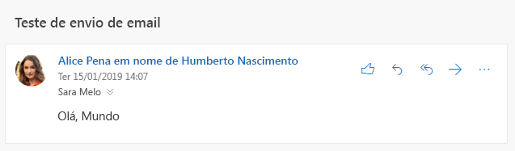

# <a name="send-outlook-messages-from-another-user"></a>Enviar mensagens do Outlook de outro usuário

Exchange Online fornece [permissões de caixa de correio](/Exchange/recipients/mailbox-permissions) que permitem um usuário enviar o email que parece ter sido enviado de outro usuário, a lista de distribuição, grupo, recurso ou caixa de correio compartilhada. O Microsoft Graph também dá suporte a este recurso, mas o resultado final varia dependendo das permissões exatas concedidas no Exchange Online e que API você usa para enviar o email.

## <a name="permissions"></a>Permissões

Dois tipos de permissões são aplicáveis para enviar mensagens de outro usuário: [permissões do Microsoft Graph](permissions-reference.md)e as permissões de caixa de correio.

### <a name="microsoft-graph-permissions"></a>Permissões do Microsoft Graph

Para enviar mensagens de outro usuário, aplicativos que usam tokens de usuário, use a permissão **Mail.Send.Shared**.

> [!NOTE]
> Os aplicativos que usam tokens de aplicativo em vez de tokens de usuário e tem a permissão **Mail.Send** consentida por um administrador, pode enviar emails, como qualquer usuário na organização enviando o email normalmente através da caixa de correio do usuário.

### <a name="mailbox-permissions"></a>Permissões de caixa de correio

Duas permissões afetam o resultado final de enviar uma mensagem de outro usuário: **enviar em nome** e **enviar como**. O usuário que entra no aplicativo com a permissão **Mail.Send.Shared** DEVE ter pelo menos uma destas permissões que foram concedidas para a caixa de correio, grupo ou lista de distribuição de onde o email é.

#### <a name="send-on-behalf"></a>Enviar em Nome de

Com essa permissão, o destinatário do email tem uma indicação em clientes de email que a mensagem foi enviada pelo usuário do seu aplicativo em nome de outro usuário.



Isso é exibido no Microsoft Graph, como o `sender` (usuário realmente a enviou) e propriedades do `from` (usuário/grupo/etc que a mensagem aparece como sendo de).

```json
{
  "id": "AAMkAGE1...",
  "subject": "Send mail test",
  "sender": {
    "emailAddress": {
      "name": "Adele Vance",
      "address": "AdeleV@contoso.com"
    }
  },
  "from": {
    "emailAddress": {
      "name": "Pradeep Gupta",
      "address": "PradeepG@contoso.com"
    }
  }
}
```

Um usuário pode conceder permissão para suas caixas de correio a outro usuário, [usando o Outlook](https://support.office.com/article/Allow-someone-else-to-manage-your-mail-and-calendar-41C40C04-3BD1-4D22-963A-28EAFEC25926). Os administradores podem conceder permissão para qualquer lista de distribuição, grupo ou caixa de correio no [Centro de administração do Microsoft 365](/office365/admin/add-users/give-mailbox-permissions-to-another-user?view=o365-worldwide).

#### <a name="send-as"></a>Enviar como

Com essa permissão, não há nenhuma indicação de que a mensagem foi enviada como um usuário diferente. As propriedades `sender` e `from` têm o mesmo valor.

Os usuários não podem conceder essa permissão para suas caixas de correio. Os administradores podem conceder essa permissão no Centro de administração do Microsoft 365.

## <a name="sending-with-microsoft-graph"></a>Enviar com o Microsoft Graph

Você pode enviar mensagens de outro usuário seja [enviar diretamente](/graph/api/user-sendmail?view=graph-rest-1.0) ou [criar um rascunho](/graph/api/user-post-messages?view=graph-rest-1.0) e, em seguida, [enviá-lo](/graph/api/message-send?view=graph-rest-1.0).

Para enviar de outro usuário, defina a `from` propriedade em [mensagem](/graph/api/resources/message?view=graph-rest-1.0) enviada ao endereço de email do usuário para enviar de. Não é necessário configurar a propriedade `sender` - Microsoft Graph irá defini-la adequadamente, com base nas permissões de caixa de correio concedidas para usuários conectados.

Por exemplo, para enviar emails do grupo `sales@contoso.com`, configure a mensagem da seguinte maneira.

```json
{
  "subject": "January sales report",
  "toRecipients": [
    {
      "emailAddress": {
        "address": "MeganB@contoso.com"
      }
    }
  ],
  "from": {
    "emailAddress": {
      "address": "sales@contoso.com"
    }
  }
}
```

## <a name="sent-items-behavior"></a>Comportamento de itens enviado

Depois que a mensagem é enviada, pode ser salva em pastas de itens enviados do usuário de envio, a sua pasta Itens enviados do usuário ou ambas.

> [!NOTE]
> Se a mensagem é enviada de um endereço que não tenha uma caixa de correio (uma lista de distribuição, por exemplo), não há nenhuma item enviados para o usuário.

- Se o aplicativo enviar usando o `/me` ponto de extremidade (ou `/users/{user-id}` onde a `user-id` corresponde ao usuário conectado), por padrão, a mensagem será salva na pasta Itens enviados de envio do usuário.
- Se o aplicativo enviar usando o `/users/{user-id}` onde a `user-id` corresponde à de usuário, por padrão, a mensagem será salva na da pasta Itens enviados do usuário.
    > [!IMPORTANT]
    > Para enviar dessa maneira, o usuário de envio deve ter a permissão de caixa de correio **acesso total**, além de uma permissão **enviar em nome** ou **enviar como**.

O comportamento padrão pode ser alterado por outros fatores externos:

- Os administradores podem atualizar na caixa de correio do usuário para [sempre salvar uma cópia das mensagens enviadas de um representante](/exchange/recipients-in-exchange-online/manage-user-mailboxes/automatically-save-sent-items-in-delegator-s-mailbox) para seus itens enviados.
- Configurando a `saveToSentItems` propriedade para `false` em um solicitação [enviar email](/graph/api/user-sendmail?view=graph-rest-1.0), você pode impedir o item de ser salvo na pasta Itens enviados. No entanto, se o administrador definiu a configuração "sempre salvar uma cópia", a mensagem será ainda salva a partir dos itens enviados do usuário.

## <a name="examples"></a>Exemplos

### <a name="example-1-successful-send-through-me-endpoint"></a>Exemplo 1: Envio bem-sucedido pelo ponto de extremidade /me

Neste exemplo, Adele Vance recebeu a permissão **enviar em nome** para a caixa de correio de Allan Deyoung.

#### <a name="request"></a>Solicitação

```http
POST /me/sendmail
Content-Type: application/json

{
  "message": {
    "subject": "Expense reports",
    "body": {
      "contentType": "text",
      "content": "Have you submitted your expense reports yet?"
    },
    "toRecipients": [
      {
        "emailAddress": {
          "address": "MeganB@contoso.com"
        }
      }
    ],
    "from": {
      "emailAddress": {
        "address": "AllanD@contoso.com"
      }
    }
  }
}
```

#### <a name="response"></a>Resposta

```http
HTTP/1.1 202 Accepted
```

### <a name="example-2-unsuccessful-attempt-to-send-without-permissions"></a>Exemplo 2: Falha na tentativa de enviar sem permissões

Neste exemplo, Adele Vance tenta enviar um email de Patti Fernandez, mas não recebeu uma permissão **enviar em nome** ou **enviar como**. A resposta contém um `ErrorSendAsDenied` erro.

<!-- markdownlint-disable MD024 -->

#### <a name="request"></a>Solicitação

```http
POST /me/sendmail
Content-Type: application/json

{
  "message": {
    "subject": "Support ticket",
    "body": {
      "contentType": "text",
      "content": "I noticed you opened a support ticket yesterday..."
    },
    "toRecipients": [
      {
        "emailAddress": {
          "address": "MeganB@contoso.com"
        }
      }
    ],
    "from": {
      "emailAddress": {
        "address": "PattiF@contoso.com"
      }
    }
  }
}
```

#### <a name="response"></a>Resposta

```http
HTTP/1.1 403 Forbidden
Content-Type: application/json

{
  "error": {
    "code": "ErrorSendAsDenied",
    "message": "The user account which was used to submit this request does not have the right to send mail on behalf of the specified sending account. Cannot submit message.",
    "innerError": {
      "request-id": "24e7991e-01ae-4cc2-8e06-532a96fd8948",
      "date": "2019-01-16T18:53:25"
    }
  }
}
```

## <a name="next-steps"></a>Próximas etapas

Saiba mais sobre:

- [Por que integrar-se com o email do Outlook](outlook-mail-concept-overview.md)
- [Como usar a API de email](/graph/api/resources/mail-api-overview?view=graph-rest-1.0) e email API [casos de uso](/graph/api/resources/mail-api-overview?view=graph-rest-1.0#common-use-cases) do Microsoft Graph versão 1.0.

<!--
{
  "type": "#page.annotation",
  "suppressions": [
    "Error: /concepts/outlook-send-mail-from-other-user.md:\r\n      FileNotFound: '[/exchange/recipients-in-exchange-online/manage-user-mailboxes/automatically-save-sent-items-in-delegator-s-mailbox](always save a copy of messages sent from a delegate)'.",
    "Error: /concepts/outlook-send-mail-from-other-user.md:\r\n      InvalidUrlFormat '[/office365/admin/add-users/give-mailbox-permissions-to-another-user?view=o365-worldwide](Office 365 admin center)'.",
    "Error: /concepts/outlook-send-mail-from-other-user.md:\r\n      FileNotFound: '[/Exchange/recipients/mailbox-permissions](mailbox permissions)'. "
  ]
}
-->
