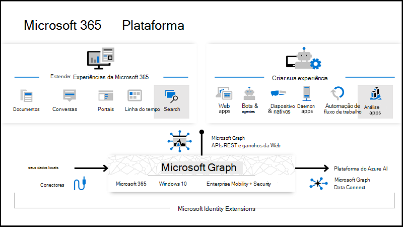

# Visão geral do Microsoft GraphOverview of Microsoft Graph

O Microsoft Graph é o gateway para dados e inteligência no Microsoft 365.Microsoft Graph is the gateway to data and intelligence in Microsoft 365. Ele fornece um modelo de programação unificado que você pode usar para acessar o enorme volume de dados no Microsoft 365, Windows 10 e Enterprise Mobility + Security.It provides a unified programmability model that you can use to access the tremendous amount of data in Microsoft 365, Windows 10, and Enterprise Mobility + Security. Você pode usar a grande quantidade de dados no Microsoft Graph para criar aplicativos para organizações e clientes que interagem com milhões de usuários.Use the wealth of data in Microsoft Graph to build apps for organizations and consumers that interact with millions of users.

## Alimentar a plataforma do Microsoft 365Powering the Microsoft 365 platform

Na plataforma do Microsoft 365, três componentes principais facilitam o acesso e o fluxo de dados:In the Microsoft 365 platform, three main components facilitate the access and flow of data:

- A API do Microsoft Graph oferece um único ponto de extremidade, `https://graph.microsoft.com`, para fornecer acesso a dados avançados focados nas pessoas, e informações expostas como recursos dos serviços do Microsoft 365.The Microsoft Graph API offers a single endpoint, `https://graph.microsoft.com`, to provide access to rich, people-centric data and insights exposed as resources of Microsoft 365 services. Você pode usar APIs REST ou SDKs para acessar o ponto de extremidade e compilar aplicativos que dão suporte a cenários que abrangem toda a produtividade, colaboração, educação, pessoas e o local de trabalho e muito mais.You can use REST APIs or SDKs to access the endpoint and build apps that support scenarios spanning across productivity, collaboration, education, people and workplace intelligence, and much more. O Microsoft Graph também inclui um conjunto poderoso de serviços que gerenciam a identidade do usuário e do dispositivo, o acesso, a conformidade, a segurança e ajuda a proteger as organizações contra vazamento ou perda de dados.Microsoft Graph also includes a powerful set of services that manage user and device identity, access, compliance, security, and help protect organizations from data leakage or loss.
- Os [Conectores do Microsoft Graph (versão prévia)](/microsoftsearch/connectors-overview) funcionam na direção de entrada, fornecendo dados externos à nuvem da Microsoft para os aplicativos e serviços do Microsoft Graph a fim de aprimorar as experiências do Microsoft 365, como a Pesquisa da Microsoft.[Microsoft Graph connectors (preview)](/microsoftsearch/connectors-overview) work in the incoming direction, delivering data external to the Microsoft cloud into Microsoft Graph services and applications, to enhance Microsoft 365 experiences such as Microsoft Search.
- [Microsoft Graph Data Connect](#access-microsoft-graph-data-at-scale-using-microsoft-graph-data-connect) fornece um conjunto de ferramentas para simplificar entrega segura e escalonável de dados do Microsoft Graph para repositórios populares de dados do Azure.[Microsoft Graph data connect](#access-microsoft-graph-data-at-scale-using-microsoft-graph-data-connect) provides a set of tools to streamline secure and scalable delivery of Microsoft Graph data to popular Azure data stores. Esses dados armazenados em cache servem como fontes de dados para ferramentas de desenvolvimento do Azure que você pode usar para desenvolver aplicativos inteligentes.This cached data serves as data sources for Azure development tools that you can use to build intelligent applications.

Juntos, a API do Microsoft Graph Data, os conectores (versão prévia) e os dados alimentam a plataforma do Microsoft 365.Together, the Microsoft Graph API, connectors (preview), and data connect power the Microsoft 365 platform. Com a capacidade de acessar dados e outros conjuntos de dados do Microsoft Graph para gerar informação e análise, você pode ampliar as experiências Microsoft 365 ou desenvolver aplicativos exclusivos e inteligentes.With the ability to access Microsoft Graph data and other datasets to derive insights and analytics, you can extend Microsoft 365 experiences, or build unique, intelligent applications.

> [!NOTE]
> Os conectores do Microsoft Graph estão em versão prévia.Microsoft Graph connectors is in preview. Para usar conectores com o Microsoft Search ou para criar conectores, você deve se inscrever no [programa de visualização de conectores](https://docs.microsoft.com/MicrosoftSearch/connectors-preview).To use connectors with Microsoft Search or to build connectors, you must sign up for the [connectors preview program](https://docs.microsoft.com/MicrosoftSearch/connectors-preview). Para participar do programa de visualização, envie o [formulário de inscrição na versão prévia dos conectores do Microsoft Graph](https://forms.office.com/Pages/ResponsePage.aspx?id=v4j5cvGGr0GRqy180BHbRxWYgu82J_RFnMMATAS6_chUNVYwNU1CMDNZUDBSSDZKWVo2RDJDRjRLQi4u).To join in the preview program, submit the [Microsoft Graph connectors preview signup form](https://forms.office.com/Pages/ResponsePage.aspx?id=v4j5cvGGr0GRqy180BHbRxWYgu82J_RFnMMATAS6_chUNVYwNU1CMDNZUDBSSDZKWVo2RDJDRjRLQi4u).

## Serviços do Microsoft GraphWhat's in Microsoft Graph?

O Microsoft Graph expõe as bibliotecas de cliente e APIs REST para acessar dados nos seguintes serviços da Microsoft Cloud:Microsoft Graph exposes REST APIs and client libraries to access data on the following Microsoft cloud services:

- Serviços 365 da Microsoft: Delve, Excel, Microsoft Teams, Microsoft Teams, OneDrive, OneNote, Outlook/Exchange, Planner, SharePoint, análise de local de trabalho.Microsoft 365 services: Delve, Excel, Microsoft Bookings, Microsoft Teams, OneDrive, OneNote, Outlook/Exchange, Planner, SharePoint, Workplace Analytics.
- Serviços de segurança e mobilidade corporativas: análise avançada de ameaças, proteção avançada contra ameaças, Azure Active Directory, Identity Manager e Intune.Enterprise Mobility and Security services: Advanced Threat Analytics, Advanced Threat Protection, Azure Active Directory, Identity Manager, and Intune.
- Serviços do Windows 10: atividades, dispositivos, notificações, impressão universal (visualização).Windows 10 services: activities, devices, notifications, Universal Print (preview).
- Dynamics 365 Business central.Dynamics 365 Business Central.

Para saber mais, confira os [Principais serviços e recursos do Microsoft Graph](overview-major-services.md).To find out more, see [Major services and features in Microsoft Graph](overview-major-services.md).

## O que você pode fazer com o Microsoft Graph?What can you do with Microsoft Graph?

> [!VIDEO https://www.youtube-nocookie.com/embed/PI9NO5rayiY]

Você pode usar o Microsoft Graph para criar experiências de acordo com o contexto exclusivo do usuário para ajudá-lo a ser mais produtivo.Use Microsoft Graph to build experiences around the user's unique context to help them be more productive. Imagine um aplicativo que...Imagine an app that...

- Analisa sua próxima reunião e o ajuda a se preparar para ela ao fornecer informações de perfil dos participantes, incluindo os cargos e com quem eles trabalham, bem como informações sobre os documentos e projetos mais recentes nos quais eles estão colaborando.Looks at your next meeting and helps you prepare for it by providing profile information for attendees, including their job titles and managers, as well as information about the latest documents they're working on, and people they're collaborating with.
- Verifica seu calendário e sugere os horários recomendados para a próxima reunião de equipe.Scans your calendar, and suggests the best times for the next team meeting.
- Busca o gráfico de projeção mais recente das vendas de um arquivo do Excel em seu OneDrive e permite atualizar a previsão em tempo real, tudo em seu telefone.Fetches the latest sales projection chart from an Excel file in your OneDrive and lets you update the forecast in real time, all from your phone.
- Assina alterações em seu calendário, envia um alerta quando você está gastando muito tempo em reuniões e oferece recomendações sobre as que você pode perder ou delegar com base na relevância dos participantes para você.Subscribes to changes in your calendar, sends you an alert when you’re spending too much time in meetings, and provides recommendations for the ones you can miss or delegate based on how relevant the attendees are to you.
- Ajuda você a classificar informações pessoais e profissionais em seu telefone, por exemplo, categorizando imagens que devem seguir para seu OneDrive pessoal e recibos comerciais que devem seguir para seu OneDrive for Business.Helps you sort out personal and work information on your phone; for example, by categorizing pictures that should go to your personal OneDrive and business receipts that should go to your OneDrive for Business.
- Analisa os dados do Microsoft 365 em escala, de forma que os tomadores de decisões podem desbloquear as idéias valiosas em padrões de alocação e de colaboração de tempo que melhoram a produtividade dos negócios.Analyzes at-scale Microsoft 365 data so that decision makers can unlock valuable insights into time allocation and collaboration patterns that improve business productivity.
- Exibe dados personalizados de negócios para o Microsoft Graph, fazendo indexação para torná-los pesquisáveis juntamente com os dados dos serviços do Microsoft 365.Brings custom business data into Microsoft Graph, indexing it to make it searchable along with data from Microsoft 365 services.

Escolha o primeiro cenário sobre a pesquisa de participantes da reunião como um exemplo.Pick the first scenario about researching meeting attendees as an example. Com a API do Microsoft Graph, você pode:With the Microsoft Graph API, you can:

1. Obtenha os endereços de email dos participantes de um [evento de reunião](/graph/api/resources/event?view=graph-rest-1.0).Get the email addresses of the [meeting event](/graph/api/resources/event?view=graph-rest-1.0) attendees.
2. Faça a pesquisa individualmente como um [usuário](/graph/api/resources/user?view=graph-rest-1.0) no Azure Active Directory para [obter as informações de perfil](/graph/api/user-get?view=graph-rest-1.0).Look them up individually as a [user](/graph/api/resources/user?view=graph-rest-1.0) in Azure Active Directory to [get their profile information](/graph/api/user-get?view=graph-rest-1.0).

Você pode navegar por outros recursos usando relações:You can then navigate to other resources using relationships:

- Conecte-se ao gerente por meio de uma [relação de gerente](/graph/api/user-list-manager?view=graph-rest-1.0).Connect to their manager through a [manager relationship](/graph/api/user-list-manager?view=graph-rest-1.0).
- Obtenha informações valiosas e inteligência incluindo arquivos populares com [tendências ao redor](/graph/api/resources/insights-trending?view=graph-rest-1.0) do usuário.Get valuable insights and intelligence including the popular files [trending around](/graph/api/resources/insights-trending?view=graph-rest-1.0) the user.
- [Obtenha as pessoas mais relevantes](/graph/api/user-list-people?view=graph-rest-beta) para o usuário.[Get the most relevant people](/graph/api/user-list-people?view=graph-rest-beta) around the user.
- Estender o cenário para acessar os grupos de usuários por meio de uma relação [memberOf](/graph/api/user-list-memberof?view=graph-rest-1.0)Extend the scenario to get to the user's groups through a [memberOf](/graph/api/user-list-memberof?view=graph-rest-1.0) relationship
- [Acessar outros membros em cada grupo](/graph/api/group-list-members?view=graph-rest-1.0).[Reach other members in each group](/graph/api/group-list-members?view=graph-rest-1.0).
- Toque em outras situações habilitadas por [grupos](office365-groups-concept-overview.md), como [educação](education-concept-overview.md) e [trabalho em equipe](teams-concept-overview.md).Tap into other scenarios enabled by [groups](office365-groups-concept-overview.md), such as [education](education-concept-overview.md) and [teamwork](teams-concept-overview.md).

Microsoft Graph continua a abrir a plataforma Microsoft 365 para os desenvolvedores, e sempre somente com as permissões apropriadas.Microsoft Graph continues to open up the Microsoft 365 platform for developers, and always only with the appropriate permissions.

> [!NOTE]
> Ao usar a API do Microsoft Graph, você concorda com os [Termos de Uso das APIs da Microsoft](/legal/microsoft-apis/terms-of-use?context=/graph/context) e com a [Declaração de Privacidade da Microsoft](https://go.microsoft.com/fwlink/?LinkId=521839).When you use the Microsoft Graph API, you agree to the [Microsoft APIs Terms of Use](/legal/microsoft-apis/terms-of-use?context=/graph/context) and the [Microsoft Privacy Statement](https://go.microsoft.com/fwlink/?LinkId=521839).

### Solicitações de API popularesPopular API requests

Veja alguns desses cenários mais comuns para trabalhar com a API do Microsoft Graph.Check out some of these common scenarios for working with the Microsoft Graph API. Os links levam você ao [Explorador do Graph](https://developer.microsoft.com/graph/graph-explorer).The links take you to the [Graph Explorer](https://developer.microsoft.com/graph/graph-explorer).

| **Operação****Operation** | **URL****URL** |
|:--------------------------|:----------------------------------------|
|   GET meu perfilGET my profile | [`https://graph.microsoft.com/v1.0/me`](https://developer.microsoft.com/graph/graph-explorer/?request=me&version=v1.0) |
|   GET meus arquivosGET my files | [`https://graph.microsoft.com/v1.0/me/drive/root/children`](https://developer.microsoft.com/graph/graph-explorer/?request=me%2Fdrive%2Froot%2Fchildren&version=v1.0) |
|   GET minha fotoGET my photo | [`https://graph.microsoft.com/v1.0/me/photo/$value`](https://developer.microsoft.com/graph/graph-explorer/?request=me%2Fphoto%2F%24value&version=v1.0) |
|   GET meu emailGET my mail | [`https://graph.microsoft.com/v1.0/me/messages`](https://developer.microsoft.com/graph/graph-explorer/?request=me%2Fmessages&version=v1.0) |
|   GET meu email de alta prioridadeGET my high importance email | [`https://graph.microsoft.com/v1.0/me/messages?$filter=importance%20eq%20'high'`](https://developer.microsoft.com/graph/graph-explorer/?request=me%2Fmessages%3F%24filter%3Dimportance%2520eq%2520'high'&version=v1.0) |
|   GET eventos do meu calendárioGET my calendar events | [`https://graph.microsoft.com/v1.0/me/events`](https://developer.microsoft.com/graph/graph-explorer/?request=me%2Fevents&version=v1.0) |
|   GET meu gerenteGET my manager | [`https://graph.microsoft.com/v1.0/me/manager`](https://developer.microsoft.com/graph/graph-explorer/?request=me%2Fmanager&version=v1.0) |
|   GET o último usuário que modificou o arquivo foo.txtGET last user to modify file foo.txt | [`https://graph.microsoft.com/v1.0/me/drive/root/children/foo.txt/lastModifiedByUser`](https://developer.microsoft.com/graph/graph-explorer/?request=me%2Fdrive%2Froot%2Fchildren%2Ffoo.txt%2FlastModifiedByUser&version=v1.0) |
|   OBTER os grupos do Microsoft 365 dos quais eu sou membroGET Microsoft 365 groups I’m member of| [`https://graph.microsoft.com/v1.0/me/memberOf/$/microsoft.graph.group?$filter=groupTypes/any(a:a%20eq%20'unified')`](https://developer.microsoft.com/graph/graph-explorer/?request=me%2FmemberOf%2F%24%2Fmicrosoft.graph.group%3F%24filter%3DgroupTypes%2Fany(a%3Aa%2520eq%2520'unified')&version=v1.0) |
|   GET os usuários em minha organizaçãoGET users in my organization  | [`https://graph.microsoft.com/v1.0/users`](https://developer.microsoft.com/graph/graph-explorer/?request=users&version=v1.0) |
|   GET grupos em minha organizaçãoGET groups in my organization | [`https://graph.microsoft.com/v1.0/groups`](https://developer.microsoft.com/graph/graph-explorer/?request=groups&version=v1.0) |
|   GET as pessoas relacionadas a mimGET people related to me | [`https://graph.microsoft.com/v1.0/me/people`](https://developer.microsoft.com/graph/graph-explorer/?request=me%2Fpeople&version=beta)  |
|   Itens GET mais populares à minha voltaGET items trending around me | [`https://graph.microsoft.com/beta/me/insights/trending`](https://developer.microsoft.com/graph/graph-explorer/?request=me%2Finsights%2Ftrending&version=v1.0) |
|   GET minhas anotaçõesGET my notes | [`https://graph.microsoft.com/v1.0/me/onenote/notebooks`](https://developer.microsoft.com/graph/graph-explorer/?request=me%2Fonenote%2Fnotebooks&version=beta) |

## Reunir dados de uma fonte de conteúdo externo para o Microsoft Graph (versão prévia)Bring data from an external content source to Microsoft Graph (preview)

Use os _conectores_ do Microsoft Graph para reunir dados externos à nuvem da Microsoft para o Microsoft Graph.Use Microsoft Graph _connectors_ to bring data that is external to the Microsoft cloud into Microsoft Graph. Exemplos desses dados podem ser um banco de dados de recursos humanos ou catálogo de produtos de uma organização, hospedados no local ou nas nuvens pública ou privada.Examples of such data can be an organization's human resources database or product catalog, hosted on-premises or in the public or private clouds. 

Os conectores do Microsoft Graph criam conexões a fontes de dados externas, indexam os dados e os armazenam como arquivos e itens personalizados externos.Microsoft Graph connectors create connections to external data sources, index the data, and store it as external custom items and files. Depois de indexar, é possível mostrar os itens na Pesquisa da Microsoft e nos aplicativos que usam o [API da Pesquisa da Microsoft](search-concept-overview.md).Once indexed, those items can show up in Microsoft Search, and for apps that use the [Microsoft Search API](search-concept-overview.md).

## Acessar dados do Microsoft Graph em escala com conexão de dados do Microsoft GraphAccess Microsoft Graph data at scale using Microsoft Graph data connect

Use o Microsoft Graph _Data Connect_ para acessar os dados em escala no Microsoft Graph, enquanto permite que os administradores tenham autorização granular e controle total sobre seus dados do Microsoft Graph.Use Microsoft Graph _data connect_ to access data on Microsoft Graph at scale, while allowing administrators granular consent and full control over their Microsoft Graph data. Data Connect simplifica a entrega desses dados para o Microsoft Azure.Data connect streamlines the delivery of this data to Microsoft Azure.

Ao usar ferramentas Azure, você pode então criar aplicativos inteligentes que:Using Azure tools, you can then build intelligent apps that:

- Encontram para você o especialista em um determinado tópico mais próximo em sua organizaçãoFind you the closest expert on a topic to you in your organization
- Automatizam a criação de base de dados de conhecimentoAutomate knowledge base creation
- Analisam solicitações de reunião para fornecer insights sobre o uso de sala de conferênciaAnalyze meeting requests to provide insights into conference room utilization
- Detectam fraudes envolvendo dados de comunicação e de produtividadeDetect fraud with productivity and communication data

## Por que usar a API do Microsoft Graph ou o Data Connect?When should I use Microsoft Graph API or data connect?

O Microsoft Graph Data Connect fornece uma nova maneira de interagir com os dados disponíveis por meio de APIs do Microsoft Graph.Microsoft Graph data connect provides a new way for you to interact with the data that's available through Microsoft Graph APIs. Data Connect fornece um conjunto exclusivo de ferramentas que facilitam o desenvolvimento de aplicativos inteligentes, tudo isso na nuvem da Microsoft.Data connect provides a unique set of tools that streamline the building of intelligent applications, all within the Microsoft cloud.

|**Recurso****Feature**| **API do Microsoft Graph****Microsoft Graph API** | **Microsoft Graph Data Connect****Microsoft Graph data connect** |
|:----------|:------------------------|:--------------------------------------|
| **Escopo de acesso****Access scope** | Usuário único ou locatário inteiroSingle user or entire tenant | Muitos usuários ou gruposMany users or groups |
| **Padrão de acesso****Access pattern** | Tempo realReal time | Cronograma recorrenteRecurrent schedule |
| **Operações de dados****Data operations** | Funciona em mestre de dadosOperates on data master | Funciona em um cache dos dadosOperates on a cache of the data |
| **Proteção de dados****Data protection** | Os dados são protegidos enquanto estão no Microsoft 365Data is protected while in Microsoft 365 | A proteção de dados é estendida ao cache dos dados em sua assinatura do AzureData protection is extended to the cache of data in your Azure subscription |
| **Consentimento do usuário****User consent** | SelfSelf Tipos de recursosResource types | NenhumNone |
| **Consentimento do administrador****Admin consent** | Toda a organizaçãoEntire organization Tipos de recursosResource types | Selecione grupos de usuáriosSelect groups of users Propriedades e tipos de recursosResource types and properties Exclui usuáriosExcludes users |
| **Ferramentas de acesso****Access tools** | Consultas da Web RESTfulRESTful web queries | Azure Data FactoryAzure Data Factory |

 Para obter mais informações, consulte [Microsoft Graph Data Connect](data-connect-overview.md), e [Introdução ao Microsoft Graph Data Connect](data-connect-concept-overview.md).See [Microsoft Graph data connect](data-connect-overview.md) for more information, and [get started using Microsoft Graph data connect](data-connect-concept-overview.md).

## Próximas etapasNext steps

- Confira alguns [cenários em destaque](https://developer.microsoft.com/graph/examples).Check out some [featured scenarios](https://developer.microsoft.com/graph/examples).
- Experimente um exemplo de solicitação no [Explorador do Graph](https://developer.microsoft.com/graph/graph-explorer).Try a sample request in the [Graph Explorer](https://developer.microsoft.com/graph/graph-explorer).
- Use o [início rápido](https://developer.microsoft.com/graph/quick-start) para configurar um aplicativo de exemplo pronto para funcionar.Use the [quick start](https://developer.microsoft.com/graph/quick-start) to set up a ready-to-run sample app.
- Consulte o item **Saiba mais** no índice para ler sobre os serviços e recursos que você pode usar em seus cenários.Look under **Learn** in the table of contents to read about services and features that you can use in your scenarios.
- Descubra como [obter um token de autenticação](auth/auth-concepts.md) em seu aplicativo.Find out how to [get an auth token](auth/auth-concepts.md) in your app.
- Comece a [usar a API](use-the-api.md).Start [using the API](use-the-api.md).
