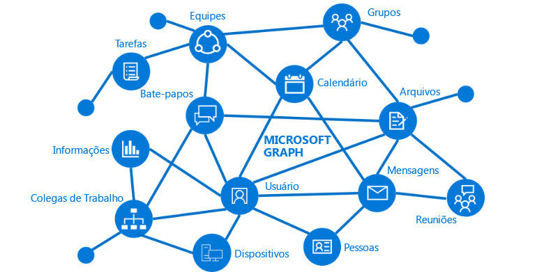

# Visão geral do Microsoft GraphOverview of Microsoft Graph

O Microsoft Graph é o gateway para dados e inteligência no Microsoft 365.Microsoft Graph is the gateway to data and intelligence in Microsoft 365. O Microsoft Graph fornece um modelo de programabilidade unificada que você pode usar para aproveitar a enorme quantidade de dados disponíveis no Office 365, no Enterprise Mobility + Security e no Windows 10.Microsoft Graph provides a unified programmability model that you can use to take advantage of the tremendous amount of data in Office 365, Enterprise Mobility + Security, and Windows 10. 

Você pode usar a API do Microsoft Graph para criar aplicativos para organizações e clientes que interagem com os dados de milhões de usuários.You can use the Microsoft Graph API to build apps for organizations and consumers that interact with the data of millions of users. Com o Microsoft Graph, você pode se conectar a uma ampla variedade de recursos, relações e inteligência, tudo por um único ponto de extremidade: `https://graph.microsoft.com`.With Microsoft Graph, you can connect to a wealth of resources, relationships, and intelligence, all through a single endpoint: `https://graph.microsoft.com`.

## O que há no gráfico?What's in the graph?
O Microsoft Graph inclui APIs para:Microsoft Graph exposes APIs for:

- Azure Active DirectoryAzure Active Directory
- Serviços do Office 365: SharePoint, OneDrive, Outlook/Exchange, Microsoft Teams, OneNote, Planner e ExcelOffice 365 services: SharePoint, OneDrive, Outlook/Exchange, Microsoft Teams, OneNote, Planner, and Excel
- Serviços do Enterprise Mobility + Security: Identity Manager, Intune, Advanced Threat Analytics e Advanced Threat Protection.Enterprise Mobility and Security services: Identity Manager, Intune, Advanced Threat Analytics, and Advanced Threat Protection.
- Serviços do Windows 10: atividades e dispositivosWindows 10 services: activities and devices
- EducaçãoEducation

Para saber mais, veja os [principais serviços e recursos do Microsoft Graph](../concepts/overview-major-services.md).To find out more, see [Major services and features in Microsoft Graph](../concepts/overview-major-services.md).

O Microsoft Graph conecta todos os recursos entre esses serviços usando relações.Microsoft Graph connects all the resources across these services using relationships. Por exemplo, um usuário pode estar conectado a um grupo por meio de uma relação [memberOf](../api-reference/v1.0/api/user_list_memberof.md)e com outro usuário por uma relação [manager](../api-reference/v1.0/api/user_list_manager.md).For example, a user can be connected to a group through a [memberOf](../api-reference/v1.0/api/user_list_memberof.md) relationship, and to another user through a [manager relationship](../api-reference/v1.0/api/user_list_manager.md). O aplicativo pode desviar dessas relações para acessar esses recursos conectados e executar ações neles pela API.Your app can traverse these relationships to access these connected resources and perform actions on them through the API.

Você também pode obter informações valiosas e inteligência sobre os dados pelo Microsoft Graph.You can also get valuable insights and intelligence about the data from Microsoft Graph. Por exemplo, você pode obter os arquivos [mais populares](../api-reference/beta/resources/insights_trending.md) para um determinado usuário ou [obter as pessoas mais relevantes](../api-reference/beta/api/user_list_people.md) para um usuário.For example, you can get the popular files [trending around](../api-reference/beta/resources/insights_trending.md) a particular user, or [get the most relevant people](../api-reference/beta/api/user_list_people.md) around a user.

Descubra as possibilidades nas relações dentro do Microsoft Graph.Discover the possibilities in the relationships within Microsoft Graph.

## O que você pode fazer com o Microsoft Graph?What can you do with Microsoft Graph? 

Você pode usar o Microsoft Graph para criar experiências de acordo com o contexto exclusivo do usuário para ajudá-lo a ser mais produtivo. Imagine um aplicativo que...You can use Microsoft Graph to build experiences around the user's unique context to help them be more productive. Imagine an app that...

- Analisa sua próxima reunião e o ajuda a se preparar para ela ao fornecer informações de perfil dos participantes, incluindo os cargos e com quem eles trabalham, bem como informações sobre os documentos e projetos mais recentes nos quais eles estão trabalhando.Looks at your next meeting and helps you prepare for it by providing profile information for attendees, including their job titles and who they work with, as well as information about the latest documents and projects they're working on.
- Verifica seu calendário e sugere os horários recomendados para a próxima reunião de equipe.Scans your calendar, and suggests the best times for the next team meeting.
- Busca o gráfico de projeção mais recente das vendas de um arquivo do Excel em seu OneDrive e permite atualizar a previsão em tempo real, tudo em seu telefone.Fetches the latest sales projection chart from an Excel file in your OneDrive and lets you update the forecast in real time, all from your phone.
- Assina alterações em seu calendário, envia um alerta quando você está gastando muito tempo em reuniões e oferece recomendações sobre as que você pode perder ou delegar com base na relevância dos participantes para você.Subscribes to changes in your calendar, sends you an alert when you’re spending too much time in meetings, and provides recommendations for the ones you can miss or delegate based on how relevant the attendees are to you.
- Ajuda você a classificar informações pessoais e profissionais em seu telefone, por exemplo, categorizando imagens que devem seguir para seu OneDrive pessoal e recibos comerciais que devem seguir para seu OneDrive for Business.Helps you sort out personal and work information on your phone; for example, by categorizing pictures that should go to your personal OneDrive and business receipts that should go to your OneDrive for Business.

Você pode fazer tudo isso e muito mais com a API do Microsoft Graph.You can do all this and more with the Microsoft Graph API.

>**Observação:** ao usar a API do Microsoft Graph, você concorda com os [Termos de Uso do Microsoft Graph](https://developer.microsoft.com/en-us/graph/docs/misc/terms-of-use) e com a [Política de Privacidade da Microsoft](https://go.microsoft.com/fwlink/?LinkId=521839).**Note:** When you use the Microsoft Graph API, you agree to the [Microsoft Graph Terms of Use](https://developer.microsoft.com/en-us/graph/docs/misc/terms-of-use) and the [Microsoft Privacy Statement](https://go.microsoft.com/fwlink/?LinkId=521839).

### Solicitações mais usadasPopular requests

Veja alguns desses cenários mais comuns para trabalhar com a API do Microsoft Graph.Check out some of these common scenarios for working with the Microsoft Graph API. Os links levam você ao [Explorador do Graph](https://developer.microsoft.com/en-us/graph/graph-explorer).The links take you to the [Graph Explorer](https://developer.microsoft.com/en-us/graph/graph-explorer).

| **Operação****Operation** | **URL****URL** |
|:--------------------------|:----------------------------------------|
|   GET meu perfilGET my profile |    [`https://graph.microsoft.com/v1.0/me`](https://developer.microsoft.com/graph/graph-explorer/?request=me&version=v1.0) |
|   GET meus arquivosGET my files | [`https://graph.microsoft.com/v1.0/me/drive/root/children`](https://developer.microsoft.com/graph/graph-explorer/?request=me%2Fdrive%2Froot%2Fchildren&version=v1.0) |
|   GET minha fotoGET my photo | [`https://graph.microsoft.com/v1.0/me/photo/$value`](https://developer.microsoft.com/graph/graph-explorer/?request=me%2Fphoto%2F%24value&version=v1.0) |
|   GET meu emailGET my mail |   [`https://graph.microsoft.com/v1.0/me/messages`](https://developer.microsoft.com/graph/graph-explorer/?request=me%2Fmessages&version=v1.0) |
|   GET meu email de alta prioridadeGET my high importance email | [`https://graph.microsoft.com/v1.0/me/messages?$filter=importance%20eq%20'high'`](https://developer.microsoft.com/graph/graph-explorer/?request=me%2Fmessages%3F%24filter%3Dimportance%2520eq%2520'high'&version=v1.0) |
|   OBTER eventos do meu calendárioGET my calendar events |    [`https://graph.microsoft.com/v1.0/me/events`](https://developer.microsoft.com/graph/graph-explorer/?request=me%2Fevents&version=v1.0) |
|   GET meu gerenteGET my manager  | [`https://graph.microsoft.com/v1.0/me/manager`](https://developer.microsoft.com/graph/graph-explorer/?request=me%2Fmanager&version=v1.0) |
|   GET o último usuário que modificou o arquivo foo.txtGET last user to modify file foo.txt |  [`https://graph.microsoft.com/v1.0/me/drive/root/children/foo.txt/lastModifiedByUser`](https://developer.microsoft.com/graph/graph-explorer/?request=me%2Fdrive%2Froot%2Fchildren%2Ffoo.txt%2FlastModifiedByUser&version=v1.0) |
|   OBTER grupos do Office365 dos quais eu sou membroGET Office365 groups I’m member of| [`https://graph.microsoft.com/v1.0/me/memberOf/$/microsoft.graph.group?$filter=groupTypes/any(a:a%20eq%20'unified')`](https://developer.microsoft.com/graph/graph-explorer/?request=me%2FmemberOf%2F%24%2Fmicrosoft.graph.group%3F%24filter%3DgroupTypes%2Fany(a%3Aa%2520eq%2520'unified')&version=v1.0) |
|   GET os usuários em minha organizaçãoGET users in my organization     | [`https://graph.microsoft.com/v1.0/users`](https://developer.microsoft.com/graph/graph-explorer/?request=users&version=v1.0) |
|   OBTER grupos em minha organizaçãoGET groups in my organization | [`https://graph.microsoft.com/v1.0/groups`](https://developer.microsoft.com/graph/graph-explorer/?request=groups&version=v1.0) |
|   GET as pessoas relacionadas a mimGET people related to me    | [`https://graph.microsoft.com/v1.0/me/people`](https://developer.microsoft.com/graph/graph-explorer/?request=me%2Fpeople&version=beta)  |
|   Itens GET mais populares à minha voltaGET items trending around me |  [`https://graph.microsoft.com/beta/me/insights/trending`](https://developer.microsoft.com/graph/graph-explorer/?request=me%2Finsights%2Ftrending&version=beta) |
|   GET minhas anotaçõesGET my notes |  [`https://graph.microsoft.com/v1.0/me/onenote/notebooks`](https://developer.microsoft.com/graph/graph-explorer/?request=me%2Fonenote%2Fnotebooks&version=beta) |

## Próximas etapasNext steps

- Confira alguns [cenários em destaque](../concepts/featured_scenarios.md).Check out some [featured scenarios](../concepts/featured_scenarios.md).
- Experimente um exemplo de solicitação no [Explorador do Graph](https://developer.microsoft.com/graph/graph-explorer).Try a sample request in the [Graph Explorer](https://developer.microsoft.com/graph/graph-explorer).
- Use o [início rápido](https://developer.microsoft.com/graph/quick-start) para configurar um aplicativo de exemplo pronto para funcionar.Use the [quick start](https://developer.microsoft.com/graph/quick-start) to set up a ready-to-run sample app.
- Consulte o item **Saiba mais** no índice para ler sobre os serviços e recursos que você pode usar em seus cenários.Look under **Learn** in the table of contents to read about services and features that you can use in your scenarios. 
- Descubra como [obter um token de autenticação](../concepts/auth_overview.md) em seu aplicativo.Find out how to [get an auth token](../concepts/auth_overview.md) in your app.
- Comece a [usar a API](../concepts/use_the_api.md).Start [using the API](../concepts/use_the_api.md).

## Comentários?Feedback?

Seus comentários são importantes para nós. Junte-se a nós na página [Stack Overflow](http://stackoverflow.com/questions/tagged/office365+or+microsoftgraph). Marque suas perguntas com {MicrosoftGraph}.Your feedback is important to us. Connect with us on [Stack Overflow](http://stackoverflow.com/questions/tagged/office365+or+microsoftgraph). Tag your questions with {MicrosoftGraph}.

