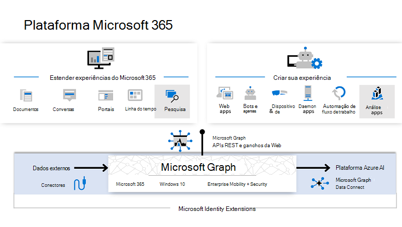
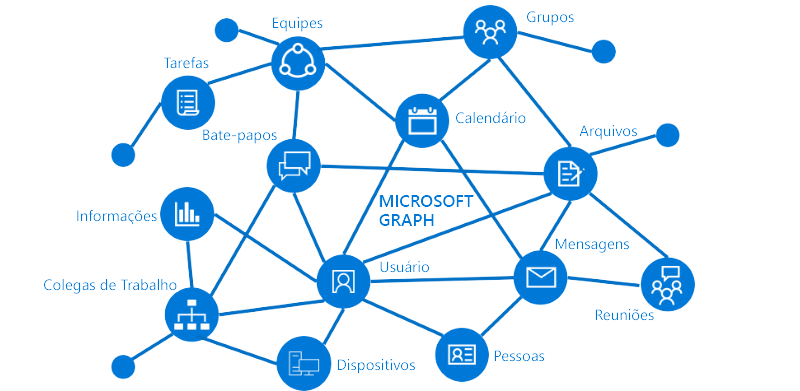

# Visão Geral do Microsoft Graph

O Microsoft Graph é o gateway para dados e inteligência no Microsoft 365. Ele fornece um modelo de programação unificado que você pode usar para acessar a grande quantidade de dados disponíveis no Microsoft 365, no Windows 10 e no Enterprise Mobility + Security. Você pode usar a grande quantidade de dados no Microsoft Graph para criar aplicativos para organizações e clientes que interagem com milhões de usuários.

## Dados e serviços que impulsionam a plataforma Microsoft 365
Na plataforma Microsoft 365, três componentes principais facilitam o acesso e o fluxo de dados:

- A API do Microsoft Graph oferece um único ponto de extremidade, `https://graph.microsoft.com`, para fornecer acesso a **dados e percepções ricos e centrados nas pessoas na nuvem da Microsoft**, incluindo Microsoft 365, Windows 10 e Enterprise Mobility + Security. Você pode usar APIs REST ou SDKs para acessar o endpoint e criar aplicativos que oferecem suporte a cenários do Microsoft 365, abrangendo produtividade, colaboração, educação, inteligência de pessoas e local de trabalho e muito mais. O Microsoft Graph também inclui um conjunto avançado de serviços que gerencia a identidade do usuário e do dispositivo, acesso, conformidade, segurança e ajuda a proteger organizações contra vazamento ou perda de dados.
- [Conectores do Microsoft Graph (visualização)](/microsoftsearch/connectors-overview) trabalhar na direção de entrada, **entrega de dados externos à nuvem da Microsoft para serviços e aplicativos do Microsoft Graph**, para aprimorar as experiências do Microsoft 365, como o Microsoft Search. Existem conectores para muitas fontes de dados comumente usadas, como Box, Google Drive, Jira e Salesforce.
- A [Conexão de Dados do Microsoft Graph](#access-microsoft-graph-data-at-scale-using-microsoft-graph-data-connect) fornece um conjunto de ferramentas para simplificar a entrega segura e escalonável **de dados do Microsoft Graph para armazenamentos de dados populares do Azure**. Os dados em cache servem como fontes de dados para ferramentas de desenvolvimento do Azure que você pode usar para criar aplicativos inteligentes.

Juntos, a API do Microsoft Graph, os conectores (visualização) e a Conexão de Dados capacitam a plataforma Microsoft 365. Com a capacidade de acessar dados do Microsoft Graph e outros conjuntos de dados, você pode obter percepções e análises, estender as experiências do Microsoft 365 e criar aplicativos exclusivos e inteligentes.

> [!NOTE]
> Os conectores do Microsoft Graph estão em versão prévia. Para usar conectores com o Microsoft Search ou para criar conectores, você deve se inscrever no [programa de visualização de conectores](/MicrosoftSearch/connectors-preview). Para participar do programa de visualização, envie o [formulário de inscrição na versão prévia dos conectores do Microsoft Graph](https://forms.office.com/Pages/ResponsePage.aspx?id=v4j5cvGGr0GRqy180BHbRxWYgu82J_RFnMMATAS6_chUNVYwNU1CMDNZUDBSSDZKWVo2RDJDRjRLQi4u).

## Serviços do Microsoft Graph

O Microsoft Graph expõe as APIs REST e bibliotecas do cliente para acessar dados nos seguintes serviços na nuvem da Microsoft:

- Serviços do Microsoft 365: Bookings, Calendário, Delve, Excel, Descoberta eletrônica do Centro de conformidade do Microsoft 365, Pesquisa da Microsoft, OneDrive, OneNote, Outlook/Exchange, Pessoas (contatos do Outlook), Planner, SharePoint, Teams, To Do, Workplace Analytics.
- Serviços de Mobilidade e Segurança Corporativa: Análise Avançada de Ameaças, Proteção Avançada contra Ameaças, Azure Active Directory, Identity Manager e Intune.
- Serviços do Windows 10: atividades, dispositivos, notificações, Impressão universal.
- Dynamics 365 Business Central.

Para saber mais, confira os [Principais serviços e recursos do Microsoft Graph](overview-major-services.md).

## O que você pode fazer com o Microsoft Graph?

> [!VIDEO https://www.youtube-nocookie.com/embed/PI9NO5rayiY]

Você pode usar o Microsoft Graph para criar experiências de acordo com o contexto exclusivo do usuário para ajudá-lo a ser mais produtivo. Imagine um aplicativo que...

- Analisa sua próxima reunião e o ajuda a se preparar para ela ao fornecer informações de perfil dos participantes, incluindo os cargos e com quem eles trabalham, bem como informações sobre os documentos e projetos mais recentes nos quais eles estão colaborando.
- Verifica seu calendário e sugere os horários recomendados para a próxima reunião de equipe.
- Busca o gráfico de projeção mais recente das vendas de um arquivo do Excel em seu OneDrive e permite atualizar a previsão em tempo real, tudo em seu telefone.
- Assina alterações em seu calendário, envia um alerta quando você está gastando muito tempo em reuniões e oferece recomendações sobre as que você pode perder ou delegar com base na relevância dos participantes para você.
- Ajuda você a classificar informações pessoais e profissionais em seu telefone, por exemplo, categorizando imagens que devem seguir para seu OneDrive pessoal e recibos comerciais que devem seguir para seu OneDrive for Business.
- Analisa os dados do Microsoft 365 em escala para que os tomadores de decisões possam desbloquear informações valiosas sobre os padrões de colaboração e a alocação de tempo que aumentam a produtividade do negócio.
- Exibe dados personalizados de negócios para o Microsoft Graph, fazendo indexação para torná-los pesquisáveis juntamente com os dados dos serviços do Microsoft 365.

Escolha o primeiro cenário sobre a pesquisa de participantes da reunião como um exemplo. Com a API do Microsoft Graph, você pode:

1. Obtenha os endereços de email dos participantes de um [evento de reunião](/graph/api/resources/event).
2. Faça a pesquisa individualmente como um [usuário](/graph/api/resources/user) no Azure Active Directory para [obter as informações de perfil](/graph/api/user-get).

Você pode navegar por outros recursos usando relações:

- Conecte-se ao gerente por meio de uma [relação de gerente](/graph/api/user-list-manager).
- Obtenha informações valiosas e inteligência incluindo arquivos populares com [tendências ao redor](/graph/api/resources/insights-trending) do usuário.
- [Obtenha as pessoas mais relevantes](/graph/api/user-list-people?view=graph-rest-beta&preserve-view=true) para o usuário.
- Estender o cenário para acessar os grupos de usuários por meio de uma relação [memberOf](/graph/api/user-list-memberof)
- [Acessar outros membros em cada grupo](/graph/api/group-list-members).
- Toque em outras situações habilitadas por [grupos](office365-groups-concept-overview.md), como [educação](education-concept-overview.md) e [trabalho em equipe](teams-concept-overview.md).

Microsoft Graph continua a abrir a plataforma Microsoft 365 para os desenvolvedores, e sempre somente com as permissões apropriadas.

> [!NOTE]
> Ao usar a API do Microsoft Graph, você concorda com os [Termos de Uso das APIs da Microsoft](/legal/microsoft-apis/terms-of-use?context=/graph/context) e com a [Declaração de Privacidade da Microsoft](https://go.microsoft.com/fwlink/?LinkId=521839).

### Solicitações de API populares

Veja alguns desses cenários mais comuns para trabalhar com a API do Microsoft Graph. Os links levam você ao [Explorador do Graph](https://developer.microsoft.com/graph/graph-explorer).

| **Operação** | **URL** |
|:--------------------------|:----------------------------------------|
|   GET meu perfil | [`https://graph.microsoft.com/v1.0/me`](https://developer.microsoft.com/graph/graph-explorer/?request=me&version=v1.0) |
|   GET meus arquivos | [`https://graph.microsoft.com/v1.0/me/drive/root/children`](https://developer.microsoft.com/graph/graph-explorer/?request=me%2Fdrive%2Froot%2Fchildren&version=v1.0) |
|   GET minha foto | [`https://graph.microsoft.com/v1.0/me/photo/$value`](https://developer.microsoft.com/graph/graph-explorer/?request=me%2Fphoto%2F%24value&version=v1.0) |
|   GET meu email | [`https://graph.microsoft.com/v1.0/me/messages`](https://developer.microsoft.com/graph/graph-explorer/?request=me%2Fmessages&version=v1.0) |
|   GET meu email de alta prioridade | [`https://graph.microsoft.com/v1.0/me/messages?$filter=importance%20eq%20'high'`](https://developer.microsoft.com/graph/graph-explorer/?request=me%2Fmessages%3F%24filter%3Dimportance%2520eq%2520'high'&version=v1.0) |
|   GET eventos do meu calendário | [`https://graph.microsoft.com/v1.0/me/events`](https://developer.microsoft.com/graph/graph-explorer/?request=me%2Fevents&version=v1.0) |
|   GET meu gerente | [`https://graph.microsoft.com/v1.0/me/manager`](https://developer.microsoft.com/graph/graph-explorer/?request=me%2Fmanager&version=v1.0) |
|   GET o último usuário que modificou o arquivo foo.txt | [`https://graph.microsoft.com/v1.0/me/drive/root/children/foo.txt/lastModifiedByUser`](https://developer.microsoft.com/graph/graph-explorer/?request=me%2Fdrive%2Froot%2Fchildren%2Ffoo.txt%2FlastModifiedByUser&version=v1.0) |
|   GET grupos do Microsoft 365 em que sou membro| [`https://graph.microsoft.com/v1.0/me/memberOf/$/microsoft.graph.group?$filter=groupTypes/any(a:a%20eq%20'unified')`](https://developer.microsoft.com/graph/graph-explorer/?request=me%2FmemberOf%2F%24%2Fmicrosoft.graph.group%3F%24filter%3DgroupTypes%2Fany(a%3Aa%2520eq%2520'unified')&version=v1.0) |
|   GET os usuários em minha organização  | [`https://graph.microsoft.com/v1.0/users`](https://developer.microsoft.com/graph/graph-explorer/?request=users&version=v1.0) |
|   GET grupos em minha organização | [`https://graph.microsoft.com/v1.0/groups`](https://developer.microsoft.com/graph/graph-explorer/?request=groups&version=v1.0) |
|   GET as pessoas relacionadas a mim | [`https://graph.microsoft.com/v1.0/me/people`](https://developer.microsoft.com/graph/graph-explorer/?request=me%2Fpeople&version=beta)  |
|   Itens GET mais populares à minha volta | [`https://graph.microsoft.com/beta/me/insights/trending`](https://developer.microsoft.com/graph/graph-explorer/?request=me%2Finsights%2Ftrending&version=v1.0) |
|   GET minhas anotações | [`https://graph.microsoft.com/v1.0/me/onenote/notebooks`](https://developer.microsoft.com/graph/graph-explorer/?request=me%2Fonenote%2Fnotebooks&version=beta) |

## Reunir dados de uma fonte de conteúdo externo para o Microsoft Graph (versão prévia)

Use os _conectores_ do Microsoft Graph para reunir dados externos à nuvem da Microsoft para o Microsoft Graph. Exemplos desses dados podem ser um banco de dados de recursos humanos ou catálogo de produtos de uma organização, hospedados no local ou nas nuvens pública ou privada. 

Os conectores do Microsoft Graph criam conexões a fontes de dados externas, indexam os dados e os armazenam como arquivos e itens personalizados externos. Depois de indexar, é possível mostrar os itens na Pesquisa da Microsoft e nos aplicativos que usam o [API da Pesquisa da Microsoft](search-concept-overview.md).

## Acessar dados do Microsoft Graph em escala usando a Conexão de Dados do Microsoft Graph

Use a _Conexão de Dados_ do Microsoft Graph para acessar dados no Microsoft Graph em escala, enquanto permite aos administradores autorização granular e controle total sobre seus dados do Microsoft Graph. A Conexão de Dados simplifica a entrega destes dados para o Microsoft Azure.

Ao usar ferramentas Azure, você pode então criar aplicativos inteligentes que:

- Encontram para você o especialista em um determinado tópico mais próximo em sua organização
- Automatizam a criação de base de dados de conhecimento
- Analisam solicitações de reunião para fornecer insights sobre o uso de sala de conferência
- Detectam fraudes envolvendo dados de comunicação e de produtividade

## Quando devo usar a API do Microsoft Graph ou a Conexão de Dados?

Microsoft Graph Data Connect fornece uma nova maneira de interagir com os dados que estão disponíveis através das APIs do Microsoft Graph. A Conexão de Dados fornece um conjunto exclusivo de ferramentas que simplificam o desenvolvimento de aplicativos inteligentes, tudo dentro da nuvem da Microsoft.

|**Recurso**| **API do Microsoft Graph** | **Microsoft Graph Data Connect** |
|:----------|:------------------------|:--------------------------------------|
| **Escopo de acesso** | Usuário único ou locatário inteiro | Muitos usuários ou grupos |
| **Padrão de acesso** | Tempo real | Cronograma recorrente |
| **Operações de dados** | Funciona em mestre de dados | Funciona em um cache dos dados |
| **Proteção de dados** | Os dados são protegidos enquanto estão no Microsoft 365 | A proteção de dados é estendida ao cache dos dados em sua assinatura do Azure |
| **Consentimento do usuário** | Self Tipos de recursos | Nenhum |
| **Consentimento do administrador** | Toda a organização Tipos de recursos | Selecione grupos de usuários Propriedades e tipos de recursos Exclui usuários |
| **Ferramentas de acesso** | Consultas da Web RESTful | Azure Data Factory |

 Consulte [Conexão de Dados do Microsoft Graph](data-connect-concept-overview.md) para obter mais informações.

## Próximas etapas

- Confira algumas [soluções de parceiros](https://developer.microsoft.com/graph/partners).
- Experimente um exemplo de solicitação no [Explorador do Graph](https://developer.microsoft.com/graph/graph-explorer).
- Use o [início rápido](https://developer.microsoft.com/graph/quick-start) para configurar um aplicativo de exemplo pronto para funcionar.
- Consulte o item **Saiba mais** no índice para ler sobre os serviços e recursos que você pode usar em seus cenários.
- Descubra como [obter um token de autenticação](auth/auth-concepts.md) em seu aplicativo.
- Comece a [usar a API](use-the-api.md).
