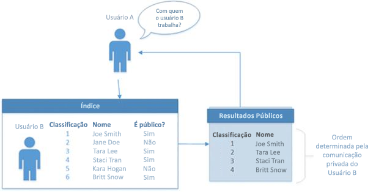

# <a name="use-the-people-api-in-microsoft-graph-to-get-information-about-the-people-most-relevant-to-you"></a>Usar a API de pessoas no Microsoft Graph para obter informações sobre as pessoas mais relevantes para você

Os aplicativos do Microsoft Graph podem usar a API de pessoas para recuperar as pessoas mais relevantes para um usuário. A relevância é determinada pelos padrões de comunicação e colaboração e pelas relações comerciais do usuário. As pessoas podem ser contatos locais ou do diretório de uma organização e pessoas de comunicações recentes. 

Junto com a geração desse insight, a API de pessoas também fornece suporte de pesquisa de correspondência difusa e a capacidade de recuperar a lista de usuários relevantes para outro usuário na organização do usuário conectado.
A API de pessoas é particularmente útil para pessoas que escolhem cenários, como redigir um e-mail ou criar uma reunião. Por exemplo, você pode usar a API de pessoas em cenários de composição de e-mail.

## <a name="including-a-person-as-relevant-or-working-with"></a>Incluindo uma pessoa como relevante ou "trabalhando com"
 
Para que uma pessoa seja incluída como relevante ou "trabalhando com" um proprietário de perfil no Delve, seja exibida no cartão de perfil do proprietário ou retornada pela API de pessoas, deve haver um relacionamento _público_ entre a pessoa e o proprietário do perfil. A ilustração a seguir mostra um Usuário A, um índice de relacionamentos com outros usuários (Usuário B) e um perfil público mostrando um subconjunto de relacionamentos de usuários.


 
A seguir, exemplos de relações públicas:

- Indivíduos conectados no organograma: gerente, subordinado, colegas (compartilham o mesmo gerente) 
- Membros de um grupo público ou lista de distribuição com menos de 30 pessoas. Os grupos públicos têm listas de membros que estão disponíveis no diretório.
 
Se o proprietário do perfil se comunica com alguém e não há _nenhum relacionamento público_ entre eles, como uma conexão com um organograma ou um grupo em comum, o fato de eles estarem se comunicando _não é visível_ para outros.

A classificação das pessoas − ou seja, a ordem em que aparecem na página do proprietário do perfil − é determinada pela comunicação privada e pública entre o proprietário do perfil e a pessoa na lista.
 
Alguns exemplos de comunicação privada:
- Enviar emails um ao outro em que o nome da outra pessoa está na linha PARA
- Convidar usuários para reuniões incluindo seus nomes no convite da agenda 
 
Alguns exemplos de interação pública:
- Enviar ou receber emails diretamente um ao outro como parte de um grupo público 
- Convidar usuários para reuniões como parte de um grupo ou onde mais de X pessoas são convidadas
 
A classificação não muda com base em quem é o usuário A (a pessoa que está vendo a página de outra pessoa). A classificação é determinada pelo nível de interação entre o Usuário B (proprietário do perfil) e o Usuário C (pessoa que aparece na lista do proprietário do perfil).
 
Para que o Usuário C apareça, o proprietário do perfil deve estar em um grupo relativamente pequeno ou lista de distribuição com aquele usuário que é público (o que significa que a lista de membros está disponível no diretório).
 
Pessoas externas à organização não aparecem na lista do proprietário do perfil. As pessoas com quem eles trocam emails ou se encontram, mas que não fazem parte da mesma organização, também não aparecem como pessoas com quem o proprietário trabalha.

## <a name="disabling-working-with"></a>Desabilitando "trabalhando com"
Os administradores podem gerenciar a exibição ou retorno de pessoas relevantes para o proprietário de um perfil em dois níveis:
* Para uma organização:
  - Habilite para toda a organização. Esta é a configuração padrão.
  - Desabilite para toda a organização, exceto para o proprietário do perfil.
* Para um grupo do Azure Active Directory na organização:
  - Desabilite para um grupo especificado do Azure Active Directory. Isso é útil para habilitar o "trabalho com" para uma organização, exceto para membros do grupo do Azure Active Directory.

Para obter mais informações, consulte [personalizar o controle de privacidade do insight de pessoas](insights-customize-people-insights-privacy.md).

## <a name="authorization"></a>Autorização

Para chamar a API de pessoas no Microsoft Graph, seu aplicativo precisará das permissões apropriadas:

* People.Read - Use para fazer chamadas de API para pessoas em geral; por exemplo, `https://graph.microsoft.com/v1.0/me/people/`. People.Read requer o consentimento do usuário final.
* People.Read.All - necessária para recuperar as pessoas mais relevantes para um usuário especificado nas chamadas (`https://graph.microsoft.com/v1.0/users/{id}/people`) da organização do usuário conectado. People.Read.All requer o consentimento do administrador.

## <a name="browse-people"></a>Procurar pessoas

As solicitações nesta seção obtém as pessoas mais relevantes para o usuário conectado (`/me`) ou para um usuário específico na organização do usuário conectado. Essas solicitações exigem a permissão People.Read ou People.Read.All, respectivamente. Por padrão, cada resposta retorna 10 registros, mas você pode alterar isso usando o parâmetro de consulta *$top*.

### <a name="get-a-collection-of-relevant-people"></a>Obter uma coleção de pessoas relevantes

A solicitação a seguir obtém as pessoas mais relevantes para o usuário conectado (`/me`), com base nos padrões de comunicação e colaboração e nas relações comerciais.

```http
GET https://graph.microsoft.com/v1.0/me/people/
```

O exemplo a seguir mostra a resposta. Por padrão, cada resposta retorna 10 registros. Você pode alterar isso usando o parâmetro de consulta *$top*. Este exemplo usa *$top* para limitar a resposta a três registros.

```http
HTTP/1.1 200 OK
Content-type: application/json

{
  "value": [
    {
      "id": "8CE6E1DE-CB84-4BF5-971D-D3ECF452E2B5",
      "displayName": "Lorrie Frye",
      "givenName": "Lorrie",
      "surname": "Frye",
      "birthday": "",
      "personNotes": "",
      "isFavorite": false,
      "jobTitle": "Paralegal",
      "companyName": null,
      "yomiCompany": "",
      "department": "Legal",
      "officeLocation": "20/1109",
      "profession": "",
      "userPrincipalName": "LorrieF@contoso.onmicrosoft.com",
      "imAddress": "sip:LorrieF@contoso.onmicrosoft.com",
      "scoredEmailAddresses": [
        {
          "address": "LorrieF@contoso.onmicrosoft.com",
          "relevanceScore": 8
        }
      ],
      "phones": [
        {
          "type": "Business",
          "number": "+1 980 555 0101"
        }
      ],
      "postalAddresses": [],
      "websites": [],
      "personType": {
        "class": "Person",
        "subclass": "OrganizationUser"
      }
    },
    {
      "id": "5767393D-42BA-4E5C-BEE4-52BB25639CF4",
      "displayName": "Maynard Denman",
      "givenName": "Maynard",
      "surname": "Denman",
      "birthday": "",
      "personNotes": "",
      "isFavorite": false,
      "jobTitle": "Web Marketing Manager",
      "companyName": null,
      "yomiCompany": "",
      "department": "Sales & Marketing",
      "officeLocation": "20/1101",
      "profession": "",
      "userPrincipalName": "MaynardD@contoso.onmicrosoft.com",
      "imAddress": "sip:MaynardD@contoso.onmicrosoft.com",
      "scoredEmailAddresses": [
        {
          "address": "MaynardD@contoso.onmicrosoft.com",
          "relevanceScore": 8
        }
      ],
      "phones": [
        {
          "type": "Business",
          "number": "+1 918 555 0101"
        }
      ],
      "postalAddresses": [],
      "websites": [],
      "personType": {
        "class": "Person",
        "subclass": "OrganizationUser"
      }
    },
    {
      "id": "914B5191-11FA-4C0B-A354-0FA8C8EFD585",
      "displayName": "Darrel Halsey",
      "givenName": "Darrel",
      "surname": "Halsey",
      "birthday": "",
      "personNotes": "",
      "isFavorite": false,
      "jobTitle": "Attorney",
      "companyName": null,
      "yomiCompany": "",
      "department": "Legal",
      "officeLocation": "14/1102",
      "profession": "",
      "userPrincipalName": "DarrelH@contoso.onmicrosoft.com",
      "imAddress": "sip:DarrelH@contoso.onmicrosoft.com",
      "scoredEmailAddresses": [
        {
          "address": "DarrelH@contoso.onmicrosoft.com",
          "relevanceScore": 8
        }
      ],
      "phones": [
        {
          "type": "Business",
          "number": "+1 205 555 0103"
        }
      ],
      "postalAddresses": [],
      "websites": [],
      "personType": {
        "class": "Person",
        "subclass": "OrganizationUser"
      }
    }
  ]
}
```

### <a name="request-a-subsequent-page-of-people"></a>Solicitar uma página subsequente de pessoas

Se a primeira resposta não contiver a lista completa das pessoas relevantes, você poderá fazer uma segunda solicitação usando *$top* e *$skip* para solicitar páginas adicionais de informações. Se a solicitação anterior tiver informações adicionais, a solicitação a seguir obterá a próxima página de pessoas do servidor.

```http
GET https://graph.microsoft.com/v1.0/me/people/?$top=3&$skip=10
```

O exemplo a seguir mostra a resposta. Por padrão, cada resposta retorna 10 registros. Você pode alterar isso usando o parâmetro de consulta *$top*. Este exemplo usa *$top* para limitar a resposta a três registros.

```http
HTTP/1.1 200 OK
Content-type: application/json

{
  "value": [
    {
      "id": "1F28616D-BDFE-4080-8F06-03366A851688",
      "displayName": "Felix Coppola",
      "givenName": "Felix",
      "surname": "Coppola",
      "birthday": "",
      "personNotes": "",
      "isFavorite": false,
      "jobTitle": "CVP Legal",
      "companyName": null,
      "yomiCompany": "",
      "department": "Legal",
      "officeLocation": "19/2109",
      "profession": "",
      "userPrincipalName": "FelixC@contoso.onmicrosoft.com",
      "imAddress": "sip:FelixC@contoso.onmicrosoft.com",
      "scoredEmailAddresses": [
        {
          "address": "FelixC@contoso.onmicrosoft.com",
          "relevanceScore": 8
        }
      ],
      "phones": [
        {
          "type": "Business",
          "number": "+1 309 555 0104"
        }
      ],
      "postalAddresses": [],
      "websites": [],
      "personType": {
        "class": "Person",
        "subclass": "OrganizationUser"
      }
    },
    {
      "id": "8A3FC021-6DBB-44AC-8884-B7B500CC260A",
      "displayName": "Lenora Rowland",
      "givenName": "Lenora",
      "surname": "Rowland",
      "birthday": "",
      "personNotes": "",
      "isFavorite": false,
      "jobTitle": "Marketing Assistant",
      "companyName": null,
      "yomiCompany": "",
      "department": "Sales & Marketing",
      "officeLocation": "18/1106",
      "profession": "",
      "userPrincipalName": "LenoraR@contoso.onmicrosoft.com",
      "imAddress": "sip:LenoraR@contoso.onmicrosoft.com",
      "scoredEmailAddresses": [
        {
          "address": "LenoraR@contoso.onmicrosoft.com",
          "relevanceScore": 8
        }
      ],
      "phones": [
        {
          "type": "Business",
          "number": "+1 954 555 0118"
        }
      ],
      "postalAddresses": [],
      "websites": [],
      "personType": {
        "class": "Person",
        "subclass": "OrganizationUser"
      }
    },
    {
      "id": "032C9919-4DF9-4715-8C46-4D0FAE7B3EB2",
      "displayName": "Manuel Collette",
      "givenName": "Manuel",
      "surname": "Collette",
      "birthday": "",
      "personNotes": "",
      "isFavorite": false,
      "jobTitle": "Accountant II",
      "companyName": null,
      "yomiCompany": "",
      "department": "Finance",
      "officeLocation": "98/2202",
      "profession": "",
      "userPrincipalName": "ManuelC@contoso.onmicrosoft.com",
      "imAddress": "sip:ManuelC@contoso.onmicrosoft.com",
      "scoredEmailAddresses": [
        {
          "address": "ManuelC@contoso.onmicrosoft.com",
          "relevanceScore": 8
        }
      ],
      "phones": [
        {
          "type": "Business",
          "number": "+20 255501070"
        }
      ],
      "postalAddresses": [],
      "websites": [],
      "personType": {
        "class": "Person",
        "subclass": "OrganizationUser"
      }
    }
  ]
}
```

### <a name="sort-the-response"></a>Classificar a resposta

Por padrão, as pessoas na resposta são classificadas pela relevância delas à consulta. Você pode alterar a ordem das pessoas na resposta ao usar o parâmetro *$orderby*. Essa consulta seleciona as pessoas mais relevantes para você, classifica-as por **displayName** e, em seguida, retorna as primeiras 10 pessoas na lista classificada.

```http
GET https://graph.microsoft.com/v1.0/me/people/?$orderby=displayName
```

O exemplo a seguir mostra a resposta. Por padrão, cada resposta retorna 10 registros. Você pode alterar isso ao usar o parâmetro *$top*. O exemplo a seguir usa *$top* para limitar a resposta a três registros.

```http
HTTP/1.1 200 OK
Content-type: application/json

{
  "value": [
    {
      "id": "818E29A1-E6BB-4EDA-AB20-8230B4B1E290",
      "displayName": "Adriana Ramos",
      "givenName": "Adriana",
      "surname": "Ramos",
      "birthday": "",
      "personNotes": "",
      "isFavorite": false,
      "jobTitle": "Product Marketing Manager",
      "companyName": null,
      "yomiCompany": "",
      "department": "Sales & Marketing",
      "officeLocation": "18/2111",
      "profession": "",
      "userPrincipalName": "AdrianaR@contoso.onmicrosoft.com",
      "imAddress": "sip:AdrianaR@contoso.onmicrosoft.com",
      "scoredEmailAddresses": [
        {
          "address": "AdrianaR@contoso.onmicrosoft.com",
          "relevanceScore": 8
        }
      ],
      "phones": [
        {
          "type": "Business",
          "number": "+1 425 555 0109"
        }
      ],
      "postalAddresses": [],
      "websites": [],
      "personType": {
        "class": "Person",
        "subclass": "OrganizationUser"
      }
    },
    {
      "id": "62633BAA-1CB9-4FA2-9B8F-55AB1840B69D",
      "displayName": "Alyce Cooley",
      "givenName": "Alyce",
      "surname": "Cooley",
      "birthday": "",
      "personNotes": "",
      "isFavorite": false,
      "jobTitle": "Marketing Assistant",
      "companyName": null,
      "yomiCompany": "",
      "department": "Sales & Marketing",
      "officeLocation": "131/1104",
      "profession": "",
      "userPrincipalName": "AlyceC@contoso.onmicrosoft.com",
      "imAddress": "sip:AlyceC@contoso.onmicrosoft.com",
      "scoredEmailAddresses": [
        {
          "address": "AlyceC@contoso.onmicrosoft.com",
          "relevanceScore": 8
        }
      ],
      "phones": [
        {
          "type": "Business",
          "number": "+1 858 555 0110"
        }
      ],
      "postalAddresses": [],
      "websites": [],
      "personType": {
        "class": "Person",
        "subclass": "OrganizationUser"
      }
    },
    {
      "id": "6BB54D2C-EF20-48DA-ADD9-AE757DD30C4E",
      "displayName": "Alyssa Clarke",
      "givenName": "Alyssa",
      "surname": "Clarke",
      "birthday": "",
      "personNotes": "",
      "isFavorite": false,
      "jobTitle": "Corporate Security Officer",
      "companyName": null,
      "yomiCompany": "",
      "department": "Operations",
      "officeLocation": "24/1106",
      "profession": "",
      "userPrincipalName": "AlyssaC@contoso.onmicrosoft.com",
      "imAddress": "sip:AlyssaC@contoso.onmicrosoft.com",
      "scoredEmailAddresses": [
        {
          "address": "AlyssaC@contoso.onmicrosoft.com",
          "relevanceScore": 8
        }
      ],
      "phones": [
        {
          "type": "Business",
          "number": "+1 262 555 0106"
        }
      ],
      "postalAddresses": [],
      "websites": [],
      "personType": {
        "class": "Person",
        "subclass": "OrganizationUser"
      }
    }
  ]
}
```

### <a name="change-the-number-of-people-and-fields-returned"></a>Alterar o número de pessoas e campos retornados

Você pode alterar o número de pessoas retornadas na resposta definindo o parâmetro *$top*.

O exemplo a seguir solicita as 1.000 pessoas mais relevantes para `/me`. A solicitação também limita a quantidade de dados enviados de volta do servidor solicitando somente o **displayName** da pessoa.

```http
GET https://graph.microsoft.com/v1.0/me/people/?$top=1000&$Select=displayName
```

O exemplo a seguir mostra a resposta.

```http
HTTP/1.1 200 OK
Content-type: application/json

{
  "value": [
    {
      "id": "8CE6E1DE-CB84-4BF5-971D-D3ECF452E2B5",
      "displayName": "Lorrie Frye"
    },
    {
      "id": "5767393D-42BA-4E5C-BEE4-52BB25639CF4",
      "displayName": "Maynard Denman"
    },
    {
      "id": "914B5191-11FA-4C0B-A354-0FA8C8EFD585",
      "displayName": "Darrel Halsey"
    },
    {
      "id": "E3C5B235-DE15-4566-B7B1-7A8E32426540",
      "displayName": "Roscoe Seidel"
    },
    {
      "id": "6BB54D2C-EF20-48DA-ADD9-AE757DD30C4E",
      "displayName": "Alyssa Clarke"
    },
    {
      "id": "818E29A1-E6BB-4EDA-AB20-8230B4B1E290",
      "displayName": "Adriana Ramos"
    },
    {
      "id": "62633BAA-1CB9-4FA2-9B8F-55AB1840B69D",
      "displayName": "Alyce Cooley"
    },
    {
      "id": "6BB9CC1F-418D-4DDF-AB0C-6A1C4ABCDBF4",
      "displayName": "Wayne Leeper"
    },
    {
      "id": "E7D40AC5-0078-4575-B1F3-F738124C4BC9",
      "displayName": "Jan Travis"
    },
    {
      "id": "6F99D1CC-4FCC-49E4-9160-E8AB01BF3E83",
      "displayName": "Charlotte Delacruz"
    },
    {
      "id": "1F28616D-BDFE-4080-8F06-03366A851688",
      "displayName": "Felix Coppola"
    },
    {
      "id": "8A3FC021-6DBB-44AC-8884-B7B500CC260A",
      "displayName": "Lenora Rowland"
    },
    {
      "id": "032C9919-4DF9-4715-8C46-4D0FAE7B3EB2",
      "displayName": "Manuel Collette"
    }
  ]
}
```
### <a name="types-of-results-included"></a>Tipos de resultados incluídos
Por padrão, o Microsoft Graph exibe resultados apenas de caixa de correio, que são seus contatos salvos ou pessoas com as quais você provavelmente interagirá. Para recuperar os resultados do diretório de toda a organização, especifique um cabeçalho HTTP, conforme mostrado.

```http
"X-PeopleQuery-QuerySources: Mailbox,Directory”
```
### <a name="select-the-fields-to-return"></a>Selecione os campos para retornar

Você pode limitar a quantidade de dados retornados do servidor usando o parâmetro *$select* para escolher um ou mais campos. O campo `@odata.id` sempre é retornado.

O exemplo a seguir limita a resposta ao **displayName** e **scoredEmailAddresses** das 10 pessoas mais relevantes.

```http
GET https://graph.microsoft.com/v1.0/me/people/?$select=displayName,scoredEmailAddresses
```

O exemplo a seguir mostra a resposta. Por padrão, cada resposta retorna 10 registros. Você pode alterar isso usando o parâmetro *$top*. Este exemplo usa *$top* para limitar a resposta a três registros.

```http
HTTP/1.1 200 OK
Content-type: application/json

{
  "value": [
    {
      "id": "8CE6E1DE-CB84-4BF5-971D-D3ECF452E2B5",
      "displayName": "Lorrie Frye",
      "scoredEmailAddresses": [
        {
          "address": "LorrieF@contoso.onmicrosoft.com",
          "relevanceScore": 8
        }
      ]
    },
    {
      "id": "5767393D-42BA-4E5C-BEE4-52BB25639CF4",
      "displayName": "Maynard Denman",
      "scoredEmailAddresses": [
        {
          "address": "MaynardD@contoso.onmicrosoft.com",
          "relevanceScore": 8
        }
      ]
    },
    {
      "id": "914B5191-11FA-4C0B-A354-0FA8C8EFD585",
      "displayName": "Darrel Halsey",
      "scoredEmailAddresses": [
        {
          "address": "DarrelH@contoso.onmicrosoft.com",
          "relevanceScore": 8
        }
      ]
    }
  ]
}
```

### <a name="use-a-filter-to-limit-the-response"></a>Usar um filtro para limitar a resposta

Você pode usar o parâmetro *$filter* para limitar a resposta apenas às pessoas cujo registro contém os critérios especificados.

A consulta a seguir limita a resposta a instâncias **person** com a propriedade **personType** com as atribuições de **person** como **classe** e **organizationUser** como **subclasse**.

```http
GET https://graph.microsoft.com/v1.0/me/people/?$filter=personType/class eq 'Person' and personType/subclass eq 'OrganizationUser'
```

O exemplo a seguir mostra a resposta. Por padrão, cada resposta retorna 10 registros. Você pode alterar isso usando o parâmetro *$top*. Este exemplo usa *$top* para limitar a resposta a três registros.

```http
HTTP/1.1 200 OK
Content-type: application/json

{
  "value": [
    {
      "id": "8CE6E1DE-CB84-4BF5-971D-D3ECF452E2B5",
      "displayName": "Lorrie Frye",
      "givenName": "Lorrie",
      "surname": "Frye",
      "birthday": "",
      "personNotes": "",
      "isFavorite": false,
      "jobTitle": "Paralegal",
      "companyName": null,
      "yomiCompany": "",
      "department": "Legal",
      "officeLocation": "20/1109",
      "profession": "",
      "userPrincipalName": "LorrieF@contoso.onmicrosoft.com",
      "imAddress": "sip:LorrieF@contoso.onmicrosoft.com",
      "scoredEmailAddresses": [
        {
          "address": "LorrieF@contoso.onmicrosoft.com",
          "relevanceScore": 8
        }
      ],
      "phones": [
        {
          "type": "Business",
          "number": "+1 980 555 0101"
        }
      ],
      "postalAddresses": [],
      "websites": [],
      "personType": {
        "class": "Person",
        "subclass": "OrganizationUser"
      }
    },
    {
      "id": "5767393D-42BA-4E5C-BEE4-52BB25639CF4",
      "displayName": "Maynard Denman",
      "givenName": "Maynard",
      "surname": "Denman",
      "birthday": "",
      "personNotes": "",
      "isFavorite": false,
      "jobTitle": "Web Marketing Manager",
      "companyName": null,
      "yomiCompany": "",
      "department": "Sales & Marketing",
      "officeLocation": "20/1101",
      "profession": "",
      "userPrincipalName": "MaynardD@contoso.onmicrosoft.com",
      "imAddress": "sip:MaynardD@contoso.onmicrosoft.com",
      "scoredEmailAddresses": [
        {
          "address": "MaynardD@contoso.onmicrosoft.com",
          "relevanceScore": 8
        }
      ],
      "phones": [
        {
          "type": "Business",
          "number": "+1 918 555 0101"
        }
      ],
      "postalAddresses": [],
      "websites": [],
      "personType": {
        "class": "Person",
        "subclass": "OrganizationUser"
      }
    },
    {
      "id": "914B5191-11FA-4C0B-A354-0FA8C8EFD585",
      "displayName": "Darrel Halsey",
      "givenName": "Darrel",
      "surname": "Halsey",
      "birthday": "",
      "personNotes": "",
      "isFavorite": false,
      "jobTitle": "Attorney",
      "companyName": null,
      "yomiCompany": "",
      "department": "Legal",
      "officeLocation": "14/1102",
      "profession": "",
      "userPrincipalName": "DarrelH@contoso.onmicrosoft.com",
      "imAddress": "sip:DarrelH@contoso.onmicrosoft.com",
      "scoredEmailAddresses": [
        {
          "address": "DarrelH@contoso.onmicrosoft.com",
          "relevanceScore": 8
        }
      ],
      "phones": [
        {
          "type": "Business",
          "number": "+1 205 555 0103"
        }
      ],
      "postalAddresses": [],
      "websites": [],
      "personType": {
        "class": "Person",
        "subclass": "OrganizationUser"
      }
    }
  ]
}
```

### <a name="select-the-fields-to-return-in-a-filtered-response"></a>Selecionar os campos a serem retornados em uma resposta filtrada

Você pode combinar os parâmetros *$select* e *$filter* para criar uma lista personalizada de pessoas relevantes para o usuário e obter somente os campos necessários para seu aplicativo.

O exemplo a seguir obtém **displayName** e **scoredEmailAddresses** das pessoas cujo nome de exibição corresponde ao nome especificado. Neste exemplo, somente as pessoas cujo nome para exibição corresponde a "Lorrie Frye" são retornadas.

```http
GET https://graph.microsoft.com/v1.0/me/people/?$select=displayName,scoredEmailAddresses&$filter=displayName eq 'Lorrie Frye'
```

O exemplo a seguir mostra a resposta.

```http
HTTP/1.1 200 OK
Content-type: application/json

{
  "value": [
    {
      "id": "8CE6E1DE-CB84-4BF5-971D-D3ECF452E2B5",
      "displayName": "Lorrie Frye",
      "scoredEmailAddresses": [
        {
          "address": "LorrieF@contoso.onmicrosoft.com",
          "relevanceScore": 8
        }
      ]
    }
  ]
}
```

### <a name="browse-another-users-relevant-people"></a>Procurar pessoas relevantes de outro usuário

A solicitação a seguir obtém as pessoas mais relevantes para outra pessoa na organização do usuário conectado, conforme descrito na [ Implementação do recurso de trabalho](#including-a-person-as-relevant-or-working-with). Esta solicitação requer a permissão People.Read.All. Os parâmetros de consulta descritos nas seções acima também se aplicam.

Neste exemplo, as pessoas relevantes de Vinícius Monte são exibidas.

```http
GET https://graph.microsoft.com/v1.0/users('roscoes@contoso.com')/people/
```

O exemplo a seguir mostra a resposta. Por padrão, cada resposta retorna 10 registros. Você pode alterar isso usando o parâmetro *$top*. O exemplo abaixo usa *$top* para limitar a resposta a três registros.

```http
HTTP/1.1 200 OK
Content-type: application/json

{
  "value": [
    {
      "id": "56155636-703F-47F2-B657-C83F01F49BBC",
      "displayName": "Clifton Clemente",
      "givenName": "Clifton",
      "surname": "Clemente",
      "birthday": "",
      "personNotes": "",
      "isFavorite": false,
      "jobTitle": "Director",
      "companyName": null,
      "yomiCompany": "",
      "department": "Legal",
      "officeLocation": "19/2106",
      "profession": "",
      "userPrincipalName": "CliftonC@contoso.onmicrosoft.com",
      "imAddress": "sip:CliftonC@contoso.onmicrosoft.com",
      "scoredEmailAddresses": [
        {
          "address": "CliftonC@contoso.onmicrosoft.com",
          "relevanceScore": 20
        }
      ],
      "phones": [
        {
          "type": "Business",
          "number": "+1 309 555 0101"
        }
      ],
      "postalAddresses": [],
      "websites": [],
      "personType": {
        "class": "Person",
        "subclass": "OrganizationUser"
      }
    },
    {
      "id": "6BF27D5A-AB4F-4C43-BED0-7DAD9EB0C1C4",
      "displayName": "Sheree Mitchell",
      "givenName": "Sheree",
      "surname": "Mitchell",
      "birthday": "",
      "personNotes": "",
      "isFavorite": false,
      "jobTitle": "Product Manager",
      "companyName": null,
      "yomiCompany": "",
      "department": "Sales & Marketing",
      "officeLocation": "20/2107",
      "profession": "",
      "userPrincipalName": "ShereeM@contoso.onmicrosoft.com",
      "imAddress": "sip:ShereeM@contoso.onmicrosoft.com",
      "scoredEmailAddresses": [
        {
          "address": "ShereeM@contoso.onmicrosoft.com",
          "relevanceScore": 10
        }
      ],
      "phones": [
        {
          "type": "Business",
          "number": "+1 918 555 0107"
        }
      ],
      "postalAddresses": [],
      "websites": [],
      "personType": {
        "class": "Person",
        "subclass": "OrganizationUser"
      }
    },
    {
      "id": "B3E5302D-EAF0-4E8B-8C6C-A2AE64B4B163",
      "displayName": "Vincent Matney",
      "givenName": "Vincent",
      "surname": "Matney",
      "birthday": "",
      "personNotes": "",
      "isFavorite": false,
      "jobTitle": "CVP Engineering",
      "companyName": null,
      "yomiCompany": "",
      "department": "Engineering",
      "officeLocation": "23/2102",
      "profession": "",
      "userPrincipalName": "VincentM@contoso.onmicrosoft.com",
      "imAddress": "sip:VincentM@contoso.onmicrosoft.com",
      "scoredEmailAddresses": [
        {
          "address": "VincentM@contoso.onmicrosoft.com",
          "relevanceScore": 10
        }
      ],
      "phones": [
        {
          "type": "Business",
          "number": "+1 502 555 0102"
        }
      ],
      "postalAddresses": [],
      "websites": [],
      "personType": {
        "class": "Person",
        "subclass": "OrganizationUser"
      }
    }
  ]
}
```

## <a name="search-people"></a>Pesquisar pessoas

As solicitações nesta seção permitem procurar pessoas relevantes para o usuário conectado (`/me`) e para outros usuários na organização do usuário conectado. Essas solicitações requerem a permissão People.Read, com exceção da pesquisa de pessoas relevantes de outros usuários, que exige People.Read.All. Por padrão, cada resposta retorna 10 registros, mas você pode alterar isso usando o parâmetro *$top*.

### <a name="use-search-to-select-people"></a>Usar a pesquisa para selecionar pessoas

Use o parâmetro *$search* para selecionar as pessoas que atendem a determinado conjunto de critérios.

A consulta de pesquisa a seguir retorna pessoas relevantes para `/me` cujo **displayName** ou **emailAddress** tem uma palavra que começa com a letra "j".

```http
GET https://graph.microsoft.com/v1.0/me/people/?$search=j
```

O exemplo a seguir mostra a resposta. Por padrão, cada resposta retorna 10 registros. Você pode alterar isso usando o parâmetro *$top*. Este exemplo usa *$top* para limitar a resposta a três registros.

```http
HTTP/1.1 200 OK
Content-type: application/json

{
  "value": [
    {
      "id": "E3C5B235-DE15-4566-B7B1-7A8E32426540",
      "displayName": "Jan Travis",
      "givenName": "Jan",
      "surname": "Travis",
      "birthday": "",
      "personNotes": "",
      "isFavorite": false,
      "jobTitle": "VP Sales",
      "companyName": null,
      "yomiCompany": "",
      "department": "Sales & Marketing",
      "officeLocation": "19/3123",
      "profession": "",
      "userPrincipalName": "JanT@contoso.onmicrosoft.com",
      "imAddress": "sip:JanT@contoso.onmicrosoft.com",
      "scoredEmailAddresses": [
        {
          "address": "JanT@contoso.onmicrosoft.com",
          "relevanceScore": -12.297347783416837
        }
      ],
      "phones": [
        {
          "type": "Business",
          "number": "+1 732 555 0102"
        }
      ],
      "postalAddresses": [],
      "websites": [],
      "personType": {
        "class": "Person",
        "subclass": "OrganizationUser"
      }
    },
    {
      "id": "C43BF05E-5B6B-4DCF-B2FC-0837B09E0FA9",
      "displayName": "Jacob Cazares (TAILSPIN)",
      "givenName": null,
      "surname": null,
      "birthday": "",
      "personNotes": "",
      "isFavorite": false,
      "jobTitle": null,
      "companyName": null,
      "yomiCompany": "",
      "department": null,
      "officeLocation": null,
      "profession": "",
      "userPrincipalName": "",
      "imAddress": null,
      "scoredEmailAddresses": [
        {
          "address": "JacobC@tailspintoys.com",
          "relevanceScore": -12.298154282019846
        }
      ],
      "phones": [],
      "postalAddresses": [],
      "websites": [],
      "personType": {
        "class": "Person",
        "subclass": "PersonalContact"
      }
    },
    {
      "id": "6BB9CC1F-418D-4DDF-AB0C-6A1C4ABCDBF4",
      "displayName": "Jewell Montgomery",
      "givenName": "Jewell",
      "surname": "Montgomery",
      "birthday": "",
      "personNotes": "",
      "isFavorite": false,
      "jobTitle": null,
      "companyName": null,
      "yomiCompany": "",
      "department": null,
      "officeLocation": null,
      "profession": "",
      "userPrincipalName": "JewellM@contoso.onmicrosoft.com",
      "imAddress": null,
      "scoredEmailAddresses": [
        {
          "address": "JewellM@contoso.onmicrosoft.com",
          "relevanceScore": -12.531408487977451
        }
      ],
      "phones": [],
      "postalAddresses": [],
      "websites": [],
      "personType": {
        "class": "Person",
        "subclass": "OrganizationUser"
      }
    }
  ]
}
```

### <a name="perform-a-fuzzy-search"></a>Realizar uma pesquisa difusa

As pesquisas implementam um algoritmo de correspondência difusa. Retornarão resultados com base em uma correspondência exata e também em Inferências sobre a intenção da pesquisa. Por exemplo, imagine que um usuário com o nome de exibição "Carlos Lima" e o endereço de email carloslim@example.com que esteja no conjunto **pessoas** do usuário conectado. Todas as pesquisas a seguir retornarão esse usuário Tyler como um dos resultados.

```http
GET https://graph.microsoft.com/v1.0/me/people?$search="tyler"                //matches both Tyler's name and email
GET https://graph.microsoft.com/v1.0/me/people?$search="tylerle"              //matches Tyler's email
GET https://graph.microsoft.com/v1.0/me/people?$search="tylerle@example.com"  //matches Tyler's email. Note the quotes to enclose '@'.
GET https://graph.microsoft.com/v1.0/me/people?$search="tiler"                //fuzzy match with Tyler's name
GET https://graph.microsoft.com/v1.0/me/people?$search="tyler lee"            //matches Tyler's name. Note the quotes to enclose the space.
```

