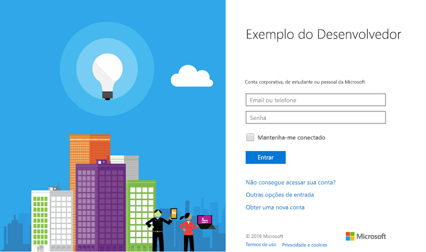

# <a name="get-started-with-microsoft-graph-in-a-php-app"></a><span data-ttu-id="75d81-101">Introdução ao Microsoft Graph em um aplicativo PHP</span><span class="sxs-lookup"><span data-stu-id="75d81-101">Get started with Microsoft Graph in a PHP app</span></span>

<span data-ttu-id="75d81-p101">Este artigo descreve as tarefas obrigatórias para obter um token de acesso do ponto de extremidade do Azure AD v2.0 e chamar o Microsoft Graph. Ele orientará você em relação a como criar um [Exemplo de Connect para PHP (REST)](https://github.com/microsoftgraph/php-connect-rest-sample) e explica os principais conceitos que você implementa para utilizar o Microsoft Graph. O artigo também descreve como acessar o Microsoft Graph usando chamadas REST.</span><span class="sxs-lookup"><span data-stu-id="75d81-p101">This article describes the tasks required to get an access token from the Azure AD v2.0 endpoint and call  Microsoft Graph. It walks you through building the [Connect Sample for PHP (REST)](https://github.com/microsoftgraph/php-connect-rest-sample) and explains the main concepts that you implement to use Microsoft Graph. The article also describes how to access Microsoft Graph by using REST calls.</span></span>

<span data-ttu-id="75d81-p102">Para usar o Microsoft Graph em seu aplicativo PHP, é preciso mostrar a página de entrada da Microsoft aos seus usuários. A captura de tela a seguir mostra uma página de entrada para contas da Microsoft.</span><span class="sxs-lookup"><span data-stu-id="75d81-p102">To use Microsoft Graph in your PHP app, you need to show the Microsoft sign in page to your users. The following screenshot shows a sign in page for Microsoft accounts.</span></span>



<span data-ttu-id="75d81-p103">**Não está com vontade de criar um aplicativo?** Comece rapidamente baixando o [Exemplo de Connect para PHP (REST)](https://github.com/microsoftgraph/php-connect-rest-sample) no qual este artigo se baseia. Ou experimente a versão do [Exemplo de Connect para PHP (SDK)](https://github.com/microsoftgraph/php-connect-sample) que usa a [Biblioteca do Microsoft Graph para PHP](https://github.com/microsoftgraph/msgraph-sdk-php) (Visualização).</span><span class="sxs-lookup"><span data-stu-id="75d81-p103">**Don't feel like building an app?** Get up and running fast by downloading the [Connect Sample for PHP (REST)](https://github.com/microsoftgraph/php-connect-rest-sample) that this article is based on. Or try out the [Connect Sample for PHP (SDK)](https://github.com/microsoftgraph/php-connect-sample) version that uses the [Microsoft Graph Library for PHP](https://github.com/microsoftgraph/msgraph-sdk-php) (Preview).</span></span>


## <a name="prerequisites"></a><span data-ttu-id="75d81-111">Pré-requisitos</span><span class="sxs-lookup"><span data-stu-id="75d81-111">Prerequisites</span></span>

<span data-ttu-id="75d81-112">Para começar, será necessário:</span><span class="sxs-lookup"><span data-stu-id="75d81-112">To get started, you'll need:</span></span> 

- <span data-ttu-id="75d81-113">Uma [conta da Microsoft](https://www.outlook.com/) ou uma [conta corporativa ou de estudante](http://dev.office.com/devprogram)</span><span class="sxs-lookup"><span data-stu-id="75d81-113">A [Microsoft account](https://www.outlook.com/) or a [work or school account](http://dev.office.com/devprogram)</span></span>
- <span data-ttu-id="75d81-114">PHP versão 5.5.9 ou superior</span><span class="sxs-lookup"><span data-stu-id="75d81-114">PHP version 5.5.9 or greater</span></span>
- [<span data-ttu-id="75d81-115">Criador</span><span class="sxs-lookup"><span data-stu-id="75d81-115">Composer</span></span>](https://getcomposer.org/)


## <a name="register-the-application"></a><span data-ttu-id="75d81-116">Registrar o aplicativo</span><span class="sxs-lookup"><span data-stu-id="75d81-116">Register the application</span></span>
<span data-ttu-id="75d81-p104">Registre um aplicativo no Portal de Registro de Aplicativos da Microsoft. Isso gera a ID do aplicativo e a senha que você usará para configurar o aplicativo.</span><span class="sxs-lookup"><span data-stu-id="75d81-p104">Register an app on the Microsoft App Registration Portal. This generates the app ID and password that you'll use to configure the app.</span></span>

1. <span data-ttu-id="75d81-119">Entre no [Portal de Registro de Aplicativos da Microsoft](https://apps.dev.microsoft.com/) usando sua conta pessoal ou uma conta corporativa ou de estudante.</span><span class="sxs-lookup"><span data-stu-id="75d81-119">Sign into the [Microsoft App Registration Portal](https://apps.dev.microsoft.com/) using either your personal or work or school account.</span></span>

2. <span data-ttu-id="75d81-120">Escolha **Adicionar um aplicativo**.</span><span class="sxs-lookup"><span data-stu-id="75d81-120">Choose **Add an app**.</span></span>

3. <span data-ttu-id="75d81-121">Insira um nome para o aplicativo e escolha **Criar aplicativo**.</span><span class="sxs-lookup"><span data-stu-id="75d81-121">Enter a name for the app, and choose **Create application**.</span></span> 
    
    <span data-ttu-id="75d81-122">A página de registro é exibida, listando as propriedades do seu aplicativo.</span><span class="sxs-lookup"><span data-stu-id="75d81-122">The registration page displays, listing the properties of your app.</span></span>

4. <span data-ttu-id="75d81-123">Escolha **Gerar Nova Senha**.</span><span class="sxs-lookup"><span data-stu-id="75d81-123">Choose **Generate New Password**.</span></span>

5. <span data-ttu-id="75d81-124">Copie a ID e a senha do aplicativo.</span><span class="sxs-lookup"><span data-stu-id="75d81-124">Copy the application ID and password.</span></span>

6. <span data-ttu-id="75d81-125">Escolha **Adicionar Plataforma** e **Web**.</span><span class="sxs-lookup"><span data-stu-id="75d81-125">Choose **Add Platform** and **Web**.</span></span>

7. <span data-ttu-id="75d81-126">No campo **URI de Redirecionamento**, digite `http://localhost:8000/oauth`.</span><span class="sxs-lookup"><span data-stu-id="75d81-126">In the **Redirect URI** field, type `http://localhost:8000/oauth`.</span></span>

8. <span data-ttu-id="75d81-127">Escolha **Salvar**.</span><span class="sxs-lookup"><span data-stu-id="75d81-127">Choose **Save**.</span></span>


## <a name="configure-the-project"></a><span data-ttu-id="75d81-128">Configurar o projeto</span><span class="sxs-lookup"><span data-stu-id="75d81-128">Configure the project</span></span>

<span data-ttu-id="75d81-p105">Inicie um novo projeto usando o criador. Para criar um novo projeto PHP, usando a estrutura do Laravel, use o seguinte comando:</span><span class="sxs-lookup"><span data-stu-id="75d81-p105">Start a new project using composer. To create a new PHP project using the Laravel framework, use the following command:</span></span>

```bash
composer create-project --prefer-dist laravel/laravel getstarted
```
 
<span data-ttu-id="75d81-131">Isso criará uma pasta **getstarted** que você pode usar para este projeto.</span><span class="sxs-lookup"><span data-stu-id="75d81-131">This creates a **getstarted** folder that you can use for this project.</span></span>

> <span data-ttu-id="75d81-132">Observação: Você também pode usar o [Projeto inicial](https://github.com/microsoftgraph/php-connect-rest-sample/tree/master/starter-project) que se encarrega da configuração do projeto para que você possa se concentrar nas seções de programação desta explicação passo a passo.</span><span class="sxs-lookup"><span data-stu-id="75d81-132">Note: You can also use the [Starter project](https://github.com/microsoftgraph/php-connect-rest-sample/tree/master/starter-project) that takes care of the project configuration so you can focus on the coding sections of this walkthrough.</span></span>

## <a name="authenticate-the-user-and-get-an-access-token"></a><span data-ttu-id="75d81-133">Autenticar o usuário e obter um token de acesso</span><span class="sxs-lookup"><span data-stu-id="75d81-133">Authenticate the user and get an access token</span></span>
<span data-ttu-id="75d81-p106">Use uma biblioteca do OAuth para simplificar o processo de autenticação. [O PHP League](http://thephpleague.com/) fornece uma [biblioteca cliente do OAuth](https://github.com/thephpleague/oauth2-client) que você pode usar neste projeto.</span><span class="sxs-lookup"><span data-stu-id="75d81-p106">Use an OAuth library to simplify the authentication process. [The PHP League](http://thephpleague.com/) provides an [OAuth client library](https://github.com/thephpleague/oauth2-client) that you can use in this project.</span></span>

### <a name="add-the-dependency-to-composer"></a><span data-ttu-id="75d81-136">Adicionar a dependência ao criador</span><span class="sxs-lookup"><span data-stu-id="75d81-136">Add the dependency to composer</span></span>

<span data-ttu-id="75d81-137">Abra o arquivo `composer.json` e inclua a seguinte dependência na seção **requer**:</span><span class="sxs-lookup"><span data-stu-id="75d81-137">Open the `composer.json` file and include the following dependency in the **require** section:</span></span>

```json
"league/oauth2-client": "^1.4"
```

<span data-ttu-id="75d81-138">Atualize as dependências executando o seguinte comando:</span><span class="sxs-lookup"><span data-stu-id="75d81-138">Update the dependencies by running the following command:</span></span>

```bash
composer update
```

### <a name="start-the-authentication-flow"></a><span data-ttu-id="75d81-139">Iniciar o fluxo de autenticação</span><span class="sxs-lookup"><span data-stu-id="75d81-139">Start the authentication flow</span></span>

1. <span data-ttu-id="75d81-p107">Abra o arquivo **resources** > **views** > **welcome.blade.php**. Substitua o elemento div **título** pelo seguinte código.</span><span class="sxs-lookup"><span data-stu-id="75d81-p107">Open the **resources** > **views** > **welcome.blade.php** file. Replace the **title** div element with the following code.</span></span>
    ```html
    <div class="title" onClick="window.location='/oauth'">Sign in to Microsoft</div>
    ```
    
2. <span data-ttu-id="75d81-p108">Digite a classe `Illuminate\Http\Request` no arquivo **app** > **Http** > **routes.php**. Adicione a seguinte linha antes de qualquer declaração de rota.</span><span class="sxs-lookup"><span data-stu-id="75d81-p108">Type-hint the `Illuminate\Http\Request` class on the **app** > **Http** > **routes.php** file. Add the following line before any route declaration.</span></span>
    ```php
    use Illuminate\Http\Request;
    ```
    
3. <span data-ttu-id="75d81-p109">Adicione uma rota */oauth* ao arquivo **app** > **Http** > **routes.php**. Para adicionar a rota, copie o código a seguir após a declaração da rota padrão. Insira o **ID do aplicativo** e a **senha** do seu aplicativo nos espaços reservados marcados com **\<ID_DO_SEU_APLICATIVO\>** e **\<SUA_SENHA\>** respectivamente.</span><span class="sxs-lookup"><span data-stu-id="75d81-p109">Add an */oauth* route to the **app** > **Http** > **routes.php** file. To add the route, copy the following code after the default route declaration. Insert the **application ID** and **password** of your app in the placeholder marked with **\<YOUR_APPLICATION_ID\>** and **\<YOUR_PASSWORD\>** respectively.</span></span>
    ```php
    Route::get('/oauth', function () {
        $provider = new \League\OAuth2\Client\Provider\GenericProvider([
            'clientId'                => '<YOUR_APPLICATION_ID>',
            'clientSecret'            => '<YOUR_PASSWORD>',
            'redirectUri'             => 'http://localhost:8000/oauth',
            'urlAuthorize'            => 'https://login.microsoftonline.com/common/oauth2/v2.0/authorize',
            'urlAccessToken'          => 'https://login.microsoftonline.com/common/oauth2/v2.0/token',
            'urlResourceOwnerDetails' => '',
            'scopes'                  => 'openid mail.send'
        ]);

        if (!$request->has('code')) {
            return redirect($provider->getAuthorizationUrl());
        }
    });
    ```
    
<span data-ttu-id="75d81-p110">Agora, você deve ter um aplicativo PHP que exibe *Entrar na Microsoft*. Se você clicar no texto, o aplicativo apresentará a página de entrada da Microsoft. O próximo passo é manipular o código que o servidor de autorização envia para o URI de redirecionamento e trocá-lo por um token de acesso.</span><span class="sxs-lookup"><span data-stu-id="75d81-p110">At this point, you should have a PHP app that displays *Sign in to Microsoft*. If you click the text, the app presents the Microsoft sign-in page. The next step is to handle the code that the authorization server sends to the redirect URI and exchange it for an access token.</span></span>

### <a name="exchange-the-authorization-code-for-an-access-token"></a><span data-ttu-id="75d81-150">Trocar o código de autorização para solicitar um token de acesso</span><span class="sxs-lookup"><span data-stu-id="75d81-150">Exchange the authorization code for an access token</span></span>

<span data-ttu-id="75d81-151">Você precisa lidar com a resposta do servidor de autorização, que contém um código que você pode substituir por um token de acesso.</span><span class="sxs-lookup"><span data-stu-id="75d81-151">You need to handle the authorization server response, which contains a code that you can exchange for an access token.</span></span>

<span data-ttu-id="75d81-p111">Atualize a rota */oauth* para que ela tenha um token de acesso com o código de autorização. Para fazer isso, abra o arquivo **app** > **Http** > **routes.php** e adicione a seguinte cláusula condicional *else* à instrução *if*.</span><span class="sxs-lookup"><span data-stu-id="75d81-p111">Update the */oauth* route so it can get an access token with the authorization code. To do this, open the **app** > **Http** > **routes.php** file and add the following *else* conditional clause to the existing *if* statement.</span></span>

```php
if (!$request->has('code')) {
    ...
    // add the following lines
} else {
    $accessToken = $provider->getAccessToken('authorization_code', [
        'code'     => $request->input('code')
    ]);
    exit($accessToken->getToken());
}
```
    
<span data-ttu-id="75d81-p112">Observe que você tem um token de acesso nesta linha: `exit($accessToken->getToken());`. Agora você está pronto para adicionar código para chamar o Microsoft Graph.</span><span class="sxs-lookup"><span data-stu-id="75d81-p112">Note that you have an access token in this line: `exit($accessToken->getToken());`. Now you're ready to add code to call Microsoft Graph.</span></span> 

## <a name="call-microsoft-graph-using-rest"></a><span data-ttu-id="75d81-156">Chamar o Microsoft Graph usando o REST</span><span class="sxs-lookup"><span data-stu-id="75d81-156">Call Microsoft Graph using REST</span></span>
<span data-ttu-id="75d81-p113">Chame o Microsoft Graph usando o REST. Substitua a linha `exit($accessToken->getToken());` pelo seguinte código. Insira seu endereço de email no espaço reservado marcado com **\<SEU_ENDEREÇO_DE_EMAIL\>**.</span><span class="sxs-lookup"><span data-stu-id="75d81-p113">You can call Microsoft Graph using REST. Replace the line `exit($accessToken->getToken());` with the following code. Insert your email address in the placeholder marked with **\<YOUR_EMAIL_ADDRESS\>**.</span></span>

```php
$client = new \GuzzleHttp\Client();

$email = "{
    Message: {
    Subject: 'Sent using the Microsoft Graph REST API',
    Body: {
        ContentType: 'text',
        Content: 'This is the email body'
    },
    ToRecipients: [
        {
            EmailAddress: {
            Address: '<YOUR_EMAIL_ADDRESS>'
            }
        }
    ]
    }}";

$response = $client->request('POST', 'https://graph.microsoft.com/v1.0/me/sendmail', [
    'headers' => [
        'Authorization' => 'Bearer ' . $accessToken->getToken(),
        'Content-Type' => 'application/json;odata.metadata=minimal;odata.streaming=true'
    ],
    'body' => $email
]);
if($response.getStatusCode() === 201) {
    exit('Email sent, check your inbox');
} else {
    exit('There was an error sending the email. Status code: ' . $response.getStatusCode());
}
```

## <a name="run-the-app"></a><span data-ttu-id="75d81-160">Executar o aplicativo</span><span class="sxs-lookup"><span data-stu-id="75d81-160">Run the app</span></span>
<span data-ttu-id="75d81-161">Você está pronto para experimentar seu aplicativo PHP.</span><span class="sxs-lookup"><span data-stu-id="75d81-161">You're ready to try your PHP app.</span></span>

1. <span data-ttu-id="75d81-162">No shell, digite o seguinte comando:</span><span class="sxs-lookup"><span data-stu-id="75d81-162">In your shell, type the following command:</span></span>
    ```bash
    php artisan serve
    ```
    
2. <span data-ttu-id="75d81-163">Acesse `http://localhost:8000` no navegador da Web.</span><span class="sxs-lookup"><span data-stu-id="75d81-163">Go to `http://localhost:8000` in your web browser.</span></span>
3. <span data-ttu-id="75d81-164">Escolha **Entrar na Microsoft**.</span><span class="sxs-lookup"><span data-stu-id="75d81-164">Choose **Sign in to Microsoft**.</span></span>
4. <span data-ttu-id="75d81-165">Entre com sua conta pessoal, comercial ou de estudante, e conceda as permissões solicitadas.</span><span class="sxs-lookup"><span data-stu-id="75d81-165">Sign in with your personal or work or school account and grant the requested permissions.</span></span>

<span data-ttu-id="75d81-p114">Verifique a caixa de entrada do endereço de email que você configurou na seção [Chamar o Microsoft Graph usando o REST](#call-microsoft-graph-using-rest). É provável que você tenha um email da conta que utilizou para entrar no aplicativo.</span><span class="sxs-lookup"><span data-stu-id="75d81-p114">Check the inbox of the email address that you configured in [Call the Microsoft Graph using REST](#call-microsoft-graph-using-rest) section. You should have an email from the account that you used to sign in to the app.</span></span>

## <a name="next-steps"></a><span data-ttu-id="75d81-168">Próximas etapas</span><span class="sxs-lookup"><span data-stu-id="75d81-168">Next steps</span></span>
- <span data-ttu-id="75d81-169">Experimente o [Explorador do Microsoft Graph](https://developer.microsoft.com/graph/graph-explorer).</span><span class="sxs-lookup"><span data-stu-id="75d81-169">Try out the [Microsoft Graph explorer](https://developer.microsoft.com/graph/graph-explorer).</span></span>


## <a name="see-also"></a><span data-ttu-id="75d81-170">Ver também</span><span class="sxs-lookup"><span data-stu-id="75d81-170">See also</span></span>
* [<span data-ttu-id="75d81-171">Protocolos do Azure AD v2.0</span><span class="sxs-lookup"><span data-stu-id="75d81-171">Azure AD v2.0 protocols</span></span>](https://azure.microsoft.com/en-us/documentation/articles/active-directory-v2-protocols/)
* [<span data-ttu-id="75d81-172">Tokens do Azure AD v2.0</span><span class="sxs-lookup"><span data-stu-id="75d81-172">Azure AD v2.0 tokens</span></span>](https://azure.microsoft.com/en-us/documentation/articles/active-directory-v2-tokens/)
