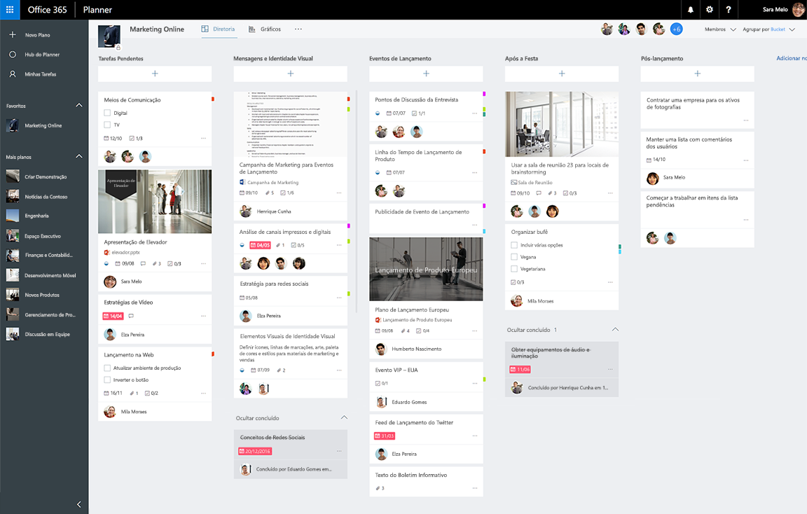

# Visão geral da API de tarefas e planos do Planner

A API do Planner no Microsoft Graph fornece uma maneira simples e visual para as equipes organizarem seu trabalho. Os clientes podem usar o Planner para criar planos, organizar e atribuir tarefas, compartilhar o progresso e colaborar em conteúdo. O Planner fornece várias experiências interativas, incluindo um quadro de tarefas, uma página de gráficos e uma visualização de horários, assim como integrações em todo o Microsoft 365.

**Quadro de tarefas do Microsoft 365 Planner**

## Por que se integrar com tarefas do Planner?
O Planner fornece recursos de acompanhamento de tarefas para experiências de colaboração no Microsoft 365. Se os seus cenários exigem o acompanhamento de tarefas e a organização do trabalho de uma equipe ou um grupo de usuários finais, o Planner é o serviço certo para você. A integração do Planner pode ajudá-lo a alcançar os milhões de usuários que colaboram no Microsoft 365. 

### Organize o trabalho de sua equipe
O Planner oferece um espaço compartilhado onde você pode criar uma equipe, [criar tarefas](/graph/api/planner-post-tasks) e atribuí-las aos outros membros da equipe. O Planner torna fácil para todos saber quem está fazendo o quê e se as coisas estão no prazo. Você pode atualizar tarefas com mais informações, como datas de vencimento, andamento e descrições, e então organizar mais tarefas com rótulos de categoria e buckets personalizáveis.   

### Colabore no Microsoft 365
O Planner se integra às experiências de colaboração do Microsoft 365. Além dos clientes Web e móveis do Planner, os usuários podem visualizar e atualizar os planos e tarefas do Planner no SharePoint e do Microsoft Teams.  

O próprio Planner também é baseado no Microsoft Graph e no serviço de grupo do Microsoft 365. Os arquivos que você carrega e anexa às tarefas do Planner são armazenados no SharePoint. Os comentários do Planner são baseados em conversas em grupo do Outlook.

<!-- Add image
Note: Put an image here showing the relationship between Planner and other things
-->

### Automatizar a criação de tarefas e planos
Você está trabalhando em um processo ou tipo de projeto repetido? Você pode usar a API do Planner para automatizar a criação de um plano e uma lista de tarefas.  
 
## Principais tarefas da API do Planner

|Operação|URL|
|:--------|:--|
|Ver todos os [planos](/graph/api/resources/plannerplan) para um grupo|GET [https://graph.microsoft.com/v1.0/groups/{id}/planner/plans](https://developer.microsoft.com/graph/graph-explorer?request=groups/{id}/planner/plans&version=v1.0)|
|Ver [tarefas](/graph/api/resources/plannertask) em um plano|GET [https://graph.microsoft.com/v1.0/planner/plans/{id}/tasks](https://developer.microsoft.com/graph/graph-explorer?request=planner/plans/{id}/tasks&version=v1.0)|
|Ver todas as [minhas tarefas](/graph/api/planneruser-list-tasks) atribuídas a mim nos planos|GET [https://graph.microsoft.com/v1.0/me/planner/tasks/](https://developer.microsoft.com/graph/graph-explorer?request=me/planner/tasks/&version=v1.0)|
|[Criar uma nova tarefa](/graph/api/planner-post-tasks)|POST [https://graph.microsoft.com/v1.0/planner/tasks](https://developer.microsoft.com/graph/graph-explorer?request=groups/{id}/planner/plans&version=v1.0)|
|[Atualizar uma tarefa](/graph/api/plannertask-update)|PATCH [https://graph.microsoft.com/v1.0/planner/tasks/{task-id}](https://developer.microsoft.com/graph/graph-explorer?request=groups/{id}/planner/plans&version=v1.0)|
|[Excluir uma tarefa](/graph/api/plannertask-delete)|EXCLUIR [https://graph.microsoft.com/v1.0/planner/tasks/{id}](https://developer.microsoft.com/graph/graph-explorer?request=groups/{id}/planner/plans&version=v1.0)|

## Referência da API

Está procurando a referência de API para esse serviço?

- [API do Planner no Microsoft Graph v1.0](/graph/api/resources/planner-overview?view=graph-rest-1.0&preserve-view=true)
- [API do Planner no Microsoft Graph beta](/graph/api/resources/planner-overview?view=graph-rest-beta&preserve-view=true)

## Próximas etapas

- [Trabalhar com planos](/graph/api/resources/planner-overview#plans)
- [Trabalhar com tarefas](/graph/api/resources/planner-overview#tasks)
