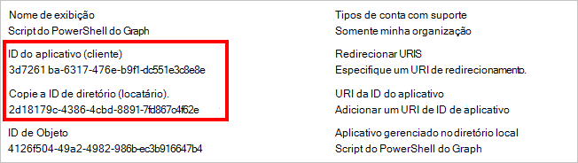
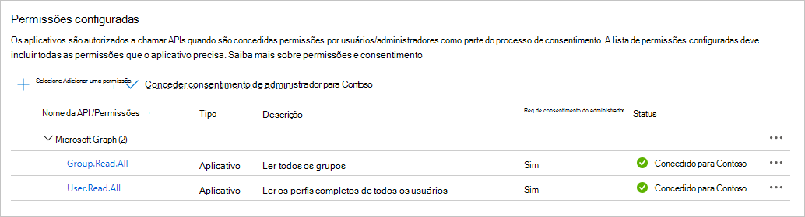

# <a name="use-app-only-authentication-with-the-microsoft-graph-powershell-sdk"></a>Usar autenticação somente aplicativo com o Microsoft Graph PowerShell SDK

O SDK do PowerShell dá suporte a dois tipos de autenticação: [acesso](..\auth-v2-user.md)delegado e [acesso somente aplicativo.](..\auth-v2-service.md) Este guia se concentrará na configuração necessária para habilitar o acesso somente ao aplicativo.

> [!IMPORTANT]
> O acesso somente a aplicativo concede permissões diretamente a um aplicativo e exige que um administrador consenta com os escopos de permissão necessários. Para obter mais informações sobre o acesso somente a aplicativos, consulte plataforma de identidade da Microsoft e o fluxo de credenciais do cliente [OAuth 2.0](/azure/active-directory/develop/v2-oauth2-client-creds-grant-flow).

Vamos falar sobre como configurar o acesso somente a aplicativos para um script simples para listar usuários e grupos em seu Microsoft 365 locatário.

## <a name="configuration"></a>Configuração

Antes de usar o acesso somente a aplicativos com o SDK, você precisa do seguinte.

- Um certificado a ser usado como uma credencial para o aplicativo. Pode ser um certificado auto-assinado ou um certificado de uma autoridade. Consulte a [seção Consulte também para](#see-also) obter orientações sobre como criar um certificado auto-assinado.
- [Registre um aplicativo](/azure/active-directory/develop/app-objects-and-service-principals) no Azure AD, configure-o com os escopos de permissão que seu cenário exige e compartilhe a chave pública do certificado.

### <a name="certificate"></a>Certificado

Você precisará de um certificado X.509 instalado no armazenamento confiável do usuário no computador onde você executará o script. Você também precisará da chave pública do certificado exportada no formato .cer, .pem ou .crt. Você precisará do valor do assunto do certificado ou de sua impressão digital.

### <a name="register-the-application"></a>Registrar o aplicativo

Você pode registrar o aplicativo no [portal Azure Active Directory ou](https://aad.portal.azure.com)usando o PowerShell.

<!-- markdownlint-disable MD025 -->
# <a name="portal"></a>[Portal](#tab/azure-portal)

1. Abra um navegador e navegue até o centro de administração [Azure Active Directory e](https://aad.portal.azure.com) faça logon usando um administrador Microsoft 365 da organização de locatários.

1. Selecione **Azure Active Directory** na navegação esquerda e selecione **Registros de aplicativos** em **Gerenciar**.

    

1. Selecione **Novo registro**. Na página **Registrar um aplicativo**, defina os valores da seguinte forma.

    - Defina **Nome** para `Graph PowerShell Script`.
    - Definir **tipos de conta com suporte** como Contas neste diretório organizacional **somente**.
    - Deixe **o URI de redirecionamento em** branco.

    

1. Selecione **Registrar**. Na página **Graph script do PowerShell,** copie os valores da ID do Aplicativo **(cliente)** e da ID de Diretório **(locatário)** e salve-os.

    

1. Selecione **Permissões de API em** **Gerenciar**. Escolha **Adicionar uma permissão**.

1. Selecione **Microsoft Graph**, em **seguida, Permissões de Aplicativo.** Adicione **User.Read.All e** **Group.Read.All**, selecione **Adicionar permissões**.

1. Nas **permissões configuradas,** remova a permissão **User.Read** delegada em **Microsoft Graph** selecionando **o ...** à direita da permissão e selecionando Remover **permissão**. Selecione **Sim, remova** para confirmar.

1. Selecione o **botão Conceder consentimento do administrador para...** e selecione **Sim** para conceder o consentimento do administrador para as permissões de aplicativo configuradas. A **coluna Status** na tabela Permissões **Configuradas** muda para **Concedido para ...**.

    

1. Selecione **Certificados e segredos** sob **Gerenciar**. Selecione o **botão Upload certificado.** Navegue até o arquivo de chave pública do certificado e selecione **Adicionar**.

# <a name="powershell"></a>[PowerShell](#tab/powershell)
<!-- markdownlint-enable MD025 -->

> [!NOTE]
> Você deve ter o Microsoft Graph PowerShell SDK [instalado](installation.md) antes de seguir estas etapas.

Você pode estar se perguntando: "Posso usar o SDK do PowerShell para registrar um aplicativo, para que eu possa usar o SDK do PowerShell?" Sim! Nesse caso, você está usando o SDK do PowerShell com acesso delegado, fazendo logom como administrador e criando o registro do aplicativo. Em seguida, usando esse registro de aplicativo, você pode usar o SDK do PowerShell com acesso somente a aplicativos, permitindo scripts autônomos.

1. Use um editor de texto para criar um novo arquivo chamado **RegisterAppOnly.ps1**. Colar o código a seguir no arquivo.

    :::code language="powershell" source="RegisterAppOnly.ps1":::

1. Salve o arquivo. Abra o PowerShell no diretório **que** contémRegisterAppOnly.ps1e execute o seguinte comando.

    ```powershell
    .\RegisterAppOnly.ps1 -AppName "Graph PowerShell Script" -CertPath "PATH_TO_PUBLIC_KEY_FILE"
    ```

1. Abra seu navegador conforme solicitado. Entre com uma conta de administrador e aceite as permissões.

1. Revise a saída do prompt `Please go to the following URL in your browser to provide admin consent` . Copie a URL fornecida e a colar no navegador. Entre com uma conta de administrador para conceder o consentimento do administrador ao seu aplicativo recém-registrado.

    > [!NOTE]
    > Depois de conceder o consentimento do administrador, o navegador redirecionará de volta para `http://localhost` e exibirá um **erro Não** Encontrado. Esse erro pode ser ignorado desde que a URL contenha `admin_consent=True` .

1. Revise o restante da saída do PowerShell para `Connect-MgGraph` o comando pré-preenchido com os valores do registro do aplicativo.

    > [!TIP]
    > Se o script retornar um erro informando , execute o `New-MgServicePrincipal : Unable to find target address` script com o parâmetro `-TenantId` adicional. Para obter detalhes, [consulte How to find your Azure Active Directory tenant ID](/azure/active-directory/fundamentals/active-directory-how-to-find-tenant).

---

## <a name="authenticate"></a>Autenticar

Você deve ter três informações após concluir as etapas de configuração acima.

- Assunto de certificado ou impressão digital do certificado carregado no registro do aplicativo do Azure AD.
- ID do aplicativo para o registro do aplicativo.
- Sua ID de locatário.

Vamos usá-los para testar a autenticação. Abra o PowerShell e execute o seguinte comando, substituindo os espaço reservados por suas informações.

```powershell
Connect-MgGraph -ClientID YOUR_APP_ID -TenantId YOUR_TENANT_ID -CertificateName YOUR_CERT_SUBJECT ## Or -CertificateThumbprint instead of -CertificateName
```

Se isso for bem-sucedido, você verá `Welcome To Microsoft Graph!` . Execute `Get-MgContext` para verificar se você se autentica com somente aplicativo. A saída deve ter a seguinte aparência.

```powershell
ClientId              : YOUR_APP_ID
TenantId              : YOUR_TENANT_ID
CertificateThumbprint :
Scopes                : {Group.Read.All, User.Read.All}
AuthType              : AppOnly
CertificateName       : YOUR_CERT_SUBJECT
Account               :
AppName               : Graph PowerShell Script
ContextScope          : Process
```

## <a name="create-the-script"></a>Criar o script

Crie um novo arquivo chamado **GraphAppOnly.ps1** e adicione o código a seguir.

```powershell
# Authenticate
Connect-MgGraph -ClientID YOUR_APP_ID -TenantId YOUR_TENANT_ID -CertificateName YOUR_CERT_SUBJECT

Write-Host "USERS:"
Write-Host "======================================================"
# List first 50 users
Get-MgUser -Property "id,displayName" -PageSize 50 | Format-Table DisplayName, Id

Write-Host "GROUPS:"
Write-Host "======================================================"
# List first 50 groups
Get-MgGroup -Property "id,displayName" -PageSize 50 | Format-Table DisplayName, Id

# Disconnect
Disconnect-MgGraph
```

Substitua os espaço reservados no `Connect-MgGraph` comando por suas informações. Salve o arquivo e abra o PowerShell no diretório onde você criou o arquivo. Execute o script com o seguinte comando.

```powershell
.\GraphAppOnly.ps1
```

O script gera uma lista de usuários e grupos semelhantes à saída abaixo (truncado para brevidade).

```powershell
Welcome To Microsoft Graph!
USERS:
======================================================

DisplayName              Id
-----------              --
Conf Room Adams          88d1ba68-8ff5-4de2-90ed-768c00abcfae
Adele Vance              3103c7b9-cfe6-4cd3-a696-f88909b9a609
MOD Administrator        da3a885e-2d97-41de-9347-5271ef321b58
...

GROUPS:
======================================================

DisplayName                         Id
-----------                         --
App Development                     06dce3e5-d310-4add-ab2c-be728fb9076e
All Employees                       1a1cd42d-9801-4e9d-9b77-5215886174ef
Mark 8 Project Team                 2bf1b0d0-81f6-4e80-b971-d1db69f8d651
...
```


## <a name="see-also"></a>Confira também

+ [Como: criar um certificado público auto-assinado para autenticar seu aplicativo](/azure/active-directory/develop/howto-create-self-signed-certificate)
