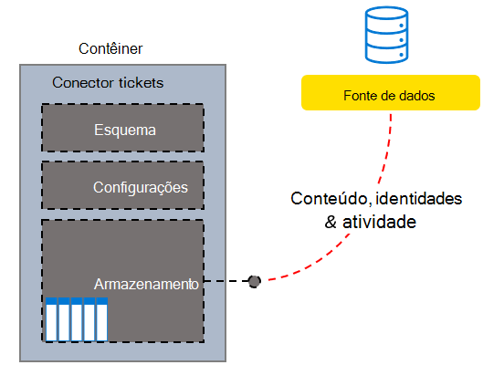

# Criar, atualizar e excluir conexões no Microsoft GraphCreate, update, and delete connections in the Microsoft Graph

As conexões de serviços externos com o serviço da Pesquisa da Microsoft são representadas pelo recurso [externalConnection](/graph/api/resources/externalconnection?view=graph-rest-beta&preserve-view=true) no Microsoft Graph.Connections from external services to the Microsoft Search service are represented by the [externalConnection](/graph/api/resources/externalconnection?view=graph-rest-beta&preserve-view=true) resource in Microsoft Graph.

A plataforma de conectores do Microsoft Graph oferece uma maneira simples de adicionar seus dados externos ao Microsoft Graph.The Microsoft Graph connectors platform offers a simple way to add your external data into the Microsoft Graph. Uma conexão é um contêiner lógico de dados externos que um administrador pode gerenciar como uma única unidade.A connection is a logical container for your external data that an administrator can manage as a single unit.

Depois de criar uma conexão, você pode adicionar seu conteúdo de qualquer fonte de dados externa, como uma fonte de conteúdo local ou um serviço SaaS externo.Once a connection has been created, you can add your content from any external data source such as an on-premises content source or an external SaaS service. Só é possível exibir e gerenciar as conexões que você criou ou que foram explicitamente [autorizadas](/graph/api/external-post-connections?view=graph-rest-beta&preserve-view=true) para gerenciamento.You can only view and manage the connections you created or were explicitly [authorized](/graph/api/external-post-connections?view=graph-rest-beta&preserve-view=true) to manage. Um administrador de pesquisa pode exibir e gerenciar todas as conexões no locatário no Centro de Administração Moderna.A search admin can view and manage all the connections in the tenant from the Modern Admin Center.

<!-- markdownlint-disable MD036 -->

*Exemplo de um sistema helpdesk personalizado da estrutura de conector de tíquetes**Sample custom helpdesk system Tickets Connector Structure*

*Modo de exibição de administrador das conexões, incluindo o conector de tíquetes personalizado**Admin View of Connections including the custom Tickets Connector*

<!-- markdownlint-enable MD036 -->

Você pode modelar uma conexão assim que desejar, mas criar uma conexão para cada instância do seu conector é o modelo mais comum.You can model a connection anyway you want, but creating one connection for every instance of your connector is the most common model. Por exemplo, todas as vezes que você [configurar o conector de compartilhamento de arquivos do Microsoft Windows](/microsoftsearch/configure-connector), uma nova conexão será criada.For example, each time you [set up the Microsoft Windows file share connector](/microsoftsearch/configure-connector), a new connection is created. Você também pode criar uma única conexão para adicionar todos os itens da fonte de dados.You can also create a single connection to add all items from your data source. Por exemplo, criar uma única conexão para adicionar todos os tíquetes e incidentes por várias equipes do seu sistema de assistência técnica.For example, creating a single connection to add all the tickets and incidents across multiple teams from your helpdesk system.

## Estados e operaçõesStates and operations

A conexão pode existir em um dos seguintes estados.Your connection can exist in one of the following states.

| EstadoState             | DescriçãoDescription                                                                                                                                               |
|-------------------|-----------------------------------------------------------------------------------------------------------------------------------------------------------|
| **Rascunho****Draft**         | É fornecida uma conexão vazia.An empty connection is provisioned. A fonte de dados, o esquema ou as configurações ainda não foram configuradas.The data source, schema, or any settings have not been configured yet.                                                |
| **Pronto****Ready**         | A conexão é fornecida com o esquema registrado e está pronta para inclusão.The connection is provisioned with registered schema and is ready for ingestion.                                                                          |
| **Obsoleto****Obsolete**      | Isso ocorre quando um recurso dependente, como uma API, foi preterido.This occurs when a dependent feature, such as an API, has been deprecated. A exclusão da conexão é a única operação válida.Deleting the connection is the only valid operation.                           |
| **LimitExceeded****LimitExceeded** | Se você alcançar o limite máximo de uma única conexão ou cota de nível de locatário em todas as conexões, não será possível adicionar mais itens até sair do estado.If you hit the maximum limit of a single connection or the tenant level quota across all connections, you cannot add more items until you exit the state. |

A tabela a seguir especifica quais operações estão disponíveis em cada Estado.The following table specifies which operations are available in each state.

| OperaçãoOperation         | RascunhoDraft              | ProntoReady              | ObsoletoObsolete           | LimitExceededLimitExceeded      |
|-------------------|--------------------|--------------------|--------------------|--------------------|
| Criar conexãoCreate connection | :x:                | :heavy_check_mark: | :x:                | :heavy_check_mark: |
| Ler conexãoRead connection   | :heavy_check_mark: | :heavy_check_mark: | :heavy_check_mark: | :heavy_check_mark: |
| Atualizar conexãoUpdate connection | :heavy_check_mark: | :heavy_check_mark: | :x:                | :heavy_check_mark: |
| Excluir conexãoDelete connection | :heavy_check_mark: | :heavy_check_mark: | :heavy_check_mark: | :heavy_check_mark: |
| Criar esquemaCreate schema     | :heavy_check_mark: | :x:                | :x:                | :x:                |
| Ler esquemaRead schema       | :x:                | :heavy_check_mark: | :heavy_check_mark: | :heavy_check_mark: |
| Atualizar esquemaUpdate schema     | :x:                | :x:                | :x:                | :x:                |
| Excluir esquemaDelete schema     | :x:                | :x:                | :x:                | :x:                |
| Criar itemCreate item       | :x:                | :heavy_check_mark: | :x:                | :x:                |
| Ler itemRead item         | :x:                | :heavy_check_mark: | :heavy_check_mark: | :heavy_check_mark: |
| Atualizar itemUpdate item       | :x:                | :heavy_check_mark: | :x:                | :heavy_check_mark: |
| Excluir itemDelete item       | :x:                | :heavy_check_mark: | :x:                | :heavy_check_mark: |

Uma conexão permite que seu aplicativo [defina um esquema](/graph/api/externalconnection-post-schema?view=graph-rest-beta&preserve-view=true) para os itens que serão indexados e forneça um ponto de extremidade para o seu serviço adicionar, atualizar ou excluir itens do índice.A connection allows your application to [define a schema](/graph/api/externalconnection-post-schema?view=graph-rest-beta&preserve-view=true) for items that will be indexed, and provides an endpoint for your service to add, update, or delete items from the index. [Criar uma conexão](#create-a-connection) é a primeira etapa para um aplicativo para adicionar itens ao índice de pesquisa.[Creating a connection](#create-a-connection) is the first step for an application to add items to the search index.

## Criar uma conexãoCreate a connection

Antes que um aplicativo possa adicionar itens ao índice de pesquisa, ele deve criar e configurar uma conexão usando as etapas a seguir.Before an application can add items to the search index, it must create and configure a connection using the following steps.

- [Criar uma conexão](/graph/api/external-post-connections?view=graph-rest-beta&preserve-view=true) com ID exclusiva, nome de exibição e descrição.[Create a connection](/graph/api/external-post-connections?view=graph-rest-beta&preserve-view=true) with a unique ID, display name, and description.
- [Registre um esquema](/graph/api/externalconnection-post-schema?view=graph-rest-beta&preserve-view=true) para definir os campos que serão incluídos no índice.[Register a schema](/graph/api/externalconnection-post-schema?view=graph-rest-beta&preserve-view=true) to define the fields that will be included in the index.

> [!IMPORTANT]
> Depois que um esquema é registrado, ele não pode ser alterado para uma conexão existente.After a schema has been registered, it cannot be changed for an existing connection.

## Atualizar uma conexãoUpdate a connection

Você pode alterar o nome de exibição ou a descrição de uma conexão existente [atualizando a conexão](/graph/api/externalconnection-update?view=graph-rest-beta&preserve-view=true).You can change the display name or description of an existing connection by [updating the connection](/graph/api/externalconnection-update?view=graph-rest-beta&preserve-view=true).

## Excluir uma conexãoDelete a connection

Você pode [excluir uma conexão](/graph/api/externalconnection-delete?view=graph-rest-beta&preserve-view=true) e remover todos os itens que foram indexados por meio da conexão.You can [delete a connection](/graph/api/externalconnection-delete?view=graph-rest-beta&preserve-view=true), and remove all items that were indexed via that connection.

## Próximas etapasNext steps

- [Registrar o esquema de conexãoRegister the connection schema](./search-index-manage-schema.md)
- [Revisar a referência da API do conectores do GraphReview the Graph Connectors API reference](/graph/api/resources/indexing-api-overview?view=graph-rest-beta&preserve-view=true)
- [Visão geral dos conectores do Microsoft GraphOverview for Microsoft Graph Connectors](/microsoftsearch/connectors-overview)
- Baixe o [exemplo de conector de pesquisa](https://github.com/microsoftgraph/msgraph-search-connector-sample) no GitHubDownload the [sample search connector](https://github.com/microsoftgraph/msgraph-search-connector-sample) from GitHub