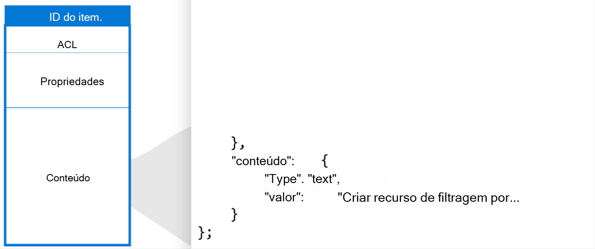

# <a name="create-update-and-delete-items-added-by-your-application-in-the-microsoft-graph-connection"></a>Criar, atualizar e excluir itens adicionados por seu aplicativo na conexão do Microsoft Graph

Os itens adicionados por seu aplicativo ao serviço de Pesquisa da Microsoft são representados pelo recurso [externalItem](/graph/api/resources/externalitem?view=graph-rest-beta&preserve-view=true) no Microsoft Graph.

Depois de criar uma conexão, você pode adicionar o conteúdo. Cada item da fonte de dados deve ser representado como um [externalItem](/graph/api/resources/externalitem?view=graph-rest-beta&preserve-view=true) no Microsoft Graph com uma ID de item exclusiva. Essa ID é usada para criar, atualizar ou excluir o item do Microsoft Graph. Você pode usar a chave primária da fonte de dados como itemId ou derivá-la de um ou mais campos. Um [externalItem](/graph/api/resources/externalitem?view=graph-rest-beta&preserve-view=true) possui três componentes principais: lista de controle de acesso, propriedades e conteúdo.

## <a name="access-control-list"></a>Lista de controle de acesso

A lista de controle de acesso é usada para especificar se as funções determinadas têm acesso concedido ou negado para exibir itens nas experiências da Microsoft. É uma matriz de entradas de controle de acesso, cada uma representando um usuário ou grupo do Azure Active Directory. Há um terceiro tipo de entrada de controle de acesso `Everyone` que representa todos os usuários no locatário.


O valor accessType `deny` tem precedência sobre `grant`. Por exemplo, no item mostrado acima, enquanto `Everyone` recebe o acesso e a um usuário específico é negado o acesso, a permissão efetiva desse usuário é `deny`.

Se sua fonte de dados tiver grupos não pertencentes ao Azure Active Directory como equipes no sistema de assistência técnica, usado para definir permissões para o item, você poderá criar grupos externos no Microsoft Graph usando as APIs de sincronização do grupo para duplicar as permissões de `allow` ou `deny`. Evite expandir a afiliação dos seus grupos externos diretamente nas listas de controle de acesso de itens individuais, uma vez que cada atualização de afiliação ao grupo pode levar a um tumulto de atualizações de itens.

Os grupos externos podem consistir em outro grupo externo, usuários do Azure Active Directory e grupos do Azure Active Directory. Se você tiver usuários que não são do Azure Active Directory, deve traduzi-los para os usuários do Azure Active Directory na lista de controle de acesso.

## <a name="properties"></a>Propriedades

O componente propriedades é usado para adicionar metadados de itens que são úteis nas experiências do Microsoft Graph. Você deve [registrar o esquema](./search-index-manage-schema.md) para a conexão antes de adicionar itens a ele e converter os tipos de dados em [tipos de dados com suporte](/graph/api/resources/property?view=graph-rest-beta&preserve-view=true).


## <a name="content"></a>Conteúdo

O componente de conteúdo é usado para adicionar a maior parte do item que deve ser indexado em texto completo. Alguns exemplos incluem a descrição do tíquete, texto analisado de um corpo de arquivo ou um corpo de página wiki.

O conteúdo é um dos principais campos que influenciam na [relevância](./search-index-manage-schema.md#relevance) nas experiências da Microsoft. Oferecemos suporte para o tipo de conteúdo `text` e `HTML`. Se sua fonte de dados tiver arquivos binários, você poderá analisá-los como texto antes de adicioná-los ao Microsoft Graph.



O conteúdo não pode ser adicionado diretamente a um modelo de resultado de pesquisa, mas você pode usar um trecho de resultado gerado, que é uma prévia gerada dinamicamente das seções relevantes dentro do conteúdo.


Quando o conteúdo da fonte de dados é alterado, você deve sincronizá-lo com seus itens de conexão. Você pode atualizar o item inteiro ou atualizar um ou mais dos seus componentes. Depois que o conteúdo tiver sido adicionado ao Microsoft Graph, você poderá pesquisá-lo por meio da experiência de Pesquisa da Microsoft após configurar [verticais e tipos de resultado](/MicrosoftSearch/customize-search-page) ou usar a [API da Pesquisa da Microsoft Graph](/graph/api/resources/search-api-overview?view=graph-rest-beta&preserve-view=true).

## <a name="add-an-item"></a>Adicionar um item

Você pode adicionar um item ao índice [criando um externalItem](/graph/api/externalconnection-put-items?view=graph-rest-beta&preserve-view=true). Ao criar um item, você atribui um identificador exclusivo na URL.

Por exemplo, seu aplicativo pode indexar tíquetes de assistência técnica usando o número do tíquete. Se um tíquete tiver o número do tíquete `SR00145`, a solicitação poderá ser semelhante à seguinte.

```http
PUT /external/connections/contosohelpdesk/items/SR00145
Content-Type: application/json

{
  "title": "WiFi outage in Conference Room A",
  "status": "New",
  "assignee": "meganb@contoso.com"
}
```

> ![OBSERVAÇÃO] Antes que os itens indexados possam ser encontrados na IU da Pesquisa da Microsoft, um administrador deve [personalizar a página de resultados de pesquisa](/MicrosoftSearch/configure-connector#next-steps-customize-the-search-results-page) para a conexão correspondente.

## <a name="update-an-item"></a>Atualizar um item

Quando um item é atualizado no serviço externo (o tíquete de assistência técnica é reatribuído ou uma descrição de produto é atualizada), você pode atualizar a respectiva entrada no índice [atualizando o externalItem](/graph/api/externalitem-update?view=graph-rest-beta&preserve-view=true), usando o identificador exclusivo atribuído ao item quando ele foi criado.

```http
PATCH /external/connections/contosohelpdesk/items/SR00145
Content-Type: application/json

{
  "assignee": "alexw@contoso.com"
}
```

## <a name="delete-an-item"></a>Excluir um item

Você pode remover os itens do índice [excluindo o externalItem](/graph/api/externalitem-delete?view=graph-rest-beta&preserve-view=true), usando o identificador exclusivo atribuído ao item quando ele foi criado.

```http
DELETE /external/connections/contosohelpdesk/items/SR00145
```

## <a name="next-steps"></a>Próximas etapas

- [Consulta usando a API de Pesquisa da Microsoft](search-concept-overview.md#why-use-the-microsoft-search-api)
- [Examine a referência da API de indexação](/graph/api/resources/indexing-api-overview?view=graph-rest-beta&preserve-view=true)
- [Personalizar a página de resultados da pesquisa da Microsoft](/MicrosoftSearch/customize-search-page)
- [Pesquisar tipos personalizados (externalItem)](search-concept-custom-types.md)
- Baixe o [exemplo de conector de pesquisa](https://github.com/microsoftgraph/msgraph-search-connector-sample) no GitHub