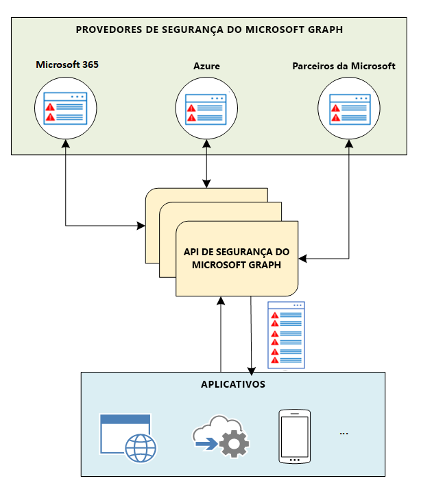

# Visão geral da API de Segurança do Microsoft Graph

Você pode usar a API de Segurança do Microsoft Graph para se conectar aos produtos, serviços e parceiros de segurança da Microsoft para simplificar operações de segurança e melhorar a proteção contra ameaças, a detecção de ameaças e a capacidade de resposta. A API de Segurança do Microsoft Graph é um serviço (ou agente) intermediário que proporciona uma interface de programação única para conectar diversos [provedores de Segurança do Microsoft Graph](/graph/api/resources/securityvendorinformation?view=graph-rest-1.0) (também chamados provedores de segurança ou provedores). As solicitações para a API de Segurança do Microsoft Graph são federadas para todos os provedores de segurança aplicáveis. Os resultados são agregados e retornam ao aplicativo solicitantes em um esquema comum, como mostrado no diagrama a seguir. Para saber detalhes, confira o[ fluxo de dados da API de Segurança do Microsoft Graph](security-dataflow.md).

Para informações sobre autorização, confira [Autorização e a API de Segurança do Microsoft Graph](security-authorization.md). Para saber mais sobre permissões, incluindo permissões delegadas e de aplicativos, confira [Permissões](permissions-reference.md#security-permissions).

> [!VIDEO https://www.youtube-nocookie.com/embed/oYXPGwH9Ho0]

## Por que usar a API de Segurança do Microsoft Graph?

A [API de Segurança do Microsoft Graph](/graph/api/resources/security-api-overview?view=graph-rest-1.0) facilita a conexão com as soluções de segurança da Microsoft e parceiros. Ela permite que você entenda e enriqueça mais rapidamente o valor dessas soluções. Você pode se conectar facilmente com a API de Segurança do Microsoft Graph usando um dos procedimentos a seguir, dependendo de suas necessidades:

- [Escrever código](https://aka.ms/graphsecuritysdk) – Encontrar [exemplos do código](https://aka.ms/graphsecurityapicode) no C#, Java, NodeJS e mais.
- [Conectar usando scripts](https://aka.ms/graphsecuritypowershellsampleblog) – Encontrar [exemplos do PowerShell](https://aka.ms/graphsecuritypowershellsample).
- [Arrastar e solta em fluxos de trabalho e guias estratégicos](https://aka.ms/graphsecurityconnectorsblogpost) – Use [conectores de segurança do Microsoft Graph](/azure/connectors/connectors-integrate-security-operations-create-api-microsoft-graph-security) para [Aplicativos Azure Logic](/azure/logic-apps/logic-apps-overview), [Microsoft Flow](https://flow.microsoft.com/)e o [PowerApps](https://powerapps.microsoft.com/).
- [Obter dados em relatórios e painéis](https://aka.ms/graphsecuritypowerbiconnectorblogpost) : Use o [conector de segurança do Microsoft Graph para o Power BI](/power-bi/connect-data/desktop-connect-graph-security).
- [Conectar usando blocos de anotações Jupyter](https://jupyter.org/) – Encontrar [exemplos de bloco de anotações do Jupyter](https://aka.ms/graphsecurityjupyternotebooks).  

### Unificar e padronizar o monitoramento de alertas

Conecte o código uma vez para integrar os alertas de qualquer solução de segurança integrada do Microsoft Graph e mantenha os status de alerta e as atribuições sincronizados em todas as soluções. Você também pode transmitir alertas para soluções de gerenciamento de eventos e informações de segurança (SIEM), como o Splunk, usando os conectores da API de Segurança do Microsoft Graph. Para obter mais informações sobre as integrações de solução com as entidades da API de segurança, confira [Integrações de solução de segurança usando a API de Segurança do Microsoft Graph](security-integration.md).

### Correlacionar alertas de segurança para melhorar a resposta e a proteção contra ameaças

Correlacione alertas entre soluções de segurança com mais facilidade com um esquema de alerta unificado. Além de permitir que você receba informações de alerta acionáveis, permite também que analistas de segurança dinamizem e enriqueçam alertas com informações de ativos e usuários, possibilitando uma resposta mais rápida a ameaças e a proteção dos ativos.  

### Atualizar marcas, status e atribuições de alerta

Marque os alertas com contexto adicional ou inteligência contra ameaças para informar a resposta e a correção. Certifique-se de que os comentários e as opiniões nos alertas sejam capturados e estejam visíveis em todos os fluxos de trabalho. Mantenha as atribuições e o status de alerta sincronizados para que todas as soluções integradas reflitam o estado atual. Use assinaturas webhook para receber notificação das alterações.  

### Desbloquear o contexto de segurança para orientar investigação

Aprofunde seus conhecimentos sobre inventários relevantes relacionados à segurança (como usuários, hosts e aplicativos) e, em seguida, adicione contexto organizacional de outros provedores do Microsoft Graph (Azure AD, Microsoft Intune, Microsoft 365) para reunir os contextos comercial e de segurança e melhorar a resposta às ameaças.

### Automatizar fluxos de trabalho de segurança e relatórios

Automatizar gerenciamento de segurança, monitorar e investigar para melhorar o desempenho operacional e o tempo de resposta. Obter mais informações e contexto ao integrar a segurança do Microsoft Graph em relatórios e painéis.

### Obtenha insights aprofundados para treinar as soluções de segurança

Visualize seus dados em vários produtos de segurança diferentes na sua organização para obter insights de segurança aprofundados. Descubra oportunidades para aprender com os dados e treinar suas soluções de segurança. O esquema fornece várias propriedades de tabela dinâmica para construir conjuntos de dados ricos e exploratórios usando os dados de segurança.

### Utilize sua inteligência contra ameaças em soluções de segurança da Microsoft (visualização)

Enviar automaticamente indicadores de ameaças para soluções de segurança da Microsoft para habilitar `alert`, `block`, ou `allow` ações. Usar a API de segurança do Microsoft Graph diretamente ou aproveitar as integrações com plataformas precisas que possuem inteligência contra ameaças..

### Agir rapidamente em resposta às novas ameaças (visualização)

Habilite a ação swift para se proteger contra novas ameaças, como ações para bloquear arquivos, URLs, domínios ou endereços IP nos fluxos de trabalho e nas ferramentas de segurança.

### Gerenciar proativamente riscos de segurança (visualização)

Use o Microsoft Secure Score (visualização) para proporcionar visibilidade às necessidades de segurança de sua organização e obter sugestões sobre como melhorá-las, além de projetar uma pontuação melhorada depois dessas sugestões serem implementadas. Meça facilmente seu progresso ao longo do tempo e obtenha ideias sobre alterações específicas que conduziram à melhoria de sua pontuação.

## Benefícios do uso da API de Segurança do Microsoft Graph

A tabela a seguir lista os benefícios que as diferentes soluções de segurança podem acessar ao se integrar com a API de Segurança do Microsoft Graph.  

|**Área**     | **Benefícios**|
|:---------------|:---------|
|**Gerenciamento de Provedores de Serviços de Segurança (MSSPs)**|<ul><li>Integração simplificada com ferramentas de operações de segurança, fluxos de trabalho e relatórios.</li> <li>Redução no tempo e no esforço de implantação e manutenção.</li> <li>Resposta automática para alertas ao realizar ação contra ameaças.</li> <li>Capacidade de oferecer mais vantagens para os clientes MSSP.</li></ul>|
|**Soluções de gerenciamento de risco de TI e SIEM**|<ul><li>Integração perfeita com soluções de segurança da Microsoft e ecossistemas parceiros.</li> <li>Metadados de alerta avançados.</li> <li>Melhor correlação de alerta.</li></ul>|
|**Aplicativos**  (Inteligência contra ameaças, celular, nuvem, IOT, detecção de fraudes, Identidade e acesso, risco e conformidade, firewall e muito mais)|<ul><li>Gerenciamento unificado de ameaças, prevenção e gerenciamento de riscos em diversas soluções de segurança.</li> <li>Alertas, ações e inteligência contra ameaças do cliente expostas por meio do Microsoft Graph.</li> <li>Integração instantânea com soluções habilitadas pelo Microsoft Graph.</li> <li>Obtenha insights de segurança aprofundados para treinar outras soluções de segurança.</li> </ul>|

## Referência da API
Está procurando a referência de API para esse serviço?

- [API de Segurança no Microsoft Graph v1.0](/graph/api/resources/security-api-overview?view=graph-rest-1.0)
- [API de Segurança na versão beta do Microsoft Graph](/graph/api/resources/security-api-overview?view=graph-rest-beta)

## Próximas etapas

- [Usar a API de Segurança do Microsoft Graph](/graph/api/resources/security-api-overview?view=graph-rest-1.0)
- Explorar [exemplos da API de segurança do Microsoft Graph](https://aka.ms/graphsecurityapicode)
- Interessado em se tornar um provedor de segurança? Contate [graphsecfeedback](mailto:graphsecfeedback@microsoft.com).
