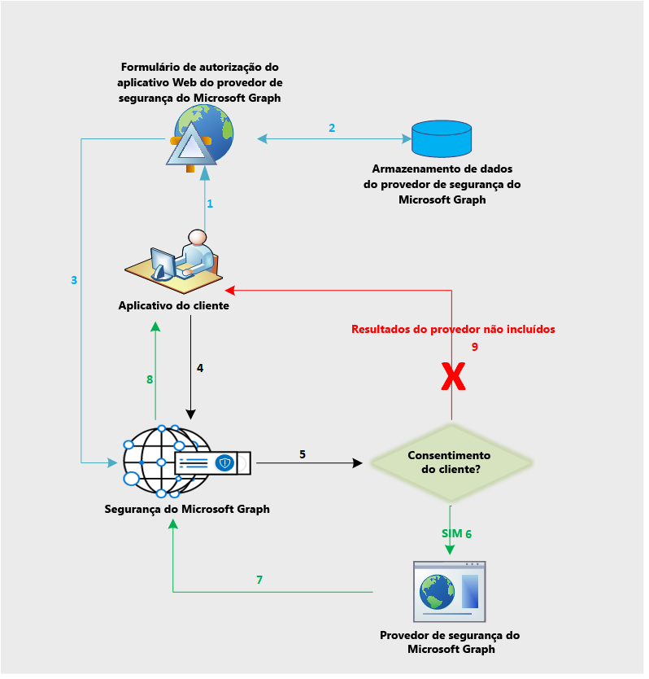

# Fluxo de dados da API de Segurança do Microsoft Graph

A API de Segurança do Microsoft Graph faz a federação de solicitações para todos os provedores no ecossistema de segurança do Microsoft Graph. Isso tem base no consentimento do provedor de segurança fornecido pelo aplicativo, conforme mostrado no diagrama a seguir. O fluxo de trabalho de consentimento só se aplica a fornecedores diferentes da Microsoft.

Veja a seguir uma descrição do fluxo:

1. O usuário do aplicativo entra no aplicativo provedor para exibir o formulário de consentimento do provedor. Essa experiência, ou interface do usuário, de formulário de consentimento pertence ao provedor e se aplica apenas a fornecedores diferentes da Microsoft, a fim de obter o consentimento explícito de seus clientes para enviar as solicitações à API de Segurança do Microsoft Graph.
2. O consentimento do cliente é armazenado no lado do provedor.
3. O serviço de consentimento do provedor chama a API de Segurança do Microsoft Graph para informar a aprovação de consentimento para o cliente respectivo.
4. O aplicativo envia uma solicitação à API de Segurança do Microsoft Graph.
5. A API de Segurança do Microsoft Graph verifica as informações de consentimento para esse cliente mapeado para vários provedores.
6. A API de Segurança do Microsoft Graph chama todos os provedores aos quais o cliente concedeu consentimento explícito por meio da experiência de consentimento do provedor.
7. A resposta é devolvida por todos os provedores com consentimento para esse cliente.
8. A resposta com o conjunto de resultados retorna para o aplicativo.
9. Se o cliente não tiver dado o consentimento a qualquer provedor, nenhum resultado desses provedores será incluído na resposta.
