# <a name="integrate-microsoft-graph-security-api-alerts-with-your-siem-using-azure-monitor"></a><span data-ttu-id="e13c0-106">Integração dos alertas da API de Segurança do Microsoft Graph com o SIEM usando o Azure Monitor</span><span class="sxs-lookup"><span data-stu-id="e13c0-106">Integrate Microsoft Graph Security API alerts with your SIEM using Azure Monitor</span></span>

<span data-ttu-id="e13c0-107">Os provedores de Segurança do Microsoft Graph podem ser gerenciados por meio de um único ponto de extremidade REST.</span><span class="sxs-lookup"><span data-stu-id="e13c0-107">The Microsoft Graph Security providers can be managed through a single REST endpoint.</span></span> <span data-ttu-id="e13c0-108">Este ponto de extremidade pode ser configurado para o [Azure Monitor](https://docs.microsoft.com/pt-BR/azure/monitoring-and-diagnostics/), que dá suporte a conectores para vários produtos SIEM.</span><span class="sxs-lookup"><span data-stu-id="e13c0-108">This endpoint can be configured to [Azure Monitor](https://docs.microsoft.com/en-us/azure/monitoring-and-diagnostics/) which supports connectors to several SIEM products.</span></span> <span data-ttu-id="e13c0-109">As instruções nas etapas 1 e 2 deste artigo referem-se a todos os conectores do Azure Monitor compatíveis com o consumo por Hubs de Eventos.</span><span class="sxs-lookup"><span data-stu-id="e13c0-109">The instructions in Steps 1 and 2 of this article refer to all Azure Monitor connectors that support consumption via event hubs.</span></span> <span data-ttu-id="e13c0-110">Este artigo descreve a integração de ponta a ponta do conector [Splunk](https://splunkbase.splunk.com/) SIEM.</span><span class="sxs-lookup"><span data-stu-id="e13c0-110">This article describes the end-to-end integration of the [Splunk](https://splunkbase.splunk.com/) SIEM connector.</span></span>

<span data-ttu-id="e13c0-111">O processo de integração envolve as seguintes etapas:</span><span class="sxs-lookup"><span data-stu-id="e13c0-111">The integration process involves the following steps:</span></span>

1. [<span data-ttu-id="e13c0-112">Configurar o Hub de Eventos do Azure para receber alertas de segurança para o locatário</span><span class="sxs-lookup"><span data-stu-id="e13c0-112">Set up Azure event hub to receive security alerts for your tenant</span></span>](#step-1-set-up-an-event-hubs-namespace-in-azure-to-receive-security-alerts-for-your-tenant)
2. [<span data-ttu-id="e13c0-113">Configurar o Azure Monitor para enviar alertas de segurança do locatário para o Hub de Eventos</span><span class="sxs-lookup"><span data-stu-id="e13c0-113">Configure Azure Monitor to send security alerts from your tenant to the event hub</span></span>](#step-2-configure-azure-monitor-to-send-security-alerts-from-your-tenant-to-the-event-hub)
3. [<span data-ttu-id="e13c0-114">Baixar e instalar o complemento do Azure Monitor para o Splunk permitindo a este consumir alertas de segurança</span><span class="sxs-lookup"><span data-stu-id="e13c0-114">Download and install the Azure Monitor Add-on for Splunk which will allow Splunk to consume security alerts</span></span>](#step-3-download-and-install-the-azure-monitor-add-on-for-splunk-which-will-allow-splunk-to-consume-security-alerts)
4. [<span data-ttu-id="e13c0-115">Registrar um aplicativo com o locatário do Azure Active Directory que o Splunk usará para fazer leitura no hub de eventos</span><span class="sxs-lookup"><span data-stu-id="e13c0-115">Register an application with your tenant Azure Active Directory which Splunk will use to read from the event hub</span></span>](#step-4-register-an-application-with-your-tenant-azure-active-directory-which-splunk-will-use-to-read-from-the-event-hub )
5. [<span data-ttu-id="e13c0-116">Criar um Azure Key Vault para armazenar a tecla de acesso do hub de eventos</span><span class="sxs-lookup"><span data-stu-id="e13c0-116">Create an Azure Key vault to store the access key for the event hub</span></span>](#step-5-create-an-azure-key-vault-to-store-the-access-key-for-the-event-hub)
6. [<span data-ttu-id="e13c0-117">Configurar as entradas de dados do Splunk para consumir alertas de segurança armazenados no hub de eventos</span><span class="sxs-lookup"><span data-stu-id="e13c0-117">Configure the Splunk data inputs to consume security alerts stored in the event hub</span></span>](#step-6-configure-the-splunk-data-inputs-to-consume-security-alerts-stored-in-the-event-hub)

<span data-ttu-id="e13c0-118">Após a conclusão dessas etapas, o Splunk Enterprise consumirá alertas de segurança de todos os produtos de segurança integrados ao Microsoft Graph para os quais seu locatário está licenciado.</span><span class="sxs-lookup"><span data-stu-id="e13c0-118">After you complete these steps, your Splunk Enterprise will consume security alerts from all the Microsoft Graph integrated security products for which your tenant is licensed.</span></span> <span data-ttu-id="e13c0-119">Todos os novos produtos de segurança que você licenciar também enviarão alertas por essa conexão, no mesmo esquema sem qualquer trabalho de integração adicional necessário.</span><span class="sxs-lookup"><span data-stu-id="e13c0-119">Any new security products that you license will also send alerts through this connection, in the same schema with no further integration work needed.</span></span>

## <a name="step-1-set-up-an-event-hubs-namespace-in-azure-to-receive-security-alerts-for-your-tenant"></a><span data-ttu-id="e13c0-120">Etapa 1: definir um namespace para o Hubs de Eventos no Azure para receber alertas de segurança do locatário</span><span class="sxs-lookup"><span data-stu-id="e13c0-120">Step 1: Set up an Event Hubs namespace in Azure to receive security alerts for your tenant</span></span>

<span data-ttu-id="e13c0-121">Para começar, você precisa criar um Hub de Eventos e um namespace dos [Hubs de Eventos do Microsoft Azure](https://docs.microsoft.com/pt-BR/azure/event-hubs/).</span><span class="sxs-lookup"><span data-stu-id="e13c0-121">To begin, you need to create a [Microsoft Azure Event Hubs](https://docs.microsoft.com/en-us/azure/event-hubs/) namespace and event hub.</span></span> <span data-ttu-id="e13c0-122">Esse Hub de Eventos e namespace serão o destino de todos os alertas de segurança da organização.</span><span class="sxs-lookup"><span data-stu-id="e13c0-122">This namespace and event hub is the destination for all your organization’s security alerts.</span></span> <span data-ttu-id="e13c0-123">Um namespace do Hub de Eventos é um agrupamento lógico de hubs de eventos que compartilham a mesma política de acesso.</span><span class="sxs-lookup"><span data-stu-id="e13c0-123">An Event Hubs namespace is a logical grouping of event hubs that share the same access policy.</span></span> <span data-ttu-id="e13c0-124">Observe alguns detalhes importantes sobre o namespace e os hubs de eventos dos Hubs de Eventos criados por você:</span><span class="sxs-lookup"><span data-stu-id="e13c0-124">Note a few details about the Event Hubs namespace and event hubs that you create:</span></span>

- <span data-ttu-id="e13c0-125">É recomendável usar um namespace para os Hubs de Eventos Padrão, especialmente se você estiver enviando outros dados de monitoramento do Azure por esses mesmos hubs de eventos.</span><span class="sxs-lookup"><span data-stu-id="e13c0-125">We recommend using a Standard Event Hubs namespace, particularly if you are sending other Azure monitoring data through these same event hubs.</span></span>
- <span data-ttu-id="e13c0-126">Normalmente, apenas uma unidade de taxa de transferência é necessária.</span><span class="sxs-lookup"><span data-stu-id="e13c0-126">Typically, only one throughput unit is necessary.</span></span> <span data-ttu-id="e13c0-127">Se uma ampliação é necessária à medida que a utilização aumenta, é possível aumentar manualmente a quantidade de unidades de taxa de transferência do namespace posteriormente ou habilitar a inflação automática.</span><span class="sxs-lookup"><span data-stu-id="e13c0-127">If you need to scale up as your usage increases, you can always manually increase the number of throughput units for the namespace later or enable auto inflation.</span></span>
- <span data-ttu-id="e13c0-128">A quantidade de unidades de taxa de transferência permite aumentar a escala de produtividade dos hubs de eventos.</span><span class="sxs-lookup"><span data-stu-id="e13c0-128">The number of throughput units allows you to increase throughput scale for your event hubs.</span></span> <span data-ttu-id="e13c0-129">A quantidade de partições permite colocar em paralelo o consumo em vários clientes.</span><span class="sxs-lookup"><span data-stu-id="e13c0-129">The number of partitions allows you to parallelize consumption across many consumers.</span></span> <span data-ttu-id="e13c0-130">Uma única partição pode alcançar até 20 MB por segundo, ou aproximadamente 20 mil mensagens por segundo.</span><span class="sxs-lookup"><span data-stu-id="e13c0-130">A single partition can do up to 20MBps, or approximately 20,000 messages per second.</span></span> <span data-ttu-id="e13c0-131">Dependendo da ferramenta de consumo de dados, o consumo de várias partições pode ser compatível.</span><span class="sxs-lookup"><span data-stu-id="e13c0-131">Depending on the tool consuming the data, it may or may not support consuming from multiple partitions.</span></span> <span data-ttu-id="e13c0-132">Se você não tem certeza da quantidade de partições a definir, recomendamos começar com quatro partições.</span><span class="sxs-lookup"><span data-stu-id="e13c0-132">If you're not sure about the number of partitions to set, we recommend starting with four partitions.</span></span>
- <span data-ttu-id="e13c0-133">Recomendamos definir a retenção de mensagem no hub de eventos para sete dias.</span><span class="sxs-lookup"><span data-stu-id="e13c0-133">We recommend that you set message retention on your event hub to 7 days.</span></span> <span data-ttu-id="e13c0-134">Se a ferramenta de consumo falhar por mais de um dia, isso garantirá que ela poderá retomar de onde parou (para eventos de até 7 dias).</span><span class="sxs-lookup"><span data-stu-id="e13c0-134">If your consuming tool goes down for more than a day, this ensures that the tool can pick up where it left off (for events up to 7 days old).</span></span>
- <span data-ttu-id="e13c0-135">Recomendamos o uso do grupo de consumidores padrão para o hub de eventos.</span><span class="sxs-lookup"><span data-stu-id="e13c0-135">We recommend using the default consumer group for your event hub.</span></span> <span data-ttu-id="e13c0-136">Não é necessário criar outros grupos de consumidores ou usar um grupo de consumidores separado, a menos que você pretenda que duas ferramentas diferentes consumam os mesmos dados do mesmo hub de eventos.</span><span class="sxs-lookup"><span data-stu-id="e13c0-136">You don't need to create other consumer groups or use a separate consumer group unless you plan to have two different tools consume the same data from the same event hub.</span></span>
- <span data-ttu-id="e13c0-137">Normalmente, as portas 5671 e 5672 devem estar abertas no computador que consome os dados do hub de eventos.</span><span class="sxs-lookup"><span data-stu-id="e13c0-137">Typically, port 5671 and 5672 must be opened on the machine consuming data from the event hub.</span></span>

<span data-ttu-id="e13c0-138">Confira também as [Perguntas frequentes do Hub de Eventos do Azure](https://docs.microsoft.com/pt-BR/azure/event-hubs/event-hubs-faq).</span><span class="sxs-lookup"><span data-stu-id="e13c0-138">Also see the [Azure Event Hubs FAQ](https://docs.microsoft.com/en-us/azure/event-hubs/event-hubs-faq).</span></span>

1. <span data-ttu-id="e13c0-139">Faça logon no [portal do Azure](https://portal.azure.com/) e escolha **Criar um recurso** na parte superior esquerda da tela.</span><span class="sxs-lookup"><span data-stu-id="e13c0-139">Log on to the [Azure portal](https://portal.azure.com/) and choose **Create a resource** at the top left of the screen.</span></span>

    

2. <span data-ttu-id="e13c0-141">Selecione **Internet das coisas** e **Hubs de Eventos**.</span><span class="sxs-lookup"><span data-stu-id="e13c0-141">Select **Internet of Things** and choose **Event Hubs**.</span></span>

    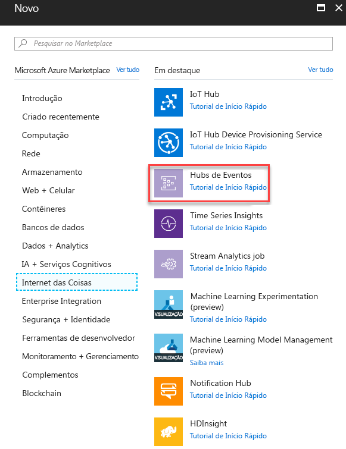

3. <span data-ttu-id="e13c0-143">Em **Criar um namespace**, insira um nome para o namespace.</span><span class="sxs-lookup"><span data-stu-id="e13c0-143">In **Create namespace**, enter a namespace name.</span></span> <span data-ttu-id="e13c0-144">Após confirmar que o nome do namespace está disponível, escolha a faixa de preço (Básico ou Padrão).</span><span class="sxs-lookup"><span data-stu-id="e13c0-144">After making sure the namespace name is available, choose the pricing tier (Basic or Standard).</span></span> <span data-ttu-id="e13c0-145">Escolha também uma assinatura do Azure, o grupo de recursos e o local no qual deseja criar o recurso.</span><span class="sxs-lookup"><span data-stu-id="e13c0-145">Also, choose an Azure subscription, resource group, and location in which to create the resource.</span></span> <span data-ttu-id="e13c0-146">Escolha **Criar** para criar o namespace.</span><span class="sxs-lookup"><span data-stu-id="e13c0-146">Choose **Create** to create the namespace.</span></span> <span data-ttu-id="e13c0-147">Pode ser preciso esperar alguns minutos para que o sistema provisione totalmente os recursos.</span><span class="sxs-lookup"><span data-stu-id="e13c0-147">You might have to wait a few minutes for the system to fully provision the resources.</span></span>

    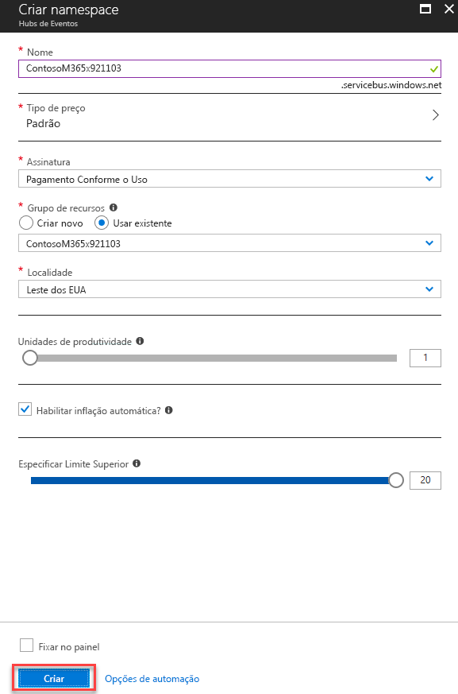

## <a name="step-2-configure-azure-monitor-to-send-security-alerts-from-your-tenant-to-the-event-hub"></a><span data-ttu-id="e13c0-149">Etapa 2: configurar o Azure Monitor para enviar alertas de segurança do locatário para o hub de eventos</span><span class="sxs-lookup"><span data-stu-id="e13c0-149">Step 2: Configure Azure Monitor to send security alerts from your tenant to the event hub</span></span>

<span data-ttu-id="e13c0-150">A habilitação do streaming dos alertas de segurança da organização pelo Azure Monitor é feita uma vez para todo o locatário do Azure Active Directory (Azure AD).</span><span class="sxs-lookup"><span data-stu-id="e13c0-150">Enabling the streaming of your organization’s security alerts through Azure Monitor is done one time for your entire Azure Active Directory (Azure AD) tenant.</span></span> <span data-ttu-id="e13c0-151">Todos os produtos licenciados e habilitados para a API de Segurança do Microsoft Graph começarão a enviar alertas de segurança ao Azure Monitor, fazendo o streaming de dados para aplicativos de consumo.</span><span class="sxs-lookup"><span data-stu-id="e13c0-151">All Microsoft Graph Security API licensed and enabled products will begin sending security alerts to Azure Monitor, streaming data to consuming applications.</span></span> <span data-ttu-id="e13c0-152">Todos os produtos adicionais habilitados para a API de Segurança do Microsoft Graph que a organização implantar e licenciar farão o streaming automático dos alertas de segurança pela mesma configuração do Azure Monitor.</span><span class="sxs-lookup"><span data-stu-id="e13c0-152">Any additional Microsoft Graph Security API-enabled products licensed and deployed by your organization will automatically stream security alerts through this same Azure Monitor configuration.</span></span> <span data-ttu-id="e13c0-153">Nenhum trabalho adicional de integração é necessário por parte da organização.</span><span class="sxs-lookup"><span data-stu-id="e13c0-153">No further integration work is needed from the organization.</span></span>

<span data-ttu-id="e13c0-154">Os alertas de segurança são dados altamente privilegiados, normalmente visíveis apenas pelas equipes de resposta de segurança e administradores globais de uma organização.</span><span class="sxs-lookup"><span data-stu-id="e13c0-154">Security alerts are highly privileged data typically viewable only by security response personnel and global administrators within an organization.</span></span> <span data-ttu-id="e13c0-155">Por esse motivo, as etapas necessárias para configurar a integração dos alertas de segurança do locatário com os sistemas SIEM exigem uma conta de Administrador Global do Azure AD.</span><span class="sxs-lookup"><span data-stu-id="e13c0-155">For this reason, the steps required to configure the integration of a tenant’s security alerts with SIEM systems require an Azure AD Global Administrator account.</span></span> <span data-ttu-id="e13c0-156">Essa conta só é necessária uma única vez, durante a instalação, para solicitação do envio dos alertas de segurança da sua organização ao Azure Monitor.</span><span class="sxs-lookup"><span data-stu-id="e13c0-156">This account is only needed one time, during setup, to request your organization’s security alerts be sent to Azure Monitor.</span></span>

> <span data-ttu-id="e13c0-157">**Observação:** neste momento, a folha de configurações do Azure Monitor Diagnostic não permite a configuração de recursos no nível do locatário.</span><span class="sxs-lookup"><span data-stu-id="e13c0-157">**Note:** Currently, the Azure Monitor Diagnostic settings blade does not support configuration of tenant-level resources.</span></span> <span data-ttu-id="e13c0-158">Os alertas da API de Segurança do Microsoft Graph são um recurso no nível do locatário, que requer o uso da API do Azure Resource Manager na configuração do Azure Monitor para dar suporte aos alertas de segurança da organização.</span><span class="sxs-lookup"><span data-stu-id="e13c0-158">Microsoft Graph Security API alerts are a tenant-level resource, which requires using the Azure Resource Manager API to configure Azure Monitor to support consumption of your organization’s security alerts.</span></span>

1. <span data-ttu-id="e13c0-159">Em sua assinatura do Azure, registre o "microsoft.insights" (Azure Monitor) como provedor dos recursos.</span><span class="sxs-lookup"><span data-stu-id="e13c0-159">In your Azure subscription, register "microsoft.insights" (Azure Monitor) as a resource provider.</span></span>  
 > <span data-ttu-id="e13c0-160">**Observação:** não registre o "Microsoft.SecurityGraph" (API de Segurança do Microsoft Graph) como um provedor de recursos em sua assinatura do Azure, pois conforme explicado acima, o "Microsoft.SecurityGraph" é um recurso de nível de locatário.</span><span class="sxs-lookup"><span data-stu-id="e13c0-160">**Note:** Do not register "Microsoft.SecurityGraph" (Microsoft Graph Security API) as a resource provider in your Azure subscription, as “Microsoft.SecurityGraph” is a tenant-level resource as explained above.</span></span> <span data-ttu-id="e13c0-161">Configuração de nível de locatário fará parte do nº 6 abaixo.</span><span class="sxs-lookup"><span data-stu-id="e13c0-161">Tenant level configuration will be part of #6 below.</span></span>

2. <span data-ttu-id="e13c0-162">Para configurar o Azure Monitor usando a API Azure Resource Manager, obtenha a ferramenta [ARMClient](https://github.com/projectkudu/ARMClient).</span><span class="sxs-lookup"><span data-stu-id="e13c0-162">To configure Azure Monitor using the Azure Resource Manager API, obtain the [ARMClient](https://github.com/projectkudu/ARMClient) tool.</span></span> <span data-ttu-id="e13c0-163">Ela será usada para enviar chamadas da API REST para o portal do Azure de uma linha de comando.</span><span class="sxs-lookup"><span data-stu-id="e13c0-163">This tool will be used to send REST API calls to the Azure portal from a command line.</span></span>

3. <span data-ttu-id="e13c0-164">Prepare um arquivo JSON de solicitação de configuração de diagnóstico como este:</span><span class="sxs-lookup"><span data-stu-id="e13c0-164">Prepare a diagnostic setting request JSON file like the following:</span></span>

    <!-- { "blockType": "ignored" } -->
    ``` json
    {
      "location": "",
      "properties": {
        "name": "securityApiAlerts",
        "serviceBusRuleId": "/subscriptions/SUBSCRIPTION_ID/resourceGroups/RESOURCE_GROUP/providers/Microsoft.EventHub/namespaces/EVENT_HUB_NAMESPACE/authorizationrules/RootManageSharedAccessKey",
        "logs": [
          {
            "category": "Alert",
            "enabled": true,
            "retentionPolicy": {
              "enabled": true,
              "days": 7
            }
          }
        ]
      }
    }
    ```

    <span data-ttu-id="e13c0-165">Substitua os valores no arquivo JSON da seguinte maneira:</span><span class="sxs-lookup"><span data-stu-id="e13c0-165">Replace the values in the JSON file as follows:</span></span>

    * <span data-ttu-id="e13c0-166">**SUBSCRIPTION_ID** é a ID de assinatura do Azure que hospeda o grupo de recursos e o namespace do hub de eventos para onde você enviará os alertas de segurança da organização.</span><span class="sxs-lookup"><span data-stu-id="e13c0-166">**SUBSCRIPTION_ID** is the Subscription ID of the Azure subscription hosting the resource group and event hub namespace where you will be sending security alerts from your organization.</span></span>
    * <span data-ttu-id="e13c0-167">**RESOURCE_GROUP** é o grupo de recursos que contém o namespace do hub de eventos para onde você enviará os alertas de segurança da organização.</span><span class="sxs-lookup"><span data-stu-id="e13c0-167">**RESOURCE_GROUP** is the resource group containing the event hub namespace where you will be sending security alerts from your organization.</span></span>
    * <span data-ttu-id="e13c0-168">**EVENT_HUB_NAMESPACE** é o namespace do Hub de Eventos para o qual você enviará os alertas de segurança da organização.</span><span class="sxs-lookup"><span data-stu-id="e13c0-168">**EVENT_HUB_NAMESPACE** is the event hub namespace where you will be sending security alerts from your organization.</span></span>
    * <span data-ttu-id="e13c0-169">**"days":** é o número de dias pelos quais você deseja manter as mensagens no Hub de evEntos.</span><span class="sxs-lookup"><span data-stu-id="e13c0-169">**“days”:** is the number of days you want to retain messages in your event hub.</span></span>


4. <span data-ttu-id="e13c0-170">Salve o arquivo como JSON no diretório onde você vai invocar o ARMClient.exe.</span><span class="sxs-lookup"><span data-stu-id="e13c0-170">Save the file as JSON to the directory where you will invoke ARMClient.exe.</span></span> <span data-ttu-id="e13c0-171">Por exemplo, chame o arquivo de **AzMonConfig.json.**</span><span class="sxs-lookup"><span data-stu-id="e13c0-171">For example, name the file **AzMonConfig.json.**</span></span>

5. <span data-ttu-id="e13c0-172">Execute o seguinte comando para entrar na ferramenta ARMClient.</span><span class="sxs-lookup"><span data-stu-id="e13c0-172">Run the following command to sigh in to the ARMClient tool.</span></span> <span data-ttu-id="e13c0-173">Você precisará usar credenciais da conta de Administrador Global.</span><span class="sxs-lookup"><span data-stu-id="e13c0-173">You will need to be using Global Administrator account credentials.</span></span>

    ``` shell
    ARMClient.exe login
    ```

6. <span data-ttu-id="e13c0-174">Execute o comando a seguir para configurar o envio de alertas de segurança pelo Azure Monitor para o namespace do hub de eventos.</span><span class="sxs-lookup"><span data-stu-id="e13c0-174">Run the following command to configure Azure Monitor to send security alerts to your event hub namespace.</span></span> <span data-ttu-id="e13c0-175">Isso provisionará automaticamente um hub de eventos no namespace e iniciará o fluxo de alertas de segurança no hub de eventos.</span><span class="sxs-lookup"><span data-stu-id="e13c0-175">This will automatically provision an event hub within the namespace and start the flow of security alerts into the event hub.</span></span> <span data-ttu-id="e13c0-176">O nome da configuração (neste exemplo, **securityApiAlerts**) deve corresponder ao nome da configuração especificado no arquivo JSON para o campo **name**.</span><span class="sxs-lookup"><span data-stu-id="e13c0-176">Ensure that the setting name (in this example, **securityApiAlerts**) matches the setting name you specified in the JSON file for the **name** field.</span></span>

    ``` shell
    ARMClient.exe put https://management.azure.com/providers/Microsoft.SecurityGraph/diagnosticSettings/securityApiAlerts?api-version=2017-04-01-preview  @".\AzMonConfig.json"
    ```

    > <span data-ttu-id="e13c0-177">**Observação: É seguro usar** a versão da API `2017-04-01-preview` para produção.</span><span class="sxs-lookup"><span data-stu-id="e13c0-177">**Note:** The API version `2017-04-01-preview` is safe to use for production.</span></span>


7. <span data-ttu-id="e13c0-178">Para verificar a aplicação correta das configurações, execute este comando e confirme que a saída corresponde às configurações do arquivo JSON.</span><span class="sxs-lookup"><span data-stu-id="e13c0-178">To verify the settings were applied correctly, run this command and verify that the output matches your JSON file settings.</span></span>

    ``` shell
    ARMClient.exe get https://management.azure.com/providers/Microsoft.SecurityGraph/diagnosticSettings/securityApiAlerts?api-version=2017-04-01-preview
    ```

8. <span data-ttu-id="e13c0-179">Saia da ferramenta ARMClient.</span><span class="sxs-lookup"><span data-stu-id="e13c0-179">Exit the ARMClient tool.</span></span> <span data-ttu-id="e13c0-180">Você concluiu a configuração do Azure Monitor para o envio de alertas de segurança do locatário para Hub de Eventos.</span><span class="sxs-lookup"><span data-stu-id="e13c0-180">You have now completed the configuration of Azure Monitor to send security alerts from your tenant to event hub.</span></span>

><span data-ttu-id="e13c0-181">**Dica:** Para desabilitar o fluxo de alerta do locatário para o Hub de eventos, exclua as configurações do Azure Monitor executando o seguinte comando `delete`.</span><span class="sxs-lookup"><span data-stu-id="e13c0-181">**Tip:** To disable alert flow from your tenant to the event hub, delete Azure Monitor settings by running the following `delete` command.</span></span>

    ``` shell
    ARMClient.exe delete https://management.azure.com/providers/Microsoft.SecurityGraph/diagnosticSettings/securityApiAlerts?api-version=2017-04-01-preview
    ```

## <a name="step-3-download-and-install-the-azure-monitor-add-on-for-splunk-which-will-allow-splunk-to-consume-security-alerts"></a><span data-ttu-id="e13c0-182">Etapa 3: baixar e instalar o complemento do Azure Monitor para o Splunk permitindo a este consumir alertas de segurança</span><span class="sxs-lookup"><span data-stu-id="e13c0-182">Step 3: Download and install the Azure Monitor Add-on for Splunk which will allow Splunk to consume security alerts</span></span>

1. <span data-ttu-id="e13c0-183">Essa integração é compatível apenas com implantações do [Splunk Enterprise](https://splunkbase.splunk.com/).</span><span class="sxs-lookup"><span data-stu-id="e13c0-183">This integration only supports [Splunk Enterprise](https://splunkbase.splunk.com/) deployments.</span></span>
2. <span data-ttu-id="e13c0-184">Baixe e instale o [complemento do Azure Monitor para o Splunk](https://github.com/Microsoft/AzureMonitorAddonForSplunk).</span><span class="sxs-lookup"><span data-stu-id="e13c0-184">Download and install the [Azure Monitor Add-on for Splunk](https://github.com/Microsoft/AzureMonitorAddonForSplunk).</span></span> <span data-ttu-id="e13c0-185">Confira instruções detalhadas em [Instalação](https://github.com/Microsoft/AzureMonitorAddonForSplunk/wiki/Installation).</span><span class="sxs-lookup"><span data-stu-id="e13c0-185">For detailed installation instructions, see [Installation](https://github.com/Microsoft/AzureMonitorAddonForSplunk/wiki/Installation).</span></span> <span data-ttu-id="e13c0-186">**Somente o complemento Azure Monitor para o Splunk versão 1.2.9 ou posterior é compatível.**</span><span class="sxs-lookup"><span data-stu-id="e13c0-186">**Only Azure Monitor Add-on for Splunk version 1.2.9 or higher is supported.**</span></span>
3. <span data-ttu-id="e13c0-187">Depois de instalar com êxito o complemento, siga as etapas de configuração descritas na [wiki de configuração do complemento Azure Monitor](https://github.com/Microsoft/AzureMonitorAddonForSplunk/wiki/Configuration-of-Splunk ) para configurar o Splunk.</span><span class="sxs-lookup"><span data-stu-id="e13c0-187">After successfully installing the Add-on, follow the configuration steps described in the [Azure Monitor add-on configuration wiki](https://github.com/Microsoft/AzureMonitorAddonForSplunk/wiki/Configuration-of-Splunk ) to configure Splunk.</span></span>
4. <span data-ttu-id="e13c0-188">Conforme indicado nas instruções de instalação, o complemento funcionará fazendo um ciclo de habilitar/desabilitar na página Gerenciar aplicativos no Splunk Web.</span><span class="sxs-lookup"><span data-stu-id="e13c0-188">As indicated in the Add-on installation instructions, the add-on will work by doing a disable/enable cycle on the Manage Apps page in Splunk Web.</span></span> <span data-ttu-id="e13c0-189">Ou reinicie o Splunk.</span><span class="sxs-lookup"><span data-stu-id="e13c0-189">Or, you can restart Splunk.</span></span>

## <a name="step-4-register-an-application-with-your-tenant-azure-active-directory-which-splunk-will-use-to-read-from-the-event-hub"></a><span data-ttu-id="e13c0-190">Etapa 4: registrar um aplicativo no Azure Active Directory do locatário que o Splunk usará para a leitura do Hub de Eventos</span><span class="sxs-lookup"><span data-stu-id="e13c0-190">Step 4: Register an application with your tenant Azure Active Directory which Splunk will use to read from the event hub</span></span>

<span data-ttu-id="e13c0-191">O Splunk precisa que as permissões necessárias e as credenciais de aplicativo necessárias para autenticar-se no Hub de Eventos do Azure Monitor sejam concedidas a um registro de aplicativo no Azure Active Directory de sua organização.</span><span class="sxs-lookup"><span data-stu-id="e13c0-191">Splunk needs an application registration in your organization’s Azure Active Directory to be granted the required permissions and app credentials required to authenticate to the Azure Monitor event hub.</span></span>

1. <span data-ttu-id="e13c0-192">No portal do Azure, acesse **Registro de aplicativo** e selecione **Novo registro de aplicativo**.</span><span class="sxs-lookup"><span data-stu-id="e13c0-192">In the Azure portal, go to **App Registrations** and select **New application registration**.</span></span>

    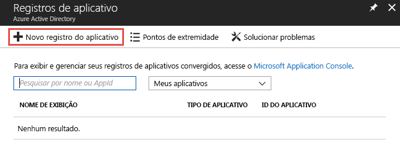

2. <span data-ttu-id="e13c0-194">Selecione um nome para o aplicativo, escolha **Web app / API** como tipo e **`https://localhost`** como URL de logon.</span><span class="sxs-lookup"><span data-stu-id="e13c0-194">Select a name for your application, choose **Web app / API** for the type, and **`https://localhost`** for the sign-on URL.</span></span> <span data-ttu-id="e13c0-195">Selecione **Criar**.</span><span class="sxs-lookup"><span data-stu-id="e13c0-195">Then select **Create**.</span></span>

    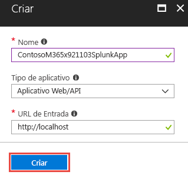

3. <span data-ttu-id="e13c0-197">Após o aplicativo ser criado, copie a **ID do aplicativo** e salve para uso posterior da configuração das entradas de dados do Splunk.</span><span class="sxs-lookup"><span data-stu-id="e13c0-197">After the application is created, copy the **Application ID** and save for later use configuring the Splunk data inputs.</span></span> <span data-ttu-id="e13c0-198">Depois, vá até as configurações do aplicativo e escolha **Chaves**.</span><span class="sxs-lookup"><span data-stu-id="e13c0-198">Then go to the application settings and choose **Keys**.</span></span>

    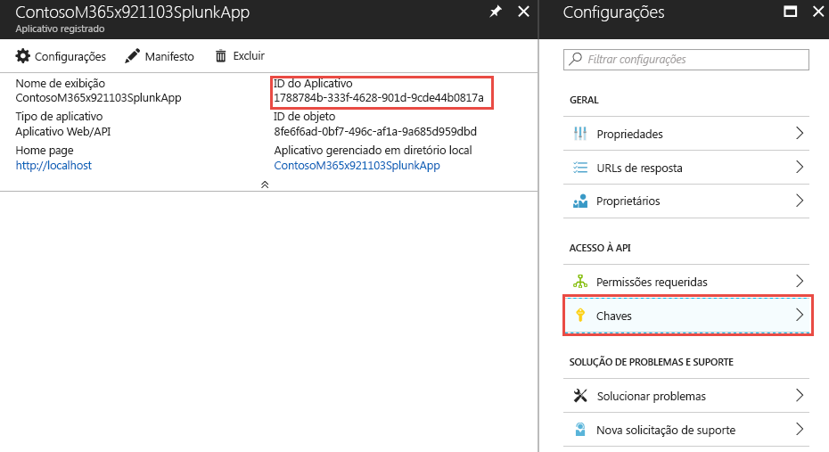

    <span data-ttu-id="e13c0-200">Isso permitirá gerar uma nova chave, conhecida como Segredo do aplicativo.</span><span class="sxs-lookup"><span data-stu-id="e13c0-200">This will allow you to generate a new key, known as an Application Secret.</span></span> <span data-ttu-id="e13c0-201">Após gerado, copie o **Segredo do aplicativo** e salve para uso posterior da configuração das entradas de dados do Splunk.</span><span class="sxs-lookup"><span data-stu-id="e13c0-201">After it's generated, copy the **Application Secret** and save for later use configuring the Splunk data inputs.</span></span>

4. <span data-ttu-id="e13c0-202">Conceda a função de **Leitor** ao aplicativo na assinatura do Azure que contém o hub de eventos com os alertas de segurança da organização.</span><span class="sxs-lookup"><span data-stu-id="e13c0-202">Grant the application the role of **Reader** in the Azure subscription containing the event hub with your organization’s security alerts.</span></span>

    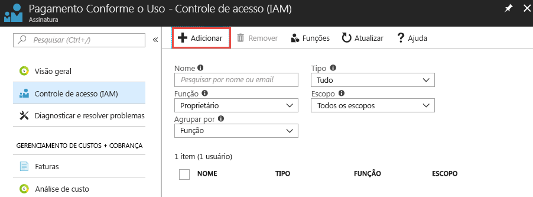

    <span data-ttu-id="e13c0-204">Selecione a assinatura, escolha **Controle de acesso (IAM)**.</span><span class="sxs-lookup"><span data-stu-id="e13c0-204">Select your subscription, choose **Access control (IAM)**.</span></span> <span data-ttu-id="e13c0-205">Selecione **Adicionar** para adicionar permissões.</span><span class="sxs-lookup"><span data-stu-id="e13c0-205">Select **Add** to add permissions.</span></span> <span data-ttu-id="e13c0-206">Selecione o aplicativo e escolha a **Função** de **Leitor** para o aplicativo.</span><span class="sxs-lookup"><span data-stu-id="e13c0-206">Select your application and choose the **Role** of **Reader** for your application.</span></span>

    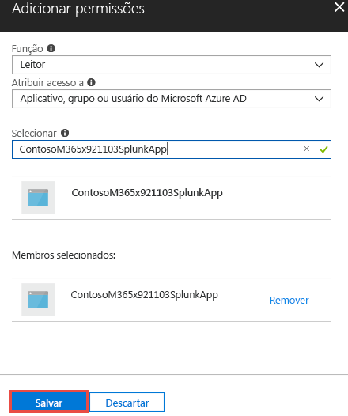

    <span data-ttu-id="e13c0-208">Selecione **Salvar** para adicionar à assinatura as permissões concedidas ao aplicativo.</span><span class="sxs-lookup"><span data-stu-id="e13c0-208">Select **Save** to add the permissions granted to your application to the subscription.</span></span>

## <a name="step-5-create-an-azure-key-vault-to-store-the-access-key-for-the-event-hub"></a><span data-ttu-id="e13c0-209">Etapa 5: criar um Azure Key Vault para armazenar a tecla de acesso do hub de eventos</span><span class="sxs-lookup"><span data-stu-id="e13c0-209">Step 5: Create an Azure Key vault to store the access key for the event hub</span></span>

<span data-ttu-id="e13c0-210">Os Azure Key Vaults são usados para armazenar segredos como identidades, senhas e certificados para uso em tempo de execução pelos aplicativos.</span><span class="sxs-lookup"><span data-stu-id="e13c0-210">Azure key vaults are used to store secrets such as identities, passwords, and certificates for use at runtime by applications.</span></span> <span data-ttu-id="e13c0-211">Nesta etapa, você criará um Azure Key Vault para armazenar os segredos necessários para que o Splunk se conecte e leia nos hubs de eventos do Azure que contêm os alertas de segurança da organização.</span><span class="sxs-lookup"><span data-stu-id="e13c0-211">In this step you will create an Azure key vault to store the secrets needed for Splunk to connect and read from the Azure event hubs containing your organization’s security alerts.</span></span>

1. <span data-ttu-id="e13c0-212">No portal do Azure, acesse **Cofres de chaves** e **Adicionar**.</span><span class="sxs-lookup"><span data-stu-id="e13c0-212">In the Azure portal, go to **Key vaults** and select **Add**.</span></span>

    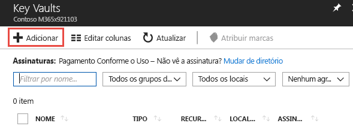

2. <span data-ttu-id="e13c0-214">Ao criar o novo cofre de chaves, selecione **Políticas de acesso** para adicionar uma nova política de acesso para o aplicativo que você acabou de registrar na Etapa 4.</span><span class="sxs-lookup"><span data-stu-id="e13c0-214">When creating the new key vault, select **Access policies** to add a new access policy for the application you just registered in Step 4.</span></span> <span data-ttu-id="e13c0-215">Conceder ao aplicativo as permissões de segredo **Get**.</span><span class="sxs-lookup"><span data-stu-id="e13c0-215">Grant the **Get** secret permissions to your application.</span></span> <span data-ttu-id="e13c0-216">Isso permitirá ao Splunk, atuando como um aplicativo registrado, acessar as chaves (segredos) armazenadas neste Azure Key Vault.</span><span class="sxs-lookup"><span data-stu-id="e13c0-216">This will allow Splunk, acting as the registered application, to access the keys (secrets) stored in this Azure key vault.</span></span>

    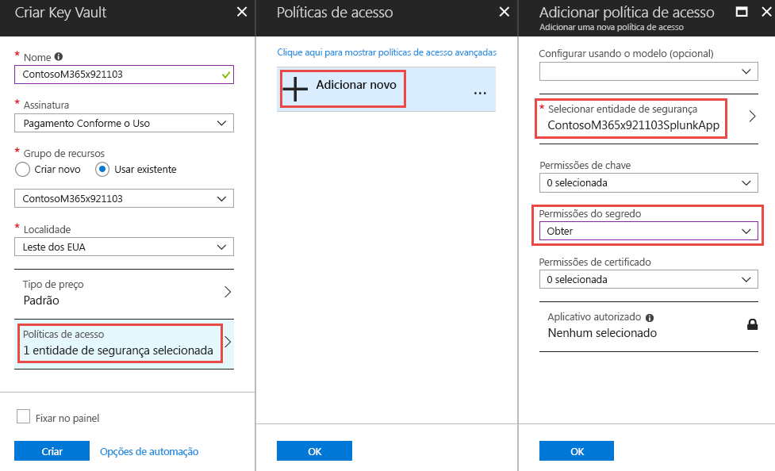

    <span data-ttu-id="e13c0-218">Selecione **Criar** para concluir a criação do novo Azure Key Vault.</span><span class="sxs-lookup"><span data-stu-id="e13c0-218">Select **Create** to complete the creation of your new Azure key vault.</span></span>

3. <span data-ttu-id="e13c0-219">Gere um novo segredo no cofre de chaves para armazenar a tecla de acesso para o namespace do hub de eventos.</span><span class="sxs-lookup"><span data-stu-id="e13c0-219">Generate a new secret in your key vault to store the access key to your event hub namespace.</span></span> <span data-ttu-id="e13c0-220">Primeiro, pegue a tecla de acesso do namespace do hub de eventos ao abri-lo e selecione **Políticas de acesso compartilhado**.</span><span class="sxs-lookup"><span data-stu-id="e13c0-220">First, grab the access key to your event hub namespace by opening your event hub namespace and selecting **Shared access policies**.</span></span> <span data-ttu-id="e13c0-221">Selecione a política **RootManageSharedAccessKey** na lista e copie a **Chave primária** da lista.</span><span class="sxs-lookup"><span data-stu-id="e13c0-221">Select the **RootManageSharedAccessKey** policy from the list and copy the **Primary Key** from the list.</span></span>

    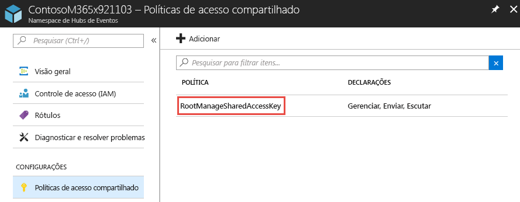

4. <span data-ttu-id="e13c0-223">Abra o cofre de chaves e selecione **Segredos**.</span><span class="sxs-lookup"><span data-stu-id="e13c0-223">Open your key vault and select **Secrets**.</span></span> <span data-ttu-id="e13c0-224">Escolha **Gerar/Importar** para adicionar um novo segredo ao cofre de chaves.</span><span class="sxs-lookup"><span data-stu-id="e13c0-224">Choose **Generate/Import** to add a new secret to the key vault.</span></span> <span data-ttu-id="e13c0-225">Cole na **Chave primária** do namespace do hub de eventos **RootManageSharedAccessKey**.</span><span class="sxs-lookup"><span data-stu-id="e13c0-225">Paste in the **Primary key** from the event hub namespace **RootManageSharedAccessKey**.</span></span>

    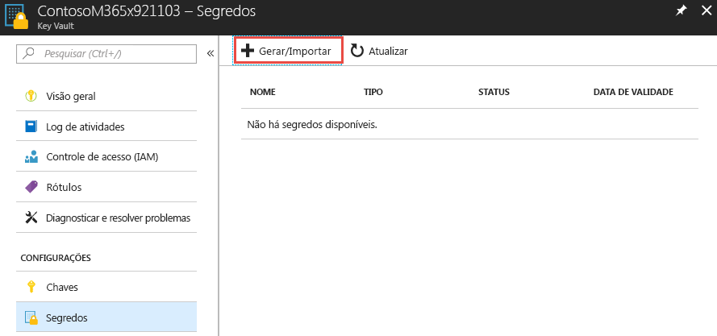

5. <span data-ttu-id="e13c0-227">Após criado, selecione o segredo e copie a **Versão do segredo** do segredo.</span><span class="sxs-lookup"><span data-stu-id="e13c0-227">After it's created, select the secret and copy the **Secret Version** of the secret.</span></span> <span data-ttu-id="e13c0-228">Isso será usado mais adiante na Etapa 6 para configurar as entradas de dados do Splunk.</span><span class="sxs-lookup"><span data-stu-id="e13c0-228">This will be used later in Step 6 to configure Splunk data inputs.</span></span>

    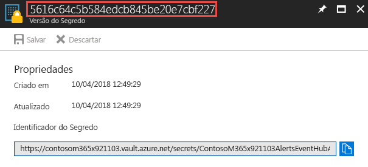

## <a name="step-6-configure-the-splunk-data-inputs-to-consume-security-alerts-stored-in-the-event-hub"></a><span data-ttu-id="e13c0-230">Etapa 6: configurar as entradas de dados do Splunk para o consumo de alertas de segurança armazenados no hub de eventos</span><span class="sxs-lookup"><span data-stu-id="e13c0-230">Step 6: Configure the Splunk data inputs to consume security alerts stored in the event hub</span></span>

<span data-ttu-id="e13c0-231">A última etapa para concluir o processo de configuração é definir as entradas de dados do Splunk para usar o hub de eventos, o aplicativo e os segredos criados nas etapas anteriores.</span><span class="sxs-lookup"><span data-stu-id="e13c0-231">The last step to complete the setup process is to configure Splunk data inputs to utilize the event hub, application, and secrets you created in previous steps.</span></span>

1. <span data-ttu-id="e13c0-232">Siga as instruções do tópico [Configuração do Splunk](https://github.com/Microsoft/AzureMonitorAddonForSplunk/wiki/Configuration-of-Splunk) para abrir e configurar as entradas de dados do Splunk para o complemento do Azure Monitor.</span><span class="sxs-lookup"><span data-stu-id="e13c0-232">Follow the instructions in the [Configuration of Splunk](https://github.com/Microsoft/AzureMonitorAddonForSplunk/wiki/Configuration-of-Splunk) topic to open and configure Splunk data inputs for the Azure Monitor Add-on.</span></span> <span data-ttu-id="e13c0-233">Vá até **Configurações** e **Entradas de dados**.</span><span class="sxs-lookup"><span data-stu-id="e13c0-233">Go to **Settings** and **Data Inputs**.</span></span> <span data-ttu-id="e13c0-234">Escolha **Logs de diagnóstico do Azure Monitor**.</span><span class="sxs-lookup"><span data-stu-id="e13c0-234">Choose **Azure Monitor Diagnostic Logs**.</span></span>
2. <span data-ttu-id="e13c0-235">Selecione **Novo** e insira todos os campos obrigatórios usando os valores obtidos nas etapas anteriores.</span><span class="sxs-lookup"><span data-stu-id="e13c0-235">Select **New** and input all the required fields using the values obtained in the previous steps.</span></span> <span data-ttu-id="e13c0-236">A imagem a seguir mostra todos os campos obrigatórios usando os valores dos exemplos anteriores deste artigo.</span><span class="sxs-lookup"><span data-stu-id="e13c0-236">The following image shows all the required fields using the values from the previous examples in this article.</span></span>

    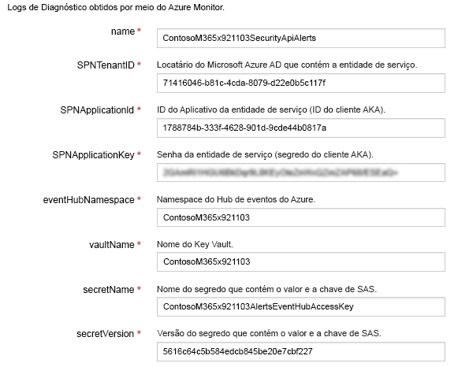

3. <span data-ttu-id="e13c0-238">Selecione **Próximo** e comece a pesquisar os alertas de segurança da sua organização recebidos do Azure Monitor.</span><span class="sxs-lookup"><span data-stu-id="e13c0-238">Select **Next** and begin searching your organization’s security alerts ingested from Azure Monitor.</span></span>

## <a name="optional-use-splunk-search-to-explore-data"></a><span data-ttu-id="e13c0-239">(Opcional) Usar a pesquisa Splunk para explorar dados</span><span class="sxs-lookup"><span data-stu-id="e13c0-239">(Optional) Use Splunk Search to explore data</span></span>

<span data-ttu-id="e13c0-240">Depois de configurar o plug-in Splunk do Azure Monitor, sua instância do Splunk começará a recuperar eventos do Hub de Eventos configurado.</span><span class="sxs-lookup"><span data-stu-id="e13c0-240">After you have set up the Azure Monitor Splunk plugin, your Splunk instance will start retrieving events from the configured event hub.</span></span> <span data-ttu-id="e13c0-241">Por padrão, o Splunk indexará cada propriedade do esquema de alerta de API de Segurança do Microsoft Graph para permitir pesquisa.</span><span class="sxs-lookup"><span data-stu-id="e13c0-241">By default, Splunk will index each property of the Microsoft Graph Security API alert schema to allow searching.</span></span>

<span data-ttu-id="e13c0-242">Para pesquisar alertas da API de Segurança do Microsoft Graph, criar painéis ou definir alertas do Splunk com sua consulta de pesquisa, navegue até aplicativos > Aplicativo de Pesquisa e Geração de Relatórios no Splunk.</span><span class="sxs-lookup"><span data-stu-id="e13c0-242">To search for Microsoft Graph Security API alerts, to create dashboards, or to set Splunk alerts with your search query, navigate to apps -> Search & Reporting app in Splunk.</span></span>

<span data-ttu-id="e13c0-243">**Exemplos**:</span><span class="sxs-lookup"><span data-stu-id="e13c0-243">**Examples**:</span></span><br/>
<span data-ttu-id="e13c0-244">Experimente pesquisar alertas de Segurança do Graph:</span><span class="sxs-lookup"><span data-stu-id="e13c0-244">Try searching Graph Security alerts:</span></span>

- <span data-ttu-id="e13c0-245">Digite `sourcetype="amdl:securitygraph:alert"` na barra de pesquisa para obter todos os alertas exibidos por meio da API de Segurança do Microsoft Graph.</span><span class="sxs-lookup"><span data-stu-id="e13c0-245">Type `sourcetype="amdl:securitygraph:alert"` in the search bar to get all alerts surfaced through the Microsoft Graph Security API.</span></span> <span data-ttu-id="e13c0-246">No lado direito, você verá as propriedades de nível superior de log do Azure Monitor em que o alerta de Segurança do Graph está sob o campo de propriedades.</span><span class="sxs-lookup"><span data-stu-id="e13c0-246">On the right-hand side, you will see the top-level properties of Azure Monitor log where Graph Security alert is under properties field.</span></span><br/>
- <span data-ttu-id="e13c0-247">No painel esquerdo, você verá campos selecionados e campos interessantes.</span><span class="sxs-lookup"><span data-stu-id="e13c0-247">On the left pane, you will see selected fields and interesting fields.</span></span> <span data-ttu-id="e13c0-248">Você pode usar campos selecionados para criar painéis ou alertas do Splunk e também pode adicionar ou remover campos selecionados clicando neles com o botão direito do mouse.</span><span class="sxs-lookup"><span data-stu-id="e13c0-248">You can use selected fields to create dashboards or Splunk alerts, you can also add or remove selected fields by right-clicking on the fields.</span></span>  
> <span data-ttu-id="e13c0-249">**Observação:** como mostrado na consulta de pesquisa a seguir, você pode restringir a pesquisa conforme necessário.</span><span class="sxs-lookup"><span data-stu-id="e13c0-249">**Note:** As shown in the following search query, you can restrict your search as needed.</span></span> <span data-ttu-id="e13c0-250">No exemplo, filtraremos os Alertas de Segurança do Graph por alertas de alta gravidade da Central de Segurança do Azure.</span><span class="sxs-lookup"><span data-stu-id="e13c0-250">In the example, we filter the Graph Security Alerts by high severity alerts from Azure Security Center.</span></span> <span data-ttu-id="e13c0-251">Também usamos `eventDatetime`, `severity`, `status` e `provider` como campos selecionados a serem exibidos.</span><span class="sxs-lookup"><span data-stu-id="e13c0-251">We also used `eventDatetime`, `severity`, `status`, and `provider` as selected fields to be displayed.</span></span> <span data-ttu-id="e13c0-252">Para termos de pesquisa mais avançados, confira [Tutoriais de pesquisa do Splunk](https://docs.splunk.com/Documentation/Splunk/7.1.2/SearchTutorial/WelcometotheSearchTutorial).</span><span class="sxs-lookup"><span data-stu-id="e13c0-252">For more advance search terms, see [Splunk search tutorials](https://docs.splunk.com/Documentation/Splunk/7.1.2/SearchTutorial/WelcometotheSearchTutorial).</span></span>

 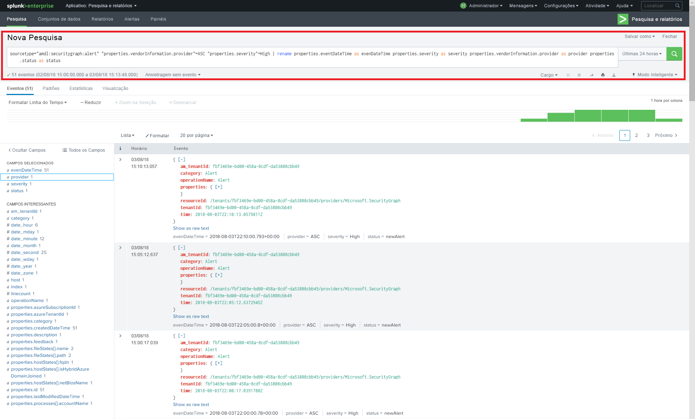
> <span data-ttu-id="e13c0-254">Consulta de pesquisa: `sourcetype="amdl:securitygraph:alert" "properties.vendorInformation.provider"=ASC "properties.severity"=High | rename properties.eventDataTime as eventDateTime properties.severity as severity properties.vendorInformation.provider as provider properties.status as status`</span><span class="sxs-lookup"><span data-stu-id="e13c0-254">Search query: `sourcetype="amdl:securitygraph:alert" "properties.vendorInformation.provider"=ASC "properties.severity"=High | rename properties.eventDataTime as eventDateTime properties.severity as severity properties.vendorInformation.provider as provider properties.status as status`</span></span>

<span data-ttu-id="e13c0-255">O Splunk também permite várias ações em resultados da pesquisa usando a opção de menu "Salvar como" na parte superior direita da tela.</span><span class="sxs-lookup"><span data-stu-id="e13c0-255">Splunk also allows multiple actions on search results using the "Save As" menu option in top right of the screen.</span></span> <span data-ttu-id="e13c0-256">Você pode criar relatórios, painéis ou alertas com base em seu filtro de pesquisa.</span><span class="sxs-lookup"><span data-stu-id="e13c0-256">You can create Reports, Dashboard Panels, or Alerts based on your search filter.</span></span>
<span data-ttu-id="e13c0-257">Abaixo está um exemplo de painel com um fluxo de evento com base na consulta anterior: você pode adicionar um link de análise detalhada para cada evento para acessar mais detalhes no site do Microsoft Graph.</span><span class="sxs-lookup"><span data-stu-id="e13c0-257">Below is an example of a dashboard with an event stream based on the previous query: You can add a drilldown link to each event to further access the details on Microsoft Graph site.</span></span> <span data-ttu-id="e13c0-258">Veja a [documentação de análise detalhada do Splunk](https://docs.splunk.com/Documentation/Splunk/7.1.2/Viz/DrilldownIntro).</span><span class="sxs-lookup"><span data-stu-id="e13c0-258">See [Splunk drilldown documentation](https://docs.splunk.com/Documentation/Splunk/7.1.2/Viz/DrilldownIntro).</span></span>

 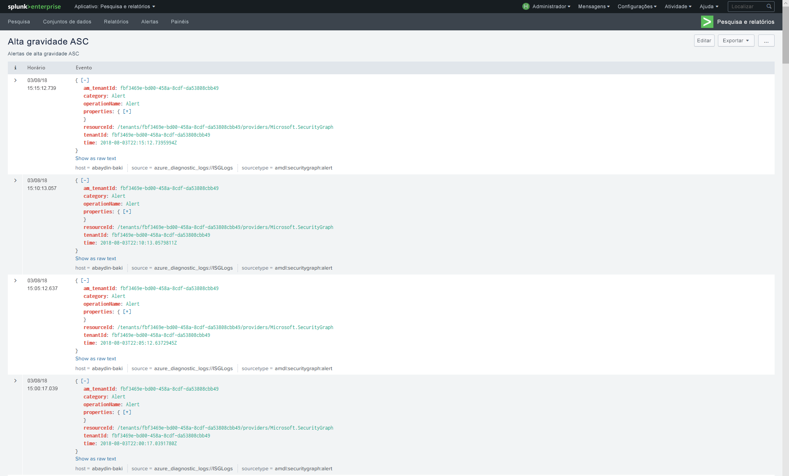

<span data-ttu-id="e13c0-260">Ou você pode criar um painel como um gráfico de linha do tempo:</span><span class="sxs-lookup"><span data-stu-id="e13c0-260">Or you can create a dashboard as a timeline chart:</span></span>

 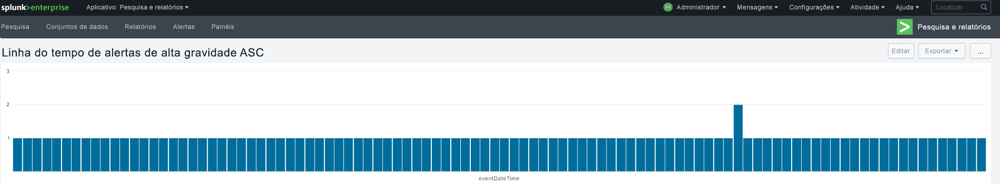

<span data-ttu-id="e13c0-262">Você pode seguir o [tutorial de pesquisa e relatório do Splunk](https://docs.splunk.com/Documentation/Splunk/7.1.2/SearchTutorial/WelcometotheSearchTutorial) para obter mais detalhes.</span><span class="sxs-lookup"><span data-stu-id="e13c0-262">You can follow [Splunk Search & Report tutorial](https://docs.splunk.com/Documentation/Splunk/7.1.2/SearchTutorial/WelcometotheSearchTutorial) for more details.</span></span>

