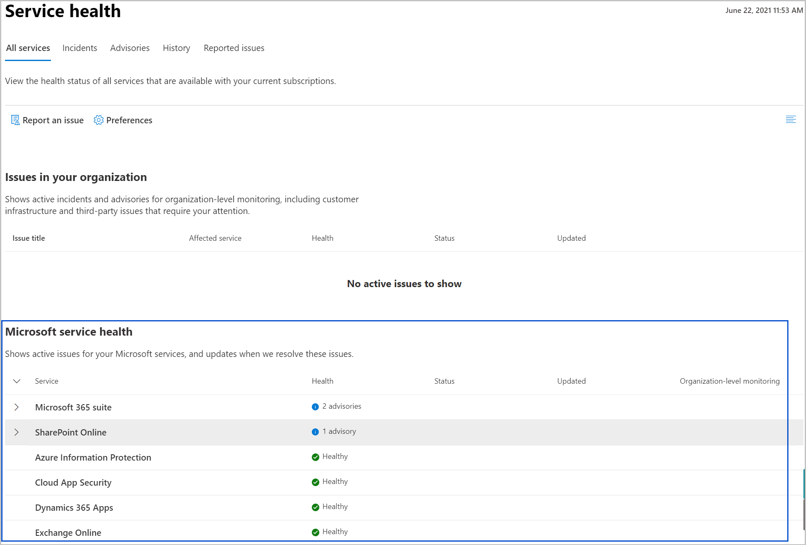

# Acessar a integridade e as comunicações do serviço no Microsoft Graph

Você pode usar a API de comunicações de serviço no Microsoft Graph para acessar o status de integridade e as postagens do centro de mensagens sobre os serviços em nuvem da Microsoft. O status de integridade real e as postagens correspondem aos serviços do Microsoft 365 e Dynamics 365 que são suportados pela API e assinados pelo locatário.

## Por que integrar com dados de comunicações e integridade do serviço?

### Obter postagens sobre a integridade do serviço e do centro de mensagens para um locatário
Os clientes podem obter dados de integridade atuais ou históricos de serviços Microsoft. Ao enfrentar problemas com um serviço da Microsoft, eles podem verificar seu status de integridade para verificar se um problema foi identificado com uma solução em andamento, antes de ligar para o suporte ou gastar tempo solucionando o problema. 

Os clientes podem revisar regularmente as postagens do centro de mensagens para acompanhar os futuros novos recursos e atualizações, e outros anúncios importantes. Eles podem então prever como essas mudanças podem afetar os usuários e planejar de acordo.

### Integre os dados de comunicações de serviço em fluxos de trabalho personalizados
Os desenvolvedores de aplicativos podem integrar problemas de integridade do serviço ativo diretamente em aplicativos personalizados, permitindo que os administradores façam a triagem e compartilhem informações de status com o público afetado.

Os aplicativos podem permitir fluxos de trabalho personalizados para que os administradores analisem, atribuam e façam a triagem das comunicações de mudança do centro de mensagens.

### Crie painéis voltados para o cliente

Crie aplicativos com painéis voltados para o cliente para mostrar a integridade dos serviços Microsoft e permitir que os clientes acompanhem as futuras alterações e outros anúncios importantes sobre os serviços.

## Exemplos de painéis no Centro de administração do Microsoft 365
Esta seção mostra exemplos no [Centro de administração do Microsoft 365](https://admin.microsoft.com/Adminportal/Home?source=applauncher#/homepage) que usa a API de comunicações do serviço para construir os respectivos painéis de integridade. Entre no centro de administração com uma conta de administrador e clique em **Integridade** para ver os seguintes painéis:
- [Integridade do Serviço](#service-health-dashboard)
- [Centro de mensagens](#message-center-dashboard)

### Painel de integridade do serviço

No painel de **Integridade do serviço**, você pode exibir a integridade de seus serviços assinados da Microsoft, que podem incluir o Office na web, Yammer, Microsoft Dynamics CRM e serviços em nuvem de gerenciamento de dispositivo móvel. Veja os exemplos demarcados na figura 1.

**Figura 1. Painel de integridade do serviço no Centro de administração do Microsoft 365**

### Painel do centro de mensagens
No painel da **Central de mensagens**, você pode exibir as alterações futuras, incluindo recursos novos e alterados, manutenção planejada e outros anúncios importantes. Veja os exemplos demarcados na figura 3.

**Figura 2. Painel central de mensagens no Centro de administração do Microsoft 365**

## Próximas etapas

- Experimente consultas de exemplos de comunicações de serviço no [Explorador do Graph](https://developer.microsoft.com/graph/graph-explorer/?request=admin%2FserviceAnnouncement%2FhealthOverviews&version=v1.0).

- Saiba mais sobre a [API de comunicações do serviço em v1.0](/graph/api/resources/service-communications-api-overview?view=graph-rest-1.0&preserve-view=true).

- Saiba mais sobre a [API de comunicações do serviço em beta](/graph/api/resources/service-communications-api-overview?view=graph-rest-beta&preserve-view=true).

