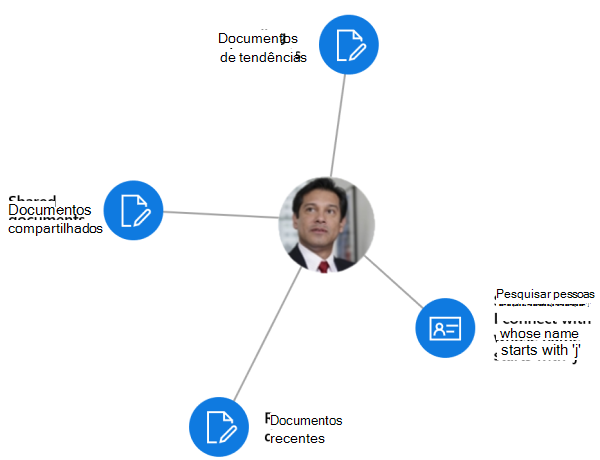
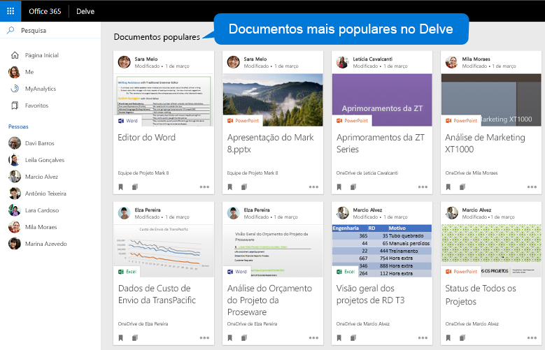
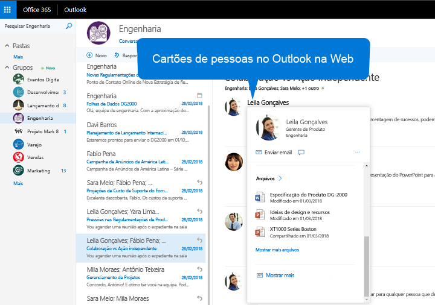

# <a name="overview-of-people-and-workplace-intelligence-in-microsoft-graph"></a>Visão geral da inteligência pessoal e de local de trabalho no Microsoft Graph

As centenas de milhões de usuários que utilizam os serviços de nuvem do Microsoft 365 fazem parte do núcleo do Microsoft Graph. Os dados dos usuários são cuidadosamente gerenciados, protegidos e, com a autorização adequada, disponibilizados pelos serviços do Microsoft Graph para promover a criatividade e a produtividade em empresas. 

A _API de perfil_ permite que você, como desenvolvedores de aplicativos, modele e represente pessoas nos serviços do Microsoft 365, e a API do cartão de perfil permite que os administradores controlem as informações exibidas nos cartões de perfil dos usuários na organização.

Mesmo os dados do usuário sendo onipresentes no Microsoft Graph, os dados derivados das interações do usuário são especialmente interessantes. Eles fornece informações inteligentes que podem responder a perguntas como:

- "Pesquisar Pessoas cujo nome comece com ‘J’"
- "Quais documentos são interessantes para essa pessoa?"

Você pode utilizar a _API de pessoas_ e a _API de insights_ no Microsoft Graph para criar aplicativos mais inteligentes que podem, respectivamente, acessar pessoas e documentos relevantes para um usuário.

A API de pessoas devolve pessoas ordenadas por relevância para um usuário, com base nos contatos do usuário, redes sociais, diretório da organização e comunicações recentes por email. Isso é particularmente útil para pessoas escolhendo cenários.

A API do Insights usa análises e avançadas e o aprendizado de máquina para fornecer os arquivos mais relevantes de que os usuários precisam ao longo de seu dia de trabalho. Essa API capacita experiências familiares do Microsoft 365, incluindo o Office Delve, a página inicial do SharePoint, o modo de exibição Descoberta do OneDrive for Business e o Outlook na Web.



## <a name="why-integrate-with-people-data"></a>Por que se integrar com dados de pessoas?

A API de Pessoas retorna dados de uma única entidade, [person](/graph/api/resources/person), que inclui dados típicos de um indivíduo no mundo de negócios de hoje. O que torna esses dados de **pessoa** especialmente úteis é sua _relevância_ em relação a um usuário do Microsoft Graph. A relevância é identificada por meio de uma pontuação para cada pessoa, que é calculada com base nos padrões de colaboração e comunicação e nas relações de negócios do usuário. Há 3 tipos principais de aplicações para esses dados de _relevância_.

### <a name="browse-people-by-relevance"></a>Procurar pessoas pela relevância

Você pode procurar pessoas que estão relacionadas ao usuário conectado ou a outro usuário na organização do usuário conectado, desde que você tenha a [autorização](people-example.md#authorization) apropriada. Você obtém um conjunto de objetos **person** ordenados pela relevância. Você pode [personalizar](people-example.md#browse-people) mais a coleção de objetos **person** retornados na resposta ao especificar os parâmetros de consulta `top`, `skip`, `orderby`, `select` e `filter`.

### <a name="fuzzy-searches-based-on-people-criteria"></a>Pesquisas difusas baseadas em critérios de pessoas

A API de Pessoas permite pesquisar por pessoas relevantes para o usuário conectado, desde que o aplicativo tenha permissões desse usuário. (Leia mais em [permissões de pessoas](permissions-reference.md#people-permissions).)

Essas pesquisas retornam resultados com base em uma correspondência exata e também em inferências sobre a intenção da pesquisa. Para ilustrar isso, o exemplo a seguir retorna objetos **person** relevantes para o usuário conectado cujo nome _ou endereço de email_ contém uma palavra que começa com "j".

<!-- { "blockType": "ignored" } -->
```http
GET /me/people/?$search=j
```

## <a name="why-integrate-with-the-profile-api-preview"></a>Por que integrar com a API do perfil (visualização)?

A API do [perfil](/graph/api/resources/profile) representa a próxima geração na modelagem e representa as pessoas nos serviços do Microsoft 365. Os dados de perfil podem ser usados em conjunto com os dados das pessoas para criar experiências personalizadas baseado no Microsoft Graph.

## <a name="why-configure-profile-cards-in-your-organization-preview"></a>Por que configurar cartões de perfil em sua organização (visualização)?

Os cartões de perfil permitem que os usuários em uma organização confiram informações sobre eles, como nomes e informações de contato. Os administradores podem usar a API de [cartão de perfil](/graph/api/resources/profilecardproperty) para personalizar a forma como as informações sobre sua organização surgem dentro das experiências das pessoas do Microsoft 365. 

## <a name="why-integrate-with-document-based-insights"></a>Por que integrar-se a informações baseadas em documentos?

### <a name="use-intelligence-to-improve-collaboration"></a>Use inteligência para melhorar a colaboração

Durante um dia de trabalho típico, usuários frequentemente interagem com grandes quantidades de informações armazenadas em muitos documentos e colaboram com outros usuários de muitas maneiras diferentes. É importante que eles sempre possam encontrar o precisam no momento certo.

Você pode usar a API do Insights, que inclui as APIs [trending](/graph/api/resources/insights-trending), [shared](/graph/api/resources/insights-shared) e [used](/graph/api/resources/insights-used) para localizar arquivos no Microsoft 365 com base no contexto e nas necessidades atuais dos seus usuários, tornando os usuários mais produtivos e melhorando a colaboração em sua organização. As organizações podem [personalizar as configurações de privacidade](insights-customize-item-insights-privacy.md) para essas informações baseadas em documentos e controlar a disponibilidade dessas informações em experiências específicas do Microsoft 365.

É fácil renderizar os resultados da API do Insights em seu aplicativo. Cada resultado acompanha um conjunto de propriedades de visualização comuns, como uma URL de imagem de visualização ou um texto de visualização.

### <a name="make-relevant-content-visible"></a>Tornar o conteúdo relevante visível

No Microsoft 365, o Delve usa informações de _tendências_ para ajudar os usuários a descobrir os documentos que são mais interessantes para eles no momento. Veja a Figura 1.

É possível usar a entidade [trending](/graph/api/resources/insights-trending) de forma programática na API do Insights para proporcionar uma experiência semelhante aos clientes do seu aplicativo. Use a entidade **trending** para se conectar aos documentos que mais relevantes para o usuário e mais populares ao seu redor. A opção [Listar documentos mais populares](/graph/api/insights-list-trending) retornará arquivos armazenados em sites de equipe do SharePoint ou no OneDrive, classificados por relevância, com os mais importantes primeiro. 

**Figura 1. Delve no Microsoft 365 mostrando documentos populares para um usuário**



### <a name="allow-users-to-collaborate-and-get-back-to-work"></a>Permitir que os usuários colaborem e voltem ao trabalho

Os novos cartões de pessoas do Microsoft 365 utilizam as informações _used_ e _shared_ para conectar os dados entre pessoas e informações. O cartão de pessoas identifica e exibe documentos relevantes sobre uma pessoa. Os usuários podem ver cartões de pessoas em todo o pacote Office, por exemplo, no Outlook na Web. Veja a Figura 2.

A API do Insights fornece uma com uma funcionalidade semelhante às entidades [used](/graph/api/resources/insights-used) e [shared](/graph/api/resources/insights-shared) entidades. Elas retornam o que um usuário tem visualizado e trabalhado mais recentemente, ou o que colegas compartilharam com o usuário mais recentemente no Microsoft 365.

**Figura 2. Outlook na Web, mostrando um cartão de pessoas para um usuário**



## <a name="why-integrate-with-myanalytics-preview"></a>Por que integrar o MyAnalytics (visualização)?

[O myAnalytics](/workplace-analytics/myanalytics/index) fornece uma visão geral de como e com quem as pessoas passam o tempo. Esses dados podem ajudar as pessoas a planejar o dia, obter informações sobre seus diferentes padrões de trabalho e ajudar a equilibrar o trabalho e a vida.

A API de análises permite a sincronização ou a integração de dados de análise do usuário com um aplicativo de terceiros personalizado para oferecer suporte a uma ampla variedade de cenários que podem ajudar a melhorar a produtividade e a colaboração do usuário. Por exemplo, você poderia integrar dados do myAnalytics com atividades de dispositivos móveis para ajudar os usuários a acompanhar todas as atividades de trabalho e social e planejar o seu dia dentro de um aplicativo.
 
## <a name="api-reference"></a>Referência da API

Procurando a referência de API para estes serviços?

- [Usar a API do Microsoft Graph para integrar a inteligência de pessoas e de local de trabalho em um aplicativo](/graph/api/resources/social-overview)
- O recurso [pessoa](/graph/api/resources/person) da API Pessoas
- Recurso [Perfil (visualização)](/graph/api/resources/profile)
- Recurso [Propriedade do cartão de perfil (visualização)](/graph/api/resources/profilecardproperty) 
- [API do informações](/graph/api/resources/officegraphinsights)
- [API de análise (visualização)](/graph/api/resources/useranalytics)

## <a name="next-steps"></a>Próximas etapas

* Use o [Graph Explorer](https://developer.microsoft.com/graph/graph-explorer) para experimentar as APIs de pessoas, Insights e análises com seus próprios arquivos. Entre, expanda **Pessoas** ou **Insights** na coluna à esquerda e experimente suas consultas de exemplos.
* Encontre mais informações sobre a [API pessoas](people-example.md).
* Veja como [personalizar o cartão de perfil](add-properties-profilecard.md).
* Saiba mais sobre [insights de itens](item-insights-overview.md), [personalização da privacidade dos insights de itens para usuários (visualização)](insights-customize-item-insights-privacy.md) e [API de configurações de insights de itens (visualização)](/graph/api/resources/iteminsightssettings?view=graph-rest-beta&preserve-view=true) que oferece suporte à personalização.
* Saiba mais sobre a [API de análise](/graph/api/resources/social-overview?view=graph-rest-beta&preserve-view=true#help-users-balance-work-and-life).
* Saiba mais sobre a [API de perfil](/graph/api/resources/profile?view=graph-rest-beta&preserve-view=true).
