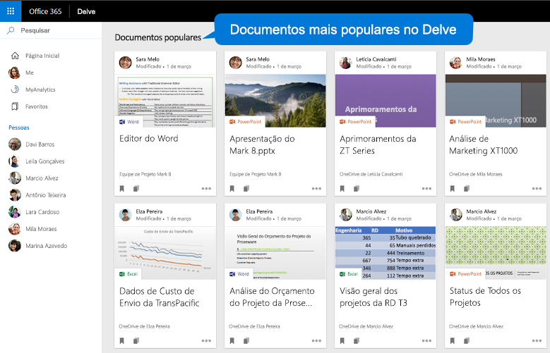

# <a name="overview-of-social-intelligence-and-analytics-in-microsoft-graph"></a><span data-ttu-id="c6ff2-101">Visão geral de inteligência social e análises no Microsoft Graph</span><span class="sxs-lookup"><span data-stu-id="c6ff2-101">Overview of social intelligence and analytics in Microsoft Graph</span></span>

<span data-ttu-id="c6ff2-102">As centenas de milhões de usuários que utilizam os serviços de nuvem do Microsoft 365 fazem parte do núcleo do Microsoft Graph.</span><span class="sxs-lookup"><span data-stu-id="c6ff2-102">The hundreds of millions of users of Microsoft 365 cloud services form part of the core of Microsoft Graph.</span></span> <span data-ttu-id="c6ff2-103">Os dados dos usuários são cuidadosamente gerenciados, protegidos e, com a autorização adequada, disponibilizados pelos serviços do Microsoft Graph para promover a criatividade e a produtividade em empresas.</span><span class="sxs-lookup"><span data-stu-id="c6ff2-103">The users' data is carefully managed, protected, and with proper authorization, made available by Microsoft Graph services to drive productivity and creativity in businesses.</span></span> <span data-ttu-id="c6ff2-104">Mesmo os dados do usuário sendo onipresentes no Microsoft Graph, os dados derivados das interações do usuário são especialmente interessantes.</span><span class="sxs-lookup"><span data-stu-id="c6ff2-104">As ubiquitous the user's data is in Microsoft Graph, data derived from the user's social interactions is particularly interesting.</span></span> <span data-ttu-id="c6ff2-105">Eles fornece informações inteligentes que podem responder a perguntas como:</span><span class="sxs-lookup"><span data-stu-id="c6ff2-105">It provides intelligent insights that can answer questions such as the following:</span></span>

- <span data-ttu-id="c6ff2-106">"Quem esse usuário deve contatar para obter informações sobre esse tópico?"</span><span class="sxs-lookup"><span data-stu-id="c6ff2-106">"Who should this user contact for information on this topic?"</span></span>
- <span data-ttu-id="c6ff2-107">"Quais documentos são interessantes para essa pessoa?"</span><span class="sxs-lookup"><span data-stu-id="c6ff2-107">"Which documents are most interesting to this person?"</span></span>

<span data-ttu-id="c6ff2-108">Você pode usar a API de Pessoas e a API do Insights no Microsoft Graph para criar aplicativos mais inteligentes que podem, respectivamente, acessar as pessoas e os documentos relevantes para um usuário.</span><span class="sxs-lookup"><span data-stu-id="c6ff2-108">You can use the people API and insights API in Microsoft Graph to build smarter apps that can, respectively, access the relevant people and documents for a user.</span></span>

<span data-ttu-id="c6ff2-109">A API de Pessoas retorna as pessoas por ordem de relevância para um usuário com base nos contatos do usuário, em suas redes sociais, seu diretório organizacional e suas comunicações recentes por email e Skype.</span><span class="sxs-lookup"><span data-stu-id="c6ff2-109">The people API returns people ordered by relevance to a user, based on that user's contacts, social networks, organization directory, and recent communications on email and Skype.</span></span> <span data-ttu-id="c6ff2-110">Isso é particularmente útil para cenários de seleção de pessoas.</span><span class="sxs-lookup"><span data-stu-id="c6ff2-110">This is particularly useful for people-picking scenarios.</span></span>

<span data-ttu-id="c6ff2-111">A API do Insights usa análises e avançadas e o aprendizado de máquina para fornecer os arquivos mais relevantes de que os usuários precisam ao longo de seu dia de trabalho.</span><span class="sxs-lookup"><span data-stu-id="c6ff2-111">The insights API uses advanced analytics and machine learning to provide the most relevant files users need throughout their work day.</span></span> <span data-ttu-id="c6ff2-112">Essa API capacita experiências familiares do Office 365, incluindo o Office Delve, a página inicial do SharePoint, o modo de exibição Descoberta do OneDrive for Business e o Outlook na Web.</span><span class="sxs-lookup"><span data-stu-id="c6ff2-112">The API powers familiar Office 365 experiences, including Office Delve, SharePoint Home, the Discover view in OneDrive for Business, and Outlook on the web.</span></span>


## <a name="why-integrate-with-people-data"></a><span data-ttu-id="c6ff2-114">Por que se integrar com dados de pessoas?</span><span class="sxs-lookup"><span data-stu-id="c6ff2-114">Why integrate with people data?</span></span>

<span data-ttu-id="c6ff2-115">A API de Pessoas retorna dados de uma única entidade, [person](../api-reference/v1.0/resources/person.md), que inclui dados típicos de um indivíduo no mundo de negócios de hoje.</span><span class="sxs-lookup"><span data-stu-id="c6ff2-115">The people API returns data of a single entity, [person](../api-reference/v1.0/resources/person.md), which includes typical data of an individual in today's business world.</span></span> <span data-ttu-id="c6ff2-116">O que torna esses dados de **pessoa** especialmente úteis é sua _relevância_ em relação a um usuário do Microsoft Graph.</span><span class="sxs-lookup"><span data-stu-id="c6ff2-116">What makes this **person** data especially useful is its _relevance_ with respect to a Microsoft Graph user.</span></span> <span data-ttu-id="c6ff2-117">A relevância é identificada por meio de uma pontuação para cada pessoa, que é calculada com base nos padrões de colaboração e comunicação e nas relações de negócios do usuário.</span><span class="sxs-lookup"><span data-stu-id="c6ff2-117">Relevance is noted in a relevance score of each person, calculated based on the user's communication and collaboration patterns and business relationships.</span></span> <span data-ttu-id="c6ff2-118">Há 3 tipos principais de aplicações para esses dados de _relevância_.</span><span class="sxs-lookup"><span data-stu-id="c6ff2-118">There are 3 main types of application of this _relevance_ data.</span></span>

### <a name="browse-people-by-relevance"></a><span data-ttu-id="c6ff2-119">Procurar pessoas pela relevância</span><span class="sxs-lookup"><span data-stu-id="c6ff2-119">Browse people by relevance</span></span>

<span data-ttu-id="c6ff2-120">Você pode procurar pessoas que estão relacionadas ao usuário conectado ou a outro usuário na organização do usuário conectado, desde que você tenha a [autorização](people_example.md#authorization) apropriada.</span><span class="sxs-lookup"><span data-stu-id="c6ff2-120">You can browse people who are related to the signed-in user or to some other user in the signed-in user's organization, provided you have got the appropriate [authorization](people_example.md#authorization).</span></span> <span data-ttu-id="c6ff2-121">Você obtém um conjunto de objetos **person** ordenados pela relevância.</span><span class="sxs-lookup"><span data-stu-id="c6ff2-121">You get a collection of **person** objects that are ordered by relevance.</span></span> <span data-ttu-id="c6ff2-122">Você pode [personalizar](people_example.md#browse-people) mais a coleção de objetos **person** retornados na resposta ao especificar os parâmetros de consulta `top`, `skip`, `orderby`, `select` e `filter`.</span><span class="sxs-lookup"><span data-stu-id="c6ff2-122">You can further [customize](people_example.md#browse-people) the collection of **person** objects that is returned in the response by specifying the query parameters `top`, `skip`, `orderby`, `select`, and `filter`.</span></span>

### <a name="fuzzy-searches-based-on-people-criteria"></a><span data-ttu-id="c6ff2-123">Pesquisas difusas baseadas em critérios de pessoas</span><span class="sxs-lookup"><span data-stu-id="c6ff2-123">Fuzzy searches based on people criteria</span></span>

<span data-ttu-id="c6ff2-124">A API de Pessoas permite pesquisar por pessoas relevantes para o usuário conectado, desde que o aplicativo tenha permissões desse usuário.</span><span class="sxs-lookup"><span data-stu-id="c6ff2-124">The people API lets you search for people relevant to the signed-in user, provided that your app has got permissions by that user.</span></span> <span data-ttu-id="c6ff2-125">(Leia mais em [permissões de pessoas](permissions_reference.md#people-permissions).)</span><span class="sxs-lookup"><span data-stu-id="c6ff2-125">(Read more on [people permissions](permissions_reference.md#people-permissions).)</span></span>

<span data-ttu-id="c6ff2-126">Essas pesquisas retornam resultados com base em uma correspondência exata e também em inferências sobre a intenção da pesquisa.</span><span class="sxs-lookup"><span data-stu-id="c6ff2-126">They will return results based on an exact match and also on inferences about the intent of the search.</span></span> <span data-ttu-id="c6ff2-127">Para ilustrar isso, o exemplo a seguir retorna objetos **person** relevantes para o usuário conectado cujo nome _ou endereço de email_ contém uma palavra que começa com "j".</span><span class="sxs-lookup"><span data-stu-id="c6ff2-127">To illustrate this, the following example returns **person** objects relevant to the signed-in user whose name, _or email address_, contains a word that starts with 'j'.</span></span>

<!-- { "blockType": "ignored" } -->
```http
GET /me/people/?$search=j
```

### <a name="fuzzy-searches-based-on-topic-criteria"></a><span data-ttu-id="c6ff2-128">Pesquisas baseadas em critérios de tópico</span><span class="sxs-lookup"><span data-stu-id="c6ff2-128">Fuzzy searches based on topic criteria</span></span>

<span data-ttu-id="c6ff2-129">A API de Pessoas também permite que você realize pesquisas por pessoas relevantes para o usuário conectado e que tenham manifestado interesse em se comunicar com esse usuário sobre determinados tópicos.</span><span class="sxs-lookup"><span data-stu-id="c6ff2-129">You can also perform searches for people who are relevant to the signed-in user and have expressed an interest in communicating with that user over topics such as pizzas in the following example:</span></span> <span data-ttu-id="c6ff2-130">Os tópicos são apenas palavras que os usuários usaram com mais frequência nas conversas de email.</span><span class="sxs-lookup"><span data-stu-id="c6ff2-130">Topics in this context are just words that have been used most by users in email conversations.</span></span> <span data-ttu-id="c6ff2-131">A Microsoft extrai essas palavras, sem qualquer contexto, e cria um índice para esses dados para facilitar pesquisas difusas.</span><span class="sxs-lookup"><span data-stu-id="c6ff2-131">Microsoft extracts such words and creates an index for this data to facilitate fuzzy searches.</span></span>

<span data-ttu-id="c6ff2-132">O exemplo a seguir ilustra inferências sobre a finalidade de uma pesquisa sobre o tópico "beetle":</span><span class="sxs-lookup"><span data-stu-id="c6ff2-132">The following example illustrates inferences about the intent of a search on the topic "beetle":</span></span>

<!-- { "blockType": "ignored" } -->
```http
GET /me/people/?$search="topic:beetle" 
```

<span data-ttu-id="c6ff2-133">Uma pesquisa difusa no índice de dados de tópico retorna instâncias que significam o nome em inglês do inseto besouro, o icônico carro Beetle da Volkswagen, a banda Beatles e outras definições.</span><span class="sxs-lookup"><span data-stu-id="c6ff2-133">A fuzzy search in the topic data index return instances that mean the beetle insect, the iconic Volkswagen Beetle car, the Beatles band, and other definitions.</span></span>


## <a name="why-integrate-with-document-based-insights-preview"></a><span data-ttu-id="c6ff2-134">Por que se integrar com informações baseadas em documentos (visualização)?</span><span class="sxs-lookup"><span data-stu-id="c6ff2-134">Why integrate with document-based insights (preview)?</span></span>

### <a name="use-intelligence-to-improve-collaboration"></a><span data-ttu-id="c6ff2-135">Use inteligência para melhorar a colaboração</span><span class="sxs-lookup"><span data-stu-id="c6ff2-135">Use intelligence to improve collaboration</span></span>

<span data-ttu-id="c6ff2-136">Durante um dia de trabalho típico, usuários frequentemente interagem com grandes quantidades de informações armazenadas em muitos documentos e colaboram com outros usuários de muitas maneiras diferentes.</span><span class="sxs-lookup"><span data-stu-id="c6ff2-136">During a typical work day, users often interact with large amounts of information stored across many documents and collaborate with other users in many different ways.</span></span> <span data-ttu-id="c6ff2-137">É importante que eles sempre possam encontrar o precisam no momento certo.</span><span class="sxs-lookup"><span data-stu-id="c6ff2-137">It's important that they can always can find what they need, when they need it.</span></span>

<span data-ttu-id="c6ff2-138">Você pode usar a API do Insights, que inclui as APIs [trending](../api-reference/beta/resources/insights_trending.md), [shared](../api-reference/beta/resources/insights_shared.md) e [used](../api-reference/beta/resources/insights_used.md) para localizar arquivos no Office 365 com base no contexto e nas necessidades atuais dos seus usuários, tornando os usuários mais produtivos e melhorando a colaboração em sua organização.</span><span class="sxs-lookup"><span data-stu-id="c6ff2-138">You can use the insights API, which includes the [trending](../api-reference/beta/resources/insights_trending.md), [shared](../api-reference/beta/resources/insights_shared.md), and [used](../api-reference/beta/resources/insights_used.md) APIs, to surface files from across Office 365 based on your users' current context and needs, making users more productive and improving collaboration in your organization.</span></span>

<span data-ttu-id="c6ff2-139">É fácil renderizar os resultados da API do Insights em seu aplicativo.</span><span class="sxs-lookup"><span data-stu-id="c6ff2-139">It is easy to render the results from the insights API in your app.</span></span> <span data-ttu-id="c6ff2-140">Cada resultado acompanha um conjunto de propriedades de visualização comuns, como uma URL de imagem de visualização ou um texto de visualização.</span><span class="sxs-lookup"><span data-stu-id="c6ff2-140">Every result comes with a set of common visualization properties, like a preview image URL or preview text.</span></span>

### <a name="make-relevant-content-visible"></a><span data-ttu-id="c6ff2-141">Tornar o conteúdo relevante visível</span><span class="sxs-lookup"><span data-stu-id="c6ff2-141">Make relevant content visible</span></span>

<span data-ttu-id="c6ff2-142">No Office 365, o Delve usa informações de _tendências_ para ajudar os usuários a descobrir os documentos que são mais interessantes para eles no momento.</span><span class="sxs-lookup"><span data-stu-id="c6ff2-142">In Office 365, Delve uses the _trending_ insight to help users discover the documents that are most interesting to them right now.</span></span> <span data-ttu-id="c6ff2-143">Veja a Figura 1.</span><span class="sxs-lookup"><span data-stu-id="c6ff2-143">See figure 1.</span></span>

<span data-ttu-id="c6ff2-144">É possível usar a entidade [trending](../api-reference/beta/resources/insights_trending.md) de forma programática na API do Insights para proporcionar uma experiência semelhante aos clientes do seu aplicativo.</span><span class="sxs-lookup"><span data-stu-id="c6ff2-144">Programmatically, you can use the [trending](../api-reference/beta/resources/insights_trending.md) entity in the insights API to provide your app customers a similar experience.</span></span> <span data-ttu-id="c6ff2-145">Use a entidade **trending** para se conectar aos documentos que mais relevantes para o usuário e mais populares ao seu redor.</span><span class="sxs-lookup"><span data-stu-id="c6ff2-145">Use the **trending** entity to connect to documents that are trending around and relevant to the user.</span></span> <span data-ttu-id="c6ff2-146">A opção [Listar documentos mais populares](../api-reference/beta/api/insights_list_trending.md) retornará arquivos armazenados em sites de equipe do SharePoint ou no OneDrive, classificados por relevância, com os mais importantes primeiro.</span><span class="sxs-lookup"><span data-stu-id="c6ff2-146">[Listing trending documents](../api-reference/beta/api/insights_list_trending.md) returns those files stored on OneDrive or SharePoint team sites, sorted by relevance with the most important ones first.</span></span> 

<span data-ttu-id="c6ff2-147">**Figura 1. Delve no Office 365 mostrando documentos populares para um usuário**</span><span class="sxs-lookup"><span data-stu-id="c6ff2-147">**Figure 1. Delve in Office 365 showing popular documents for a user**</span></span>



### <a name="allow-users-to-collaborate-and-get-back-to-work"></a><span data-ttu-id="c6ff2-149">Permitir que os usuários colaborem e voltem ao trabalho</span><span class="sxs-lookup"><span data-stu-id="c6ff2-149">Allow users to collaborate and get back to work</span></span>

<span data-ttu-id="c6ff2-150">Os novos cartões de pessoas do Office 365 utilizam as informações _used_ e _shared_ para conectar os dados entre pessoas e informações.</span><span class="sxs-lookup"><span data-stu-id="c6ff2-150">The new Office 365 people cards tap into the _used_ and _shared_ insights to connect the dots between people and units of knowledge.</span></span> <span data-ttu-id="c6ff2-151">O cartão de pessoas identifica e exibe documentos relevantes sobre uma pessoa.</span><span class="sxs-lookup"><span data-stu-id="c6ff2-151">The people card identifies and displays relevant documents about a person.</span></span> <span data-ttu-id="c6ff2-152">Os usuários podem ver cartões de pessoas em todo o pacote Office, por exemplo, no Outlook na Web.</span><span class="sxs-lookup"><span data-stu-id="c6ff2-152">Users can see people cards across the suite, for example, in Outlook on the web.</span></span> <span data-ttu-id="c6ff2-153">Veja a Figura 2.</span><span class="sxs-lookup"><span data-stu-id="c6ff2-153">See figure 2.</span></span>

<span data-ttu-id="c6ff2-154">A API do Insights fornece uma com uma funcionalidade semelhante às entidades [used](../api-reference/beta/resources/insights_used.md) e [shared](../api-reference/beta/resources/insights_shared.md) entidades.</span><span class="sxs-lookup"><span data-stu-id="c6ff2-154">The insights API provides a similar functionality with the [used](../api-reference/beta/resources/insights_used.md) and [shared](../api-reference/beta/resources/insights_shared.md) entities.</span></span> <span data-ttu-id="c6ff2-155">Elas retornam o que um usuário tem visualizado e trabalhado mais recentemente, ou o que colegas compartilharam com o usuário mais recentemente no Office 365.</span><span class="sxs-lookup"><span data-stu-id="c6ff2-155">They return what a user has been viewing or working on most recently, or what colleagues have shared with the user most recently in Office 365.</span></span>

<span data-ttu-id="c6ff2-156">**Figura 2. Outlook na Web, mostrando um cartão de pessoas para um usuário**</span><span class="sxs-lookup"><span data-stu-id="c6ff2-156">**Figure 2. Outlook on the web showing a people card for a user**</span></span>


## <a name="next-steps"></a><span data-ttu-id="c6ff2-158">Próximas etapas</span><span class="sxs-lookup"><span data-stu-id="c6ff2-158">Next steps</span></span>

* <span data-ttu-id="c6ff2-159">Use o [Graph Explorer](https://developer.microsoft.com/pt-BR/graph/graph-explorer) para experimentar as APIs de Pessoas e do Insights com seus próprios arquivos.</span><span class="sxs-lookup"><span data-stu-id="c6ff2-159">Use the [Microsoft Graph Explorer](https://developer.microsoft.com/pt-BR/graph/graph-explorer) to try out the OneNote APIs with your own OneNote notebooks.</span></span> <span data-ttu-id="c6ff2-160">Entre e escolha **Mostrar mais exemplos** na coluna à esquerda.</span><span class="sxs-lookup"><span data-stu-id="c6ff2-160">Sign in, and choose **Show more samples** in the column on the left.</span></span> <span data-ttu-id="c6ff2-161">Use o menu para habilitar **Pessoas** e **Insights (beta)**.</span><span class="sxs-lookup"><span data-stu-id="c6ff2-161">Use the menu to turn on **People** and **Insights (beta)**.</span></span>
* <span data-ttu-id="c6ff2-162">Saiba mais sobre a [API de Pessoas](people_example.md) e a entidade [person](../api-reference/v1.0/resources/person.md).</span><span class="sxs-lookup"><span data-stu-id="c6ff2-162">Find more about the [people API](people_example.md) and the [person](../api-reference/v1.0/resources/person.md) entity.</span></span>
* <span data-ttu-id="c6ff2-163">Para começar a usar a API do Insights, consulte [Usar a API do Insights](../api-reference/beta/resources/insights.md).</span><span class="sxs-lookup"><span data-stu-id="c6ff2-163">To get started with insights API, see [Use the insights API](../api-reference/beta/resources/insights.md).</span></span>
