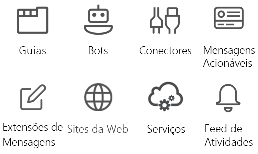

# Visão geral da API de equipes da Microsoft (versão prévia)Microsoft Teams teamwork API overview

O Microsoft Teams é o melhor hub para trabalhos em equipe e comunicações inteligentes.Microsoft Teams is the ultimate hub for teamwork and intelligent communications. Criado com base na força e na escala do Office 365, que conta com mais de 120 milhões de usuários, o Microsoft Teams oferece recursos de colaboração, reuniões, chamadas e voz empresarial baseados em bate-papo.Built on the strength and scale of Office 365 with over 120 million users, Microsoft Teams delivers chat-based collaboration, meetings, calling, and enterprise voice features.

## Por que integrar-se com o Microsoft Teams?Why integrate with Microsoft Teams?

A integração com o Microsoft Teams facilita a criação de seus próprios serviços e aplicativos, atingindo milhões de usuários corporativos e ajudando as pessoas a trabalhar em conjunto.Integrating with Microsoft Teams makes it easy for you to build your own services and apps, reaching millions of enterprise users and helping people get work done together. Você pode usar o Microsoft Graph para criar e gerenciar equipes, canais, mensagens e muito mais.You can use Microsoft Graph to create and manage teams, channels, messages, and more.

### Use o Microsoft Graph em qualquer tipo de aplicativoUse Microsoft Graph in any kind of app

Os aplicativos do Microsoft Teams criados no Microsoft Graph oferecem aos grupos de trabalho uma nova ferramenta para tornar a colaboração mais produtiva e atraente.Microsoft Teams apps built on Microsoft Graph give work groups a new tool to make collaboration a more productive and compelling experience. Com o Microsoft Teams, os usuários do grupo de trabalho compartilham recursos, interagem pelo bate-papo e agendam eventos no calendário da equipe.Using Microsoft Teams, work group users share assets, interact through chat, and schedule events on the team calendar. Aumente o valor do Microsoft Teams adicionando automação de equipe, canal e conversas usando aplicativos baseados na API do Microsoft Teams.Enhance the value of Microsoft Teams by adding team, channel, and conversation automation via apps based on the Microsoft Teams API.

Os sites, serviços e aplicativos de plataformas nativas não são executados na experiência do usuário do Microsoft Teams, mas podem ser usados para chamar as APIs do Microsoft Teams que habilitam os cenários de automação do Microsoft Teams.Websites, services, and native platform applications are not run within the Microsoft Teams user experience but can be used to call the Microsoft Teams APIs that enable Microsoft Teams automation scenarios.

**Tipos de aplicativos habilitados para o Microsoft Teams****Types of apps enabled for Microsoft Teams**

Essas ferramentas de colaboração incluem guias habilitadas para o Microsoft Graph ou aplicativos de bot executados no Microsoft Teams.These collaboration tools include Microsoft Graph-enabled tab or bot apps running inside Microsoft Teams. Você também pode chamar o Microsoft Graph fora de um aplicativo do Microsoft Teams, como de um site ou de serviço Web.You can also call Microsoft Graph outside of a Microsoft Teams app, such as from a website or a web service. Se já tiver habilitado seu site para o Microsoft Graph, você poderá usar esse trabalho para o Microsoft Teams utilizando a [plataforma de desenvolvedor do Microsoft Teams](https://docs.microsoft.com/en-us/microsoftteams/platform/#pivot=home&panel=home-all) para criar um aplicativo de guias que usa o código de site existente.If you've already enabled your website for Microsoft Graph, you can use that work for Microsoft Teams by using the [Microsoft Teams developer platform](https://docs.microsoft.com/en-us/microsoftteams/platform/#pivot=home&panel=home-all) to create a tab app that uses the existing website code.

Se um aplicativo de bot ou uma guia do Microsoft Teams não for a maneira ideal de concluir seu cenário, escolha um dos seguintes tipos de aplicativos.If a Microsoft Teams tab or bot app is not the ideal way to complete your scenario, choose one of the following app types.

|Tipo de aplicativoApp type|Descrição do cenárioScenario description|
|:-------|:-------------------|
|GuiasTabs|Exiba conteúdo aprimorado no Microsoft Teams.Surface enhanced content within Microsoft Teams.|
|ConectoresConnectors|Poste atualizações aprimoradas nos canais.Post enhanced updates to channels.|
|Mensagens acionáveisActionable messaging|Adicione interação aprimorada aos cartões do conector.Add enhanced interaction to your connector cards.|
|SitesWebsites|Exiba conteúdo aprimorado em suas páginas da Web.Surface enhanced content in your web pages.|
|BotsBots|Ajude os usuários a concluir tarefas em conversas.Help users get tasks done in conversations.|
|Feed de atividadesActivity feed|Envolva os usuários por meio de notificações do feed.Engage users via feed notifications.|
|Extensões de mensagensMessaging extensions|Permita que os usuários consultem e compartilhem cartões aprimorados em conversas.Allow users to query and share enhanced cards in conversations.|
|ServiçosServices|Aprimore seus aplicativos cliente com dados do Microsoft Graph por meio do seu serviço Web.Enhance your client applications with Microsoft Graph data via your web service.|

### Criar várias equipes e canaisCreate multiple teams and channels

Permita que seus clientes criem novas [equipes](../api-reference/beta/resources/team.md) e [canais](../api-reference/beta/resources/channel.md) vinculados ao seu aplicativo.Allow your customers to create new [teams](../api-reference/beta/resources/team.md) and [channels](../api-reference/beta/resources/channel.md) linked to your app. Facilite a criação de um grande número de equipes e o preenchimento delas com usuários e canais usando a API do Microsoft Teams.Make creating large numbers of teams and populating them with users and channels easy by using the Microsoft Teams API.

### Automatizar o ciclo de vida da equipeAutomate team lifecycles

Use o Microsoft Graph para criar uma nova equipe virtual quando surgir um novo problema de negócios, [preencha a equipe](../api-reference/v1.0/api/group_post_members.md) com as pessoas certas e configure canais para a equipe.Use Microsoft Graph to create a new virtual team when a new business issue arises, [populate the team](../api-reference/v1.0/api/group_post_members.md) with the right people, and configure the team with channels. Para iniciar uma discussão no canal da equipe sobre o novo problema de negócios, você pode propagar o canal com um novo tópico de conversa para postar uma mensagem de boas-vindas aos novos membros da equipe.To start a team channel discussion around the new business issue, you can seed the channel with a new conversation thread to post a welcome message to new team members. Se quiser reunir a nova equipe para discutir o problema de negócios, adicione um novo evento à agenda da equipe e convide os membros da equipe para o evento.If you want to get the new team together to discuss the business issue, add a new event to the team calendar and then invite the members of the team to the event.

Quando o problema de negócios for resolvido e você já não precisar da equipe virtual, use a API do Microsoft Teams para desfazer a equipe.When the business issue is resolved and you no longer need the virtual team, use the Microsoft Teams API to tear down the team. Se, ao criar a equipe virtual, você souber qual será sua duração máxima, defina uma [política de expiração de grupo do Office 365](https://support.office.com/en-us/article/office-365-group-expiration-policy-8d253fe5-0e09-4b3c-8b5e-f48def064733?ui=en-US&rs=en-US&ad=US) para a equipe que removerá automaticamente a equipe de acordo com o que foi definido na política.If you know the maximum duration of the virtual team when you create it, set an [Office 365 group expiration policy](https://support.office.com/en-us/article/office-365-group-expiration-policy-8d253fe5-0e09-4b3c-8b5e-f48def064733?ui=en-US&rs=en-US&ad=US) for the team that automatically removes the team according to the policy.

## Próximas etapasNext steps

- Saiba como [usar a API do Microsoft Teams](../api-reference/beta/resources/teams_api_overview.md).Learn how to [use the Microsoft Teams API](../api-reference/beta/resources/teams_api_overview.md).
- Analise em detalhes os métodos, propriedades e relações dos recursos de [equipe](../api-reference/beta/resources/team.md), [canal](../api-reference/beta/resources/channel.md) e [grupo](../api-reference/v1.0/resources/group.md).Drill down on the methods, properties, and relationships of the [team](../api-reference/beta/resources/team.md), [channel](../api-reference/beta/resources/channel.md), and [group](../api-reference/v1.0/resources/group.md) resources.
- Experimente a API no [Explorador do Graph](https://developer.microsoft.com/en-us/graph/graph-explorer).Try the API in the [Graph Explorer](https://developer.microsoft.com/en-us/graph/graph-explorer).
- Leia mais sobre o [modelo de programação do Microsoft Teams](https://docs.microsoft.com/en-us/microsoftteams/platform/concepts/concepts-overview).Read more about the [Microsoft Teams programming model](https://docs.microsoft.com/en-us/microsoftteams/platform/concepts/concepts-overview).
- Comece a trabalhar com um [código de exemplo](https://github.com/OfficeDev/microsoft-teams-sample-graph).Get a jump-start with [sample code](https://github.com/OfficeDev/microsoft-teams-sample-graph).
