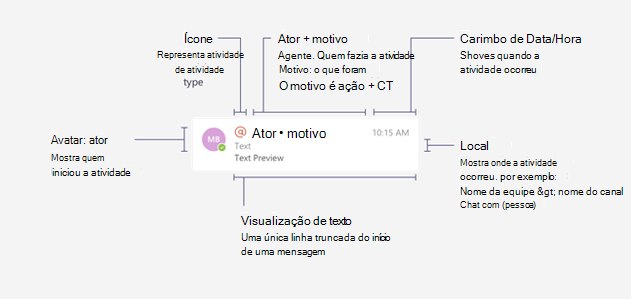
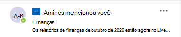
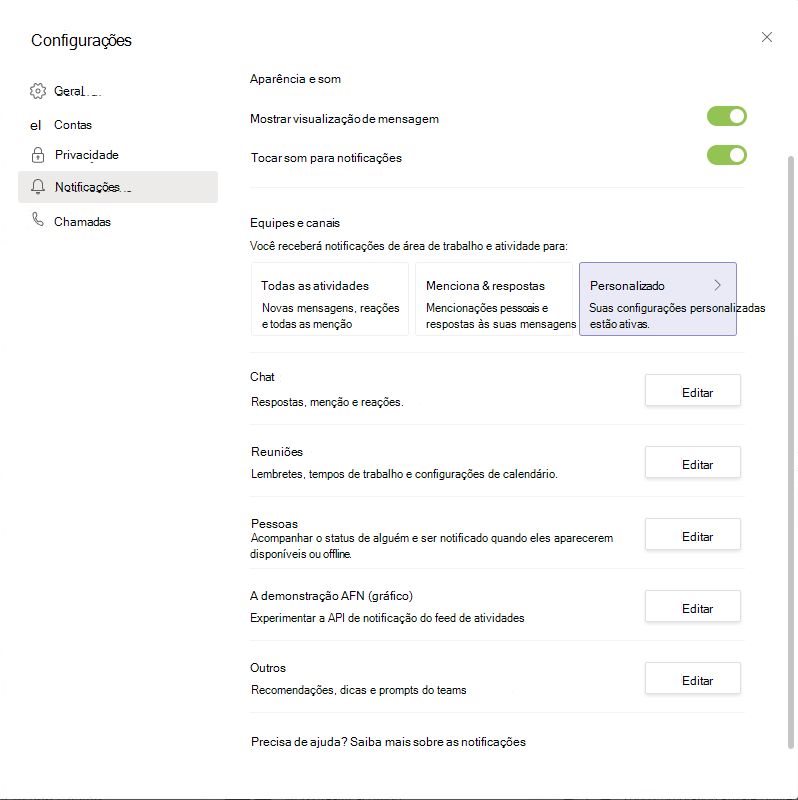
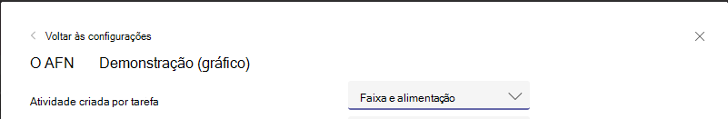

# <a name="send-activity-feed-notifications-to-users-in-microsoft-teams"></a>Enviar notificações de feed de atividade para usuários em Microsoft Teams

O Microsoft Teams de atividade permite que os usuários triagem itens que exigem atenção notificando-os sobre as alterações. Você pode usar as APIs de notificação de feed de atividade no Microsoft Graph estender essa funcionalidade para seus aplicativos. Isso permite que seus aplicativos forneçam experiências mais ricas e envolvam melhor os usuários, ajudando a mantê-los atualizados com as alterações nas ferramentas e fluxos de trabalho que usam.

## <a name="understanding-the-basics-of-activity-feed-notification"></a>Noções básicas da notificação de feed de atividade

As notificações de feed de atividade Microsoft Teams são compostas por vários bits de informações, exibidos juntos, conforme mostrado na imagem a seguir.



Os componentes incluem:
- O ator que iniciou a atividade
- Um ícone que representa o tipo de atividade
- O motivo pelo qual o ator fez a atividade
- Uma visualização de texto
- Um carimbo de data/hora
- O local da atividade

O exemplo a seguir mostra como esses componentes juntos fornecem os detalhes sobre uma notificação. Este exemplo é uma notificação sobre um usuário mencionado em uma Yammer comunidade.



## <a name="requirements-for-using-the-activity-feed-notification-apis"></a>Requisitos para usar as APIs de notificação de feed de atividade

As APIs de feed de atividade funcionam com [um Teams app](/microsoftteams/platform/overview). Veja a seguir os requisitos para o envio de notificações de feed de atividade:

- O Teams de aplicativo deve ter a ID do aplicativo do Azure AD adicionada à `webApplicationInfo` seção. Para obter detalhes, consulte [esquema de manifesto](/microsoftteams/platform/resources/schema/manifest-schema).
- Os tipos de atividade devem ser declarados na `activities` seção. Para obter detalhes, consulte [esquema de manifesto](/microsoftteams/platform/resources/schema/manifest-schema).
- O Teams aplicativo deve ser instalado para o destinatário, pessoalmente ou em uma [equipe](/graph/api/resources/team?preserve-view=true) ou [chat](/graph/api/resources/chat?preserve-view=true) de que eles fazem parte. Para obter mais informações, [consulte Teams instalação do aplicativo](/graph/api/resources/teamsappinstallation?preserve-view=true).

### <a name="teams-app-manifest-changes"></a>Teams de manifesto do aplicativo

Esta seção descreve as alterações que precisam ser adicionadas ao manifesto Teams aplicativo. Observe que você deve estar usando a versão Teams [de manifesto](/microsoftteams/platform/resources/schema/manifest-schema) do aplicativo `1.7` ou superior.

```json
"$schema": "https://developer.microsoft.com/json-schemas/teams/v1.7/MicrosoftTeams.schema.json",
"manifestVersion": "1.7",
````

#### <a name="webapplicationinfo-section-changes"></a>Alterações na seção webApplicationInfo

```json
"webApplicationInfo":
{
    "id": "a3111f15-658e-457c-9689-fd20fe907330",
    "resource": "https://contosoapp.com"
}
```

|Parâmetro|Tipo|Descrição|
|:---|:---|:---|
|id|string|ID do aplicativo do Azure AD (ID do cliente).|
|recurso|string|Recurso associado ao aplicativo do Azure AD. Também conhecido como URL de resposta ou redirecionamento no Portal do Azure.|

> **Observação:** Você pode obter um erro se vários Teams aplicativos no mesmo escopo (equipe, chat ou usuário) estão usando o mesmo aplicativo do Azure AD. Certifique-se de que você esteja usando aplicativos exclusivos do Azure AD.

#### <a name="activities-section-changes"></a>alterações na seção de atividades

```json
"activities":
{
  "activityTypes": [
    {
      "type": "taskCreated",
      "description": "Task Created Activity",
      "templateText": "{actor} created task {taskId} for you"
    },
    {
      "type": "approvalRequired",
      "description": "Deployment requires your approval",
      "templateText": "{actor} created a new deployment {deploymentId}"
    }
  ]
}
```

|Parâmetro|Tipo|Descrição|
|:---|:---|:---|
|type|string|Tipo de atividade. Isso precisa ser exclusivo em um manifesto específico.|
|description|string|Descrição curta acessível por humanos. Isso ficará visível no cliente Microsoft Teams cliente.|
|templateText|string|Texto do modelo para a notificação de atividade. Você pode declarar seus parâmetros encapsulando parâmetros em `{}` .|

>**Observação:** `actor` é um parâmetro especial que sempre leva o nome do chamador. Em chamadas delegadas, `actor` é o nome do usuário. Em chamadas somente de aplicativo, ele leva o nome do aplicativo Teams aplicativo.

### <a name="installing-the-teams-app"></a>Instalando o Teams app

Teams aplicativos podem ser instalados em uma equipe, um chat ou para um usuário pessoalmente e podem ser distribuídos de várias maneiras. Para obter detalhes, [consulte Teams métodos de distribuição de aplicativos](/microsoftteams/platform/concepts/deploy-and-publish/overview). Normalmente, [o sideload é](/microsoftteams/platform/concepts/deploy-and-publish/apps-upload) preferencial para fins de desenvolvimento. Após o desenvolvimento, você pode escolher o método de distribuição certo com base em se deseja distribuir para um locatário ou para todos os locatários.

Você também pode usar Teams apIs de [instalação de aplicativos](/graph/api/resources/teamsappinstallation?preserve-view=true) para gerenciar Teams de aplicativos.

## <a name="sending-activity-feed-notifications-to-users"></a>Enviando notificações de feed de atividade aos usuários

Como um Teams pode ser instalado para um usuário, em uma equipe ou em um chat, as notificações também podem ser enviadas nesses três contextos:

- [Enviar notificação ao usuário em um chat](/graph/api/chat-sendactivitynotification)
- [Enviar notificação ao usuário em uma equipe](/graph/api/team-sendactivitynotification)
- [Enviar notificação ao usuário](/graph/api/userteamwork-sendactivitynotification)

Para obter detalhes sobre quais tópicos são suportados para cada cenário, consulte as APIs específicas. Os tópicos personalizados baseados em texto são suportados para todos os cenários.

### <a name="example-1-notify-a-user-about-a-task-created-in-a-chat"></a>Exemplo 1: Notificar um usuário sobre uma tarefa criada em um chat

Este exemplo mostra como você pode enviar uma notificação de feed de atividade para uma nova tarefa criada em um chat. Nesse caso, o Teams aplicativo deve ser instalado em um chat com a ID e o usuário também `chatId` deve fazer parte do `569363e2-4e49-4661-87f2-16f245c5d66a` chat.

#### <a name="request"></a>Solicitação
<!-- {
  "blockType": "request",
  "name": "chat_sendactivitynotification"
}
-->
``` http
POST https://graph.microsoft.com/beta/chats/{chatId}/sendActivityNotification
Content-Type: application/json

{
    "topic": {
        "source": "entityUrl",
        "value": "https://graph.microsoft.com/beta/chats/{chatId}"
    },
    "activityType": "taskCreated",
    "previewText": {
        "content": "New Task Created"
    },
    "recipient": {
        "@odata.type": "microsoft.graph.aadUserNotificationRecipient",
        "userId": "569363e2-4e49-4661-87f2-16f245c5d66a"
    },
    "templateParameters": [
        {
            "name": "taskId",
            "value": "12322"
        }
    ]
}
```

#### <a name="response"></a>Resposta
<!-- {
  "blockType": "response",
  "truncated": false
}
-->
``` http
HTTP/1.1 204 No Content
```

### <a name="example-2-notify-a-user-about-a-task-created-in-a-team"></a>Exemplo 2: Notificar um usuário sobre uma tarefa criada em uma equipe

Este exemplo mostra como você pode enviar uma notificação de feed de atividade para uma equipe. Este exemplo notifica o proprietário da equipe sobre uma nova tarefa criada que exige sua atenção.

#### <a name="request"></a>Solicitação
<!-- {
  "blockType": "request",
  "name": "team_sendactivitynotification"
}
-->
``` http
POST https://graph.microsoft.com/beta/teams/{teamId}/sendActivityNotification
Content-Type: application/json

{
    "topic": {
        "source": "entityUrl",
        "value": "https://graph.microsoft.com/beta/teams/{teamId}"
    },
    "activityType": "taskCreated",
    "previewText": {
        "content": "New Task Created"
    },
    "recipient": {
        "@odata.type": "microsoft.graph.aadUserNotificationRecipient",
        "userId": "569363e2-4e49-4661-87f2-16f245c5d66a"
    },
    "templateParameters": [
        {
            "name": "taskId",
            "value": "12322"
        }
    ]
}
```

#### <a name="response"></a>Resposta
<!-- {
  "blockType": "response",
  "truncated": false
}
-->
``` http
HTTP/1.1 204 No Content
```

### <a name="example-3-notify-a-user-about-an-event-using-a-custom-topic"></a>Exemplo 3: Notificar um usuário sobre um evento usando um tópico personalizado

Como visto nos exemplos anteriores, você pode vincular a diferentes aspectos de uma equipe ou de um chat. No entanto, se você deseja vincular a um aspecto que não faz parte da equipe ou não é representado pela Microsoft Graph, ou se quiser personalizar o nome, você pode definir a origem do para e passar um valor personalizado para `topic` `text` ele. Além disso, `webUrl` é necessário quando você usa a fonte como `topic` `text` .

O Yammer de notificação mostrado anteriormente usa um tópico personalizado porque os recursos Yammer não são suportados pela Microsoft Graph.

> **Observação:** `webUrl` deve começar com o domínio Microsoft Teams (teams.microsoft.com por exemplo).

#### <a name="request"></a>Solicitação
<!-- {
  "blockType": "request",
  "name": "team_sendactivitynotification"
}
-->
``` http
POST https://graph.microsoft.com/beta/teams/{teamId}/sendActivityNotification
Content-Type: application/json

{
    "topic": {
        "source": "text",
        "value": "Deployment Approvals Channel",
        "webUrl": "https://teams.microsoft.com/l/message/19:448cfd2ac2a7490a9084a9ed14cttr78c@thread.skype/1605223780000?tenantId=c8b1bf45-3834-4ecf-971a-b4c755ee677d&groupId=d4c2a937-f097-435a-bc91-5c1683ca7245&parentMessageId=1605223771864&teamName=Approvals&channelName=Azure%20DevOps&createdTime=1605223780000"
    },
    "activityType": "approvalRequired",
    "previewText": {
        "content": "New deployment requires your approval"
    },
    "recipient": {
        "@odata.type": "Microsoft.Teams.GraphSvc.aadUserNotificationRecipient",
        "userId": "569363e2-4e49-4661-87f2-16f245c5d66a"
    },
    "templateParameters": [
        {
            "name": "deploymentId",
            "value": "6788662"
        }
    ]
}
```

#### <a name="response"></a>Resposta
<!-- {
  "blockType": "response",
  "truncated": false
}
-->
``` http
HTTP/1.1 204 No Content
```

## <a name="customizing-how-the-notifications-alert-you"></a>Personalização de como as notificações alertam você

Microsoft Teams os usuários podem personalizar as notificações que veem em seus feeds, como um banner e assim por diante. As notificações geradas por apIs de feed de atividade também podem ser personalizadas. Os usuários podem escolher como eles são notificados por meio de configurações Microsoft Teams. Teams aplicativos aparecerão na lista para o usuário escolher, conforme mostrado na captura de tela a seguir.



Os usuários podem clicar **em Editar** ao lado de um aplicativo e personalizar as notificações, conforme mostrado no exemplo a seguir. O `description` campo no manifesto Teams aplicativo é exibido.



## <a name="faqs"></a>Perguntas Frequentes

### <a name="who-needs-to-install-the-teams-app"></a>Who precisa instalar o aplicativo Teams?

O usuário de destino deve ter o aplicativo Teams que está enviando notificações instaladas.

### <a name="can-a-user-send-notifications-to-themselves"></a>Um usuário pode enviar notificações para si mesmo?

Não, um usuário não pode enviar notificações para si mesmo. Para esse cenário, use permissões de aplicativo.

### <a name="can-a-teams-app-control-how-the-notifications-are-shown-to-the-user"></a>Um aplicativo Teams controle como as notificações são mostradas ao usuário?

Não, somente os usuários podem alterar as configurações de notificação.

### <a name="i-installed-my-app-why-dont-i-see-notification-settings-under-the-user-account"></a>Instalei meu aplicativo, por que não vejo configurações de notificação na conta do usuário?

As configurações serão exibidas depois que a primeira notificação for enviada pelo Teams app. Isso reduz o número de configurações que os usuários veem.

### <a name="i-started-getting-a-409-conflict-error-how-do-i-resolve-it"></a>Eu comecei a receber um erro 409 (conflito), como faço para resolvê-lo?

`Conflict`os erros ocorrem principalmente quando vários aplicativos Teams instalados no mesmo escopo (equipe, chat, usuário e assim por diante) têm a mesma appId do Azure AD na seção do `webApplicationInfo` manifesto. Quando isso acontecer, você receberá um erro como `Found multiple applications with the same Azure AD App ID 'Your AzureAD AppId'.` . Certifique-se de usar aplicativos exclusivos do Azure AD para aplicativos Teams exclusivos. Observe que você pode ter o mesmo aplicativo Teams instalado em vários escopos (equipe + usuário, por exemplo).

## <a name="see-also"></a>Confira também

[Práticas recomendadas para o uso Microsoft Teams de feed de atividade.](activity-feed-notifications-best-practices.md)
