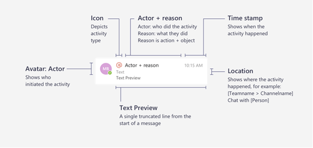
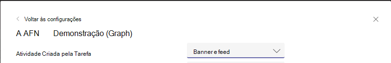

# <a name="send-activity-feed-notifications-to-users-in-microsoft-teams"></a><span data-ttu-id="718da-103">Enviar notificações de feed de atividades para usuários no Microsoft Teams</span><span class="sxs-lookup"><span data-stu-id="718da-103">Send activity feed notifications to users in Microsoft Teams</span></span>

<span data-ttu-id="718da-104">O feed de atividades do Microsoft Teams permite que os usuários façam a triagem de itens que exigem atenção ao notificá-los das alterações.</span><span class="sxs-lookup"><span data-stu-id="718da-104">The Microsoft Teams activity feed enables users to triage items that require attention by notifying them of changes.</span></span> <span data-ttu-id="718da-105">Você pode usar as APIs de notificação do feed de atividades no Microsoft Graph para estender essa funcionalidade para seus aplicativos.</span><span class="sxs-lookup"><span data-stu-id="718da-105">You can use the activity feed notification APIs in Microsoft Graph to extend this functionality to your apps.</span></span> <span data-ttu-id="718da-106">Isso permite que seus aplicativos ofereçam experiências mais ricas e envolvam melhor os usuários, ajudando a mantê-los atualizados com as ferramentas e os fluxos de trabalho usados.</span><span class="sxs-lookup"><span data-stu-id="718da-106">This allows your apps to provide richer experiences and better engage users by helping to keep them up to date with changes in the tools and workflows they use.</span></span>

## <a name="understanding-the-basics-of-activity-feed-notification"></a><span data-ttu-id="718da-107">Noções básicas sobre a notificação do feed de atividades</span><span class="sxs-lookup"><span data-stu-id="718da-107">Understanding the basics of activity feed notification</span></span>

<span data-ttu-id="718da-108">As notificações do feed de atividades no Microsoft Teams são compostas por vários bits de informações, exibidas juntas, conforme mostrado na imagem a seguir.</span><span class="sxs-lookup"><span data-stu-id="718da-108">Activity feed notifications in Microsoft Teams are comprised of multiple bits of information, displayed together, as shown in the following image.</span></span>



<span data-ttu-id="718da-110">Os componentes incluem:</span><span class="sxs-lookup"><span data-stu-id="718da-110">The components include:</span></span>
- <span data-ttu-id="718da-111">O ator que iniciou a atividade</span><span class="sxs-lookup"><span data-stu-id="718da-111">The actor who initiated the activity</span></span>
- <span data-ttu-id="718da-112">Um ícone que representa o tipo de atividade</span><span class="sxs-lookup"><span data-stu-id="718da-112">An icon that represents the activity type</span></span>
- <span data-ttu-id="718da-113">O motivo pelo qual o ator fazia a atividade</span><span class="sxs-lookup"><span data-stu-id="718da-113">The reason the actor did the activity</span></span>
- <span data-ttu-id="718da-114">Uma visualização de texto</span><span class="sxs-lookup"><span data-stu-id="718da-114">A text preview</span></span>
- <span data-ttu-id="718da-115">Um carimbo de data/hora</span><span class="sxs-lookup"><span data-stu-id="718da-115">A time stamp</span></span>
- <span data-ttu-id="718da-116">O local da atividade</span><span class="sxs-lookup"><span data-stu-id="718da-116">The location of the activity</span></span>

<span data-ttu-id="718da-117">O exemplo a seguir mostra como esses componentes fornecem os detalhes sobre uma notificação.</span><span class="sxs-lookup"><span data-stu-id="718da-117">The following example shows how these components together provide the details about a notification.</span></span> <span data-ttu-id="718da-118">Este exemplo é uma notificação sobre um usuário mencionado em uma comunidade do Yammer.</span><span class="sxs-lookup"><span data-stu-id="718da-118">This example is a notification about a user mentioned in a Yammer community.</span></span>


## <a name="requirements-for-using-the-activity-feed-notification-apis"></a><span data-ttu-id="718da-120">Requisitos para o uso das APIs de notificação do feed de atividades</span><span class="sxs-lookup"><span data-stu-id="718da-120">Requirements for using the activity feed notification APIs</span></span>

<span data-ttu-id="718da-121">As APIs de feed de atividades trabalham com um [aplicativo do teams](/microsoftteams/platform/overview).</span><span class="sxs-lookup"><span data-stu-id="718da-121">Activity feed APIs work with a [Teams app](/microsoftteams/platform/overview).</span></span> <span data-ttu-id="718da-122">Estes são os requisitos para o envio de notificações de feed de atividades:</span><span class="sxs-lookup"><span data-stu-id="718da-122">The following are the requirements for sending activity feed notifications:</span></span>

- <span data-ttu-id="718da-123">O manifesto do aplicativo Teams deve ter a ID de aplicativo do Azure AD adicionada à `webApplicationInfo` seção.</span><span class="sxs-lookup"><span data-stu-id="718da-123">The Teams app manifest must have the Azure AD app ID added to the `webApplicationInfo` section.</span></span> <span data-ttu-id="718da-124">Para obter detalhes, consulte [esquema de manifesto](/microsoftteams/platform/resources/schema/manifest-schema).</span><span class="sxs-lookup"><span data-stu-id="718da-124">For details, see [manifest schema](/microsoftteams/platform/resources/schema/manifest-schema).</span></span>
- <span data-ttu-id="718da-125">Os tipos de atividade devem ser declarados na `activities` seção.</span><span class="sxs-lookup"><span data-stu-id="718da-125">Activity types must be declared in the `activities` section.</span></span> <span data-ttu-id="718da-126">Para obter detalhes, consulte [esquema de manifesto](/microsoftteams/platform/resources/schema/manifest-schema).</span><span class="sxs-lookup"><span data-stu-id="718da-126">For details, see [manifest schema](/microsoftteams/platform/resources/schema/manifest-schema).</span></span>
- <span data-ttu-id="718da-127">O aplicativo Teams deve estar instalado para o destinatário, pessoalmente ou em uma [equipe](/graph/api/resources/team?preserve-view=true) ou em um [chat](/graph/api/resources/chat?preserve-view=true) do qual fazem parte.</span><span class="sxs-lookup"><span data-stu-id="718da-127">The Teams app must be installed for the recipient, either personally, or in a [team](/graph/api/resources/team?preserve-view=true) or [chat](/graph/api/resources/chat?preserve-view=true) they are part of.</span></span> <span data-ttu-id="718da-128">Para obter mais informações, consulte [Team app Installation](/graph/api/resources/teamsappinstallation?preserve-view=true).</span><span class="sxs-lookup"><span data-stu-id="718da-128">For more information, see [Teams app installation](/graph/api/resources/teamsappinstallation?preserve-view=true).</span></span>

### <a name="teams-app-manifest-changes"></a><span data-ttu-id="718da-129">Alterações de manifesto do aplicativo do teams</span><span class="sxs-lookup"><span data-stu-id="718da-129">Teams app manifest changes</span></span>

<span data-ttu-id="718da-130">Esta seção descreve as alterações que precisam ser adicionadas ao manifesto do teams app.</span><span class="sxs-lookup"><span data-stu-id="718da-130">This section describes the changes that need to be added to Teams app manifest.</span></span> <span data-ttu-id="718da-131">Observe que você deve estar usando a versão de [manifesto do aplicativo Teams](/microsoftteams/platform/resources/schema/manifest-schema) `1.7` ou superior.</span><span class="sxs-lookup"><span data-stu-id="718da-131">Note that you must be using the [Teams app manifest](/microsoftteams/platform/resources/schema/manifest-schema) version `1.7` or greater.</span></span>

```json
"$schema": "https://developer.microsoft.com/json-schemas/teams/v1.7/MicrosoftTeams.schema.json",
"manifestVersion": "1.7",
````

#### <a name="webapplicationinfo-section-changes"></a><span data-ttu-id="718da-132">alterações da seção webApplicationInfo</span><span class="sxs-lookup"><span data-stu-id="718da-132">webApplicationInfo section changes</span></span>

```json
"webApplicationInfo":
{
    "id": "a3111f15-658e-457c-9689-fd20fe907330",
    "resource": "https://contosoapp.com"
}
```

|<span data-ttu-id="718da-133">Parâmetro</span><span class="sxs-lookup"><span data-stu-id="718da-133">Parameter</span></span>|<span data-ttu-id="718da-134">Tipo</span><span class="sxs-lookup"><span data-stu-id="718da-134">Type</span></span>|<span data-ttu-id="718da-135">Descrição</span><span class="sxs-lookup"><span data-stu-id="718da-135">Description</span></span>|
|:---|:---|:---|
|<span data-ttu-id="718da-136">id</span><span class="sxs-lookup"><span data-stu-id="718da-136">id</span></span>|<span data-ttu-id="718da-137">string</span><span class="sxs-lookup"><span data-stu-id="718da-137">string</span></span>|<span data-ttu-id="718da-138">ID de aplicativo do Azure AD (ID do cliente).</span><span class="sxs-lookup"><span data-stu-id="718da-138">Azure AD app ID (client ID).</span></span>|
|<span data-ttu-id="718da-139">recurso</span><span class="sxs-lookup"><span data-stu-id="718da-139">resource</span></span>|<span data-ttu-id="718da-140">string</span><span class="sxs-lookup"><span data-stu-id="718da-140">string</span></span>|<span data-ttu-id="718da-141">Recurso associado ao aplicativo do Azure AD.</span><span class="sxs-lookup"><span data-stu-id="718da-141">Resource associated with the Azure AD app.</span></span> <span data-ttu-id="718da-142">Também conhecido como resposta ou URL de redirecionamento no portal do Azure.</span><span class="sxs-lookup"><span data-stu-id="718da-142">Also known as reply or redirect URL in the Azure Portal.</span></span>|

> <span data-ttu-id="718da-143">**Observação:** Você pode receber um erro se vários aplicativos do teams no mesmo escopo (equipe, chat ou usuário) estiverem usando o mesmo aplicativo do Azure AD.</span><span class="sxs-lookup"><span data-stu-id="718da-143">**Note:** You might get an error if multiple Teams apps in the same scope (team, chat or user) are using the same Azure AD app.</span></span> <span data-ttu-id="718da-144">Certifique-se de que você está usando aplicativos exclusivos do Azure AD.</span><span class="sxs-lookup"><span data-stu-id="718da-144">Make sure that you're using unique Azure AD apps.</span></span>

#### <a name="activities-section-changes"></a><span data-ttu-id="718da-145">alterações na seção atividades</span><span class="sxs-lookup"><span data-stu-id="718da-145">activities section changes</span></span>

```json
"activities":
{
  "activityTypes": [
    {
      "type": "taskCreated",
      "description": "Task Created Activity",
      "templateText": "{actor} created task {taskId} for you"
    },
    {
      "type": "approvalRequired",
      "description": "Deployment requires your approval",
      "templateText": "{actor} created a new deployment {deploymentId}"
    }
  ]
}
```

|<span data-ttu-id="718da-146">Parâmetro</span><span class="sxs-lookup"><span data-stu-id="718da-146">Parameter</span></span>|<span data-ttu-id="718da-147">Tipo</span><span class="sxs-lookup"><span data-stu-id="718da-147">Type</span></span>|<span data-ttu-id="718da-148">Descrição</span><span class="sxs-lookup"><span data-stu-id="718da-148">Description</span></span>|
|:---|:---|:---|
|<span data-ttu-id="718da-149">type</span><span class="sxs-lookup"><span data-stu-id="718da-149">type</span></span>|<span data-ttu-id="718da-150">string</span><span class="sxs-lookup"><span data-stu-id="718da-150">string</span></span>|<span data-ttu-id="718da-151">Tipo de atividade.</span><span class="sxs-lookup"><span data-stu-id="718da-151">Type of activity.</span></span> <span data-ttu-id="718da-152">Isso precisa ser exclusivo em um manifesto específico.</span><span class="sxs-lookup"><span data-stu-id="718da-152">This needs to be unique in a specific manifest.</span></span>|
|<span data-ttu-id="718da-153">description</span><span class="sxs-lookup"><span data-stu-id="718da-153">description</span></span>|<span data-ttu-id="718da-154">string</span><span class="sxs-lookup"><span data-stu-id="718da-154">string</span></span>|<span data-ttu-id="718da-155">Descrição curta legível.</span><span class="sxs-lookup"><span data-stu-id="718da-155">Human-readable short description.</span></span> <span data-ttu-id="718da-156">Isso estará visível no cliente Microsoft Teams.</span><span class="sxs-lookup"><span data-stu-id="718da-156">This will be visible on the Microsoft Teams client.</span></span>|
|<span data-ttu-id="718da-157">templateText</span><span class="sxs-lookup"><span data-stu-id="718da-157">templateText</span></span>|<span data-ttu-id="718da-158">string</span><span class="sxs-lookup"><span data-stu-id="718da-158">string</span></span>|<span data-ttu-id="718da-159">Texto de modelo para a notificação de atividade.</span><span class="sxs-lookup"><span data-stu-id="718da-159">Template text for the activity notification.</span></span> <span data-ttu-id="718da-160">Você pode declarar seus parâmetros ao encapsular parâmetros no `{}` .</span><span class="sxs-lookup"><span data-stu-id="718da-160">You can declare your parameters by encapsulating parameters in `{}`.</span></span>|

><span data-ttu-id="718da-161">**Observação:** `actor` é um parâmetro especial que sempre Obtém o nome do chamador.</span><span class="sxs-lookup"><span data-stu-id="718da-161">**Note:** `actor` is a special parameter that always takes the name of the caller.</span></span> <span data-ttu-id="718da-162">Em chamadas delegadas, `actor` é o nome do usuário.</span><span class="sxs-lookup"><span data-stu-id="718da-162">In delegated calls, `actor` is the user's name.</span></span> <span data-ttu-id="718da-163">Em chamadas somente aplicativo, ele utiliza o nome do aplicativo Teams.</span><span class="sxs-lookup"><span data-stu-id="718da-163">In application-only calls, it takes the name of the Teams app.</span></span>

### <a name="installing-the-teams-app"></a><span data-ttu-id="718da-164">Instalando o aplicativo Teams</span><span class="sxs-lookup"><span data-stu-id="718da-164">Installing the Teams app</span></span>

<span data-ttu-id="718da-165">Os aplicativos do teams podem ser instalados em uma equipe, um chat ou um usuário pessoalmente e podem ser distribuídos de várias maneiras.</span><span class="sxs-lookup"><span data-stu-id="718da-165">Teams apps can be installed in a team, a chat, or for a user personally, and can be distributed in multiple ways.</span></span> <span data-ttu-id="718da-166">Para obter detalhes, consulte [Teams app Distribution Methods](/microsoftteams/platform/concepts/deploy-and-publish/overview).</span><span class="sxs-lookup"><span data-stu-id="718da-166">For details, see [Teams app distribution methods](/microsoftteams/platform/concepts/deploy-and-publish/overview).</span></span> <span data-ttu-id="718da-167">Normalmente, o [Sideload](/microsoftteams/platform/concepts/deploy-and-publish/apps-upload) é preferido para fins de desenvolvimento.</span><span class="sxs-lookup"><span data-stu-id="718da-167">Typically, [sideloading](/microsoftteams/platform/concepts/deploy-and-publish/apps-upload) is preferred for development purposes.</span></span> <span data-ttu-id="718da-168">Após o desenvolvimento, você pode escolher o método de distribuição certo com base em se deseja distribuir para um locatário ou para todos os locatários.</span><span class="sxs-lookup"><span data-stu-id="718da-168">After development, you can choose the right distribution method based on whether you want to distribute to one tenant or to all tenants.</span></span>

<span data-ttu-id="718da-169">Você também pode usar as APIs de [instalação de aplicativos do teams](/graph/api/resources/teamsappinstallation?preserve-view=true) para gerenciar instalações de aplicativos do teams.</span><span class="sxs-lookup"><span data-stu-id="718da-169">You can also use [Teams app installation](/graph/api/resources/teamsappinstallation?preserve-view=true) APIs to manage Teams app installations.</span></span>

## <a name="sending-activity-feed-notifications-to-users"></a><span data-ttu-id="718da-170">Enviando notificações de feed de atividades para usuários</span><span class="sxs-lookup"><span data-stu-id="718da-170">Sending activity feed notifications to users</span></span>

<span data-ttu-id="718da-171">Como um aplicativo do teams pode ser instalado para um usuário, em uma equipe ou em um chat, as notificações também podem ser enviadas nesses três contextos:</span><span class="sxs-lookup"><span data-stu-id="718da-171">Because a Teams app can be installed for a user, in a team, or in a chat, the notifications can be sent in these three contexts as well:</span></span>

- [<span data-ttu-id="718da-172">Enviar notificação para o usuário em um chat</span><span class="sxs-lookup"><span data-stu-id="718da-172">Send notification to user in a chat</span></span>](/graph/api/chat-sendactivitynotification)
- [<span data-ttu-id="718da-173">Enviar notificação para o usuário em uma equipe</span><span class="sxs-lookup"><span data-stu-id="718da-173">Send notification to user in a team</span></span>](/graph/api/team-sendactivitynotification)
- [<span data-ttu-id="718da-174">Enviar notificação para o usuário</span><span class="sxs-lookup"><span data-stu-id="718da-174">Send notification to user</span></span>](/graph/api/userteamwork-sendactivitynotification)

<span data-ttu-id="718da-175">Para obter detalhes sobre quais tópicos têm suporte para cada cenário, consulte as APIs específicas.</span><span class="sxs-lookup"><span data-stu-id="718da-175">For details about what topics are supported for each scenario, see the specific APIs.</span></span> <span data-ttu-id="718da-176">Os tópicos personalizados baseados em texto são compatíveis com todos os cenários.</span><span class="sxs-lookup"><span data-stu-id="718da-176">Custom text-based topics are supported for all scenarios.</span></span>

### <a name="example-1-notify-a-user-about-a-task-created-in-a-chat"></a><span data-ttu-id="718da-177">Exemplo 1: notificar um usuário sobre uma tarefa criada em um chat</span><span class="sxs-lookup"><span data-stu-id="718da-177">Example 1: Notify a user about a task created in a chat</span></span>

<span data-ttu-id="718da-178">Este exemplo mostra como você pode enviar uma notificação de feed de atividades para uma nova tarefa criada em um chat.</span><span class="sxs-lookup"><span data-stu-id="718da-178">This example shows how you can send an activity feed notification for a new task created in a chat.</span></span> <span data-ttu-id="718da-179">Nesse caso, o aplicativo Teams deve ser instalado em um chat com ID `chatId` e `569363e2-4e49-4661-87f2-16f245c5d66a` o usuário também deve fazer parte do chat.</span><span class="sxs-lookup"><span data-stu-id="718da-179">In this case, the Teams app must be installed in a chat with Id `chatId` and user `569363e2-4e49-4661-87f2-16f245c5d66a` must be part of the chat as well.</span></span>

#### <a name="request"></a><span data-ttu-id="718da-180">Solicitação</span><span class="sxs-lookup"><span data-stu-id="718da-180">Request</span></span>
<!-- {
  "blockType": "request",
  "name": "chat_sendactivitynotification"
}
-->
``` http
POST https://graph.microsoft.com/beta/chats/{chatId}/sendActivityNotification
Content-Type: application/json

{
    "topic": {
        "source": "entityUrl",
        "value": "https://graph.microsoft.com/beta/chats/{chatId}"
    },
    "activityType": "taskCreated",
    "previewText": {
        "content": "New Task Created"
    },
    "recipient": {
        "@odata.type": "microsoft.graph.aadUserNotificationRecipient",
        "userId": "569363e2-4e49-4661-87f2-16f245c5d66a"
    },
    "templateParameters": [
        {
            "name": "taskId",
            "value": "12322"
        }
    ]
}

```

#### <a name="response"></a><span data-ttu-id="718da-181">Resposta</span><span class="sxs-lookup"><span data-stu-id="718da-181">Response</span></span>
<!-- {
  "blockType": "response",
  "truncated": false
}
-->
``` http
HTTP/1.1 204 No Content
```

### <a name="example-2--notify-a-user-about-a-task-created-in-a-team"></a><span data-ttu-id="718da-182">Exemplo 2: notificar um usuário sobre uma tarefa criada em uma equipe</span><span class="sxs-lookup"><span data-stu-id="718da-182">Example 2 : Notify a user about a task created in a team</span></span>

<span data-ttu-id="718da-183">Este exemplo mostra como você pode enviar uma notificação de feed de atividades para uma equipe.</span><span class="sxs-lookup"><span data-stu-id="718da-183">This example shows how you can send an activity feed notification for a team.</span></span> <span data-ttu-id="718da-184">Este exemplo notifica o proprietário da equipe sobre uma nova tarefa criada que requer sua atenção.</span><span class="sxs-lookup"><span data-stu-id="718da-184">This example notifies the team owner about a new task created that requires their attention.</span></span>

#### <a name="request"></a><span data-ttu-id="718da-185">Solicitação</span><span class="sxs-lookup"><span data-stu-id="718da-185">Request</span></span>
<!-- {
  "blockType": "request",
  "name": "team_sendactivitynotification"
}
-->
``` http
POST https://graph.microsoft.com/beta/teams/{teamId}/sendActivityNotification
Content-Type: application/json

{
    "topic": {
        "source": "entityUrl",
        "value": "https://graph.microsoft.com/beta/teams/{teamId}"
    },
    "activityType": "taskCreated",
    "previewText": {
        "content": "New Task Created"
    },
    "recipient": {
        "@odata.type": "microsoft.graph.aadUserNotificationRecipient",
        "userId": "569363e2-4e49-4661-87f2-16f245c5d66a"
    },
    "templateParameters": [
        {
            "name": "taskId",
            "value": "12322"
        }
    ]
}

```

#### <a name="response"></a><span data-ttu-id="718da-186">Resposta</span><span class="sxs-lookup"><span data-stu-id="718da-186">Response</span></span>
<!-- {
  "blockType": "response",
  "truncated": false
}
-->
``` http
HTTP/1.1 204 No Content
```

### <a name="example-3-notify-a-user-about-an-event-using-a-custom-topic"></a><span data-ttu-id="718da-187">Exemplo 3: notificar um usuário sobre um evento usando um tópico personalizado</span><span class="sxs-lookup"><span data-stu-id="718da-187">Example 3: Notify a user about an event using a custom topic</span></span>

<span data-ttu-id="718da-188">Como visto nos exemplos anteriores, você pode vincular a diferentes aspectos de uma equipe ou de um chat.</span><span class="sxs-lookup"><span data-stu-id="718da-188">As seen in the previous examples, you can link to different aspects of a team or a chat.</span></span> <span data-ttu-id="718da-189">No entanto, se você deseja vincular a um aspecto que não faz parte da equipe ou não é representado pelo Microsoft Graph, ou se você deseja personalizar o nome, você pode definir a fonte do `topic` para `text` e passar um valor personalizado para ele.</span><span class="sxs-lookup"><span data-stu-id="718da-189">However, if you want to link to an aspect that is not part of the team or is not represented by Microsoft Graph, or if you want to customize the name, you can set the source of the `topic` to `text` and pass in a custom value for it.</span></span> <span data-ttu-id="718da-190">Além disso, `webUrl` é necessário ao usar `topic` source como `text` .</span><span class="sxs-lookup"><span data-stu-id="718da-190">Additionally, `webUrl` is required when you use `topic` source as `text`.</span></span>

<span data-ttu-id="718da-191">O exemplo de notificação do Yammer mostrado anteriormente usa um tópico personalizado porque os recursos do Yammer não são suportados pelo Microsoft Graph.</span><span class="sxs-lookup"><span data-stu-id="718da-191">The Yammer notification example shown earlier uses a custom topic because Yammer's resources are not supported by Microsoft Graph.</span></span>

> <span data-ttu-id="718da-192">**Observação:** `webUrl` deve começar com o domínio do Microsoft Teams (teams.microsoft.com, por exemplo).</span><span class="sxs-lookup"><span data-stu-id="718da-192">**Note:** `webUrl` must start with the Microsoft Teams domain (teams.microsoft.com for example).</span></span>

#### <a name="request"></a><span data-ttu-id="718da-193">Solicitação</span><span class="sxs-lookup"><span data-stu-id="718da-193">Request</span></span>
<!-- {
  "blockType": "request",
  "name": "team_sendactivitynotification"
}
-->
``` http
POST https://graph.microsoft.com/beta/teams/{teamId}/sendActivityNotification
Content-Type: application/json

{
    "topic": {
        "source": "text",
        "value": "Deployment Approvals Channel",
        "webUrl": "https://teams.microsoft.com/l/message/19:448cfd2ac2a7490a9084a9ed14cttr78c@thread.skype/1605223780000?tenantId=c8b1bf45-3834-4ecf-971a-b4c755ee677d&groupId=d4c2a937-f097-435a-bc91-5c1683ca7245&parentMessageId=1605223771864&teamName=Approvals&channelName=Azure%20DevOps&createdTime=1605223780000"
    },
    "activityType": "approvalRequired",
    "previewText": {
        "content": "New deployment requires your approval"
    },
    "recipient": {
        "@odata.type": "Microsoft.Teams.GraphSvc.aadUserNotificationRecipient",
        "userId": "569363e2-4e49-4661-87f2-16f245c5d66a"
    },
    "templateParameters": [
        {
            "name": "deploymentId",
            "value": "6788662"
        }
    ]
}
```

#### <a name="response"></a><span data-ttu-id="718da-194">Resposta</span><span class="sxs-lookup"><span data-stu-id="718da-194">Response</span></span>
<!-- {
  "blockType": "response",
  "truncated": false
}
-->
``` http
HTTP/1.1 204 No Content
```

## <a name="customizing-how-the-notifications-alert-you"></a><span data-ttu-id="718da-195">Personalizando como o alerta de notificações você</span><span class="sxs-lookup"><span data-stu-id="718da-195">Customizing how the notifications alert you</span></span>

<span data-ttu-id="718da-196">Os usuários do Microsoft Teams podem personalizar as notificações que eles vêem no feed, como uma faixa e assim por diante.</span><span class="sxs-lookup"><span data-stu-id="718da-196">Microsoft Teams users can customize the notifications they see in their feed, as a banner, and so on.</span></span> <span data-ttu-id="718da-197">As notificações geradas por meio das APIs de feed de atividades também podem ser personalizadas.</span><span class="sxs-lookup"><span data-stu-id="718da-197">Notifications generated through activity feed APIs can also be customized.</span></span> <span data-ttu-id="718da-198">Os usuários podem escolher como são notificados via configurações no Microsoft Teams.</span><span class="sxs-lookup"><span data-stu-id="718da-198">Users can choose how they are notified via settings in Microsoft Teams.</span></span> <span data-ttu-id="718da-199">Os aplicativos do teams aparecerão na lista para o usuário escolher, conforme mostrado na captura de tela a seguir.</span><span class="sxs-lookup"><span data-stu-id="718da-199">Teams apps will appear in the list for the user to choose from, as shown in the following screenshot.</span></span>


<span data-ttu-id="718da-201">Os usuários podem clicar em **Editar** ao lado de um aplicativo e personalizar as notificações, conforme mostrado no exemplo a seguir.</span><span class="sxs-lookup"><span data-stu-id="718da-201">Users can click **Edit** next to an app and customize the notifications, as shown in the following example.</span></span> <span data-ttu-id="718da-202">O `description` campo no manifesto do aplicativo Teams é exibido.</span><span class="sxs-lookup"><span data-stu-id="718da-202">The `description` field in the Teams app manifest is displayed.</span></span>


