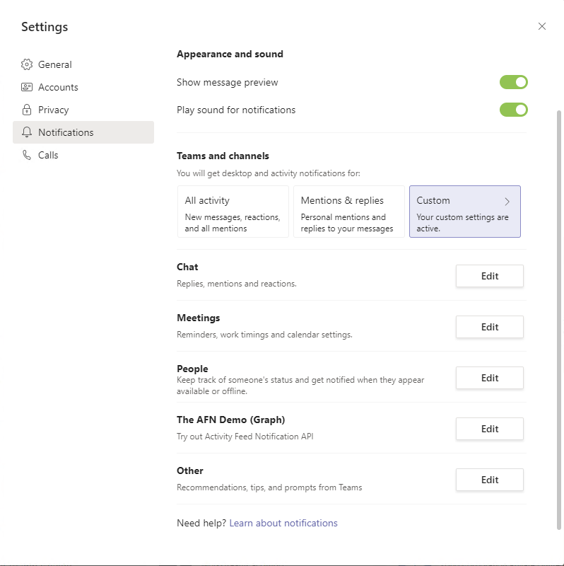

# <a name="send-activity-feed-notifications-to-users-in-microsoft-teams"></a><span data-ttu-id="15c6f-103">Enviar notificações de feed de atividade para usuários em Microsoft Teams</span><span class="sxs-lookup"><span data-stu-id="15c6f-103">Send activity feed notifications to users in Microsoft Teams</span></span>

<span data-ttu-id="15c6f-104">O Microsoft Teams de atividade permite que os usuários triagem itens que exigem atenção notificando-os sobre as alterações.</span><span class="sxs-lookup"><span data-stu-id="15c6f-104">The Microsoft Teams activity feed enables users to triage items that require attention by notifying them of changes.</span></span> <span data-ttu-id="15c6f-105">Você pode usar as APIs de notificação de feed de atividade no Microsoft Graph estender essa funcionalidade para seus aplicativos.</span><span class="sxs-lookup"><span data-stu-id="15c6f-105">You can use the activity feed notification APIs in Microsoft Graph to extend this functionality to your apps.</span></span> <span data-ttu-id="15c6f-106">Isso permite que seus aplicativos forneçam experiências mais ricas e envolvam melhor os usuários, ajudando a mantê-los atualizados com as alterações nas ferramentas e fluxos de trabalho que usam.</span><span class="sxs-lookup"><span data-stu-id="15c6f-106">This allows your apps to provide richer experiences and better engage users by helping to keep them up to date with changes in the tools and workflows they use.</span></span>

## <a name="understanding-the-basics-of-activity-feed-notification"></a><span data-ttu-id="15c6f-107">Noções básicas da notificação de feed de atividade</span><span class="sxs-lookup"><span data-stu-id="15c6f-107">Understanding the basics of activity feed notification</span></span>

<span data-ttu-id="15c6f-108">As notificações de feed de atividade Microsoft Teams são compostas por vários bits de informações, exibidos juntos, conforme mostrado na imagem a seguir.</span><span class="sxs-lookup"><span data-stu-id="15c6f-108">Activity feed notifications in Microsoft Teams are comprised of multiple bits of information, displayed together, as shown in the following image.</span></span>


<span data-ttu-id="15c6f-110">Os componentes incluem:</span><span class="sxs-lookup"><span data-stu-id="15c6f-110">The components include:</span></span>
- <span data-ttu-id="15c6f-111">O ator que iniciou a atividade</span><span class="sxs-lookup"><span data-stu-id="15c6f-111">The actor who initiated the activity</span></span>
- <span data-ttu-id="15c6f-112">Um ícone que representa o tipo de atividade</span><span class="sxs-lookup"><span data-stu-id="15c6f-112">An icon that represents the activity type</span></span>
- <span data-ttu-id="15c6f-113">O motivo pelo qual o ator fez a atividade</span><span class="sxs-lookup"><span data-stu-id="15c6f-113">The reason the actor did the activity</span></span>
- <span data-ttu-id="15c6f-114">Uma visualização de texto</span><span class="sxs-lookup"><span data-stu-id="15c6f-114">A text preview</span></span>
- <span data-ttu-id="15c6f-115">Um carimbo de data/hora</span><span class="sxs-lookup"><span data-stu-id="15c6f-115">A time stamp</span></span>
- <span data-ttu-id="15c6f-116">O local da atividade</span><span class="sxs-lookup"><span data-stu-id="15c6f-116">The location of the activity</span></span>

<span data-ttu-id="15c6f-117">O exemplo a seguir mostra como esses componentes juntos fornecem os detalhes sobre uma notificação.</span><span class="sxs-lookup"><span data-stu-id="15c6f-117">The following example shows how these components together provide the details about a notification.</span></span> <span data-ttu-id="15c6f-118">Este exemplo é uma notificação sobre um usuário mencionado em uma Yammer comunidade.</span><span class="sxs-lookup"><span data-stu-id="15c6f-118">This example is a notification about a user mentioned in a Yammer community.</span></span>


## <a name="requirements-for-using-the-activity-feed-notification-apis"></a><span data-ttu-id="15c6f-120">Requisitos para usar as APIs de notificação de feed de atividade</span><span class="sxs-lookup"><span data-stu-id="15c6f-120">Requirements for using the activity feed notification APIs</span></span>

<span data-ttu-id="15c6f-121">As APIs de feed de atividade funcionam com [um Teams app](/microsoftteams/platform/overview).</span><span class="sxs-lookup"><span data-stu-id="15c6f-121">Activity feed APIs work with a [Teams app](/microsoftteams/platform/overview).</span></span> <span data-ttu-id="15c6f-122">Veja a seguir os requisitos para o envio de notificações de feed de atividade:</span><span class="sxs-lookup"><span data-stu-id="15c6f-122">The following are the requirements for sending activity feed notifications:</span></span>

- <span data-ttu-id="15c6f-123">O Teams de aplicativo deve ter a ID do aplicativo do Azure AD adicionada à `webApplicationInfo` seção.</span><span class="sxs-lookup"><span data-stu-id="15c6f-123">The Teams app manifest must have the Azure AD app ID added to the `webApplicationInfo` section.</span></span> <span data-ttu-id="15c6f-124">Para obter detalhes, consulte [esquema de manifesto](/microsoftteams/platform/resources/schema/manifest-schema).</span><span class="sxs-lookup"><span data-stu-id="15c6f-124">For details, see [manifest schema](/microsoftteams/platform/resources/schema/manifest-schema).</span></span>
- <span data-ttu-id="15c6f-125">Os tipos de atividade devem ser declarados na `activities` seção.</span><span class="sxs-lookup"><span data-stu-id="15c6f-125">Activity types must be declared in the `activities` section.</span></span> <span data-ttu-id="15c6f-126">Para obter detalhes, consulte [esquema de manifesto](/microsoftteams/platform/resources/schema/manifest-schema).</span><span class="sxs-lookup"><span data-stu-id="15c6f-126">For details, see [manifest schema](/microsoftteams/platform/resources/schema/manifest-schema).</span></span>
- <span data-ttu-id="15c6f-127">O Teams aplicativo deve ser instalado para o destinatário, pessoalmente ou em uma [equipe](/graph/api/resources/team?preserve-view=true) ou [chat](/graph/api/resources/chat?preserve-view=true) de que eles fazem parte.</span><span class="sxs-lookup"><span data-stu-id="15c6f-127">The Teams app must be installed for the recipient, either personally, or in a [team](/graph/api/resources/team?preserve-view=true) or [chat](/graph/api/resources/chat?preserve-view=true) they are part of.</span></span> <span data-ttu-id="15c6f-128">Para obter mais informações, [consulte Teams instalação do aplicativo](/graph/api/resources/teamsappinstallation?preserve-view=true).</span><span class="sxs-lookup"><span data-stu-id="15c6f-128">For more information, see [Teams app installation](/graph/api/resources/teamsappinstallation?preserve-view=true).</span></span>

### <a name="teams-app-manifest-changes"></a><span data-ttu-id="15c6f-129">Teams de manifesto do aplicativo</span><span class="sxs-lookup"><span data-stu-id="15c6f-129">Teams app manifest changes</span></span>

<span data-ttu-id="15c6f-130">Esta seção descreve as alterações que precisam ser adicionadas ao manifesto Teams aplicativo.</span><span class="sxs-lookup"><span data-stu-id="15c6f-130">This section describes the changes that need to be added to Teams app manifest.</span></span> <span data-ttu-id="15c6f-131">Observe que você deve estar usando a versão Teams [de manifesto](/microsoftteams/platform/resources/schema/manifest-schema) do aplicativo `1.7` ou superior.</span><span class="sxs-lookup"><span data-stu-id="15c6f-131">Note that you must be using the [Teams app manifest](/microsoftteams/platform/resources/schema/manifest-schema) version `1.7` or greater.</span></span>

```json
"$schema": "https://developer.microsoft.com/json-schemas/teams/v1.7/MicrosoftTeams.schema.json",
"manifestVersion": "1.7",
````

#### <a name="webapplicationinfo-section-changes"></a><span data-ttu-id="15c6f-132">Alterações na seção webApplicationInfo</span><span class="sxs-lookup"><span data-stu-id="15c6f-132">webApplicationInfo section changes</span></span>

```json
"webApplicationInfo":
{
    "id": "a3111f15-658e-457c-9689-fd20fe907330",
    "resource": "https://contosoapp.com"
}
```

|<span data-ttu-id="15c6f-133">Parâmetro</span><span class="sxs-lookup"><span data-stu-id="15c6f-133">Parameter</span></span>|<span data-ttu-id="15c6f-134">Tipo</span><span class="sxs-lookup"><span data-stu-id="15c6f-134">Type</span></span>|<span data-ttu-id="15c6f-135">Descrição</span><span class="sxs-lookup"><span data-stu-id="15c6f-135">Description</span></span>|
|:---|:---|:---|
|<span data-ttu-id="15c6f-136">id</span><span class="sxs-lookup"><span data-stu-id="15c6f-136">id</span></span>|<span data-ttu-id="15c6f-137">cadeia de caracteres</span><span class="sxs-lookup"><span data-stu-id="15c6f-137">string</span></span>|<span data-ttu-id="15c6f-138">ID do aplicativo do Azure AD (ID do cliente).</span><span class="sxs-lookup"><span data-stu-id="15c6f-138">Azure AD app ID (client ID).</span></span>|
|<span data-ttu-id="15c6f-139">recurso</span><span class="sxs-lookup"><span data-stu-id="15c6f-139">resource</span></span>|<span data-ttu-id="15c6f-140">cadeia de caracteres</span><span class="sxs-lookup"><span data-stu-id="15c6f-140">string</span></span>|<span data-ttu-id="15c6f-141">Recurso associado ao aplicativo do Azure AD.</span><span class="sxs-lookup"><span data-stu-id="15c6f-141">Resource associated with the Azure AD app.</span></span> <span data-ttu-id="15c6f-142">Também conhecido como URL de resposta ou redirecionamento no Portal do Azure.</span><span class="sxs-lookup"><span data-stu-id="15c6f-142">Also known as reply or redirect URL in the Azure Portal.</span></span>|

> <span data-ttu-id="15c6f-143">**Observação:** Você pode obter um erro se vários Teams aplicativos no mesmo escopo (equipe, chat ou usuário) estão usando o mesmo aplicativo do Azure AD.</span><span class="sxs-lookup"><span data-stu-id="15c6f-143">**Note:** You might get an error if multiple Teams apps in the same scope (team, chat or user) are using the same Azure AD app.</span></span> <span data-ttu-id="15c6f-144">Certifique-se de que você esteja usando aplicativos exclusivos do Azure AD.</span><span class="sxs-lookup"><span data-stu-id="15c6f-144">Make sure that you're using unique Azure AD apps.</span></span>

#### <a name="activities-section-changes"></a><span data-ttu-id="15c6f-145">alterações na seção de atividades</span><span class="sxs-lookup"><span data-stu-id="15c6f-145">activities section changes</span></span>

```json
"activities":
{
  "activityTypes": [
    {
      "type": "taskCreated",
      "description": "Task Created Activity",
      "templateText": "{actor} created task {taskId} for you"
    },
    {
      "type": "approvalRequired",
      "description": "Deployment requires your approval",
      "templateText": "{actor} created a new deployment {deploymentId}"
    }
  ]
}
```

|<span data-ttu-id="15c6f-146">Parâmetro</span><span class="sxs-lookup"><span data-stu-id="15c6f-146">Parameter</span></span>|<span data-ttu-id="15c6f-147">Tipo</span><span class="sxs-lookup"><span data-stu-id="15c6f-147">Type</span></span>|<span data-ttu-id="15c6f-148">Descrição</span><span class="sxs-lookup"><span data-stu-id="15c6f-148">Description</span></span>|
|:---|:---|:---|
|<span data-ttu-id="15c6f-149">type</span><span class="sxs-lookup"><span data-stu-id="15c6f-149">type</span></span>|<span data-ttu-id="15c6f-150">string</span><span class="sxs-lookup"><span data-stu-id="15c6f-150">string</span></span>|<span data-ttu-id="15c6f-151">Tipo de atividade.</span><span class="sxs-lookup"><span data-stu-id="15c6f-151">Type of activity.</span></span> <span data-ttu-id="15c6f-152">Isso precisa ser exclusivo em um manifesto específico.</span><span class="sxs-lookup"><span data-stu-id="15c6f-152">This needs to be unique in a specific manifest.</span></span>|
|<span data-ttu-id="15c6f-153">description</span><span class="sxs-lookup"><span data-stu-id="15c6f-153">description</span></span>|<span data-ttu-id="15c6f-154">string</span><span class="sxs-lookup"><span data-stu-id="15c6f-154">string</span></span>|<span data-ttu-id="15c6f-155">Descrição curta acessível por humanos.</span><span class="sxs-lookup"><span data-stu-id="15c6f-155">Human-readable short description.</span></span> <span data-ttu-id="15c6f-156">Isso ficará visível no cliente Microsoft Teams cliente.</span><span class="sxs-lookup"><span data-stu-id="15c6f-156">This will be visible on the Microsoft Teams client.</span></span>|
|<span data-ttu-id="15c6f-157">templateText</span><span class="sxs-lookup"><span data-stu-id="15c6f-157">templateText</span></span>|<span data-ttu-id="15c6f-158">cadeia de caracteres</span><span class="sxs-lookup"><span data-stu-id="15c6f-158">string</span></span>|<span data-ttu-id="15c6f-159">Texto do modelo para a notificação de atividade.</span><span class="sxs-lookup"><span data-stu-id="15c6f-159">Template text for the activity notification.</span></span> <span data-ttu-id="15c6f-160">Você pode declarar seus parâmetros encapsulando parâmetros em `{}` .</span><span class="sxs-lookup"><span data-stu-id="15c6f-160">You can declare your parameters by encapsulating parameters in `{}`.</span></span>|

><span data-ttu-id="15c6f-161">**Observação:** `actor` é um parâmetro especial que sempre leva o nome do chamador.</span><span class="sxs-lookup"><span data-stu-id="15c6f-161">**Note:** `actor` is a special parameter that always takes the name of the caller.</span></span> <span data-ttu-id="15c6f-162">Em chamadas delegadas, `actor` é o nome do usuário.</span><span class="sxs-lookup"><span data-stu-id="15c6f-162">In delegated calls, `actor` is the user's name.</span></span> <span data-ttu-id="15c6f-163">Em chamadas somente de aplicativo, ele leva o nome do aplicativo Teams aplicativo.</span><span class="sxs-lookup"><span data-stu-id="15c6f-163">In application-only calls, it takes the name of the Teams app.</span></span>

### <a name="installing-the-teams-app"></a><span data-ttu-id="15c6f-164">Instalando o Teams app</span><span class="sxs-lookup"><span data-stu-id="15c6f-164">Installing the Teams app</span></span>

<span data-ttu-id="15c6f-165">Teams aplicativos podem ser instalados em uma equipe, um chat ou para um usuário pessoalmente e podem ser distribuídos de várias maneiras.</span><span class="sxs-lookup"><span data-stu-id="15c6f-165">Teams apps can be installed in a team, a chat, or for a user personally, and can be distributed in multiple ways.</span></span> <span data-ttu-id="15c6f-166">Para obter detalhes, [consulte Teams métodos de distribuição de aplicativos](/microsoftteams/platform/concepts/deploy-and-publish/overview).</span><span class="sxs-lookup"><span data-stu-id="15c6f-166">For details, see [Teams app distribution methods](/microsoftteams/platform/concepts/deploy-and-publish/overview).</span></span> <span data-ttu-id="15c6f-167">Normalmente, [o sideload é](/microsoftteams/platform/concepts/deploy-and-publish/apps-upload) preferencial para fins de desenvolvimento.</span><span class="sxs-lookup"><span data-stu-id="15c6f-167">Typically, [sideloading](/microsoftteams/platform/concepts/deploy-and-publish/apps-upload) is preferred for development purposes.</span></span> <span data-ttu-id="15c6f-168">Após o desenvolvimento, você pode escolher o método de distribuição certo com base em se deseja distribuir para um locatário ou para todos os locatários.</span><span class="sxs-lookup"><span data-stu-id="15c6f-168">After development, you can choose the right distribution method based on whether you want to distribute to one tenant or to all tenants.</span></span>

<span data-ttu-id="15c6f-169">Você também pode usar Teams apIs de [instalação de aplicativos](/graph/api/resources/teamsappinstallation?preserve-view=true) para gerenciar Teams de aplicativos.</span><span class="sxs-lookup"><span data-stu-id="15c6f-169">You can also use [Teams app installation](/graph/api/resources/teamsappinstallation?preserve-view=true) APIs to manage Teams app installations.</span></span>

## <a name="sending-activity-feed-notifications-to-users"></a><span data-ttu-id="15c6f-170">Enviando notificações de feed de atividade aos usuários</span><span class="sxs-lookup"><span data-stu-id="15c6f-170">Sending activity feed notifications to users</span></span>

<span data-ttu-id="15c6f-171">Como um Teams pode ser instalado para um usuário, em uma equipe ou em um chat, as notificações também podem ser enviadas nesses três contextos:</span><span class="sxs-lookup"><span data-stu-id="15c6f-171">Because a Teams app can be installed for a user, in a team, or in a chat, the notifications can be sent in these three contexts as well:</span></span>

- [<span data-ttu-id="15c6f-172">Enviar notificação ao usuário em um chat</span><span class="sxs-lookup"><span data-stu-id="15c6f-172">Send notification to user in a chat</span></span>](/graph/api/chat-sendactivitynotification)
- [<span data-ttu-id="15c6f-173">Enviar notificação ao usuário em uma equipe</span><span class="sxs-lookup"><span data-stu-id="15c6f-173">Send notification to user in a team</span></span>](/graph/api/team-sendactivitynotification)
- [<span data-ttu-id="15c6f-174">Enviar notificação ao usuário</span><span class="sxs-lookup"><span data-stu-id="15c6f-174">Send notification to user</span></span>](/graph/api/userteamwork-sendactivitynotification)

<span data-ttu-id="15c6f-175">Para obter detalhes sobre quais tópicos são suportados para cada cenário, consulte as APIs específicas.</span><span class="sxs-lookup"><span data-stu-id="15c6f-175">For details about what topics are supported for each scenario, see the specific APIs.</span></span> <span data-ttu-id="15c6f-176">Os tópicos personalizados baseados em texto são suportados para todos os cenários.</span><span class="sxs-lookup"><span data-stu-id="15c6f-176">Custom text-based topics are supported for all scenarios.</span></span>

### <a name="example-1-notify-a-user-about-a-task-created-in-a-chat"></a><span data-ttu-id="15c6f-177">Exemplo 1: Notificar um usuário sobre uma tarefa criada em um chat</span><span class="sxs-lookup"><span data-stu-id="15c6f-177">Example 1: Notify a user about a task created in a chat</span></span>

<span data-ttu-id="15c6f-178">Este exemplo mostra como você pode enviar uma notificação de feed de atividade para uma nova tarefa criada em um chat.</span><span class="sxs-lookup"><span data-stu-id="15c6f-178">This example shows how you can send an activity feed notification for a new task created in a chat.</span></span> <span data-ttu-id="15c6f-179">Nesse caso, o Teams aplicativo deve ser instalado em um chat com a ID e o usuário também `chatId` deve fazer parte do `569363e2-4e49-4661-87f2-16f245c5d66a` chat.</span><span class="sxs-lookup"><span data-stu-id="15c6f-179">In this case, the Teams app must be installed in a chat with Id `chatId` and user `569363e2-4e49-4661-87f2-16f245c5d66a` must be part of the chat as well.</span></span>

#### <a name="request"></a><span data-ttu-id="15c6f-180">Solicitação</span><span class="sxs-lookup"><span data-stu-id="15c6f-180">Request</span></span>
<!-- {
  "blockType": "request",
  "name": "chat_sendactivitynotification"
}
-->
``` http
POST https://graph.microsoft.com/beta/chats/{chatId}/sendActivityNotification
Content-Type: application/json

{
    "topic": {
        "source": "entityUrl",
        "value": "https://graph.microsoft.com/beta/chats/{chatId}"
    },
    "activityType": "taskCreated",
    "previewText": {
        "content": "New Task Created"
    },
    "recipient": {
        "@odata.type": "microsoft.graph.aadUserNotificationRecipient",
        "userId": "569363e2-4e49-4661-87f2-16f245c5d66a"
    },
    "templateParameters": [
        {
            "name": "taskId",
            "value": "12322"
        }
    ]
}
```

#### <a name="response"></a><span data-ttu-id="15c6f-181">Resposta</span><span class="sxs-lookup"><span data-stu-id="15c6f-181">Response</span></span>
<!-- {
  "blockType": "response",
  "truncated": false
}
-->
``` http
HTTP/1.1 204 No Content
```

### <a name="example-2-notify-a-user-about-a-task-created-in-a-team"></a><span data-ttu-id="15c6f-182">Exemplo 2: Notificar um usuário sobre uma tarefa criada em uma equipe</span><span class="sxs-lookup"><span data-stu-id="15c6f-182">Example 2: Notify a user about a task created in a team</span></span>

<span data-ttu-id="15c6f-183">Este exemplo mostra como você pode enviar uma notificação de feed de atividade para uma equipe.</span><span class="sxs-lookup"><span data-stu-id="15c6f-183">This example shows how you can send an activity feed notification for a team.</span></span> <span data-ttu-id="15c6f-184">Este exemplo notifica o proprietário da equipe sobre uma nova tarefa criada que exige sua atenção.</span><span class="sxs-lookup"><span data-stu-id="15c6f-184">This example notifies the team owner about a new task created that requires their attention.</span></span>

#### <a name="request"></a><span data-ttu-id="15c6f-185">Solicitação</span><span class="sxs-lookup"><span data-stu-id="15c6f-185">Request</span></span>
<!-- {
  "blockType": "request",
  "name": "team_sendactivitynotification"
}
-->
``` http
POST https://graph.microsoft.com/beta/teams/{teamId}/sendActivityNotification
Content-Type: application/json

{
    "topic": {
        "source": "entityUrl",
        "value": "https://graph.microsoft.com/beta/teams/{teamId}"
    },
    "activityType": "taskCreated",
    "previewText": {
        "content": "New Task Created"
    },
    "recipient": {
        "@odata.type": "microsoft.graph.aadUserNotificationRecipient",
        "userId": "569363e2-4e49-4661-87f2-16f245c5d66a"
    },
    "templateParameters": [
        {
            "name": "taskId",
            "value": "12322"
        }
    ]
}
```

#### <a name="response"></a><span data-ttu-id="15c6f-186">Resposta</span><span class="sxs-lookup"><span data-stu-id="15c6f-186">Response</span></span>
<!-- {
  "blockType": "response",
  "truncated": false
}
-->
``` http
HTTP/1.1 204 No Content
```

### <a name="example-3-notify-a-user-about-an-event-using-a-custom-topic"></a><span data-ttu-id="15c6f-187">Exemplo 3: Notificar um usuário sobre um evento usando um tópico personalizado</span><span class="sxs-lookup"><span data-stu-id="15c6f-187">Example 3: Notify a user about an event using a custom topic</span></span>

<span data-ttu-id="15c6f-188">Como visto nos exemplos anteriores, você pode vincular a diferentes aspectos de uma equipe ou de um chat.</span><span class="sxs-lookup"><span data-stu-id="15c6f-188">As seen in the previous examples, you can link to different aspects of a team or a chat.</span></span> <span data-ttu-id="15c6f-189">No entanto, se você deseja vincular a um aspecto que não faz parte da equipe ou não é representado pela Microsoft Graph, ou se quiser personalizar o nome, você pode definir a origem do para e passar um valor personalizado para `topic` `text` ele.</span><span class="sxs-lookup"><span data-stu-id="15c6f-189">However, if you want to link to an aspect that is not part of the team or is not represented by Microsoft Graph, or if you want to customize the name, you can set the source of the `topic` to `text` and pass in a custom value for it.</span></span> <span data-ttu-id="15c6f-190">Além disso, `webUrl` é necessário quando você usa a fonte como `topic` `text` .</span><span class="sxs-lookup"><span data-stu-id="15c6f-190">Additionally, `webUrl` is required when you use `topic` source as `text`.</span></span>

<span data-ttu-id="15c6f-191">O Yammer de notificação mostrado anteriormente usa um tópico personalizado porque os recursos Yammer não são suportados pela Microsoft Graph.</span><span class="sxs-lookup"><span data-stu-id="15c6f-191">The Yammer notification example shown earlier uses a custom topic because Yammer's resources are not supported by Microsoft Graph.</span></span>

> <span data-ttu-id="15c6f-192">**Observação:** `webUrl` deve começar com o domínio Microsoft Teams (teams.microsoft.com por exemplo).</span><span class="sxs-lookup"><span data-stu-id="15c6f-192">**Note:** `webUrl` must start with the Microsoft Teams domain (teams.microsoft.com for example).</span></span>

#### <a name="request"></a><span data-ttu-id="15c6f-193">Solicitação</span><span class="sxs-lookup"><span data-stu-id="15c6f-193">Request</span></span>
<!-- {
  "blockType": "request",
  "name": "team_sendactivitynotification"
}
-->
``` http
POST https://graph.microsoft.com/beta/teams/{teamId}/sendActivityNotification
Content-Type: application/json

{
    "topic": {
        "source": "text",
        "value": "Deployment Approvals Channel",
        "webUrl": "https://teams.microsoft.com/l/message/19:448cfd2ac2a7490a9084a9ed14cttr78c@thread.skype/1605223780000?tenantId=c8b1bf45-3834-4ecf-971a-b4c755ee677d&groupId=d4c2a937-f097-435a-bc91-5c1683ca7245&parentMessageId=1605223771864&teamName=Approvals&channelName=Azure%20DevOps&createdTime=1605223780000"
    },
    "activityType": "approvalRequired",
    "previewText": {
        "content": "New deployment requires your approval"
    },
    "recipient": {
        "@odata.type": "microsoft.graph.aadUserNotificationRecipient",
        "userId": "569363e2-4e49-4661-87f2-16f245c5d66a"
    },
    "templateParameters": [
        {
            "name": "deploymentId",
            "value": "6788662"
        }
    ]
}
```

#### <a name="response"></a><span data-ttu-id="15c6f-194">Resposta</span><span class="sxs-lookup"><span data-stu-id="15c6f-194">Response</span></span>
<!-- {
  "blockType": "response",
  "truncated": false
}
-->
``` http
HTTP/1.1 204 No Content
```

### <a name="example-4-notify-the-team-members-about-an-event"></a><span data-ttu-id="15c6f-195">Exemplo 4: notificar os membros da equipe sobre um evento</span><span class="sxs-lookup"><span data-stu-id="15c6f-195">Example 4: Notify the team members about an event</span></span>

<span data-ttu-id="15c6f-196">Este exemplo mostra como você pode enviar uma notificação de feed de atividade para todos os membros da equipe.</span><span class="sxs-lookup"><span data-stu-id="15c6f-196">This example shows how you can send an activity feed notification to all team members.</span></span> <span data-ttu-id="15c6f-197">Este exemplo notifica os membros da equipe sobre um novo evento.</span><span class="sxs-lookup"><span data-stu-id="15c6f-197">This example notifies the team members about a new event.</span></span> 

> <span data-ttu-id="15c6f-198">**Observação:** No momento, a capacidade de enviar notificações a todos os membros da equipe está disponível apenas na versão beta.</span><span class="sxs-lookup"><span data-stu-id="15c6f-198">**Note:** The ability to send notifications to all team members is currently only available in beta.</span></span>

#### <a name="request"></a><span data-ttu-id="15c6f-199">Solicitação</span><span class="sxs-lookup"><span data-stu-id="15c6f-199">Request</span></span>
<!-- {
  "blockType": "request",
  "name": "team_sendactivitynotification"
}
-->
``` http
POST https://graph.microsoft.com/beta/teams/7155e3c8-175e-4311-97ef-572edc3aa3db/sendActivityNotification
Content-Type: application/json

{
    "topic": {
        "source": "text",
        "value": "Weekly Virtual Social",
        "webUrl": "Teams webUrl"
    },
    "previewText": {
        "content": "It will be fun!"
    },
    "activityType": "eventCreated",
    "recipient": {
        "@odata.type": "microsoft.graph.teamMembersNotificationRecipient",
        "teamId": "7155e3c8-175e-4311-97ef-572edc3aa3db"
    }
}
```

#### <a name="response"></a><span data-ttu-id="15c6f-200">Resposta</span><span class="sxs-lookup"><span data-stu-id="15c6f-200">Response</span></span>
<!-- {
  "blockType": "response",
  "truncated": false
}
-->
``` http
HTTP/1.1 204 No Content
```

### <a name="example-5-notify-the-channel-members-about-an-event"></a><span data-ttu-id="15c6f-201">Exemplo 5: Notificar os membros do canal sobre um evento</span><span class="sxs-lookup"><span data-stu-id="15c6f-201">Example 5: Notify the channel members about an event</span></span>

<span data-ttu-id="15c6f-202">Este exemplo mostra como você pode enviar uma notificação de feed de atividade para todos os membros do canal.</span><span class="sxs-lookup"><span data-stu-id="15c6f-202">This example shows how you can send an activity feed notification to all channel members.</span></span> <span data-ttu-id="15c6f-203">Este exemplo notifica os membros do canal sobre um novo evento.</span><span class="sxs-lookup"><span data-stu-id="15c6f-203">This example notifies the channel members about a new event.</span></span> 

> <span data-ttu-id="15c6f-204">**Observação:** No momento, a capacidade de enviar notificações a todos os membros do canal está disponível apenas na versão beta.</span><span class="sxs-lookup"><span data-stu-id="15c6f-204">**Note:** The ability to send notifications to all channel members is currently only available in beta.</span></span>

#### <a name="request"></a><span data-ttu-id="15c6f-205">Solicitação</span><span class="sxs-lookup"><span data-stu-id="15c6f-205">Request</span></span>
<!-- {
  "blockType": "request",
  "name": "team_sendactivitynotification"
}
-->
``` http
POST https://graph.microsoft.com/beta/teams/7155e3c8-175e-4311-97ef-572edc3aa3db/sendActivityNotification
Content-Type: application/json

{
    "topic": {
        "source": "text",
        "value": "Weekly Virtual Social",
        "webUrl": "Teams webUrl"
    },
    "previewText": {
        "content": "It will be fun!"
    },
    "activityType": "eventCreated",
    "recipient": {
        "@odata.type": "microsoft.graph.channelMembersNotificationRecipient",
        "teamId": "7155e3c8-175e-4311-97ef-572edc3aa3db",
        "channelId": "19:0ea5de04de4743bcb4cd20cb99235d99@thread.tacv2"
    }
}
```

#### <a name="response"></a><span data-ttu-id="15c6f-206">Resposta</span><span class="sxs-lookup"><span data-stu-id="15c6f-206">Response</span></span>
<!-- {
  "blockType": "response",
  "truncated": false
}
-->
``` http
HTTP/1.1 204 No Content
```

### <a name="example-6-notify-the-chat-members-about-an-event"></a><span data-ttu-id="15c6f-207">Exemplo 6: notificar os membros do chat sobre um evento</span><span class="sxs-lookup"><span data-stu-id="15c6f-207">Example 6: Notify the chat members about an event</span></span>

<span data-ttu-id="15c6f-208">Este exemplo mostra como você pode enviar uma notificação de feed de atividade para todos os membros do chat.</span><span class="sxs-lookup"><span data-stu-id="15c6f-208">This example shows how you can send an activity feed notification to all chat members.</span></span> <span data-ttu-id="15c6f-209">Este exemplo notifica os membros do chat sobre um novo evento.</span><span class="sxs-lookup"><span data-stu-id="15c6f-209">This example notifies the chat members about a new event.</span></span> 

> <span data-ttu-id="15c6f-210">**Observação:** A capacidade de enviar notificações para todos os membros do chat só está disponível no momento na versão beta.</span><span class="sxs-lookup"><span data-stu-id="15c6f-210">**Note:** The ability to send notifications to all chat members is currently only available in beta.</span></span>

#### <a name="request"></a><span data-ttu-id="15c6f-211">Solicitação</span><span class="sxs-lookup"><span data-stu-id="15c6f-211">Request</span></span>
<!-- {
  "blockType": "request",
  "name": "chat_sendactivitynotification"
}
-->

``` http
POST https://graph.microsoft.com/beta/chats/19:d65713bc498c4a428c71ef9353e6ce20@thread.v2/sendActivityNotification
Content-Type: application/json

{
    "topic": {
        "source": "text",
        "value": "Weekly Virtual Social",
        "webUrl": "Teams webUrl"
    },
    "previewText": {
        "content": "It will be fun!"
    },
    "activityType": "eventCreated",
    "recipient": {
        "@odata.type": "microsoft.graph.chatMembersNotificationRecipient",
        "chatId": "19:d65713bc498c4a428c71ef9353e6ce20@thread.v2"
    }
}
```

#### <a name="response"></a><span data-ttu-id="15c6f-212">Resposta</span><span class="sxs-lookup"><span data-stu-id="15c6f-212">Response</span></span>
<!-- {
  "blockType": "response",
  "truncated": false
}
-->
``` http
HTTP/1.1 204 No Content
```

## <a name="customizing-how-the-notifications-alert-you"></a><span data-ttu-id="15c6f-213">Personalização de como as notificações alertam você</span><span class="sxs-lookup"><span data-stu-id="15c6f-213">Customizing how the notifications alert you</span></span>

<span data-ttu-id="15c6f-214">Microsoft Teams os usuários podem personalizar as notificações que veem em seus feeds, como um banner e assim por diante.</span><span class="sxs-lookup"><span data-stu-id="15c6f-214">Microsoft Teams users can customize the notifications they see in their feed, as a banner, and so on.</span></span> <span data-ttu-id="15c6f-215">As notificações geradas por apIs de feed de atividade também podem ser personalizadas.</span><span class="sxs-lookup"><span data-stu-id="15c6f-215">Notifications generated through activity feed APIs can also be customized.</span></span> <span data-ttu-id="15c6f-216">Os usuários podem escolher como eles são notificados por meio de configurações Microsoft Teams.</span><span class="sxs-lookup"><span data-stu-id="15c6f-216">Users can choose how they are notified via settings in Microsoft Teams.</span></span> <span data-ttu-id="15c6f-217">Teams aplicativos aparecerão na lista para o usuário escolher, conforme mostrado na captura de tela a seguir.</span><span class="sxs-lookup"><span data-stu-id="15c6f-217">Teams apps will appear in the list for the user to choose from, as shown in the following screenshot.</span></span>



<span data-ttu-id="15c6f-219">Os usuários podem clicar **em Editar** ao lado de um aplicativo e personalizar as notificações, conforme mostrado no exemplo a seguir.</span><span class="sxs-lookup"><span data-stu-id="15c6f-219">Users can click **Edit** next to an app and customize the notifications, as shown in the following example.</span></span> <span data-ttu-id="15c6f-220">O `description` campo no manifesto Teams aplicativo é exibido.</span><span class="sxs-lookup"><span data-stu-id="15c6f-220">The `description` field in the Teams app manifest is displayed.</span></span>


## <a name="faqs"></a><span data-ttu-id="15c6f-222">Perguntas frequentes</span><span class="sxs-lookup"><span data-stu-id="15c6f-222">FAQs</span></span>

### <a name="who-needs-to-install-the-teams-app"></a><span data-ttu-id="15c6f-223">Who precisa instalar o aplicativo Teams?</span><span class="sxs-lookup"><span data-stu-id="15c6f-223">Who needs to install the Teams app?</span></span>

<span data-ttu-id="15c6f-224">O usuário de destino deve ter o aplicativo Teams que está enviando notificações instaladas.</span><span class="sxs-lookup"><span data-stu-id="15c6f-224">The target user must have the Teams app that is sending notifications installed.</span></span>

### <a name="can-a-user-send-notifications-to-themselves"></a><span data-ttu-id="15c6f-225">Um usuário pode enviar notificações para si mesmo?</span><span class="sxs-lookup"><span data-stu-id="15c6f-225">Can a user send notifications to themselves?</span></span>

<span data-ttu-id="15c6f-226">Não, um usuário não pode enviar notificações para si mesmo.</span><span class="sxs-lookup"><span data-stu-id="15c6f-226">No, a user cannot send notifications to themselves.</span></span> <span data-ttu-id="15c6f-227">Para esse cenário, use permissões de aplicativo.</span><span class="sxs-lookup"><span data-stu-id="15c6f-227">For this scenario, use application permissions.</span></span>

### <a name="can-a-teams-app-control-how-the-notifications-are-shown-to-the-user"></a><span data-ttu-id="15c6f-228">Um aplicativo Teams controle como as notificações são mostradas ao usuário?</span><span class="sxs-lookup"><span data-stu-id="15c6f-228">Can a Teams app control how the notifications are shown to the user?</span></span>

<span data-ttu-id="15c6f-229">Não, somente os usuários podem alterar as configurações de notificação.</span><span class="sxs-lookup"><span data-stu-id="15c6f-229">No, only users are allowed to change notification settings.</span></span>

### <a name="i-installed-my-app-why-dont-i-see-notification-settings-under-the-user-account"></a><span data-ttu-id="15c6f-230">Instalei meu aplicativo, por que não vejo configurações de notificação na conta do usuário?</span><span class="sxs-lookup"><span data-stu-id="15c6f-230">I installed my app, why don't I see notification settings under the user account?</span></span>

<span data-ttu-id="15c6f-231">As configurações serão exibidas depois que a primeira notificação for enviada pelo Teams app.</span><span class="sxs-lookup"><span data-stu-id="15c6f-231">The settings will appear after the first notification is sent by the Teams app.</span></span> <span data-ttu-id="15c6f-232">Isso reduz o número de configurações que os usuários veem.</span><span class="sxs-lookup"><span data-stu-id="15c6f-232">This reduces the number of settings that users see.</span></span>

### <a name="i-started-getting-a-409-conflict-error-how-do-i-resolve-it"></a><span data-ttu-id="15c6f-233">Eu comecei a receber um erro 409 (conflito), como faço para resolvê-lo?</span><span class="sxs-lookup"><span data-stu-id="15c6f-233">I started getting a 409 (conflict) error, how do I resolve it?</span></span>

<span data-ttu-id="15c6f-234">`Conflict`os erros ocorrem principalmente quando vários aplicativos Teams instalados no mesmo escopo (equipe, chat, usuário e assim por diante) têm a mesma appId do Azure AD na seção do `webApplicationInfo` manifesto.</span><span class="sxs-lookup"><span data-stu-id="15c6f-234">`Conflict` errors primarily occur when multiple Teams apps installed in the same scope (team, chat, user, and so on) have the same Azure AD appId in the `webApplicationInfo` section of the manifest.</span></span> <span data-ttu-id="15c6f-235">Quando isso acontecer, você receberá um erro como `Found multiple applications with the same Azure AD App ID 'Your AzureAD AppId'.` .</span><span class="sxs-lookup"><span data-stu-id="15c6f-235">When this happens, you will get an error such as `Found multiple applications with the same Azure AD App ID 'Your AzureAD AppId'.`.</span></span> <span data-ttu-id="15c6f-236">Certifique-se de usar aplicativos exclusivos do Azure AD para aplicativos Teams exclusivos.</span><span class="sxs-lookup"><span data-stu-id="15c6f-236">Make sure that you use unique Azure AD apps for unique Teams apps.</span></span> <span data-ttu-id="15c6f-237">Observe que você pode ter o mesmo aplicativo Teams instalado em vários escopos (equipe + usuário, por exemplo).</span><span class="sxs-lookup"><span data-stu-id="15c6f-237">Note that you can have the same Teams app installed in multiple scopes (team + user for example).</span></span>

## <a name="see-also"></a><span data-ttu-id="15c6f-238">Confira também</span><span class="sxs-lookup"><span data-stu-id="15c6f-238">See also</span></span>

<span data-ttu-id="15c6f-239">[Práticas recomendadas para o uso Microsoft Teams de feed de atividade.](teams-activity-feed-notifications-best-practices.md)</span><span class="sxs-lookup"><span data-stu-id="15c6f-239">[Best practices for using Microsoft Teams activity feed notifications](teams-activity-feed-notifications-best-practices.md).</span></span>