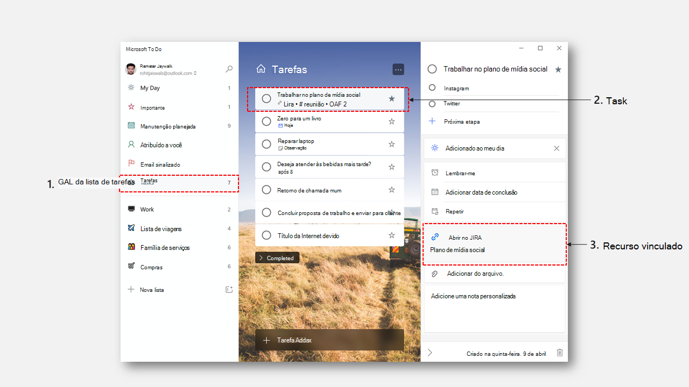

# Visão geral da API do Tarefa Pendente

A API de Tarefas Pendentes da Microsoft fornece uma maneira simples para as pessoas gerenciarem suas tarefas e planejarem seu dia. As tarefas são organizadas em listas de tarefas, que podem ser acessadas através de clientes do Tarefas Pendentes, Outlook e Teams a partir de qualquer dispositivo.

**Aplicativo To Do para Windows**

## Vantagens da integração no To Do

### Facilidade para organizar e acompanhar tarefas
O Microsoft To Do ajuda você a criar uma lista para qualquer coisa, desde tarefas de trabalho até projetos caseiros até compras em supermercado. Você pode acompanhar os prazos adicionando lembretes, datas de vencimento e anotações. Você pode acessar suas listas de qualquer lugar com os aplicativos da Microsoft To-Do para iOS, Android, Mac, Windows e para a Web. 

### Integração através da Microsoft 365
To Do é o único destino para tarefas pessoais no Microsoft 365. Portanto, está profundamente integrado aos hubs, da Microsoft 365, Outlook e Teams. As tarefas criadas nesses produtos são sincronizadas com o To Do, para que você possa acessá-las e gerenciá-las através de dispositivos. A integração do To Do pode ajudá-lo a alcançar milhões de usuários que usam o To Do para reunir tarefas do Outlook e do Teams em uma exibição integrada.  

### Dar suporte a conclusão de tarefas usando recursos vinculados
O Microsoft To Do fornece uma nova entidade chamada _linkedResource_, que você pode usar para criar tarefas que podem ser vinculadas de volta às suas fontes originais. Você pode usar isto para integrar perfeitamente ao To Do em seu fluxo de trabalho, criando tarefas que são vinculadas ao seu produto ou serviço. 

## Operações comuns da API To Do.

|Operação|Solicitação|
|:--------|:--|
| Listar todas as listas de tarefas | GET https://graph.microsoft.com/v1.0/me/todo/lists |
| Lista de todas as tarefas em uma lista de tarefas | GET https://graph.microsoft.com/v1.0/me/todo/lists/{todoTaskListId}/tasks |
| Criar uma nova tarefa | POST https://graph.microsoft.com/v1.0/me/todo/lists/{todoTaskListId}/tasks |
| Atualizar uma tarefa | PATCH https://graph.microsoft.com/v1.0/me/todo/lists/{todoTaskListId}/tasks/{todoTaskId} |
| Excluir uma tarefa | DELETE https://graph.microsoft.com/v1.0/me/todo/lists/{todoTaskListId}/tasks/{todoTaskId} |

## Referência da API

Está procurando a referência de API para esse serviço?

- [API de Tarefas Pendentes no Microsoft Graph v1.0](/graph/api/resources/todo-overview?view=graph-rest-1.0&preserve-view=true)
- [API de Tarefas Pendentes no Microsoft Graph beta](/graph/api/resources/todo-overview?view=graph-rest-beta&preserve-view=true)
