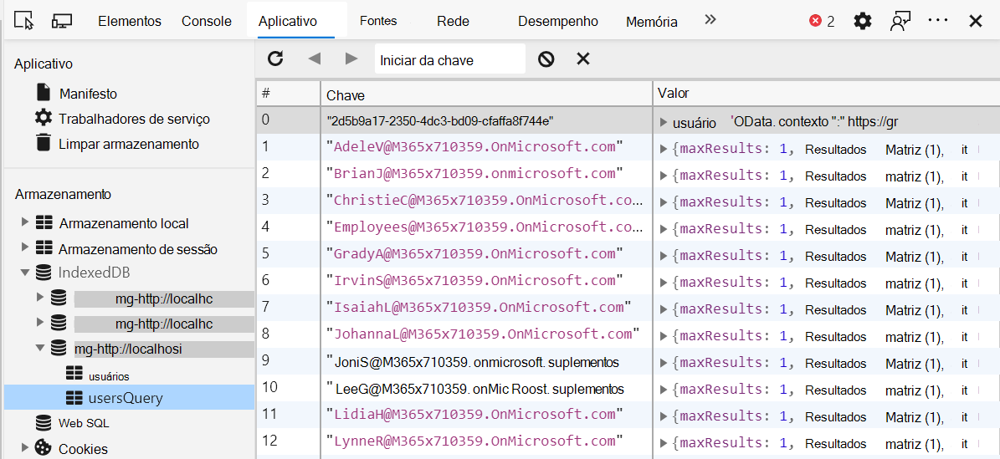

# <a name="microsoft-graph-toolkit-caching"></a><span data-ttu-id="0eec9-103">Cache Graph Toolkit Microsoft</span><span class="sxs-lookup"><span data-stu-id="0eec9-103">Microsoft Graph Toolkit caching</span></span>

<span data-ttu-id="0eec9-104">O Microsoft Graph Toolkit oferece suporte ao cache de chamadas de API Graph Microsoft.</span><span class="sxs-lookup"><span data-stu-id="0eec9-104">The Microsoft Graph Toolkit supports caching of select Microsoft Graph API calls.</span></span> <span data-ttu-id="0eec9-105">As chamadas estão sendo armazenadas em cache por entidade, como pessoas, contato, foto.</span><span class="sxs-lookup"><span data-stu-id="0eec9-105">Calls are being cached per entity, such as people, contact, photo.</span></span> <span data-ttu-id="0eec9-106">Isso permite que um componente recupere os dados e outros componentes para reutilizar sem chamar o Microsoft Graph.</span><span class="sxs-lookup"><span data-stu-id="0eec9-106">This allows one component to retrieve the data and other components to reuse it without calling Microsoft Graph.</span></span>

> [!TIP]
> <span data-ttu-id="0eec9-107">Para obter mais informações sobre quais entidades são armazenadas em cache por cada componente, consulte a documentação do componente.</span><span class="sxs-lookup"><span data-stu-id="0eec9-107">For more information about which entities are cached by each component, see the component's documentation.</span></span>

<span data-ttu-id="0eec9-108">Bancos de dados criados pelo mgt para cache são prefixados com `mgt-` .</span><span class="sxs-lookup"><span data-stu-id="0eec9-108">Databases created by mgt for caching are prefixed with `mgt-`.</span></span> <span data-ttu-id="0eec9-109">Os dados de cada entidade são armazenados em um armazenamento de objetos separado.</span><span class="sxs-lookup"><span data-stu-id="0eec9-109">The data for each entity is stored in a separate object store.</span></span> <span data-ttu-id="0eec9-110">Para inspecionar o cache, use **a** guia Aplicativo no painel do desenvolvedor (ferramentas F12) - na seção Armazenamento, clique na **guia IndexedDB.** </span><span class="sxs-lookup"><span data-stu-id="0eec9-110">To inspect the cache, use the **Application** tab in the developer panel (F12 tools) - under the **Storage** section, click on the **IndexedDB** tab.</span></span> 



## <a name="cache-configuration"></a><span data-ttu-id="0eec9-112">Configuração de cache</span><span class="sxs-lookup"><span data-stu-id="0eec9-112">Cache configuration</span></span>

<span data-ttu-id="0eec9-113">Você pode ler e gravar as opções de cache por meio do objeto de classe `CacheService.config` estática.</span><span class="sxs-lookup"><span data-stu-id="0eec9-113">You can read and write the cache options through the static class `CacheService.config` object.</span></span> <span data-ttu-id="0eec9-114">Ele é formatado conforme mostrado.</span><span class="sxs-lookup"><span data-stu-id="0eec9-114">It is formatted as shown.</span></span>

```TypeScript
let config = {
  defaultInvalidationPeriod: number,
  isEnabled: boolean,
  people: {
    invalidationPeriod: number,
    isEnabled: boolean
  },
  photos: {
    invalidationPeriod: number,
    isEnabled: boolean
  },
  users: {
    invalidationPeriod: number,
    isEnabled: boolean
  },
  presence: {
    invalidationPeriod: number,
    isEnabled: boolean
  },
  groups: {
    invalidationPeriod: number,
    isEnabled: boolean
  },
  response: {
    invalidationPeriod: number,
    isEnabled: boolean
  },
  files: {
    invalidationPeriod: number,
    isEnabled: boolean
  },
  fileLists: {
    invalidationPeriod: number,
    isEnabled: boolean
  }
};
```

<span data-ttu-id="0eec9-115">Períodos de invalidação de cache individuais são padrão no objeto config e padrão para o valor geral de `null` `defaultInvalidationPeriod` 3.600.000 ms (60 minutos).</span><span class="sxs-lookup"><span data-stu-id="0eec9-115">Individual cache invalidation periods are defaulted to `null` in the config object, and default to the general `defaultInvalidationPeriod` value of 3,600,000 ms (60 minutes).</span></span> <span data-ttu-id="0eec9-116">Qualquer valor passado para `config.x.invalidationPeriod` substituirá `defaultInvalidationPeriod` .</span><span class="sxs-lookup"><span data-stu-id="0eec9-116">Any value passed into `config.x.invalidationPeriod` will override `defaultInvalidationPeriod`.</span></span>

<span data-ttu-id="0eec9-117">O armazenamento de presença é a única exceção e tem um valor padrão de 300000 ms ou 5 minutos.</span><span class="sxs-lookup"><span data-stu-id="0eec9-117">The presence store is the only exception, and has a default value of 300000 ms, or 5 minutes.</span></span>

### <a name="examples"></a><span data-ttu-id="0eec9-118">Exemplos</span><span class="sxs-lookup"><span data-stu-id="0eec9-118">Examples</span></span>

<span data-ttu-id="0eec9-119">Para desabilitar individualmente um armazenamento, basta definir o valor das propriedades de config desse armazenamento `isEnabled` como false:</span><span class="sxs-lookup"><span data-stu-id="0eec9-119">To individual disable a store simply set the value of `isEnabled` in that store's config properties to false:</span></span>
```JavaScript
import { CacheService } from '@microsoft/mgt';

CacheService.config.users.isEnabled = false;
```
<span data-ttu-id="0eec9-120">Desabilitar o cache **não limpa** o cache.</span><span class="sxs-lookup"><span data-stu-id="0eec9-120">Disabling the cache does **not** clear the cache.</span></span>

<span data-ttu-id="0eec9-121">Alterar o período de invalidação é semelhante:</span><span class="sxs-lookup"><span data-stu-id="0eec9-121">Changing the invalidation period is similar:</span></span>

```JavaScript
import { CacheService } from '@microsoft/mgt';

CacheService.config.users.invalidationPeriod = 1800000;
```

## <a name="clearing-the-cache"></a><span data-ttu-id="0eec9-122">Limpar o cache</span><span class="sxs-lookup"><span data-stu-id="0eec9-122">Clearing the cache</span></span>

<span data-ttu-id="0eec9-123">O cache é automaticamente limpo quando o usuário sai. Ele também pode ser limpo manualmente.</span><span class="sxs-lookup"><span data-stu-id="0eec9-123">The cache is automatically cleared when the user signs out. It can also be cleared manually.</span></span>

<span data-ttu-id="0eec9-124">Se limpar todos os armazenamentos no cache, o método da classe limpará todos os `clearCaches()` `CacheService` armazenamentos mantidos pelo CacheService.</span><span class="sxs-lookup"><span data-stu-id="0eec9-124">The clear all the stores in the cache, the `clearCaches()` method of the `CacheService` class will clear every store maintained by the CacheService.</span></span>

```JavaScript
import { CacheService } from '@microsoft/mgt';

CacheService.clearCaches();
```

## <a name="creating-your-own-cache-stores"></a><span data-ttu-id="0eec9-125">Criando seus próprios armazenamentos de cache</span><span class="sxs-lookup"><span data-stu-id="0eec9-125">Creating your own cache stores</span></span>

<span data-ttu-id="0eec9-126">Se você quiser criar e preencher seus próprios armazenamentos de cache para seus componentes personalizados, você pode usar a `CacheService` classe estática.</span><span class="sxs-lookup"><span data-stu-id="0eec9-126">If you want to create and populate your own cache stores for your custom components, you can use the `CacheService` static class.</span></span>

```JavaScript
CacheService.getCache(schema: CacheSchema, storeName: String);
```
> <span data-ttu-id="0eec9-127">**Observação:** A `storeName` referência que você faz na chamada deve corresponder a um dos `getCache()` armazenamentos listados em seu `CacheSchema` objeto.</span><span class="sxs-lookup"><span data-stu-id="0eec9-127">**Note:** The `storeName` you reference in the call to `getCache()` must match one of the stores listed in your `CacheSchema` object.</span></span>

<span data-ttu-id="0eec9-128">O `CacheSchema` objeto é um dicionário com os pares de chave/valor.</span><span class="sxs-lookup"><span data-stu-id="0eec9-128">The `CacheSchema` object is a dictionary with the key/value pairs.</span></span>

```TypeScript
import { CacheSchema } from '@microsoft/mgt';
const cacheSchema: CacheSchema = {
  name: string,
  stores: {
    store1: {},
    store2: {},
    ...
  },
  version: number
};
```

<span data-ttu-id="0eec9-129">O exemplo a seguir mostra a implementação do cache.</span><span class="sxs-lookup"><span data-stu-id="0eec9-129">The following example shows the cache implementation.</span></span>

```TypeScript
import { CacheItem, CacheSchema, CacheService, CacheStore } from '@microsoft/mgt';

const cacheSchema: CacheSchema = {
  name: 'users',
  stores: {
    users: {},
    usersQuery: {}
  },
  version: 1
};

interface CacheUser extends CacheItem {
  user?: string;
}

// retrieves invalidation time from cache config
const getUserInvalidationTime = (): number =>
  CacheService.config.users.invalidationPeriod || CacheService.config.defaultInvalidationPeriod;

// checks for if cache is enabled
const usersCacheEnabled = (): boolean => CacheService.config.users.isEnabled && CacheService.config.isEnabled;

// declare the desired cache store
let cache: CacheStore<CacheUser>

// check if the cache is enabled
if (usersCacheEnabled()) {
  cache = CacheService.getCache<CacheUser>(cacheSchema, 'users');
  const user = await cache.getValue(query);

  // check if an item is retrieved, and if it's not expired
  if (user && getUserInvalidationTime() > Date.now() - user.timeCached) {
    return JSON.parse(user.user);
  }
}

// graph call
const graphRes = graph
  .api('me')
  .middlewareOptions(prepScopes('user.read'))
  .get();

// store graph result into the cache if cache is enabled
if (usersCacheEnabled()) {
  cache.putValue(userId, { user: JSON.stringify(graphRes) });
}
```
