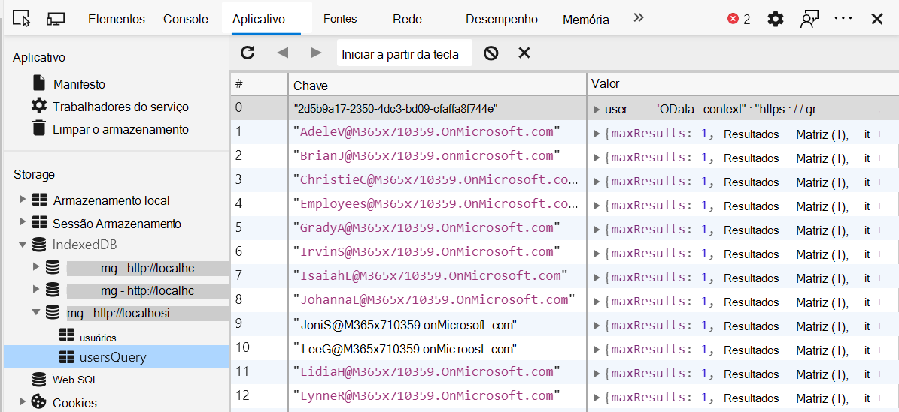

# <a name="microsoft-graph-toolkit-caching"></a>Cache do Microsoft Graph Toolkit

O Microsoft Graph Toolkit oferece suporte a cache de chamadas de API SELECT do Microsoft Graph. Atualmente, as chamadas para os pontos de extremidade de usuários, pessoas, contatos e fotos são armazenadas em cache por padrão em três repositórios do IndexedDB.

Você pode exibir o cache no painel de desenvolvedor. Na guia **aplicativo** , no painel **armazenamento** , vá para a guia **IndexedDB** .



## <a name="cache-configuration"></a>Configuração de cache

Você pode ler e gravar as opções de cache por meio do objeto de classe estática `CacheService.config` . Ele é formatado como mostrado.

```TypeScript
let config = {
  defaultInvalidationPeriod: number,
  isEnabled: boolean,
  people: {
    invalidationPeriod: number,
    isEnabled: boolean
  },
  photos: {
    invalidationPeriod: number,
    isEnabled: boolean
  },
  users: {
    invalidationPeriod: number,
    isEnabled: boolean
  },
  presence: {
    invalidationPeriod: number,
    isEnabled: boolean
  },
  groups: {
    invalidationPeriod: number,
    isEnabled: boolean
  },
};
```

Os períodos de invalidação de cache individual são padronizados para `null` o objeto config e o padrão é o `defaultInvalidationPeriod` valor geral 3,6 milhões ms (60 minutos). Qualquer valor passado para `config.x.invalidationPeriod` será substituído `defaultInvalidationPeriod` .

O repositório de presença é a única exceção e tem um valor padrão de 300000 MS ou 5 minutos.

### <a name="examples"></a>Exemplos

Para desabilitar individualmente um repositório, basta definir o valor das `isEnabled` Propriedades de config da loja como false:
```JavaScript
import { CacheService } from '@microsoft/mgt';

CacheService.config.users.isEnabled = false;
```
Desabilitar o cache **não limpa o** cache.

Alterar o período de invalditation é semelhante:

```JavaScript
import { CacheService } from '@microsoft/mgt';

CacheService.config.users.invalidationPeriod = 1800000;
```

## <a name="clearing-the-cache"></a>Limpando o cache

O cache é automaticamente limpo quando o usuário se desconecta. Ela também pode ser limpa manualmente.

Limpar todas as lojas no cache, o `clearCaches()` método da `CacheService` classe limpará todos os repositórios mantidos pelo CacheService.

```JavaScript
import { CacheService } from '@microsoft/mgt';

CacheService.clearCaches();
```

## <a name="creating-your-own-cache-stores"></a>Criar seus próprios repositórios de cache

Se você deseja criar e preencher seus próprios repositórios de cache para seus componentes personalizados, você pode usar a `CacheService` classe estática.

```JavaScript
CacheService.getCache(schema: CacheSchema, storeName: String);
```
> **Observação:** A `storeName` referência que você faz na chamada `getCache()` deve corresponder a uma das lojas listadas em seu `CacheSchema` objeto.

O `CacheSchema` objeto é um dicionário com os pares chave/valor.

```TypeScript
import { CacheSchema } from '@microsoft/mgt';
const cacheSchema: CacheSchema = {
  name: string,
  stores: {
    store1: {},
    store2: {},
    ...
  },
  version: number
};
```

O exemplo a seguir mostra a implementação de cache.

```TypeScript
import { CacheItem, CacheSchema, CacheService, CacheStore } from '@microsoft/mgt';

const cacheSchema: CacheSchema = {
  name: 'users',
  stores: {
    users: {},
    usersQuery: {}
  },
  version: 1
};

interface CacheUser extends CacheItem {
  user?: string;
}

// retrieves invalidation time from cache config
const getUserInvalidationTime = (): number =>
  CacheService.config.users.invalidationPeriod || CacheService.config.defaultInvalidationPeriod;

// checks for if cache is enabled
const usersCacheEnabled = (): boolean => CacheService.config.users.isEnabled && CacheService.config.isEnabled;

// declare the desired cache store
let cache: CacheStore<CacheUser>

// check if the cache is enabled
if (usersCacheEnabled()) {
  cache = CacheService.getCache<CacheUser>(cacheSchema, 'users');
  const user = await cache.getValue(query);

  // check if an item is retrieved, and if it's not expired
  if (user && getUserInvalidationTime() > Date.now() - user.timeCached) {
    return JSON.parse(user.user);
  }
}

// graph call
const graphRes = graph
  .api('me')
  .middlewareOptions(prepScopes('user.read'))
  .get();

// store graph result into the cache if cache is enabled
if (usersCacheEnabled()) {
  cache.putValue(userId, { user: JSON.stringify(graphRes) });
}
```
