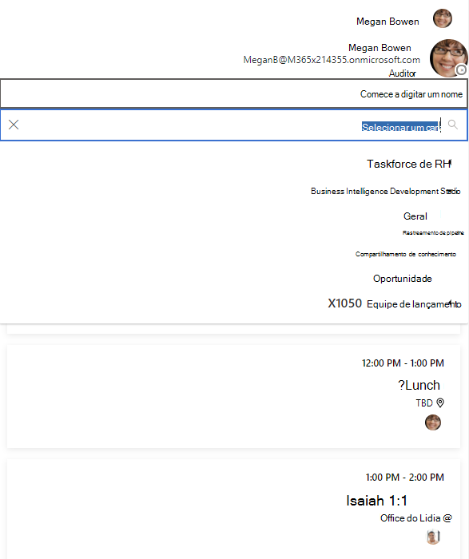

# <a name="display-microsoft-graph-toolkit-components-right-to-left-rtl"></a>Exibir componentes Graph Toolkit Microsoft da direita para a esquerda (rtl)

Os componentes Graph Toolkit Microsoft suportam marcação bidirecional para scripts de idioma da direita para a esquerda.

Para alterar a direção de todos os componentes na página, de definir o atributo no documento ou marca como , conforme `dir` `html` mostrado nos `body` `rtl` exemplos a seguir.

```html
<body dir="rtl"></body>
```

ou

```html
<html dir="rtl"></html>
```


