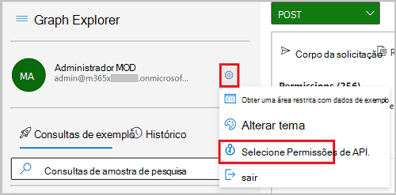
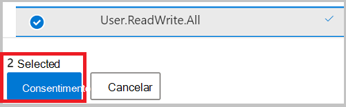
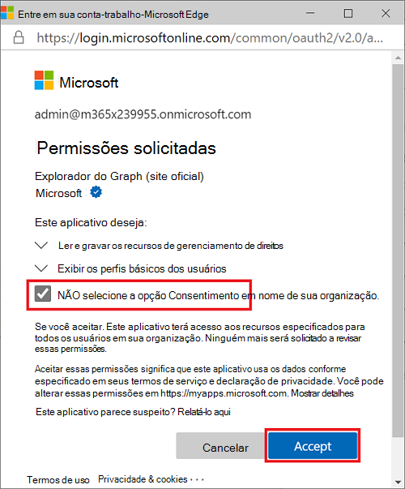

# <a name="tutorial-manage-access-to-resources-in-active-directory-entitlement-management-using-microsoft-graph-apis"></a>Tutorial: Gerenciar o acesso a recursos no gerenciamento de direitos do Active Directory usando APIs do Microsoft Graph

Gerenciar o acesso a todos os recursos de que os funcionários precisam, como grupos, aplicativos e sites, é uma função importante para as organizações. Você deseja conceder aos funcionários o nível certo de acesso que eles precisam para serem produtivos e remover o acesso quando ele não for mais necessário. [O gerenciamento de direitos do Azure Active Directory (Azure AD)](/azure/active-directory/governance/entitlement-management-overview) usando APIs do Microsoft Graph permite que você gerencie esse tipo de acesso.

Neste tutorial, você aprenderá a desenvolver código para criar um pacote de recursos para uma campanha de marketing que os usuários internos podem solicitar por autoatendimento. As solicitações não exigem aprovação e o acesso do usuário expira após 30 dias. Para este tutorial, os recursos da campanha de marketing são apenas associação em um único grupo, mas pode ser uma coleção de grupos, aplicativos ou sites do SharePoint Online.

> [!NOTE]
> Os objetos de resposta mostrados neste tutorial podem ser reduzidos para legibilidade.

## <a name="prerequisites"></a>Pré-requisitos

Para concluir este tutorial com êxito, verifique se você tem os pré-requisitos necessários:
- Azure AD gerenciamento de direitos requer licenças específicas. Para obter mais informações, consulte [Requisitos de licença](/azure/active-directory/governance/entitlement-management-overview#license-requirements). As seguintes licenças são necessárias em seu locatário:
    - Azure AD Premium P2
    - Enterprise Mobility + Security (EMS) E5
- Este tutorial assume que você está usando o Microsoft Graph Explorer, mas você pode usar o Postman ou criar seu próprio aplicativo cliente para chamar o Microsoft Graph. Para chamar as APIs do Microsoft Graph neste tutorial, você precisa usar uma conta com a função de administrador global e as permissões apropriadas. Para este tutorial, as `User.ReadWrite.All`permissões , `Group.ReadWrite.All`e `EntitlementManagement.ReadWrite.All` delegadas são necessárias. Conclua as seguintes etapas para definir as permissões no Microsoft Graph Explorer:
    1. Inicie o [Microsoft Graph Explorer](https://developer.microsoft.com/graph/graph-explorer).
    2. Selecione **Entrar com a conta da Microsoft** e entre usando uma conta de administrador global do Azure AD. Uma vez acessado, você verá os detalhes da conta do usuário no painel esquerdo.
    3. Selecione o ícone de configurações à direita dos detalhes da conta do usuário e, em seguida, selecione **Selecionar permissões**.

        
        
    4. Percorra a lista de permissões até `Group` as permissões, expanda **Grupo (2)** e selecione **a permissão Group.ReadWrite.All** . Role mais para baixo na `User` lista de permissões para as permissões, expanda Usuário **(8)** e selecione a permissão **User.ReadWrite.All** .

        
    
    5. Selecione **Consentimento** e, em seguida, selecione **Aceitar** para aceitar o consentimento das permissões. Você não precisa consentir em nome da organização para essas permissões.
    6. Pesquise `EntitlementManagement` as permissões, expanda **EntitlementManagement (2)**, selecione a permissão **Entitlement.ReadWrite.All** e, em seguida, selecione **Consentimento**. Como essa permissão requer consentimento do administrador e é necessária para uma conta de usuário que você cria neste tutorial, você deve selecionar Consentimento **em nome da sua organização**.

        

    7. Selecione **Aceitar** para aceitar o consentimento das permissões.

## <a name="step-1-create-a-user-account-and-a-group"></a>Etapa 1: Criar uma conta de usuário e um grupo

Nesta etapa, você cria um grupo chamado **Recursos de Marketing** no diretório que é o recurso de destino para o gerenciamento de direitos. Você também cria uma conta de usuário configurada como um solicitante interno.

### <a name="create-a-user-account"></a>Criar uma conta de usuário

Para este tutorial, você cria uma conta de usuário que é usada para solicitar acesso aos recursos no pacote de acesso. Ao fazer essas chamadas, altere para `contoso.onmicrosoft.com` o nome de domínio do seu locatário. Encontre informações sobre locatários na página de visão geral do Azure Active Directory. Registre o valor da **propriedade de ID** que é retornada para ser usada posteriormente no tutorial.

#### <a name="request"></a>Solicitação

``` http
POST https://graph.microsoft.com/v1.0/users
Content-type: application/json

{
  "accountEnabled":true,
  "displayName":"Requestor1",
  "mailNickname":"Requestor1",
  "userPrincipalName":"Requestor1@contoso.onmicrosoft.com",
  "passwordProfile": {
    "forceChangePasswordNextSignIn":true,
    "password":"Contoso1234"
  }
}
```

#### <a name="response"></a>Resposta

```http
{
  "@odata.context": "https://graph.microsoft.com/v1.0/$metadata#users/$entity",
  "id": "007d1c7e-7fa8-4e33-b678-5e437acdcddc",
  "deletedDateTime": null,
  "accountEnabled": true,
  "ageGroup": null,
  "businessPhones": [],
  "city": null,
  "createdDateTime": null,
  "creationType": null,
  "companyName": null,
  "consentProvidedForMinor": null,
  "country": null,
  "department": null,
  "displayName": "Requestor1",
  "employeeId": null,
  "faxNumber": null,
  "givenName": null,
  "imAddresses": [],
  "infoCatalogs": [],
  "isResourceAccount": null,
  "jobTitle": null,
  "legalAgeGroupClassification": null,
  "mail": null,
  "mailNickname": "Requestor1",
}
```

### <a name="create-a-group"></a>Criar um grupo

Neste tutorial, você criará um grupo chamado **Recursos de Marketing** que é o recurso de destino para o gerenciamento de direitos. Você pode usar um grupo existente se já tiver um. Registre o valor da **propriedade de ID** que é retornada para uso posterior neste tutorial. 

#### <a name="request"></a>Solicitação

```http
POST https://graph.microsoft.com/v1.0/groups
Content-type: application/json

{
  "description":"Marketing group",
  "displayName":"Marketing resources",
  "mailEnabled":false,
  "mailNickname":"markres",
  "securityEnabled":true
}
```

#### <a name="response"></a>Resposta

```http
{
  "@odata.context": "https://graph.microsoft.com/v1.0/$metadata#groups/$entity",
  "id": "e93e24d1-2b65-4a6c-a1dd-654a12225487",
  "deletedDateTime": null,
  "classification": null,
  "createdDateTime": "2020-06-24T16:47:37Z",
  "createdByAppId": "de8bc8b5-d9f9-48b1-a8ad-b748da725064",
  "description": "Marketing group",
  "displayName": "Marketing resources",
  "expirationDateTime": null,
  "groupTypes": [],
  "infoCatalogs": [],
  "isAssignableToRole": null,
  "mail": null,
  "mailEnabled": false,
  "mailNickname": "markres"
}
```

## <a name="step-2-add-resources-to-a-catalog-and-create-an-access-package"></a>Etapa 2: Adicionar recursos a um catálogo e criar um pacote de acesso

Um *pacote de acesso* é um pacote de recursos de que uma equipe ou projeto precisa e é regido por políticas. Os pacotes de acesso são definidos em contêineres chamados catálogos. Os catálogos podem referenciar recursos, como grupos, aplicativos e sites, que são usados no pacote de acesso. Nesta etapa, você criará um pacote **de acesso de Campanha de Marketing** no catálogo Geral. Se você tiver um catálogo diferente, use seu nome na próxima seção.

### <a name="get-the-catalog-identifier"></a>Obter o identificador de catálogo

Para adicionar recursos ao catálogo, primeiro você deve obter o identificador dele. Se você estiver usando o catálogo Geral, execute a solicitação a seguir para obter seu identificador. Se você estiver usando um calalog diferente, altere o valor do filtro na solicitação para o nome do catálogo. Registre o valor da **propriedade de ID** que é retornada para uso posterior neste tutorial.

#### <a name="request"></a>Solicitação

```http
GET https://graph.microsoft.com/beta/identityGovernance/entitlementManagement/accessPackageCatalogs?$filter=(displayName eq 'General')
```

#### <a name="response"></a>Resposta

```http
{
  "@odata.context": "https://graph.microsoft.com/beta/$metadata#accessPackageCatalogs",
  "value": [ 
    {
      "id": "cec5d6ab-c75d-47c0-9c1c-92e89f66e384",
      "displayName": "General",
      "description": "Built-in catalog.",
      "catalogType": "ServiceDefault",
      "catalogStatus": "Published",
      "isExternallyVisible": true,
      "createdBy": "Azure AD",
      "createdDateTime": "2020-05-30T10:58:05.363Z",
      "modifiedBy": "Azure AD",
      "modifiedDateTime": "2020-05-30T10:58:05.363Z"
    }
  ]
}
```

A resposta deve conter apenas o catálogo cujo nome você forneceu na solicitação. Se não houver valores retornados, verifique se o nome do catálogo está correto antes de continuar.

### <a name="add-the-group-to-the-catalog"></a>Adicionar o grupo ao catálogo

Para adicionar o grupo que você criou ao catálogo, forneça os seguintes valores de propriedade:
- **catalogId** - **a ID** do catálogo que você está usando
- **displayName** - o nome do grupo
- **descrição** - a descrição do grupo
- **originId** - **a ID** do grupo que você criou

#### <a name="request"></a>Solicitação

```http
POST https://graph.microsoft.com/beta/identityGovernance/entitlementManagement/accessPackageResourceRequests
Content-type: application/json

{
  "catalogId":"cec5d6ab-c75d-47c0-9c1c-92e89f66e384",
  "requestType": "AdminAdd",
  "justification": "",
  "accessPackageResource": {
    "displayName": "Marketing resources",
    "description": "Marketing group",
    "resourceType": "AadGroup",
    "originId": "e93e24d1-2b65-4a6c-a1dd-654a12225487",
    "originSystem": "AadGroup"
  }
}
```

#### <a name="response"></a>Resposta

```http
{
  "@odata.context": "https://graph.microsoft.com/beta/$metadata#identityGovernance/entitlementManagement/accessPackageResourceRequests/$entity",
  "catalogId": "cec5d6ab-c75d-47c0-9c1c-92e89f66e384",
  "executeImmediately": false,
  "id": "44e521e0-fb6b-4d5e-a282-e7e68dc59493",
  "requestType": "AdminAdd",
  "requestState": "Delivered",
  "requestStatus": "Fulfilled",
  "isValidationOnly": false,
  "expirationDateTime": null,
  "justification": ""
}
```

### <a name="get-catalog-resources"></a>Obter recursos de catálogo

Nas etapas posteriores deste tutorial, você precisará da **ID** que foi atribuída ao recurso de grupo no catálogo. Esse identificador, que representa o grupo como um recurso no catálogo, é diferente do identificador do próprio grupo no Microsoft Graph. Isso ocorre porque um catálogo pode ter recursos que não são representados no Microsoft Graph.

Na solicitação, forneça **a ID** do catálogo que você está usando. Registre o valor da **propriedade de ID** para o recurso de catálogo de grupos.

#### <a name="request"></a>Solicitação

```http
GET https://graph.microsoft.com/beta/identityGovernance/entitlementManagement/accessPackageCatalogs/cec5d6ab-c75d-47c0-9c1c-92e89f66e384/accessPackageResources?$filter=(displayName eq 'Marketing resources')
```

#### <a name="response"></a>Resposta

```http
{
  "@odata.context": "https://graph.microsoft.com/beta/$metadata#accessPackageResources",
  "value": [
    {
      "id": "4a1e21c5-8a76-4578-acb1-641160e076e8",
      "displayName": "Marketing resources",
      "description": "Marketing group",
      "url": "https://account.activedirectory.windowsazure.com/r?tenantId=d3030981-8fb9-4919-9980-5580caeddd75#/manageMembership?objectType=Group&objectId=e93e24d1-2b65-4a6c-a1dd-654a12225487",
      "resourceType": "Security Group",
      "originId": "e93e24d1-2b65-4a6c-a1dd-654a12225487",
      "originSystem": "AadGroup",
      "isPendingOnboarding": false,
      "addedBy": "admin@contoso.onmicrosoft.com",
      "addedOn": "2020-08-21T19:27:29.967Z"
    }
  ]
}
```

### <a name="get-resources-roles"></a>Obter funções de recursos

O pacote de acesso atribui usuários às funções de um recurso. A função típica de um grupo é a função de membro. Outros recursos, como sites e aplicativos do SharePoint Online, podem ter muitas funções. A função típica de um grupo usado em um pacote de acesso é a função de membro. Você precisará da função de membro ao adicionar uma função de recurso ao pacote de acesso posteriormente neste tutorial. 

Na solicitação, use a **ID** do catálogo e a **ID** do recurso de grupo no catálogo que você registrou para obter **a originId** da função de recurso Membro. Registre o valor da **propriedade originId** a ser usada posteriormente neste tutorial.

#### <a name="request"></a>Solicitação

```http
GET https://graph.microsoft.com/beta/identityGovernance/entitlementManagement/accessPackageCatalogs/cec5d6ab-c75d-47c0-9c1c-92e89f66e384/accessPackageResourceRoles?$filter=(originSystem+eq+%27AadGroup%27+and+accessPackageResource/id+eq+%274a1e21c5-8a76-4578-acb1-641160e076e8%27+and+displayName+eq+%27Member%27)&$expand=accessPackageResource
```

#### <a name="response"></a>Resposta

```http
{
  "@odata.context": "https://graph.microsoft.com/beta/$metadata#identityGovernance/entitlementManagement/accessPackageCatalogs('ede67938-cda7-4127-a9ca-7c7bf86a19b7')/accessPackageResourceRoles(accessPackageResource())",
  "value": [
    {
      "id": "00000000-0000-0000-0000-000000000000",
      "displayName": "Member",
      "description": null,
      "originSystem": "AadGroup",
      "originId": "Member_e93e24d1-2b65-4a6c-a1dd-654a12225487",
      "accessPackageResource": {
        "id": "4a1e21c5-8a76-4578-acb1-641160e076e8",
        "displayName": "Marketing resources",
        "description": "Marketing group",
        "url": "https://account.activedirectory.windowsazure.com/r?tenantId=d3030981-8fb9-4919-9980-5580caeddd75#/manageMembership?objectType=Group&objectId=e93e24d1-2b65-4a6c-a1dd-654a12225487",
        "resourceType": "Security Group",
        "originId": "e93e24d1-2b65-4a6c-a1dd-654a12225487",
        "originSystem": "AadGroup",
        "isPendingOnboarding": false,
        "addedBy": "admin@contoso.onmicrosoft.com",
        "addedOn": "2020-06-26T17:13:23.723Z",
        "accessPackageResourceScopes": []
      }
    }
  ]
}
```

Se bem-sucedido, um único valor é retornado, que representa a função Membro desse grupo. Se nenhuma função for retornada, verifique os **valores de ID** do catálogo e do recurso do pacote de acesso.

### <a name="create-the-access-package"></a>Criar o pacote de acesso

Neste ponto, você tem um catálogo com um recurso de grupo e sabe que usará a função de recurso de membro do grupo no pacote de acesso. A próxima etapa é criar o pacote de acesso. Depois de ter o pacote de acesso, você pode adicionar a função de recurso a ele e criar uma política de como os usuários podem solicitar acesso a essa função de recurso. Use a **ID do** catálogo que você registrou anteriormente para criar o pacote de acesso. Registre **a ID** do pacote de acesso a ser usado posteriormente neste tutorial.

#### <a name="request"></a>Solicitação

```http
POST https://graph.microsoft.com/beta/identityGovernance/entitlementManagement/accessPackages
Content-type: application/json

{
  "catalogId": "cec5d6ab-c75d-47c0-9c1c-92e89f66e384",
  "displayName": "Marketing Campaign",
  "description": "Access to resources for the campaign"
}
```

#### <a name="response"></a>Resposta

```http
{
  "@odata.context": "https://graph.microsoft.com/beta/$metadata#identityGovernance/entitlementManagement/accessPackages/$entity",
  "id": "88203d16-0e31-41d4-87b2-dd402f1435e9",
  "catalogId": "cec5d6ab-c75d-47c0-9c1c-92e89f66e384",
  "displayName": "Marketing Campaign",
  "description": "Access to resources for the campaign",
  "isHidden": false,
  "isRoleScopesVisible": false,
  "createdBy": "admin@contoso.onmicrosoft.com",
  "createdDateTime": "2020-08-21T19:45:33.2042281Z",
  "modifiedBy": "admin@contoso.onmicrosoft.com",
  "modifiedDateTime": "2020-08-21T19:45:33.2042281Z"
}
```

### <a name="add-a-resource-role-to-the-access-package"></a>Adicionar uma função de recurso ao pacote de acesso

Adicione a função Membro do recurso de grupo ao pacote de acesso. Na solicitação, forneça **a ID** do pacote de acesso. No corpo da solicitação, forneça a **ID** do recurso do catálogo de grupos para accessPackageResource e forneça a **originId** da função Membro que você registrou anteriormente.

#### <a name="request"></a>Solicitação

```http
POST https://graph.microsoft.com/beta/identityGovernance/entitlementManagement/accessPackages/88203d16-0e31-41d4-87b2-dd402f1435e9/accessPackageResourceRoleScopes
Content-type: application/json

{
  "accessPackageResourceRole": {
    "originId":"Member_e93e24d1-2b65-4a6c-a1dd-654a12225487",
    "displayName":"Member",
    "originSystem":"AadGroup",
    "accessPackageResource": {
      "id":"4a1e21c5-8a76-4578-acb1-641160e076e8","resourceType":"Security Group",  
      "originId":"e93e24d1-2b65-4a6c-a1dd-654a12225487","originSystem":"AadGroup"
    }
  },
  "accessPackageResourceScope": {
    "originId":"e93e24d1-2b65-4a6c-a1dd-654a12225487","originSystem":"AadGroup"
  }
}
```

#### <a name="response"></a>Resposta

```http
{
  "@odata.context": "https://graph.microsoft.com/beta/$metadata#identityGovernance/entitlementManagement/accessPackages('88203d16-0e31-41d4-87b2-dd402f1435e9')/accessPackageResourceRoleScopes/$entity",
  "id": "e081321b-2802-4834-a6ca-6f598ce3cdf7_6dbd2209-9d14-4c76-b92b-fcb00e835fe1",
  "createdBy": "admin@contoso.onmicrosoft.com",
  "createdDateTime": "2020-08-21T19:56:00.6320729Z",
  "modifiedBy": "admin@contoso.onmicrosoft.com",
  "modifiedDateTime": "2020-08-21T19:56:00.6320729Z"
}
```

O pacote de acesso agora tem uma função de recurso, que é a associação de grupo. A função é atribuída a qualquer usuário que tenha o pacote de acesso.

### <a name="create-an-access-package-policy"></a>Criar uma política de pacote de acesso

Agora que você criou o pacote de acesso e adicionou recursos e funções, pode decidir quem pode accessá-lo criando uma política de pacote de acesso. Neste tutorial, você habilita a **conta Requestor1** criada para solicitar acesso aos recursos no pacote de acesso. Para essa tarefa, você precisa destes valores:
- **ID** do pacote de acesso para o valor da **propriedade accessPackageId**
- **ID** da conta **de usuário Requestor1** para o valor da propriedade **de ID** em **allowedRequestors**
 
O valor da propriedade **durationInDays** permite que a conta **Requestor1** acesse os recursos no pacote de acesso por até 30 dias. Registre o valor da **propriedade de ID** que é retornada para uso posterior neste tutorial. 

#### <a name="request"></a>Solicitação

```http
POST https://graph.microsoft.com/beta/identityGovernance/entitlementManagement/accessPackageAssignmentPolicies
Content-type: application/json

{
  "accessPackageId": "88203d16-0e31-41d4-87b2-dd402f1435e9",
  "displayName": "Specific users",
  "description": "Specific users can request assignment",
  "accessReviewSettings": null,
  "durationInDays": 30,
  "requestorSettings": {
    "scopeType": "SpecificDirectorySubjects",
    "acceptRequests": true,
    "allowedRequestors": [
       {
         "@odata.type": "#microsoft.graph.singleUser",
         "isBackup": false,
         "id": "007d1c7e-7fa8-4e33-b678-5e437acdcddc",
         "description": "Requestor1"
       }
    ]
  },
  "requestApprovalSettings": {
    "isApprovalRequired": false,
    "isApprovalRequiredForExtension": false,
    "isRequestorJustificationRequired": false,
    "approvalMode": "NoApproval",
    "approvalStages": []
  }
}
```

#### <a name="response"></a>Resposta

```http
{
  "@odata.context": "https://graph.microsoft.com/beta/$metadata#accessPackageAssignmentPolicies/$entity",
  "id": "db440482-1210-4a60-9b55-3ac7a72f63ba",
  "accessPackageId": "88203d16-0e31-41d4-87b2-dd402f1435e9",
  "displayName": "Specific users",
  "description": "Specific users can request assignment",
  "canExtend": false,
  "durationInDays": 30,
  "expirationDateTime": null,
  "createdBy": "admin@contoso.onmicrosoft.com",
  "createdDateTime": "2020-06-29T19:47:44.7399675Z",
  "modifiedBy": "admin@contoso.onmicrosoft.com",
  "modifiedDateTime": "2020-06-29T19:47:44.7555489Z",
  "accessReviewSettings": null,
  "requestorSettings": {
    "scopeType": "SpecificDirectorySubjects",
    "acceptRequests": true,
    "allowedRequestors": [
      {
        "@odata.type": "#microsoft.graph.singleUser",
        "isBackup": false,
        "id": "007d1c7e-7fa8-4e33-b678-5e437acdcddc",
        "description": "Requestor1"
      }
    ]
  },
  "requestApprovalSettings": {
    "isApprovalRequired": false,
    "isApprovalRequiredForExtension": false,
    "isRequestorJustificationRequired": false,
    "approvalMode": "NoApproval",
    "approvalStages": []
  }
}
```

## <a name="step-3-request-access"></a>Etapa 3: Solicitar acesso

Nesta etapa, a conta de **usuário Requestor1** solicita acesso aos recursos no pacote de acesso.

Para solicitar acesso aos recursos no pacote de acesso, você precisa fornecer estes valores:
- **ID** da conta **de usuário Requestor1** que você criou para o valor da **propriedade targetId**
- **ID** da política de atribuição para o valor da **propriedade assignmentPolicyId**
- **ID** do pacote de acesso para o valor da **propriedade accessPackageId**

Na resposta, você pode ver o status **de Aceito e** um estado **de Enviado**. Registre o valor da **propriedade de ID** que é retornada para obter o status da solicitação mais tarde.

Se você ainda não fez isso, saia da conta de administrador que estava usando no Microsoft Graph Explorer. Entre na conta **de usuário do Requestor1** que você criou. Será solicitado que você altere a senha se for a primeira vez que você estiver entrando.

#### <a name="request"></a>Solicitação

```http
POST https://graph.microsoft.com/beta/identityGovernance/entitlementManagement/accessPackageAssignmentRequests
Content-type: application/json

{
  "requestType": "UserAdd",
  "accessPackageAssignment":{
     "targetId":"007d1c7e-7fa8-4e33-b678-5e437acdcddc",
     "assignmentPolicyId":"db440482-1210-4a60-9b55-3ac7a72f63ba",
     "accessPackageId":"88203d16-0e31-41d4-87b2-dd402f1435e9"
  }
}
```

#### <a name="response"></a>Resposta

```http
{
  "@odata.context": "https://graph.microsoft.com/beta/$metadata#accessPackageAssignmentRequests/$entity",
    "createdDateTime": null,
    "completedDate": null,
    "id": "a6bb6942-3ae1-4259-9908-0133aaee9377",
    "requestType": "UserAdd",
    "requestState": "Submitted",
    "requestStatus": "Accepted",
    "isValidationOnly": false,
    "expirationDateTime": null,
    "justification": null
}
```

## <a name="step-4-validate-that-access-has-been-assigned"></a>Etapa 4: Validar se o acesso foi atribuído

Nesta etapa, você confirma que a conta de usuário **requestor1** foi atribuída ao pacote de acesso e que agora é membro do grupo de recursos **de** Marketing.

Saia da conta do Solicitante1 e entre novamente na conta de administrador para ver o status da solicitação.

### <a name="get-the-status-of-the-request"></a>Obter o status da solicitação

Use o valor da **propriedade de ID** da solicitação para obter o status atual dela. Na resposta, você pode ver o status alterado para **Atendido** e o estado alterado para **Entregue**.

#### <a name="request"></a>Solicitação

```http
GET https://graph.microsoft.com/beta/identityGovernance/entitlementManagement/accessPackageAssignmentRequests/a6bb6942-3ae1-4259-9908-0133aaee9377
```

#### <a name="response"></a>Resposta

```http
{
  "@odata.context": "https://graph.microsoft.com/beta/$metadata#accessPackageAssignmentRequests/$entity",
  "createdDateTime": "2020-06-29T20:24:24.683Z",
  "completedDate": "2020-06-29T20:24:47.937Z",
  "id": "a6bb6942-3ae1-4259-9908-0133aaee9377",
  "requestType": "UserAdd",
  "requestState": "Delivered",
  "requestStatus": "FulfilledNotificationTriggered",
  "isValidationOnly": false,
  "expirationDateTime": null,
  "justification": null
}
```

### <a name="get-access-package-assignments"></a>Obter atribuições de pacote de acesso

Você também pode usar a **ID** da política de pacote de acesso que você criou para ver que os recursos foram atribuídos à conta de usuário **Requestor1** .

#### <a name="request"></a>Solicitação

```http
GET https://graph.microsoft.com/beta/identityGovernance/entitlementManagement/accessPackageAssignments?$filter=accessPackageAssignmentPolicy/Id eq 'db440482-1210-4a60-9b55-3ac7a72f63ba'&$expand=target,accessPackageAssignmentResourceRoles
```

#### <a name="response"></a>Resposta

```http
{
  "@odata.context": "https://graph.microsoft.com/beta/$metadata#accessPackageAssignments",
  "value": [
    {
      "id": "a6bb6942-3ae1-4259-9908-0133aaee9377",
      "catalogId": "cec5d6ab-c75d-47c0-9c1c-92e89f66e384",
      "accessPackageId": "88203d16-0e31-41d4-87b2-dd402f1435e9",
      "assignmentPolicyId": "db440482-1210-4a60-9b55-3ac7a72f63ba",
      "targetId": "2bc42425-6dc5-4f2a-9ebb-7a7464481eb0",
      "assignmentStatus": "Delivered",
      "assignmentState": "Delivered",
      "isExtended": false,
      "expiredDateTime": null,
      "target": {
         "id": "8586ddc8-0ff7-4c24-9c79-f192bc3566e3",
         "objectId": "2bc42425-6dc5-4f2a-9ebb-7a7464481eb0"
      },
      "accessPackageAssignmentResourceRoles": [
         {
            "id": "bdb7e0a0-a927-42ab-bf30-c5b5533dc54a",
            "originSystem": "AadGroup",
            "status": "Fulfilled"
         }
      ]
    }
  ]
}
```

### <a name="get-the-members-of-the-group"></a>Obter os membros do grupo

Depois que a solicitação for concedida, você poderá usar a **ID** que registrou para o grupo de recursos de **Marketing** para ver se a conta de usuário **requestor1** foi adicionada a ele.

#### <a name="request"></a>Solicitação

```http
GET https://graph.microsoft.com/v1.0/groups/e93e24d1-2b65-4a6c-a1dd-654a12225487/members
```

#### <a name="response"></a>Resposta:

```http
{
  "@odata.context": "https://graph.microsoft.com/beta/$metadata#directoryObjects",
  "value": [
    {
      "@odata.type": "#microsoft.graph.user",
      "id": "007d1c7e-7fa8-4e33-b678-5e437acdcddc",
      "deletedDateTime": null,
      "accountEnabled": true,
      "ageGroup": null,
      "businessPhones": [],
      "city": null,
      "createdDateTime": "2020-06-23T18:43:24Z",
      "creationType": null,
      "companyName": null,
      "consentProvidedForMinor": null,
      "country": null,
      "department": null,
      "displayName": "Requestor1",
      "employeeId": null,
      "faxNumber": null,
      "givenName": null,
      "imAddresses": [],
      "infoCatalogs": [],
      "isResourceAccount": null,
      "jobTitle": null,
      "legalAgeGroupClassification": null,
      "mail": null,
      "mailNickname": "Requestor1"
    }
  ]
}
```

## <a name="step-5-clean-up-resources"></a>Etapa 5: Limpar recursos

Nesta etapa, você removerá as alterações feitas e excluirá o pacote de **acesso da Campanha** de Marketing.

### <a name="remove-an-access-package-assignment"></a>Remover uma atribuição de pacote de acesso

Você deve remover todas as atribuições para o pacote de acesso antes de excluí-lo. Use a **ID da** solicitação de atribuição que você registrou anteriormente para excluí-la.

#### <a name="request"></a>Solicitação

```http
POST https://graph.microsoft.com/beta/identityGovernance/entitlementManagement/accessPackageAssignmentRequests
Content-type: application/json

{
  "requestType": "AdminRemove",
  "accessPackageAssignment":{
     "id": "a6bb6942-3ae1-4259-9908-0133aaee9377"
  }
}
```

#### <a name="response"></a>Resposta

```http
{
    "@odata.context": "https://graph.microsoft.com/beta/$metadata#accessPackageAssignmentRequests/$entity",
    "createdDateTime": null,
    "completedDate": null,
    "id": "78eaee8c-e6cf-48c9-8f99-aae44c35e379",
    "requestType": "AdminRemove",
    "requestState": "Submitted",
    "requestStatus": "Accepted",
    "isValidationOnly": false,
    "expirationDateTime": null,
    "justification": null
}
```

### <a name="delete-the-access-package-assignment-policy"></a>Excluir a política de atribuição de pacote de acesso

Use a **ID da** política de atribuição que você registrou anteriormente para excluí-la. Verifique se todas as atribuições foram removidas primeiro.

#### <a name="request"></a>Solicitação

```http
DELETE https://graph.microsoft.com/beta/identityGovernance/entitlementManagement/accessPackageAssignmentPolicies/6c1f65ec-8c25-4a45-83c2-a1de2a6d0e9f
```

#### <a name="response"></a>Resposta

```http
No Content - 204
```

### <a name="delete-the-access-package"></a>Excluir o pacote de acesso

Use a **ID** do pacote de acesso que você registrou anteriormente para excluí-lo.

#### <a name="request"></a>Solicitação

```http
DELETE https://graph.microsoft.com/beta/identityGovernance/entitlementManagement/accessPackages/cf54c6ca-d717-49bc-babe-d140d035dfdd
```

#### <a name="response"></a>Resposta

```http
No Content - 204
```

### <a name="delete-the-user-account"></a>Excluir a conta de usuário

**Exclua a conta de usuário requestor1**.

#### <a name="request"></a>Solicitação

```http
DELETE https://graph.microsoft.com/v1.0/users/ce02eca8-752b-4ecf-ac29-aa9bccd87606
```

#### <a name="response"></a>Resposta

```http
No Content - 204
```

### <a name="delete-the-group"></a>Adicionar ou remover membros do grupo

Exclua o **grupo de recursos de** Marketing.

#### <a name="request"></a>Solicitação

```http
DELETE https://graph.microsoft.com/v1.0/groups/a468eaea-ed6c-4290-98d2-a96bb1cb4209
```

#### <a name="response"></a>Resposta

```http
No Content - 204
```

## <a name="see-also"></a>Confira também

Neste tutorial, você usou muitas APIs para realizar tarefas. Explore a referência de API para essas APIs para saber mais sobre o que as APIs podem fazer:

- [Trabalhando com a API Azure AD de gerenciamento de direitos](/graph/api/resources/entitlementmanagement-overview)
- [accessPackageCatalog](/graph/api/resources/accesspackagecatalog)
- [accessPackageResourceRequest](/graph/api/resources/accesspackageresourcerequest)
- [accessPackage](/graph/api/resources/accesspackage)
- [accessPackageResourceRoleScope](/graph/api/resources/accesspackageresourcerolescope)
- [accessPackageAssignmentPolicy](/graph/api/resources/accesspackageassignmentpolicy)
- [accessPackageAssignmentRequest](/graph/api/resources/accesspackageassignmentrequest)
- [group](/graph/api/resources/group)
- [user](/graph/api/resources/user)
