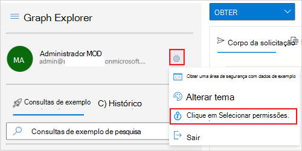

# <a name="tutorial-use-the-access-reviews-api-to-review-guest-access-to-your-microsoft-365-groups"></a><span data-ttu-id="dddb2-103">Tutorial: use a API de críticas de acesso para revisar o acesso de convidados aos grupos Microsoft 365 seus clientes</span><span class="sxs-lookup"><span data-stu-id="dddb2-103">Tutorial: Use the access reviews API to review guest access to your Microsoft 365 groups</span></span>

<span data-ttu-id="dddb2-104">Neste tutorial, você usará o Graph Explorer para criar e ler críticas de acesso que direcionam todos os Microsoft 365 grupos com usuários convidados no locatário.</span><span class="sxs-lookup"><span data-stu-id="dddb2-104">In this tutorial, you will use Graph Explorer to create and read access reviews that targets all Microsoft 365 groups with guest users in the tenant.</span></span> <span data-ttu-id="dddb2-105">Para isso, você primeiro usará o Azure AD B2B para convidar e criar um usuário convidado, também conhecido como identidade externa, em seu locatário.</span><span class="sxs-lookup"><span data-stu-id="dddb2-105">To achieve this, you'll first use Azure AD B2B to invite and create a guest user, also referred to as an external identity, in your tenant.</span></span> <span data-ttu-id="dddb2-106">Em seguida, você adicionará esse usuário convidado ao seu grupo Microsoft 365 antes de criar e ler a revisão de acesso.</span><span class="sxs-lookup"><span data-stu-id="dddb2-106">Then, you'll add this guest user to your Microsoft 365 group prior to creating and reading the access review.</span></span>

>[!NOTE]
><span data-ttu-id="dddb2-107">Os objetos de resposta mostrados neste tutorial podem ser reduzidos para a capacidade de leitura.</span><span class="sxs-lookup"><span data-stu-id="dddb2-107">The response objects shown in this tutorial might be shortened for readability.</span></span>

## <a name="prerequisites"></a><span data-ttu-id="dddb2-108">Pré-requisitos</span><span class="sxs-lookup"><span data-stu-id="dddb2-108">Prerequisites</span></span>

<span data-ttu-id="dddb2-109">Para concluir este tutorial, você precisa dos seguintes recursos e privilégios:</span><span class="sxs-lookup"><span data-stu-id="dddb2-109">To complete this tutorial, you need the following resources and privileges:</span></span>

+ <span data-ttu-id="dddb2-110">Um locatário do Azure AD funcionando com uma licença Azure AD Premium P2 ou EMS E5 habilitada.</span><span class="sxs-lookup"><span data-stu-id="dddb2-110">A working Azure AD tenant with an Azure AD Premium P2 or EMS E5 license enabled.</span></span> 
+ <span data-ttu-id="dddb2-111">Uma conta em um locatário diferente do Azure AD ou uma identidade social que você pode convidar como usuário convidado (usuário B2B).</span><span class="sxs-lookup"><span data-stu-id="dddb2-111">An account in a different Azure AD tenant or a social identity that you can invite as a guest user (B2B user).</span></span>
+ <span data-ttu-id="dddb2-112">Entre no Graph [Explorer](https://developer.microsoft.com/graph/graph-explorer) como usuário em uma função de administrador global.</span><span class="sxs-lookup"><span data-stu-id="dddb2-112">Sign in to [Graph Explorer](https://developer.microsoft.com/graph/graph-explorer) as a user in a global administrator role.</span></span> 
+ <span data-ttu-id="dddb2-113">As seguintes permissões delegadas: `User.Invite.All` , `AccessReview.ReadWrite.All` , , `Group.ReadWrite.All` `User.ReadWrite.All` .</span><span class="sxs-lookup"><span data-stu-id="dddb2-113">The following delegated permissions: `User.Invite.All`, `AccessReview.ReadWrite.All`, `Group.ReadWrite.All`, `User.ReadWrite.All`.</span></span>

<span data-ttu-id="dddb2-114">Para consentir com as permissões necessárias no Graph Explorer:</span><span class="sxs-lookup"><span data-stu-id="dddb2-114">To consent to the required permissions in Graph Explorer:</span></span>
1. <span data-ttu-id="dddb2-115">Selecione o ícone de configurações à direita dos detalhes da conta do usuário e escolha **Selecionar permissões**.</span><span class="sxs-lookup"><span data-stu-id="dddb2-115">Select the settings icon to the right of the user account details, and then choose **Select permissions**.</span></span>
   
   <span data-ttu-id="dddb2-116">
   </span><span class="sxs-lookup"><span data-stu-id="dddb2-116">
</span></span><!--:::image type="content" source="../images/../concepts/images/tutorial-accessreviews-api/settings.png" alt-text="Select the Microsoft Graph permissions":::-->

2. <span data-ttu-id="dddb2-117">Role a lista de permissões para essas permissões:</span><span class="sxs-lookup"><span data-stu-id="dddb2-117">Scroll through the list of permissions to these permissions:</span></span>
   + <span data-ttu-id="dddb2-118">AccessReview (3), expanda e selecione **AccessReview.ReadWrite.All**.</span><span class="sxs-lookup"><span data-stu-id="dddb2-118">AccessReview (3), expand and then select **AccessReview.ReadWrite.All**.</span></span>
   + <span data-ttu-id="dddb2-119">Grupo (2), expanda e selecione **Group.ReadWrite.All**.</span><span class="sxs-lookup"><span data-stu-id="dddb2-119">Group (2), expand and then select **Group.ReadWrite.All**.</span></span>
   + <span data-ttu-id="dddb2-120">Usuário (8), expanda e selecione **User.Invite.All** e **User.ReadWrite.All**.</span><span class="sxs-lookup"><span data-stu-id="dddb2-120">User (8), expand and then select **User.Invite.All** and **User.ReadWrite.All**.</span></span>
   
   <span data-ttu-id="dddb2-121">Selecione **Consentimento** e, em seguida, selecione **Aceitar** para aceitar o consentimento das permissões.</span><span class="sxs-lookup"><span data-stu-id="dddb2-121">Select **Consent**, and then select **Accept** to accept the consent of the permissions.</span></span> <span data-ttu-id="dddb2-122">Você não precisa consentir em nome da organização para essas permissões.</span><span class="sxs-lookup"><span data-stu-id="dddb2-122">You do not need to consent on behalf of your organization for these permissions.</span></span>
   
   <span data-ttu-id="dddb2-123">
   </span><span class="sxs-lookup"><span data-stu-id="dddb2-123">
</span></span><!--:::image type="content" source="../images/../concepts/images/tutorial-accessreviews-api/consentpermissions_M365.png" alt-text="Consent to the Microsoft Graph permissions":::-->

## <a name="step-1-create-a-test-user-in-your-tenant"></a><span data-ttu-id="dddb2-124">Etapa 1: Criar um usuário de teste em seu locatário</span><span class="sxs-lookup"><span data-stu-id="dddb2-124">Step 1: Create a test user in your tenant</span></span>

### <a name="request"></a><span data-ttu-id="dddb2-125">Solicitação</span><span class="sxs-lookup"><span data-stu-id="dddb2-125">Request</span></span>
<!-- {
  "blockType": "request",
  "name": "tutorial-accessreviews-M365group-createUser"
}-->

```http
POST /users
Content-Type: application/json

{
    "accountEnabled": true,
    "displayName": "Aline Dupuy",
    "mailNickname": "AlineD",
    "userPrincipalName": "AlineD@contoso.com",
    "passwordProfile": {
        "forceChangePasswordNextSignIn": true,
        "password": "xWwvJ]6NMw+bWH-d"
    }
}
```

### <a name="response"></a><span data-ttu-id="dddb2-126">Resposta</span><span class="sxs-lookup"><span data-stu-id="dddb2-126">Response</span></span>
<!-- {
  "blockType": "response",
  "truncated": true,
  "@odata.type": "microsoft.graph.user"
} -->

```http
HTTP/1.1 201 Created
Content-type: application/json

{
    "@odata.context": "https://graph.microsoft.com/beta/$metadata#users/$entity",
    "id": "c9a5aff7-9298-4d71-adab-0a222e0a05e4",
    "displayName": "Aline Dupuy",
    "userPrincipalName": "AlineD@contoso.com",
    "userType": "Member"
}
```

## <a name="step-2-invite-a-guest-user-into-your-tenant"></a><span data-ttu-id="dddb2-127">Etapa 2: convidar um usuário convidado para seu locatário</span><span class="sxs-lookup"><span data-stu-id="dddb2-127">Step 2: Invite a guest user into your tenant</span></span>

<span data-ttu-id="dddb2-128">Convide um usuário convidado com o endereço de email **john@tailspintoys.com** seu locatário.</span><span class="sxs-lookup"><span data-stu-id="dddb2-128">Invite a guest user with the email address **john@tailspintoys.com** to your tenant.</span></span>

### <a name="request"></a><span data-ttu-id="dddb2-129">Solicitação</span><span class="sxs-lookup"><span data-stu-id="dddb2-129">Request</span></span>
<!-- {
  "blockType": "request",
  "name": "tutorial-accessreviews-M365group-inviteguest"
}-->

```http
POST https://graph.microsoft.com/beta/invitations
Content-Type: application/json

{
    "invitedUserDisplayName": "John Doe (Tailspin Toys)",
    "invitedUserEmailAddress": "john@tailspintoys.com",
    "sendInvitationMessage": false,
    "inviteRedirectUrl": "https://myapps.microsoft.com"
}
```

### <a name="response"></a><span data-ttu-id="dddb2-130">Resposta</span><span class="sxs-lookup"><span data-stu-id="dddb2-130">Response</span></span>
<!-- {
  "blockType": "response",
  "truncated": true,
  "@odata.type": "microsoft.graph.invitation"
} -->

```http
HTTP/1.1 201 Created
Content-type: application/json

{
    "@odata.context": "https://graph.microsoft.com/beta/$metadata#invitations/$entity",
    "invitedUser": {
        "id": "baf1b0a0-1f9a-4a56-9884-6a30824f8d20"
    }    
}
```

## <a name="step-3-create-a-new-microsoft-365-group-and-add-the-guest-user"></a><span data-ttu-id="dddb2-131">Etapa 3: criar um novo grupo Microsoft 365 e adicionar o usuário convidado</span><span class="sxs-lookup"><span data-stu-id="dddb2-131">Step 3: Create a new Microsoft 365 group and add the guest user</span></span>

<span data-ttu-id="dddb2-132">Nesta etapa:</span><span class="sxs-lookup"><span data-stu-id="dddb2-132">In this step:</span></span>
1. <span data-ttu-id="dddb2-133">Crie um novo grupo Microsoft 365 chamado **campanha de marketing Feelgood.**</span><span class="sxs-lookup"><span data-stu-id="dddb2-133">Create a new Microsoft 365 group named **Feelgood marketing campaign**.</span></span>
2. <span data-ttu-id="dddb2-134">Atribua a si mesmo como o proprietário do grupo.</span><span class="sxs-lookup"><span data-stu-id="dddb2-134">Assign yourself as the group owner.</span></span>
3. <span data-ttu-id="dddb2-135">Adicione john@tailspintoys.com como membro do grupo.</span><span class="sxs-lookup"><span data-stu-id="dddb2-135">Add john@tailspintoys.com as a group member.</span></span> <span data-ttu-id="dddb2-136">O acesso ao grupo é assunto de revisão por você, o proprietário do grupo.</span><span class="sxs-lookup"><span data-stu-id="dddb2-136">Their access to the group is the subject of review by you, the group owner.</span></span>

### <a name="request"></a><span data-ttu-id="dddb2-137">Solicitação</span><span class="sxs-lookup"><span data-stu-id="dddb2-137">Request</span></span>

<span data-ttu-id="dddb2-138">Nesta chamada, substitua:</span><span class="sxs-lookup"><span data-stu-id="dddb2-138">In this call, replace:</span></span>
+ <span data-ttu-id="dddb2-139">`cdb555e3-b33e-4fd5-a427-17fadacbdfa7` com sua **id**. Para recuperar sua **id,** execute `GET` em `https://graph.microsoft.com/beta/me` .</span><span class="sxs-lookup"><span data-stu-id="dddb2-139">`cdb555e3-b33e-4fd5-a427-17fadacbdfa7` with your **id**. To retrieve your **id**, run `GET` on `https://graph.microsoft.com/beta/me`.</span></span>
+ <span data-ttu-id="dddb2-140">`baf1b0a0-1f9a-4a56-9884-6a30824f8d20` com **john@tailspintoys.com** **id** da resposta na Etapa 2.</span><span class="sxs-lookup"><span data-stu-id="dddb2-140">`baf1b0a0-1f9a-4a56-9884-6a30824f8d20` with **john@tailspintoys.com**'s **id** from the response in Step 2.</span></span>

<!-- {
  "blockType": "request",
  "name": "tutorial-accessreviews-M365group-creategroup"
}-->
```http
POST https://graph.microsoft.com/beta/groups
Content-Type: application/json

{
    "description": "Feelgood Marketing Campaign with external partners and vendors.",
    "displayName": "Feelgood Marketing Campaign",
    "groupTypes": [
        "Unified"
    ],
    "mailEnabled": true,
    "mailNickname": "FeelGoodCampaign",
    "securityEnabled": true,
    "owners@odata.bind": [
        "https://graph.microsoft.com/beta/users/cdb555e3-b33e-4fd5-a427-17fadacbdfa7"
    ],
    "members@odata.bind": [
        "https://graph.microsoft.com/beta/users/baf1b0a0-1f9a-4a56-9884-6a30824f8d20"
    ]
}
```

### <a name="response"></a><span data-ttu-id="dddb2-141">Resposta</span><span class="sxs-lookup"><span data-stu-id="dddb2-141">Response</span></span>
<!-- {
  "blockType": "response",
  "truncated": true,
  "@odata.type": "microsoft.graph.group",
  "name": "create_group"
} -->

```http
HTTP/1.1 201 Created
Content-type: application/json

{
    "@odata.context": "https://graph.microsoft.com/beta/$metadata#groups/$entity",
    "id": "59ab642a-2776-4e32-9b68-9ff7a47b7f6a",
    "displayName": "Feelgood Marketing Campaign",
    "groupTypes": [
        "Unified"
    ]
}
```

<span data-ttu-id="dddb2-142">Agora você tem um grupo Microsoft 365 com um usuário convidado.</span><span class="sxs-lookup"><span data-stu-id="dddb2-142">You now have a Microsoft 365 group with a guest user.</span></span>

## <a name="step-4-create-an-access-review-for-all-microsoft-365-groups-with-guest-users"></a><span data-ttu-id="dddb2-143">Etapa 4: criar uma revisão de acesso para todos os grupos Microsoft 365 com usuários convidados</span><span class="sxs-lookup"><span data-stu-id="dddb2-143">Step 4: Create an access review for all Microsoft 365 groups with guest users</span></span>

<span data-ttu-id="dddb2-144">Ao criar uma série de revisão de acesso recorrente para todos os grupos de Microsoft 365 com usuários convidados, agende uma revisão periódica do acesso dos convidados ao grupo Microsoft 365 convidados.</span><span class="sxs-lookup"><span data-stu-id="dddb2-144">When you create a recurring access review series for all Microsoft 365 groups with guest users, you schedule a periodic review of the guests' access to the Microsoft 365 group.</span></span> <span data-ttu-id="dddb2-145">Faça isso para o **grupo Campanha de Marketing da Feelgood.**</span><span class="sxs-lookup"><span data-stu-id="dddb2-145">Do this for the **Feelgood Marketing Campaign** group.</span></span>

<span data-ttu-id="dddb2-146">A série de revisão de acesso usa as seguintes configurações:</span><span class="sxs-lookup"><span data-stu-id="dddb2-146">The access review series uses following settings:</span></span>
+ <span data-ttu-id="dddb2-147">É uma revisão de acesso recorrente e revisada trimestralmente.</span><span class="sxs-lookup"><span data-stu-id="dddb2-147">It's a recurring access review and reviewed quarterly.</span></span>
+ <span data-ttu-id="dddb2-148">Os proprietários do grupo analisam o acesso contínuo de usuários convidados.</span><span class="sxs-lookup"><span data-stu-id="dddb2-148">The group owners review the continued access of guest users.</span></span>
+ <span data-ttu-id="dddb2-149">O escopo de revisão está limitado a Microsoft 365 grupos com **usuários convidados** somente.</span><span class="sxs-lookup"><span data-stu-id="dddb2-149">The review scope is limited to Microsoft 365 groups with **Guest users** only.</span></span> <span data-ttu-id="dddb2-150">Para obter mais opções para configurar o escopo, consulte a [seção Consulte também.](#see-also)</span><span class="sxs-lookup"><span data-stu-id="dddb2-150">For more options for configuring the scope, see the [See also](#see-also) section.</span></span> 
+ <span data-ttu-id="dddb2-151">Um revistor de backup.</span><span class="sxs-lookup"><span data-stu-id="dddb2-151">A backup reviewer.</span></span> <span data-ttu-id="dddb2-152">Pode ser um usuário de fallback ou um grupo que pode revisar o acesso caso o grupo não tenha proprietários atribuídos.</span><span class="sxs-lookup"><span data-stu-id="dddb2-152">This can be a fallback user or a group that can review the access in case the group doesn't have any owners assigned.</span></span> <span data-ttu-id="dddb2-153">Para obter mais opções para configurar os revisadores, consulte a [seção Consulte também.](#see-also)</span><span class="sxs-lookup"><span data-stu-id="dddb2-153">For more options for configuring the reviewers, see the [See also](#see-also) section.</span></span>
+ <span data-ttu-id="dddb2-154">**autoApplyDecisionsEnabled** está definido como `true` .</span><span class="sxs-lookup"><span data-stu-id="dddb2-154">**autoApplyDecisionsEnabled** is set to `true`.</span></span> <span data-ttu-id="dddb2-155">Nesse caso, as decisões são aplicadas automaticamente quando o revistor conclui a revisão de acesso ou a duração da revisão de acesso termina.</span><span class="sxs-lookup"><span data-stu-id="dddb2-155">In this case, decisions are applied automatically once the reviewer completes the access review or the access review duration ends.</span></span> <span data-ttu-id="dddb2-156">Se não estiver habilitado, um usuário deverá, após a conclusão da revisão, aplicar as decisões manualmente.</span><span class="sxs-lookup"><span data-stu-id="dddb2-156">If not enabled, a user must, after the review completes, apply the decisions manually.</span></span>
+ <span data-ttu-id="dddb2-157">Aplique **a ação removeAccessApplyAction** a usuários convidados negados.</span><span class="sxs-lookup"><span data-stu-id="dddb2-157">Apply **removeAccessApplyAction** action to denied guest users.</span></span> <span data-ttu-id="dddb2-158">Isso remove a associação no grupo do convidado negado.</span><span class="sxs-lookup"><span data-stu-id="dddb2-158">This removes the membership in the group of the denied guest.</span></span> <span data-ttu-id="dddb2-159">O usuário convidado ainda pode entrar no locatário.</span><span class="sxs-lookup"><span data-stu-id="dddb2-159">The guest user can still sign in to your tenant.</span></span>

### <a name="request"></a><span data-ttu-id="dddb2-160">Solicitação</span><span class="sxs-lookup"><span data-stu-id="dddb2-160">Request</span></span>

<span data-ttu-id="dddb2-161">Nesta chamada, substitua o seguinte:</span><span class="sxs-lookup"><span data-stu-id="dddb2-161">In this call, replace the following:</span></span>

+ <span data-ttu-id="dddb2-162">`c9a5aff7-9298-4d71-adab-0a222e0a05e4` com a **id** do usuário que você está projetando como revistor de backup.</span><span class="sxs-lookup"><span data-stu-id="dddb2-162">`c9a5aff7-9298-4d71-adab-0a222e0a05e4` with the **id** of the user you are designating as a backup reviewer.</span></span> <span data-ttu-id="dddb2-163">Esta é a **id** da resposta na Etapa 1.</span><span class="sxs-lookup"><span data-stu-id="dddb2-163">This is the **id** from the response in Step 1.</span></span>
+ <span data-ttu-id="dddb2-164">Valor de **startDate** com a data de hoje e o valor de **endDate** com uma data de um ano a partir da data de início.</span><span class="sxs-lookup"><span data-stu-id="dddb2-164">Value of **startDate** with today's date and value of **endDate** with a date one year from the start date.</span></span> 

<!-- {
  "blockType": "request",
  "name": "tutorial-accessreviews-M365group-create_accessReviewScheduleDefinition"
}-->
```http
POST https://graph.microsoft.com/beta/identityGovernance/accessReviews/definitions
Content-type: application/json

{
    "displayName": "Group owners review guest across Microsoft 365 groups in the tenant (Quarterly)",
    "descriptionForAdmins": "",
    "descriptionForReviewers": "",
    "scope": {
        "query": "./members/microsoft.graph.user/?$count=true&$filter=(userType eq 'Guest')",
        "queryType": "MicrosoftGraph"
    },
    "instanceEnumerationScope": {
        "query": "/groups?$filter=(groupTypes/any(c:c+eq+'Unified'))&$count=true",
        "queryType": "MicrosoftGraph"
    },
    "reviewers": [
        {
            "query": "./owners",
            "queryType": "MicrosoftGraph",
            "queryRoot": null
        }
    ],
    "backupReviewers": [
        {
            "query": "/users/c9a5aff7-9298-4d71-adab-0a222e0a05e4",
            "queryType": "MicrosoftGraph",
            "queryRoot": null
        }
    ],
    "settings": {
        "mailNotificationsEnabled": true,
        "reminderNotificationsEnabled": true,
        "justificationRequiredOnApproval": true,
        "defaultDecisionEnabled": true,
        "defaultDecision": "Approve",
        "instanceDurationInDays": 0,
        "autoApplyDecisionsEnabled": true,
        "recommendationsEnabled": true,
        "recurrence": {
            "pattern": {
                "type": "absoluteMonthly",
                "interval": 3,
                "month": 0,
                "dayOfMonth": 0,
                "daysOfWeek": [],
                "firstDayOfWeek": "sunday",
                "index": "first"
            },
            "range": {
                "type": "numbered",
                "numberOfOccurrences": 0,
                "recurrenceTimeZone": null,
                "startDate": "2021-02-10",
                "endDate": "2022-12-21"
            }
        },
        "applyActions": [
            {
                "@odata.type": "#microsoft.graph.removeAccessApplyAction"
            }
        ]
    }
}
```

### <a name="response"></a><span data-ttu-id="dddb2-165">Resposta</span><span class="sxs-lookup"><span data-stu-id="dddb2-165">Response</span></span>
<!-- {
  "blockType": "response",
  "truncated": true,
  "@odata.type": "microsoft.graph.accessReviewScheduleDefinition"
} -->

```http
HTTP/1.1 201 Created
Content-type: application/json

{
    "@odata.context": "https://graph.microsoft.com/beta/$metadata#identityGovernance/accessReviews/definitions/$entity",
    "id": "c22ae540-b89a-4d24-bac0-4ef35e6591ea",
    "displayName": "Group owners review guest across Microsoft 365 groups in the tenant (Quarterly)",
    "status": "NotStarted",
    "createdBy": {
        "id": "cdb555e3-b33e-4fd5-a427-17fadacbdfa7",
        "displayName": "MOD Administrator",
        "userPrincipalName": "admin@contoso.com"
    },
    "scope": {
        "query": "./members/microsoft.graph.user/?$count=true&$filter=(userType eq 'Guest')",
        "queryType": "MicrosoftGraph"
    },
    "instanceEnumerationScope": {
        "query": "/groups?$filter=(groupTypes/any(c:c+eq+'Unified'))&$count=true",
        "queryType": "MicrosoftGraph"
    },
    "reviewers": [
        {
            "query": "./owners",
            "queryType": "MicrosoftGraph",
            "queryRoot": null
        }
    ],
    "backupReviewers": [
        {
            "query": "/users/c9a5aff7-9298-4d71-adab-0a222e0a05e4",
            "queryType": "MicrosoftGraph",
            "queryRoot": null
        }
    ],
    "settings": {
        "defaultDecisionEnabled": true,
        "defaultDecision": "Approve",
        "autoApplyDecisionsEnabled": true,
        "recommendationsEnabled": true,
        "recurrence": {
            "pattern": {
                "type": "absoluteMonthly",
                "interval": 3,
                "month": 0,
                "dayOfMonth": 0,
                "daysOfWeek": [],
                "firstDayOfWeek": "sunday",
                "index": "first"
            },
            "range": {
                "type": "numbered",
                "numberOfOccurrences": 0,
                "recurrenceTimeZone": null,
                "startDate": "2021-02-10",
                "endDate": "2022-12-21"
            }
        },
        "applyActions": [
            {
                "@odata.type": "#microsoft.graph.removeAccessApplyAction"
            }
        ]
    }
}
```

## <a name="step-5-list-instances-of-the-access-review"></a><span data-ttu-id="dddb2-166">Etapa 5: Listar instâncias da revisão de acesso</span><span class="sxs-lookup"><span data-stu-id="dddb2-166">Step 5: List instances of the access review</span></span>

<span data-ttu-id="dddb2-167">A consulta a seguir lista todas as instâncias da definição de revisão de acesso.</span><span class="sxs-lookup"><span data-stu-id="dddb2-167">The following query lists all instances of the access review definition.</span></span> <span data-ttu-id="dddb2-168">Se o locatário de teste contiver outros grupos Microsoft 365 com usuários convidados, essa solicitação retornará uma instância para cada grupo Microsoft 365 com usuários convidados no locatário.</span><span class="sxs-lookup"><span data-stu-id="dddb2-168">If your test tenant contains other Microsoft 365 groups with guest users, this request will return one instance for every Microsoft 365 group with guest users in the tenant.</span></span>

### <a name="request"></a><span data-ttu-id="dddb2-169">Solicitação</span><span class="sxs-lookup"><span data-stu-id="dddb2-169">Request</span></span>

<span data-ttu-id="dddb2-170">Nesta chamada, substitua pela id da definição de revisão de `c22ae540-b89a-4d24-bac0-4ef35e6591ea` acesso retornada na Etapa 4. </span><span class="sxs-lookup"><span data-stu-id="dddb2-170">In this call, replace `c22ae540-b89a-4d24-bac0-4ef35e6591ea` with the **id** of your access review definition returned in Step 4.</span></span>

<!-- {
  "blockType": "request",
  "name": "tutorial-accessreviews-M365group-list_accessReviewInstance"
}-->
```http
GET https://graph.microsoft.com/beta/identityGovernance/accessReviews/definitions/c22ae540-b89a-4d24-bac0-4ef35e6591ea/instances
```

### <a name="response"></a><span data-ttu-id="dddb2-171">Resposta</span><span class="sxs-lookup"><span data-stu-id="dddb2-171">Response</span></span>

<span data-ttu-id="dddb2-172">Nesta resposta, o escopo inclui um grupo com **id** (o grupo de campanhas de marketing Feelgood criado na Etapa 3) porque tem `59ab642a-2776-4e32-9b68-9ff7a47b7f6a` um usuário convidado. </span><span class="sxs-lookup"><span data-stu-id="dddb2-172">In this response, the scope includes a group with **id** `59ab642a-2776-4e32-9b68-9ff7a47b7f6a` (the **Feelgood marketing campaign** group created in Step 3) because it has a guest user.</span></span>

<!-- {
  "blockType": "response",
  "truncated": true,
  "@odata.type": "microsoft.graph.accessReviewInstance",
  "isCollection": "true"
} -->
```http
HTTP/1.1 200 OK
Content-type: application/json

{
    "@odata.context": "https://graph.microsoft.com/beta/$metadata#identityGovernance/accessReviews/definitions('c22ae540-b89a-4d24-bac0-4ef35e6591ea')/instances",
    "value": [
        {
            "id": "6392b1a7-9c25-4844-83e5-34e23c88e16a",
            "startDateTime": "2021-02-10T17:00:36.96Z",
            "endDateTime": "2021-02-10T17:00:36.96Z",
            "status": "InProgress",
            "scope": {
                "query": "/groups/59ab642a-2776-4e32-9b68-9ff7a47b7f6a/members/microsoft.graph.user/?$count=true&$filter=(userType eq 'Guest')",
                "queryType": "MicrosoftGraph"
            }
        }
    ]
}
```
<span data-ttu-id="dddb2-173">Nesta resposta, a instância de revisão de acesso atualmente é `InProgress` .</span><span class="sxs-lookup"><span data-stu-id="dddb2-173">In this response, the access review instance is currently `InProgress`.</span></span> <span data-ttu-id="dddb2-174">Como essa é uma revisão trimestral, a cada três meses, uma nova instância de revisão é criada automaticamente e você, o revistor, pode aplicar novas decisões.</span><span class="sxs-lookup"><span data-stu-id="dddb2-174">Because this is a quarterly review, every 3 months, a new review instance is created automatically and you—the reviewer—can apply new decisions.</span></span>

## <a name="step-6-get-decisions"></a><span data-ttu-id="dddb2-175">Etapa 6: Obter decisões</span><span class="sxs-lookup"><span data-stu-id="dddb2-175">Step 6: Get decisions</span></span>

<span data-ttu-id="dddb2-176">Obter as decisões tomadas para a instância de uma revisão de acesso.</span><span class="sxs-lookup"><span data-stu-id="dddb2-176">Get the decisions taken for the instance of an access review.</span></span>

### <a name="request"></a><span data-ttu-id="dddb2-177">Solicitação</span><span class="sxs-lookup"><span data-stu-id="dddb2-177">Request</span></span>

<span data-ttu-id="dddb2-178">Nesta chamada:</span><span class="sxs-lookup"><span data-stu-id="dddb2-178">In this call:</span></span>
+ <span data-ttu-id="dddb2-179">Substitua `c22ae540-b89a-4d24-bac0-4ef35e6591ea` pela **id da definição** de revisão de acesso retornada na Etapa 4.</span><span class="sxs-lookup"><span data-stu-id="dddb2-179">Replace `c22ae540-b89a-4d24-bac0-4ef35e6591ea` with the **id** of your access review definition returned in Step 4.</span></span>
+ <span data-ttu-id="dddb2-180">Substitua pela id da sua instância de revisão `6392b1a7-9c25-4844-83e5-34e23c88e16a` de acesso retornada na Etapa 5. </span><span class="sxs-lookup"><span data-stu-id="dddb2-180">Replace `6392b1a7-9c25-4844-83e5-34e23c88e16a` with the **id** of your access review instance returned in Step 5.</span></span>

<!-- {
  "blockType": "request",
  "name": "tutorial-accessreviews-M365group-list_accessReviewInstanceDecisionItem"
}-->
```http
GET https://graph.microsoft.com/beta/identityGovernance/accessReviews/definitions/c22ae540-b89a-4d24-bac0-4ef35e6591ea/instances/6392b1a7-9c25-4844-83e5-34e23c88e16a/decisions
```

### <a name="response"></a><span data-ttu-id="dddb2-181">Resposta</span><span class="sxs-lookup"><span data-stu-id="dddb2-181">Response</span></span>

<span data-ttu-id="dddb2-182">A resposta a seguir mostra a decisão tomada para a instância da revisão.</span><span class="sxs-lookup"><span data-stu-id="dddb2-182">The following response shows the decision taken for the instance of the review.</span></span>

<!-- {
  "blockType": "response",
  "truncated": true,
  "@odata.type": "microsoft.graph.accessReviewInstanceDecisionItem",
  "isCollection": "true"
} -->
```http
HTTP/1.1 200 OK
Content-type: application/json

{
    "@odata.context": "https://graph.microsoft.com/beta/$metadata#identityGovernance/accessReviews/definitions('c22ae540-b89a-4d24-bac0-4ef35e6591ea')/instances('6392b1a7-9c25-4844-83e5-34e23c88e16a')/decisions",
    "@odata.count": 1,
    "value": [
        {
            "id": "0e76ee07-b4c6-469e-bc9d-e73fc9a8d660",
            "accessReviewId": "6392b1a7-9c25-4844-83e5-34e23c88e16a",
            "reviewedDateTime": "2021-02-10T17:06:26.147Z",
            "decision": "Approve",
            "justification": "",
            "appliedDateTime": null,
            "applyResult": "New",
            "recommendation": "Deny",
            "reviewedBy": {
                "id": "00000000-0000-0000-0000-000000000000",
                "displayName": "AAD Access Reviews",
                "userPrincipalName": "AAD Access Reviews"
            },
            "appliedBy": {
                "id": "00000000-0000-0000-0000-000000000000",
                "displayName": "",
                "userPrincipalName": ""
            },
            "target": {
                "@odata.type": "#microsoft.graph.accessReviewInstanceDecisionItemUserTarget",
                "userId": "baf1b0a0-1f9a-4a56-9884-6a30824f8d20",
                "userDisplayName": "John Doe (Tailspin Toys)",
                "userPrincipalName": "john@tailspintoys.com"
            },
            "principal": {
                "@odata.type": "#microsoft.graph.userIdentity",
                "id": "baf1b0a0-1f9a-4a56-9884-6a30824f8d20",
                "displayName": "John Doe (Tailspin Toys)",
                "userPrincipalName": "john@tailspintoys.com"
            }
        }
    ]
}
```

<span data-ttu-id="dddb2-183">Como esta é uma revisão trimestral e enquanto a definição ainda estiver ativa, ou seja, a recorrência **endDate** não é uma data passada, a cada três meses, quando uma nova instância de revisão é criada, você como o revistor pode aplicar novas decisões.</span><span class="sxs-lookup"><span data-stu-id="dddb2-183">Because this is a quarterly review and as long as the definition is still active, that is, the recurrence **endDate** is not a past date, every 3 months when a new review instance is created, you as the reviewer can apply new decisions.</span></span>

## <a name="step-7-clean-up-resources"></a><span data-ttu-id="dddb2-184">Etapa 7: Limpar recursos</span><span class="sxs-lookup"><span data-stu-id="dddb2-184">Step 7: Clean up resources</span></span>

<span data-ttu-id="dddb2-185">Exclua os recursos criados para este tutorial: grupo de campanhas de **marketing feelgood,** definição de agenda de revisão de acesso, usuário convidado e usuário de teste.</span><span class="sxs-lookup"><span data-stu-id="dddb2-185">Delete the resources that you created for this tutorial—**Feelgood marketing campaign** group, the access review schedule definition, the guest user, and the test user.</span></span>

### <a name="delete-the-microsoft-365-group"></a><span data-ttu-id="dddb2-186">Excluir o Microsoft 365 grupo</span><span class="sxs-lookup"><span data-stu-id="dddb2-186">Delete the Microsoft 365 group</span></span>

#### <a name="request"></a><span data-ttu-id="dddb2-187">Solicitação</span><span class="sxs-lookup"><span data-stu-id="dddb2-187">Request</span></span>

<span data-ttu-id="dddb2-188">Nesta chamada, substitua pela id da sua campanha de `59ab642a-2776-4e32-9b68-9ff7a47b7f6a` **marketing do Feelgood**  Microsoft 365 grupo.</span><span class="sxs-lookup"><span data-stu-id="dddb2-188">In this call, replace `59ab642a-2776-4e32-9b68-9ff7a47b7f6a` with the **id** of your **Feelgood marketing campaign** Microsoft 365 group.</span></span>

<!-- {
  "blockType": "request",
  "name": "tutorial-accessreviews-M365group-delete_group"
}-->
```http
DELETE https://graph.microsoft.com/beta/groups/59ab642a-2776-4e32-9b68-9ff7a47b7f6a
```

#### <a name="response"></a><span data-ttu-id="dddb2-189">Resposta</span><span class="sxs-lookup"><span data-stu-id="dddb2-189">Response</span></span>
<!-- {
  "blockType": "response",
  "truncated": false
} -->
```http
HTTP/1.1 204 No Content
Content-type: text/plain
```

### <a name="delete-the-access-review-definition"></a><span data-ttu-id="dddb2-190">Excluir a definição de revisão de acesso</span><span class="sxs-lookup"><span data-stu-id="dddb2-190">Delete the access review definition</span></span>

<span data-ttu-id="dddb2-191">Nesta chamada, substitua pela id da `c22ae540-b89a-4d24-bac0-4ef35e6591ea` **sua definição** de revisão de acesso.</span><span class="sxs-lookup"><span data-stu-id="dddb2-191">In this call, replace `c22ae540-b89a-4d24-bac0-4ef35e6591ea` with the **id** of your access review definition.</span></span> <span data-ttu-id="dddb2-192">Como a definição de agenda de revisão de acesso é o modelo para a revisão de acesso, excluir a definição removerá as configurações, instâncias e decisões associadas à revisão de acesso.</span><span class="sxs-lookup"><span data-stu-id="dddb2-192">Since the access review schedule definition is the blueprint for the access review, deleting the definition will remove the settings, instances, and decisions associated with the access review.</span></span>

#### <a name="request"></a><span data-ttu-id="dddb2-193">Solicitação</span><span class="sxs-lookup"><span data-stu-id="dddb2-193">Request</span></span>
<!-- {
  "blockType": "request",
  "name": "tutorial-accessreviews-M365group-delete_accessReviewScheduleDefinition"
}-->
```http
DELETE https://graph.microsoft.com/beta/identityGovernance/accessReviews/definitions/c22ae540-b89a-4d24-bac0-4ef35e6591ea
```

#### <a name="response"></a><span data-ttu-id="dddb2-194">Resposta</span><span class="sxs-lookup"><span data-stu-id="dddb2-194">Response</span></span>
<!-- {
  "blockType": "response",
  "truncated": false
} -->
```http
HTTP/1.1 204 No Content
Content-type: text/plain
```

### <a name="remove-the-guest-user"></a><span data-ttu-id="dddb2-195">Remover o usuário convidado</span><span class="sxs-lookup"><span data-stu-id="dddb2-195">Remove the guest user</span></span>

<span data-ttu-id="dddb2-196">Nesta chamada, substitua `baf1b0a0-1f9a-4a56-9884-6a30824f8d20` pela **id** do usuário convidado, john@tailspintoys.com.</span><span class="sxs-lookup"><span data-stu-id="dddb2-196">In this call, replace `baf1b0a0-1f9a-4a56-9884-6a30824f8d20` with the **id** of the guest user, john@tailspintoys.com.</span></span>

#### <a name="request"></a><span data-ttu-id="dddb2-197">Solicitação</span><span class="sxs-lookup"><span data-stu-id="dddb2-197">Request</span></span>
<!-- {
  "blockType": "request",
  "name": "tutorial-accessreviews-M365group-delete_user"
}-->
```http
DELETE https://graph.microsoft.com/beta/users/baf1b0a0-1f9a-4a56-9884-6a30824f8d20
```

#### <a name="response"></a><span data-ttu-id="dddb2-198">Resposta</span><span class="sxs-lookup"><span data-stu-id="dddb2-198">Response</span></span>
<!-- {
  "blockType": "response",
  "truncated": true
} -->
```http
HTTP/1.1 204 No Content
Content-type: text/plain
```

### <a name="delete-the-test-user"></a><span data-ttu-id="dddb2-199">Excluir o usuário de teste</span><span class="sxs-lookup"><span data-stu-id="dddb2-199">Delete the test user</span></span>
<span data-ttu-id="dddb2-200">Nesta chamada, substitua `c9a5aff7-9298-4d71-adab-0a222e0a05e4` pela **id do** usuário de teste.</span><span class="sxs-lookup"><span data-stu-id="dddb2-200">In this call, replace `c9a5aff7-9298-4d71-adab-0a222e0a05e4` with the **id** of your test user.</span></span>

#### <a name="request"></a><span data-ttu-id="dddb2-201">Solicitação</span><span class="sxs-lookup"><span data-stu-id="dddb2-201">Request</span></span>
<!-- {
  "blockType": "request",
  "name": "tutorial-accessreviews-M365group-delete_guestuser"
}-->

```http
DELETE https://graph.microsoft.com/beta/users/c9a5aff7-9298-4d71-adab-0a222e0a05e4
```

#### <a name="response"></a><span data-ttu-id="dddb2-202">Resposta</span><span class="sxs-lookup"><span data-stu-id="dddb2-202">Response</span></span>
<!-- {
  "blockType": "response",
  "truncated": true
} -->

```http
HTTP/1.1 204 No Content
Content-type: text/plain
```

<span data-ttu-id="dddb2-203">Parabéns!</span><span class="sxs-lookup"><span data-stu-id="dddb2-203">Congratulations!</span></span> <span data-ttu-id="dddb2-204">Você criou uma revisão de acesso para todos os usuários convidados Microsoft 365 grupos em seu locatário e agendou trimestralmente para a avaliação e atestado do acesso dos usuários convidados.</span><span class="sxs-lookup"><span data-stu-id="dddb2-204">You have created an access review for all guest users in Microsoft 365 groups in your tenant, and scheduled quarterly for the evaluation and attestation of the guest users' access.</span></span> <span data-ttu-id="dddb2-205">Os proprietários do grupo revisarão o acesso durante esses ciclos, escolhendo aprovar ou negar o acesso.</span><span class="sxs-lookup"><span data-stu-id="dddb2-205">The group owners will review access during these cycles, choosing either to approve or deny access.</span></span>

## <a name="see-also"></a><span data-ttu-id="dddb2-206">Confira também</span><span class="sxs-lookup"><span data-stu-id="dddb2-206">See also</span></span>

+ [<span data-ttu-id="dddb2-207">Referência da API de avaliações do Access</span><span class="sxs-lookup"><span data-stu-id="dddb2-207">Access reviews API Reference</span></span>](/graph/api/resources/accessreviewsv2-root?view=graph-rest-beta&preserve-view=true)
+ [<span data-ttu-id="dddb2-208">Configurar o escopo de sua definição de revisão de acesso usando a API Graph Microsoft</span><span class="sxs-lookup"><span data-stu-id="dddb2-208">Configure the scope of your access review definition using the Microsoft Graph API</span></span>](/graph/accessreviews-scope-concept)
+ [<span data-ttu-id="dddb2-209">Atribuir revisadores à sua definição de revisão de acesso usando a API Graph Microsoft</span><span class="sxs-lookup"><span data-stu-id="dddb2-209">Assign reviewers to your access review definition using the Microsoft Graph API</span></span>](/graph/accessreviews-reviewers-concept)
+ [<span data-ttu-id="dddb2-210">Visão geral de avaliações do Access e requisitos de licença</span><span class="sxs-lookup"><span data-stu-id="dddb2-210">Access reviews overview and license requirements</span></span>](/azure/active-directory/governance/access-reviews-overview)
+ [<span data-ttu-id="dddb2-211">Criar uma revisão de acesso de grupos & aplicativos</span><span class="sxs-lookup"><span data-stu-id="dddb2-211">Create an access review of groups & applications</span></span>](/azure/active-directory/governance/create-access-review)
+ [<span data-ttu-id="dddb2-212">Convidar/adicionar usuários convidados à sua organização</span><span class="sxs-lookup"><span data-stu-id="dddb2-212">Invite/add guest users to your organization</span></span>](/graph/api/resources/invitation?view=graph-rest-beta&preserve-view=true)
+ [<span data-ttu-id="dddb2-213">Referência da API de Avaliações do Access</span><span class="sxs-lookup"><span data-stu-id="dddb2-213">Access Reviews API Reference</span></span>](/graph/api/resources/accessreviewsv2-root?view=graph-rest-beta&preserve-view=true)
+ [<span data-ttu-id="dddb2-214">Criar accessReviewScheduleDefinition</span><span class="sxs-lookup"><span data-stu-id="dddb2-214">Create accessReviewScheduleDefinition</span></span>](/graph/api/accessreviewscheduledefinition-create?view=graph-rest-beta&preserve-view=true)
+ [<span data-ttu-id="dddb2-215">Listar accessReviewInstance</span><span class="sxs-lookup"><span data-stu-id="dddb2-215">List accessReviewInstance</span></span>](/graph/api/accessreviewinstance-list?view=graph-rest-beta&preserve-view=true)
+ [<span data-ttu-id="dddb2-216">Listar accessReviewInstanceDecisionItem</span><span class="sxs-lookup"><span data-stu-id="dddb2-216">List accessReviewInstanceDecisionItem</span></span>](/graph/api/accessreviewinstancedecisionitem-list?view=graph-rest-beta&preserve-view=true)
