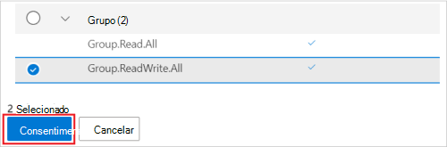
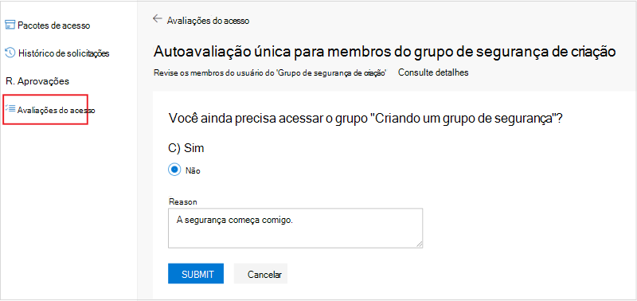

# <a name="tutorial-use-the-access-reviews-api-to-review-access-to-your-security-groups"></a>Tutorial: use a API de críticas de acesso para revisar o acesso aos seus grupos de segurança

Neste tutorial, você usará o Graph Explorer para revisar o acesso a um grupo de segurança em seu locatário.

Você pode usar Graph Explorer ou Postman para testar e testar suas chamadas de API de críticas de acesso antes de automatize-las em um script ou em um aplicativo. Isso economiza tempo ajudando você a definir e validar corretamente suas consultas sem recompilar repetidamente seu aplicativo.

>[!NOTE]
>Os objetos de resposta mostrados neste tutorial podem ser reduzidos para a capacidade de leitura.

## <a name="prerequisites"></a>Pré-requisitos

Para concluir este tutorial, você precisa dos seguintes recursos e privilégios:

+ Um locatário do Azure AD funcionando com uma licença Azure AD Premium P2 ou EMS E5 habilitada.
+ Entre no Graph [Explorer](https://developer.microsoft.com/graph/graph-explorer) como usuário em uma função de administrador global.
  + [Opcional] Inicie uma nova **sessão de navegador incógnita** ou **InPrivate** ou inicie uma sessão em um navegador anônimo. Você fará logoff mais adiante neste tutorial.
+ As seguintes permissões delegadas: `AccessReview.ReadWrite.All` , `Group.ReadWrite.All` .

Para consentir com as permissões necessárias no Graph Explorer:
1. Selecione o ícone de engrenagem de configurações à direita dos detalhes da conta do usuário e selecione **Selecionar permissões**.
   
   
   <!--:::image type="content" source="../images/../concepts/images/tutorial-accessreviews-api/settings.png" alt-text="Select the Microsoft Graph permissions":::-->

2. Role a lista de permissões para essas permissões:
   + AccessReview (3), expanda e selecione **AccessReview.ReadWrite.All**.
   + Grupo (2), expanda e selecione **Group.ReadWrite.All**.
  
    Selecione **Consentimento** e, na janela pop, escolha **Consentir** em  nome da sua organização e selecione Aceitar para aceitar o consentimento das permissões.
   
   
   <!--:::image type="content" source="../images/../concepts/images/tutorial-accessreviews-api/consentpermissions_M365.png" alt-text="Consent to the Microsoft Graph permissions":::-->

## <a name="step-1-create-test-users-in-your-tenant"></a>Etapa 1: Criar usuários de teste em seu locatário

Crie três novos usuários de teste executando a solicitação abaixo de três vezes, alterando as propriedades **displayName,** **mailNickname** e **userPrincipalName** sempre. Grave suas **IDs.**

### <a name="request"></a>Solicitação
<!-- {
  "blockType": "request",
  "name": "tutorial-accessreviews-Securitygroup-createUser"
}-->
```http
POST /users
Content-Type: application/json

{
    "accountEnabled": true,
    "displayName": "Aline Dupuy",
    "mailNickname": "AlineD",
    "userPrincipalName": "AlineD@contoso.com",
    "passwordProfile": {
        "forceChangePasswordNextSignIn": true,
        "password": "xWwvJ]6NMw+bWH-d"
    }
}
```

### <a name="response"></a>Resposta
<!-- {
  "blockType": "response",
  "truncated": true,
  "@odata.type": "microsoft.graph.user"
} -->

```http
HTTP/1.1 201 Created
Content-type: application/json

{
    "@odata.context": "https://graph.microsoft.com/beta/$metadata#users/$entity",
    "id": "43b12b0c-ee2c-4257-96fe-505d823e06ab",
    "displayName": "Aline Dupuy",
    "mailNickname": "AlineD",
    "userPrincipalName": "AlineD@contoso.com",
    "userType": "Member"
}
```

## <a name="step-2-create-a-security-group-assign-owners-and-add-members"></a>Etapa 2: criar um grupo de segurança, atribuir proprietários e adicionar membros

Crie um grupo de segurança chamado **Criando** um grupo de segurança que é o destino das análises de acesso neste tutorial. Atribua a esse grupo dois proprietários de grupo e dois membros. Esses membros serão objeto de revisão pelos proprietários do grupo.

### <a name="request"></a>Solicitação

Nesta chamada, substitua:
+ `010b2de0-0ed4-4ece-bfa2-22fff71d0497` e `b828cc0e-4240-46ed-bb25-888744487e2d` com **a id** s de seus dois proprietários de grupo.
  + Um dos **IDs** pertence a um dos usuários que você criou na Etapa 1.
  + A outra é sua **id.** Para recuperar sua **id,** execute `GET` em `https://graph.microsoft.com/beta/me` .
+ `43b12b0c-ee2c-4257-96fe-505d823e06ab` e `859924d0-7115-422a-9ee8-ea8c0c014707` com **as IDs** de vocês dois membros do grupo. Esses são os outros dois membros criados na Etapa 1.

<!-- {
  "blockType": "request",
  "name": "tutorial-accessreviews-Securitygroup-creategroup"
}-->
```http
POST https://graph.microsoft.com/beta/groups
Content-Type: application/json

{
    "description": "Building security group",
    "displayName": "Building security group",
    "groupTypes": [],
    "mailEnabled": false,
    "mailNickname": "buildingsecurity",
    "securityEnabled": true,
    "owners@odata.bind": [
        "https://graph.microsoft.com/beta/users/010b2de0-0ed4-4ece-bfa2-22fff71d0497",
        "https://graph.microsoft.com/beta/users/b828cc0e-4240-46ed-bb25-888744487e2d"
    ],
    "members@odata.bind": [
        "https://graph.microsoft.com/beta/users/43b12b0c-ee2c-4257-96fe-505d823e06ab",
        "https://graph.microsoft.com/beta/users/859924d0-7115-422a-9ee8-ea8c0c014707"
    ]
}
```

### <a name="response"></a>Resposta
<!-- {
  "blockType": "response",
  "truncated": true,
  "@odata.type": "microsoft.graph.group",
  "name": "create_group"
} -->

```http
HTTP/1.1 201 Created
Content-type: application/json

{
    "@odata.context": "https://graph.microsoft.com/beta/$metadata#groups/$entity",
    "id": "825f1b5e-6fb2-4d9a-b393-d491101acc0c",
    "displayName": "Building security group",
    "groupTypes": []
}
```
Na resposta, grave a **id** do novo grupo para usá-lo posteriormente neste tutorial.

## <a name="step-3-create-an-access-review-for-the-security-group"></a>Etapa 3: Criar uma revisão de acesso para o grupo de segurança

Crie uma revisão de acesso para membros do grupo de segurança, usando as seguintes configurações:
+ É uma revisão de acesso de autoavaliação. Nesse caso, os usuários sob revisão autotestam a necessidade de acesso ao grupo.
+ Esta é uma revisão de acesso único. Nesse caso, depois que o acesso for concedido, o usuário não precisará fazer o autoteste novamente dentro do período de revisão de acesso.
+ O escopo de revisão é limitado a membros do **grupo de segurança de criação.**

### <a name="request"></a>Solicitação

Nesta chamada, substitua o seguinte:
+ `825f1b5e-6fb2-4d9a-b393-d491101acc0c` com a **id de** **Criar grupo de segurança**.
+ O escopo especifica que a revisão é aplicada a todos os membros do grupo de segurança do **Building.** Para obter mais opções para configurar o escopo, consulte a [seção Consulte também.](#see-also)
+ Valor de **startDate** com a data de hoje e o valor de **endDate** com uma data de um ano a partir da data de início.

Ao não especificar o valor da propriedade **reviewers,** essa revisão de acesso é configurada como auto-revisão com os membros como revistores.

<!-- {
  "blockType": "request",
  "name": "tutorial-accessreviews-Securitygroup-create_accessReviewScheduleDefinition"
}-->
```http
POST https://graph.microsoft.com/beta/identityGovernance/accessReviews/definitions
Content-type: application/json

{
    "displayName": "One-time self-review for members of Building security group",
    "descriptionForAdmins": "One-time self-review for members of Building security group",
    "descriptionForReviewers": "One-time self-review for members of Building security group",
    "scope": {
        "query": "/groups/825f1b5e-6fb2-4d9a-b393-d491101acc0c/transitiveMembers",
        "queryType": "MicrosoftGraph"
    },
    "instanceEnumerationScope": {
        "query": "/groups/825f1b5e-6fb2-4d9a-b393-d491101acc0c",
        "queryType": "MicrosoftGraph"
    },
    "reviewers": [],
    "settings": {
        "mailNotificationsEnabled": true,
        "reminderNotificationsEnabled": true,
        "justificationRequiredOnApproval": true,
        "defaultDecisionEnabled": false,
        "defaultDecision": "Deny",
        "instanceDurationInDays": 0,
        "autoApplyDecisionsEnabled": true,
        "recommendationsEnabled": true,
        "recurrence": {
            "pattern": null,
            "range": {
                "type": "numbered",
                "numberOfOccurrences": 0,
                "recurrenceTimeZone": null,
                "startDate": "2021-02-09",
                "endDate": "2022-12-31"
            }
        },
        "applyActions": [
            {
                "@odata.type": "#microsoft.graph.removeAccessApplyAction"
            }
        ]
    }
}
```

### <a name="response"></a>Resposta
<!-- {
  "blockType": "response",
  "truncated": true,
  "@odata.type": "microsoft.graph.accessReviewScheduleDefinition"
} -->

```http
HTTP/1.1 201 Created
Content-type: application/json

{
    "@odata.context": "https://graph.microsoft.com/beta/$metadata#identityGovernance/accessReviews/definitions/$entity",
    "id": "d7286a17-3a01-406a-b872-986b6b40317c",
    "displayName": "One-time self-review for members of Building security group",
    "status": "NotStarted",
    "createdBy": {
        "id": "b828cc0e-4240-46ed-bb25-888744487e2d",
        "displayName": "MOD Administrator",
        "userPrincipalName": "admin@contoso.com"
    },
    "scope": {
        "query": "/groups/825f1b5e-6fb2-4d9a-b393-d491101acc0c/transitiveMembers",
        "queryType": "MicrosoftGraph"
    },
    "instanceEnumerationScope": {
        "query": "/groups/825f1b5e-6fb2-4d9a-b393-d491101acc0c",
        "queryType": "MicrosoftGraph"
    },
    "reviewers": [],
    "backupReviewers": [],
    "settings": {
        "defaultDecisionEnabled": false,
        "defaultDecision": "Deny",
        "autoApplyDecisionsEnabled": true,
        "recommendationsEnabled": true,
        "recurrence": {
            "pattern": null,
            "range": {
                "type": "numbered",
                "numberOfOccurrences": 0,
                "recurrenceTimeZone": null,
                "startDate": "2021-02-09",
                "endDate": "2022-12-31"
            }
        },
        "applyActions": [
            {
                "@odata.type": "#microsoft.graph.removeAccessApplyAction"
            }
        ]
    }
}
```

## <a name="step-4-list-instances-of-the-access-review"></a>Etapa 4: Listar instâncias da revisão de acesso

A consulta a seguir lista todas as instâncias da definição de revisão de acesso. Como você criou uma revisão de acesso único na Etapa 3, a solicitação retorna apenas uma instância cuja **id** é a mesma que a id da definição de **acesso.**

### <a name="request"></a>Solicitação

Nesta chamada, substitua pela id da definição de revisão de `d7286a17-3a01-406a-b872-986b6b40317c` acesso retornada na Etapa 3. 

<!-- {
  "blockType": "request",
  "name": "tutorial-accessreviews-Securitygroup-list_accessReviewInstance"
}-->
```http
GET https://graph.microsoft.com/beta/identityGovernance/accessReviews/definitions/d7286a17-3a01-406a-b872-986b6b40317c/instances
```

### <a name="response"></a>Resposta

Nesta resposta, o **status** da instância de revisão de acesso é porque `InProgress` **startDateTime** é passado e **endDateTime** está no futuro. Se **startDateTime** estiver no futuro, o status será `NotStarted` . Por outro lado, se **endDateTime** estiver no passado, o status será `Completed` .

<!-- {
  "blockType": "response",
  "truncated": true,
  "@odata.type": "microsoft.graph.accessReviewInstance",
  "isCollection": "true"
} -->
```http
HTTP/1.1 200 OK
Content-type: application/json

{
    "@odata.context": "https://graph.microsoft.com/beta/$metadata#identityGovernance/accessReviews/definitions('d7286a17-3a01-406a-b872-986b6b40317c')/instances",
    "value": [
        {
            "id": "d7286a17-3a01-406a-b872-986b6b40317c",
            "startDateTime": "2021-02-10T15:09:40.153Z",
            "endDateTime": "2022-12-31T08:00:00Z",
            "status": "InProgress",
            "scope": {
                "query": "/groups/825f1b5e-6fb2-4d9a-b393-d491101acc0c/transitiveMembers",
                "queryType": "MicrosoftGraph"
            }
        }
    ]
}
```

## <a name="step-5-get-decisions"></a>Etapa 5: Obter decisões

Você está interessado nas decisões tomadas para a instância da revisão de acesso.

### <a name="request"></a>Solicitação

Nesta chamada, substitua pela id da definição de revisão de `d7286a17-3a01-406a-b872-986b6b40317c` acesso retornada na Etapa 3. 

<!-- {
  "blockType": "request",
  "name": "tutorial-accessreviews-Securitygroup-list_accessReviewInstanceDecisionItem"
}-->
```http
GET https://graph.microsoft.com/beta/identityGovernance/accessReviews/definitions/d7286a17-3a01-406a-b872-986b6b40317c/instances/d7286a17-3a01-406a-b872-986b6b40317c/decisions
```

### <a name="response"></a>Resposta

A resposta a seguir mostra a decisão tomada para a instância da revisão.

<!-- {
  "blockType": "response",
  "truncated": true,
  "@odata.type": "microsoft.graph.accessReviewInstanceDecisionItem",
  "isCollection": "true"
} -->
```http
HTTP/1.1 200 OK
Content-type: application/json

{
    "@odata.context": "https://graph.microsoft.com/beta/$metadata#identityGovernance/accessReviews/definitions('d7286a17-3a01-406a-b872-986b6b40317c')/instances('d7286a17-3a01-406a-b872-986b6b40317c')/decisions",
    "@odata.count": 2,
    "value": [
        {
            "id": "1c74f500-9082-4dfe-80ac-784a6edb71d7",
            "accessReviewId": "d7286a17-3a01-406a-b872-986b6b40317c",
            "decision": "NotReviewed",
            "applyResult": "New",
            "recommendation": "Approve",
            "reviewedBy": {
                "id": "00000000-0000-0000-0000-000000000000",
                "displayName": "",
                "userPrincipalName": ""
            },
            "appliedBy": {
                "id": "00000000-0000-0000-0000-000000000000",
                "displayName": "",
                "userPrincipalName": ""
            },
            "target": {
                "@odata.type": "#microsoft.graph.accessReviewInstanceDecisionItemUserTarget",
                "userId": "43b12b0c-ee2c-4257-96fe-505d823e06ab",
                "userDisplayName": "Alex Wilber",
                "userPrincipalName": "AlexW@contoso.com"
            },
            "principal": {
                "@odata.type": "#microsoft.graph.userIdentity",
                "id": "43b12b0c-ee2c-4257-96fe-505d823e06ab",
                "displayName": "Alex Wilber",
                "userPrincipalName": "AlexW@contoso.com"
            }
        },
        {
            "id": "7744be81-7d17-40c9-8fd3-c9072b1ccace",
            "accessReviewId": "d7286a17-3a01-406a-b872-986b6b40317c",
            "decision": "NotReviewed",
            "applyResult": "New",
            "recommendation": "Approve",
            "reviewedBy": {
                "id": "00000000-0000-0000-0000-000000000000",
                "displayName": "",
                "userPrincipalName": ""
            },
            "appliedBy": {
                "id": "00000000-0000-0000-0000-000000000000",
                "displayName": "",
                "userPrincipalName": ""
            },
            "target": {
                "@odata.type": "#microsoft.graph.accessReviewInstanceDecisionItemUserTarget",
                "userId": "859924d0-7115-422a-9ee8-ea8c0c014707",
                "userDisplayName": "Allan Deyoung",
                "userPrincipalName": "AllanD@contoso.com"
            },
            "principal": {
                "@odata.type": "#microsoft.graph.userIdentity",
                "id": "859924d0-7115-422a-9ee8-ea8c0c014707",
                "displayName": "Allan Deyoung",
                "userPrincipalName": "AllanD@contoso.com"
            }
        }
    ]
}
```

Na chamada, a **propriedade decision** tem o valor de `NotReviewed` . Isso porque nenhum dos dois membros concluiu seu autoteste. Siga a etapa 6 para saber como cada membro pode autotestar sua necessidade de revisão de acesso.

## <a name="step-6-self-review-your-pending-access"></a>Etapa 6: revisar seu acesso pendente

Na Etapa 3, você configurou a revisão de acesso como uma autoavaliação. Isso significa que ambos os membros do **Grupo de** Segurança de Criação devem autotestar a necessidade de manter o acesso ao grupo. Você concluirá esta etapa como um dos dois membros do grupo de segurança do Building.

In this step, you will:
1. Listar suas instâncias de revisão de acesso pendentes.
2. Conclua o processo de autoteste de revisão de acesso.

Inicie uma nova sessão de navegador no modo de navegação **incógnito** ou **InPrivate** ou por meio de um navegador anônimo e faça logon como um dos dois membros do grupo de segurança **de Criação.** Ao fazer isso, você não interromperá sua sessão atual como usuário na função de administrador global. Como alternativa, você pode interromper sua sessão atual fazendo logon no Graph Explorer e fazendo logon de volta como um dos dois membros do grupo.

### <a name="list-your-pending-access-review-instances"></a>Listar suas instâncias de revisão de acesso pendentes

Na sessão de navegador incógnito e no Graph Explorer, execute a seguinte consulta para listar suas instâncias de revisão de acesso pendentes:

#### <a name="request"></a>Solicitação

```http
GET /me/pendingAccessReviewInstances
```

#### <a name="response"></a>Resposta
Na resposta abaixo, o usuário Alex Wilber da **id** tem 1 revisão de acesso pendente para `43b12b0c-ee2c-4257-96fe-505d823e06ab` autoteste.

```http
HTTP/1.1 200 OK
Content-type: application/json

{
    "@odata.context": "https://graph.microsoft.com/beta/$metadata#users('43b12b0c-ee2c-4257-96fe-505d823e06ab')/pendingAccessReviewInstances",
    "@odata.count": 1,
    "value": [
        {
            "id": "d7286a17-3a01-406a-b872-986b6b40317c",
            "startDateTime": "2021-02-10T15:09:40.153Z",
            "endDateTime": "2022-12-31T08:00:00Z",
            "status": "InProgress",
            "scope": {
                "query": "/groups/825f1b5e-6fb2-4d9a-b393-d491101acc0c/transitiveMembers",
                "queryType": "MicrosoftGraph"
            }
        }
    ]
}
```
O uso da `/me/pendingAccessReviewInstances` chamada em um contexto de usuário tem várias vantagens:
+ Nenhuma entidade de serviço é necessária. Um usuário pode chamar e ler suas ações pendentes de revisão de acesso.
+ Pode ser usado por widgets ou plug-ins em uma página da Intranet, ou um bot ou daemon que são executados como um serviço em segundo plano. Eles podem notificá-lo sobre novas avaliações de acesso ou de atualizações para acessar avaliações. 

### <a name="complete-the-access-review-self-attestation"></a>Concluir o autoteste de revisão de acesso

Na mesma sessão de navegador incógnito, faça logon para https://myaccess.microsoft.com/ concluir o autoteste. Na barra de navegação direita, selecione **críticas de acesso e** escolha sua revisão de acesso. Selecione **Sim**, que você ainda precisa acessar a Criação de grupo **de segurança**, insira um motivo e clique em **Enviar**.

   
   <!--:::image type="content" source="../images/../concepts/images/tutorial-accessreviews-api/selfattest.png" alt-text="Self-attest to access review":::-->

Agora você pode fazer logout e sair da sessão do navegador anônimo.

De volta à sessão principal do navegador onde você ainda está conectado como o  usuário de administrador global, repita a Etapa 4 para ver se a propriedade de decisão do membro que concluiu a etapa 5 agora é `Approve` .

Parabéns! Você criou uma revisão de acesso e autotestou a necessidade de acesso. Você só faz isso uma vez e mantém o acesso até quando a definição de revisão de acesso expirar.

## <a name="step-7-clean-up-resources"></a>Etapa 7: Limpar recursos

Exclua os recursos criados para este tutorial: Criar grupo **de segurança,** a definição do agendamento de revisão de acesso e os três usuários de teste..

### <a name="delete-the-security-group"></a>Excluir o grupo de segurança

#### <a name="request"></a>Solicitação

Nesta chamada, substitua `825f1b5e-6fb2-4d9a-b393-d491101acc0c` pela **id** do grupo de segurança **de criação.**

<!-- {
  "blockType": "request",
  "name": "tutorial-accessreviews-Securitygroup-delete_group"
}-->
```http
DELETE https://graph.microsoft.com/beta/groups/825f1b5e-6fb2-4d9a-b393-d491101acc0c
```

#### <a name="response"></a>Resposta
<!-- {
  "blockType": "response",
  "truncated": false
} -->

```http
HTTP/1.1 204 No Content
Content-type: text/plain
```

### <a name="delete-the-access-review-definition"></a>Excluir a definição de revisão de acesso

Nesta chamada, substitua pela id da `d7286a17-3a01-406a-b872-986b6b40317c` **sua definição** de revisão de acesso. Como a definição de agenda de revisão de acesso é o modelo para a revisão de acesso, excluir a definição removerá as configurações, instâncias e decisões associadas à revisão de acesso.

#### <a name="request"></a>Solicitação
<!-- {
  "blockType": "request",
  "name": "tutorial-accessreviews-Securitygroup-delete_accessReviewScheduleDefinition"
}-->
```http
DELETE https://graph.microsoft.com/beta/identityGovernance/accessReviews/definitions/d7286a17-3a01-406a-b872-986b6b40317c
```

#### <a name="response"></a>Resposta
<!-- {
  "blockType": "response",
  "truncated": false
} -->
```http
HTTP/1.1 204 No Content
Content-type: text/plain
```

### <a name="delete-the-three-test-users"></a>Excluir os três usuários de teste
Nesta chamada, substitua `43b12b0c-ee2c-4257-96fe-505d823e06ab` pela **id do** usuário de teste. Repita isso duas vezes **com a id** s dos outros dois usuários para excluí-los.

#### <a name="request"></a>Solicitação

<!-- {
  "blockType": "request",
  "name": "tutorial-accessreviews-Securitygroup-delete_user"
}-->
```http
DELETE https://graph.microsoft.com/beta/users/43b12b0c-ee2c-4257-96fe-505d823e06ab
```

#### <a name="response"></a>Resposta
<!-- {
  "blockType": "response",
  "truncated": true
} -->
```http
HTTP/1.1 204 No Content
Content-type: text/plain
```


## <a name="see-also"></a>Confira também

+ [Referência da API de avaliações do Access](/graph/api/resources/accessreviewsv2-root?view=graph-rest-beta&preserve-view=true)
+ [Configurar o escopo de sua definição de revisão de acesso usando a API Graph Microsoft](/graph/accessreviews-scope-concept)
+ [Visão geral de avaliações do Access e requisitos de licença](/azure/active-directory/governance/access-reviews-overview)
+ [Criar uma revisão de acesso de grupos & aplicativos](/azure/active-directory/governance/create-access-review)
+ [access reviews API Reference](/graph/api/resources/accessreviewsv2-root?view=graph-rest-beta&preserve-view=true)
+ [Criar accessReviewScheduleDefinition](/graph/api/accessreviewscheduledefinition-create?view=graph-rest-beta&preserve-view=true)
+ [Listar accessReviewInstance](/graph/api/accessreviewinstance-list?view=graph-rest-beta&preserve-view=true)
+ [Listar accessReviewInstanceDecisionItem](/graph/api/accessreviewinstancedecisionitem-list?view=graph-rest-beta&preserve-view=true)
