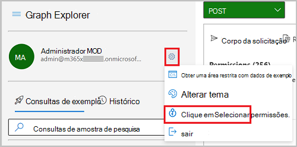
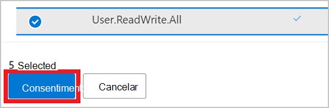
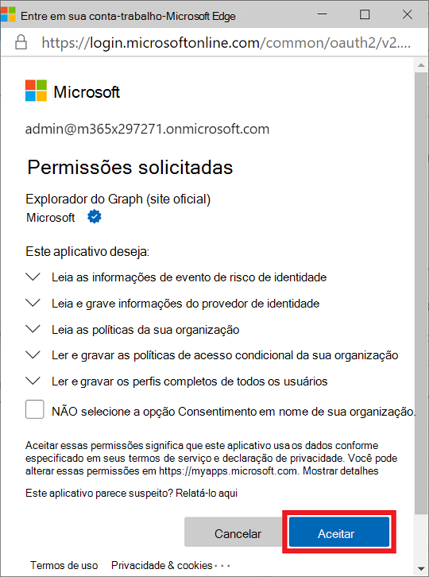
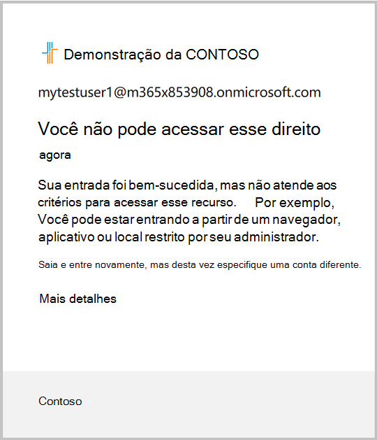

# <a name="tutorial-identify-and-remediate-risks-using-microsoft-graph-apis"></a><span data-ttu-id="390be-103">Tutorial: identificar e correção de riscos usando APIs do Microsoft Graph</span><span class="sxs-lookup"><span data-stu-id="390be-103">Tutorial: Identify and remediate risks using Microsoft Graph APIs</span></span>

<span data-ttu-id="390be-104">A Proteção de Identidade do Azure AD fornece às organizações informações sobre riscos baseados em identidade e diferentes maneiras de investigar e correção automática de riscos.</span><span class="sxs-lookup"><span data-stu-id="390be-104">Azure AD Identity Protection provides organizations insight into identity-based risk and different ways to investigate and automatically remediate risk.</span></span> <span data-ttu-id="390be-105">As APIs de Proteção de Identidade usadas neste tutorial podem ajudá-lo a identificar riscos e configurar um fluxo de trabalho para confirmar o comprometimento ou habilitar a correção.</span><span class="sxs-lookup"><span data-stu-id="390be-105">The Identity Protection APIs used in this tutorial can help you identify risk and configure a workflow to confirm compromise or enable remediation.</span></span> <span data-ttu-id="390be-106">Para obter mais informações, consulte [O que é risco?](/azure/active-directory/identity-protection/concept-identity-protection-risks)</span><span class="sxs-lookup"><span data-stu-id="390be-106">For more information, see [What is risk?](/azure/active-directory/identity-protection/concept-identity-protection-risks)</span></span>

<span data-ttu-id="390be-107">Neste tutorial, você aprenderá a gerar uma entrada arriscada e correção do status de risco do usuário com uma política de acesso condicional que requer autenticação multifacional (MFA).</span><span class="sxs-lookup"><span data-stu-id="390be-107">In this tutorial, you learn how to generate a risky sign-in and remediate the risk status of the user with a conditional access policy that requires multi-factor authentication (MFA).</span></span> <span data-ttu-id="390be-108">Uma seção opcional mostra como impedir que o usuário entre também usando uma política de acesso condicional e descartando o risco do usuário.</span><span class="sxs-lookup"><span data-stu-id="390be-108">An optional section shows you how to block the user from signing in also using a conditional access policy, and dismissing the user risk.</span></span>

><span data-ttu-id="390be-109">**Observação:** Os objetos de resposta mostrados neste tutorial podem ser reduzidos para a capacidade de leitura.</span><span class="sxs-lookup"><span data-stu-id="390be-109">**Note:** The response objects shown in this tutorial might be shortened for readability.</span></span> 

## <a name="prerequisites"></a><span data-ttu-id="390be-110">Pré-requisitos</span><span class="sxs-lookup"><span data-stu-id="390be-110">Prerequisites</span></span>

<span data-ttu-id="390be-111">Para concluir com êxito este tutorial, certifique-se de que você tem os pré-requisitos necessários:</span><span class="sxs-lookup"><span data-stu-id="390be-111">To successfully complete this tutorial, make sure that you have the required prerequisites:</span></span>

- <span data-ttu-id="390be-112">Você deve ter uma licença do Azure AD Premium P1 ou P2 para usar a API de detecção de riscos.</span><span class="sxs-lookup"><span data-stu-id="390be-112">You must have an Azure AD Premium P1 or P2 license to use the risk detection API.</span></span>
- <span data-ttu-id="390be-113">Este tutorial usa o navegador Tor para entrar no portal do Azure anonimamente.</span><span class="sxs-lookup"><span data-stu-id="390be-113">This tutorial uses the Tor browser to sign in to the Azure portal anonymously.</span></span> <span data-ttu-id="390be-114">Você pode usar qualquer navegador anônimo para realizar a tarefa.</span><span class="sxs-lookup"><span data-stu-id="390be-114">You can use any anonymous browser to accomplish the task.</span></span> <span data-ttu-id="390be-115">Para baixar o navegador Tor, consulte [Download Tor Browser](https://www.torproject.org/download/).</span><span class="sxs-lookup"><span data-stu-id="390be-115">To download the Tor browser, see [Download Tor Browser](https://www.torproject.org/download/).</span></span>
- <span data-ttu-id="390be-116">Este tutorial assume que você está usando o Microsoft Graph Explorer, mas você pode usar o Postman ou criar seu próprio aplicativo cliente para chamar o Microsoft Graph.</span><span class="sxs-lookup"><span data-stu-id="390be-116">This tutorial assumes that you are using Microsoft Graph Explorer, but you can use Postman, or create your own client app to call Microsoft Graph.</span></span> <span data-ttu-id="390be-117">Para chamar as APIs do Microsoft Graph neste tutorial, você precisa usar uma conta com a função de administrador global e as permissões apropriadas.</span><span class="sxs-lookup"><span data-stu-id="390be-117">To call the Microsoft Graph APIs in this tutorial, you need to use an account with the global administrator role and the appropriate permissions.</span></span> <span data-ttu-id="390be-118">Conclua as seguintes etapas para definir as permissões no Microsoft Graph Explorer:</span><span class="sxs-lookup"><span data-stu-id="390be-118">Complete the following steps to set permissions in Microsoft Graph Explorer:</span></span>
    1. <span data-ttu-id="390be-119">Inicie o [Microsoft Graph Explorer](https://developer.microsoft.com/graph/graph-explorer).</span><span class="sxs-lookup"><span data-stu-id="390be-119">Start [Microsoft Graph Explorer](https://developer.microsoft.com/graph/graph-explorer).</span></span>
    2. <span data-ttu-id="390be-120">Selecione **Entrar com a conta da Microsoft** e entre usando uma conta de administrador global do Azure AD.</span><span class="sxs-lookup"><span data-stu-id="390be-120">Select **Sign-In with Microsoft** and sign in using an Azure AD global administrator account.</span></span> <span data-ttu-id="390be-121">Uma vez acessado, você verá os detalhes da conta do usuário no painel esquerdo.</span><span class="sxs-lookup"><span data-stu-id="390be-121">After you successfully sign in, you can see the user account details in the left-hand pane.</span></span>
    3. <span data-ttu-id="390be-122">Selecione o ícone de configurações à direita dos detalhes da conta do usuário e, em seguida, selecione **Selecionar permissões**.</span><span class="sxs-lookup"><span data-stu-id="390be-122">Select the settings icon to the right of the user account details, and then select **Select permissions**.</span></span>

        
        
    4. <span data-ttu-id="390be-124">Role a lista de permissões para essas permissões:</span><span class="sxs-lookup"><span data-stu-id="390be-124">Scroll through the list of permissions to these permissions:</span></span>
        - <span data-ttu-id="390be-125">**IdentityRiskEvents (2)**, expanda e selecione `IdentityRiskEvent.Read.All`</span><span class="sxs-lookup"><span data-stu-id="390be-125">**IdentityRiskEvents (2)**, expand and then select `IdentityRiskEvent.Read.All`</span></span>
        - <span data-ttu-id="390be-126">**IdentityRiskyUser (2)**, expanda e selecione `IdentityRiskyUser.ReadWrite.All`</span><span class="sxs-lookup"><span data-stu-id="390be-126">**IdentityRiskyUser (2)**, expand and then select `IdentityRiskyUser.ReadWrite.All`</span></span>
        - <span data-ttu-id="390be-127">**Política (13)**, expandir e selecionar `Policy.Read.All` e `Policy.ReadWrite.ConditionalAccess`</span><span class="sxs-lookup"><span data-stu-id="390be-127">**Policy (13)**, expand and then select `Policy.Read.All` and `Policy.ReadWrite.ConditionalAccess`</span></span>
        - <span data-ttu-id="390be-128">**Usuário (8)**, expanda e selecione `User.ReadWrite.All`</span><span class="sxs-lookup"><span data-stu-id="390be-128">**User (8)**, expand and then select `User.ReadWrite.All`</span></span>
        
        
    
    5. <span data-ttu-id="390be-130">Selecione **Consentimento** e, em seguida, selecione **Aceitar** para aceitar o consentimento das permissões.</span><span class="sxs-lookup"><span data-stu-id="390be-130">Select **Consent**, and then select **Accept** to accept the consent of the permissions.</span></span> <span data-ttu-id="390be-131">Você não precisa consentir em nome da organização para essas permissões.</span><span class="sxs-lookup"><span data-stu-id="390be-131">You do not need to consent on behalf of your organization for these permissions.</span></span>

        

## <a name="step-1-create-a-user-account"></a><span data-ttu-id="390be-133">Etapa 1: Criar uma conta de usuário</span><span class="sxs-lookup"><span data-stu-id="390be-133">Step 1: Create a user account</span></span>

<span data-ttu-id="390be-134">Para este tutorial, você cria uma conta de usuário usada para testar detecções de risco.</span><span class="sxs-lookup"><span data-stu-id="390be-134">For this tutorial, you create a user account that is used to test risk detections.</span></span> <span data-ttu-id="390be-135">No corpo da solicitação, `contoso.com` altere para o nome de domínio do locatário.</span><span class="sxs-lookup"><span data-stu-id="390be-135">In the request body, change `contoso.com` to the domain name of your tenant.</span></span> <span data-ttu-id="390be-136">Encontre informações sobre locatários na página de visão geral do Azure Active Directory.</span><span class="sxs-lookup"><span data-stu-id="390be-136">You can find tenant information on the Azure Active Directory overview page.</span></span>

### <a name="request"></a><span data-ttu-id="390be-137">Solicitação</span><span class="sxs-lookup"><span data-stu-id="390be-137">Request</span></span>

``` http
POST https://graph.microsoft.com/v1.0/users
Content-type: application/json

{
  "accountEnabled":true,
  "displayName":"MyTestUser1",
  "mailNickname":"MyTestUser1",
  "userPrincipalName":"MyTestUser1@contoso.com",
  "passwordProfile": {
    "forceChangePasswordNextSignIn":true,
    "password":"Contoso1234"
  }
}
```

### <a name="response"></a><span data-ttu-id="390be-138">Resposta</span><span class="sxs-lookup"><span data-stu-id="390be-138">Response</span></span>

```http
{
  "@odata.context": "https://graph.microsoft.com/v1.0/$metadata#users/$entity",
  "id": "4628e7df-dff3-407c-a08f-75f08c0806dc",
  "businessPhones": [],
  "displayName": "MyTestUser1",
  "givenName": null,
  "jobTitle": null,
  "mail": null,
  "mobilePhone": null,
  "officeLocation": null,
  "preferredLanguage": null,
  "surname": null,
  "userPrincipalName": "MyTestUser1@contoso.com"
}
```

## <a name="step-2-trigger-a-risk-detection"></a><span data-ttu-id="390be-139">Etapa 2: disparar uma detecção de risco</span><span class="sxs-lookup"><span data-stu-id="390be-139">Step 2: Trigger a risk detection</span></span>

### <a name="trigger-a-risk-detection"></a><span data-ttu-id="390be-140">Disparar uma detecção de risco</span><span class="sxs-lookup"><span data-stu-id="390be-140">Trigger a risk detection</span></span>

<span data-ttu-id="390be-141">Uma maneira de disparar uma detecção de risco em uma conta de usuário é entrar no portal do Azure anonimamente.</span><span class="sxs-lookup"><span data-stu-id="390be-141">One way to trigger a risk detection on a user account is to sign in to the Azure portal anonymously.</span></span> <span data-ttu-id="390be-142">Neste tutorial, o navegador Tor é usado para entrar anonimamente.</span><span class="sxs-lookup"><span data-stu-id="390be-142">In this tutorial, the Tor browser is used to sign in anonymously.</span></span> 

1. <span data-ttu-id="390be-143">Abra o navegador e insira `portal.azure.com` o endereço do site.</span><span class="sxs-lookup"><span data-stu-id="390be-143">Open the browser and enter `portal.azure.com` for the site address.</span></span>
2. <span data-ttu-id="390be-144">Entre no portal usando as credenciais da **conta MyTestUser1** criada anteriormente.</span><span class="sxs-lookup"><span data-stu-id="390be-144">Sign in to the portal using the credentials for the **MyTestUser1** account that you previously created.</span></span> <span data-ttu-id="390be-145">Você será solicitado a alterar a senha existente.</span><span class="sxs-lookup"><span data-stu-id="390be-145">You will be asked to change the existing password.</span></span>

### <a name="list-risk-detections"></a><span data-ttu-id="390be-146">Listar detecções de risco</span><span class="sxs-lookup"><span data-stu-id="390be-146">List risk detections</span></span>

<span data-ttu-id="390be-147">Quando você se inscreveu no portal do Azure usando o navegador anônimo, um evento `anonymizedIPAddress` de risco foi detectado.</span><span class="sxs-lookup"><span data-stu-id="390be-147">When you signed in to the Azure portal using the anonymous browser, an `anonymizedIPAddress` risk event was detected.</span></span> <span data-ttu-id="390be-148">Você pode usar o parâmetro de consulta para obter apenas as detecções de risco associadas à conta de usuário `$filter` **MyTestUser1.**</span><span class="sxs-lookup"><span data-stu-id="390be-148">You can use the `$filter` query parameter to get only the risk detections that are associated with the **MyTestUser1** user account.</span></span>

#### <a name="request"></a><span data-ttu-id="390be-149">Solicitação</span><span class="sxs-lookup"><span data-stu-id="390be-149">Request</span></span>

``` http
GET https://graph.microsoft.com/v1.0/identityProtection/riskDetections?$filter=userDisplayName eq 'MyTestUser1'
```

#### <a name="response"></a><span data-ttu-id="390be-150">Resposta</span><span class="sxs-lookup"><span data-stu-id="390be-150">Response</span></span>

```http
{
  "@odata.context": "https://graph.microsoft.com/v1.0/$metadata#riskDetections",
  "value": [
    {
      "id": "d52a631815aaa527bf642b196715da5cf0f35b6879204ea5b5c99b21bd4c16f4",
      "requestId": "06f7fd18-b8f1-407d-86a3-f6cbe3a4be00",
      "correlationId": "2a38abff-5701-4073-a81e-fd3aac09cba3",
      "riskType": "anonymizedIPAddress",
      "riskEventType": "anonymizedIPAddress",
      "riskState": "atRisk",
      "riskLevel": "medium",
      "riskDetail": "none",
      "source": "IdentityProtection",
      "detectionTimingType": "realtime",
      "activity": "signin",
      "tokenIssuerType": "AzureAD",
      "ipAddress": "178.17.170.23",
      "activityDateTime": "2020-11-03T20:51:34.6245276Z",
      "detectedDateTime": "2020-11-03T20:51:34.6245276Z",
      "lastUpdatedDateTime": "2020-11-03T20:53:12.1984203Z",
      "userId": "4628e7df-dff3-407c-a08f-75f08c0806dc",
      "userDisplayName": "MyTestUser1",
      "userPrincipalName": "MyTestUser1@contoso.com",
      "additionalInfo": "[{\"Key\":\"userAgent\",\"Value\":\"Mozilla/5.0 (Windows NT 10.0; rv:78.0) Gecko/20100101 Firefox/78.0\"}]",
      "location": {
        "city": "Chisinau",
        "state": "Chisinau",
        "countryOrRegion": "MD",
        "geoCoordinates": {
          "latitude": 47.0269,
          "longitude": 28.8416
        }
      }
    }
  ]
}
```

> <span data-ttu-id="390be-151">**Observação:** Pode levar alguns minutos para que o evento seja retornado.</span><span class="sxs-lookup"><span data-stu-id="390be-151">**Note:** It may take a few minutes for the event to be returned.</span></span>

## <a name="step-3-create-a-conditional-access-policy"></a><span data-ttu-id="390be-152">Etapa 3: Criar uma política de acesso condicional</span><span class="sxs-lookup"><span data-stu-id="390be-152">Step 3: Create a conditional access policy</span></span>

<span data-ttu-id="390be-153">Você pode aproveitar políticas de acesso condicional em sua organização para permitir que os usuários se automediam quando o risco é detectado.</span><span class="sxs-lookup"><span data-stu-id="390be-153">You can leverage conditional access policies in your organization to allow users to self-remediate when risk is detected.</span></span> <span data-ttu-id="390be-154">A automediação permite que os usuários desbloqueiem a si mesmos para acessar seus recursos com segurança depois de concluir o prompt de política.</span><span class="sxs-lookup"><span data-stu-id="390be-154">Self-remediation enables your users to unblock themselves to access their resources securely after completing the policy prompt.</span></span> <span data-ttu-id="390be-155">Nesta etapa, você cria uma política de acesso condicional que exige que o usuário entre usando o MFA se ocorrer uma detecção de médio ou alto risco.</span><span class="sxs-lookup"><span data-stu-id="390be-155">In this step, you create a conditional access policy that requires the user to sign in using MFA if a medium or high risk detection occurs.</span></span>

### <a name="set-up-multi-factor-authentication"></a><span data-ttu-id="390be-156">Configurar a autenticação multifator</span><span class="sxs-lookup"><span data-stu-id="390be-156">Set up multi-factor authentication</span></span>

<span data-ttu-id="390be-157">Ao configurar uma conta para MFA, você pode escolher entre vários métodos para autenticar o usuário.</span><span class="sxs-lookup"><span data-stu-id="390be-157">When setting up an account for MFA, you can choose from several methods for authenticating the user.</span></span> <span data-ttu-id="390be-158">Escolha o melhor método para que sua situação conclua este tutorial.</span><span class="sxs-lookup"><span data-stu-id="390be-158">Choose the best method for your situation to complete this tutorial.</span></span> 

1. <span data-ttu-id="390be-159">Entre no site para manter [sua](https://aka.ms/MFASetup) conta segura usando a **conta MyTestUser1.**</span><span class="sxs-lookup"><span data-stu-id="390be-159">Sign in the to the [keep your account secure](https://aka.ms/MFASetup) site using the **MyTestUser1** account.</span></span>
2. <span data-ttu-id="390be-160">Conclua o procedimento de instalação do MFA usando o método apropriado para sua situação, como ter uma mensagem de texto enviada para seu telefone.</span><span class="sxs-lookup"><span data-stu-id="390be-160">Complete the MFA setup procedure using the appropriate method for your situation, such as having a text message sent to your phone.</span></span>

### <a name="create-the-conditional-access-policy"></a><span data-ttu-id="390be-161">Criar a política de acesso condicional</span><span class="sxs-lookup"><span data-stu-id="390be-161">Create the conditional access policy</span></span>

<span data-ttu-id="390be-162">A política de acesso condicional fornece a capacidade de definir as condições da política para identificar níveis de risco de entrada.</span><span class="sxs-lookup"><span data-stu-id="390be-162">The conditional access policy provides the ability to set the conditions of the policy to identify sign-in risk levels.</span></span> <span data-ttu-id="390be-163">Os níveis de risco `low` podem ser , , , `medium` `high` `none` .</span><span class="sxs-lookup"><span data-stu-id="390be-163">Risk levels can be `low`, `medium`, `high`, `none`.</span></span> <span data-ttu-id="390be-164">Na resposta que foi retornada da listagem das detecções de risco para **MyTestUser1,** podemos ver que o nível de risco é `medium` .</span><span class="sxs-lookup"><span data-stu-id="390be-164">In the response that was returned from listing the risk detections for **MyTestUser1**, we can see that the risk level is `medium`.</span></span> <span data-ttu-id="390be-165">Este exemplo mostra como exigir MFA para **MyTestUser1** que foi identificado como um usuário arriscado.</span><span class="sxs-lookup"><span data-stu-id="390be-165">This example shows how to require MFA for **MyTestUser1** who was identified as a risky user.</span></span>

#### <a name="request"></a><span data-ttu-id="390be-166">Solicitação</span><span class="sxs-lookup"><span data-stu-id="390be-166">Request</span></span> 

```http
POST https://graph.microsoft.com/v1.0/identity/conditionalAccess/policies 
Content-type: application/json
 
{ 
  "displayName": "Policy for risky sign-in", 
  "state": "enabled", 
  "conditions": { 
    "signInRiskLevels": [ 
      "high", 
      "medium" 
    ], 
    "applications": { 
      "includeApplications": ["All"]
    }, 
    "users": { 
      "includeUsers": [ 
        "4628e7df-dff3-407c-a08f-75f08c0806dc" 
      ] 
    } 
  }, 
  "grantControls": { 
    "operator": "OR", 
    "builtInControls": [ 
      "mfa" 
    ] 
  } 
} 
```

#### <a name="response"></a><span data-ttu-id="390be-167">Resposta</span><span class="sxs-lookup"><span data-stu-id="390be-167">Response</span></span> 

```
{ 
  "@odata.context": "https://graph.microsoft.com/v1.0/$metadata#identity/conditionalAccess/policies/$entity", 
  "id": "9ad78153-b1f8-4714-adc1-1445727678a8", 
  "displayName": "Policy for risky sign-in", 
  "createdDateTime": "2020-11-03T20:56:38.6210843Z", 
  "modifiedDateTime": null, 
  "state": "enabled", 
  "sessionControls": null, 
  "conditions": { 
    "signInRiskLevels": [ 
      "high", 
      "medium" 
    ], 
    "clientAppTypes": [  
      "all"  
    ], 
    "platforms": null, 
    "locations": null, 
    "applications": { 
      "includeApplications": [ 
        "All" 
      ], 
      "excludeApplications": [], 
      "includeUserActions": [] 
    }, 
    "users": { 
      "includeUsers": [ 
        "4628e7df-dff3-407c-a08f-75f08c0806dc" 
      ], 
      "excludeUsers": [], 
      "includeGroups": [], 
      "excludeGroups": [], 
      "includeRoles": [], 
      "excludeRoles": [] 
    } 
  }, 
  "grantControls": { 
    "operator": "OR", 
    "builtInControls": [ 
      "mfa" 
    ], 
    "customAuthenticationFactors": [], 
    "termsOfUse": [] 
  } 
} 
```

<span data-ttu-id="390be-168">Com essa política de acesso condicional em uso, a conta **MyTestUser1** agora é necessária para usar o MFA ao entrar porque o nível de risco de entrada é médio ou   alto.</span><span class="sxs-lookup"><span data-stu-id="390be-168">With this conditional access policy in place, the **MyTestUser1** account is now required to use MFA when signing in because the sign-in risk level is medium or high.</span></span> 

### <a name="sign-in-and-complete-multi-factor-authentication"></a><span data-ttu-id="390be-169">Entrar e concluir a autenticação multifa factor</span><span class="sxs-lookup"><span data-stu-id="390be-169">Sign in and complete multi-factor authentication</span></span> 

<span data-ttu-id="390be-170">Ao entrar no navegador anônimo, um risco é detectado, mas é remediado concluindo o MFA.</span><span class="sxs-lookup"><span data-stu-id="390be-170">By signing in to the anonymous browser, a risk is detected, but it is remediated by completing MFA.</span></span> 

1. <span data-ttu-id="390be-171">Abra o navegador e insira  `portal.azure.com`   o endereço do site.</span><span class="sxs-lookup"><span data-stu-id="390be-171">Open the browser and enter `portal.azure.com` for the site address.</span></span> 
2. <span data-ttu-id="390be-172">Entre no portal usando as credenciais da conta **MyTestUser1**   e conclua o processo MFA.</span><span class="sxs-lookup"><span data-stu-id="390be-172">Sign in to the portal using the credentials for the **MyTestUser1** account and complete the MFA process.</span></span> 

### <a name="list-risk-detections"></a><span data-ttu-id="390be-173">Listar detecções de risco</span><span class="sxs-lookup"><span data-stu-id="390be-173">List risk detections</span></span>

<span data-ttu-id="390be-174">Como o MFA foi concluído.</span><span class="sxs-lookup"><span data-stu-id="390be-174">Because MFA was completed.</span></span> <span data-ttu-id="390be-175">Agora, quando você lista detecções de **risco, riskState** mostra o evento como `remediated` .</span><span class="sxs-lookup"><span data-stu-id="390be-175">Now, when you list risk detections the **riskState** shows the event as `remediated`.</span></span>

#### <a name="request"></a><span data-ttu-id="390be-176">Solicitação</span><span class="sxs-lookup"><span data-stu-id="390be-176">Request</span></span>

``` http
GET https://graph.microsoft.com/v1.0/identityProtection/riskDetections?$filter=userDisplayName eq 'MyTestUser1'
```

#### <a name="response"></a><span data-ttu-id="390be-177">Resposta</span><span class="sxs-lookup"><span data-stu-id="390be-177">Response</span></span>

```http
{
  "id": "ba9d45f16d8f87f6ae974efda7336b2120962a398cb362dfd9e5bdc8e9d149d0",
  "requestId": "156c01fb-31cf-4a10-b9a9-beee93e6a400",
  "correlationId": "a8aaac45-fe22-46df-babf-10a8dba85d62",
  "riskType": "anonymizedIPAddress",
  "riskEventType": "anonymizedIPAddress",
  "riskState": "remediated",
  "riskLevel": "medium",
  "riskDetail": "userPassedMFADrivenByRiskBasedPolicy",
  "source": "IdentityProtection",
  "detectionTimingType": "realtime",
  "activity": "signin",
  "tokenIssuerType": "AzureAD",
  "ipAddress": "185.220.101.213",
  "activityDateTime": "2020-11-12T23:45:22.4092789Z",
  "detectedDateTime": "2020-11-12T23:45:22.4092789Z",
  "lastUpdatedDateTime": "2020-11-12T23:47:57.7831423Z",
  "userId": "4b608561-9258-44ba-8cdb-3286dcbf0e3b",
  "userDisplayName": "MyTestUser1",
  "userPrincipalName": "MyTestUser1@contoso.com",
    "additionalInfo": "[{\"Key\":\"userAgent\",\"Value\":\"Mozilla/5.0 (Windows NT 10.0; rv:78.0) Gecko/20100101 Firefox/78.0\"}]",
  "location": {
    "city": "Schoenwalde-Glien",
    "state": "Brandenburg",
    "countryOrRegion": "DE",
    "geoCoordinates": {
      "latitude": 52.61983,
      "longitude": 13.12743
    }
  }
}
```

## <a name="step-4-optional-block-the-user-from-signing-in"></a><span data-ttu-id="390be-178">Etapa 4 (Opcional) Impedir que o usuário entre</span><span class="sxs-lookup"><span data-stu-id="390be-178">Step 4 (Optional) Block the user from signing in</span></span>

<span data-ttu-id="390be-179">Em vez de oferecer a oportunidade para o usuário se automediar, você pode impedir que o usuário entre.</span><span class="sxs-lookup"><span data-stu-id="390be-179">Instead of providing the opportunity for the user to self-remediate, you can block the user from signing in.</span></span> <span data-ttu-id="390be-180">Nesta etapa, você cria uma nova política de acesso condicional que impede que o usuário entre se ocorrer uma detecção de médio ou alto risco.</span><span class="sxs-lookup"><span data-stu-id="390be-180">In this step, you create a new conditional access policy that blocks the user from signing in if a medium or high risk detection occurs.</span></span> <span data-ttu-id="390be-181">A diferença nas políticas é que **o builtInControls** está definido como `block` .</span><span class="sxs-lookup"><span data-stu-id="390be-181">The difference in policies is that the **builtInControls** is set to `block`.</span></span>

### <a name="request"></a><span data-ttu-id="390be-182">Solicitação</span><span class="sxs-lookup"><span data-stu-id="390be-182">Request</span></span>

```http
POST https://graph.microsoft.com/v1.0/identity/conditionalAccess/policies
Content-type: application/json

{
  "displayName": "Policy for risky sign-in block access",
  "state": "enabled",
  "conditions": {
    "signInRiskLevels": [
      "high",
      "medium"
    ],
    "applications": {
      "includeApplications": ["All"]
    },
    "users": {
      "includeUsers": [
        "4628e7df-dff3-407c-a08f-75f08c0806dc"
      ]
    }
  },
  "grantControls": {
    "operator": "OR",
    "builtInControls": [
      "block"
    ]
  }
}
```

### <a name="response"></a><span data-ttu-id="390be-183">Resposta</span><span class="sxs-lookup"><span data-stu-id="390be-183">Response</span></span>

```http
{
  "@odata.context": "https://graph.microsoft.com/v1.0/$metadata#identity/conditionalAccess/policies/$entity",
  "id": "9ad78153-b1f8-4714-adc1-1445727678a8",
  "displayName": "Policy for risky sign-in block access",
  "createdDateTime": "2020-11-03T20:56:38.6210843Z",
  "modifiedDateTime": null,
  "state": "enabled",
  "sessionControls": null,
  "conditions": {
    "signInRiskLevels": [
      "high",
      "medium"
    ],
    "clientAppTypes": [ 
      "all" 
    ],
    "platforms": null,
    "locations": null,
    "applications": {
      "includeApplications": [
        "All"
      ],
      "excludeApplications": [],
      "includeUserActions": []
    },
    "users": {
      "includeUsers": [
        "4628e7df-dff3-407c-a08f-75f08c0806dc"
      ],
      "excludeUsers": [],
      "includeGroups": [],
      "excludeGroups": [],
      "includeRoles": [],
      "excludeRoles": []
    }
  },
  "grantControls": {
    "operator": "OR",
    "builtInControls": [
      "block"
    ],
    "customAuthenticationFactors": [],
    "termsOfUse": []
  }
}
```

<span data-ttu-id="390be-184">Com essa política de acesso condicional em uso, a conta **MyTestUser1** agora está impedida de entrar porque o nível de risco de entrada `medium` é ou `high` .</span><span class="sxs-lookup"><span data-stu-id="390be-184">With this conditional access policy in place, the **MyTestUser1** account is now blocked from signing in because the sign-in risk level is `medium` or `high`.</span></span>



## <a name="step-5-dismiss-risky-users"></a><span data-ttu-id="390be-186">Etapa 5: descartar usuários arriscados</span><span class="sxs-lookup"><span data-stu-id="390be-186">Step 5: Dismiss risky users</span></span>

<span data-ttu-id="390be-187">Se você acredita que o usuário não está em risco e não deseja impor uma política de acesso condicional, pode descartar manualmente o usuário arriscado.</span><span class="sxs-lookup"><span data-stu-id="390be-187">If you believe the user is not at risk, and you don’t want to enforce a conditional access policy, you can manually dismiss the risky user.</span></span>

### <a name="dismiss-the-risky-user"></a><span data-ttu-id="390be-188">Descartar o usuário arriscado</span><span class="sxs-lookup"><span data-stu-id="390be-188">Dismiss the risky user</span></span>

#### <a name="request"></a><span data-ttu-id="390be-189">Solicitação</span><span class="sxs-lookup"><span data-stu-id="390be-189">Request</span></span>

```http
POST https://graph.microsoft.com/v1.0/identityProtection/riskyUsers/dismiss
Content-Type: application/json

{
  "userIds": [
    "4628e7df-dff3-407c-a08f-75f08c0806dc"
  ]
}
```

#### <a name="response"></a><span data-ttu-id="390be-190">Resposta</span><span class="sxs-lookup"><span data-stu-id="390be-190">Response</span></span>

```http
HTTP/1.1 204 No Content
```        

### <a name="list-risky-users"></a><span data-ttu-id="390be-191">Listar usuários arriscados</span><span class="sxs-lookup"><span data-stu-id="390be-191">List risky users</span></span>

<span data-ttu-id="390be-192">Depois de descartar o usuário de risco, você pode ver na resposta ao listar usuários arriscados que a conta de usuário **MyTestUser1** agora tem um nível de risco e um `none` riskState de `dismissed` .</span><span class="sxs-lookup"><span data-stu-id="390be-192">After dismissing the risk user, you can see in the response when listing risky users that the **MyTestUser1** user account now has a risk level of `none` and a riskState of `dismissed`.</span></span>

#### <a name="request"></a><span data-ttu-id="390be-193">Solicitação</span><span class="sxs-lookup"><span data-stu-id="390be-193">Request</span></span>

```http
GET https://graph.microsoft.com/v1.0/identityProtection/riskyUsers?$filter=userDisplayName eq 'MyTestUser1'
```

#### <a name="response"></a><span data-ttu-id="390be-194">Resposta</span><span class="sxs-lookup"><span data-stu-id="390be-194">Response</span></span>

```http
{
  "@odata.context": "https://graph.microsoft.com/beta/$metadata#riskyUsers",
  "value": [
    {
      "id": "4628e7df-dff3-407c-a08f-75f08c0806dc",
      "isDeleted": false,
      "isProcessing": false,
      "riskLevel": "none",
      "riskState": "dismissed",
      "riskDetail": "adminDismissedAllRiskForUser",
      "riskLastUpdatedDateTime": "2020-11-03T21:48:53.4298425Z",
      "userDisplayName": "MyTestUser1",
      "userPrincipalName": "MyTestUser1@contoso.com"
    }
  ]
}
```

## <a name="step-6-clean-up-resources"></a><span data-ttu-id="390be-195">Etapa 6: Limpar recursos</span><span class="sxs-lookup"><span data-stu-id="390be-195">Step 6: Clean up resources</span></span>

<span data-ttu-id="390be-196">Nessa etapa, remova os recursos que criou.</span><span class="sxs-lookup"><span data-stu-id="390be-196">In this step, you remove the resources that you created.</span></span>

### <a name="delete-the-user-account"></a><span data-ttu-id="390be-197">Excluir a conta de usuário</span><span class="sxs-lookup"><span data-stu-id="390be-197">Delete the user account</span></span>

<span data-ttu-id="390be-198">Exclua a conta de **usuário MyTestUser1.**</span><span class="sxs-lookup"><span data-stu-id="390be-198">Delete the **MyTestUser1** user account.</span></span>

#### <a name="request"></a><span data-ttu-id="390be-199">Solicitação</span><span class="sxs-lookup"><span data-stu-id="390be-199">Request</span></span>

```http
DELETE https://graph.microsoft.com/v1.0/users/4628e7df-dff3-407c-a08f-75f08c0806dc
```

#### <a name="response"></a><span data-ttu-id="390be-200">Resposta</span><span class="sxs-lookup"><span data-stu-id="390be-200">Response</span></span>

```http
No Content - 204
```

### <a name="delete-the-conditional-access-policy"></a><span data-ttu-id="390be-201">Excluir a política de acesso condicional</span><span class="sxs-lookup"><span data-stu-id="390be-201">Delete the conditional access policy</span></span>

<span data-ttu-id="390be-202">Exclua a política de acesso condicional criada.</span><span class="sxs-lookup"><span data-stu-id="390be-202">Delete the conditional access policy that you created.</span></span>

#### <a name="request"></a><span data-ttu-id="390be-203">Solicitação</span><span class="sxs-lookup"><span data-stu-id="390be-203">Request</span></span>

```http
DELETE https://graph.microsoft.com/v1.0/groups/9ad78153-b1f8-4714-adc1-1445727678a8
```

#### <a name="response"></a><span data-ttu-id="390be-204">Resposta</span><span class="sxs-lookup"><span data-stu-id="390be-204">Response</span></span>

```http
No Content - 204
```

## <a name="see-also"></a><span data-ttu-id="390be-205">Confira também</span><span class="sxs-lookup"><span data-stu-id="390be-205">See also</span></span>

<span data-ttu-id="390be-206">Neste tutorial, você usou muitas APIs para realizar tarefas.</span><span class="sxs-lookup"><span data-stu-id="390be-206">In this tutorial, you used many APIs to accomplish tasks.</span></span> <span data-ttu-id="390be-207">Explore a referência da API para essas APIs para saber mais sobre o que as APIs podem fazer.</span><span class="sxs-lookup"><span data-stu-id="390be-207">Explore the API reference for these APIs to learn more about what the APIs can do.</span></span>

- [<span data-ttu-id="390be-208">O que é a Proteção de Identidade?</span><span class="sxs-lookup"><span data-stu-id="390be-208">What is Identity Protection?</span></span>](/azure/active-directory/identity-protection/overview-identity-protection)
- [<span data-ttu-id="390be-209">O que é Acesso Condicional?</span><span class="sxs-lookup"><span data-stu-id="390be-209">What is Conditional Access?</span></span>](/azure/active-directory/conditional-access/overview)
- [<span data-ttu-id="390be-210">Como funciona: Autenticação multifafação do Azure</span><span class="sxs-lookup"><span data-stu-id="390be-210">How it works: Azure Multi-Factor Authentication</span></span>](/azure/active-directory/authentication/concept-mfa-howitworks)
- [<span data-ttu-id="390be-211">conditionalAccessPolicy</span><span class="sxs-lookup"><span data-stu-id="390be-211">conditionalAccessPolicy</span></span>](/graph/api/resources/conditionalaccesspolicy?view=graph-rest-1.0)
- [<span data-ttu-id="390be-212">riskDetection</span><span class="sxs-lookup"><span data-stu-id="390be-212">riskDetection</span></span>](/graph/api/resources/riskdetection?view=graph-rest-1.0)
- [<span data-ttu-id="390be-213">riskyUser</span><span class="sxs-lookup"><span data-stu-id="390be-213">riskyUser</span></span>](/graph/api/resources/riskyuser?view=graph-rest-1.0)
- [<span data-ttu-id="390be-214">user</span><span class="sxs-lookup"><span data-stu-id="390be-214">user</span></span>](/graph/api/resources/user?view=graph-rest-1.0)
