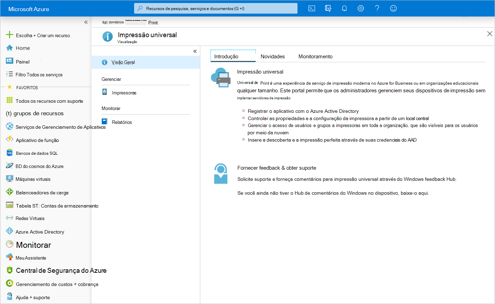

# Visão geral da API de impressão em nuvem da Impressão UniversalUniversal Print cloud printing API overview

A Impressão Universal é uma solução moderna que as organizações podem usar para gerir a infraestrutura de impressão através de serviços de nuvem da Microsoft.Universal Print is a modern print solution that organizations can use to manage their print infrastructure through cloud services from Microsoft.

## Por que usar a Impressão Universal?Why use Universal Print?

A Impressão Universal move a funcionalidade de impressão do Windows Server para a nuvem do Microsoft 365, para que as organizações não precisem mais de servidores de impressão locais e não precisem instalar drivers de impressora em dispositivos.Universal Print moves key Windows Server print functionality to the Microsoft 365 cloud, so organizations no longer need on-premises print servers and do not need to install printer drivers on devices. Além disso, a Impressão Universal adiciona funcionalidades fundamentais, como grupos de segurança para acesso à impressora, descoberta de impressora baseada no local e uma experiência de administrador avançada.In addition, Universal Print adds key functionality like security groups for printer access, location-based printer discovery, and a rich administrator experience.

Como as organizações adotam a Impressão Universal, as organizações e os fornecedores independentes de software (ISVs) podem usar a API de Impressão Universal no Microsoft Graph para criar e ampliar aplicativos para suportar novos cenários.As organizations adopt Universal Print, organizations and independent software vendors (ISVs) can use the Universal Print API in Microsoft Graph to build and extend applications to support new scenarios.

### Imprimir documentos de aplicativos da Web e móveisPrint documents from web and mobile applications

Mover a infraestrutura de impressão para a nuvem permite imprimir documentos diretamente de aplicativos da Web e móveis.Moving print infrastructure to the cloud enables printing documents directly from web and mobile applications.
- Os usuários podem enviar trabalhos de impressão para o printerShare.Users can submit print jobs to printerShare.
- Os administradores da impressora também podem enviar trabalhos de impressão, para fazer testes preliminares antes de compartilhar a impressora com a organização.Printer admins can also submit print jobs to a printer, for doing preliminary testing before sharing the printer with the organization.

Siga estas etapas para enviar trabalhos de impressão para o printerShare:Follow these steps to submit print jobs to printerShare:

1. [Crie um trabalho de impressão](/graph/api/printershare-post-jobs?view=graph-rest-beta) e armazene a ID do documento resultante.[Create a print job](/graph/api/printershare-post-jobs?view=graph-rest-beta) and store the resulting document ID.
2. [Crie uma uploadSession](/graph/api/printdocument-createuploadsession?view=graph-rest-beta) para o documento.[Create an uploadSession](/graph/api/printdocument-createuploadsession?view=graph-rest-beta) for the document. 
3. [Bytes de upload para a sessão de upload criada](./upload-data-to-upload-session.md).[Upload bytes to the created upload session](./upload-data-to-upload-session.md).
4. [Iniciar o trabalho de impressão](/graph/api/printjob-start?view=graph-rest-beta).[Start the print job](/graph/api/printjob-start?view=graph-rest-beta).

### Gerenciar impressorasManage printers

É uma tarefa complexa acompanhar as impressoras de uma organização, suas configurações e uso.Keeping track of an organization's printers, printer configurations, and printer usage is a complex task. A API de Impressão Universal permite a integração em todas as três áreas.The Universal Print API enables integration in all three areas.

* **Fique de olho no estado, configurações e disponibilidade da impressora**, usando a [Lista de impressoras](/graph/api/print-list-printers?view=graph-rest-beta) e o [printerStatus](/graph/api/resources/printerstatus?view=graph-rest-beta).**Keep an eye on printer status, configurations, and availability** by using [List printers](/graph/api/print-list-printers?view=graph-rest-beta) and [printerStatus](/graph/api/resources/printerstatus?view=graph-rest-beta).

* **Veja quem está usando as impressoras e o quanto elas estão imprimindo** usando as APIs de relatórios:**See who's using your printers and how much they're printing** by using the reporting APIs:
  * [Listar dailyPrintUsageSummariesByUserList dailyPrintUsageSummariesByUser](/graph/api/reportroot-list-dailyprintusagesummariesbyuser?view=graph-rest-beta)
  * [Listar monthlyPrintUsageSummariesByUserList monthlyPrintUsageSummariesByUser](/graph/api/reportroot-list-monthlyprintusagesummariesbyuser?view=graph-rest-beta)
  * [Listar dailyPrintUsageSummariesByPrinterList dailyPrintUsageSummariesByPrinter](/graph/api/reportroot-list-dailyprintusagesummariesbyprinter?view=graph-rest-beta)
  * [Listar monthlyPrintUsageSummariesByPrinterList monthlyPrintUsageSummariesByPrinter](/graph/api/reportroot-list-monthlyprintusagesummariesbyprinter?view=graph-rest-beta)

* **Configurar permissões de usuário** modificando a associação de usuários e grupos das impressoras:**Configure user permissions** by modifying user and group membership on printers:
  * [Listar allowedUsersList allowedUsers](/graph/api/printershare-list-allowedusers?view=graph-rest-beta)
  * [Adicionar allowedUserAdd allowedUser](/graph/api/printershare-post-allowedusers?view=graph-rest-beta)
  * [Remover allowedUserRemove allowedUser](/graph/api/printershare-delete-alloweduser?view=graph-rest-beta)
  * [Listar allowedGroupsList allowedGroups](/graph/api/printershare-list-allowedgroups?view=graph-rest-beta)
  * [Adicionar allowedGroupAdd allowedGroup](/graph/api/printershare-post-allowedgroups?view=graph-rest-beta)
  * [Remover allowedGroupRemove allowedGroup](/graph/api/printershare-delete-allowedgroup?view=graph-rest-beta)

### Substituir ou atualizar o hardware da impressora sem problemasSeamlessly replace or update printer hardware

As impressoras não estarão visíveis para os usuários até que sejam [compartilhadas](/graph/api/print-post-shares?view=graph-rest-beta), proporcionando aos administradores um controle detalhado sobre qual hardware de impressora estará disponível em um determinado momento.Printers are not visible to users until they are [shared](/graph/api/print-post-shares?view=graph-rest-beta), providing administrators fine-grained control over which printer hardware is available at a given time.

O compartilhamento de uma impressora cria um recurso [printerShare](/graph/api/resources/printershare?view=graph-rest-beta) que pode ser atualizado a qualquer momento para indicar uma impressora diferente, facilitando a substituição de hardware de uma impressora quebrada ou a desativação de impressoras para manutenção.Sharing a printer creates a [printerShare](/graph/api/resources/printershare?view=graph-rest-beta) resource that can be updated at any time to point to a different printer, making it easy to replace broken printer hardware or take printers offline for maintenance.

Para usá-lo em seu aplicativo, use [Update printerShare](/graph/api/printershare-update?view=graph-rest-beta) para atualizar a referência `printer` de printerShare.To use this in your application, use [Update printerShare](/graph/api/printershare-update?view=graph-rest-beta) to update the printerShare's `printer` reference.

### Extensão da Impressão Universal para suporte à impressão seguraExtending Universal Print to support pull printing

A API de Impressão Universal do Microsoft Graph permite que o seu aplicativo suporte a impressão segura.The Microsoft Graph Universal Print API enables your application to support pull printing. Para configurar a impressão segura, você registrará acionadores que notificarão o seu aplicativo (via comunicação serviço a serviço) quando determinados eventos de impressão acontecem, como um trabalho de impressão sendo iniciado.To set up pull printing, you will register triggers that notify your application (via service-to-service communication) when certain print events happen, such as a print job being started.

Esses acionadores permitem que o seu aplicativo interrompa o fluxo de trabalho de impressão para fazer coisas como redirecionar os trabalhos para diferentes impressoras e modificar o conteúdo do documento.These triggers enable your application to interrupt the print workflow to do things such as redirecting jobs to different printers and modifying the document payload.

Siga estes passos para habilitar a impressão segura:Follow these steps to enable pull printing:

1. [Crie uma Definição de Tarefa de impressão](/graph/api/print-post-taskdefinitions?view=graph-rest-beta) usando as permissões do aplicativo.[Create a printTaskDefinition](/graph/api/print-post-taskdefinitions?view=graph-rest-beta) using application permissions. Esta definição de tarefa abstrata será usada para criar a tarefa que irá realizar o trabalho para o seu aplicativo.This abstract task definition will be used to create task that will hold the job for your application. É necessário estabelecer pelo menos uma definição de tarefa por inquilino, que pode ser associada a qualquer número de impressoras, usando acionadores de tarefa (ver etapa 4).You need to define at least one task definition per tenant, which can be associated with any number of printers in the tenant using task triggers (see step 4).

2. [Registre uma ou mais impressoras virtuais](/graph/api/printer-create?view=graph-rest-beta) usando um token de autenticação de administrador e um `null` **Dispositivo físico**.[Register one or more virtual printers](/graph/api/printer-create?view=graph-rest-beta) using an administrator authentication token and a `null` **physicalDeviceId**. Sem um dispositivo físico acoplado, uma "impressora virtual" é apenas um objeto de impressora na Impressão Universal.A "virtual printer" is just a printer object in Universal Print without a physical device attached. Normalmente, os usuários imprimem em impressoras virtuais e depois pegam seus trabalhos de impressão em um dispositivo físico de impressão.Usually, users will print to virtual printers and later pick up their print jobs at a physical print device. Veja o passo 6.See step 6.

3. [Atualize os atributos de sua impressora virtual](/graph/api/printer-update?view=graph-rest-beta) usando as permissões do aplicativo e um `application/ipp` tipo de mídia (veja exemplos).[Update the attributes of your virtual printer](/graph/api/printer-update?view=graph-rest-beta) by using application permissions and an `application/ipp` media type (see examples).

4. [Crie um acionador de tarefas para sua impressora virtual](/graph/api/printer-post-tasktriggers?view=graph-rest-beta) usando um token de autenticação de administrador que irá associar a definição da sua tarefa com a impressora virtual.[Create a task trigger for your virtual printer](/graph/api/printer-post-tasktriggers?view=graph-rest-beta) using an administrator authentication token that will associate your task definition with virtual printer.

5. Quando um trabalho de impressão é enviado para a impressora virtual, ele será pausado devido ao [ Acionador de Tarefas de impressão](/graph/api/resources/printtasktrigger?view=graph-rest-beta).When a print job is submitted to the virtual printer, it will be paused due to the [printTaskTrigger](/graph/api/resources/printtasktrigger?view=graph-rest-beta). Uma [Tarefa de impressão](/graph/api/resources/printtask?view=graph-rest-beta) com `processing`estado será criada com base na [Definição da Tarefa de impressão associada](/graph/api/resources/printtaskdefinition?view=graph-rest-beta).A [printTask](/graph/api/resources/printtask?view=graph-rest-beta) with `processing` state will be created based on the associated [printTaskDefinition](/graph/api/resources/printtaskdefinition?view=graph-rest-beta).

6. Quando o usuário passar um crachá em um dispositivo físico de impressão, a impressora notificará o seu aplicativo.When the user swipes a badge at a physical printer device, the printer will notify your application. Nessa altura, o seu aplicativo pode [buscar os trabalhos da impressora virtual associada](/graph/api/printer-list-jobs?view=graph-rest-beta) e filtrar a lista de trabalhos criados pelo usuário atual.At that time, your application can [fetch the jobs of the associated virtual printer](/graph/api/printer-list-jobs?view=graph-rest-beta) and filter the list to jobs created by the current user.

7. Quando o usuário seleciona um ou mais trabalhos para imprimir, seu aplicativo pode [redirecionar o(s) trabalho(s) de impressão](/graph/api/printjob-redirect?view=graph-rest-beta) para a impressora física e o trabalho começará a imprimir!When the user selects one or more jobs to print, your application can [redirect the print job(s)](/graph/api/printjob-redirect?view=graph-rest-beta) to the physical printer and the job will start printing! A chamada de redirecionamento só terá sucesso se houver uma [Tarefa de impressão](/graph/api/resources/printtask?view=graph-rest-beta) em `processing` estado na impressora associada iniciada por um acionador que este aplicativo criou no passo 4.The redirect call will only succeed if there is a [printTask](/graph/api/resources/printtask?view=graph-rest-beta) in `processing` state on the associated printer started by a trigger that this app created in step 4. A tarefa será automaticamente definida para o `completed` estado após o redirecionamento.The task will automatically be set to `completed` state after redirecting it.

## Referência da APIAPI reference
Está procurando a referência de API para esse serviço?Looking for the API reference for this service?

- [API de Impressão Universal no Microsoft Graph betaUniversal Print API in Microsoft Graph beta](/graph/api/resources/print?view=graph-rest-beta)

## Faça comentáriosProvide feedback

Gostaríamos de ouvir seus comentários sobre as APIs de Impressão Universal.We'd love to hear your feedback about the Universal Print APIs. Forneça suas sugestões sobre o[UserVoice](https://microsoftgraph.uservoice.com/forums/920506-microsoft-graph-feature-requests).Provide your suggestions on [UserVoice](https://microsoftgraph.uservoice.com/forums/920506-microsoft-graph-feature-requests).

## Confira tambémSee also

- [O que é a impressão universal?What is Universal Print](/universal-print/fundamentals/universal-print-whatis)