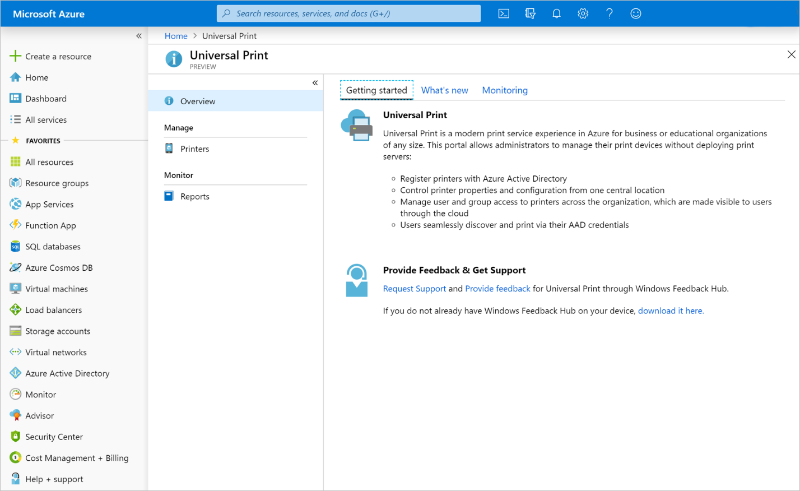

# Visão geral da API de Impressão Universal

A Impressão Universal é uma solução moderna que as organizações podem usar para gerir a infraestrutura de impressão através de serviços de nuvem da Microsoft.

## Por que usar a Impressão Universal?

A Impressão Universal move a funcionalidade de impressão do Windows Server para a nuvem do Microsoft 365, para que as organizações não precisem mais de servidores de impressão locais e não precisem instalar drivers de impressora em dispositivos. Além disso, a Impressão Universal adiciona funcionalidades fundamentais, como grupos de segurança para acesso à impressora, descoberta de impressora baseada no local e uma experiência de administrador avançada.

Como as organizações adotam a Impressão Universal, as organizações e os fornecedores independentes de software (ISVs) podem usar a API de Impressão Universal no Microsoft Graph para criar e ampliar aplicativos para suportar novos cenários.

### Imprimir documentos de aplicativos da Web e móveis

Mover a infraestrutura de impressão para a nuvem permite imprimir documentos diretamente de aplicativos da Web e móveis.

Introdução à API de Impressão Universal:

1. [Criar um trabalho de impressão](/graph/api/printer-post-jobs?view=graph-rest-beta) e armazenar a ID do documento resultante.
2. [Carregar dados](/graph/api/printdocument-uploaddata?view=graph-rest-beta) para o documento.
3. [Iniciar o trabalho de impressão](/graph/api/printjob-startprintjob?view=graph-rest-beta).

### Gerenciar impressoras

É uma tarefa complexa acompanhar as impressoras de uma organização, suas configurações e uso. A API de Impressão Universal permite a integração em todas as três áreas.

* **Fique de olho no estado, configurações e disponibilidade da impressora**, usando a [Lista de impressoras](/graph/api/print-list-printers?view=graph-rest-beta) e o [printerStatus](/graph/api/resources/printerstatus?view=graph-rest-beta).

* **Veja quem está usando as impressoras e o quanto elas estão imprimindo** usando as APIs de relatórios:
  * [Listar dailyPrintUsageSummariesByUser](/graph/api/reportroot-list-dailyprintusagesummariesbyuser?view=graph-rest-beta)
  * [Listar monthlyPrintUsageSummariesByUser](/graph/api/reportroot-list-monthlyprintusagesummariesbyuser?view=graph-rest-beta)
  * [Listar dailyPrintUsageSummariesByPrinter](/graph/api/reportroot-list-dailyprintusagesummariesbyprinter?view=graph-rest-beta)
  * [Listar monthlyPrintUsageSummariesByPrinter](/graph/api/reportroot-list-monthlyprintusagesummariesbyprinter?view=graph-rest-beta)

* **Configurar permissões de usuário** modificando a associação de usuários e grupos das impressoras:
  * [Listar allowedUsers](/graph/api/printer-list-allowedusers?view=graph-rest-beta)
  * [Adicionar allowedUser](/graph/api/printer-post-allowedusers?view=graph-rest-beta)
  * [Remover allowedUser](/graph/api/printer-delete-alloweduser?view=graph-rest-beta)
  * [Listar allowedGroups](/graph/api/printer-list-allowedgroups?view=graph-rest-beta)
  * [Adicionar allowedGroup](/graph/api/printer-post-allowedgroups?view=graph-rest-beta)
  * [Remover allowedGroup](/graph/api/printer-delete-allowedgroup?view=graph-rest-beta)

### Substituir ou atualizar o hardware da impressora sem problemas

As impressoras não estarão visíveis para os usuários até que sejam [compartilhadas](/graph/api/print-post-printershares?view=graph-rest-beta), proporcionando aos administradores um controle detalhado sobre qual hardware de impressora estará disponível em um determinado momento.

O compartilhamento de uma impressora cria um recurso [printerShare](/graph/api/resources/printershare?view=graph-rest-beta) que pode ser atualizado a qualquer momento para indicar uma impressora diferente, facilitando a substituição de hardware de uma impressora quebrada ou a desativação de impressoras para manutenção.

Para usá-lo em seu aplicativo, use [Update printerShare](/graph/api/printershare-update?view=graph-rest-beta) para atualizar a referência `printer` de printerShare.

## Referência da API
Está procurando a referência de API para esse serviço?

- [API de Impressão Universal no Microsoft Graph beta](/graph/api/resources/print?view=graph-rest-beta)

## Confira também

- [O que é a impressão universal?](https://docs.microsoft.com/universal-print/fundamentals/universal-print-whatis)
- Gostaríamos de ouvir seus comentários sobre as APIs de Impressão Universal em [UserVoice](https://microsoftgraph.uservoice.com/forums/920506-microsoft-graph-feature-requests)!
