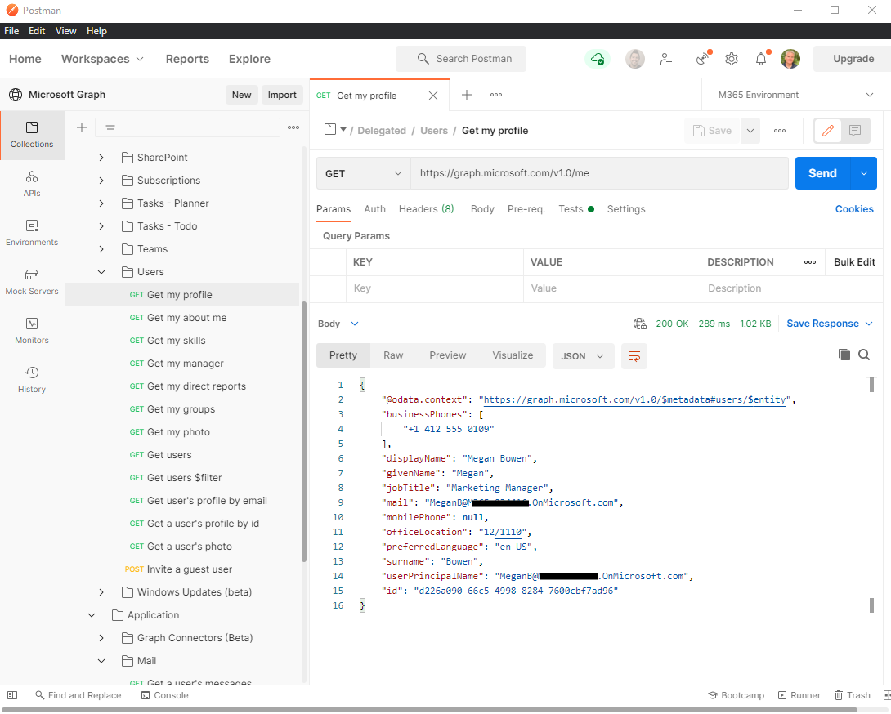

# Use o Postman com a API do Microsoft Graph

Postman é uma plataforma de API para construir e usar APIs. O Postman simplifica cada etapa do ciclo de vida da API e agiliza a colaboração para que você possa criar APIs melhores com mais rapidez.

Você pode usar a coleção do Microsoft Graph Postman para começar a usar as APIs do Microsoft Graph em questão minutos.

Este artigo explica como começar a usar o Postman e o Microsoft Graph. Você também pode explorar as APIs do Microsoft Graph diretamente em seu navegador da Web usando o [Explorador do Graph](https://developer.microsoft.com/graph/graph-explorer).

Para obter detalhes sobre como usar a Postman, siga as etapas deste artigo ou assista ao vídeo [Introdução ao espaço de trabalho do Postman no Microsoft Graph](https://youtu.be/3RTHY3jScmA).

## Etapa 1: bifurcar a coleção Microsoft Graph Postman

Para usar a coleção Postman, você precisa importá-la para o seu espaço de trabalho Postman. Faça isso de um navegador da web.

1. Vá para [Postman](https://www.postman.com/) e conecte-se.
1. Vá para a coleção do [Postman](https://www.postman.com/microsoftgraph/workspace/microsoft-graph/collection/455214-085f7047-1bec-4570-9ed0-3a7253be148c/fork) rotulada Microsoft Graph.
1. Preencha um rótulo com sua própria bifurcação de repositório; pode ser qualquer texto.
1. No **espaço de trabalho**, certifique-se de que **Meu espaço de trabalho** esteja selecionado na lista suspensa.
1. Selecione **Coleção de Bifurcações**.

Você é redirecionado para uma bifurcação da coleção principal do Microsoft Graph Postman no próprio espaço de trabalho.

## Etapa 2: baixe o Agente Postman (opcional - Somente navegador da Web Postman) 

Para usar esta coleção específica do Postman em seu navegador, baixe o [Agente de área de trabalho Postman](https://www.postman.com/downloads). Não é possível usar o Postman para a Web sem isso devido às restrições de CORS do navegador.

Você não precisa do agente se estiver usando o aplicativo Postman para Windows. Se você abrir o Postman para Windows, verá essa coleção bifurcada em seu espaço de trabalho.

## Etapa 3: criar um aplicativo do Azure Active Directory

Para usar essa coleção em seu próprio locatário de desenvolvedor, crie um aplicativo do Azure Active Directory (Azure AD) e dê a ele as permissões apropriadas para as solicitações que você deseja chamar. Se você não tiver um locatário de desenvolvedor, poderá se inscrever para obter um por meio do [Programa para Desenvolvedores do Microsoft 365](https://developer.microsoft.com/microsoft-365/dev-program).

1. Vá até o [portal.azure.com](https://portal.azure.com/) e entre com sua conta de administrador de locatários de desenvolvedor.
1. Em **Serviços do Azure**, selecione **Azure Active Directory**.
1. No menu à esquerda, selecione **Registros de aplicativo**.
1. No menu horizontal, selecione **Novo registro**.
1. Defina o **Nome do aplicativo** como `Postman`.
1. No menu suspenso, selecione **Web**.
1. Defina a **URI de redirecionamento** como`https://oauth.pstmn.io/v1/browser-callback`.
1. Selecione **Registrar**.
1. No menu à esquerda, selecione **Permissões da API**.
1. No menu horizontal, selecione **Adicionar uma permissão**, selecione **Microsoft Graph** e, em seguida, selecione **Permissões Delegadas**.
1. Digite `Mail.`, expanda as **opções de Email** e selecione `Mail.Read`.
1. Selecione **Permissões do aplicativo**, digite `User.` e selecione **Permissões do aplicativo**.
1. Expanda as opções de **Usuário** e selecione `User.Read.All`.
1. Selecione **Adicionar permissões**.
1. No menu horizontal, selecione **Conceder consentimento de administrador** para e, em seguida, selecione **Sim**.
1. No menu à esquerda, selecione **Visão geral**. A partir daqui, você pode obter o **ID do aplicativo (cliente)** e o **ID do diretório (locatário)**. Você precisará deles na etapa 4.
1. No menu à esquerda, selecione **Certificados e segredos**.
1. Selecione **Novo** segredo do cliente, insira uma descrição e selecione **Adicionar**. Passe o mouse sobre o novo **Valor** do segredo do cliente e copie-o; você precisará disso na etapa 4.

O aplicativo agora tem duas permissões configuradas. `Mail.Read` é adicionado como uma permissão delegada, que é uma permissão que requer um usuário conectado. O aplicativo pode ler emails em nome do usuário. `User.Read.All` é adicionado como uma permissão de aplicativo, que é uma permissão que não requer um usuário conectado. O aplicativo pode ler usuários no Azure AD.

## Etapa 4: Configurar autenticação

Nesta etapa, você configura as variáveis de ambiente no Postman que você usa para recuperar um token de acesso.

1. Vá para o [ambiente de Bifurcação](https://www.postman.com/microsoftgraph/workspace/microsoft-graph/environment/455214-efbc69b2-69bd-402e-9e72-850b3a49bb21/fork).
1. Adicionar um rótulo para a bifurcação. Pode ser qualquer texto.
1. No **espaço de trabalho**, certifique-se de que **Meu espaço de trabalho** esteja selecionado na lista suspensa.
1. Selecione **Ambiente de Bifurcação**.
1. Em `ClientID`, defina o **Valor atual** como o valor da ID de aplicativo (cliente) da etapa 3.16.
1. Em `ClientSecret`, defina o **Valor atual** para o valor do segredo do cliente da etapa 3.18.
1. Em`TenantID`, defina o **Valor atual** como o valor da ID de diretório (locatário) da etapa 3.16.
1. No canto superior direito, selecione **Salvar**.
1. Feche a guia **Gerenciar ambientes**.
1. No canto superior direito, próximo ao ícone de olho, verifique se o **Ambiente M365** está selecionado no menu suspenso e não em **Nenhum ambiente**.

## Etapa 5: Obter um token de acesso delegado

Como esta é a primeira vez que você está executando uma solicitação como um fluxo de autenticação delegado, é necessário obter um token de acesso.

1. Selecione a pasta **Delegada**.
1. Selecione a guia de **Autorização**.
1. Na seção **Configurar Novo Token**, selecione a guia **Opções de Configuração**. Deixe todos os campos como pré-configurados, incluindo o **Tipo de Concessão** que está definido como `Authorization Code`.
1. Role para baixo à direita e selecione **Obter Novo Token de Acesso**.
1. Entre com sua conta de administrador de locatários de desenvolvedor.
1. Selecione **Proceder** e, em seguida, selecione o botão **Usar Token**.

Agora você tem um token de acesso válido para usar para solicitações delegadas.

## Etapa 6: Executar a primeira solicitação delegada

Dentro da pasta **Delegado** estão as solicitações de várias cargas de trabalho do Microsoft Graph que você pode chamar.

1. Expanda a pasta **Delegado**, em seguida, expanda a pasta **Email**.
1. Clique duas vezes em **Obter minhas mensagens** para abrir a solicitação.
1. No canto superior direito, selecione **Enviar**.

Agora você fez uma chamada do Microsoft Graph usando autenticação delegada com êxito.

## Etapa 7: Obter um token de acesso de aplicativo

Como esta é a primeira vez que você está executando uma solicitação como um fluxo de autenticação de aplicativo, você precisa obter um token de acesso.

1. Selecione a pasta **Aplicativo**.
1. Selecione a guia de **Autorização**.
1. Na seção **Configurar Novo Token**, selecione a guia **Opções de Configuração**. Deixe todos os campos como pré-configurados, incluindo o **Tipo de Concessão** que está definido como `Client Credentials`.
1. Role para baixo à direita e selecione **Obter Novo Token de Acesso**.
1. Selecione **Proceder** e, em seguida, selecione o botão **Usar Token**.

Agora você tem um token de acesso válido para usar para solicitações de aplicativo.

## Etapa 8: Executar a primeira solicitação de aplicativo

Dentro da pasta **Aplicativo** estão solicitações de várias cargas de trabalho do Microsoft Graph que você pode chamar.

1. Expanda a pasta **Aplicativo** e, em seguida, expanda a pasta **Usuário**.
1. Clique duas vezes em **Obter usuários** para abrir a solicitação.
1. No canto superior direito, selecione **Enviar**.

Agora você fez uma chamada do Microsoft Graph usando a autenticação de aplicativo com êxito.

Você pode seguir essas etapas para fazer outras solicitações ao Microsoft Graph. Lembre-se de que você precisa adicionar permissões ao seu aplicativo do Azure AD para que outras solicitações funcionem; caso contrário, você obterá erros de permissão negada em suas respostas.

### Contribuir com a coleção

Se você quiser contribuir com seus próprios pedidos, precisa de uma licença do Postman. Você pode fazer alterações na coleção bifurcada e, em seguida, passar o mouse sobre o nó superior da coleção e selecionar **Criar solicitação de pull**.

## Problemas conhecidos

### Autenticação falhou com "Você não pode chegar lá a partir daqui"

Algumas [políticas de acesso condicional](/azure/active-directory/conditional-access/overview) configuradas pelos administradores da sua organização podem bloquear o fluxo de autenticação do Postman. Para explorar alternativas, entre em contato com seus administradores.

## Confira também

- [Use o Postman com a API de conectores do Microsoft Graph](connecting-external-content-connectors-api-postman.md)
