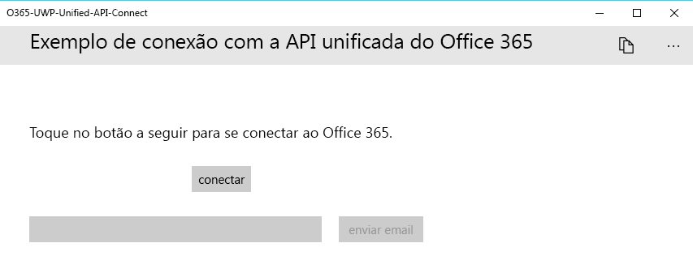
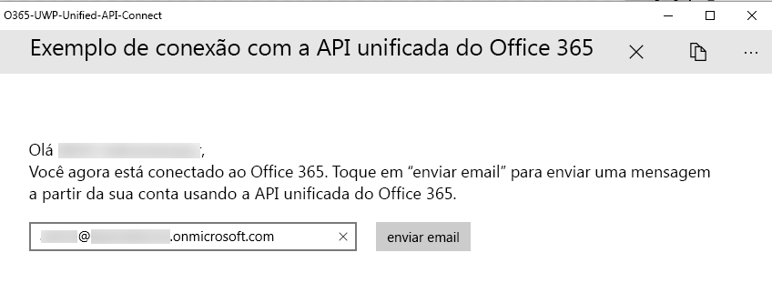

# <a name="get-started-with-microsoft-graph-in-a-universal-windows-10-app"></a><span data-ttu-id="29319-101">Introdução ao Microsoft Graph em um aplicativo universal do Windows 10</span><span class="sxs-lookup"><span data-stu-id="29319-101">Get started with Microsoft Graph in a universal Windows 10 app</span></span>

> <span data-ttu-id="29319-p101">**Criando aplicativos para clientes corporativos?** O aplicativo pode não funcionar caso o cliente corporativo habilite os recursos Enterprise Mobility + Security, como <a href="https://azure.microsoft.com/en-us/documentation/articles/active-directory-conditional-access-device-policies/" target="_newtab">acesso condicional ao dispositivo</a>. Nesse caso, pode ser que você não esteja ciente e seu cliente pode enfrentar problemas de erro.</span><span class="sxs-lookup"><span data-stu-id="29319-p101">**Building apps for enterprise customers?** Your app may not work if your enterprise customer turns on enterprise mobility security features like <a href="https://azure.microsoft.com/en-us/documentation/articles/active-directory-conditional-access-device-policies/" target="_newtab">conditional device access</a>. In this case, you may not know and your customers may experience errors.</span></span> 

> <span data-ttu-id="29319-105">Para dar suporte a **todos os clientes corporativos**, em **todos os cenários corporativos**, use o ponto de extremidade do Microsoft Azure AD e gerencie seus aplicativos usando o [Portal do Azure](https://aka.ms/aadapplist).</span><span class="sxs-lookup"><span data-stu-id="29319-105">To support **all enterprise customers** across **all enterprise scenarios**, you must use the Azure AD endpoint and use the Azure Management Portal to manage your apps.</span></span> <span data-ttu-id="29319-106">Saiba mais em [Decidindo entre os pontos de extremidade do Azure AD e do Azure AD v2.0](../concepts/auth_overview.md#deciding-between-the-azure-ad-and-azure-ad-v20-endpoints).</span><span class="sxs-lookup"><span data-stu-id="29319-106">Deciding between the Azure AD and Azure AD v2.0 endpoints</span></span>

<span data-ttu-id="29319-p103">Este artigo descreve as tarefas obrigatórias para obter um token de acesso do [ponto de extremidade do Azure AD v2.0](https://developer.microsoft.com/pt-BR/graph/docs/concepts/converged_auth) e chamar o Microsoft Graph. Ele o orienta em relação ao código dentro do [Exemplo de Conexão com o Microsoft Graph para UWP (Biblioteca)](https://github.com/microsoftgraph/uwp-csharp-connect-sample) para explicar os principais conceitos que você tem que implementar em um aplicativo que usa o Microsoft Graph.</span><span class="sxs-lookup"><span data-stu-id="29319-p103">This article describes the tasks required to get an access token from the [Azure AD v2.0 endpoint](https://developer.microsoft.com/pt-BR/graph/docs/concepts/converged_auth) and call Microsoft Graph. It walks you through the code inside the [Microsoft Graph Connect Sample for UWP (Library)](https://github.com/microsoftgraph/uwp-csharp-connect-sample) samples to explain the main concepts that you have to implement in an app that uses Microsoft Graph.</span></span>

<span data-ttu-id="29319-p104">**Não está com vontade de criar um aplicativo?** Use o [Início rápido do Microsoft Graph](https://developer.microsoft.com/graph/quick-start) para começar a usar ou baixe o [Exemplo de Conexão com o Microsoft Graph para UWP (Biblioteca)](https://github.com/microsoftgraph/uwp-csharp-connect-sample) no qual este artigo se baseia. Observe também que temos uma [Versão REST deste exemplo](https://github.com/microsoftgraph/uwp-csharp-connect-rest-sample).</span><span class="sxs-lookup"><span data-stu-id="29319-p104">**Don't feel like building an app?** Use the [Microsoft Graph quick start](https://developer.microsoft.com/graph/quick-start) to get up and running fast, or download the [Microsoft Graph Connect Sample for UWP (Library)](https://github.com/microsoftgraph/uwp-csharp-connect-sample) that this article is based on. Also note that we have a [REST version of this sample](https://github.com/microsoftgraph/uwp-csharp-connect-rest-sample).</span></span>

## <a name="sample-user-interface"></a><span data-ttu-id="29319-112">Exemplo de interface do usuário</span><span class="sxs-lookup"><span data-stu-id="29319-112">Sample user interface</span></span>

<span data-ttu-id="29319-113">O exemplo contém uma interface do usuário muito simples, que consiste em uma barra de comando superior, um botão **Conectar**, um botão **Enviar email** e uma caixa de texto que é preenchida automaticamente com o endereço de email do usuário conectado, mas que pode ser editada.</span><span class="sxs-lookup"><span data-stu-id="29319-113">The sample contains a very simple user interface, consisting of a top command bar, a **connect button**, a **send mail** button, and a text box that is automatically populated with the signed-in user's e-mail address but that can be edited.</span></span>

<span data-ttu-id="29319-114">O botão **Enviar email** é desabilitado quando o usuário não está conectado:</span><span class="sxs-lookup"><span data-stu-id="29319-114">The **send mail** button is disabled when the user has not connected:</span></span>



<span data-ttu-id="29319-116">A barra de comando superior contém um botão Desconectar quando o usuário está conectado:</span><span class="sxs-lookup"><span data-stu-id="29319-116">The top command bar contains a disconnect button when the user has connected:</span></span>



<span data-ttu-id="29319-118">Todas as cadeias de caracteres de interface do usuário do exemplo são armazenadas no arquivo Resources.resw dentro da pasta Ativos.</span><span class="sxs-lookup"><span data-stu-id="29319-118">All of the sample's UI strings are stored in the Resources.resw file inside the Assets folder.</span></span>

## <a name="prerequisites"></a><span data-ttu-id="29319-119">Pré-requisitos</span><span class="sxs-lookup"><span data-stu-id="29319-119">Prerequisites</span></span>

<span data-ttu-id="29319-120">Para começar, será necessário:</span><span class="sxs-lookup"><span data-stu-id="29319-120">To get started, you'll need:</span></span> 

- <span data-ttu-id="29319-121">Uma [conta da Microsoft](https://www.outlook.com/) ou uma [conta corporativa ou de estudante](http://dev.office.com/devprogram)</span><span class="sxs-lookup"><span data-stu-id="29319-121">A [Microsoft account](https://www.outlook.com/) or a [work or school account](http://dev.office.com/devprogram)</span></span>
- <span data-ttu-id="29319-122">Visual Studio 2017</span><span class="sxs-lookup"><span data-stu-id="29319-122">Using Visual Studio 2017</span></span> 
- <span data-ttu-id="29319-p105">O [Projeto inicial do Microsoft Graph para UWP (Biblioteca)](https://github.com/microsoftgraph/uwp-csharp-connect-sample/tree/master/starter). Ambos os modelos contêm classes vazias às quais você adicionará código. Ele também contém cadeias de recursos. Para obter este projeto, clone ou baixe o [Exemplo de Conexão com o Microsoft Graph para UWP (Biblioteca)](https://github.com/microsoftgraph/uwp-csharp-connect-sample) e abra a solução dentro da pasta **starter**.</span><span class="sxs-lookup"><span data-stu-id="29319-p105">The [Microsoft Graph Starter Project for UWP (Library)](https://github.com/microsoftgraph/uwp-csharp-connect-sample/tree/master/starter). Both templates contain empty classes that you'll add code to. They also contains resource strings. To get this project, clone or download the [Microsoft Graph Connect Sample for UWP (Library)](https://github.com/microsoftgraph/uwp-csharp-connect-sample) and then open the solution inside the **starter** folder.</span></span>


## <a name="register-the-app"></a><span data-ttu-id="29319-127">Registrar o aplicativo</span><span class="sxs-lookup"><span data-stu-id="29319-127">Register the app</span></span>
 
1. <span data-ttu-id="29319-128">Entre no [Portal de Registro do Aplicativo](https://apps.dev.microsoft.com/) usando sua conta pessoal ou sua conta corporativa ou de estudante.</span><span class="sxs-lookup"><span data-stu-id="29319-128">Sign into the [App Registration Portal](https://apps.dev.microsoft.com/) using either your personal or work or school account.</span></span>
2. <span data-ttu-id="29319-129">Selecione **Adicionar um aplicativo**.</span><span class="sxs-lookup"><span data-stu-id="29319-129">Select **Add an app**.</span></span>
3. <span data-ttu-id="29319-130">Insira um nome para o aplicativo e selecione **Criar aplicativo**.</span><span class="sxs-lookup"><span data-stu-id="29319-130">Enter a name for the app, and select **Create application**.</span></span>
    
    <span data-ttu-id="29319-131">A página de registro é exibida, listando as propriedades do seu aplicativo.</span><span class="sxs-lookup"><span data-stu-id="29319-131">The registration page displays, listing the properties of your app.</span></span>
 
4. <span data-ttu-id="29319-132">Em **Plataformas**, selecione **Adicionar plataforma**.</span><span class="sxs-lookup"><span data-stu-id="29319-132">Under **Platforms**, select **Add platform**.</span></span>
5. <span data-ttu-id="29319-133">Escolha **Aplicativo Nativo**.</span><span class="sxs-lookup"><span data-stu-id="29319-133">Select **Native Application**.</span></span>
6. <span data-ttu-id="29319-p106">Copie a ID de cliente (ID de aplicativo) e os valores do URI de redirecionamento para a área de transferência. Você precisará inserir esses valores no exemplo de aplicativo.</span><span class="sxs-lookup"><span data-stu-id="29319-p106">Copy both the Client Id (App Id) and Redirect URI values to the clipboard. You'll need to enter these values into the sample app.</span></span>

    <span data-ttu-id="29319-p107">Essa ID de aplicativo é o identificador exclusivo do aplicativo. Um URI de redirecionamento é um URI exclusivo fornecido pelo Windows 10 para cada aplicativo para garantir que as mensagens enviadas para esse URI sejam enviadas somente para esse aplicativo.</span><span class="sxs-lookup"><span data-stu-id="29319-p107">The app id is a unique identifier for your app. The redirect URI is a unique URI provided by Windows 10 for each application to ensure that messages sent to that URI are only sent to that application.</span></span> 

7. <span data-ttu-id="29319-138">Selecione **Salvar**.</span><span class="sxs-lookup"><span data-stu-id="29319-138">Select **Save**.</span></span>

## <a name="configure-the-project"></a><span data-ttu-id="29319-139">Configurar o projeto</span><span class="sxs-lookup"><span data-stu-id="29319-139">Configure the project</span></span>

1. <span data-ttu-id="29319-140">Abra o arquivo de solução para o projeto inicial no Visual Studio.</span><span class="sxs-lookup"><span data-stu-id="29319-140">Open the solution file for the starter project in Visual Studio.</span></span>
2. <span data-ttu-id="29319-p108">Abra o arquivo **App.xaml** do projeto e localize o nó `Application.Resources`. Substitua a ID do aplicativo e redirecione espaços reservados do URI com os valores correspondentes do aplicativo que você registrou.</span><span class="sxs-lookup"><span data-stu-id="29319-p108">Open the project's **App.xaml** file and locate the `Application.Resources` node. Replace the application ID and redirect URI placeholders with the corresponding values of the app you registered.</span></span>


```xml
    <Application.Resources>
        <!-- Add your Client Id here. -->
        <x:String x:Key="ida:ClientID">ENTER_YOUR_CLIENT_ID</x:String>
        <!-- Add your Redirect URI here. -->
        <x:String x:Key="ida:ReturnUrl">ENTER_YOUR_REDIRECT_URI</x:String>
    </Application.Resources>
```

## <a name="send-an-email-with-microsoft-graph"></a><span data-ttu-id="29319-143">Enviar um email com o Microsoft Graph</span><span class="sxs-lookup"><span data-stu-id="29319-143">Send an email with Microsoft Graph</span></span>

<span data-ttu-id="29319-p109">Abra o arquivo MailHelper.cs em seu projeto inicial. Este arquivo contém o código que constrói e envia um email. Consiste em um único método -- ``ComposeAndSendMailAsync`` -- que constrói e envia uma solicitação POST para o ponto de extremidade **https://graph.microsoft.com/v1.0/me/microsoft.graph.SendMail**.</span><span class="sxs-lookup"><span data-stu-id="29319-p109">Open the MailHelper.cs file in your starter project. This file contains the code that constructs and sends an email. It consists of a single method -- ``ComposeAndSendMailAsync`` -- that constructs and sends a POST request to the **https://graph.microsoft.com/v1.0/me/microsoft.graph.SendMail** endpoint.</span></span> 

<span data-ttu-id="29319-p110">O método ``ComposeAndSendMailAsync`` tem três valores de cadeia de caracteres, ou seja, ``subject``, ``bodyContent`` e ``recipients``, que são passados para ele pelo arquivo MainPage.xaml.cs. As cadeias de caracteres ``subject`` e ``bodyContent`` são armazenadas, juntamente com todos os outras cadeias de caracteres de interface do usuário, no arquivo Resources.resw. A cadeia de caracteres ``recipients`` vem da caixa de endereço na interface do aplicativo.</span><span class="sxs-lookup"><span data-stu-id="29319-p110">The ``ComposeAndSendMailAsync`` method takes three string values -- ``subject``, ``bodyContent``, and ``recipients`` -- that are passed to it by the MainPage.xaml.cs file. The ``subject`` and ``bodyContent`` strings are stored, along with all other UI strings, in the Resources.resw file. The ``recipients`` string comes from the address box in the app's interface.</span></span> 

<span data-ttu-id="29319-p111">A primeira tarefa no método ``ComposeAndSendMailAsync`` é obter a foto do usuário atual a partir do Microsoft Graph. Esta linha chama o método `GetCurrentUserPhotoStreamAsync`:</span><span class="sxs-lookup"><span data-stu-id="29319-p111">The first task inside the ``ComposeAndSendMailAsync`` method is to get the current user's photo from Microsoft Graph. This line calls the `GetCurrentUserPhotoStreamAsync` method:</span></span>

```
            // Get current user photo
            Stream photoStream = await GetCurrentUserPhotoStreamAsync();
```

<span data-ttu-id="29319-152">O método `GetCurrentUserPhotoStreamAsync` completo tem a seguinte aparência:</span><span class="sxs-lookup"><span data-stu-id="29319-152">This is what the complete `GetCurrentUserPhotoStreamAsync` method looks like:</span></span>

```
        // Gets the stream content of the signed-in user's photo. 
        // This snippet doesn't work with consumer accounts.
        public async Task<Stream> GetCurrentUserPhotoStreamAsync()
        {
            Stream currentUserPhotoStream = null;

            try
            {
                var graphClient = AuthenticationHelper.GetAuthenticatedClient();
                currentUserPhotoStream = await graphClient.Me.Photo.Content.Request().GetAsync();

            }

            // If the user account is MSA (not work or school), the service will throw an exception.
            catch (ServiceException)
            {
                return null;
            }

            return currentUserPhotoStream;

        }
```

<span data-ttu-id="29319-153">Se o usuário não tiver uma foto, essa lógica obterá outro arquivo de imagem que foi incluído no projeto:</span><span class="sxs-lookup"><span data-stu-id="29319-153">If the user doesn't have a photo, this logic gets another image file that has been included with the project:</span></span>

```
            // If the user doesn't have a photo, or if the user account is MSA, we use a default photo

            if (photoStream == null)
            {
                StorageFile file = await Windows.ApplicationModel.Package.Current.InstalledLocation.GetFileAsync("test.jpg");
                photoStream = (await file.OpenReadAsync()).AsStreamForRead();
            }
```

<span data-ttu-id="29319-154">Agora que temos um fluxo de imagem, podemos carregar o arquivo no OneDrive chamando o método `UploadFileToOneDriveAsync`:</span><span class="sxs-lookup"><span data-stu-id="29319-154">Now that we have an image stream, we can upload the file to OneDrive by calling the `UploadFileToOneDriveAsync` method:</span></span>

```
            MemoryStream photoStreamMS = new MemoryStream();
            // Copy stream to MemoryStream object so that it can be converted to byte array.
            photoStream.CopyTo(photoStreamMS);

            DriveItem photoFile = await UploadFileToOneDriveAsync(photoStreamMS.ToArray());
```

<span data-ttu-id="29319-155">O método `UploadFileToOneDriveAsync` completo tem a seguinte aparência:</span><span class="sxs-lookup"><span data-stu-id="29319-155">This is what the complete `UploadFileToOneDriveAsync` method looks like:</span></span>

```
        // Uploads the specified file to the user's root OneDrive directory.
        public async Task<DriveItem> UploadFileToOneDriveAsync(byte[] file)
        {
            DriveItem uploadedFile = null;

            try
            {
                var graphClient = AuthenticationHelper.GetAuthenticatedClient();
                MemoryStream fileStream = new MemoryStream(file);
                uploadedFile = await graphClient.Me.Drive.Root.ItemWithPath("me.png").Content.Request().PutAsync<DriveItem>(fileStream);

            }


            catch (ServiceException)
            {
                return null;
            }

            return uploadedFile;
        }
```

<span data-ttu-id="29319-156">Podemos também pode usar este fluxo para criar um objeto `MessageAttachmentsCollectionPage` que podemos passar junto com a mensagem:</span><span class="sxs-lookup"><span data-stu-id="29319-156">We can also use this stream to create a `MessageAttachmentsCollectionPage` object that we can pass along with the message:</span></span>

```
            MessageAttachmentsCollectionPage attachments = new MessageAttachmentsCollectionPage();
            attachments.Add(new FileAttachment
            {
                ODataType = "#microsoft.graph.fileAttachment",
                ContentBytes = photoStreamMS.ToArray(),
                ContentType = "image/png",
                Name = "me.png"
            });
```

<span data-ttu-id="29319-p112">Podemos obter um link de compartilhamento para o arquivo do OneDrive recém-carregado chamando o método `GetSharingLinkAsync`. A cadeia de caracteres `bodyContent` contém um espaço reservado para o link de compartilhamento:</span><span class="sxs-lookup"><span data-stu-id="29319-p112">We can get a sharing link for the newly uploaded OneDrive file by calling the `GetSharingLinkAsync` method. The `bodyContent` string contains a placeholder for the sharing link:</span></span>

```
            // Get the sharing link and insert it into the message body.
            Permission sharingLink = await GetSharingLinkAsync(photoFile.Id);
            string bodyContentWithSharingLink = String.Format(bodyContent, sharingLink.Link.WebUrl);
```

<span data-ttu-id="29319-159">O método `GetSharingLinkAsync` completo tem a seguinte aparência:</span><span class="sxs-lookup"><span data-stu-id="29319-159">This is what the complete `GetSharingLinkAsync` method looks like:</span></span>

```
        public static async Task<Permission> GetSharingLinkAsync(string Id)
        {
            Permission permission = null;

            try
            {
                var graphClient = AuthenticationHelper.GetAuthenticatedClient();
                permission = await graphClient.Me.Drive.Items[Id].CreateLink("view").Request().PostAsync();
            }

            catch (ServiceException)
            {
                return null;
            }

            return permission;
        }
```

<span data-ttu-id="29319-160">Já que o usuário pode passar mais de um endereço, a próxima tarefa é dividir a cadeia de caracteres ``recipients`` em uma coleção de objetos `EmailAddress` que podem ser usados para construir a lista de objetos `Recipients` que serão passados no corpo POST da solicitação:</span><span class="sxs-lookup"><span data-stu-id="29319-160">Since the user can potentially pass more than one address, the next task is to split the ``recipients`` string into a set of `EmailAddress` objects that can then be used to construct the list of `Recipients` objects that will be passed in the POST body of the request:</span></span>

```
            // Prepare the recipient list
            string[] splitter = { ";" };
            var splitRecipientsString = recipients.Split(splitter, StringSplitOptions.RemoveEmptyEntries);
            List<Recipient> recipientList = new List<Recipient>();

            foreach (string recipient in splitRecipientsString)
            {
                recipientList.Add(new Recipient { EmailAddress = new EmailAddress { Address = recipient.Trim() } });
            }
```

<span data-ttu-id="29319-p113">A última tarefa é construir um objeto `Message` e enviá-lo para o ponto de extremidade **me/microsoft.graph.SendMail** por meio de `GraphServiceClient`. Já que a cadeia de caracteres ``bodyContent`` é um documento HTML, a solicitação define o valor **ContentType** como HTML.</span><span class="sxs-lookup"><span data-stu-id="29319-p113">The last task is to construct a `Message` object and send it to the **me/microsoft.graph.SendMail** endpoint through the `GraphServiceClient`. Since the ``bodyContent`` string is an HTML document, the request sets the **ContentType** value to HTML.</span></span>

```
            try
            {
                var graphClient = AuthenticationHelper.GetAuthenticatedClient();

                var email = new Message
                {
                    Body = new ItemBody
                    {
                        Content = bodyContentWithSharingLink,
                        ContentType = BodyType.Html,
                    },
                    Subject = subject,
                    ToRecipients = recipientList,
                    Attachments = attachments
                };

                try
                {
                    await graphClient.Me.SendMail(email, true).Request().PostAsync();
                }
                catch (ServiceException exception)
                {
                    throw new Exception("We could not send the message: " + exception.Error == null ? "No error message returned." : exception.Error.Message);
                }


            }

            catch (Exception e)
            {
                throw new Exception("We could not send the message: " + e.Message);
            }
```

<span data-ttu-id="29319-163">A classe completa será semelhante a:</span><span class="sxs-lookup"><span data-stu-id="29319-163">The complete class will look like this:</span></span>

```
    public class MailHelper
    {
        /// <summary>
        /// Compose and send a new email.
        /// </summary>
        /// <param name="subject">The subject line of the email.</param>
        /// <param name="bodyContent">The body of the email.</param>
        /// <param name="recipients">A semicolon-separated list of email addresses.</param>
        /// <returns></returns>
        public async Task ComposeAndSendMailAsync(string subject,
                                                            string bodyContent,
                                                            string recipients)
        {

            // Get current user photo
            Stream photoStream = await GetCurrentUserPhotoStreamAsync();


            // If the user doesn't have a photo, or if the user account is MSA, we use a default photo

            if (photoStream == null)
            {
                StorageFile file = await Windows.ApplicationModel.Package.Current.InstalledLocation.GetFileAsync("test.jpg");
                photoStream = (await file.OpenReadAsync()).AsStreamForRead();
            }

            MemoryStream photoStreamMS = new MemoryStream();
            // Copy stream to MemoryStream object so that it can be converted to byte array.
            photoStream.CopyTo(photoStreamMS);

            DriveItem photoFile = await UploadFileToOneDriveAsync(photoStreamMS.ToArray());

            MessageAttachmentsCollectionPage attachments = new MessageAttachmentsCollectionPage();
            attachments.Add(new FileAttachment
            {
                ODataType = "#microsoft.graph.fileAttachment",
                ContentBytes = photoStreamMS.ToArray(),
                ContentType = "image/png",
                Name = "me.png"
            });

            // Get the sharing link and insert it into the message body.
            Permission sharingLink = await GetSharingLinkAsync(photoFile.Id);
            string bodyContentWithSharingLink = String.Format(bodyContent, sharingLink.Link.WebUrl);

            // Prepare the recipient list
            string[] splitter = { ";" };
            var splitRecipientsString = recipients.Split(splitter, StringSplitOptions.RemoveEmptyEntries);
            List<Recipient> recipientList = new List<Recipient>();

            foreach (string recipient in splitRecipientsString)
            {
                recipientList.Add(new Recipient { EmailAddress = new EmailAddress { Address = recipient.Trim() } });
            }

            try
            {
                var graphClient = AuthenticationHelper.GetAuthenticatedClient();

                var email = new Message
                {
                    Body = new ItemBody
                    {
                        Content = bodyContentWithSharingLink,
                        ContentType = BodyType.Html,
                    },
                    Subject = subject,
                    ToRecipients = recipientList,
                    Attachments = attachments
                };

                try
                {
                    await graphClient.Me.SendMail(email, true).Request().PostAsync();
                }
                catch (ServiceException exception)
                {
                    throw new Exception("We could not send the message: " + exception.Error == null ? "No error message returned." : exception.Error.Message);
                }


            }

            catch (Exception e)
            {
                throw new Exception("We could not send the message: " + e.Message);
            }
        }


        // Gets the stream content of the signed-in user's photo. 
        // This snippet doesn't work with consumer accounts.
        public async Task<Stream> GetCurrentUserPhotoStreamAsync()
        {
            Stream currentUserPhotoStream = null;

            try
            {
                var graphClient = AuthenticationHelper.GetAuthenticatedClient();
                currentUserPhotoStream = await graphClient.Me.Photo.Content.Request().GetAsync();

            }

            // If the user account is MSA (not work or school), the service will throw an exception.
            catch (ServiceException)
            {
                return null;
            }

            return currentUserPhotoStream;

        }

        // Uploads the specified file to the user's root OneDrive directory.
        public async Task<DriveItem> UploadFileToOneDriveAsync(byte[] file)
        {
            DriveItem uploadedFile = null;

            try
            {
                var graphClient = AuthenticationHelper.GetAuthenticatedClient();
                MemoryStream fileStream = new MemoryStream(file);
                uploadedFile = await graphClient.Me.Drive.Root.ItemWithPath("me.png").Content.Request().PutAsync<DriveItem>(fileStream);

            }


            catch (ServiceException)
            {
                return null;
            }

            return uploadedFile;
        }

        public static async Task<Permission> GetSharingLinkAsync(string Id)
        {
            Permission permission = null;

            try
            {
                var graphClient = AuthenticationHelper.GetAuthenticatedClient();
                permission = await graphClient.Me.Drive.Items[Id].CreateLink("view").Request().PostAsync();
            }

            catch (ServiceException)
            {
                return null;
            }

            return permission;
        }

    }
``` 

 
<span data-ttu-id="29319-164">Você já realizou as etapas obrigatórias para interagir com o Microsoft Graph: registro do aplicativo, autenticação do usuário e solicitações.</span><span class="sxs-lookup"><span data-stu-id="29319-164">You've now performed the steps required for interacting with Microsoft Graph: app registration, user authentication, and making the requests.</span></span> 

## <a name="run-the-app"></a><span data-ttu-id="29319-165">Executar o aplicativo</span><span class="sxs-lookup"><span data-stu-id="29319-165">Run the app</span></span>
1. <span data-ttu-id="29319-166">Pressione F5 para criar e executar o aplicativo.</span><span class="sxs-lookup"><span data-stu-id="29319-166">Press F5 to build and run the app.</span></span> 

2. <span data-ttu-id="29319-167">Entre com sua conta pessoal, corporativa ou de estudante, e conceda as permissões solicitadas.</span><span class="sxs-lookup"><span data-stu-id="29319-167">Sign in with your personal or work or school account and grant the requested permissions.</span></span>

3. <span data-ttu-id="29319-p114">Escolha o botão **Enviar email**. Quando esse email é enviado, uma mensagem de Sucesso é exibida na parte inferior do botão. A mensagem de email inclui a foto em anexo e também fornece um link de compartilhamento para o arquivo carregado no OneDrive.</span><span class="sxs-lookup"><span data-stu-id="29319-p114">Choose the **Send email** button. When the mail is sent, a Success message is displayed below the button. the mail message includes the photo as an attachment and also provides a sharing link to the uploaded file in OneDrive.</span></span>

## <a name="next-steps"></a><span data-ttu-id="29319-171">Próximas etapas</span><span class="sxs-lookup"><span data-stu-id="29319-171">Next steps</span></span>
- <span data-ttu-id="29319-172">Experimente a API REST usando o [Explorador do Graph](https://developer.microsoft.com/pt-BR/graph/graph-explorer).</span><span class="sxs-lookup"><span data-stu-id="29319-172">Try out the REST API using the [Graph explorer](https://developer.microsoft.com/pt-BR/graph/graph-explorer).</span></span>
- <span data-ttu-id="29319-173">Encontre exemplos de operações comuns para operações REST e SDK no [Exemplo de trechos de UWP do Microsoft Graph (SDK)](https://github.com/microsoftgraph/uwp-csharp-snippets-sample) e no [Exemplo de trechos de UWP do Microsoft Graph (REST)](https://github.com/microsoftgraph/uwp-csharp-snippets-rest-sample) ou explore nossos outros [exemplos de UWP](https://github.com/microsoftgraph?utf8=%E2%9C%93&query=uwp) no GitHub.</span><span class="sxs-lookup"><span data-stu-id="29319-173">Find examples of common operations for both REST and SDK operations in the [Microsoft Graph UWP Snippets Sample (SDK)](https://github.com/microsoftgraph/uwp-csharp-snippets-sample) and the [Microsoft Graph UWP Snippets Sample (REST)](https://github.com/microsoftgraph/uwp-csharp-snippets-rest-sample), or explore our other [UWP samples](https://github.com/microsoftgraph?utf8=%E2%9C%93&query=uwp) on GitHub.</span></span>

## <a name="see-also"></a><span data-ttu-id="29319-174">Confira também</span><span class="sxs-lookup"><span data-stu-id="29319-174">See also</span></span>
- [<span data-ttu-id="29319-175">Biblioteca de cliente do .NET do Microsoft Graph</span><span class="sxs-lookup"><span data-stu-id="29319-175">Microsoft Graph .NET Client Library</span></span>](https://github.com/microsoftgraph/msgraph-sdk-dotnet)
- [<span data-ttu-id="29319-176">Protocolos do Azure AD v2.0</span><span class="sxs-lookup"><span data-stu-id="29319-176">Azure AD v2.0 protocols</span></span>](https://azure.microsoft.com/pt-BR/documentation/articles/active-directory-v2-protocols/)
- [<span data-ttu-id="29319-177">Tokens do Azure AD v2.0</span><span class="sxs-lookup"><span data-stu-id="29319-177">Azure AD v2.0 tokens</span></span>](https://azure.microsoft.com/pt-BR/documentation/articles/active-directory-v2-tokens/)

