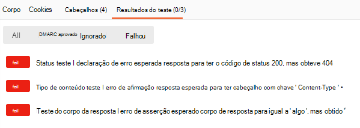

# <a name="set-up-notifications-for-changes-in-user-data"></a>Configurar notificações para alterações nos dados de usuário

A API do Microsoft Graph usa um mecanismo de webhook para fornecer notificações de alteração aos clientes. Um cliente é um serviço Web que configura sua própria URL para receber notificações. Aplicativos cliente usam notificações de alteração para atualizar seu estado após alterações.

Depois que o Microsoft Graph aceita a solicitação de assinatura, ele envia notificações de alteração por push para a URL especificada na assinatura. O aplicativo então realiza ações de acordo com sua lógica comercial. Por exemplo, ele busca mais dados, atualiza o cache e as exibições, e assim por diante.


> [!VIDEO https://www.youtube-nocookie.com/embed/rC1bunenaq4]
 
> [!div class="nextstepaction"]
> [Tutorial: usar notificações de alteração e controlar alterações com o Microsoft Graph](/learn/modules/msgraph-changenotifications-trackchanges)

Por padrão, as notificações de alteração não contêm dados de recursos, exceto o `id`. Se o aplicativo exigir dados de recursos, ele poderá fazer chamadas para as APIs do Microsoft Graph para obter o recurso completo. Este artigo usa o recurso de **usuário** como um exemplo para trabalhar com notificações de alteração.

Um aplicativo também pode se inscrever para alterar notificações que incluem dados de recursos, para evitar a necessidade de fazer chamadas de API adicionais para acessar os dados. Esses aplicativos precisarão implementar um código extra para lidar com os requisitos de tais notificações, especificamente: responder às notificações do ciclo de vida da assinatura, validar a autenticidade das notificações e descriptografar os dados do recurso. Para saber mais sobre como trabalhar com essas notificações, confira [Configurar notificações de alteração que incluam dados de recurso](webhooks-with-resource-data.md).

## <a name="supported-resources"></a>Recursos com suporte

Usando a API do Microsoft Graph, um aplicativo pode se inscrever para alterações nos seguintes recursos:

- Impressão na nuvem [impressora][]
- Impressão na nuvem [printTaskDefinition][]
- Conteúdo dentro da hierarquia do tipo de recurso [driveItem][] de _qualquer pasta_ no OneDrive pessoal do usuário
- Conteúdo dentro da hierarquia do tipo de recurso [driveItem][] de _pasta raiz_ no OneDrive for Business
- [group][]
- [Conversa][] em grupo do Microsoft 365
- [Evento][] do Outlook
- [Mensagem][] do Outlook
- [Contato][] pessoal do Outlook
- [Alerta][] de segurança
- [Lista][] do Microsoft Office SharePoint Online
- Teams [callRecord][]
- [Canal][] do Teams
- [chatMessage][] do Teams
- [conversationMember][] do Teams
- [presence][] do Teams (visualização)
- Equipe do [Teams][]
- [todoTask][] (pré-visualização)
- [usuário][]

Você pode criar uma assinatura para uma pasta de específica do Outlook, como a Caixa de Entrada: `me/mailFolders('inbox')/messages`

Ou para um recurso de nível superior: `/me/messages`, `/me/contacts`, `/me/events`, `users`, `groups`, `/communications/callRecords`

Ou para uma instância de recurso específica: `users/{id}`, `groups/{id}`, `groups/{id}/conversations`, `sites/{site-id}/lists/{list-id}`, `/communications/presences/{id}`

Ou para alguma pasta no OneDrive pessoal de um usuário: `/drives/{id}/root`
`/drives/{id}/root/subfolder`

Ou para a pasta raiz de uma unidade do SharePoint/OneDrive for Business: `/drive/root`

Ou para um novo alerta da [API de Segurança](security-concept-overview.md): `/security/alerts?$filter=status eq 'newAlert'`, `/security/alerts?$filter=vendorInformation/provider eq 'ASC'`

Ou para as tarefas na Lista de Tarefas Pendentes de um usuário: `/me/todo/lists/{todoTaskListId}/tasks`

### <a name="azure-ad-resource-limitations"></a>Limitações de recursos do Microsoft Azure AD

Determinadas limites se aplicam aos recursos baseados no Azure AD (usuários, grupos) e gerarão erros se forem excedidos:

> **Observação**: Esses limites não se aplicam aos recursos de serviços diferente do Azure AD. Por exemplo, um aplicativo pode criar muito mais assinaturas para `message` ou recursos `event` que são aceitos pelo serviço Exchange Online como parte do Microsoft Graph.

- Cotas máximas de assinaturas:

  - Por aplicativo (para todos os locatários combinados): 50.000 assinaturas totais
  - Por locatário (para todos os aplicativos combinados): 1000 total de assinaturas em todos os aplicativos
  - Combinação por aplicativo e locatário: 100 assinaturas no total

Quando os limites são excedidos, a tentativa de criar uma assinatura resultará em uma [resposta de erro](errors.md) - `403 Forbidden`. A propriedade `message` explicará qual limite foi excedido.

- Não há suporte a locatários do Microsoft Azure AD B2C.

- Não há suporte a notificações de alteração para contas Microsoft pessoais.

- Existe um [problema conhecido](known-issues.md#change-notifications) nas assinaturas de usuários e grupos.

### <a name="outlook-resource-limitations"></a>Limitações de recursos do Outlook

Ao se inscrever em recursos do Outlook, tais como **mensagens**, **eventos** ou **contatos**, se você decidir usar o *nome UPN* em um caminho de recurso, a solicitação de assinatura pode falhar caso o UPN contenha um apóstrofo. Considere usar IDs de usuário de GUID em vez de UPNs para evitar esse problema. Por exemplo, em vez de usar o caminho de recursos:

`/users/sh.o'neal@contoso.com/messages`

Use:

`/users/{guid-user-id}/messages`

É permitido um máximo de 1000 assinaturas ativas por caixa de correio para todos os aplicativos.

### <a name="teams-resource-limitations"></a>Limitações de recursos do Teams

Cada recurso do Teams possui cotas de assinatura diferentes.

- Para assinaturas do **callRecords**:
  - Por organização: 100 assinaturas totais

- Para assinaturas de **chatMessages** (canais ou chats):
  - Por combinação por aplicativo e canal ou por chat: uma assinatura
  - Por organização: 10.000 assinaturas totais

## <a name="subscription-lifetime"></a>Tempo de vida da assinatura

As assinaturas têm tempo de vida limitado. Os aplicativos precisam renovar suas assinaturas antes do tempo de expiração. Caso contrário, será preciso criar uma nova assinatura. Confira a lista de prazos máximos em [Prazo máximo de assinatura por tipo de recurso](/graph/api/resources/subscription?view=graph-rest-1.0#maximum-length-of-subscription-per-resource-type).

Os aplicativos também podem cancelar a assinatura a qualquer momento para deixarem de receber notificações de alteração.

## <a name="managing-subscriptions"></a>Gerenciar assinaturas

Os clientes podem criar, renovar e excluir assinaturas.

### <a name="creating-a-subscription"></a>Criar uma assinatura

Criar uma assinatura é a primeira etapa para começar a receber notificações de alteração de um recurso. O processo de assinatura ocorre da seguinte maneira:

1. O cliente envia uma solicitação de assinatura (POST) para um recurso específico.

1. O Microsoft Graph verifica a solicitação.

    - Se a solicitação for válida, o Microsoft Graph enviará um token de validação para a URL de notificação.
    - Se a solicitação for inválida, o Microsoft Graph enviará uma resposta de erro com um código e detalhes.

1. O cliente envia o token de validação de volta para o Microsoft Graph.

1. O Microsoft Graph envia uma resposta de volta para o cliente.

O cliente deve armazenar a ID da assinatura para correlacionar notificações de alteração com a assinatura.

#### <a name="subscription-request-example"></a>Exemplo de solicitação de assinatura

```http
POST https://graph.microsoft.com/v1.0/subscriptions
Content-Type: application/json
{
  "changeType": "created,updated",
  "notificationUrl": "https://webhook.azurewebsites.net/notificationClient",
  "resource": "/me/mailfolders('inbox')/messages",
  "expirationDateTime": "2016-03-20T11:00:00.0000000Z",
  "clientState": "SecretClientState"
}
```

As propriedades `changeType`, `notificationUrl`, `resource` e `expirationDateTime` são obrigatórias. Confira os valores e as definições de propriedade em [tipo de recurso de assinatura](/graph/api/resources/subscription?view=graph-rest-1.0).

A propriedade `resource` especifica o recurso que será monitorado para detectar alterações. Por exemplo, você pode criar uma assinatura para uma pasta de email específica: `me/mailFolders('inbox')/messages` ou em nome de um usuário, atribuído com uma autorização do administrador: `users/john.doe@onmicrosoft.com/mailFolders('inbox')/messages`.

Embora `clientState` não seja obrigatória, você deve incluí-la para manter a conformidade com nosso processo recomendado de manipulação de notificações de alterações. A definição desta propriedade permitirá confirmar se as notificações de alteração recebidas partiram do serviço do Microsoft Graph. Por esse motivo, o valor da propriedade deve continuar em segredo e deve ser conhecido somente por seu aplicativo e pelo serviço do Microsoft Graph.

Se tiver êxito, o Microsoft Graph retornará um código `201 Created` e um objeto [subscription](/graph/api/resources/subscription?view=graph-rest-1.0) no corpo.

> **Observação:** Qualquer parâmetro da cadeia de caracteres de consulta incluído na propriedade **notificationUrl** será incluído na solicitação de POST HTTP quando as notificações estiverem sendo entregues.

#### <a name="notification-endpoint-validation"></a>Validação de ponto de extremidade de notificação

O Microsoft Graph valida o ponto de extremidade de notificação fornecido na propriedade `notificationUrl` da solicitação de assinatura antes de criar a assinatura. O processo de validação ocorre da seguinte maneira:

1. O Microsoft Graph codifica um token de validação e o inclui em uma solicitação POST na URL da notificação:

    ``` http
    Content-Type: text/plain; charset=utf-8
    POST https://{notificationUrl}?validationToken={opaqueTokenCreatedByMicrosoftGraph}
    ```

1. O cliente deve realizar a decodificação URL do `validationToken` fornecido corretamente na etapa anterior e escapar de um HTML/JavaScript.

   Escapar é uma boa prática porque atores maliciosos podem usar o ponto de extremidade de notificação para o tipo de ataques de script entre sites.

   Em geral, trate o valor do token de validação como opaco, uma vez que o formato do token geralmente pode ser alterado sem aviso. O Microsoft Graph nunca envia nenhum valor contendo código HTML ou JavaScript.

1. O cliente deve fornecer uma resposta com as seguintes características em até 10 segundos da etapa 1:

    - Um código de status de `HTTP 200 OK`.
    - Um tipo de conteúdo de `text/plain`.
    - Um corpo que inclui o token de validação _URL decodificada_. Basta refletir a mesma cadeia que foi enviada no parâmetro de consulta `validationToken`.

    O cliente deve descartar o token de validação depois de o fornecer na resposta.

    > **Importante:** se o cliente retornar um token de validação codificado, a validação falhará.

Além disso, você pode usar a [coleção do Microsoft Graph Postman](use-postman.md) para confirmar que o ponto de extremidade implementa a solicitação de validação. A solicitação de **Validação de Assinaturas** na pasta **Diversos** fornece testes de unidade que validam a resposta fornecida por seu ponto de extremidade.  



### <a name="renewing-a-subscription"></a>Renovar uma assinatura

O cliente pode renovar uma assinatura com uma data de expiração específica de até três dias desde a hora da solicitação. A propriedade `expirationDateTime` é obrigatória.

#### <a name="subscription-renewal-example"></a>Exemplo de renovação de assinatura

```http
PATCH https://graph.microsoft.com/v1.0/subscriptions/{id}
Content-Type: application/json

{
  "expirationDateTime": "2016-03-22T11:00:00.0000000Z"
}
```

Se tiver êxito, o Microsoft Graph retornará um código `200 OK` e um objeto [subscription](/graph/api/resources/subscription?view=graph-rest-1.0) no corpo. O objeto subscription inclui o novo valor de `expirationDateTime`.

### <a name="deleting-a-subscription"></a>Excluindo uma assinatura

O cliente pode parar de receber notificações de alteração excluindo a assinatura com o uso de sua ID.

```http
DELETE https://graph.microsoft.com/v1.0/subscriptions/{id}
```

Se tiver êxito, o Microsoft Graph retornará um código `204 No Content`.

## <a name="change-notifications"></a>Notificações de alteração

Com uma assinatura do cliente em um recurso, o Microsoft Graph envia uma solicitação `POST` para a URL da notificação sempre que o recurso é alterado. Notificações são enviadas somente para as alterações do tipo especificado na assinatura, por exemplo, `created`.

> **Observação:** se um cliente tiver várias assinaturas que monitoram o mesmo recurso e usam a mesma URL de notificação, o Microsoft Graph poderá enviar várias notificações de alteração que correspondam a diferentes assinaturas, cada uma mostrando a ID da assinatura correspondente. Não há garantias de que todas as notificações na solicitação `POST` pertencerão a uma única assinatura.

### <a name="change-notification-example"></a>Exemplo de notificação de alteração

Esta seção mostra um exemplo de uma notificação para a criação de uma mensagem. Quando o usuário recebe um email, o Microsoft Graph envia uma notificação de alteração como mostrado no exemplo a seguir.
Observe que a notificação está em uma coleção representada no campo `value`. Confira [changeNotificationCollection](/graph/api/resources/changenotificationcollection) para obter detalhes da carga de notificação. 

Quando várias alterações ocorrerem, o Microsoft Graph poderá enviar várias notificações que correspondam a diferentes assinaturas na mesma solicitação `POST`.

```json
{
  "value": [
    {
      "id": "lsgTZMr9KwAAA",
      "subscriptionId":"{subscription_guid}",
      "subscriptionExpirationDateTime":"2016-03-19T22:11:09.952Z",
      "clientState":"secretClientValue",
      "changeType":"created",
      "resource":"users/{user_guid}@{tenant_guid}/messages/{long_id_string}",
      "tenantId": "84bd8158-6d4d-4958-8b9f-9d6445542f95",
      "resourceData":
      {
        "@odata.type":"#Microsoft.Graph.Message",
        "@odata.id":"Users/{user_guid}@{tenant_guid}/Messages/{long_id_string}",
        "@odata.etag":"W/\"CQAAABYAAADkrWGo7bouTKlsgTZMr9KwAAAUWRHf\"",
        "id":"{long_id_string}"
      }
    }
  ]
}
```

### <a name="processing-the-change-notification"></a>Processar a notificação de alteração

O processo deve processar todas as notificações de alteração recebidas. Estas são as tarefas mínimas que o seu aplicativo deve realizar para processar uma notificação de alteração:

1. Envie um código de status `202 - Accepted` na sua resposta para o Microsoft Graph. Se o Microsoft Graph não receber um código de classe 2xx, ele tentará publicar a notificação de alteração algumas vezes, por um período de aproximadamente 4 horas; depois disso, a notificação será descartada e não será entregue.

    > **Observação:** Envie um código de status `202 - Accepted` assim que receber a notificação de alteração, mesmo antes de validar a sua autenticidade. Você está simplesmente confirmando o recebimento da notificação de alteração e impedindo tentativas desnecessárias. O tempo limite atual é de 30 segundos, mas pode ser reduzido no futuro para otimizar o desempenho do serviço. Se a URL da notificação não responder dentro de 30 segundos para mais de 10% das solicitações do Microsoft Graph durante um período de 10 minutos, todas as notificações a seguir serão adiadas e repetidas por um período de 4 horas. Se uma URL da notificação não responder dentro de 30 segundos para mais de 20% das solicitações do Microsoft Graph durante um período de 10 minutos, todas as notificações a seguir serão descartadas.

1. Validar a propriedade `clientState`. Ela deve corresponder ao valor enviado originalmente com a solicitação de criação da assinatura.

    > **Observação:** se isso não for verdadeiro, você não deverá considerar esta notificação como válida. É possível que a notificação de alteração não tenha se originado do Microsoft Graph e possa ter sido enviada por um ator invasor. Você também deve investigar de onde vem a notificação de alteração e tomar as medidas apropriadas.

1. Atualize seu aplicativo com base na sua lógica comercial.

Repita o procedimento para outras notificações de alteração na solicitação.

## <a name="code-samples"></a>Exemplos de código

Os exemplos de código a seguir estão disponíveis no GitHub.

- [Módulo de Treinamento do Microsoft Graph - Usar notificações de alteração e controlar alterações com o Microsoft Graph](https://github.com/microsoftgraph/msgraph-training-changenotifications)
- [Exemplo de webhooks do Microsoft Graph para Node.js](https://github.com/microsoftgraph/nodejs-webhooks-rest-sample)
- [Exemplo de Webhooks do Microsoft Graph para o ASP.NET Core](https://github.com/microsoftgraph/aspnetcore-webhooks-sample)
- [Exemplo de Webhooks do Microsoft Graph para Java Spring](https://github.com/microsoftgraph/java-spring-webhooks-sample)

## <a name="firewall-configuration"></a>Configuração do firewall

Opcionalmente, você pode configurar o firewall que protege a URL de notificação para permitir conexões de entrada somente pelo Microsoft Graph. Isso permite que você reduza ainda mais a exposição a notificações de alteração inválidas que são enviadas para sua URL de notificação. Essas notificações de alteração inválidas podem estar tentando desencadear a lógica personalizada que você implementou. Para obter uma lista completa de endereços IP usados pelo Microsoft Graph para oferecer notificações de alteração, confira [pontos de extremidade adicionais para Microsoft 365](/office365/enterprise/additional-office365-ip-addresses-and-urls).

> **Observação:** Os endereços IP listados que são usados para fornecer notificações de alteração podem ser atualizados a qualquer momento sem aviso prévio.

## <a name="latency"></a>Latência

A tabela a seguir lista a latência esperada entre um evento acontecendo no serviço e a entrega da notificação de alteração.

| Recurso | Latência média | Latência máxima |
|:-----|:-----|:-----|
|[alerta][] | Menos de 3 minutos | 5 minutos |
|[callRecord][] | Menos de 15 minutos | 60 minutos |
|[canal][] | Menos de 10 segundos | 60 minutos |
|[chatMessage][] | Menos de 10 segundos | 1 minuto |
|[contato][] | Desconhecido | Desconhecido |
|[conversa][] | Desconhecido | Desconhecido |
|[conversationMember][] | Menos de 10 segundos | 60 minutos |
|[driveItem][] | Menos de 1 minuto | 5 minutos |
|[evento][] | Desconhecido | Desconhecido |
|[grupo][] | Menos de 2 minutos | 15 minutos |
|[lista][] | Menos de 1 minuto | 5 minutos |
|[mensagem][] | Desconhecido | Desconhecido |
|[presença][] (pré-visualização) | Menos de 10 segundos | 1 minuto |
|[impressora][] | Menos de 1 minuto | 5 minutos |
|[printTaskDefinition][] | Menos de 1 minuto | 5 minutos |
|[equipe][] | Menos de 10 segundos | 60 minutos |
|[todoTask][] | Menos de 2 minutos | 15 minutos |
|[usuário][] | Menos de 2 minutos | 15 minutos |

>**Observação:** a latência fornecida para o recurso de **alerta** só será aplicável depois que o próprio alerta tiver sido criado. Não inclui o tempo necessário para uma regra criar um alerta a partir dos dados.

## <a name="see-also"></a>Confira também

- [Tipo de recurso de assinatura](/graph/api/resources/subscription?view=graph-rest-1.0)
- [Obter assinatura](/graph/api/subscription-get?view=graph-rest-1.0)
- [Criar assinatura](/graph/api/subscription-post-subscriptions?view=graph-rest-1.0)
- Tipo de recurso [changeNotification](/graph/api/resources/changenotification?view=graph-rest-beta)
- Tipo de recurso [changeNotificationCollection](/graph/api/resources/changenotificationcollection?view=graph-rest-beta)
- [Tutorial para notificações de alteração as notificações e controle de alterações](/learn/modules/msgraph-changenotifications-trackchanges)
- [Notificações do ciclo de vida](./webhooks-lifecycle.md)

[contato]: /graph/api/resources/contact?view=graph-rest-1.0
[conversa]: /graph/api/resources/conversation?view=graph-rest-1.0
[driveItem]: /graph/api/resources/driveitem?view=graph-rest-1.0
[event]: /graph/api/resources/event?view=graph-rest-1.0
[group]: /graph/api/resources/group?view=graph-rest-1.0
[message]: /graph/api/resources/message?view=graph-rest-1.0
[user]: /graph/api/resources/user?view=graph-rest-1.0
[alert]: /graph/api/resources/alert?view=graph-rest-1.0
[callRecord]: /graph/api/resources/callrecords-callrecord?view=graph-rest-1.0
[presence]: /graph/api/resources/presence
[chatMessage]: /graph/api/resources/chatmessage
[list]: /graph/api/resources/list
[impressora]: /graph/api/resources/printer
[printTaskDefinition]: /graph/api/resources/printtaskdefinition
[todoTask]: /graph/api/resources/todotask
[canal]: /graph/api/resources/channel
[conversationMember]: /graph/api/resources/conversationmember
[equipe]: /graph/api/resources/team
