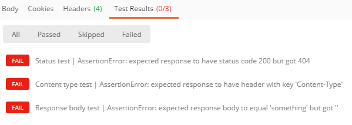

# <a name="set-up-notifications-for-changes-in-user-data"></a><span data-ttu-id="f1d7a-105">Configurar notificações para alterações nos dados de usuário</span><span class="sxs-lookup"><span data-stu-id="f1d7a-105">Set up notifications for changes in user data</span></span>

<span data-ttu-id="f1d7a-p102">A API do Microsoft Graph usa um mecanismo de webhook para fornecer notificações de alteração aos clientes. Um cliente é um serviço Web que configura sua própria URL para receber notificações. Aplicativos cliente usam notificações de alteração para atualizar seu estado após alterações.</span><span class="sxs-lookup"><span data-stu-id="f1d7a-p102">The Microsoft Graph API uses a webhook mechanism to deliver change notifications to clients. A client is a web service that configures its own URL to receive change notifications. Client apps use change notifications to update their state upon changes.</span></span>

<span data-ttu-id="f1d7a-109">Depois que o Microsoft Graph aceita a solicitação de assinatura, ele envia notificações de alteração por push para a URL especificada na assinatura.</span><span class="sxs-lookup"><span data-stu-id="f1d7a-109">After Microsoft Graph accepts the subscription request, it pushes change notifications to the URL specified in the subscription.</span></span> <span data-ttu-id="f1d7a-110">O aplicativo então realiza ações de acordo com sua lógica comercial.</span><span class="sxs-lookup"><span data-stu-id="f1d7a-110">The app then takes action according to its business logic.</span></span> <span data-ttu-id="f1d7a-111">Por exemplo, ele busca mais dados, atualiza o cache e as exibições, etc.</span><span class="sxs-lookup"><span data-stu-id="f1d7a-111">For example, it fetches more data, updates its cache and views, and so on.</span></span>


> [!VIDEO https://www.youtube-nocookie.com/embed/rC1bunenaq4]
 
> [!div class="nextstepaction"]
> [<span data-ttu-id="f1d7a-112">Tutorial: usar notificações de alteração e controlar alterações com o Microsoft Graph</span><span class="sxs-lookup"><span data-stu-id="f1d7a-112">Tutorial: Use Change Notifications and Track Changes with Microsoft Graph</span></span>](/learn/modules/msgraph-changenotifications-trackchanges)

<span data-ttu-id="f1d7a-113">Por padrão, as notificações de alteração não contêm dados de recursos, exceto o `id`.</span><span class="sxs-lookup"><span data-stu-id="f1d7a-113">By default, change notifications do not contain resource data, other than the `id`.</span></span> <span data-ttu-id="f1d7a-114">Se o aplicativo exigir dados de recursos, ele poderá fazer chamadas para as APIs do Microsoft Graph para obter o recurso completo.</span><span class="sxs-lookup"><span data-stu-id="f1d7a-114">If the app requires resource data, it can make calls to Microsoft Graph APIs to get the full resource.</span></span> <span data-ttu-id="f1d7a-115">Este artigo usa o recurso de **usuário** como um exemplo para trabalhar com notificações de alteração.</span><span class="sxs-lookup"><span data-stu-id="f1d7a-115">This article uses the **user** resource as an example for working with change notifications.</span></span>

<span data-ttu-id="f1d7a-116">Um aplicativo também pode se inscrever para alterar notificações que incluem dados de recursos, para evitar a necessidade de fazer chamadas de API adicionais para acessar os dados.</span><span class="sxs-lookup"><span data-stu-id="f1d7a-116">An app can also subscribe to change notifications that include resource data, to avoid having to make additional API calls to access the data.</span></span> <span data-ttu-id="f1d7a-117">Esses aplicativos precisarão implementar um código extra para lidar com os requisitos de tais notificações, especificamente: responder às notificações do ciclo de vida da assinatura, validar a autenticidade das notificações e descriptografar os dados do recurso.</span><span class="sxs-lookup"><span data-stu-id="f1d7a-117">Such apps will need to implement extra code to handle the requirements of such notifications, specifically: responding to subscription lifecycle notifications, validating the authenticity of notifications, and decrypting the resource data.</span></span> <span data-ttu-id="f1d7a-118">Para saber mais sobre como trabalhar com essas notificações, confira [Configurar notificações de alteração que incluam dados de recurso](webhooks-with-resource-data.md).</span><span class="sxs-lookup"><span data-stu-id="f1d7a-118">For details about how to work with these notifications, see [Set up change notifications that include resource data](webhooks-with-resource-data.md).</span></span>

## <a name="supported-resources"></a><span data-ttu-id="f1d7a-119">Recursos com suporte</span><span class="sxs-lookup"><span data-stu-id="f1d7a-119">Supported resources</span></span>

<span data-ttu-id="f1d7a-120">Usando a API do Microsoft Graph, um aplicativo pode se inscrever para alterações nos seguintes recursos:</span><span class="sxs-lookup"><span data-stu-id="f1d7a-120">Using the Microsoft Graph API, an app can subscribe to changes on the following resources:</span></span>

- <span data-ttu-id="f1d7a-121">Impressão na nuvem [printTaskDefinition][]</span><span class="sxs-lookup"><span data-stu-id="f1d7a-121">Cloud printing [printTaskDefinition][]</span></span>
- <span data-ttu-id="f1d7a-122">Conteúdo dentro da hierarquia do tipo de recurso [driveItem][] de _qualquer pasta_ no OneDrive pessoal do usuário</span><span class="sxs-lookup"><span data-stu-id="f1d7a-122">Content within the hierarchy of _any folder_ [driveItem][] on a user's personal OneDrive</span></span>
- <span data-ttu-id="f1d7a-123">Conteúdo dentro da hierarquia do tipo de recurso [driveItem][] de _pasta raiz_ no OneDrive for Business</span><span class="sxs-lookup"><span data-stu-id="f1d7a-123">Content within the hierarchy of the _root folder_ [driveItem][] on OneDrive for Business</span></span>
- <span data-ttu-id="f1d7a-124">[group][]</span><span class="sxs-lookup"><span data-stu-id="f1d7a-124">[group][]</span></span>
- <span data-ttu-id="f1d7a-125">[Conversa][] em grupo do Microsoft 365</span><span class="sxs-lookup"><span data-stu-id="f1d7a-125">Microsoft 365 group [conversation][]</span></span>
- <span data-ttu-id="f1d7a-126">[Evento][] do Outlook</span><span class="sxs-lookup"><span data-stu-id="f1d7a-126">Outlook [event][]</span></span>
- <span data-ttu-id="f1d7a-127">[Mensagem][] do Outlook</span><span class="sxs-lookup"><span data-stu-id="f1d7a-127">Outlook [message][]</span></span>
- <span data-ttu-id="f1d7a-128">[Contato][] pessoal do Outlook</span><span class="sxs-lookup"><span data-stu-id="f1d7a-128">Outlook personal [contact][]</span></span>
- <span data-ttu-id="f1d7a-129">[Alerta][] de segurança</span><span class="sxs-lookup"><span data-stu-id="f1d7a-129">Security [alert][]</span></span>
- <span data-ttu-id="f1d7a-130">[Lista][] do Microsoft Office SharePoint Online</span><span class="sxs-lookup"><span data-stu-id="f1d7a-130">SharePoint [list][]</span></span>
- <span data-ttu-id="f1d7a-131">Teams [callRecord][]</span><span class="sxs-lookup"><span data-stu-id="f1d7a-131">Teams [callRecord][]</span></span>
- <span data-ttu-id="f1d7a-132">Teams [chatMessage][]</span><span class="sxs-lookup"><span data-stu-id="f1d7a-132">Teams [chatMessage][]</span></span>
- <span data-ttu-id="f1d7a-133">[presence][] do Teams (visualização)</span><span class="sxs-lookup"><span data-stu-id="f1d7a-133">Teams [presence][] (preview)</span></span>
- <span data-ttu-id="f1d7a-134">[todoTask][] (pré-visualização)</span><span class="sxs-lookup"><span data-stu-id="f1d7a-134">[todoTask][] (preview)</span></span>
- <span data-ttu-id="f1d7a-135">[usuário][]</span><span class="sxs-lookup"><span data-stu-id="f1d7a-135">[user][]</span></span>

<span data-ttu-id="f1d7a-136">Você pode criar uma assinatura para uma pasta de específica do Outlook, como a Caixa de Entrada: `me/mailFolders('inbox')/messages`</span><span class="sxs-lookup"><span data-stu-id="f1d7a-136">You can create a subscription to a specific Outlook folder such as the Inbox: `me/mailFolders('inbox')/messages`</span></span>

<span data-ttu-id="f1d7a-137">Ou para um recurso de nível superior: `/me/messages`, `/me/contacts`, `/me/events`, `users`, `groups`, `/communications/callRecords`</span><span class="sxs-lookup"><span data-stu-id="f1d7a-137">Or to a top-level resource: `/me/messages`, `/me/contacts`, `/me/events`, `users`, `groups`, `/communications/callRecords`</span></span>

<span data-ttu-id="f1d7a-138">Ou para uma instância de recurso específica: `users/{id}`, `groups/{id}`, `groups/{id}/conversations`, `sites/{site-id}/lists/{list-id}`, `/communications/presences/{id}`</span><span class="sxs-lookup"><span data-stu-id="f1d7a-138">Or to a specific resource instance: `users/{id}`, `groups/{id}`, `groups/{id}/conversations`, `sites/{site-id}/lists/{list-id}`, `/communications/presences/{id}`</span></span>

<span data-ttu-id="f1d7a-139">Ou para alguma pasta no OneDrive pessoal de um usuário: `/drives/{id}/root`
`/drives/{id}/root/subfolder`</span><span class="sxs-lookup"><span data-stu-id="f1d7a-139">Or to any folder in a user's personal OneDrive: `/drives/{id}/root`
`/drives/{id}/root/subfolder`</span></span>

<span data-ttu-id="f1d7a-140">Ou para a pasta raiz de uma unidade do SharePoint/OneDrive for Business: `/drive/root`</span><span class="sxs-lookup"><span data-stu-id="f1d7a-140">Or to the root folder of a SharePoint/OneDrive for Business drive: `/drive/root`</span></span>

<span data-ttu-id="f1d7a-141">Ou para um novo alerta da [API de Segurança](security-concept-overview.md): `/security/alerts?$filter=status eq 'newAlert'`, `/security/alerts?$filter=vendorInformation/provider eq 'ASC'`</span><span class="sxs-lookup"><span data-stu-id="f1d7a-141">Or to a new [Security API](security-concept-overview.md) alert: `/security/alerts?$filter=status eq 'newAlert'`, `/security/alerts?$filter=vendorInformation/provider eq 'ASC'`</span></span>

<span data-ttu-id="f1d7a-142">Ou para as tarefas na Lista de Tarefas Pendentes de um usuário: `/me/todo/lists/{todoTaskListId}/tasks`</span><span class="sxs-lookup"><span data-stu-id="f1d7a-142">Or to the tasks in a user's To Do list: `/me/todo/lists/{todoTaskListId}/tasks`</span></span>

### <a name="azure-ad-resource-limitations"></a><span data-ttu-id="f1d7a-143">Limitações de recursos do Microsoft Azure AD</span><span class="sxs-lookup"><span data-stu-id="f1d7a-143">Azure AD resource limitations</span></span>

<span data-ttu-id="f1d7a-144">Determinadas limites se aplicam aos recursos baseados no Azure AD (usuários, grupos) e gerarão erros se forem excedidos:</span><span class="sxs-lookup"><span data-stu-id="f1d7a-144">Certain limits apply to Azure AD based resources (users, groups) and will generate errors when exceeded:</span></span>

> <span data-ttu-id="f1d7a-145">**Observação**: Esses limites não se aplicam aos recursos de serviços diferente do Azure AD.</span><span class="sxs-lookup"><span data-stu-id="f1d7a-145">**Note**: These limits do not apply to resources from services other than Azure AD.</span></span> <span data-ttu-id="f1d7a-146">Por exemplo, um aplicativo pode criar muito mais assinaturas para `message` ou recursos `event` que são aceitos pelo serviço Exchange Online como parte do Microsoft Graph.</span><span class="sxs-lookup"><span data-stu-id="f1d7a-146">For example, an app can create many more subscriptions to `message` or `event` resources, which are supported by the Exchange Online service as part of Microsoft Graph.</span></span>

- <span data-ttu-id="f1d7a-147">Cotas máximas de assinaturas:</span><span class="sxs-lookup"><span data-stu-id="f1d7a-147">Maximum subscription quotas:</span></span>

  - <span data-ttu-id="f1d7a-148">Por aplicativo (para todos os locatários combinados): 50.000 assinaturas totais</span><span class="sxs-lookup"><span data-stu-id="f1d7a-148">Per app (for all tenants combined): 50,000 total subscriptions</span></span>
  - <span data-ttu-id="f1d7a-149">Por locatário (para todos os aplicativos combinados): 1000 total de assinaturas em todos os aplicativos</span><span class="sxs-lookup"><span data-stu-id="f1d7a-149">Per tenant (for all applications combined): 1000 total subscriptions across all apps</span></span>
  - <span data-ttu-id="f1d7a-150">Combinação por aplicativo e locatário: 100 assinaturas no total</span><span class="sxs-lookup"><span data-stu-id="f1d7a-150">Per app and tenant combination: 100 total subscriptions</span></span>

<span data-ttu-id="f1d7a-151">Quando os limites são excedidos, a tentativa de criar uma assinatura resultará em uma [resposta de erro](errors.md) - `403 Forbidden`.</span><span class="sxs-lookup"><span data-stu-id="f1d7a-151">When any limit is exceeded, attempts to create a subscription will result in an [error response](errors.md) - `403 Forbidden`.</span></span> <span data-ttu-id="f1d7a-152">A propriedade `message` explicará qual limite foi excedido.</span><span class="sxs-lookup"><span data-stu-id="f1d7a-152">The `message` property will explain which limit has been exceeded.</span></span>

- <span data-ttu-id="f1d7a-153">Não há suporte a locatários do Microsoft Azure AD B2C.</span><span class="sxs-lookup"><span data-stu-id="f1d7a-153">Azure AD B2C tenants are not supported.</span></span>

- <span data-ttu-id="f1d7a-154">Não há suporte a notificações de alteração para contas Microsoft pessoais.</span><span class="sxs-lookup"><span data-stu-id="f1d7a-154">Change notification for user entities are not supported for personal Microsoft accounts.</span></span>

- <span data-ttu-id="f1d7a-155">Existe um [problema conhecido](known-issues.md#change-notifications) nas assinaturas de usuários e grupos.</span><span class="sxs-lookup"><span data-stu-id="f1d7a-155">A [known issue](known-issues.md#change-notifications) exists with user and group subscriptions.</span></span>

### <a name="outlook-resource-limitations"></a><span data-ttu-id="f1d7a-156">Limitações de recursos do Outlook</span><span class="sxs-lookup"><span data-stu-id="f1d7a-156">Outlook resource limitations</span></span>

<span data-ttu-id="f1d7a-157">Ao se inscrever em recursos do Outlook, tais como **mensagens**, **eventos** ou **contatos**, se você decidir usar o *nome UPN* em um caminho de recurso, a solicitação de assinatura pode falhar caso o UPN contenha um apóstrofo.</span><span class="sxs-lookup"><span data-stu-id="f1d7a-157">When subscribing to Outlook resources such as **messages**, **events** or **contacts**, if you choose to use the *user principal name* UPN in the resource path, the subscription request might fail if the UPN contains an apostrophe.</span></span> <span data-ttu-id="f1d7a-158">Considere usar IDs de usuário de GUID em vez de UPNs para evitar esse problema.</span><span class="sxs-lookup"><span data-stu-id="f1d7a-158">Consider using GUID user IDs instead of UPNs to avoid running into this problem.</span></span> <span data-ttu-id="f1d7a-159">Por exemplo, em vez de usar o caminho de recursos:</span><span class="sxs-lookup"><span data-stu-id="f1d7a-159">For example, instead of using resource path:</span></span>

`/users/sh.o'neal@contoso.com/messages`

<span data-ttu-id="f1d7a-160">Use:</span><span class="sxs-lookup"><span data-stu-id="f1d7a-160">Use:</span></span> 

`/users/{guid-user-id}/messages`

### <a name="teams-resource-limitations"></a><span data-ttu-id="f1d7a-161">Limitações de recursos do Teams</span><span class="sxs-lookup"><span data-stu-id="f1d7a-161">Teams resource limitations</span></span>

<span data-ttu-id="f1d7a-162">Cada recurso do Teams possui cotas de assinatura diferentes.</span><span class="sxs-lookup"><span data-stu-id="f1d7a-162">Each Teams resource has different subscription quotas.</span></span>

- <span data-ttu-id="f1d7a-163">Para assinaturas do **callRecords**:</span><span class="sxs-lookup"><span data-stu-id="f1d7a-163">For subscriptions to **callRecords**:</span></span>
  - <span data-ttu-id="f1d7a-164">Por organização: 100 assinaturas totais</span><span class="sxs-lookup"><span data-stu-id="f1d7a-164">Per organization: 100 total subscriptions</span></span>

- <span data-ttu-id="f1d7a-165">Para assinaturas de **chatMessages** (canais ou chats):</span><span class="sxs-lookup"><span data-stu-id="f1d7a-165">For subscriptions to **chatMessages** (channels or chats):</span></span>
  - <span data-ttu-id="f1d7a-166">Por combinação por aplicativo e canal ou por chat: uma assinatura</span><span class="sxs-lookup"><span data-stu-id="f1d7a-166">Per app and channel or chat combination: 1 subscription</span></span>
  - <span data-ttu-id="f1d7a-167">Por organização: 10.000 assinaturas totais</span><span class="sxs-lookup"><span data-stu-id="f1d7a-167">Per organization: 10,000 total subscriptions</span></span>

## <a name="subscription-lifetime"></a><span data-ttu-id="f1d7a-168">Tempo de vida da assinatura</span><span class="sxs-lookup"><span data-stu-id="f1d7a-168">Subscription lifetime</span></span>

<span data-ttu-id="f1d7a-169">As assinaturas têm tempo de vida limitado.</span><span class="sxs-lookup"><span data-stu-id="f1d7a-169">Subscriptions have a limited lifetime.</span></span> <span data-ttu-id="f1d7a-170">Os aplicativos precisam renovar suas assinaturas antes do tempo de expiração.</span><span class="sxs-lookup"><span data-stu-id="f1d7a-170">Apps need to renew their subscriptions before the expiration time.</span></span> <span data-ttu-id="f1d7a-171">Caso contrário, será preciso criar uma nova assinatura.</span><span class="sxs-lookup"><span data-stu-id="f1d7a-171">Otherwise, they need to create a new subscription.</span></span> <span data-ttu-id="f1d7a-172">Confira a lista de prazos máximos em [Prazo máximo de assinatura por tipo de recurso](/graph/api/resources/subscription?view=graph-rest-1.0#maximum-length-of-subscription-per-resource-type).</span><span class="sxs-lookup"><span data-stu-id="f1d7a-172">For a list of maximum expiration times, see [Maximum length of subscription per resource type](/graph/api/resources/subscription?view=graph-rest-1.0#maximum-length-of-subscription-per-resource-type).</span></span>

<span data-ttu-id="f1d7a-173">Os aplicativos também podem cancelar a assinatura a qualquer momento para deixarem de receber notificações de alteração.</span><span class="sxs-lookup"><span data-stu-id="f1d7a-173">Apps can also unsubscribe at any time to stop getting change notifications.</span></span>

## <a name="managing-subscriptions"></a><span data-ttu-id="f1d7a-174">Gerenciar assinaturas</span><span class="sxs-lookup"><span data-stu-id="f1d7a-174">Managing subscriptions</span></span>

<span data-ttu-id="f1d7a-175">Os clientes podem criar, renovar e excluir assinaturas.</span><span class="sxs-lookup"><span data-stu-id="f1d7a-175">Clients can create subscriptions, renew subscriptions, and delete subscriptions.</span></span>

### <a name="creating-a-subscription"></a><span data-ttu-id="f1d7a-176">Criar uma assinatura</span><span class="sxs-lookup"><span data-stu-id="f1d7a-176">Creating a subscription</span></span>

<span data-ttu-id="f1d7a-177">Criar uma assinatura é a primeira etapa para começar a receber notificações de alteração de um recurso.</span><span class="sxs-lookup"><span data-stu-id="f1d7a-177">Creating a subscription is the first step to start receiving change notifications for a resource.</span></span> <span data-ttu-id="f1d7a-178">O processo de assinatura ocorre da seguinte maneira:</span><span class="sxs-lookup"><span data-stu-id="f1d7a-178">The subscription process is as follows:</span></span>

1. <span data-ttu-id="f1d7a-179">O cliente envia uma solicitação de assinatura (POST) para um recurso específico.</span><span class="sxs-lookup"><span data-stu-id="f1d7a-179">The client sends a subscription (POST) request for a specific resource.</span></span>

1. <span data-ttu-id="f1d7a-180">O Microsoft Graph verifica a solicitação.</span><span class="sxs-lookup"><span data-stu-id="f1d7a-180">Microsoft Graph verifies the request.</span></span>

    - <span data-ttu-id="f1d7a-181">Se a solicitação for válida, o Microsoft Graph enviará um token de validação para a URL de notificação.</span><span class="sxs-lookup"><span data-stu-id="f1d7a-181">If the request is valid, Microsoft Graph sends a validation token to the notification URL.</span></span>
    - <span data-ttu-id="f1d7a-182">Se a solicitação for inválida, o Microsoft Graph enviará uma resposta de erro com um código e detalhes.</span><span class="sxs-lookup"><span data-stu-id="f1d7a-182">If the request is invalid, Microsoft Graph sends an error response with code and details.</span></span>

1. <span data-ttu-id="f1d7a-183">O cliente envia o token de validação de volta para o Microsoft Graph.</span><span class="sxs-lookup"><span data-stu-id="f1d7a-183">The client sends the validation token back to Microsoft Graph.</span></span>

1. <span data-ttu-id="f1d7a-184">O Microsoft Graph envia uma resposta de volta para o cliente.</span><span class="sxs-lookup"><span data-stu-id="f1d7a-184">The Microsoft Graph sends a response back to the client.</span></span>

<span data-ttu-id="f1d7a-185">O cliente deve armazenar a ID da assinatura para correlacionar notificações de alteração com a assinatura.</span><span class="sxs-lookup"><span data-stu-id="f1d7a-185">The client must store the subscription ID to correlate change notifications with the subscription.</span></span>

#### <a name="subscription-request-example"></a><span data-ttu-id="f1d7a-186">Exemplo de solicitação de assinatura</span><span class="sxs-lookup"><span data-stu-id="f1d7a-186">Subscription request example</span></span>

```http
POST https://graph.microsoft.com/v1.0/subscriptions
Content-Type: application/json
{
  "changeType": "created,updated",
  "notificationUrl": "https://webhook.azurewebsites.net/notificationClient",
  "resource": "/me/mailfolders('inbox')/messages",
  "expirationDateTime": "2016-03-20T11:00:00.0000000Z",
  "clientState": "SecretClientState"
}
```

<span data-ttu-id="f1d7a-187">As propriedades `changeType`, `notificationUrl`, `resource` e `expirationDateTime` são obrigatórias.</span><span class="sxs-lookup"><span data-stu-id="f1d7a-187">The `changeType`, `notificationUrl`, `resource`, and `expirationDateTime` properties are required.</span></span> <span data-ttu-id="f1d7a-188">Confira os valores e as definições de propriedade em [tipo de recurso de assinatura](/graph/api/resources/subscription?view=graph-rest-1.0).</span><span class="sxs-lookup"><span data-stu-id="f1d7a-188">See [subscription resource type](/graph/api/resources/subscription?view=graph-rest-1.0) for property definitions and values.</span></span>

<span data-ttu-id="f1d7a-189">A propriedade `resource` especifica o recurso que será monitorado para detectar alterações.</span><span class="sxs-lookup"><span data-stu-id="f1d7a-189">The `resource` property specifies the resource that will be monitored for changes.</span></span> <span data-ttu-id="f1d7a-190">Por exemplo, você pode criar uma assinatura para uma pasta de email específica: `me/mailFolders('inbox')/messages` ou em nome de um usuário, atribuído com uma autorização do administrador: `users/john.doe@onmicrosoft.com/mailFolders('inbox')/messages`.</span><span class="sxs-lookup"><span data-stu-id="f1d7a-190">For example, you can create a subscription to a specific mail folder: `me/mailFolders('inbox')/messages` or on behalf of a user given by an administrator  consent: `users/john.doe@onmicrosoft.com/mailFolders('inbox')/messages`.</span></span>

<span data-ttu-id="f1d7a-191">Embora `clientState` não seja obrigatória, você deve incluí-la para manter a conformidade com nosso processo recomendado de manipulação de notificações de alterações.</span><span class="sxs-lookup"><span data-stu-id="f1d7a-191">Although `clientState` is not required, you must include it to comply with our recommended change notification handling process.</span></span> <span data-ttu-id="f1d7a-192">A definição desta propriedade permitirá confirmar se as notificações de alteração recebidas partiram do serviço do Microsoft Graph.</span><span class="sxs-lookup"><span data-stu-id="f1d7a-192">Setting this property will allow you to confirm that change notifications you receive originate from the Microsoft Graph service.</span></span> <span data-ttu-id="f1d7a-193">Por esse motivo, o valor da propriedade deve continuar em segredo e deve ser conhecido somente por seu aplicativo e pelo serviço do Microsoft Graph.</span><span class="sxs-lookup"><span data-stu-id="f1d7a-193">For this reason, the value of the property should remain secret and known only to your application and the Microsoft Graph service.</span></span>

<span data-ttu-id="f1d7a-194">Se tiver êxito, o Microsoft Graph retornará um código `201 Created` e um objeto [subscription](/graph/api/resources/subscription?view=graph-rest-1.0) no corpo.</span><span class="sxs-lookup"><span data-stu-id="f1d7a-194">If successful, Microsoft Graph returns a `201 Created` code and a [subscription](/graph/api/resources/subscription?view=graph-rest-1.0) object in the body.</span></span>

> <span data-ttu-id="f1d7a-195">**Observação:** Qualquer parâmetro da cadeia de caracteres de consulta incluído na propriedade **notificationUrl** será incluído na solicitação de POST HTTP quando as notificações estiverem sendo entregues.</span><span class="sxs-lookup"><span data-stu-id="f1d7a-195">**Note:** Any query string parameter included in the **notificationUrl** property will be included in the HTTP POST request when notifications are being delivered.</span></span>

#### <a name="notification-endpoint-validation"></a><span data-ttu-id="f1d7a-196">Validação de ponto de extremidade de notificação</span><span class="sxs-lookup"><span data-stu-id="f1d7a-196">Notification endpoint validation</span></span>

<span data-ttu-id="f1d7a-197">O Microsoft Graph valida o ponto de extremidade de notificação fornecido na propriedade `notificationUrl` da solicitação de assinatura antes de criar a assinatura.</span><span class="sxs-lookup"><span data-stu-id="f1d7a-197">Microsoft Graph validates the notification endpoint provided in the `notificationUrl` property of the subscription request before creating the subscription.</span></span> <span data-ttu-id="f1d7a-198">O processo de validação ocorre da seguinte maneira:</span><span class="sxs-lookup"><span data-stu-id="f1d7a-198">The validation process occurs as follows:</span></span>

1. <span data-ttu-id="f1d7a-199">O Microsoft Graph codifica um token de validação e o inclui em uma solicitação POST na URL da notificação:</span><span class="sxs-lookup"><span data-stu-id="f1d7a-199">Microsoft Graph encodes a validation token and includes it in a POST request to the notification URL:</span></span>

    ``` http
    Content-Type: text/plain; charset=utf-8
    POST https://{notificationUrl}?validationToken={opaqueTokenCreatedByMicrosoftGraph}
    ```

1. <span data-ttu-id="f1d7a-200">O cliente deve realizar a decodificação URL do `validationToken` fornecido corretamente na etapa anterior e escapar de um HTML/JavaScript.</span><span class="sxs-lookup"><span data-stu-id="f1d7a-200">The client must properly URL decode the `validationToken` query parameter provided in the preceding step, and escape any HTML/JavaScript.</span></span>

   <span data-ttu-id="f1d7a-201">Escapar é uma boa prática porque atores maliciosos podem usar o ponto de extremidade de notificação para o tipo de ataques de script entre sites.</span><span class="sxs-lookup"><span data-stu-id="f1d7a-201">Escaping is a good practice because malicious actors can use the notification endpoint for cross-site scripting type of attacks.</span></span>

   <span data-ttu-id="f1d7a-202">Em geral, trate o valor do token de validação como opaco, uma vez que o formato do token geralmente pode ser alterado sem aviso.</span><span class="sxs-lookup"><span data-stu-id="f1d7a-202">In general, treat the validation token value as opaque, as the token format can generally change without notice.</span></span> <span data-ttu-id="f1d7a-203">O Microsoft Graph nunca envia nenhum valor contendo código HTML ou JavaScript.</span><span class="sxs-lookup"><span data-stu-id="f1d7a-203">Microsoft Graph never sends any value containing HTML or JavaScript code.</span></span>

1. <span data-ttu-id="f1d7a-204">O cliente deve fornecer uma resposta com as seguintes características em até 10 segundos da etapa 1:</span><span class="sxs-lookup"><span data-stu-id="f1d7a-204">The client must provide a response with the following characteristics within 10 seconds of step 1:</span></span>

    - <span data-ttu-id="f1d7a-205">Um código de status de `HTTP 200 OK`.</span><span class="sxs-lookup"><span data-stu-id="f1d7a-205">A status code of `HTTP 200 OK`.</span></span>
    - <span data-ttu-id="f1d7a-206">Um tipo de conteúdo de `text/plain`.</span><span class="sxs-lookup"><span data-stu-id="f1d7a-206">A content type of `text/plain`.</span></span>
    - <span data-ttu-id="f1d7a-207">Um corpo que inclui o token de validação _URL decodificada_.</span><span class="sxs-lookup"><span data-stu-id="f1d7a-207">A body that includes the _URL decoded_ validation token.</span></span> <span data-ttu-id="f1d7a-208">Basta refletir a mesma cadeia que foi enviada no parâmetro de consulta `validationToken`.</span><span class="sxs-lookup"><span data-stu-id="f1d7a-208">Simply reflect back the same string that was sent in the `validationToken` query parameter.</span></span>

    <span data-ttu-id="f1d7a-209">O cliente deve descartar o token de validação depois de o fornecer na resposta.</span><span class="sxs-lookup"><span data-stu-id="f1d7a-209">The client should discard the validation token after providing it in the response.</span></span>

    > <span data-ttu-id="f1d7a-210">**Importante:** se o cliente retornar um token de validação codificado, a validação falhará.</span><span class="sxs-lookup"><span data-stu-id="f1d7a-210">**Important:** If the client returns an encoded validation token, the validation will fail.</span></span>

<span data-ttu-id="f1d7a-211">Além disso, você pode usar a [coleção do Microsoft Graph Postman](use-postman.md) para confirmar que o ponto de extremidade implementa a solicitação de validação.</span><span class="sxs-lookup"><span data-stu-id="f1d7a-211">Additionally, you can use the [Microsoft Graph Postman collection](use-postman.md) to confirm that your endpoint properly implements the validation request.</span></span> <span data-ttu-id="f1d7a-212">A solicitação de **Validação de Assinaturas** na pasta **Diversos** fornece testes de unidade que validam a resposta fornecida por seu ponto de extremidade.</span><span class="sxs-lookup"><span data-stu-id="f1d7a-212">The **Subscription Validation** request in the **Misc** folder provides unit tests that validate the response provided by your endpoint.</span></span>  



### <a name="renewing-a-subscription"></a><span data-ttu-id="f1d7a-214">Renovar uma assinatura</span><span class="sxs-lookup"><span data-stu-id="f1d7a-214">Renewing a subscription</span></span>

<span data-ttu-id="f1d7a-215">O cliente pode renovar uma assinatura com uma data de expiração específica de até três dias desde a hora da solicitação.</span><span class="sxs-lookup"><span data-stu-id="f1d7a-215">The client can renew a subscription with a specific expiration date of up to three days from the time of request.</span></span> <span data-ttu-id="f1d7a-216">A propriedade `expirationDateTime` é obrigatória.</span><span class="sxs-lookup"><span data-stu-id="f1d7a-216">The `expirationDateTime` property is required.</span></span>

#### <a name="subscription-renewal-example"></a><span data-ttu-id="f1d7a-217">Exemplo de renovação de assinatura</span><span class="sxs-lookup"><span data-stu-id="f1d7a-217">Subscription renewal example</span></span>

```http
PATCH https://graph.microsoft.com/v1.0/subscriptions/{id}
Content-Type: application/json

{
  "expirationDateTime": "2016-03-22T11:00:00.0000000Z"
}
```

<span data-ttu-id="f1d7a-218">Se tiver êxito, o Microsoft Graph retornará um código `200 OK` e um objeto [subscription](/graph/api/resources/subscription?view=graph-rest-1.0) no corpo.</span><span class="sxs-lookup"><span data-stu-id="f1d7a-218">If successful, Microsoft Graph returns a `200 OK` code and a [subscription](/graph/api/resources/subscription?view=graph-rest-1.0) object in the body.</span></span> <span data-ttu-id="f1d7a-219">O objeto subscription inclui o novo valor de `expirationDateTime`.</span><span class="sxs-lookup"><span data-stu-id="f1d7a-219">The subscription object includes the new `expirationDateTime` value.</span></span>

### <a name="deleting-a-subscription"></a><span data-ttu-id="f1d7a-220">Excluindo uma assinatura</span><span class="sxs-lookup"><span data-stu-id="f1d7a-220">Deleting a subscription</span></span>

<span data-ttu-id="f1d7a-221">O cliente pode parar de receber notificações de alteração excluindo a assinatura com o uso de sua ID.</span><span class="sxs-lookup"><span data-stu-id="f1d7a-221">The client can stop receiving change notifications by deleting the subscription using its ID.</span></span>

```http
DELETE https://graph.microsoft.com/v1.0/subscriptions/{id}
```

<span data-ttu-id="f1d7a-222">Se tiver êxito, o Microsoft Graph retornará um código `204 No Content`.</span><span class="sxs-lookup"><span data-stu-id="f1d7a-222">If successful, Microsoft Graph returns a `204 No Content` code.</span></span>

## <a name="change-notifications"></a><span data-ttu-id="f1d7a-223">Notificações de alteração</span><span class="sxs-lookup"><span data-stu-id="f1d7a-223">Change notifications</span></span>

<span data-ttu-id="f1d7a-224">Com uma assinatura do cliente em um recurso, o Microsoft Graph envia uma solicitação `POST` para a URL da notificação sempre que o recurso é alterado.</span><span class="sxs-lookup"><span data-stu-id="f1d7a-224">With a client subscribing to changes to a resource, Microsoft Graph sends a `POST` request to the notification URL whenever the resource changes.</span></span> <span data-ttu-id="f1d7a-225">Notificações são enviadas somente para as alterações do tipo especificado na assinatura, por exemplo, `created`.</span><span class="sxs-lookup"><span data-stu-id="f1d7a-225">It sends notifications only for changes of the type that's specified in the subscription, for example, `created`.</span></span>

> <span data-ttu-id="f1d7a-226">**Observação:** se um cliente tiver várias assinaturas que monitoram o mesmo recurso e usam a mesma URL de notificação, o Microsoft Graph poderá enviar várias notificações de alteração que correspondam a diferentes assinaturas, cada uma mostrando a ID da assinatura correspondente.</span><span class="sxs-lookup"><span data-stu-id="f1d7a-226">**Note:** If a client has multiple subscriptions that monitor the same resource and use the same notification URL, Microsoft Graph can send multiple change notifications that correspond to different subscriptions, each showing the corresponding subscription ID.</span></span> <span data-ttu-id="f1d7a-227">Não há garantias de que todas as notificações na solicitação `POST` pertencerão a uma única assinatura.</span><span class="sxs-lookup"><span data-stu-id="f1d7a-227">There is no guarantee that all change notifications in the `POST` request belong to a single subscription.</span></span>

### <a name="change-notification-example"></a><span data-ttu-id="f1d7a-228">Exemplo de notificação de alteração</span><span class="sxs-lookup"><span data-stu-id="f1d7a-228">Change notification example</span></span>

<span data-ttu-id="f1d7a-229">Esta seção mostra um exemplo de uma notificação para a criação de uma mensagem.</span><span class="sxs-lookup"><span data-stu-id="f1d7a-229">This section shows an example of a notification for a message creation.</span></span> <span data-ttu-id="f1d7a-230">Quando o usuário recebe um email, o Microsoft Graph envia uma notificação de alteração como mostrado no exemplo a seguir.</span><span class="sxs-lookup"><span data-stu-id="f1d7a-230">When the user receives an email, Microsoft Graph sends a change notification as shown in the following example.</span></span>
<span data-ttu-id="f1d7a-231">Observe que a notificação está em uma coleção representada no campo `value`.</span><span class="sxs-lookup"><span data-stu-id="f1d7a-231">Note that the notification is in a collection represented in the `value` field.</span></span> <span data-ttu-id="f1d7a-232">Confira [changeNotificationCollection](/graph/api/resources/changenotificationcollection) para obter detalhes da carga de notificação.</span><span class="sxs-lookup"><span data-stu-id="f1d7a-232">See [changeNotificationCollection](/graph/api/resources/changenotificationcollection) for details of the notification payload.</span></span> 

<span data-ttu-id="f1d7a-233">Quando várias alterações ocorrerem, o Microsoft Graph poderá enviar várias notificações que correspondam a diferentes assinaturas na mesma solicitação `POST`.</span><span class="sxs-lookup"><span data-stu-id="f1d7a-233">When many changes occur, Microsoft Graph may send multiple notifications that correspond to different subscriptions in the same `POST` request.</span></span>

```json
{
  "value": [
    {
      "id": "lsgTZMr9KwAAA",
      "subscriptionId":"{subscription_guid}",
      "subscriptionExpirationDateTime":"2016-03-19T22:11:09.952Z",
      "clientState":"secretClientValue",
      "changeType":"created",
      "resource":"users/{user_guid}@{tenant_guid}/messages/{long_id_string}",
      "tenantId": "84bd8158-6d4d-4958-8b9f-9d6445542f95",
      "resourceData":
      {
        "@odata.type":"#Microsoft.Graph.Message",
        "@odata.id":"Users/{user_guid}@{tenant_guid}/Messages/{long_id_string}",
        "@odata.etag":"W/\"CQAAABYAAADkrWGo7bouTKlsgTZMr9KwAAAUWRHf\"",
        "id":"{long_id_string}"
      }
    }
  ]
}
```

### <a name="processing-the-change-notification"></a><span data-ttu-id="f1d7a-234">Processar a notificação de alteração</span><span class="sxs-lookup"><span data-stu-id="f1d7a-234">Processing the change notification</span></span>

<span data-ttu-id="f1d7a-235">O processo deve processar todas as notificações de alteração recebidas.</span><span class="sxs-lookup"><span data-stu-id="f1d7a-235">Your process should process every change notification it receives.</span></span> <span data-ttu-id="f1d7a-236">Estas são as tarefas mínimas que o seu aplicativo deve realizar para processar uma notificação de alteração:</span><span class="sxs-lookup"><span data-stu-id="f1d7a-236">The following are the minimum tasks that your app must perform to process a change notification:</span></span>

1. <span data-ttu-id="f1d7a-237">Envie um código de status `202 - Accepted` na sua resposta para o Microsoft Graph.</span><span class="sxs-lookup"><span data-stu-id="f1d7a-237">Send a `202 - Accepted` status code in your response to Microsoft Graph.</span></span> <span data-ttu-id="f1d7a-238">Se o Microsoft Graph não receber um código de classe 2xx, ele tentará publicar a notificação de alteração algumas vezes, por um período de aproximadamente 4 horas; depois disso, a notificação será descartada e não será entregue.</span><span class="sxs-lookup"><span data-stu-id="f1d7a-238">If Microsoft Graph doesn't receive a 2xx class code, it will try to publishing the change notification a number of times, for a period of about 4 hours; after that, the change notification will be dropped and won't be delivered.</span></span>

    > <span data-ttu-id="f1d7a-239">**Observação:** Envie um código de status `202 - Accepted` assim que receber a notificação de alteração, mesmo antes de validar a sua autenticidade.</span><span class="sxs-lookup"><span data-stu-id="f1d7a-239">**Note:** Send a `202 - Accepted` status code as soon as you receive the change notification, even before validating its authenticity.</span></span> <span data-ttu-id="f1d7a-240">Você está simplesmente confirmando o recebimento da notificação de alteração e impedindo tentativas desnecessárias.</span><span class="sxs-lookup"><span data-stu-id="f1d7a-240">You are simply acknowledging the receipt of the change notification and preventing unnecessary retries.</span></span> <span data-ttu-id="f1d7a-241">O tempo limite atual é de 30 segundos, mas pode ser reduzido no futuro para otimizar o desempenho do serviço.</span><span class="sxs-lookup"><span data-stu-id="f1d7a-241">The current timeout is 30 seconds, but it might be reduced in the future to optimize service performance.</span></span> <span data-ttu-id="f1d7a-242">Se a URL da notificação não responder dentro de 30 segundos para mais de 10% das solicitações do Microsoft Graph durante um período de 10 minutos, todas as notificações a seguir serão adiadas e repetidas por um período de 4 horas.</span><span class="sxs-lookup"><span data-stu-id="f1d7a-242">If the notification URL doesn't reply within 30 seconds for more than 10% of the requests from Microsoft Graph over a 10 minute period, all following notifications will be delayed and retried for a period of 4 hours.</span></span> <span data-ttu-id="f1d7a-243">Se uma URL da notificação não responder dentro de 30 segundos para mais de 20% das solicitações do Microsoft Graph durante um período de 10 minutos, todas as notificações a seguir serão descartadas.</span><span class="sxs-lookup"><span data-stu-id="f1d7a-243">If a notification URL doesn't reply within 30 seconds for more than 20% of the requests from Microsoft Graph over a 10 minute period, all following notifications will be dropped.</span></span>

1. <span data-ttu-id="f1d7a-244">Validar a propriedade `clientState`.</span><span class="sxs-lookup"><span data-stu-id="f1d7a-244">Validate the `clientState` property.</span></span> <span data-ttu-id="f1d7a-245">Ela deve corresponder ao valor enviado originalmente com a solicitação de criação da assinatura.</span><span class="sxs-lookup"><span data-stu-id="f1d7a-245">It must match the value originally submitted with the subscription creation request.</span></span>

    > <span data-ttu-id="f1d7a-246">**Observação:** se isso não for verdadeiro, você não deverá considerar esta notificação como válida.</span><span class="sxs-lookup"><span data-stu-id="f1d7a-246">**Note:** If this isn't true, you should not consider this a valid change notification.</span></span> <span data-ttu-id="f1d7a-247">É possível que a notificação de alteração não tenha se originado do Microsoft Graph e possa ter sido enviada por um ator invasor.</span><span class="sxs-lookup"><span data-stu-id="f1d7a-247">It is possible that the change notification has not originated from Microsoft Graph and may have been sent by a rogue actor.</span></span> <span data-ttu-id="f1d7a-248">Você também deve investigar de onde vem a notificação de alteração e tomar as medidas apropriadas.</span><span class="sxs-lookup"><span data-stu-id="f1d7a-248">You should also investigate where the change notification comes from and take appropriate action.</span></span>

1. <span data-ttu-id="f1d7a-249">Atualize seu aplicativo com base na sua lógica comercial.</span><span class="sxs-lookup"><span data-stu-id="f1d7a-249">Update your application based on your business logic.</span></span>

<span data-ttu-id="f1d7a-250">Repita o procedimento para outras notificações de alteração na solicitação.</span><span class="sxs-lookup"><span data-stu-id="f1d7a-250">Repeat for other change notifications in the request.</span></span>

## <a name="code-samples"></a><span data-ttu-id="f1d7a-251">Exemplos de código</span><span class="sxs-lookup"><span data-stu-id="f1d7a-251">Code samples</span></span>

<span data-ttu-id="f1d7a-252">Os exemplos de código a seguir estão disponíveis no GitHub.</span><span class="sxs-lookup"><span data-stu-id="f1d7a-252">The following code samples are available on GitHub.</span></span>

- [<span data-ttu-id="f1d7a-253">Módulo de Treinamento do Microsoft Graph - Usar notificações de alteração e controlar alterações com o Microsoft Graph</span><span class="sxs-lookup"><span data-stu-id="f1d7a-253">Microsoft Graph Training Module - Using Change Notifications and Track Changes with Microsoft Graph</span></span>](https://github.com/microsoftgraph/msgraph-training-changenotifications)
- [<span data-ttu-id="f1d7a-254">Exemplo de webhooks do Microsoft Graph para Node.js</span><span class="sxs-lookup"><span data-stu-id="f1d7a-254">Microsoft Graph Webhooks Sample for Node.js</span></span>](https://github.com/microsoftgraph/nodejs-webhooks-rest-sample)
- [<span data-ttu-id="f1d7a-255">Exemplo de Webhooks do Microsoft Graph para o ASP.NET Core</span><span class="sxs-lookup"><span data-stu-id="f1d7a-255">Microsoft Graph Webhooks Sample for ASP.NET Core</span></span>](https://github.com/microsoftgraph/aspnetcore-webhooks-sample)
- [<span data-ttu-id="f1d7a-256">Exemplo de Webhooks do Microsoft Graph para Java Spring</span><span class="sxs-lookup"><span data-stu-id="f1d7a-256">Microsoft Graph Webhooks Sample for Java Spring</span></span>](https://github.com/microsoftgraph/java-spring-webhooks-sample)

## <a name="firewall-configuration"></a><span data-ttu-id="f1d7a-257">Configuração do firewall</span><span class="sxs-lookup"><span data-stu-id="f1d7a-257">Firewall configuration</span></span>

<span data-ttu-id="f1d7a-258">Opcionalmente, você pode configurar o firewall que protege a URL de notificação para permitir conexões de entrada somente pelo Microsoft Graph.</span><span class="sxs-lookup"><span data-stu-id="f1d7a-258">You can optionally configure the firewall that protects your notification URL to allow inbound connections only from Microsoft Graph.</span></span> <span data-ttu-id="f1d7a-259">Isso permite que você reduza ainda mais a exposição a notificações de alteração inválidas que são enviadas para sua URL de notificação.</span><span class="sxs-lookup"><span data-stu-id="f1d7a-259">This allows you to reduce further exposure to invalid change notifications that are sent to your notification URL.</span></span> <span data-ttu-id="f1d7a-260">Essas notificações de alteração inválidas podem estar tentando desencadear a lógica personalizada que você implementou.</span><span class="sxs-lookup"><span data-stu-id="f1d7a-260">These invalid change notifications can be trying to trigger the custom logic that you implemented.</span></span> <span data-ttu-id="f1d7a-261">Para obter uma lista completa de endereços IP usados pelo Microsoft Graph para oferecer notificações de alteração, confira [pontos de extremidade adicionais para Microsoft 365](/office365/enterprise/additional-office365-ip-addresses-and-urls).</span><span class="sxs-lookup"><span data-stu-id="f1d7a-261">For a complete list of IP addresses used by Microsoft Graph to deliver change notifications, see [additional endpoints for Microsoft 365](/office365/enterprise/additional-office365-ip-addresses-and-urls).</span></span>

> <span data-ttu-id="f1d7a-262">**Observação:** Os endereços IP listados que são usados para fornecer notificações de alteração podem ser atualizados a qualquer momento sem aviso prévio.</span><span class="sxs-lookup"><span data-stu-id="f1d7a-262">**Note:** The listed IP addresses that are used to deliver change notifications can be updated at any time without notice.</span></span>

## <a name="latency"></a><span data-ttu-id="f1d7a-263">Latência</span><span class="sxs-lookup"><span data-stu-id="f1d7a-263">Latency</span></span>

<span data-ttu-id="f1d7a-264">A tabela a seguir lista a latência esperada entre um evento acontecendo no serviço e a entrega da notificação de alteração.</span><span class="sxs-lookup"><span data-stu-id="f1d7a-264">The following table lists the latency to expect between an event happening in the service and the delivery of the change notification.</span></span>

| <span data-ttu-id="f1d7a-265">Recurso</span><span class="sxs-lookup"><span data-stu-id="f1d7a-265">Resource</span></span> | <span data-ttu-id="f1d7a-266">Latência média</span><span class="sxs-lookup"><span data-stu-id="f1d7a-266">Average latency</span></span> | <span data-ttu-id="f1d7a-267">Latência máxima</span><span class="sxs-lookup"><span data-stu-id="f1d7a-267">Maximum latency</span></span> |
|:-----|:-----|:-----|
|<span data-ttu-id="f1d7a-268">[alerta][]</span><span class="sxs-lookup"><span data-stu-id="f1d7a-268">[alert][]</span></span> | <span data-ttu-id="f1d7a-269">Menos de 3 minutos</span><span class="sxs-lookup"><span data-stu-id="f1d7a-269">Less than 3 minutes</span></span> | <span data-ttu-id="f1d7a-270">5 minutos</span><span class="sxs-lookup"><span data-stu-id="f1d7a-270">5 minutes</span></span> |
|<span data-ttu-id="f1d7a-271">[callRecord][]</span><span class="sxs-lookup"><span data-stu-id="f1d7a-271">[callRecord][]</span></span> | <span data-ttu-id="f1d7a-272">Menos de 15 minutos</span><span class="sxs-lookup"><span data-stu-id="f1d7a-272">Less than 15 minutes</span></span> | <span data-ttu-id="f1d7a-273">60 minutos</span><span class="sxs-lookup"><span data-stu-id="f1d7a-273">60 minutes</span></span> |
|<span data-ttu-id="f1d7a-274">[chatMessage][]</span><span class="sxs-lookup"><span data-stu-id="f1d7a-274">[chatMessage][]</span></span> | <span data-ttu-id="f1d7a-275">Menos de 10 segundos</span><span class="sxs-lookup"><span data-stu-id="f1d7a-275">Less than 10 seconds</span></span> | <span data-ttu-id="f1d7a-276">1 minuto</span><span class="sxs-lookup"><span data-stu-id="f1d7a-276">1 minute</span></span> |
|<span data-ttu-id="f1d7a-277">[contato][]</span><span class="sxs-lookup"><span data-stu-id="f1d7a-277">[contact][]</span></span> | <span data-ttu-id="f1d7a-278">Desconhecido</span><span class="sxs-lookup"><span data-stu-id="f1d7a-278">Unknown</span></span> | <span data-ttu-id="f1d7a-279">Desconhecido</span><span class="sxs-lookup"><span data-stu-id="f1d7a-279">Unknown</span></span> |
|<span data-ttu-id="f1d7a-280">[conversa][]</span><span class="sxs-lookup"><span data-stu-id="f1d7a-280">[conversation][]</span></span> | <span data-ttu-id="f1d7a-281">Desconhecido</span><span class="sxs-lookup"><span data-stu-id="f1d7a-281">Unknown</span></span> | <span data-ttu-id="f1d7a-282">Desconhecido</span><span class="sxs-lookup"><span data-stu-id="f1d7a-282">Unknown</span></span> |
|<span data-ttu-id="f1d7a-283">[driveItem][]</span><span class="sxs-lookup"><span data-stu-id="f1d7a-283">[driveItem][]</span></span> | <span data-ttu-id="f1d7a-284">Menos de 1 minuto</span><span class="sxs-lookup"><span data-stu-id="f1d7a-284">Less than 1 minute</span></span> | <span data-ttu-id="f1d7a-285">5 minutos</span><span class="sxs-lookup"><span data-stu-id="f1d7a-285">5 minutes</span></span> |
|<span data-ttu-id="f1d7a-286">[evento][]</span><span class="sxs-lookup"><span data-stu-id="f1d7a-286">[event][]</span></span> | <span data-ttu-id="f1d7a-287">Desconhecido</span><span class="sxs-lookup"><span data-stu-id="f1d7a-287">Unknown</span></span> | <span data-ttu-id="f1d7a-288">Desconhecido</span><span class="sxs-lookup"><span data-stu-id="f1d7a-288">Unknown</span></span> |
|<span data-ttu-id="f1d7a-289">[grupo][]</span><span class="sxs-lookup"><span data-stu-id="f1d7a-289">[group][]</span></span> | <span data-ttu-id="f1d7a-290">Menos de 2 minutos</span><span class="sxs-lookup"><span data-stu-id="f1d7a-290">Less than 2 minutes</span></span> | <span data-ttu-id="f1d7a-291">15 minutos</span><span class="sxs-lookup"><span data-stu-id="f1d7a-291">15 minutes</span></span> |
|<span data-ttu-id="f1d7a-292">[lista][]</span><span class="sxs-lookup"><span data-stu-id="f1d7a-292">[list][]</span></span> | <span data-ttu-id="f1d7a-293">Menos de 1 minuto</span><span class="sxs-lookup"><span data-stu-id="f1d7a-293">Less than 1 minute</span></span> | <span data-ttu-id="f1d7a-294">5 minutos</span><span class="sxs-lookup"><span data-stu-id="f1d7a-294">5 minutes</span></span> |
|<span data-ttu-id="f1d7a-295">[mensagem][]</span><span class="sxs-lookup"><span data-stu-id="f1d7a-295">[message][]</span></span> | <span data-ttu-id="f1d7a-296">Desconhecido</span><span class="sxs-lookup"><span data-stu-id="f1d7a-296">Unknown</span></span> | <span data-ttu-id="f1d7a-297">Desconhecido</span><span class="sxs-lookup"><span data-stu-id="f1d7a-297">Unknown</span></span> |
|<span data-ttu-id="f1d7a-298">[presença][] (pré-visualização)</span><span class="sxs-lookup"><span data-stu-id="f1d7a-298">[presence][] (preview)</span></span> | <span data-ttu-id="f1d7a-299">Menos de 10 segundos</span><span class="sxs-lookup"><span data-stu-id="f1d7a-299">Less than 10 seconds</span></span> | <span data-ttu-id="f1d7a-300">1 minuto</span><span class="sxs-lookup"><span data-stu-id="f1d7a-300">1 minute</span></span> |
|<span data-ttu-id="f1d7a-301">[printTaskDefinition][]</span><span class="sxs-lookup"><span data-stu-id="f1d7a-301">[printTaskDefinition][]</span></span> | <span data-ttu-id="f1d7a-302">Menos de 1 minuto</span><span class="sxs-lookup"><span data-stu-id="f1d7a-302">Less than 1 minute</span></span> | <span data-ttu-id="f1d7a-303">5 minutos</span><span class="sxs-lookup"><span data-stu-id="f1d7a-303">5 minutes</span></span> |
|<span data-ttu-id="f1d7a-304">[todoTask][]</span><span class="sxs-lookup"><span data-stu-id="f1d7a-304">[todoTask][]</span></span> | <span data-ttu-id="f1d7a-305">Menos de 2 minutos</span><span class="sxs-lookup"><span data-stu-id="f1d7a-305">Less than 2 minutes</span></span> | <span data-ttu-id="f1d7a-306">15 minutos</span><span class="sxs-lookup"><span data-stu-id="f1d7a-306">15 minutes</span></span> |
|<span data-ttu-id="f1d7a-307">[usuário][]</span><span class="sxs-lookup"><span data-stu-id="f1d7a-307">[user][]</span></span> | <span data-ttu-id="f1d7a-308">Menos de 2 minutos</span><span class="sxs-lookup"><span data-stu-id="f1d7a-308">Less than 2 minutes</span></span> | <span data-ttu-id="f1d7a-309">15 minutos</span><span class="sxs-lookup"><span data-stu-id="f1d7a-309">15 minutes</span></span> |

><span data-ttu-id="f1d7a-310">**Observação:** a latência fornecida para o recurso de **alerta** só será aplicável depois que o próprio alerta tiver sido criado.</span><span class="sxs-lookup"><span data-stu-id="f1d7a-310">**Note:** The latency provided for the **alert** resource is only applicable after the alert itself has been created.</span></span> <span data-ttu-id="f1d7a-311">Não inclui o tempo necessário para uma regra criar um alerta a partir dos dados.</span><span class="sxs-lookup"><span data-stu-id="f1d7a-311">It does not include the time it takes for a rule to create an alert from the data.</span></span>

## <a name="see-also"></a><span data-ttu-id="f1d7a-312">Confira também</span><span class="sxs-lookup"><span data-stu-id="f1d7a-312">See also</span></span>

- [<span data-ttu-id="f1d7a-313">Tipo de recurso de assinatura</span><span class="sxs-lookup"><span data-stu-id="f1d7a-313">Subscription resource type</span></span>](/graph/api/resources/subscription?view=graph-rest-1.0)
- [<span data-ttu-id="f1d7a-314">Obter assinatura</span><span class="sxs-lookup"><span data-stu-id="f1d7a-314">Get subscription</span></span>](/graph/api/subscription-get?view=graph-rest-1.0)
- [<span data-ttu-id="f1d7a-315">Criar assinatura</span><span class="sxs-lookup"><span data-stu-id="f1d7a-315">Create subscription</span></span>](/graph/api/subscription-post-subscriptions?view=graph-rest-1.0)
- <span data-ttu-id="f1d7a-316">Tipo de recurso [changeNotification](/graph/api/resources/changenotification?view=graph-rest-beta)</span><span class="sxs-lookup"><span data-stu-id="f1d7a-316">[changeNotification](/graph/api/resources/changenotification?view=graph-rest-beta) resource type</span></span>
- <span data-ttu-id="f1d7a-317">Tipo de recurso [changeNotificationCollection](/graph/api/resources/changenotificationcollection?view=graph-rest-beta)</span><span class="sxs-lookup"><span data-stu-id="f1d7a-317">[changeNotificationCollection](/graph/api/resources/changenotificationcollection?view=graph-rest-beta) resource type</span></span>
- [<span data-ttu-id="f1d7a-318">Tutorial para notificações de alteração as notificações e controle de alterações</span><span class="sxs-lookup"><span data-stu-id="f1d7a-318">Change notifications and change tracking tutorial</span></span>](/learn/modules/msgraph-changenotifications-trackchanges)
- [<span data-ttu-id="f1d7a-319">Notificações do ciclo de vida</span><span class="sxs-lookup"><span data-stu-id="f1d7a-319">Lifecycle notifications</span></span>](./webhooks-lifecycle.md)

[contato]: /graph/api/resources/contact?view=graph-rest-1.0
[contact]: /graph/api/resources/contact?view=graph-rest-1.0
[conversa]: /graph/api/resources/conversation?view=graph-rest-1.0
[conversation]: /graph/api/resources/conversation?view=graph-rest-1.0
[driveItem]: /graph/api/resources/driveitem?view=graph-rest-1.0
[event]: /graph/api/resources/event?view=graph-rest-1.0
[group]: /graph/api/resources/group?view=graph-rest-1.0
[message]: /graph/api/resources/message?view=graph-rest-1.0
[user]: /graph/api/resources/user?view=graph-rest-1.0
[alert]: /graph/api/resources/alert?view=graph-rest-1.0
[callRecord]: /graph/api/resources/callrecords-callrecord?view=graph-rest-1.0
[presence]: /graph/api/resources/presence
[chatMessage]: /graph/api/resources/chatmessage
[list]: /graph/api/resources/list
[printTaskDefinition]: /graph/api/resources/printtaskdefinition
[todoTask]: /graph/api/resources/todotask