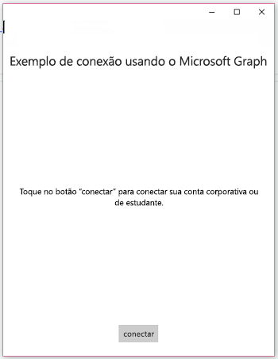
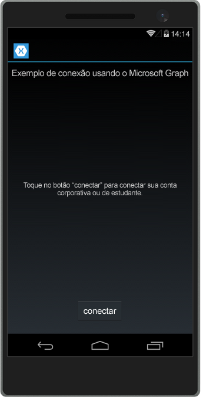
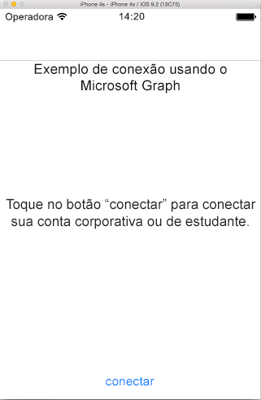

# <a name="get-started-with-microsoft-graph-in-a-xamarin-forms-app"></a><span data-ttu-id="92226-101">Introdução ao Microsoft Graph em um aplicativo Xamarin Forms</span><span class="sxs-lookup"><span data-stu-id="92226-101">Get started with Microsoft Graph in a Xamarin Forms app</span></span>

> <span data-ttu-id="92226-p101">**Criando aplicativos para clientes corporativos?** O aplicativo pode não funcionar caso o cliente corporativo habilite os recursos Enterprise Mobility + Security, como <a href="https://azure.microsoft.com/documentation/articles/active-directory-conditional-access-device-policies/" target="_newtab">acesso condicional ao dispositivo</a>. Nesse caso, pode ser que você não esteja ciente e seu cliente pode enfrentar problemas de erro.</span><span class="sxs-lookup"><span data-stu-id="92226-p101">**Building apps for enterprise customers?** Your app may not work if your enterprise customer turns on enterprise mobility security features like <a href="https://azure.microsoft.com/documentation/articles/active-directory-conditional-access-device-policies/" target="_newtab">conditional device access</a>. In this case, you may not know and your customers may experience errors.</span></span> 

<span data-ttu-id="92226-p102">Este artigo descreve as tarefas obrigatórias para obter um token de acesso do [ponto de extremidade do Azure AD v2.0](https://developer.microsoft.com/graph/docs/concepts/converged_auth) e chamar o Microsoft Graph. Ele o orienta em relação ao código dentro do [Exemplo de conexão com o Microsoft Graph para Xamarin Forms](https://github.com/microsoftgraph/xamarin-csharp-connect-sample) para explicar os principais conceitos que você tem que implementar em um aplicativo que usa o Microsoft Graph. O artigo também descreve como acessar o Microsoft Graph, usando a [Biblioteca de cliente do Microsoft Graph](http://www.nuget.org/packages/Microsoft.Graph/).</span><span class="sxs-lookup"><span data-stu-id="92226-p102">This article describes the tasks required to get an access token from the [Azure AD v2.0 endpoint](https://developer.microsoft.com/graph/docs/concepts/converged_auth) and call Microsoft Graph. It walks you through the code inside the [Microsoft Graph Connect Sample for Xamarin Forms](https://github.com/microsoftgraph/xamarin-csharp-connect-sample) sample to explain the main concepts that you have to implement in an app that uses Microsoft Graph. The article also describes how to access Microsoft Graph by using the [Microsoft Graph Client Library](http://www.nuget.org/packages/Microsoft.Graph/).</span></span>

<span data-ttu-id="92226-108">Este é o aplicativo que você criará.</span><span class="sxs-lookup"><span data-stu-id="92226-108">This is the app you'll create.</span></span>

| <span data-ttu-id="92226-109">UWP</span><span class="sxs-lookup"><span data-stu-id="92226-109">UWP</span></span> | <span data-ttu-id="92226-110">Android</span><span class="sxs-lookup"><span data-stu-id="92226-110">Android</span></span> | <span data-ttu-id="92226-111">iOS</span><span class="sxs-lookup"><span data-stu-id="92226-111">iOS</span></span> |
| --- | ------- | ----|
|  |  |  |

<span data-ttu-id="92226-p103">**Não está com vontade de criar um aplicativo?** Use o [Início rápido do Microsoft Graph](https://developer.microsoft.com/graph/quick-start) para agilizar o processo ou baixe o [Exemplo de conexão com o Microsoft Graph para Xamarin Forms](https://github.com/microsoftgraph/xamarin-csharp-connect-sample) no qual este artigo se baseia.</span><span class="sxs-lookup"><span data-stu-id="92226-p103">**Don't feel like building an app?** Use the [Microsoft Graph quick start](https://developer.microsoft.com/graph/quick-start) to get up and running fast, or download the [Microsoft Graph Connect Sample for Xamarin Forms](https://github.com/microsoftgraph/xamarin-csharp-connect-sample) that this article is based on.</span></span>

## <a name="prerequisites"></a><span data-ttu-id="92226-114">Pré-requisitos</span><span class="sxs-lookup"><span data-stu-id="92226-114">Prerequisites</span></span>

<span data-ttu-id="92226-115">Para começar, será necessário:</span><span class="sxs-lookup"><span data-stu-id="92226-115">To get started, you'll need:</span></span> 

- <span data-ttu-id="92226-116">Uma [conta da Microsoft](https://www.outlook.com/) ou uma [conta corporativa ou de estudante](https://docs.microsoft.com/pt-BR/office/developer-program/office-365-developer-program-faq#account-types)</span><span class="sxs-lookup"><span data-stu-id="92226-116">A [Microsoft account](https://www.outlook.com/) or a [work or school account](https://docs.microsoft.com/pt-BR/office/developer-program/office-365-developer-program-faq#account-types)</span></span>
- <span data-ttu-id="92226-117">Visual Studio 2015</span><span class="sxs-lookup"><span data-stu-id="92226-117">Visual Studio 2015</span></span> 
- [<span data-ttu-id="92226-118">Xamarin para Visual Studio</span><span class="sxs-lookup"><span data-stu-id="92226-118">Xamarin for Visual Studio</span></span>](https://www.xamarin.com/visual-studio)
- <span data-ttu-id="92226-119">Windows 10 ([modo de desenvolvedor habilitado](https://msdn.microsoft.com/library/windows/apps/xaml/dn706236.aspx))</span><span class="sxs-lookup"><span data-stu-id="92226-119">Windows 10 ([development mode enabled](https://msdn.microsoft.com/library/windows/apps/xaml/dn706236.aspx))</span></span>
- <span data-ttu-id="92226-p104">O [Projeto inicial de conexão com o Microsoft Graph para Xamarin Forms](https://github.com/microsoftgraph/xamarin-csharp-connect-sample/tree/master/starter). Este modelo contém várias classes às quais você adicionará código. Ele também contém cadeias de caracteres de recursos e modos de exibição completas. Para obter este projeto, clone ou baixe o [Exemplo de conexão com o Microsoft Graph para Xamarin Forms](https://github.com/microsoftgraph/xamarin-csharp-connect-sample) e abra a solução **XamarinConnect** dentro da pasta **starter**.</span><span class="sxs-lookup"><span data-stu-id="92226-p104">The [Microsoft Graph Connect Starter Project for Xamarin Forms](https://github.com/microsoftgraph/xamarin-csharp-connect-sample/tree/master/starter). This template contains several classes that you'll add code to. It also contains complete views and resource strings. To get this project, clone or download the [Microsoft Graph Connect Sample for Xamarin Forms](https://github.com/microsoftgraph/xamarin-csharp-connect-sample) and open the **XamarinConnect** solution inside the **starter** folder.</span></span> 

<span data-ttu-id="92226-124">Se quiser executar o projeto do iOS neste exemplo, você precisará do seguinte:</span><span class="sxs-lookup"><span data-stu-id="92226-124">If you want to run the iOS project in this sample, you'll need the following:</span></span>

- <span data-ttu-id="92226-125">O SDK mais recente do iOS</span><span class="sxs-lookup"><span data-stu-id="92226-125">The latest iOS SDK</span></span>
- <span data-ttu-id="92226-126">A versão mais recente do Xcode</span><span class="sxs-lookup"><span data-stu-id="92226-126">The latest version of Xcode</span></span>
- <span data-ttu-id="92226-127">Mac OS X Sierra(10.12) e superior</span><span class="sxs-lookup"><span data-stu-id="92226-127">Mac OS X Sierra(10.12) & above</span></span> 
- [<span data-ttu-id="92226-128">Xamarin.iOS</span><span class="sxs-lookup"><span data-stu-id="92226-128">Xamarin.iOS</span></span>](https://docs.microsoft.com/visualstudio/mac/installation)
- <span data-ttu-id="92226-129">Um [agente do Xamarin Mac conectado ao Visual Studio](https://developer.xamarin.com/guides/ios/getting_started/installation/windows/connecting-to-mac/)</span><span class="sxs-lookup"><span data-stu-id="92226-129">A [Xamarin Mac agent connected to Visual Studio](https://developer.xamarin.com/guides/ios/getting_started/installation/windows/connecting-to-mac/)</span></span>


## <a name="register-the-app"></a><span data-ttu-id="92226-130">Registrar o aplicativo</span><span class="sxs-lookup"><span data-stu-id="92226-130">Register the app</span></span>
 
1. <span data-ttu-id="92226-131">Entre no [Portal de Registro do Aplicativo](https://apps.dev.microsoft.com/) usando sua conta pessoal ou sua conta corporativa ou de estudante.</span><span class="sxs-lookup"><span data-stu-id="92226-131">Sign into the [App Registration Portal](https://apps.dev.microsoft.com/) using either your personal or work or school account.</span></span>
2. <span data-ttu-id="92226-132">Selecione **Adicionar um aplicativo**.</span><span class="sxs-lookup"><span data-stu-id="92226-132">Select **Add an app**.</span></span>
3. <span data-ttu-id="92226-133">Insira um nome para o aplicativo e selecione **Criar**.</span><span class="sxs-lookup"><span data-stu-id="92226-133">Enter a name for the app, and select **Create**.</span></span>
    
    <span data-ttu-id="92226-134">A página de registro é exibida, listando as propriedades do seu aplicativo.</span><span class="sxs-lookup"><span data-stu-id="92226-134">The registration page displays, listing the properties of your app.</span></span>
 
4. <span data-ttu-id="92226-135">Em **Plataformas**, selecione **Adicionar plataforma**.</span><span class="sxs-lookup"><span data-stu-id="92226-135">Under **Platforms**, select **Add platform**.</span></span>
5. <span data-ttu-id="92226-136">Escolha **Aplicativo Nativo**.</span><span class="sxs-lookup"><span data-stu-id="92226-136">Select **Native Application**.</span></span>
6. <span data-ttu-id="92226-p105">Copie o valor da ID do aplicativo e o valor do URI de redirecionamento personalizado (abaixo do cabeçalho do **Aplicativo Nativo**) criados quando você adicionou a plataforma do **Aplicativo Nativo**. Este URI deve conter o valor da ID do aplicativo e estar neste formato: `msal[Application Id]://auth` Você precisará inserir esses valores no aplicativo de exemplo.</span><span class="sxs-lookup"><span data-stu-id="92226-p105">Copy the Application Id value and the Custom Redirect URI value (under the **Native Application** header) that was created for you when you added the **Native Application** platform. This URI should contain your Application Id value and be in this form: `msal[Application Id]://auth` You'll need to enter these values into the sample app.</span></span>

    <span data-ttu-id="92226-139">Essa ID de aplicativo é o identificador exclusivo do aplicativo.</span><span class="sxs-lookup"><span data-stu-id="92226-139">The app id is a unique identifier for your app.</span></span> 

7. <span data-ttu-id="92226-140">Selecione **Salvar**.</span><span class="sxs-lookup"><span data-stu-id="92226-140">Select **Save**.</span></span>

## <a name="configure-the-project"></a><span data-ttu-id="92226-141">Configurar o projeto</span><span class="sxs-lookup"><span data-stu-id="92226-141">Configure the project</span></span>

1. <span data-ttu-id="92226-142">Abra o arquivo de solução para o projeto inicial no Visual Studio.</span><span class="sxs-lookup"><span data-stu-id="92226-142">Open the solution file for the starter project in Visual Studio.</span></span>
2. <span data-ttu-id="92226-p106">Abra o arquivo **App.cs** dentro do projeto **XamarinConnect (Portátil)** e localize o campo `ClientId`. Substitua o espaço reservado da ID de aplicativo pela ID do aplicativo que você registrou.</span><span class="sxs-lookup"><span data-stu-id="92226-p106">Open the **App.cs** file inside the **XamarinConnect (Portable)** project and locate the `ClientId` field. Replace the application ID placeholder with the application id of the app you registered.</span></span>

    ```
    public static string ClientID = "ENTER_YOUR_CLIENT_ID";
    public static string RedirectUri = "msal" + ClientID + "://auth";
    public static string[] Scopes = { "User.Read", "Mail.Send", "Files.ReadWrite" };
    ```
    <span data-ttu-id="92226-p107">O valor `Scopes` armazena os escopos de permissão do Microsoft Graph que o aplicativo precisará solicitar quando o usuário autenticar. Observe que o construtor de classe `App` usa o valor ClientID para criar uma instância da classe `PublicClientApplication` do MSAL. Você usará essa classe posteriormente para autenticar o usuário.</span><span class="sxs-lookup"><span data-stu-id="92226-p107">The `Scopes` value stores the Microsoft Graph permission scopes that the app will need to request when the user authenticates. Note that the `App` class constructor uses the ClientID value to instantiate an instance of the MSAL `PublicClientApplication` class. You'll use this class later to authenticate the user.</span></span>
    
    ```
    IdentityClientApp = new PublicClientApplication(ClientID);
    ```

3. <span data-ttu-id="92226-p108">Abra o arquivo UserDetailsClient.iOS\info.plist em um editor de texto. Não é possível abri-lo no Visual Studio. Localize o elemento `<string>msalENTER_YOUR_CLIENT_ID</string>` abaixo da chave `CFBundleURLSchemes`.</span><span class="sxs-lookup"><span data-stu-id="92226-p108">Open the UserDetailsClient.iOS\info.plist file in a text editor. Unfortunately you can't edit this file in Visual Studio. Locate the `<string>msalENTER_YOUR_CLIENT_ID</string>` element under `CFBundleURLSchemes` key.</span></span>

4. <span data-ttu-id="92226-p109">Substitua `ENTER_YOUR_CLIENT_ID` pelo valor da ID do aplicativo obtido quando você registrou o aplicativo. Mantenha `msal` antes da ID do aplicativo. O valor da cadeia de caracteres resultante deve ser semelhante a: `<string>msal[application id]</string>`.</span><span class="sxs-lookup"><span data-stu-id="92226-p109">Replace `ENTER_YOUR_CLIENT_ID` with the application id value that you got when you registered your app. Be sure to retain `msal` before the application id. The resulting string value should look like this: `<string>msal[application id]</string>`.</span></span>

5. <span data-ttu-id="92226-p110">Abra o arquivo UserDetailsClient.Droid\Properties\AndroidManifest.xml. Localize este elemento: `<data android:scheme="msalENTER_YOUR_CLIENT_ID" android:host="auth" />`.</span><span class="sxs-lookup"><span data-stu-id="92226-p110">Open the UserDetailsClient.Droid\Properties\AndroidManifest.xml file. Locate this element: `<data android:scheme="msalENTER_YOUR_CLIENT_ID" android:host="auth" />`.</span></span>

6. <span data-ttu-id="92226-p111">Substitua `ENTER_YOUR_CLIENT_ID` pelo valor da ID do aplicativo obtido quando você registrou o aplicativo. Mantenha `msal` antes da ID do aplicativo. O valor da cadeia de caracteres resultante deve ser semelhante a: `<data android:scheme="msal[application id]" android:host="auth" />`.</span><span class="sxs-lookup"><span data-stu-id="92226-p111">Replace `ENTER_YOUR_CLIENT_ID` with the application id value that you got when you registered your app. Be sure to retain `msal` before the application id. The resulting string value should look like this: `<data android:scheme="msal[application id]" android:host="auth" />`.</span></span>

## <a name="send-an-email-with-microsoft-graph"></a><span data-ttu-id="92226-157">Enviar um email com o Microsoft Graph</span><span class="sxs-lookup"><span data-stu-id="92226-157">Send an email with Microsoft Graph</span></span>

<span data-ttu-id="92226-158">Abra o arquivo MailHelper.cs em seu projeto inicial.</span><span class="sxs-lookup"><span data-stu-id="92226-158">Open the MailHelper.cs file in your starter project.</span></span> <span data-ttu-id="92226-159">Este arquivo contém o código que constrói e envia um email.</span><span class="sxs-lookup"><span data-stu-id="92226-159">This file contains the code that constructs and sends an email.</span></span> <span data-ttu-id="92226-160">Consiste em um único método, ``ComposeAndSendMailAsync``, que constrói e envia uma solicitação POST para o ponto de extremidade**https://graph.microsoft.com/v1.0/me/microsoft.graph.SendMail**.</span><span class="sxs-lookup"><span data-stu-id="92226-160">The MailHelper.cs file contains the code that constructs and sends an email. It consists of a single method --  -- that constructs and sends a POST request to the https://graph.microsoft.com/v1.0/me/microsoft.graph.SendMail endpoint.</span></span> 

<span data-ttu-id="92226-p113">O método ``ComposeAndSendMailAsync`` usa três valores de cadeia de caracteres, ``subject``, ``bodyContent``, e ``recipients``, que são passados para ele pelo arquivo MainPage.xaml.cs. As cadeias de caracteres ``subject`` e ``bodyContent`` são armazenadas, juntamente com todos os outras cadeias de caracteres de interface do usuário no arquivo AppResources.resx. A cadeia de caracteres ``recipients`` vem da caixa de endereço na interface do aplicativo.</span><span class="sxs-lookup"><span data-stu-id="92226-p113">The ``ComposeAndSendMailAsync`` method takes three string values -- ``subject``, ``bodyContent``, and ``recipients`` -- that are passed to it by the MainPage.xaml.cs file. The ``subject`` and ``bodyContent`` strings are stored, along with all other UI strings, in the AppResources.resx file. The ``recipients`` string comes from the address box in the app's interface.</span></span> 

<span data-ttu-id="92226-164">**Usando declarações**</span><span class="sxs-lookup"><span data-stu-id="92226-164">**Using declarations**</span></span>

<span data-ttu-id="92226-165">Verifique se você tem essas declarações na parte superior do arquivo:</span><span class="sxs-lookup"><span data-stu-id="92226-165">Make sure you have these declarations at the top of the file:</span></span>

```
using System;
using System.Collections.Generic;
using System.Linq;
using System.Reflection;
using System.Threading.Tasks;
using Microsoft.Graph;
```

<span data-ttu-id="92226-p114">A primeira tarefa no método ``ComposeAndSendMailAsync`` é obter a foto do usuário atual a partir do Microsoft Graph. Esta linha chama o método oculto `GetCurrentUserPhotoStreamAsync`:</span><span class="sxs-lookup"><span data-stu-id="92226-p114">The first task inside the ``ComposeAndSendMailAsync`` method is to get the current user's photo from Microsoft Graph. This line calls the stubbed-out `GetCurrentUserPhotoStreamAsync` method:</span></span>

```
            // Get current user photo
            Stream photoStream = await GetCurrentUserPhotoStreamAsync();
```

<span data-ttu-id="92226-168">O método `GetCurrentUserPhotoStreamAsync` completo tem a seguinte aparência:</span><span class="sxs-lookup"><span data-stu-id="92226-168">This is what the complete `GetCurrentUserPhotoStreamAsync` method looks like:</span></span>

```
        // Gets the stream content of the signed-in user's photo. 
        // This snippet doesn't work with consumer accounts.
        public async Task<Stream> GetCurrentUserPhotoStreamAsync()
        {
            Stream currentUserPhotoStream = null;

            try
            {
                var graphClient = AuthenticationHelper.GetAuthenticatedClient();
                currentUserPhotoStream = await graphClient.Me.Photo.Content.Request().GetAsync();

            }

            // If the user account is MSA (not work or school), the service will throw an exception.
            catch (ServiceException)
            {
                return null;
            }

            return currentUserPhotoStream;

        }
```

<span data-ttu-id="92226-169">Se o usuário não tiver uma foto, essa lógica obterá outro arquivo de imagem que foi incluído no projeto:</span><span class="sxs-lookup"><span data-stu-id="92226-169">If the user doesn't have a photo, this logic gets another image file that has been included with the project:</span></span>

```
            // If the user doesn't have a photo, or if the user account is MSA, we use a default photo

            if (photoStream == null)
            {
                var assembly = typeof(MailHelper).GetTypeInfo().Assembly;
                photoStream = assembly.GetManifestResourceStream("XamarinConnect.test.jpg");
            }
```

<span data-ttu-id="92226-170">Agora que temos um fluxo de imagem, podemos carregar o arquivo no OneDrive chamando o método oculto `UploadFileToOneDriveAsync`:</span><span class="sxs-lookup"><span data-stu-id="92226-170">Now that we have an image stream, we can upload the file to OneDrive by calling the stubbed-out `UploadFileToOneDriveAsync` method:</span></span>

```
            MemoryStream photoStreamMS = new MemoryStream();
            // Copy stream to MemoryStream object so that it can be converted to byte array.
            photoStream.CopyTo(photoStreamMS);

            DriveItem photoFile = await UploadFileToOneDriveAsync(photoStreamMS.ToArray());
```

<span data-ttu-id="92226-171">O método `UploadFileToOneDriveAsync` completo tem a seguinte aparência:</span><span class="sxs-lookup"><span data-stu-id="92226-171">This is what the complete `UploadFileToOneDriveAsync` method looks like:</span></span>

```
        // Uploads the specified file to the user's root OneDrive directory.
        public async Task<DriveItem> UploadFileToOneDriveAsync(byte[] file)
        {
            DriveItem uploadedFile = null;

            try
            {
                var graphClient = AuthenticationHelper.GetAuthenticatedClient();
                MemoryStream fileStream = new MemoryStream(file);
                uploadedFile = await graphClient.Me.Drive.Root.ItemWithPath("me.png").Content.Request().PutAsync<DriveItem>(fileStream);

            }


            catch (ServiceException)
            {
                return null;
            }

            return uploadedFile;
        }
```

<span data-ttu-id="92226-172">Podemos também pode usar este fluxo para criar um objeto `MessageAttachmentsCollectionPage` que podemos passar junto com a mensagem:</span><span class="sxs-lookup"><span data-stu-id="92226-172">We can also use this stream to create a `MessageAttachmentsCollectionPage` object that we can pass along with the message:</span></span>

```
            MessageAttachmentsCollectionPage attachments = new MessageAttachmentsCollectionPage();
            attachments.Add(new FileAttachment
            {
                ODataType = "#microsoft.graph.fileAttachment",
                ContentBytes = photoStreamMS.ToArray(),
                ContentType = "image/png",
                Name = "me.png"
            });
```

<span data-ttu-id="92226-p115">Podemos obter um link de compartilhamento para o arquivo do OneDrive recém-carregado chamando o método oculto `GetSharingLinkAsync`. A cadeia de caracteres `bodyContent` contém um espaço reservado para o link de compartilhamento:</span><span class="sxs-lookup"><span data-stu-id="92226-p115">We can get a sharing link for the newly uploaded OneDrive file by calling the stubbed-out `GetSharingLinkAsync` method. The `bodyContent` string contains a placeholder for the sharing link:</span></span>

```
            // Get the sharing link and insert it into the message body.
            Permission sharingLink = await GetSharingLinkAsync(photoFile.Id);
            string bodyContentWithSharingLink = String.Format(bodyContent, sharingLink.Link.WebUrl);
```

<span data-ttu-id="92226-175">O método `GetSharingLinkAsync` completo tem a seguinte aparência:</span><span class="sxs-lookup"><span data-stu-id="92226-175">This is what the complete `GetSharingLinkAsync` method looks like:</span></span>

```
        public static async Task<Permission> GetSharingLinkAsync(string Id)
        {
            Permission permission = null;

            try
            {
                var graphClient = AuthenticationHelper.GetAuthenticatedClient();
                permission = await graphClient.Me.Drive.Items[Id].CreateLink("view").Request().PostAsync();
            }

            catch (ServiceException)
            {
                return null;
            }

            return permission;
        }
```

<span data-ttu-id="92226-176">Já que o usuário pode passar mais de um endereço, a próxima tarefa é dividir a cadeia de caracteres ``recipients`` em uma coleção de objetos `EmailAddress` que podem ser usados para construir a lista de objetos `Recipients` que serão passados no corpo POST da solicitação:</span><span class="sxs-lookup"><span data-stu-id="92226-176">Since the user can potentially pass more than one address, the next task is to split the ``recipients`` string into a set of `EmailAddress` objects that can then be used to construct the list of `Recipients` objects that will be passed in the POST body of the request:</span></span>

```
            // Prepare the recipient list
            string[] splitter = { ";" };
            var splitRecipientsString = recipients.Split(splitter, StringSplitOptions.RemoveEmptyEntries);
            List<Recipient> recipientList = new List<Recipient>();

            foreach (string recipient in splitRecipientsString)
            {
                recipientList.Add(new Recipient { EmailAddress = new EmailAddress { Address = recipient.Trim() } });
            }
```

<span data-ttu-id="92226-p116">A última tarefa é construir um objeto `Message` e enviá-lo para o ponto de extremidade **me/microsoft.graph.SendMail** por meio de `GraphServiceClient`. Já que a cadeia de caracteres ``bodyContent`` é um documento HTML, a solicitação define o valor **ContentType** como HTML.</span><span class="sxs-lookup"><span data-stu-id="92226-p116">The last task is to construct a `Message` object and send it to the **me/microsoft.graph.SendMail** endpoint through the `GraphServiceClient`. Since the ``bodyContent`` string is an HTML document, the request sets the **ContentType** value to HTML.</span></span>

```
            try
            {
                var graphClient = AuthenticationHelper.GetAuthenticatedClient();

                var email = new Message
                {
                    Body = new ItemBody
                    {
                        Content = bodyContentWithSharingLink,
                        ContentType = BodyType.Html,
                    },
                    Subject = subject,
                    ToRecipients = recipientList,
                    Attachments = attachments
                };

                try
                {
                    await graphClient.Me.SendMail(email, true).Request().PostAsync();
                }
                catch (ServiceException exception)
                {
                    throw new Exception("We could not send the message: " + exception.Error == null ? "No error message returned." : exception.Error.Message);
                }


            }

            catch (Exception e)
            {
                throw new Exception("We could not send the message: " + e.Message);
            }
```

<span data-ttu-id="92226-179">A classe completa terá a seguinte aparência:</span><span class="sxs-lookup"><span data-stu-id="92226-179">The complete class will look like this:</span></span>

```
    public class MailHelper
    {
        /// <summary>
        /// Compose and send a new email.
        /// </summary>
        /// <param name="subject">The subject line of the email.</param>
        /// <param name="bodyContent">The body of the email.</param>
        /// <param name="recipients">A semicolon-separated list of email addresses.</param>
        /// <returns></returns>
        public async Task ComposeAndSendMailAsync(string subject,
                                                            string bodyContent,
                                                            string recipients)
        {

            // Get current user photo
            Stream photoStream = await GetCurrentUserPhotoStreamAsync();


            // If the user doesn't have a photo, or if the user account is MSA, we use a default photo

            if (photoStream == null)
            {
                var assembly = typeof(MailHelper).GetTypeInfo().Assembly;
                photoStream = assembly.GetManifestResourceStream("XamarinConnect.test.jpg");
            }

            MemoryStream photoStreamMS = new MemoryStream();
            // Copy stream to MemoryStream object so that it can be converted to byte array.
            photoStream.CopyTo(photoStreamMS);

            DriveItem photoFile = await UploadFileToOneDriveAsync(photoStreamMS.ToArray());

            MessageAttachmentsCollectionPage attachments = new MessageAttachmentsCollectionPage();
            attachments.Add(new FileAttachment
            {
                ODataType = "#microsoft.graph.fileAttachment",
                ContentBytes = photoStreamMS.ToArray(),
                ContentType = "image/png",
                Name = "me.png"
            });

            // Get the sharing link and insert it into the message body.
            Permission sharingLink = await GetSharingLinkAsync(photoFile.Id);
            string bodyContentWithSharingLink = String.Format(bodyContent, sharingLink.Link.WebUrl);


            // Prepare the recipient list
            string[] splitter = { ";" };
            var splitRecipientsString = recipients.Split(splitter, StringSplitOptions.RemoveEmptyEntries);
            List<Recipient> recipientList = new List<Recipient>();

            foreach (string recipient in splitRecipientsString)
            {
                recipientList.Add(new Recipient { EmailAddress = new EmailAddress { Address = recipient.Trim() } });
            }

            try
            {
                var graphClient = AuthenticationHelper.GetAuthenticatedClient();

                var email = new Message
                {
                    Body = new ItemBody
                    {
                        Content = bodyContentWithSharingLink,
                        ContentType = BodyType.Html,
                    },
                    Subject = subject,
                    ToRecipients = recipientList,
                    Attachments = attachments
                };

                try
                {
                    await graphClient.Me.SendMail(email, true).Request().PostAsync();
                }
                catch (ServiceException exception)
                {
                    throw new Exception("We could not send the message: " + exception.Error == null ? "No error message returned." : exception.Error.Message);
                }


            }

            catch (Exception e)
            {
                throw new Exception("We could not send the message: " + e.Message);
            }
        }

        // Gets the stream content of the signed-in user's photo. 
        // This snippet doesn't work with consumer accounts.
        public async Task<Stream> GetCurrentUserPhotoStreamAsync()
        {
            Stream currentUserPhotoStream = null;

            try
            {
                var graphClient = AuthenticationHelper.GetAuthenticatedClient();
                currentUserPhotoStream = await graphClient.Me.Photo.Content.Request().GetAsync();

            }

            // If the user account is MSA (not work or school), the service will throw an exception.
            catch (ServiceException)
            {
                return null;
            }

            return currentUserPhotoStream;

        }

        // Uploads the specified file to the user's root OneDrive directory.
        public async Task<DriveItem> UploadFileToOneDriveAsync(byte[] file)
        {
            DriveItem uploadedFile = null;

            try
            {
                var graphClient = AuthenticationHelper.GetAuthenticatedClient();
                MemoryStream fileStream = new MemoryStream(file);
                uploadedFile = await graphClient.Me.Drive.Root.ItemWithPath("me.png").Content.Request().PutAsync<DriveItem>(fileStream);

            }


            catch (ServiceException)
            {
                return null;
            }

            return uploadedFile;
        }

        public static async Task<Permission> GetSharingLinkAsync(string Id)
        {
            Permission permission = null;

            try
            {
                var graphClient = AuthenticationHelper.GetAuthenticatedClient();
                permission = await graphClient.Me.Drive.Items[Id].CreateLink("view").Request().PostAsync();
            }

            catch (ServiceException)
            {
                return null;
            }

            return permission;
        }


    }
``` 

<span data-ttu-id="92226-180">Agora você realizou as três etapas obrigatórias para interagir com o Microsoft Graph: registro do aplicativo, autenticação do usuário e solicitação.</span><span class="sxs-lookup"><span data-stu-id="92226-180">You've now performed the three steps required for interacting with Microsoft Graph: app registration, user authentication, and making a request.</span></span> 

## <a name="run-the-app"></a><span data-ttu-id="92226-181">Executar o aplicativo</span><span class="sxs-lookup"><span data-stu-id="92226-181">Run the app</span></span>
1. <span data-ttu-id="92226-p117">Escolha o projeto que você deseja excluir. Se escolher a opção Plataforma Universal do Windows, você poderá executar o exemplo no computador local. Se quiser executar o projeto do iOS, você precisará se conectar a um [Mac que tenha as ferramentas Xamarin](https://developer.xamarin.com/guides/ios/getting_started/installation/windows/connecting-to-mac/) instaladas nele. (Você também pode abrir esta solução no Xamarin Studio em um Mac e executar o exemplo diretamente de lá). Você pode usar o [Emulador do Visual Studio para Android](https://www.visualstudio.com/features/msft-android-emulator-vs.aspx) se quiser executar o projeto do Android.</span><span class="sxs-lookup"><span data-stu-id="92226-p117">Select the project that you want to run. If you select the Universal Windows Platform option, you can run the sample on the local machine. If you want to run the iOS project, you'll need to connect to a [Mac that has the Xamarin tools](https://developer.xamarin.com/guides/ios/getting_started/installation/windows/connecting-to-mac/) installed on it. (You can also open this solution in Xamarin Studio on a Mac and run the sample directly from there.) You can use the [Visual Studio Emulator for Android](https://www.visualstudio.com/features/msft-android-emulator-vs.aspx) if you want to run the Android project.</span></span> 

    <span data-ttu-id="92226-186"></span><span class="sxs-lookup"><span data-stu-id="92226-186"></span></span>

2. <span data-ttu-id="92226-p118">Pressione F5 para criar e depurar. Execute a solução e entre com sua conta pessoal ou conta corporativa ou de estudante.</span><span class="sxs-lookup"><span data-stu-id="92226-p118">Press F5 to build and debug. Run the solution and sign in with either your personal or work or school account.</span></span>
    > <span data-ttu-id="92226-189">**Observação** Talvez seja necessário abrir o Gerenciador de Configuração de Compilação para certificar-se de que as etapas de Compilar e Implantar estejam selecionadas para o projeto do UWP.</span><span class="sxs-lookup"><span data-stu-id="92226-189">**Note** You might have to open the Build Configuration Manager to make sure that the Build and Deploy steps are selected for the UWP project.</span></span> 

3. <span data-ttu-id="92226-190">Entre com sua conta pessoal, corporativa ou de estudante, e conceda as permissões solicitadas.</span><span class="sxs-lookup"><span data-stu-id="92226-190">Sign in with your personal or work or school account and grant the requested permissions.</span></span>

4. <span data-ttu-id="92226-p119">Escolha o botão **Enviar email**. Quando o email for enviado, será exibida uma mensagem de sucesso. Essa mensagem de email inclui a foto em anexo e também fornece um link de compartilhamento para o arquivo carregado no OneDrive.</span><span class="sxs-lookup"><span data-stu-id="92226-p119">Choose the **Send mail** button. When the mail is sent, a Success message is displayed. This mail message includes the photo as an attachment and also provides a sharing link to the uploaded file in OneDrive.</span></span>

## <a name="next-steps"></a><span data-ttu-id="92226-194">Próximas etapas</span><span class="sxs-lookup"><span data-stu-id="92226-194">Next steps</span></span>
- <span data-ttu-id="92226-195">Experimente a API REST usando o [Explorador do Graph](https://developer.microsoft.com/graph/graph-explorer).</span><span class="sxs-lookup"><span data-stu-id="92226-195">Try out the REST API using the [Graph explorer](https://developer.microsoft.com/graph/graph-explorer).</span></span>
- <span data-ttu-id="92226-196">Localize exemplos de operações comuns na [Biblioteca de Trechos de Código do SDK do Microsoft Graph para Xamarin.Forms](https://github.com/microsoftgraph/xamarin-csharp-snippets-sample) ou explore nossos outros [Exemplos de Xamarin](https://github.com/microsoftgraph?utf8=%E2%9C%93&query=xamarin) no GitHub.</span><span class="sxs-lookup"><span data-stu-id="92226-196">Find examples of common operations in the [Microsoft Graph SDK Snippets Library for Xamarin.Forms](https://github.com/microsoftgraph/xamarin-csharp-snippets-sample), or explore our other [Xamarin samples](https://github.com/microsoftgraph?utf8=%E2%9C%93&query=xamarin) on GitHub.</span></span>

## <a name="see-also"></a><span data-ttu-id="92226-197">Confira também</span><span class="sxs-lookup"><span data-stu-id="92226-197">See also</span></span>
- [<span data-ttu-id="92226-198">Biblioteca de cliente do .NET do Microsoft Graph</span><span class="sxs-lookup"><span data-stu-id="92226-198">Microsoft Graph .NET Client Library</span></span>](https://github.com/microsoftgraph/msgraph-sdk-dotnet)
- [<span data-ttu-id="92226-199">Protocolos do Azure AD v2.0</span><span class="sxs-lookup"><span data-stu-id="92226-199">Azure AD v2.0 protocols</span></span>](https://azure.microsoft.com/documentation/articles/active-directory-v2-protocols/)
- [<span data-ttu-id="92226-200">Tokens do Azure AD v2.0</span><span class="sxs-lookup"><span data-stu-id="92226-200">Azure AD v2.0 tokens</span></span>](https://azure.microsoft.com/documentation/articles/active-directory-v2-tokens/)
