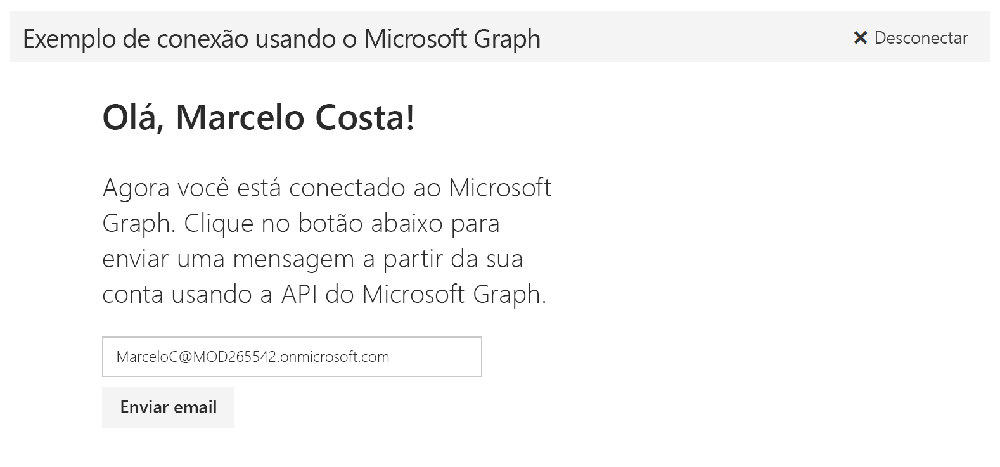

# Introdução ao Microsoft Graph em um aplicativo AngularJS

Este artigo descreve as tarefas obrigatórias para obter um token de acesso do ponto de extremidade do Azure AD v2.0 e chamar o Microsoft Graph. Ele orienta você em relação a como criar um [Exemplo de Microsoft Connect para AngularJS](https://github.com/microsoftgraph/angular-connect-rest-sample) e explica os principais conceitos que você implementa para utilizar o Microsoft Graph. O artigo também descreve como acessar o Microsoft Graph usando o [SDK do JavaScript do Microsoft Graph](https://github.com/microsoftgraph/msgraph-sdk-javascript) ou chamadas REST não processadas.

A imagem a seguir mostra o aplicativo que você criará. 

**Não está com vontade de criar um aplicativo?** Use o [Início rápido do Microsoft Graph](https://graph.microsoft.io/en-us/getting-started) para começar a usar rapidamente.

Para baixar uma versão do exemplo de conexão que usa o ponto de extremidade do Azure AD, confira [Exemplo de conexão com o Microsoft Graph para AngularJS](https://github.com/microsoftgraph/angular-connect-rest-sample/releases/tag/last_v1_auth).

## Pré-requisitos

Para começar, será necessário: 

- Uma [conta da Microsoft](https://www.outlook.com/) ou uma [conta corporativa ou de estudante](http://dev.office.com/devprogram)
- [Node.js com npm](https://nodejs.org/en/download/)
- [Bower](https://bower.io)
- O [Exemplo de conexão da Microsoft para AngularJS](https://github.com/microsoftgraph/angular-connect-rest-sample). Você usará a pasta **starter-project** nos exemplos de arquivo para este passo a passo.

## Registrar o aplicativo
Registre um aplicativo no Portal de Registro de Aplicativos da Microsoft. Isso gera a ID do aplicativo e a senha que você usará para configurar o aplicativo no Visual Studio.

1. Entre no [Portal de Registro de Aplicativos da Microsoft](https://apps.dev.microsoft.com/) usando sua conta pessoal ou uma conta corporativa ou de estudante.

2. Escolha **Adicionar um aplicativo**.

3. Insira um nome para o aplicativo e escolha **Criar aplicativo**. 
    
    A página de registro é exibida, listando as propriedades do seu aplicativo.

4. Copie a ID do aplicativo. Este é o identificador exclusivo para o aplicativo que você usará para configurar o aplicativo.

5. Em **Plataformas**, escolha **Adicionar plataforma** > **Web**.

6. Não deixe de marcar a caixa de diálogo **Permitir Fluxo Implícito** e insira *http://localhost:8080* como o URI de Redirecionamento. 

7. Escolha **Salvar**.

## Configurar o projeto
1. Abra a pasta **starter-project** nos exemplos de arquivo.
2. Em um prompt de comando, execute os seguintes comandos no diretório raiz do projeto inicial. Isso instala as dependências do projeto.

        npm install  
        bower install
    
3. Nos arquivos de projeto inicial na pasta **public/scripts**, abra config.js.
4. No campo **clientId**, substitua o valor de espaço reservado **ENTER_YOUR_CLIENT_ID** pela ID de aplicativo que você acabou de copiar.
5. **Se você estiver usando o SDK do Microsoft Graph**, instale e referencie o SDK.  
   a. No prompt de comando, execute o seguinte comando para instalar o SDK.
        
        bower install https://github.com/microsoftgraph/msgraph-sdk-javascript.git
         
   b. No arquivo **public/index.html**, adicione o seguinte código ao elemento **head** acima da seção `<!-- App code. -->`:
   
        <!--Include Graph SDK -->
        

  
## Autenticar o usuário e obter um token de acesso
Nesta etapa, você adicionará o código de recuperação de conexão e token. Mas primeiro, vamos examinar mais detalhadamente o fluxo de autenticação.

Este aplicativo de página única usa uma implementação bem básica do fluxo de concessão implícito, que exige a ID de aplicativo e o URI de redirecionamento por meio do aplicativo registrado. 

O fluxo de autenticação pode ser dividido nestas etapas básicas:

1. Redirecione o usuário para autenticação e autorização.
2. Obtenha um token de acesso.

O aplicativo usa a biblioteca do lado do cliente [HelloJS](https://adodson.com/hello.js) para autenticar e obter tokens. O aplicativo armazena o token de acesso no armazenamento local.
    
   >**Importante** O tratamento simples de autenticação e token neste projeto é apenas para fins de exemplo. Em um aplicativo de produção, você deve construir uma maneira mais eficiente de tratamento de autenticação, incluindo validação e tratamento seguro de token.

Agora volte a criar o aplicativo.

1. Abra aad.js e adicione o seguinte código. Isso configura a comunicação com o provedor de autenticação do Azure AD e adiciona um ouvinte que armazena a resposta de autenticação que contém o token de acesso. As referências de script para HelloJS já foram adicionadas ao modo de exibição index.html.

        hello.init({

          aad: {
            name: 'Azure Active Directory',    
            oauth: {
              version: 2,
              auth: 'https://login.microsoftonline.com/common/oauth2/v2.0/authorize',
              grant: 'https://login.microsoftonline.com/common/oauth2/v2.0/token'
            },
            scope_delim: ' ',

            // Don't even try submitting via form.
            // This means no POST operations in <=IE9
            form: false
          }
        });

        hello.on('auth.login', function (auth) {

          // save the auth info into localStorage
          localStorage.auth = angular.toJson(auth.authResponse);
        });

2. Em graphHelper.js, substitua *// Inicializar a solicitação de autenticação* pelo código a seguir. Isso define parâmetros para a solicitação de autenticação.

        // Initialize the auth request.
        hello.init( {
          aad: clientId // from public/scripts/config.js
          }, {
          redirect_uri: redirectUrl,
          scope: graphScopes
        });

3. Substitua *// Conectar e desconectar o usuário* pelo código a seguir. A função **login** usa HelloJS para obter informações de token. O ouvinte em aad.js armazena essas informações, incluindo o token de acesso, em um armazenamento local.

        // Sign in and sign out the user.
        login: function login() {
          hello('aad').login({
            display: 'page',
            state: 'abcd'
          });
        },
        logout: function logout() {
          hello('aad').logout();
          delete localStorage.auth;
          delete localStorage.user;
        },

4. **Se você estiver usando o SDK do Microsoft Graph,** abra app.js e adicione o seguinte código à parte inferior do arquivo. Isso inicializa o SDK.

        var authToken;
        var graphClient = MicrosoftGraph.init({
            authProvider: function(done) {
                if (typeof authToken === "undefined") {
                  done({err: "No auth token"})
                } else {
                  done(null, authToken); //first parameter takes an error if you can't get an access token
                }
            }
        });

Agora você está pronto para adicionar código para chamar o Microsoft Graph. 

## Chamar o Microsoft Graph
O aplicativo chama o Microsoft Graph para obter informações sobre o usuário e enviar um email em nome do usuário. Essas chamadas são iniciadas pelo MainController em resposta a eventos de interface do usuário.

Se você estiver usando o SDK do Microsoft Graph, continue a ler. Se você estiver usando REST, confira a seção [Usar a API REST](#using-the-rest-api).

### Usar o SDK
1. Em graphHelper.js, substitua *// Obter o perfil do usuário atual* pelo código a seguir. Isso configura e envia a solicitação GET para o ponto de extremidade */me* e processa a resposta.

        // Get the profile of the current user.
        me: function me() {
          return graphClient.api('/me').get();
        },
  
2. Substitua *// Enviar um email em nome do usuário atual* pelo código a seguir. Isso configura e envia a solicitação POST para o ponto de extremidade */me/sendMail* e processa a resposta.

        // Send an email on behalf of the current user.
        sendMail: function sendMail(email) {
          return graphClient.api('/me/sendMail').post({ 'message' : email, 'saveToSentItems': true });
        }

3. Na pasta **public/controllers**, abra mainController.js.

4. Substitua *// Definir os cabeçalhos padrão e as propriedades do usuário* pelo código a seguir. Isso adiciona o token de acesso à solicitação HTTP, chama **GraphHelper.me** para obter o perfil do usuário atual e processa a resposta.

        // Set the default headers and user properties.
        function processAuth() {
            let auth = angular.fromJson(localStorage.auth); 

            // Check token expiry. If the token is valid for another 5 minutes, we'll use it.       
            let expiration = new Date();
            expiration.setTime((auth.expires - 300) * 1000); 
            if (expiration > new Date()) {

              // let the authProvider access the access token
              authToken = auth.access_token;

              // This header has been added to identify our sample in the Microsoft Graph service. If extracting this code for your project please remove.
              $http.defaults.headers.common.SampleID = 'angular-connect-starter';

              if (localStorage.getItem('user') === null) {

                // Get the profile of the current user.
                GraphHelper.me().then(function(user) {

                  // Save the user to localStorage.
                  localStorage.setItem('user', angular.toJson(user));

                  vm.displayName = user.displayName;
                  vm.emailAddress = user.mail || user.userPrincipalName;
                });
              } else {
                let user = angular.fromJson(localStorage.user);

                vm.displayName = user.displayName;
                vm.emailAddress = user.mail || user.userPrincipalName;
              }
           }
        }

5. Substitua *// Enviar um email em nome do usuário atual* pelo código a seguir. Isso cria a mensagem de email, chama **GraphHelper.sendMail** e processa a resposta.

        // Send an email on behalf of the current user.
        function sendMail() {

          // Check token expiry. If the token is valid for another 5 minutes, we'll use it.
          let auth = angular.fromJson(localStorage.auth);       
          let expiration = new Date();
          expiration.setTime((auth.expires - 300) * 1000); 
          if (expiration > new Date()) {

            // Build the HTTP request payload (the Message object).
            var email = {
                Subject: 'Welcome to Microsoft Graph development with Angular and the Microsoft Graph Connect sample',
                Body: {
                  ContentType: 'HTML',
                  Content: getEmailContent()
                },
                ToRecipients: [
                  {
                    EmailAddress: {
                      Address: vm.emailAddress
                    }
                  }
                ]
            };

            // Save email address so it doesn't get lost with two way data binding.
            vm.emailAddressSent = vm.emailAddress;

            GraphHelper.sendMail(email)
              .then(function (response) {
                $log.debug('HTTP request to the Microsoft Graph API returned successfully.', response);
                vm.requestSuccess = true;
                vm.requestFinished = true;
              }, function (error) {
                $log.error('HTTP request to the Microsoft Graph API failed.');
                vm.requestSuccess = false;
                vm.requestFinished = true;
              });
           } else {

             // If the token is expired, this sample just redirects the user to sign in.
             GraphHelper.login();
           }
        };

        // Get the HTMl for the email to send.
        function getEmailContent() {
          return "<html><head> <meta http-equiv=\'Content-Type\' content=\'text/html; charset=us-ascii\'> <title></title> </head><body style=\'font-family:calibri\'> 
Congratulations " + vm.displayName + ",
 
This is a message from the Microsoft Graph Connect sample. You are well on your way to incorporating Microsoft Graph endpoints in your apps. 
 <h3>What&#8217;s next?</h3><ul><li>Check out <a href='https://graph.microsoft.io' target='_blank'>graph.microsoft.io</a> to start building Microsoft Graph apps today with all the latest tools, templates, and guidance to get started quickly.</li><li>Use the <a href='https://graph.microsoft.io/graph-explorer' target='_blank'>Graph explorer</a> to explore the rest of the APIs and start your testing.</li><li>Browse other <a href='https://github.com/microsoftgraph/' target='_blank'>samples on GitHub</a> to see more of the APIs in action.</li></ul> <h3>Give us feedback</h3> <ul><li>If you have any trouble running this sample, please <a href='https://github.com/microsoftgraph/angular-connect-sample/issues' target='_blank'>log an issue</a>.</li><li>For general questions about the Microsoft Graph API, post to <a href='https://stackoverflow.com/questions/tagged/microsoftgraph?sort=newest' target='blank'>Stack Overflow</a>. Make sure that your questions or comments are tagged with [microsoftgraph].</li></ul>
Thanks and happy coding! Your Microsoft Graph samples development team
 
 <table style=\'width:100%; font-family:calibri\'> <tbody> <tr> <td><a href=\'https://github.com/microsoftgraph/angular-connect-sample\'>See on GitHub</a> </td> <td><a href=\'https://officespdev.uservoice.com/\'>Suggest on UserVoice</a> </td> <td><a href=\'https://twitter.com/share?text=I%20just%20started%20developing%20%23Angular%20apps%20using%20the%20%23MicrosoftGraph%20Connect%20sample!%20&url=https://github.com/microsoftgraph/angular-connect-sample\'>Share on Twitter</a> </td> </tr> </tbody> </table> 
  </body> </html>";
        };
    
6. Salve todas as suas alterações. Agora você está pronto para [executar o aplicativo](#run-the-app).
    
### Usar a API REST
1. Em graphHelper.js, substitua *// Obter o perfil do usuário atual* pelo código a seguir. Isso configura e envia a solicitação GET para o ponto de extremidade */me* e processa a resposta.

        // Get the profile of the current user.
        me: function me() {
          return $http.get('https://graph.microsoft.com/v1.0/me');
        },
  
2. Substitua *// Enviar um email em nome do usuário atual* pelo código a seguir. Isso configura e envia a solicitação POST para o ponto de extremidade */me/sendMail* e processa a resposta.

        // Send an email.n sendMail(email) {
          return $http.post('https://graph.microsoft.com/v1.0/me/sendMail', { 'message' : email, 'saveToSentItems': true });        
        }

3. Na pasta **public/controllers**, abra mainController.js.

4. Substitua *// Definir os cabeçalhos padrão e as propriedades do usuário* pelo código a seguir. Isso adiciona o token de acesso à solicitação HTTP, chama **GraphHelper.me** para obter o perfil do usuário atual e processa a resposta.

        // Set the default headers and user properties.
        function processAuth() {
          let auth = angular.fromJson(localStorage.auth); 

          // Check token expiry. If the token is valid for another 5 minutes, we'll use it.       
          let expiration = new Date();
          expiration.setTime((auth.expires - 300) * 1000); 
          if (expiration > new Date()) {

            // Add the required Authorization header with bearer token.
            $http.defaults.headers.common.Authorization = 'Bearer ' + auth.access_token;

            // This header has been added to identify our sample in the Microsoft Graph service. If extracting this code for your project please remove.
            $http.defaults.headers.common.SampleID = 'angular-connect-rest-starter';

            if (localStorage.getItem('user') === null) {

              // Get the profile of the current user.
              GraphHelper.me().then(function(response) {

                // Save the user to localStorage.
                let user =response.data;
                localStorage.setItem('user', angular.toJson(user));

                vm.displayName = user.displayName;
                vm.emailAddress = user.mail || user.userPrincipalName;
              });
           } else {
             let user = angular.fromJson(localStorage.user);

             vm.displayName = user.displayName;
             vm.emailAddress = user.mail || user.userPrincipalName;
            }
          }
        } 

5. Substitua *// Enviar um email em nome do usuário atual* pelo código a seguir. Isso cria a mensagem de email, chama **GraphHelper.sendMail** e processa a resposta.

        // Send an email on behalf of the current user.
        function sendMail() {

          // Check token expiry. If the token is valid for another 5 minutes, we'll use it.
          let auth = angular.fromJson(localStorage.auth);
          let expiration = new Date();
          expiration.setTime((auth.expires - 300) * 1000);
          if (expiration > new Date()) {

            // Build the HTTP request payload (the Message object).
            var email = {
                Subject: 'Welcome to Microsoft Graph development with AngularJS and the Microsoft Graph Connect sample',
                Body: {
                    ContentType: 'HTML',
                    Content: getEmailContent()
                },
                ToRecipients: [
                    {
                        EmailAddress: {
                            Address: vm.emailAddress
                        }
                    }
                ]
            };

            // Save email address so it doesn't get lost with two way data binding.
            vm.emailAddressSent = vm.emailAddress;

            GraphHelper.sendMail(email)
                .then(function (response) {
                    $log.debug('HTTP request to the Microsoft Graph API returned successfully.', response);
                    response.status === 202 ? vm.requestSuccess = true : vm.requestSuccess = false;
                    vm.requestFinished = true;
                }, function (error) {
                    $log.error('HTTP request to the Microsoft Graph API failed.');
                    vm.requestSuccess = false;
                    vm.requestFinished = true;
                });
            } else {

            // If the token is expired, this sample just redirects the user to sign in.
            GraphHelper.login();
            }
        };

        // Get the HTMl for the email to send.
        function getEmailContent() {
          return "<html><head> <meta http-equiv=\'Content-Type\' content=\'text/html; charset=us-ascii\'> <title></title> </head><body style=\'font-family:calibri\'> 
Congratulations " + vm.displayName + ",
 
This is a message from the Microsoft Graph Connect sample. You are well on your way to incorporating Microsoft Graph endpoints in your apps. 
 <h3>What&#8217;s next?</h3><ul><li>Check out <a href='https://graph.microsoft.io' target='_blank'>graph.microsoft.io</a> to start building Microsoft Graph apps today with all the latest tools, templates, and guidance to get started quickly.</li><li>Use the <a href='https://graph.microsoft.io/graph-explorer' target='_blank'>Graph explorer</a> to explore the rest of the APIs and start your testing.</li><li>Browse other <a href='https://github.com/microsoftgraph/' target='_blank'>samples on GitHub</a> to see more of the APIs in action.</li></ul> <h3>Give us feedback</h3> <ul><li>If you have any trouble running this sample, please <a href='https://github.com/microsoftgraph/angular-connect-rest-sample/issues' target='_blank'>log an issue</a>.</li><li>For general questions about the Microsoft Graph API, post to <a href='https://stackoverflow.com/questions/tagged/microsoftgraph?sort=newest' target='blank'>Stack Overflow</a>. Make sure that your questions or comments are tagged with [microsoftgraph].</li></ul>
Thanks and happy coding! Your Microsoft Graph samples development team
 
 <table style=\'width:100%; font-family:calibri\'> <tbody> <tr> <td><a href=\'https://github.com/microsoftgraph/angular-connect-rest-sample\'>See on GitHub</a> </td> <td><a href=\'https://officespdev.uservoice.com/\'>Suggest on UserVoice</a> </td> <td><a href=\'https://twitter.com/share?text=I%20just%20started%20developing%20%23Angular%20apps%20using%20the%20%23MicrosoftGraph%20Connect%20sample!%20&url=https://github.com/microsoftgraph/angular-connect-rest-sample\'>Share on Twitter</a> </td> </tr> </tbody> </table> 
  </body> </html>";
        };

6. Salve todas as suas alterações.

## Executar o aplicativo

1. Em um prompt de comando, execute o seguinte comando no diretório raiz do projeto inicial.

        npm start

2. Em um navegador, acesse *http://localhost:8080* e escolha o botão **Connect**.

3. Entre e conceda as permissões solicitadas. 

4. Como alternativa, edite o endereço de email do destinatário e escolha o botão **Enviar email**. Quando o email for enviado, será exibida uma mensagem de sucesso abaixo do botão. 

## Próximas etapas
- Experimente a API REST, usando o [Explorador do Graph](https://graph.microsoft.io/graph-explorer).
- Explorar nossos outros [exemplos de AngularJS](https://github.com/search?utf8=%E2%9C%93&q=angular+sample+user%3Amicrosoftgraph&type=Repositories&ref=searchresults) no GitHub.

## Ver também
- [Protocolos do Azure AD v2.0](https://azure.microsoft.com/en-us/documentation/articles/active-directory-v2-protocols/)
- [Tokens do Azure AD v2.0](https://azure.microsoft.com/en-us/documentation/articles/active-directory-v2-tokens/)