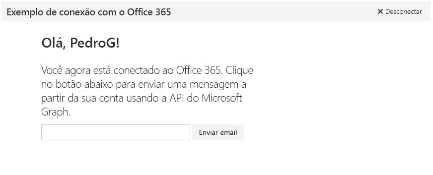

# Introdução ao Microsoft Graph em um aplicativo Node.js

Este artigo descreve as tarefas obrigatórias para obter um token de acesso do ponto de extremidade do Azure AD v2.0 e chamar o Microsoft Graph. Ele orienta você em relação a como criar um [Exemplo de conexão da Microsoft para Node.js](https://github.com/microsoftgraph/nodejs-connect-rest-sample) e explica os principais conceitos que você implementa para utilizar o Microsoft Graph. O artigo descreve como acessar a API do Microsoft Graph usando chamadas REST não processadas.

A imagem a seguir mostra o aplicativo que você criará. 

**Não está com vontade de criar um aplicativo?** Use o [Início rápido do Microsoft Graph](https://graph.microsoft.io/en-us/getting-started) para começar a usar rapidamente.

Para baixar uma versão do exemplo de conexão que usa o ponto de extremidade do Azure AD, confira [Exemplo de conexão com o Microsoft Graph para Node.js](https://github.com/microsoftgraph/nodejs-connect-rest-sample/releases/tag/last_v1_auth).

## Pré-requisitos

Para começar, será necessário: 

- Uma [conta da Microsoft](https://www.outlook.com/) ou uma [conta corporativa ou de estudante](http://dev.office.com/devprogram)
- [Node.js com npm](https://nodejs.org/en/download/) 
- O [Exemplo de conexão da Microsoft para Node.js](https://github.com/microsoftgraph/nodejs-connect-rest-sample). Você usará a pasta **starter-project** nos exemplos de arquivo para este passo a passo.

## Registrar o aplicativo
Registre um aplicativo no Portal de Registro de Aplicativos da Microsoft. Isso gera a ID do aplicativo e a senha que você usará para configurar o aplicativo no Visual Studio.

1. Entre no [Portal de Registro de Aplicativos da Microsoft](https://apps.dev.microsoft.com/) usando sua conta pessoal ou uma conta corporativa ou de estudante.

2. Escolha **Adicionar um aplicativo**.

3. Insira um nome para o aplicativo e escolha **Criar aplicativo**. 
    
    A página de registro é exibida, listando as propriedades do seu aplicativo.

4. Copie a ID do aplicativo. Esse é o identificador exclusivo do aplicativo. 

5. Em **Segredos do Aplicativo**, escolha **Gerar Nova Senha**. Copie a senha da caixa de diálogo **Nova senha gerada**.

    Você usará a ID do aplicativo e a senha do aplicativo (segredo) para configurar o aplicativo. 

6. Em **Plataformas**, escolha **Adicionar plataforma** > **Web**.

7. Insira *http://localhost:3000/login* como o URI de redirecionamento. 

8. Escolha **Salvar**.

## Configurar o projeto
1. Abra a pasta **starter-project** nos exemplos de arquivo.

1. Em um prompt de comando, execute o seguinte comando no diretório raiz do projeto inicial. Isso instala as dependências do projeto.

        npm install

1. Nos arquivos de projeto inicial, abra authHelper.js.

1. No campo **Credenciais**, substitua os valores de espaço reservado **ENTER\_YOUR\_CLIENT\_ID** e **ENTER\_YOUR\_SECRET** pelos valores que você acabou de copiar.

  
## Autenticar o usuário e obter um token de acesso
Nesta etapa, você adicionará o código de gerenciamento de conexão e token. Mas primeiro, vamos examinar mais detalhadamente o fluxo de autenticação.

Este aplicativo usa o fluxo de concessão do código de autorização com uma identidade de usuário delegada. Para um aplicativo Web, o fluxo exige a ID do aplicativo, o segredo e o URI de redirecionamento do aplicativo registrado. 

O fluxo de autenticação pode ser dividido nestas etapas básicas:

1. Redirecione o usuário para autenticação e autorização.
2. Obter um código de autorização
3. Resgatar o código de autorização para solicitar um token de acesso
4. Use o token de atualização para obter um novo token de acesso quando o token de acesso expirar.

O aplicativo usa o middleware [oauth](https://www.npmjs.com/package/oauth) para autenticar e obter tokens. Ele usa o middleware [cookie-parser](https://www.npmjs.com/package/cookie-parser) para armazenar em cache informações de token em cookies. O código utilizado para armazenar e acessar informações de token é encontrado no controlador index.js.
    
   >**Importante** O tratamento simples de autenticação e token neste projeto é apenas para fins de exemplo. Em um aplicativo de produção, você deve construir uma maneira mais eficiente de tratamento de autenticação, incluindo validação e tratamento seguro de token.

Agora volte a criar o aplicativo.

1. No authHelper.js, substitua a função *getTokenFromCode* pelo código a seguir. Isso obtém um token de acesso usando um código de autorização.

        function getTokenFromCode(code, callback) {
            var OAuth2 = OAuth.OAuth2;
            var oauth2 = new OAuth2(
                credentials.client_id,
                credentials.client_secret,
                credentials.authority,
                credentials.authorize_endpoint,
                credentials.token_endpoint
            );

            oauth2.getOAuthAccessToken(
                code,
                {
                    grant_type: 'authorization_code',
                    redirect_uri: credentials.redirect_uri,
                    response_mode: 'form_post',
                    nonce: uuid.v4(),
                    state: 'abcd'
                },
                function (e, accessToken, refreshToken) {
                    callback(e, accessToken, refreshToken);
                }
            );
        }

1. Substitua a função **getTokenFromRefreshToken** pelo código a seguir. Isso obtém um token de acesso usando um token de atualização.

        function getTokenFromRefreshToken(refreshToken, callback) {
            var OAuth2 = OAuth.OAuth2;
            var oauth2 = new OAuth2(
                credentials.client_id,
                credentials.client_secret,
                credentials.authority,
                credentials.authorize_endpoint,
                credentials.token_endpoint
            );

            oauth2.getOAuthAccessToken(
                refreshToken,
                {
                    grant_type: 'refresh_token',
                    redirect_uri: credentials.redirect_uri,
                    response_mode: 'form_post',
                    nonce: uuid.v4(),
                    state: 'abcd'
                },
                function (e, accessToken) {
                    callback(e, accessToken);
                }
            );
        }

Agora você está pronto para adicionar código para chamar o Microsoft Graph. 

## Chamar o Microsoft Graph
O aplicativo chama o Microsoft Graph para obter informações sobre o usuário e enviar um email em nome do usuário. Essas chamadas são iniciadas pelo controlador index.js em resposta a eventos de interface do usuário.

1. Abra requestUtil.js.

1. Substitua a função **getUserData** pelo seguinte código. Isso configura e envia a solicitação GET para o ponto de extremidade */me* e processa a resposta.

        function getUserData(accessToken, callback) {
            var options = {
                host: 'graph.microsoft.com',
                path: '/v1.0/me',
                method: 'GET',
                headers: {
                    'Content-Type': 'application/json',
                    Accept: 'application/json',
                    Authorization: 'Bearer ' + accessToken
                }
            };

            https.get(options, function (response) {
                var body = '';
                response.on('data', function (d) {
                    body += d;
                });
                response.on('end', function () {
                    var error;
                    if (response.statusCode === 200) {
                        callback(null, JSON.parse(body));
                    } else {
                        error = new Error();
                        error.code = response.statusCode;
                        error.message = response.statusMessage;
                        // The error body sometimes includes an empty space
                        // before the first character, remove it or it causes an error.
                        body = body.trim();
                        error.innerError = JSON.parse(body).error;
                        callback(error, null);
                    }
                });
            }).on('error', function (e) {
                callback(e, null);
            });
        }

1. Substitua a função **postSendMail** pelo seguinte código. Isso configura e envia a solicitação POST para o ponto de extremidade */me/sendMail* e processa a resposta.

        function postSendMail(accessToken, mailBody, callback) {
            var outHeaders = {
                'Content-Type': 'application/json',
                Authorization: 'Bearer ' + accessToken,
                'Content-Length': mailBody.length
            };
            var options = {
                host: 'graph.microsoft.com',
                path: '/v1.0/me/sendMail',
                method: 'POST',
                headers: outHeaders
            };

            // Set up the request
            var post = https.request(options, function (response) {
                var body = '';
                response.on('data', function (d) {
                    body += d;
                });
                response.on('end', function () {
                    var error;
                    if (response.statusCode === 202) {
                        callback(null);
                    } else {
                        error = new Error();
                        error.code = response.statusCode;
                        error.message = response.statusMessage;
                        // The error body sometimes includes an empty space
                        // before the first character, remove it or it causes an error.
                        body = body.trim();
                        error.innerError = JSON.parse(body).error;
                        // Note: If you receive a 500 - Internal Server Error
                        // while using a Microsoft account (outlook.com, hotmail.com or live.com),
                        // it's possible that your account has not been migrated to support this flow.
                        // Check the inner error object for code 'ErrorInternalServerTransientError'.
                        // You can try using a newly created Microsoft account or contact support.
                        callback(error);
                    }
                });
            });
            
            // write the outbound data to it
            post.write(mailBody);
            // we're done!
            post.end();

            post.on('error', function (e) {
                callback(e);
            });
        }
  
1. Abra emailer.js.

1. Substitua a função **wrapEmail** pelo seguinte código. Isso cria a carga que representa a mensagem de email a ser enviada.

        function wrapEmail(content, recipient) {
            var emailAsPayload = {
                Message: {
                    Subject: 'Welcome to Office 365 development with Node.js and the Office 365 Connect sample',
                    Body: {
                        ContentType: 'HTML',
                        Content: content
                    },
                    ToRecipients: [
                        {
                            EmailAddress: {
                                Address: recipient
                            }
                        }
                    ]
                },
                SaveToSentItems: true
            };
            return emailAsPayload;
        }

## Executar o aplicativo

1. Em um prompt de comando, execute o seguinte comando no diretório raiz do projeto inicial.

        npm start

1. Em um navegador, navegue até *http://localhost:3000* e escolha o botão **Conectar ao Office 365**.

1. Entre e conceda as permissões solicitadas. 

1. Como alternativa, edite o endereço de email do destinatário e escolha o botão **Enviar email**. Quando o email for enviado, será exibida uma mensagem de sucesso abaixo do botão. 

## Próximas etapas
- Experimente a API REST, usando o [Explorador do Graph](https://graph.microsoft.io/graph-explorer).
- Explore nossos outros [exemplos de Node.js](https://github.com/search?utf8=%E2%9C%93&q=node+sample+user%3Amicrosoftgraph&type=Repositories&ref=searchresults) no GitHub.

## Ver também
- [Protocolos do Azure AD v2.0](https://azure.microsoft.com/en-us/documentation/articles/active-directory-v2-protocols/)
- [Tokens do Azure AD v2.0](https://azure.microsoft.com/en-us/documentation/articles/active-directory-v2-tokens/)