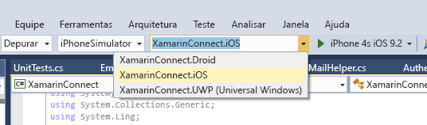

# <a name="get-started-with-microsoft-graph-in-a-xamarin-forms-app"></a>Introdução ao Microsoft Graph em um aplicativo Xamarin Forms

Este artigo descreve as tarefas obrigatórias para obter um token de acesso do [ponto de extremidade do Azure AD v2.0](https://developer.microsoft.com/en-us/graph/docs/authorization/converged_auth) e chamar o Microsoft Graph. Ele o orienta em relação ao código dentro do [Exemplo de conexão com o Microsoft Graph para Xamarin Forms](https://github.com/microsoftgraph/xamarin-csharp-connect-sample) para explicar os principais conceitos que você tem que implementar em um aplicativo que usa o Microsoft Graph. O artigo também descreve como acessar o Microsoft Graph, usando a [Biblioteca de cliente do Microsoft Graph](http://www.nuget.org/packages/Microsoft.Graph/).

Este é o aplicativo que você criará.

| UWP | Android | iOS |
| --- | ------- | ----|
|  |  |  |

**Não está com vontade de criar um aplicativo?** Use o [Início rápido do Microsoft Graph](https://graph.microsoft.io/en-us/getting-started) para começar a usar ou baixe o [Exemplo de conexão com o Microsoft Graph para Xamarin Forms](https://github.com/microsoftgraph/xamarin-csharp-connect-sample) no qual este artigo se baseia.

## <a name="prerequisites"></a>Pré-requisitos

Para começar, será necessário: 

- Uma [conta da Microsoft](https://www.outlook.com/) ou uma [conta corporativa ou de estudante](http://dev.office.com/devprogram)
- Visual Studio 2015 
- [Xamarin para Visual Studio](https://www.xamarin.com/visual-studio)
- Windows 10 ([modo de desenvolvedor habilitado](https://msdn.microsoft.com/library/windows/apps/xaml/dn706236.aspx))
- O [Projeto inicial de conexão com o Microsoft Graph para Xamarin Forms](https://github.com/microsoftgraph/xamarin-csharp-connect-sample/tree/master/starter). Este modelo contém várias classes às quais você adicionará código. Ele também contém cadeias de caracteres de recursos e modos de exibição completas. Para obter este projeto, clone ou baixe o [Exemplo de conexão com o Microsoft Graph para Xamarin Forms](https://github.com/microsoftgraph/xamarin-csharp-connect-sample) e abra a solução **XamarinConnect** dentro da pasta **starter**. 

Se quiser executar o projeto do iOS neste exemplo, você precisará do seguinte:

- O SDK mais recente do iOS
- A versão mais recente do Xcode
- Mac OS X Yosemite (10.10) e versões superiores 
- [Xamarin.iOS](https://developer.xamarin.com/guides/ios/getting_started/installation/mac/)
- Um [agente do Xamarin Mac conectado ao Visual Studio](https://developer.xamarin.com/guides/ios/getting_started/installation/windows/connecting-to-mac/)


## <a name="register-the-app"></a>Registrar o aplicativo
 
1. Entre no [Portal de Registro do Aplicativo](https://apps.dev.microsoft.com/) usando sua conta pessoal ou sua conta corporativa ou de estudante.
2. Selecione **Adicionar um aplicativo**.
3. Insira um nome para o aplicativo e selecione **Criar aplicativo**.
    
    A página de registro é exibida, listando as propriedades do seu aplicativo.
 
4. Em **Plataformas**, selecione **Adicionar plataforma**.
5. Selecione **Plataforma móvel**.
6. Copie a ID do Aplicativo. Você precisará inserir esses valores no exemplo de aplicativo.

    Essa ID de aplicativo é o identificador exclusivo do aplicativo. Um URI de redirecionamento é um URI exclusivo fornecido pelo Windows 10 para cada aplicativo para garantir que as mensagens enviadas para esse URI sejam enviadas somente para esse aplicativo. 

7. Selecione **Salvar**.

## <a name="configure-the-project"></a>Configurar o projeto

1. Abra o arquivo de solução para o projeto inicial no Visual Studio.
2. Abra o arquivo **App.cs** dentro do projeto **XamarinConnect (Portátil)** e localize o campo `ClientId`. Substitua o espaço reservado da ID de aplicativo pela ID do aplicativo que você registrou.

```c#
public static string ClientID = "ENTER_YOUR_CLIENT_ID";
public static string[] Scopes = { "User.Read", "Mail.Send" };
```
O valor `Scopes` armazena os escopos de permissão do Microsoft Graph que o aplicativo precisará solicitar quando o usuário autenticar. Observe que o construtor de classe `App` usa o valor ClientID para criar uma instância da classe `PublicClientApplication` do MSAL. Você usará essa classe posteriormente para autenticar o usuário.

```c#
IdentityClientApp = new PublicClientApplication(ClientID);
```

## <a name="install-the-microsoft-authentication-library-msal"></a>Instale a Biblioteca de Autenticação da Microsoft (MSAL)

A [Biblioteca de Autenticação da Microsoft](https://www.nuget.org/packages/Microsoft.Identity.Client) contém classes e métodos que facilitam a autenticação de usuários através do ponto de extremidade de autenticação do v2.0.

1. No Gerenciador de Soluções, clique com botão direito no projeto **XamarinConnect (Portátil)** e selecione **Gerenciar pacotes NuGet...**
2. Clique em Procurar e pesquise Microsoft.Identity.Client.
3. Selecione a versão mais recente da Biblioteca de Autenticação da Microsoft e clique em **Instalar**.

Realize essas mesmas etapas para os projetos **XamarinConnect.Droid**, **XamarinConnect.iOS** e **XamarinConnect.UWP**. O aplicativo não será criado se MSAL não estiver instalado em todos os quatro projetos.

## <a name="install-the-microsoft-graph-client-library"></a>Instalar a Biblioteca de Cliente do Microsoft Graph

1. No Gerenciador de Soluções, clique com botão direito no projeto **XamarinConnect (Portátil)** e selecione **Gerenciar pacotes NuGet...**
2. Clique em Procurar e pesquise Microsoft.Graph.
3. Selecione a versão mais recente da Biblioteca de Cliente do Microsoft Graph e clique em **Instalar**.

## <a name="create-the-authenticationhelpercs-class"></a>Criar a classe AuthenticationHelper.cs

Abra o arquivo AuthenticationHelper.cs no projeto **XamarinConnect (Portátil)**. Este arquivo contém todo o código de autenticação, juntamente com a lógica adicional que armazena informações do usuário e força a autenticação somente quando o usuário se desconecta do aplicativo. Essa classe contém pelo menos três métodos: `GetTokenForUserAsync`, `Signout` e `GetAuthenticatedClient`.

O método `GetTokenHelperAsync` é executado quando o usuário autentica e toda vez que o aplicativo faz uma chamada ao Microsoft Graph depois disso.

**Usando declarações**

Verifique se você tem essas declarações na parte superior do arquivo:

```c#
using Microsoft.Graph;
using System;
using System.Diagnostics;
using System.Net.Http.Headers;
using System.Threading.Tasks;
using Microsoft.Identity.Client;
```

**Campos de classe**

Verifique se você tem estes campos dentro da classe AuthenticationHelper:

```c#
public static string TokenForUser = null;
public static DateTimeOffset expiration;
private static GraphServiceClient graphClient = null;
```

O exemplo armazena o `GraphServicesClient` em um campo para que você tenha que construí-lo apenas uma vez. Ela armazena a expiração `DateTimeOffset` do token de acesso para que ele não busque um novo token até que o token existente esteja prestes a expirar.

**GetTokenForUserAsync**

O método `GetTokenForUserAsync` usa o `PublicClientApplicationClass` instanciado no arquivo **App.cs** para obter um token de acesso para o usuário. Se o usuário ainda não autenticou, ele abre a interface de usuário da autenticação.

```c#
        public static async Task<string> GetTokenForUserAsync()
        {
            if (TokenForUser == null || expiration <= DateTimeOffset.UtcNow.AddMinutes(5))
            {
                AuthenticationResult authResult = await App.IdentityClientApp.AcquireTokenAsync(App.Scopes);

                TokenForUser = authResult.Token;
                expiration = authResult.ExpiresOn;
            }

            return TokenForUser;
        }
```

**SignOut**

O método `Signout` desconecta todos os usuários conectados através do `PublicClientApplication` (somente um usuário, neste caso) e anula o valor `TokenForUser`. Ele também anulará o valor `GraphServicesClient`.

```c#
        public static void SignOut()
        {
            foreach (var user in App.IdentityClientApp.Users)
            {
                user.SignOut();
            }
            graphClient = null;
            TokenForUser = null;

        }
``` 

**GetAuthenticatedClient**

Finalmente, você precisará de um método que cria um `GraphServicesClient`. Este método cria um cliente que usa o método `GetTokenForUserAsync` para cada chamada por meio do cliente para o Microsoft Graph.

```c#
        public static GraphServiceClient GetAuthenticatedClient()
        {
            if (graphClient == null)
            {
                // Create Microsoft Graph client.
                try
                {
                    graphClient = new GraphServiceClient(
                        "https://graph.microsoft.com/v1.0",
                        new DelegateAuthenticationProvider(
                            async (requestMessage) =>
                            {
                                var token = await GetTokenForUserAsync();
                                requestMessage.Headers.Authorization = new AuthenticationHeaderValue("bearer", token);
                            }));
                    return graphClient;
                }

                catch (Exception ex)
                {
                    Debug.WriteLine("Could not create a graph client: " + ex.Message);
                }
            }

            return graphClient;
        }
```

## <a name="send-an-email-with-microsoft-graph"></a>Enviar um email com o Microsoft Graph

Abra o arquivo MailHelper.cs em seu projeto inicial. Este arquivo contém o código que constrói e envia um email. Consiste em um único método -- ``ComposeAndSendMailAsync`` -- que constrói e envia uma solicitação POST para o ponto de extremidade **https://graph.microsoft.com/v1.0/me/microsoft.graph.SendMail**. 

O método ``ComposeAndSendMailAsync`` usa três valores de cadeia de caracteres, ``subject``, ``bodyContent``, e ``recipients``, que são passados para ele pelo arquivo MainPage.xaml.cs. As cadeias de caracteres ``subject`` e ``bodyContent`` são armazenadas, juntamente com todos os outras cadeias de caracteres de interface do usuário no arquivo AppResources.resx. A cadeia de caracteres ``recipients`` vem da caixa de endereço na interface do aplicativo. 

**Usando declarações**

Adicione essas declarações à parte superior do arquivo:

```c#
using System;
using System.Collections.Generic;
using System.Threading.Tasks;
using Microsoft.Graph;
```

Já que o usuário pode passar mais de um endereço, a primeira tarefa é dividir a cadeia de caracteres ``recipients`` em uma coleção de objetos `EmailAddress` que podem ser usados para construir a lista de objetos `Recipients` que serão passados no corpo POST da solicitação:

```c#
            // Prepare the recipient list
            string[] splitter = { ";" };
            var splitRecipientsString = recipients.Split(splitter, StringSplitOptions.RemoveEmptyEntries);
            List<Recipient> recipientList = new List<Recipient>();

            foreach (string recipient in splitRecipientsString)
            {
                recipientList.Add(new Recipient { EmailAddress = new EmailAddress { Address = recipient.Trim() } });
            }
```

A segunda tarefa é construir um objeto `Message` e enviá-lo para o ponto de extremidade **me/microsoft.graph.SendMail** por meio de `GraphServiceClient`. Já que a cadeia de caracteres ``bodyContent`` é um documento HTML, a solicitação define o valor **ContentType** como HTML.

```c#
            try
            {
                var graphClient = AuthenticationHelper.GetAuthenticatedClient();

                var email = new Message
                {
                    Body = new ItemBody
                    {
                        Content = bodyContent,
                        ContentType = BodyType.Html,
                    },
                    Subject = subject,
                    ToRecipients = recipientList,
                };

                try
                {
                    await graphClient.Me.SendMail(email, true).Request().PostAsync();
                }
                catch (ServiceException exception)
                {
                    throw new Exception("We could not send the message: " + exception.Error == null ? "No error message returned." : exception.Error.Message);
                }


            }

            catch (Exception e)
            {
                throw new Exception("We could not send the message: " + e.Message);
            }
```

A classe completa terá a seguinte aparência:

```c#
    public class MailHelper
    {
        /// <summary>
        /// Compose and send a new email.
        /// </summary>
        /// <param name="subject">The subject line of the email.</param>
        /// <param name="bodyContent">The body of the email.</param>
        /// <param name="recipients">A semicolon-separated list of email addresses.</param>
        /// <returns></returns>
        public async Task ComposeAndSendMailAsync(string subject,
                                                            string bodyContent,
                                                            string recipients)
        {

            // Prepare the recipient list
            string[] splitter = { ";" };
            var splitRecipientsString = recipients.Split(splitter, StringSplitOptions.RemoveEmptyEntries);
            List<Recipient> recipientList = new List<Recipient>();

            foreach (string recipient in splitRecipientsString)
            {
                recipientList.Add(new Recipient { EmailAddress = new EmailAddress { Address = recipient.Trim() } });
            }

            try
            {
                var graphClient = AuthenticationHelper.GetAuthenticatedClient();

                var email = new Message
                {
                    Body = new ItemBody
                    {
                        Content = bodyContent,
                        ContentType = BodyType.Html,
                    },
                    Subject = subject,
                    ToRecipients = recipientList,
                };

                try
                {
                    await graphClient.Me.SendMail(email, true).Request().PostAsync();
                }
                catch (ServiceException exception)
                {
                    throw new Exception("We could not send the message: " + exception.Error == null ? "No error message returned." : exception.Error.Message);
                }


            }

            catch (Exception e)
            {
                throw new Exception("We could not send the message: " + e.Message);
            }
        }
    }
``` 

Agora você realizou as três etapas obrigatórias para interagir com o Microsoft Graph: registro do aplicativo, autenticação do usuário e solicitação. 

## <a name="run-the-app"></a>Executar o aplicativo
1. Escolha o projeto que você deseja excluir. Se escolher a opção Plataforma Universal do Windows, você poderá executar o exemplo no computador local. Se quiser executar o projeto do iOS, você precisará se conectar a um [Mac que tenha as ferramentas Xamarin](https://developer.xamarin.com/guides/ios/getting_started/installation/windows/connecting-to-mac/) instaladas nele. (Você também pode abrir esta solução no Xamarin Studio em um Mac e executar o exemplo diretamente de lá). Você pode usar o [Emulador do Visual Studio para Android](https://www.visualstudio.com/features/msft-android-emulator-vs.aspx) se quiser executar o projeto do Android. 

    

2. Pressione F5 para criar e depurar. Execute a solução e entre com sua conta pessoal ou sua conta comercial ou escolar.
    > **Observação** Talvez seja necessário abrir o Gerenciador de Configuração de Compilação para certificar-se de que as etapas de Compilar e Implantar estejam selecionadas para o projeto do UWP. 

3. Entre com sua conta pessoal, comercial ou de estudante, e conceda as permissões solicitadas.

4. Escolha o botão **Enviar email**. Quando o email for enviado, será exibida uma mensagem de sucesso.

## <a name="next-steps"></a>Próximas etapas
- Experimente a API REST, usando o [Explorador do Graph](https://graph.microsoft.io/graph-explorer).
- Localize exemplos de operações comuns na [Biblioteca de Trechos de Código do SDK do Microsoft Graph para Xamarin.Forms](https://github.com/microsoftgraph/xamarin-csharp-snippets-sample) ou explore nossos outros [Exemplos de Xamarin](https://github.com/microsoftgraph?utf8=%E2%9C%93&query=xamarin) no GitHub.

## <a name="see-also"></a>Ver também
- [Biblioteca de cliente do .NET do Microsoft Graph](https://github.com/microsoftgraph/msgraph-sdk-dotnet)
- [Protocolos do Azure AD v2.0](https://azure.microsoft.com/en-us/documentation/articles/active-directory-v2-protocols/)
- [Tokens do Azure AD v2.0](https://azure.microsoft.com/en-us/documentation/articles/active-directory-v2-tokens/)
