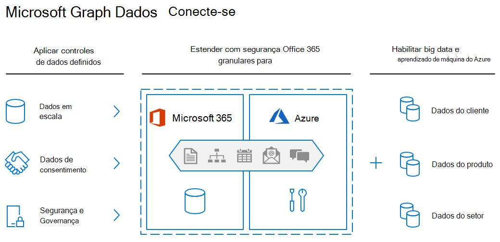

<!-- markdownlint-disable MD002 MD041 -->

A Conexão de Dados do Microsoft Graph aumenta o modelo transacional do Microsoft Graph com uma maneira inteligente de acessar dados avançados em escala. Os dados abordam como os trabalhadores se comunicam, colaboram e gerenciam seu tempo em todos os aplicativos e serviços no Microsoft 365. Ideal para big data e aprendizado de máquina, A Conexão de Dados permite que você desenvolva aplicativos para análise, inteligência e otimização de processos de negócios, estendendo dados do Microsoft 365 para o Azure. Ao integrar desta forma, você poderá aproveitar o vasto conjunto de computação, armazenamento no Azure, mantendo a conformidade com os padrões do setor e mantendo seus dados seguros.

A Conexão de Dados do Microsoft Graph usa o Azure Data Factory para copiar dados do Microsoft 365 para o armazenamento do seu aplicativo em intervalos configuráveis. Ele também fornece um conjunto de ferramentas para simplificar a entrega desses dados para o Microsoft Azure, permitindo que você acesse as ferramentas de desenvolvimento e hospedagem mais aplicáveis disponíveis. A Conexão de Dados também concede um modelo de controle e consentimento mais granular: você pode gerenciar dados, ver quem está acessando e solicitar propriedades específicas de uma entidade. Isso aprimora o modelo do Microsoft Graph, que concede ou nega acesso a aplicativos a entidades inteiras.

Você pode usar o Data Connect para habilitar cenários de machine learning para sua organização. Nesses cenários, você pode criar aplicações que forneçam informações valiosas aos seus participantes, treinar modelos de aprendizado de máquina e até mesmo realizar previsões com base em grandes quantidades de dados adquiridos.

## Introdução

Neste tutorial, você criará seu primeiro aplicativo Microsoft Graph Data Connect. Emocionante, certo? Também achamos isso! Para começar, você precisará configurar algumas coisas primeiro.

### Pré-requisitos

Para concluir este laboratório, você precisará das seguintes assinaturas ou licenças.

1. **Locação do Microsoft 365**

   - Se você não tiver um, receberá um (gratuitamente) ins inscrever-se no Programa para Desenvolvedores do [Microsoft 365](https://developer.microsoft.com/microsoft-365/dev-program).
   - Vários usuários do Microsoft 365 com emails enviados e recebidos.
   - Acesso a pelo menos duas contas que atendem aos seguintes requisitos:
      - Deve ter a **Administrador global** função atribuída.
      - Deve ter acesso ao Administração Microsoft 365 Central.

1. **Assinatura do Microsoft Azure**

   - Se você não tiver um, poderá obter um (gratuitamente) em nosso [site do Azure](https://azure.microsoft.com/free/).
   - A conta usada para entrar deve **ter Administrador global função** atribuída a ela.
   - A assinatura do Azure deve estar no mesmo locatário que o locatário do Microsoft 365, pois o Graph Data Connect só exportará dados para uma assinatura do Azure no mesmo locatário, não entre locatários.
   - Seus locatários do Microsoft 365 e do Azure devem estar na mesma Microsoft Azure Active Directory locatário.

1. Verifique se você tem [o Visual Studio](https://visualstudio.microsoft.com/vs/) instalado em seu computador de desenvolvimento.

> [!NOTE]
> As capturas de tela e os exemplos usados neste laboratório são de um locatário de teste do Microsoft 365 com email de exemplo de usuários de teste. Você pode usar seu próprio locatário do Microsoft 365 para executar as mesmas etapas. Nenhum dado é gravado no Microsoft 365. Uma cópia dos dados de email é extraída de todos os usuários em um locatário do Microsoft 365 e copiada para uma conta do Armazenamento de Blobs do Azure que você mantém o controle sobre quem tem acesso aos dados no Armazenamento de Blobs do Azure.
