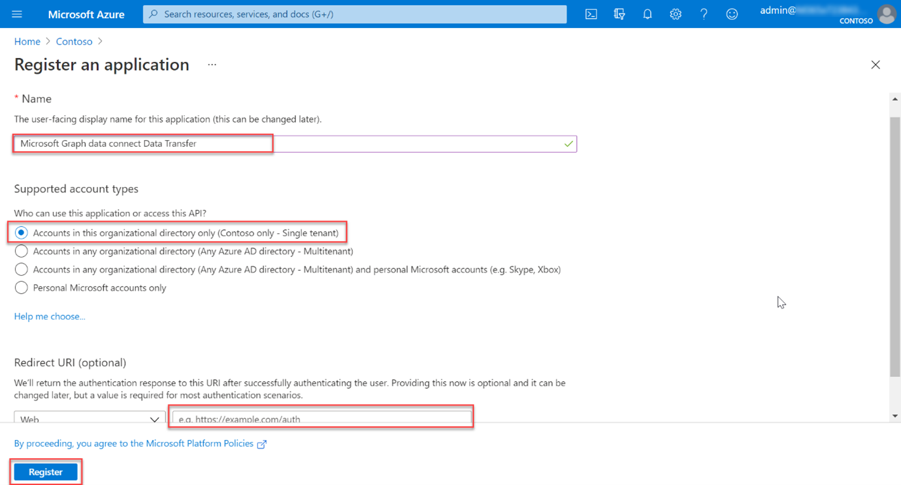

<!-- markdownlint-disable MD002 MD041 -->

Neste exercício, você criará, executará e aprovará um pipeline do Azure Data Factory para extrair dados do Microsoft 365 para um Blob de Armazenamento do Azure para processamento adicional.

## Criar um registro Microsoft Azure Active Directory aplicativo

A primeira etapa é criar um aplicativo Azure AD que será usado como a entidade de segurança para executar o processo de extração de dados.

1. Abra um navegador e vá para o [Portal do Azure](https://portal.azure.com/).

1. Entre usando uma conta com direitos **Administrador global** seus locatários do Azure e do Microsoft 365.

1. Na barra lateral de navegação, selecione **Azure Active Directory** (Azure AD).

1. Na página Azure AD Visão geral, selecione **Registros de aplicativo** **na seção Gerenciar** do menu.

1. Selecione o **botão Novo registro** .

    

1. Use os valores a seguir para criar um novo aplicativo Azure AD e selecione **Registrar**.

   - **Nome**: Transferência de Dados do Microsoft Graph Data Connect
   - **Tipos de conta com suporte**: contas somente neste diretório organizacional.
   - **URI de redirecionamento**: deixe os valores padrão.

    

1. Localize **a ID do Aplicativo (cliente)** e copie-a, pois você precisará dela posteriormente neste tutorial. Isso será chamado de ID da entidade de serviço.

1. Localize **a ID do Diretório (** locatário) e copie-a, pois você precisará dela posteriormente neste tutorial. Isso será chamado de ID de locatário.

1. Na navegação da barra lateral, selecione **Certificados e segredos em** **Gerenciar**.

1. Selecione o **botão Novo segredo do cliente**. *Defina a* Descrição como qualquer nome, **defina Expira** como qualquer valor na lista suspensa e escolha **Adicionar**.

    

    - Depois que o segredo do cliente for criado, salve o Valor  em algum lugar seguro, pois ele não estará mais disponível posteriormente e você precisará criar um novo.
    - Isso será referenciado como a chave de entidade de serviço.

1. Na barra lateral de navegação do aplicativo, selecione **Proprietários**.

1. Verifique se sua conta está listada como proprietário do aplicativo. Se ele não estiver listado como proprietário, adicione-o.

    
